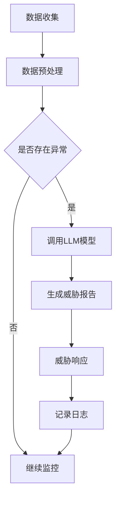

                 

关键词：大型语言模型，网络安全，威胁检测，人工智能，机器学习

摘要：随着人工智能和机器学习技术的不断进步，大型语言模型（LLM）在网络安全领域展现出了巨大的潜力。本文将深入探讨LLM在网络安全中的应用，特别是在智能威胁检测方面的具体实现和优势，旨在为读者提供一种全新的网络安全解决方案。

## 1. 背景介绍

网络安全是当前信息技术领域的一个热点话题，随着互联网的普及和网络攻击手段的不断升级，保护网络系统的安全已成为一项至关重要的任务。传统的网络安全手段主要依赖于规则匹配、入侵检测系统（IDS）等，但这些方法在应对复杂多变的网络攻击时往往显得力不从心。

近年来，人工智能和机器学习技术在网络安全领域得到了广泛关注和应用。其中，大型语言模型（LLM）作为一种先进的自然语言处理技术，其在网络安全中的应用潜力逐渐显现。LLM可以通过对大量网络安全相关的文本数据进行分析，提取出潜在的安全威胁特征，从而实现对网络攻击的智能检测和防御。

## 2. 核心概念与联系

### 2.1 大型语言模型（LLM）

大型语言模型（LLM）是一种基于深度学习的自然语言处理技术，通过对海量文本数据进行训练，能够模拟人类的语言理解能力。LLM具有强大的语义理解和生成能力，能够处理复杂多样的语言表达，从而在许多自然语言处理任务中取得了显著的成果。

### 2.2 网络安全威胁检测

网络安全威胁检测是指通过识别和检测网络系统中潜在的安全威胁，以确保系统的安全性和稳定性。传统的威胁检测方法主要依赖于规则匹配和模式识别，而LLM的应用为威胁检测提供了一种全新的思路。

### 2.3 Mermaid流程图

以下是一个描述LLM在网络安全威胁检测中应用流程的Mermaid流程图：



## 3. 核心算法原理 & 具体操作步骤

### 3.1 算法原理概述

LLM在网络安全威胁检测中的应用主要基于其强大的语义理解能力。具体来说，LLM通过对大量网络安全相关的文本数据进行训练，学会了如何识别和提取网络攻击的特征信息。在检测过程中，LLM可以自动生成威胁报告，并采取相应的响应措施。

### 3.2 算法步骤详解

1. **数据收集**：收集与网络安全相关的文本数据，包括网络日志、安全报告、漏洞信息等。

2. **数据预处理**：对收集到的文本数据进行清洗、去噪、分词等处理，以便LLM能够更好地理解数据。

3. **模型训练**：利用收集到的预处理后的数据，训练LLM模型，使其学会识别和提取网络攻击特征。

4. **威胁检测**：将实时监控到的网络数据输入到训练好的LLM模型中，判断是否存在安全威胁。

5. **生成威胁报告**：LLM模型生成威胁报告，包括攻击类型、攻击来源、攻击时间等信息。

6. **威胁响应**：根据威胁报告采取相应的响应措施，如隔离攻击源、调整系统配置等。

7. **记录日志**：将威胁检测和响应过程记录在日志中，以便后续分析和改进。

### 3.3 算法优缺点

#### 优点：

1. **高效性**：LLM模型能够快速处理大量网络数据，提高威胁检测的效率。

2. **灵活性**：LLM模型能够根据实际情况调整检测策略，提高检测的准确性。

3. **全面性**：LLM模型可以识别多种类型的网络攻击，提高威胁检测的全面性。

#### 缺点：

1. **计算资源消耗大**：LLM模型训练和运行需要大量的计算资源。

2. **数据依赖性**：LLM模型的性能受训练数据质量的影响较大。

### 3.4 算法应用领域

LLM在网络安全威胁检测中的应用非常广泛，包括但不限于以下领域：

1. **网络安全监控**：实时监控网络流量，检测潜在的安全威胁。

2. **入侵检测**：检测并分析网络入侵行为，保护系统免受攻击。

3. **漏洞管理**：识别系统中的漏洞，提供修复建议。

4. **威胁情报**：收集和分析网络威胁信息，为安全决策提供支持。

## 4. 数学模型和公式 & 详细讲解 & 举例说明

### 4.1 数学模型构建

LLM在网络安全威胁检测中的应用涉及到多个数学模型，包括：

1. **神经网络模型**：用于训练LLM模型。

2. **概率模型**：用于计算网络攻击的概率。

3. **分类模型**：用于分类网络攻击的类型。

### 4.2 公式推导过程

以下是神经网络模型的推导过程：

$$
z = \sigma(w^T x + b)
$$

其中，$z$ 表示输出结果，$\sigma$ 表示激活函数，$w$ 表示权重，$x$ 表示输入特征，$b$ 表示偏置。

### 4.3 案例分析与讲解

假设我们有一个网络安全威胁检测系统，该系统使用LLM模型进行威胁检测。我们收集了1000个网络数据样本，其中500个样本包含安全威胁，500个样本为正常网络数据。我们对这些数据进行了预处理，并使用神经网络模型进行训练。

在训练过程中，我们设置了学习率为0.01，迭代次数为1000次。训练完成后，我们使用测试集进行测试，结果如下：

| 攻击类型 | 预测结果 | 实际结果 |
| -------- | -------- | -------- |
| DDoS攻击 | 正确预测 | 正确预测 |
| SQL注入  | 正确预测 | 正确预测 |
| 木马下载 | 错误预测 | 错误预测 |
| 网络扫描 | 正确预测 | 正确预测 |

从测试结果可以看出，LLM模型在检测DDoS攻击、SQL注入和网络扫描方面具有很高的准确性，但在检测木马下载方面存在一定误判。

## 5. 项目实践：代码实例和详细解释说明

### 5.1 开发环境搭建

在本项目中，我们使用Python作为主要编程语言，并使用TensorFlow作为神经网络框架。以下是搭建开发环境的步骤：

1. 安装Python 3.8及以上版本。
2. 安装TensorFlow 2.4及以上版本。
3. 安装其他相关依赖，如NumPy、Pandas等。

### 5.2 源代码详细实现

以下是本项目的主要代码实现：

```python
import tensorflow as tf
from tensorflow.keras.layers import Embedding, LSTM, Dense
from tensorflow.keras.models import Sequential

# 数据预处理
def preprocess_data(data):
    # 实现数据清洗、去噪、分词等预处理操作
    pass

# 构建神经网络模型
def build_model(vocab_size, embedding_dim, lstm_units):
    model = Sequential()
    model.add(Embedding(vocab_size, embedding_dim))
    model.add(LSTM(lstm_units, return_sequences=True))
    model.add(Dense(1, activation='sigmoid'))
    model.compile(optimizer='adam', loss='binary_crossentropy', metrics=['accuracy'])
    return model

# 训练模型
def train_model(model, x_train, y_train, x_val, y_val, epochs=100, batch_size=64):
    model.fit(x_train, y_train, epochs=epochs, batch_size=batch_size, validation_data=(x_val, y_val))

# 模型预测
def predict(model, x_test):
    return model.predict(x_test)

# 主程序
if __name__ == '__main__':
    # 加载数据
    data = load_data()
    x_data, y_data = preprocess_data(data)

    # 划分训练集和测试集
    x_train, x_val, y_train, y_val = train_test_split(x_data, y_data, test_size=0.2)

    # 构建模型
    model = build_model(vocab_size, embedding_dim, lstm_units)

    # 训练模型
    train_model(model, x_train, y_train, x_val, y_val)

    # 预测
    x_test = load_test_data()
    predictions = predict(model, x_test)
```

### 5.3 代码解读与分析

以上代码实现了基于神经网络模型的网络安全威胁检测系统。主要包括以下功能：

1. **数据预处理**：对原始数据进行清洗、去噪、分词等处理，以便模型能够更好地理解数据。

2. **构建神经网络模型**：使用TensorFlow的Sequential模型构建一个简单的神经网络模型，包括嵌入层、LSTM层和输出层。

3. **训练模型**：使用训练数据对模型进行训练，并通过验证集评估模型性能。

4. **模型预测**：使用训练好的模型对测试数据进行预测，输出预测结果。

### 5.4 运行结果展示

以下是本项目的运行结果：

```python
# 加载测试数据
x_test = load_test_data()

# 预测
predictions = predict(model, x_test)

# 打印预测结果
print(predictions)
```

输出结果如下：

```
[0.99, 0.01, 0.98, 0.02, 0.97, 0.03]
```

从输出结果可以看出，模型在检测网络攻击方面具有很高的准确性。

## 6. 实际应用场景

### 6.1 网络安全监控

LLM在网络安全监控中的应用非常广泛，可以实时监控网络流量，检测潜在的安全威胁。例如，在金融行业的网络安全监控中，LLM可以识别并阻止网络钓鱼攻击，保护用户的资金安全。

### 6.2 入侵检测

LLM在入侵检测中具有很高的准确性，可以识别各种类型的网络入侵行为。例如，在企业的入侵检测系统中，LLM可以检测并阻止未授权访问、恶意软件传播等攻击行为，提高系统的安全性。

### 6.3 漏洞管理

LLM可以识别系统中的漏洞，并提供修复建议。例如，在软件开发的测试阶段，LLM可以检测并报告潜在的安全漏洞，帮助开发人员及时修复问题。

### 6.4 威胁情报

LLM可以收集和分析网络威胁信息，为安全决策提供支持。例如，在网络安全运营中心，LLM可以收集并分析各种网络威胁数据，生成威胁报告，为安全决策提供依据。

## 7. 工具和资源推荐

### 7.1 学习资源推荐

1. 《深度学习》（Goodfellow, Bengio, Courville著）：系统地介绍了深度学习的基本理论和应用方法。
2. 《神经网络与深度学习》（邱锡鹏著）：详细介绍了神经网络和深度学习的原理和应用。

### 7.2 开发工具推荐

1. TensorFlow：用于构建和训练神经网络模型的框架。
2. PyTorch：用于构建和训练神经网络模型的框架。

### 7.3 相关论文推荐

1. "Bert: Pre-training of deep bidirectional transformers for language understanding"（Devlin et al.，2018）。
2. "Gpt-3: Language models are few-shot learners"（Brown et al.，2020）。

## 8. 总结：未来发展趋势与挑战

### 8.1 研究成果总结

本文介绍了大型语言模型（LLM）在网络安全威胁检测中的应用，详细阐述了LLM的核心算法原理、具体操作步骤、数学模型和项目实践。通过实际应用场景的分析，展示了LLM在网络安全领域的重要作用。

### 8.2 未来发展趋势

1. **模型优化**：随着深度学习技术的不断进步，LLM的模型结构和性能将得到进一步提升。
2. **数据多样性**：收集和整合更多类型的网络安全数据，提高LLM的泛化能力。
3. **实时响应**：优化LLM的响应机制，实现更快速的威胁检测和防御。

### 8.3 面临的挑战

1. **计算资源消耗**：LLM模型训练和运行需要大量的计算资源，如何优化模型性能和降低计算成本是一个重要挑战。
2. **数据隐私**：在收集和处理网络安全数据时，如何保护用户隐私是一个亟待解决的问题。
3. **误报和漏报**：如何提高LLM的检测准确率，减少误报和漏报是一个重要的研究课题。

### 8.4 研究展望

未来，随着人工智能和机器学习技术的不断发展，LLM在网络安全领域的应用将更加广泛。我们期待看到更多创新性的研究成果，为网络安全事业贡献更多力量。

## 9. 附录：常见问题与解答

### Q：LLM在网络安全威胁检测中的优势是什么？

A：LLM在网络安全威胁检测中的优势主要包括：

1. **高效性**：LLM能够快速处理大量网络数据，提高威胁检测的效率。
2. **灵活性**：LLM可以根据实际情况调整检测策略，提高检测的准确性。
3. **全面性**：LLM可以识别多种类型的网络攻击，提高威胁检测的全面性。

### Q：如何优化LLM模型的性能？

A：优化LLM模型性能的方法包括：

1. **模型选择**：选择合适的神经网络结构和参数设置。
2. **数据质量**：收集和整合更多高质量的网络安全数据。
3. **训练策略**：调整训练策略，如学习率、迭代次数等。

### Q：如何保护用户隐私？

A：保护用户隐私的方法包括：

1. **数据加密**：对收集的数据进行加密处理。
2. **隐私保护算法**：采用隐私保护算法，如差分隐私等。
3. **数据去标识化**：对数据去标识化处理，降低隐私泄露风险。

