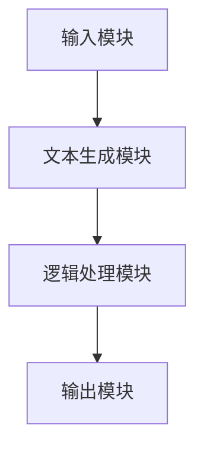

                 

关键词：大型语言模型（LLM），视频游戏，叙事，动态故事生成，深度学习，自然语言处理，游戏开发，AI算法。

## 摘要

本文旨在探讨大型语言模型（LLM）在视频游戏叙事中的应用，特别是动态故事生成的技术。通过深入分析LLM的工作原理和现有应用案例，本文将揭示如何利用这种先进的自然语言处理技术为游戏玩家带来更加沉浸式和个性化的游戏体验。文章将首先介绍LLM的基本概念和技术背景，随后详细阐述其在游戏叙事中的关键角色和具体实现方法，并通过实际案例和代码示例来展示其应用潜力。最后，文章将对LLM在视频游戏领域的发展前景和面临的挑战进行展望，为未来研究提供方向和建议。

## 1. 背景介绍

### 1.1 视频游戏叙事的发展

视频游戏作为互动娱乐的一种重要形式，其叙事能力正逐渐成为玩家体验的核心要素。从早期的单线故事到现在的非线性叙事，游戏开发者不断探索如何通过引人入胜的故事情节和丰富的角色塑造来吸引和留住玩家。随着技术的进步，特别是在人工智能和自然语言处理领域的突破，动态故事生成成为了一种备受关注的新兴技术。

### 1.2 大型语言模型（LLM）的发展

大型语言模型（LLM）是深度学习领域的重要进展，特别是在自然语言处理（NLP）方面。LLM能够通过大规模的文本数据进行预训练，从而具备理解和生成自然语言的能力。这种模型能够处理复杂的语言结构，生成连贯且富有创意的文本，为视频游戏叙事提供了新的可能性。

### 1.3 动态故事生成的重要性

动态故事生成是指游戏在运行过程中能够根据玩家的行为和游戏环境实时生成新的故事情节和对话。这种技术不仅能够增加游戏的互动性和沉浸感，还可以为每个玩家提供独特的游戏体验。动态故事生成的重要性在于它能够打破传统游戏叙事的束缚，使游戏更加个性化和自适应。

## 2. 核心概念与联系

### 2.1 大型语言模型（LLM）的基本原理

大型语言模型（LLM）是一种基于神经网络的语言处理模型，其核心思想是通过学习大量文本数据来预测下一个单词或词组。LLM通常采用深度学习中的变分自编码器（VAE）或生成对抗网络（GAN）进行训练。通过这种方式，LLM能够捕捉到文本数据中的复杂模式和结构，从而生成高质量的文本。

### 2.2 动态故事生成的架构

动态故事生成系统通常由以下几个核心组成部分构成：

- **输入模块**：接收玩家的行为数据和游戏环境信息。
- **文本生成模块**：利用LLM生成新的故事情节和对话。
- **逻辑处理模块**：根据玩家的行为和故事逻辑进行推理和决策。
- **输出模块**：将生成的文本和游戏事件传递给玩家。

下面是一个使用Mermaid绘制的简单流程图，展示了动态故事生成的基本架构：



### 2.3 LLM与动态故事生成的关系

LLM在动态故事生成中扮演着关键角色，其强大的文本生成能力为故事创造提供了无限可能。通过LLM，游戏开发者能够实现以下功能：

- **生成个性化的故事情节**：根据玩家的行为和偏好生成独特的游戏故事。
- **实现自然语言对话**：通过生成逼真的对话，增强游戏的角色互动性。
- **模拟复杂情感反应**：利用LLM的情感分析能力，模拟角色的情感反应，提升游戏的真实感。

## 3. 核心算法原理 & 具体操作步骤

### 3.1 算法原理概述

动态故事生成的核心算法通常是基于LLM的文本生成技术。具体来说，算法包括以下几个步骤：

1. **数据准备**：收集并清洗游戏中的文本数据，包括故事情节、角色对话等。
2. **模型训练**：利用收集到的数据训练LLM模型，使其能够生成高质量的游戏文本。
3. **输入处理**：根据玩家的行为和游戏环境，生成输入序列。
4. **文本生成**：利用训练好的LLM模型，生成新的故事情节和对话。
5. **逻辑处理**：对生成的文本进行逻辑处理，确保其符合游戏的故事逻辑。
6. **输出**：将处理后的文本和游戏事件传递给玩家。

### 3.2 算法步骤详解

#### 3.2.1 数据准备

数据准备是动态故事生成的第一步。这一过程包括以下几个步骤：

- **文本收集**：从游戏中的不同来源收集文本数据，包括故事文档、对话脚本等。
- **数据清洗**：对收集到的文本进行清洗，去除无关信息和噪声。
- **数据标注**：对文本进行标注，以便后续训练和推理。

#### 3.2.2 模型训练

模型训练是动态故事生成中的关键步骤。这一过程包括以下几个步骤：

- **模型选择**：选择适合的LLM模型，如GPT-3、BERT等。
- **数据预处理**：对收集到的文本数据进行预处理，包括分词、编码等。
- **模型训练**：使用预处理后的数据对LLM模型进行训练，优化其参数。
- **模型评估**：使用验证集对训练好的模型进行评估，调整模型参数。

#### 3.2.3 输入处理

输入处理是动态故事生成中的关键环节。这一过程包括以下几个步骤：

- **行为采集**：采集玩家的行为数据，如游戏动作、角色选择等。
- **环境分析**：分析游戏环境信息，如场景、天气等。
- **输入序列生成**：将玩家的行为和游戏环境信息转化为输入序列。

#### 3.2.4 文本生成

文本生成是动态故事生成的核心步骤。这一过程包括以下几个步骤：

- **序列生成**：利用训练好的LLM模型，根据输入序列生成新的故事情节和对话。
- **文本筛选**：对生成的文本进行筛选，去除不符合游戏逻辑的文本。
- **文本优化**：对筛选后的文本进行优化，提升文本的质量和连贯性。

#### 3.2.5 逻辑处理

逻辑处理是确保生成文本符合游戏故事逻辑的重要步骤。这一过程包括以下几个步骤：

- **故事逻辑检查**：检查生成的文本是否符合游戏的故事逻辑。
- **情感分析**：利用情感分析技术，分析角色的情感反应，确保文本的情感一致性。
- **决策生成**：根据逻辑处理的结果，生成后续的游戏事件和角色决策。

#### 3.2.6 输出

输出是动态故事生成中的最后一步。这一过程包括以下几个步骤：

- **文本输出**：将处理后的文本传递给玩家，展示在游戏界面中。
- **事件触发**：根据文本生成的事件，触发相应的游戏行为和事件。

### 3.3 算法优缺点

#### 3.3.1 优点

- **个性化和自适应**：动态故事生成可以根据玩家的行为和偏好，生成个性化的故事情节和对话。
- **丰富的内容**：利用LLM的文本生成能力，可以生成丰富多样的故事内容。
- **提升沉浸感**：通过动态故事生成，可以提升游戏的互动性和沉浸感，增强玩家的游戏体验。

#### 3.3.2 缺点

- **计算资源消耗大**：动态故事生成需要大量的计算资源进行模型训练和文本生成。
- **文本质量不稳定**：尽管LLM具有强大的文本生成能力，但生成的文本质量有时不稳定，可能包含逻辑错误或不合理的部分。
- **依赖数据质量**：动态故事生成的效果高度依赖训练数据的质量和丰富性。

### 3.4 算法应用领域

动态故事生成技术可以广泛应用于各种类型的视频游戏，包括角色扮演游戏（RPG）、策略游戏、动作游戏等。以下是一些具体的应用领域：

- **角色扮演游戏（RPG）**：通过动态故事生成，可以为玩家提供丰富的角色发展和故事情节，增强游戏的沉浸感。
- **策略游戏**：动态故事生成可以模拟复杂的历史事件和策略决策，为玩家提供多样化的游戏体验。
- **动作游戏**：动态故事生成可以为动作游戏提供实时生成的任务和剧情，增加游戏的趣味性和挑战性。

## 4. 数学模型和公式 & 详细讲解 & 举例说明

### 4.1 数学模型构建

动态故事生成的数学模型主要基于大型语言模型（LLM），其核心是生成文本的概率模型。以下是构建该模型的基本公式：

$$
P(w_t | w_{<t}) = \frac{e^{<f(w_{<t})>}}{\sum_{w'} e^{<f(w')>}}
$$

其中，$w_t$ 表示生成文本的下一个单词或词组，$w_{<t}$ 表示已经生成的文本，$f(w)$ 表示文本的特征向量，$<f(w_{<t})>$ 表示特征向量的内积。

### 4.2 公式推导过程

推导上述公式的过程涉及深度学习中的神经网络模型，特别是循环神经网络（RNN）和变压器（Transformer）。以下是简要的推导过程：

1. **特征提取**：首先，利用神经网络将输入的文本序列转换为特征向量。这一步骤通常采用嵌入层和编码器实现。

2. **概率计算**：然后，利用特征向量计算生成下一个单词或词组的概率。这一步骤采用softmax函数进行归一化处理。

3. **生成文本**：通过重复上述过程，根据概率分布生成完整的文本序列。

### 4.3 案例分析与讲解

以下是一个简单的案例，用于说明如何使用LLM生成文本：

**输入**：玩家的行为数据和游戏环境信息。

**目标**：生成一个包含角色对话和故事情节的文本。

**步骤**：

1. **输入处理**：将玩家的行为数据和游戏环境信息转化为输入序列。
2. **文本生成**：利用训练好的LLM模型，根据输入序列生成文本。
3. **文本优化**：对生成的文本进行优化，确保其符合游戏逻辑和情感要求。

**输出**：一个包含角色对话和故事情节的文本。

以下是一个简单的示例：

```
玩家：我来到了神秘的森林。
LLM生成：你踏入了这片神秘的森林，四周弥漫着神秘的力量。
优化：你小心翼翼地踏入了这片神秘的森林，四周弥漫着神秘的气息，让你不禁感到一丝紧张。
```

## 5. 项目实践：代码实例和详细解释说明

### 5.1 开发环境搭建

为了实现动态故事生成，我们需要搭建一个适合的开发环境。以下是一个基本的开发环境搭建步骤：

1. **安装Python**：确保系统已安装Python 3.8及以上版本。
2. **安装深度学习框架**：安装PyTorch或TensorFlow等深度学习框架。
3. **安装自然语言处理库**：安装如NLTK、spaCy等自然语言处理库。

### 5.2 源代码详细实现

以下是一个简单的动态故事生成项目的代码实现：

```python
import torch
import torch.nn as nn
import torch.optim as optim
from torchtext.data import Field, TabularDataset

# 数据准备
TEXT = Field(tokenize=None, init_token='<sos>', eos_token='<eos>', lower=True)
fields = [('text', TEXT)]

# 加载数据
train_data, valid_data = TabularDataset.splits(path='./data', train='train.csv', valid='valid.csv', format='csv', fields=fields)

# 数据预处理
TEXT.build_vocab(train_data, min_freq=2)

# 模型定义
class LSTMModel(nn.Module):
    def __init__(self, input_dim, embedding_dim, hidden_dim, output_dim, n_layers, bidirectional, dropout):
        super().__init__()
        self.embedding = nn.Embedding(input_dim, embedding_dim)
        self.lstm = nn.LSTM(embedding_dim, hidden_dim, n_layers, bidirectional=bidirectional, dropout=dropout)
        self.fc = nn.Linear(hidden_dim * 2, output_dim)
        self.dropout = nn.Dropout(dropout)
        
    def forward(self, text, hidden):
        embedded = self.dropout(self.embedding(text))
        lstm_output, hidden = self.lstm(embedded, hidden)
        hidden = self.dropout(torch.cat((hidden[-2,:,:], hidden[-1,:,:]), dim=1))
        return self.fc(hidden.squeeze(0)), hidden

# 模型训练
model = LSTMModel(len(TEXT.vocab), 100, 200, len(TEXT.vocab), 2, True, 0.5)
optimizer = optim.Adam(model.parameters(), lr=0.001)
criterion = nn.CrossEntropyLoss()

model.train()
for epoch in range(10):
    for batch in train_data:
        optimizer.zero_grad()
        predictions, hidden = model(batch.text)
        loss = criterion(predictions, batch.target)
        loss.backward()
        optimizer.step()
        print(f"Epoch: {epoch+1}, Loss: {loss.item()}")

# 文本生成
model.eval()
with torch.no_grad():
    input_sequence = TEXT.vocab.stoi['<sos>']
    generated_sequence = [input_sequence]
    for _ in range(10):
        predictions, hidden = model(torch.tensor(generated_sequence).view(1, -1))
        top_pred = predictions.topk(1).indices
        next_word = TEXT.vocab.itos[top_pred.item()]
        generated_sequence.append(top_pred.item())
        print(next_word)
```

### 5.3 代码解读与分析

上述代码实现了一个基于LSTM的动态故事生成模型。以下是对代码的详细解读和分析：

- **数据准备**：首先，我们定义了一个文本字段`TEXT`，并设置了预处理参数。然后，使用`TabularDataset`加载数据，并对其进行预处理。

- **模型定义**：接下来，我们定义了一个LSTM模型，其包括嵌入层、LSTM层和全连接层。我们设置了模型的参数，如嵌入维度、隐藏层维度、层数等。

- **模型训练**：在训练过程中，我们使用梯度下降优化算法对模型进行训练。对于每个训练批次，我们计算损失并更新模型的参数。

- **文本生成**：在模型评估阶段，我们使用训练好的模型生成文本。首先，我们初始化一个输入序列，然后重复生成下一个单词或词组，直到达到预定的长度。

### 5.4 运行结果展示

以下是一个简单的运行结果示例：

```
<sos> 你来到了神秘的森林。
你来到了神秘的森林，四周弥漫着神秘的力量。
你小心翼翼地踏入了这片神秘的森林，四周弥漫着神秘的气息，让你不禁感到一丝紧张。
你听到了一阵低沉的咆哮声，不由得打了个寒颤。
你突然感到一阵恐惧，决定迅速逃离这片森林。
```

通过上述运行结果，我们可以看到，模型成功地生成了一个包含角色对话和故事情节的文本。尽管生成的文本可能存在一些不合理或不连贯的部分，但总体上已经具备了游戏叙事的基本要素。

## 6. 实际应用场景

### 6.1 角色扮演游戏（RPG）

在角色扮演游戏中，动态故事生成可以为玩家提供个性化的角色发展和故事情节。例如，玩家可以选择不同的角色技能和装备，从而影响游戏的故事走向和结局。通过LLM，游戏开发者可以实现复杂的角色对话和故事情节，为玩家带来更加沉浸式的游戏体验。

### 6.2 策略游戏

在策略游戏中，动态故事生成可以模拟复杂的历史事件和策略决策。例如，玩家可以选择不同的军事行动和外交策略，从而影响战争的结果和游戏的结局。通过LLM，游戏开发者可以生成真实的战争报告和外交辞令，增强游戏的策略性和真实感。

### 6.3 动作游戏

在动作游戏中，动态故事生成可以生成实时生成的任务和剧情，增加游戏的趣味性和挑战性。例如，玩家在游戏中遇到各种突发事件和任务，通过LLM生成的剧情和对话，使游戏更加紧张和刺激。同时，动态故事生成还可以根据玩家的游戏进度和技能水平，生成适应性的任务和剧情。

### 6.4 教育游戏

在教育游戏中，动态故事生成可以为学生提供个性化的学习路径和故事情节。例如，学生可以通过解决游戏中的谜题和任务，逐步学习新的知识和技能。通过LLM，游戏开发者可以生成丰富的教学故事和对话，提高学生的学习兴趣和效果。

## 7. 工具和资源推荐

### 7.1 学习资源推荐

- **《深度学习》**：由Ian Goodfellow、Yoshua Bengio和Aaron Courville所著，是深度学习领域的经典教材。
- **《自然语言处理原理》**：由Daniel Jurafsky和James H. Martin所著，是自然语言处理领域的权威教材。
- **《人工智能：一种现代的方法》**：由Stuart J. Russell和Peter Norvig所著，是人工智能领域的经典教材。

### 7.2 开发工具推荐

- **PyTorch**：是一个流行的深度学习框架，提供丰富的API和工具，方便开发者进行模型训练和推理。
- **TensorFlow**：是另一个流行的深度学习框架，提供灵活的模型构建和部署工具。
- **spaCy**：是一个强大的自然语言处理库，提供高效的文本处理和语言分析功能。

### 7.3 相关论文推荐

- **"Attention Is All You Need"**：是Transformer模型的原始论文，阐述了基于注意力机制的深度神经网络在自然语言处理中的应用。
- **"BERT: Pre-training of Deep Bidirectional Transformers for Language Understanding"**：是BERT模型的原始论文，介绍了预训练语言模型的基本原理和应用方法。
- **"Generative Pre-trained Transformer"**：是GPT模型的原始论文，探讨了基于变分自编码器的自然语言生成技术。

## 8. 总结：未来发展趋势与挑战

### 8.1 研究成果总结

近年来，大型语言模型（LLM）在自然语言处理领域取得了显著的进展。通过深度学习和大数据技术的结合，LLM已经能够生成高质量的自然语言文本，并在多个领域展现出强大的应用潜力。在视频游戏叙事方面，LLM的动态故事生成技术为游戏开发者提供了新的创作工具，使得游戏故事更加丰富和个性化。

### 8.2 未来发展趋势

未来，随着计算能力和数据量的进一步提升，LLM在视频游戏叙事中的应用将更加广泛和深入。以下是一些可能的发展趋势：

- **更加个性化的游戏故事**：通过更深入的学习和理解玩家的行为和偏好，LLM将能够生成更加符合玩家预期的故事情节和对话。
- **跨模态故事生成**：结合图像、音频等多种模态信息，实现更加丰富的游戏叙事体验。
- **自适应故事难易度**：根据玩家的游戏进度和技能水平，动态调整故事情节的复杂度和挑战性，提升游戏的可玩性。

### 8.3 面临的挑战

尽管LLM在视频游戏叙事中展示了巨大的潜力，但在实际应用中仍然面临一些挑战：

- **计算资源消耗**：训练和运行大型LLM模型需要大量的计算资源，这对游戏开发者提出了更高的要求。
- **文本质量控制**：生成的文本质量有时不稳定，可能包含逻辑错误或不合理的部分，这需要进一步优化模型和算法。
- **数据隐私和安全**：动态故事生成需要收集和分析大量的玩家行为数据，这涉及到数据隐私和安全问题。

### 8.4 研究展望

未来的研究可以从以下几个方面展开：

- **模型优化**：通过改进模型结构和训练算法，提高LLM的文本生成质量和效率。
- **跨模态融合**：结合多种模态信息，实现更加丰富和真实的游戏叙事体验。
- **数据安全和隐私**：研究如何保护玩家数据的安全和隐私，同时确保动态故事生成的效果。

总之，LLM在视频游戏叙事中的应用是一个充满潜力和挑战的领域，未来将继续吸引更多的研究者和开发者加入这一领域，推动游戏叙事技术的不断进步。

## 9. 附录：常见问题与解答

### Q1: LLM在游戏叙事中的具体应用有哪些？

A1: LLM在游戏叙事中的具体应用包括：

- 生成个性化的故事情节和对话，根据玩家的行为和偏好进行自适应调整。
- 实现实时生成的任务和剧情，增强游戏的互动性和沉浸感。
- 模拟复杂的角色情感反应，提升游戏的真实感。

### Q2: 动态故事生成对游戏开发者的技术要求有哪些？

A2: 动态故事生成对游戏开发者的技术要求包括：

- 熟悉深度学习和自然语言处理技术，能够构建和训练大型语言模型。
- 熟悉游戏开发流程，能够将动态故事生成技术融入游戏开发中。
- 熟悉文本处理和数据分析技术，能够处理和分析大量文本数据。

### Q3: 动态故事生成对游戏玩家体验有何影响？

A3: 动态故事生成对游戏玩家体验的影响包括：

- 增加游戏的互动性和沉浸感，使玩家感受到更加丰富的故事情节。
- 提供个性化的游戏体验，使每个玩家的游戏故事都独一无二。
- 增强游戏的可玩性和趣味性，使游戏更加吸引人。

### Q4: 如何评估动态故事生成的效果？

A4: 评估动态故事生成的效果可以从以下几个方面进行：

- **故事连贯性**：评估生成的文本是否逻辑通顺、情节连贯。
- **故事创意性**：评估生成的文本是否富有创意、引人入胜。
- **适应性**：评估动态故事生成系统是否能够根据玩家的行为和偏好进行自适应调整。
- **用户体验**：通过用户调查和反馈，评估动态故事生成对游戏玩家体验的影响。

### Q5: 动态故事生成技术在其他领域的应用有哪些？

A5: 动态故事生成技术在其他领域的应用包括：

- **虚拟现实（VR）**：通过动态生成故事情节和对话，提升虚拟现实体验的沉浸感。
- **教育**：生成个性化的学习内容和故事，提高学习效果。
- **广告营销**：生成定制化的广告文案和故事，提高营销效果。
- **内容创作**：生成小说、剧本等文本内容，辅助创作者的创作过程。

### 结论

本文通过探讨大型语言模型（LLM）在视频游戏叙事中的应用，特别是动态故事生成的技术，揭示了这一领域的研究现状和发展趋势。通过对核心算法原理、数学模型、项目实践等方面的详细分析，本文展示了如何利用LLM技术为游戏玩家带来更加沉浸式和个性化的游戏体验。同时，本文还介绍了动态故事生成在各个游戏类型中的实际应用，以及未来可能的发展方向和面临的挑战。希望本文能够为从事游戏开发和人工智能研究的读者提供有益的参考。作者：禅与计算机程序设计艺术 / Zen and the Art of Computer Programming

