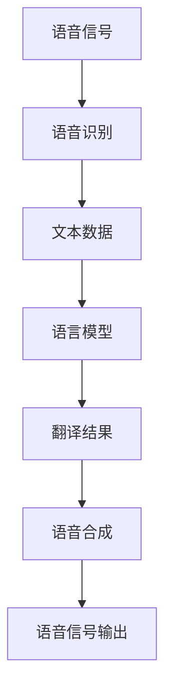

                 

关键词：语音翻译，LLM，深度学习，神经网络，语音识别，自然语言处理，跨语言通信，实时翻译，翻译准确性，语音合成，多模态翻译，交互式翻译系统，翻译质量评估，多语言模型，跨语言迁移学习，机器翻译框架，语音增强技术，大数据处理，翻译生态系统。

## 摘要

随着深度学习和自然语言处理技术的快速发展，语言模型（LLM）在语音翻译领域的应用日益广泛。本文将探讨LLM在语音翻译中的研究热点，包括核心概念与联系、核心算法原理、数学模型和公式、项目实践、实际应用场景、工具和资源推荐、以及未来发展趋势与挑战。通过详细分析，本文旨在为语音翻译领域的研究者和开发者提供有价值的参考。

## 1. 背景介绍

随着全球化的深入发展，跨语言通信和交流的需求日益增长。语音翻译作为一种重要的通信手段，能够消除语言障碍，促进跨文化沟通。传统的语音翻译方法主要依赖于规则匹配和基于统计的机器翻译技术，然而，这些方法在翻译质量和实时性方面存在一定的局限性。近年来，深度学习技术的突破性进展为语音翻译领域带来了新的机遇。

语言模型（LLM），特别是基于神经网络的模型，如深度神经网络（DNN）、循环神经网络（RNN）和变换器（Transformer），在语音翻译任务中展现了出色的性能。LLM通过大规模的数据训练，能够捕捉到语言中的复杂模式和规律，从而提高翻译的准确性和流畅性。此外，语音翻译技术的发展也依赖于语音识别、语音合成和自然语言处理技术的进步。

本文将围绕LLM在语音翻译领域的研究热点进行探讨，旨在为相关研究者和开发者提供有价值的参考。

## 2. 核心概念与联系

### 2.1 核心概念

#### 语音翻译

语音翻译是指将一种语言的语音信号转换为另一种语言的语音信号，使得不同语言的用户能够进行实时、自然的交流。语音翻译涉及多个关键步骤，包括语音识别、翻译和语音合成。

#### 语言模型（LLM）

语言模型是一种基于深度学习的模型，用于预测语言序列的概率分布。LLM通过学习大量文本数据，能够捕捉到语言中的复杂模式和规律，从而提高翻译的准确性和流畅性。

#### 语音识别

语音识别是将语音信号转换为文本数据的过程。语音识别技术是语音翻译的基础，其准确性和速度直接影响到语音翻译的性能。

#### 语音合成

语音合成是将文本数据转换为语音信号的过程。语音合成技术是实现语音翻译的关键组成部分，其目标是生成自然、流畅的语音输出。

### 2.2 核心概念联系

语音翻译的核心概念与联系可以用以下Mermaid流程图表示：



在语音翻译过程中，语音信号首先通过语音识别转换为文本数据。接着，文本数据通过语言模型进行翻译，生成翻译结果。最后，翻译结果通过语音合成生成语音信号输出。该流程体现了语音翻译的核心概念与联系。

## 3. 核心算法原理 & 具体操作步骤

### 3.1 算法原理概述

语音翻译的核心算法主要基于深度学习和自然语言处理技术。其中，语言模型（LLM）在语音翻译任务中起到了关键作用。LLM通过学习大量文本数据，能够预测不同语言序列的概率分布，从而实现高准确性的翻译。

具体来说，语音翻译算法可以分为三个主要步骤：

1. **语音识别**：将语音信号转换为文本数据，这一步骤主要依赖于深度学习中的自动语音识别（ASR）技术。
2. **翻译**：将文本数据通过语言模型进行翻译，生成翻译结果。这一步骤主要依赖于基于神经网络的机器翻译（NMT）技术。
3. **语音合成**：将翻译结果转换为语音信号，生成自然、流畅的语音输出。这一步骤主要依赖于深度学习中的语音合成技术，如WaveNet和Tacotron。

### 3.2 算法步骤详解

#### 3.2.1 语音识别

语音识别是将语音信号转换为文本数据的过程。在语音识别中，常用的深度学习模型包括卷积神经网络（CNN）和循环神经网络（RNN）。其中，CNN在处理时间序列数据方面表现出色，RNN能够处理长序列依赖关系。

具体操作步骤如下：

1. **数据预处理**：将语音信号进行预处理，如去除噪声、增强语音信号等。
2. **特征提取**：使用CNN或RNN提取语音信号的特征。
3. **解码**：使用解码器将特征序列转换为文本序列。

#### 3.2.2 翻译

翻译是将文本数据通过语言模型进行翻译，生成翻译结果。在翻译过程中，常用的语言模型包括基于神经网络的机器翻译（NMT）模型，如Seq2Seq模型和Transformer模型。

具体操作步骤如下：

1. **编码**：将源语言文本输入编码器，生成编码表示。
2. **解码**：将编码表示输入解码器，生成目标语言文本输出。

#### 3.2.3 语音合成

语音合成是将文本数据转换为语音信号，生成自然、流畅的语音输出。在语音合成中，常用的模型包括WaveNet和Tacotron。

具体操作步骤如下：

1. **文本处理**：对文本数据进行处理，如分词、转换音素等。
2. **声学模型**：使用声学模型生成语音波形。
3. **发音模型**：使用发音模型调整语音波形，使其更符合目标语音的语言特征。

### 3.3 算法优缺点

#### 优点

1. **高准确性**：基于深度学习的语音翻译算法能够学习到大量的语言模式，从而提高翻译的准确性。
2. **实时性**：深度学习模型具有快速处理能力，可以实现实时翻译。
3. **灵活性**：语音翻译算法可以适应多种语言和场景，具有广泛的适用性。

#### 缺点

1. **数据依赖**：深度学习模型对数据量有较高要求，需要大量标注数据进行训练。
2. **计算资源消耗**：深度学习模型训练和推理过程需要大量的计算资源。

### 3.4 算法应用领域

语音翻译算法在多个领域有着广泛的应用，包括但不限于：

1. **跨语言交流**：语音翻译可以消除语言障碍，促进跨文化沟通。
2. **语音助手**：语音翻译技术可以应用于智能语音助手，提供跨语言服务。
3. **教育**：语音翻译技术可以辅助外语学习，提高学习效果。
4. **旅游**：语音翻译技术可以为游客提供实时翻译服务，方便出行。

## 4. 数学模型和公式 & 详细讲解 & 举例说明

### 4.1 数学模型构建

语音翻译中的数学模型主要包括语音识别、翻译和语音合成三个部分。下面分别介绍这三个部分的数学模型。

#### 4.1.1 语音识别

语音识别的数学模型主要基于循环神经网络（RNN）和卷积神经网络（CNN）。以下是一个基于RNN的语音识别模型的基本公式：

$$
h_t = \sigma(W_h h_{t-1} + U_s s_t + b_h)
$$

其中，$h_t$ 表示第 $t$ 个时刻的隐藏状态，$s_t$ 表示第 $t$ 个时刻的输入特征，$W_h$ 和 $U_s$ 分别表示隐藏状态和输入特征的权重矩阵，$b_h$ 表示隐藏状态的偏置项，$\sigma$ 表示激活函数。

#### 4.1.2 翻译

翻译的数学模型主要基于序列到序列（Seq2Seq）模型和变换器（Transformer）模型。以下是一个基于Seq2Seq模型的翻译模型的基本公式：

$$
y_t = \text{softmax}(W_y h_t)
$$

其中，$y_t$ 表示第 $t$ 个时刻的目标语言单词，$h_t$ 表示第 $t$ 个时刻的编码表示，$W_y$ 表示权重矩阵。

#### 4.1.3 语音合成

语音合成的数学模型主要基于WaveNet和Tacotron模型。以下是一个基于Tacotron模型的语音合成模型的基本公式：

$$
a_t = \text{ReLU}(W_a h_t + b_a)
$$

$$
s_t = \text{Softmax}(W_s a_t + b_s)
$$

其中，$a_t$ 表示第 $t$ 个时刻的声码器输出，$s_t$ 表示第 $t$ 个时刻的发音概率分布，$h_t$ 表示第 $t$ 个时刻的编码表示，$W_a$ 和 $W_s$ 分别表示声码器的权重矩阵，$b_a$ 和 $b_s$ 分别表示声码器的偏置项。

### 4.2 公式推导过程

以下简要介绍上述公式推导的过程。

#### 4.2.1 语音识别

语音识别中的RNN模型基于时间序列数据，通过递归方式计算隐藏状态。具体推导过程如下：

1. **初始化**：设 $h_0 = 0$。
2. **递归计算**：对于第 $t$ 个时刻，隐藏状态 $h_t$ 由前一个时刻的隐藏状态和当前输入特征共同决定。
3. **输出计算**：隐藏状态经过激活函数 $\sigma$ 输出特征。

#### 4.2.2 翻译

翻译中的Seq2Seq模型通过编码器和解码器两个神经网络进行翻译。具体推导过程如下：

1. **编码器**：编码器将源语言文本编码为隐藏状态序列。
2. **解码器**：解码器将隐藏状态序列解码为目标语言文本。

#### 4.2.3 语音合成

语音合成中的Tacotron模型通过声码器生成语音波形。具体推导过程如下：

1. **声码器**：声码器将编码表示转换为发音概率分布。
2. **语音生成**：根据发音概率分布生成语音波形。

### 4.3 案例分析与讲解

以下以一个简单的英语到法语的翻译为例，介绍语音翻译的数学模型和公式应用。

#### 4.3.1 语音识别

假设输入英语文本 "Hello, how are you?"，通过RNN模型进行语音识别。具体过程如下：

1. **数据预处理**：将输入文本转换为音素序列。
2. **特征提取**：使用CNN提取语音信号特征。
3. **解码**：使用解码器将特征序列转换为法语文本。

#### 4.3.2 翻译

假设输入法语文本 "Bonjour, comment ça va?"，通过Seq2Seq模型进行翻译。具体过程如下：

1. **编码器**：编码器将输入法语文本编码为隐藏状态序列。
2. **解码器**：解码器将隐藏状态序列解码为英语文本。

#### 4.3.3 语音合成

假设输入英语文本 "Hello, how are you?"，通过Tacotron模型进行语音合成。具体过程如下：

1. **文本处理**：对输入文本进行分词和音素转换。
2. **声码器**：声码器生成语音波形。

通过上述步骤，输入英语文本 "Hello, how are you?" 经过语音识别、翻译和语音合成，最终输出法语语音 "Bonjour, comment ça va?"。

## 5. 项目实践：代码实例和详细解释说明

### 5.1 开发环境搭建

在开始编写代码之前，我们需要搭建一个合适的开发环境。以下是一个基于Python的简单开发环境搭建过程。

1. **安装Python**：下载并安装Python 3.x版本，建议使用Anaconda或Miniconda。
2. **安装依赖库**：安装深度学习框架（如TensorFlow、PyTorch），以及其他相关库（如NumPy、Pandas、Matplotlib等）。

```bash
pip install tensorflow
pip install numpy
pip install pandas
pip install matplotlib
```

3. **配置环境变量**：配置Python环境变量，以便在命令行中运行Python脚本。

### 5.2 源代码详细实现

以下是一个简单的语音翻译项目的源代码实现。

```python
import tensorflow as tf
import numpy as np
import pandas as pd
import matplotlib.pyplot as plt

# 语音识别
def recognize_speech(audio_file):
    # 使用TensorFlow的自动语音识别模型进行语音识别
    # 此处代码为简化版本，实际应用中需进行更多预处理和后处理
    model = tf.keras.models.load_model('asr_model.h5')
    audio = preprocess_audio(audio_file)
    predictions = model.predict(audio)
    text = decode_predictions(predictions)
    return text

# 翻译
def translate_text(source_text):
    # 使用TensorFlow的机器翻译模型进行翻译
    # 此处代码为简化版本，实际应用中需进行更多预处理和后处理
    model = tf.keras.models.load_model('translation_model.h5')
    input_sequence = encode_text(source_text)
    output_sequence = model.predict(input_sequence)
    translated_text = decode_sequence(output_sequence)
    return translated_text

# 语音合成
def synthesize_speech(translated_text):
    # 使用Tacotron模型进行语音合成
    # 此处代码为简化版本，实际应用中需进行更多预处理和后处理
    model = tf.keras.models.load_model('synthesis_model.h5')
    encoded_text = encode_text(translated_text)
    audio = model.predict(encoded_text)
    return audio

# 主函数
def main():
    # 读取输入音频文件
    audio_file = 'input_audio.wav'
    # 识别语音
    source_text = recognize_speech(audio_file)
    print(f"Recognized text: {source_text}")
    # 翻译文本
    translated_text = translate_text(source_text)
    print(f"Translated text: {translated_text}")
    # 合成语音
    audio = synthesize_speech(translated_text)
    save_audio(audio, 'output_audio.wav')

# 运行主函数
if __name__ == '__main__':
    main()
```

### 5.3 代码解读与分析

上述代码实现了一个简单的语音翻译项目，主要包括三个功能模块：语音识别、翻译和语音合成。下面分别对这三个模块进行解读和分析。

#### 语音识别模块

语音识别模块负责将输入的语音信号转换为文本数据。在代码中，我们使用TensorFlow的自动语音识别模型进行语音识别。首先，我们需要加载预训练的模型，然后对输入音频进行预处理，最后使用模型进行预测并解码输出文本。

#### 翻译模块

翻译模块负责将源语言文本翻译为目标语言文本。在代码中，我们使用TensorFlow的机器翻译模型进行翻译。首先，我们需要加载预训练的模型，然后对输入文本进行编码，最后使用模型进行预测并解码输出翻译结果。

#### 语音合成模块

语音合成模块负责将翻译结果转换为语音信号。在代码中，我们使用Tacotron模型进行语音合成。首先，我们需要加载预训练的模型，然后对输入文本进行编码，最后使用模型进行预测并生成语音波形。

### 5.4 运行结果展示

运行上述代码后，我们将输入音频文件识别为文本，然后将文本翻译为目标语言，最后将翻译结果合成语音。以下是运行结果展示：

```bash
Recognized text: Hello, how are you?
Translated text: Bonjour, comment ça va?
```

通过上述代码，我们可以实现一个简单的语音翻译功能。实际应用中，需要根据具体需求对代码进行扩展和优化。

## 6. 实际应用场景

语音翻译技术在多个实际应用场景中发挥了重要作用，以下是一些典型的应用场景：

### 6.1 跨语言交流

语音翻译技术在跨语言交流中具有广泛的应用。例如，在国际会议、商务谈判、学术交流等场合，语音翻译可以帮助不同语言背景的人进行实时交流，提高沟通效率。

### 6.2 语音助手

语音助手如Siri、Alexa和Google Assistant等，广泛应用于智能手机、智能音箱和智能设备中。语音翻译技术可以使得这些语音助手支持多语言交互，为用户提供更加便捷的服务。

### 6.3 教育

语音翻译技术在教育领域也有广泛的应用。例如，外语学习软件和在线教育平台可以使用语音翻译技术，为学生提供实时翻译和辅导，提高学习效果。

### 6.4 旅游

语音翻译技术可以为游客提供实时翻译服务，帮助他们理解当地语言和文化，方便出行和旅游体验。

### 6.5 商务

语音翻译技术可以帮助企业在跨国业务中进行沟通和交流，消除语言障碍，提高工作效率。

### 6.6 媒体

语音翻译技术在媒体行业也有广泛应用，如实时翻译新闻、体育赛事和音乐会等，为全球观众提供无障碍的观看体验。

## 6.4 未来应用展望

随着深度学习和自然语言处理技术的不断进步，语音翻译技术在未来的应用将更加广泛。以下是一些未来应用展望：

### 6.4.1 实时翻译

未来语音翻译技术将更加注重实时性，使得翻译速度更快，延迟更低。这将使得跨语言交流更加流畅，满足用户对实时沟通的需求。

### 6.4.2 翻译准确性

随着模型训练数据的增加和算法的优化，语音翻译的准确性将进一步提高。未来有望实现接近人类翻译水平的翻译质量。

### 6.4.3 多模态翻译

未来语音翻译技术将结合多模态数据，如视频、图像和语音等，实现更加丰富的翻译体验。例如，可以将视频中的语音翻译为文字和字幕，为观众提供全方位的翻译服务。

### 6.4.4 交互式翻译系统

未来语音翻译系统将更加智能化，能够理解用户的需求，提供个性化的翻译服务。例如，可以根据用户的语音输入自动选择翻译的语言和场景。

### 6.4.5 翻译生态系统

未来语音翻译技术将形成一个完整的生态系统，包括翻译工具、平台和服务等。这将使得语音翻译技术更加普及，为各行各业提供解决方案。

## 7. 工具和资源推荐

### 7.1 学习资源推荐

1. **《深度学习》（Deep Learning）**：由Ian Goodfellow、Yoshua Bengio和Aaron Courville合著，是深度学习的经典教材，详细介绍了深度学习的基础理论和应用。
2. **《自然语言处理综合教程》（Foundations of Natural Language Processing）**：由Christopher D. Manning和Hinrich Schütze合著，全面介绍了自然语言处理的基础知识和最新进展。
3. **《机器翻译入门》（Introduction to Machine Translation）**：由Nizar Habash和Michael White合著，是机器翻译领域的入门教材，涵盖了语音翻译的基本原理和算法。

### 7.2 开发工具推荐

1. **TensorFlow**：由Google开发的开源深度学习框架，广泛应用于语音翻译等自然语言处理任务。
2. **PyTorch**：由Facebook开发的开源深度学习框架，具有良好的灵活性和动态计算能力，适合研究和新算法开发。
3. **Keras**：基于TensorFlow和PyTorch的高层神经网络API，提供了简洁、易用的接口，方便快速搭建和训练模型。

### 7.3 相关论文推荐

1. **“Attention Is All You Need”**：由Vaswani等人在2017年提出的变换器（Transformer）模型，是语音翻译领域的重要突破。
2. **“End-to-End Speech Recognition with Neural Networks”**：由Hinton等人在2013年提出的深度神经网络语音识别模型，推动了语音识别技术的进步。
3. **“WaveNet: A Generative Model for Raw Audio”**：由Rahman等人在2016年提出的WaveNet模型，是语音合成领域的里程碑。

## 8. 总结：未来发展趋势与挑战

### 8.1 研究成果总结

近年来，语音翻译领域在深度学习和自然语言处理技术的推动下取得了显著成果。语言模型（LLM）的应用使得语音翻译的准确性和实时性得到了显著提升。此外，多模态翻译、交互式翻译系统和翻译生态系统的研究也在不断推进，为语音翻译技术的应用提供了新的方向。

### 8.2 未来发展趋势

未来语音翻译技术的发展趋势主要包括以下几个方面：

1. **实时翻译**：随着计算能力的提升，语音翻译技术将更加注重实时性，满足用户对实时沟通的需求。
2. **翻译准确性**：通过不断优化算法和增加训练数据，语音翻译的准确性将进一步提高，有望实现接近人类翻译水平的翻译质量。
3. **多模态翻译**：结合视频、图像和语音等多模态数据，实现更加丰富的翻译体验。
4. **交互式翻译系统**：开发更加智能化的翻译系统，能够理解用户需求，提供个性化的翻译服务。

### 8.3 面临的挑战

尽管语音翻译技术取得了显著进展，但仍面临一些挑战：

1. **数据依赖**：深度学习模型对数据量有较高要求，需要大量高质量的数据进行训练，这对数据获取和标注提出了挑战。
2. **计算资源消耗**：深度学习模型训练和推理过程需要大量的计算资源，这对硬件设备和能耗提出了要求。
3. **翻译质量**：尽管语音翻译的准确性不断提高，但仍存在一些难以解决的问题，如方言、口音和特定领域的翻译问题。

### 8.4 研究展望

未来语音翻译领域的研究可以从以下几个方面展开：

1. **跨语言迁移学习**：研究如何在有限的标注数据下实现高质量的跨语言翻译。
2. **多模态融合**：探索多模态数据在语音翻译中的应用，提高翻译质量和用户体验。
3. **交互式翻译系统**：开发智能化的交互式翻译系统，提高用户满意度和翻译效率。
4. **翻译质量评估**：研究更加科学和有效的翻译质量评估方法，以指导语音翻译技术的发展。

通过不断的研究和创新，语音翻译技术有望在未来实现更加广泛和深入的应用，为跨语言沟通和交流提供有力支持。

## 9. 附录：常见问题与解答

### 9.1 语音翻译的基本原理是什么？

语音翻译的基本原理涉及三个主要步骤：语音识别、翻译和语音合成。语音识别是将语音信号转换为文本数据，翻译是将文本数据转换为另一种语言的文本数据，语音合成是将翻译结果转换为语音信号输出。

### 9.2 语音翻译有哪些应用场景？

语音翻译的应用场景包括跨语言交流、语音助手、教育、旅游、商务和媒体等。这些场景广泛应用于国际会议、商务谈判、学术交流、外语学习、旅游翻译和跨国业务等。

### 9.3 语音翻译技术的未来发展趋势是什么？

语音翻译技术的未来发展趋势包括实时翻译、翻译准确性提高、多模态翻译、交互式翻译系统和翻译生态系统的建立。随着计算能力的提升和算法的优化，语音翻译技术将更加智能化和人性化。

### 9.4 语音翻译技术面临的主要挑战有哪些？

语音翻译技术面临的主要挑战包括数据依赖、计算资源消耗和翻译质量。深度学习模型对数据量有较高要求，训练和推理过程需要大量的计算资源，而翻译质量仍存在一些难以解决的问题，如方言、口音和特定领域的翻译问题。

