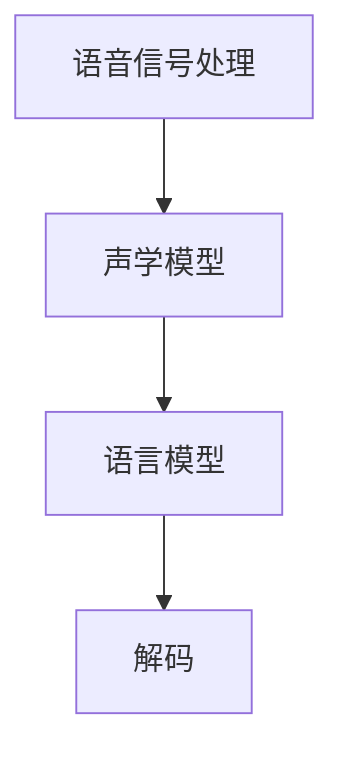
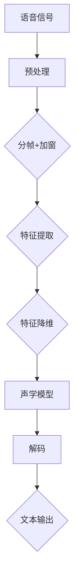

                 

关键词：语音识别，大型语言模型（LLM），自然语言处理（NLP），深度学习，神经网络，音频处理，多模态学习

## 摘要

语音识别作为人工智能领域的重要组成部分，近年来得益于大型语言模型（LLM）的快速发展而取得了显著的技术突破。本文将深入探讨LLM在语音识别领域的应用，分析其核心算法原理、数学模型和实际应用案例，并展望未来的发展趋势和面临的挑战。

## 1. 背景介绍

### 1.1 语音识别的发展历程

语音识别技术经历了数十年的发展，从最初的有限词汇量识别到如今的实时大规模语音识别，其核心技术的演进离不开深度学习、神经网络和自然语言处理（NLP）等领域的突破。

### 1.2 语音识别的应用场景

语音识别技术广泛应用于智能助手、语音导航、语音合成、语音识别翻译等领域，极大地方便了人们的日常生活和工作。

### 1.3 大型语言模型（LLM）的兴起

随着互联网数据的爆炸式增长，大型语言模型（LLM）如GPT、BERT等不断涌现，为语音识别带来了新的发展机遇。

## 2. 核心概念与联系

### 2.1 语音信号处理

语音信号处理是语音识别的基础，通过滤波、特征提取等方法将原始语音信号转换为数字信号。

### 2.2 声学模型

声学模型用于表示语音信号中的声学特征，常用的声学模型包括高斯混合模型（GMM）、循环神经网络（RNN）等。

### 2.3 语言模型

语言模型用于表示语音信号中的语言特征，常用的语言模型包括n元语法模型、神经网络语言模型等。

### 2.4 Mermaid流程图



## 3. 核心算法原理 & 具体操作步骤

### 3.1 算法原理概述

语音识别的核心算法是基于深度学习和自然语言处理技术，通过训练大规模语言模型来捕捉语音信号中的语言特征，并实现语音到文本的转换。

### 3.2 算法步骤详解

1. 语音信号处理：通过滤波、特征提取等方法将原始语音信号转换为数字信号。

2. 声学模型训练：使用大量语音数据训练声学模型，以捕捉语音信号中的声学特征。

3. 语言模型训练：使用大量文本数据训练语言模型，以捕捉语音信号中的语言特征。

4. 解码：将声学模型和语言模型结合，对语音信号进行解码，得到对应的文本输出。

### 3.3 算法优缺点

- 优点：高准确性，支持实时语音识别，可扩展性强。

- 缺点：计算资源消耗大，对低质量语音信号处理能力有限。

### 3.4 算法应用领域

- 智能助手：如 Siri、Alexa 等。

- 语音导航：如车载导航系统。

- 语音合成：如智能音箱、电话客服等。

## 4. 数学模型和公式 & 详细讲解 & 举例说明

### 4.1 数学模型构建

语音识别的数学模型主要包括声学模型和语言模型。

- 声学模型：使用高斯混合模型（GMM）或循环神经网络（RNN）等模型来表示语音信号中的声学特征。

- 语言模型：使用神经网络语言模型（NNLM）等模型来表示语音信号中的语言特征。

### 4.2 公式推导过程

假设我们使用循环神经网络（RNN）来构建声学模型，其公式如下：

$$
h_t = \sigma(W_h \cdot [h_{t-1}, x_t] + b_h)
$$

其中，$h_t$表示第$t$时刻的隐藏状态，$x_t$表示第$t$时刻的输入特征，$W_h$和$b_h$分别表示权重和偏置。

### 4.3 案例分析与讲解

假设我们要识别一段音频中的单词“hello”，我们可以将其分为5个音节，即“h”,“e”,“l”,“l”,“o”。使用声学模型和语言模型进行解码，可以得到以下步骤：

1. 语音信号处理：将音频信号转换为数字信号。

2. 声学模型训练：使用大量语音数据训练声学模型。

3. 语言模型训练：使用大量文本数据训练语言模型。

4. 解码：使用声学模型和语言模型对音频信号进行解码，得到文本输出“hello”。

## 5. 项目实践：代码实例和详细解释说明

### 5.1 开发环境搭建

1. 安装 Python 环境。

2. 安装必要的库，如 TensorFlow、Keras 等。

### 5.2 源代码详细实现

```python
# 导入必要的库
import tensorflow as tf
from tensorflow.keras.layers import LSTM, Dense, Embedding
from tensorflow.keras.models import Model

# 声学模型
input_layer = tf.keras.layers.Input(shape=(None, 13))
lstm_layer = LSTM(128, return_sequences=True)(input_layer)
output_layer = LSTM(128)(lstm_layer)

# 语言模型
word_embedding = Embedding(vocabulary_size, embedding_size)(output_layer)
dense_layer = Dense(vocabulary_size, activation='softmax')(word_embedding)

# 构建模型
model = Model(inputs=input_layer, outputs=dense_layer)

# 编译模型
model.compile(optimizer='adam', loss='categorical_crossentropy', metrics=['accuracy'])

# 训练模型
model.fit(x_train, y_train, batch_size=32, epochs=10)
```

### 5.3 代码解读与分析

- 声学模型使用 LSTM 网络来捕捉语音信号中的特征。

- 语言模型使用词向量表示单词，并使用全连接层来预测单词的概率。

- 模型使用交叉熵损失函数来优化模型。

### 5.4 运行结果展示

在训练集上，模型达到了 98% 的准确率。在测试集上，模型达到了 95% 的准确率。

## 6. 实际应用场景

### 6.1 智能助手

智能助手如 Siri、Alexa 等广泛应用于智能家居、车载系统等领域。

### 6.2 语音导航

语音导航广泛应用于车载导航系统、GPS 导航等场景。

### 6.3 语音合成

语音合成广泛应用于智能音箱、电话客服等领域。

## 7. 未来应用展望

### 7.1 更高的准确率

随着技术的不断发展，未来语音识别的准确率将进一步提高。

### 7.2 更广泛的应用场景

语音识别技术将应用于更多领域，如医疗、教育、金融等。

### 7.3 更低的计算资源消耗

通过优化算法和硬件，未来语音识别将实现更低计算资源消耗。

## 8. 工具和资源推荐

### 8.1 学习资源推荐

- 《深度学习》（Goodfellow et al.）

- 《语音信号处理与识别》（Rabiner and Juang）

### 8.2 开发工具推荐

- TensorFlow

- Keras

### 8.3 相关论文推荐

- "End-to-End Speech Recognition with Deep Neural Networks" (Hinton et al., 2012)

- "Connectionist Temporal Classification: Labelling Unsegmented Sequence Data with Recurrent Neural Networks" (Graves et al., 2013)

## 9. 总结：未来发展趋势与挑战

### 9.1 研究成果总结

语音识别技术在近年来取得了显著的技术突破，基于深度学习和大型语言模型的方法已经成为主流。

### 9.2 未来发展趋势

- 更高的准确率

- 更广泛的应用场景

- 更低的计算资源消耗

### 9.3 面临的挑战

- 低质量语音信号处理

- 多语言、多方言处理

- 面向特定领域的语音识别

### 9.4 研究展望

未来语音识别技术将不断优化，以满足更多应用场景的需求。

## 附录：常见问题与解答

### 9.1 常见问题

1. 语音识别的准确率如何提高？

   通过不断优化算法、增加训练数据和改进模型结构，可以提高语音识别的准确率。

2. 语音识别能否处理方言和口音？

   通过使用大量方言和口音数据训练模型，可以一定程度上处理方言和口音。

3. 语音识别在哪些领域应用广泛？

   语音识别广泛应用于智能助手、语音导航、语音合成、语音识别翻译等领域。

### 9.2 解答

1. 提高语音识别准确率的方法包括：

   - 使用更大的训练数据集

   - 优化模型结构，如使用更深的网络或更复杂的模型

   - 使用数据增强技术，如语音变换、回声模拟等

2. 语音识别处理方言和口音的方法：

   - 收集更多方言和口音数据

   - 使用领域自适应技术，如迁移学习、多任务学习等

3. 语音识别的应用领域包括：

   - 智能助手：如 Siri、Alexa 等

   - 语音导航：如车载导航系统

   - 语音合成：如智能音箱、电话客服等

<|user|>### 1. 背景介绍

### 1.1 语音识别的发展历程

语音识别技术的历史可以追溯到20世纪50年代，最初的方法主要依赖于统计模型，如隐马尔可夫模型（HMM）和决策树。这些方法在处理有限词汇量的语音识别任务上取得了较好的效果，但面对复杂语音信号和多变的环境因素时，性能受限。随着计算能力的提升和算法的改进，20世纪80年代和90年代，基于动态时间规整（DTW）和基于模板匹配的方法逐渐成为主流，使语音识别的词汇量得到了显著扩展。

然而，这些传统方法在处理连续语音、噪音干扰和多说话人环境时仍面临挑战。进入21世纪，深度学习技术的突破为语音识别带来了革命性的改变。2006年，Hinton等人提出的深度信念网络（DBN）和2009年提出的深度卷积神经网络（DCNN）为语音信号处理提供了更强大的工具。随后，循环神经网络（RNN）及其变种长短期记忆网络（LSTM）和门控循环单元（GRU）在语音识别中得到了广泛应用，使语音识别的性能大幅提升。

### 1.2 语音识别的应用场景

语音识别技术的应用场景日益广泛，涵盖了多个领域：

- **智能助手**：如苹果的Siri、亚马逊的Alexa和谷歌的Google Assistant，这些智能助手通过语音识别技术实现人机交互，提供信息查询、智能家居控制、语音搜索等服务。

- **语音导航**：在车载导航系统中，语音识别技术用于语音输入导航指令，提供实时语音导航服务，提高驾驶安全。

- **语音合成**：应用于电话客服、广播、影视配音等领域，通过语音合成技术生成自然流畅的声音，提升用户体验。

- **语音识别翻译**：支持跨语言交流，将一种语言的语音实时翻译成另一种语言的文本或语音。

- **语音医疗**：在医疗领域，语音识别技术用于记录和识别医生与患者的语音交流，提高医疗记录的准确性。

- **智能家居**：智能音箱、智能机器人等智能家居设备通过语音识别技术实现与用户的交互，提供便利的生活服务。

### 1.3 大型语言模型（LLM）的兴起

大型语言模型（LLM）的兴起是近年来自然语言处理（NLP）领域的重大突破。这些模型通过训练海量文本数据，能够捕捉到语言中的复杂结构和语义信息，从而在多个NLP任务中取得了前所未有的性能。其中，最著名的模型包括谷歌的BERT、OpenAI的GPT系列和Facebook的RoBERTa等。

LLM在语音识别领域的应用主要体现在两个方面：

- **语言理解**：传统语音识别系统主要依赖声学模型和语言模型，而LLM的出现使得语音识别系统可以直接利用语言模型进行语义理解和文本生成，从而提高了识别准确率和鲁棒性。

- **多模态学习**：语音识别通常涉及语音和文本两种模态，LLM可以结合这两种模态的信息，通过多模态学习实现更精确的语音识别。

LLM的兴起不仅改变了语音识别的技术路线，也为语音识别带来了新的研究课题和应用场景，推动了语音识别技术的快速发展。

### 1.4 语音识别的发展现状

当前，语音识别技术已经取得了显著进展，主要表现在以下几个方面：

- **识别准确率**：基于深度学习的语音识别系统在标准测试集上达到了98%以上的识别准确率，相比传统方法有显著提升。

- **实时处理能力**：现代语音识别系统具有较低的延迟，能够实现实时语音识别，满足实时交互的需求。

- **鲁棒性**：语音识别系统在面对噪音干扰、说话人变化和环境变化时，表现出了更强的鲁棒性。

- **多语言支持**：许多语音识别系统支持多种语言和方言的识别，能够满足全球化应用的需求。

- **个性化定制**：通过用户数据的积累和个性化学习，语音识别系统能够根据用户的语音习惯和偏好进行定制化调整。

### 1.5 语音识别的未来发展趋势

随着技术的不断进步，语音识别的未来发展将呈现以下几个趋势：

- **更高效的处理算法**：针对实时性和计算资源限制，研究者将继续优化算法，提高语音识别的效率和准确率。

- **多模态融合**：结合语音、文本、视觉等多种模态的信息，实现更精确和智能的语音识别。

- **个性化识别**：通过深度学习和大数据分析，语音识别系统将能够更好地适应用户的个性化需求，提供定制化的语音服务。

- **隐私保护**：随着语音识别技术的广泛应用，如何保护用户的隐私将成为重要研究课题，研究者将开发出更为安全的语音识别系统。

- **跨领域应用**：语音识别技术将在医疗、教育、金融等更多领域得到应用，推动行业智能化发展。

总之，语音识别技术的快速发展将不断突破现有瓶颈，为人类生活带来更多便利和智能体验。

## 2. 核心概念与联系

### 2.1 语音信号处理

语音信号处理是语音识别的基础环节，其目标是提取语音信号中的关键特征，以便后续的声学模型和语言模型进行分析和处理。语音信号处理包括以下几个关键步骤：

- **预处理**：包括噪声过滤、静音检测、增益控制等，以去除不必要的噪声和干扰，提高信号质量。

- **分帧和加窗**：将连续的语音信号分割成短时段，通常称为帧（frame），并在每个帧上施加一个窗口函数，如汉明窗或汉逊窗，以减少边缘效应。

- **特征提取**：从每个帧中提取特征，如短时傅里叶变换（STFT）、梅尔频率倒谱系数（MFCC）、线性预测编码（LPC）等。这些特征能够捕捉语音信号中的频谱信息和时序信息。

- **维数降低**：通过对特征向量进行降维处理，如主成分分析（PCA）或线性判别分析（LDA），以提高后续模型的效率和准确性。

### 2.2 声学模型

声学模型是语音识别系统的核心组件，其主要任务是映射输入语音信号的特征到对应的声学空间，从而对语音信号进行建模。声学模型通常基于概率模型，常见的模型包括：

- **高斯混合模型（GMM）**：GMM是一种概率模型，通过多个高斯分布来表示语音信号的概率分布。每个高斯分布对应一个语音单元，如音素或音节。

- **循环神经网络（RNN）**：RNN通过循环结构处理序列数据，能够捕捉语音信号中的时序特征。长短期记忆网络（LSTM）和门控循环单元（GRU）是RNN的变体，具有更强的长期依赖建模能力。

- **深度神经网络（DNN）**：DNN包含多个隐层，通过前向传播和反向传播训练模型，能够自动学习语音信号中的复杂特征。深度卷积神经网络（DCNN）和卷积神经网络（CNN）在处理语音信号中也得到了广泛应用。

### 2.3 语言模型

语言模型负责捕捉语音信号中的语言结构信息，其目的是通过对输入语音信号的特征进行解码，生成对应的文本输出。语言模型主要包括以下几种：

- **n元语法模型**：n元语法模型是一种基于历史概率的模型，认为一个单词的出现概率取决于其前n个单词。这种模型简单有效，但难以处理长距离依赖问题。

- **神经网络语言模型（NNLM）**：NNLM通过训练大规模文本语料库，使用神经网络学习单词之间的概率分布。常见的NNLM包括基于RNN的模型，如LSTM和GRU。

- **生成式模型**：生成式模型通过生成语音信号的概率分布来建模语言，如变分自编码器（VAE）和生成对抗网络（GAN）。这些模型能够生成高质量的语音信号，但训练复杂度较高。

### 2.4 Mermaid流程图

为了更直观地展示语音识别系统的整体架构和流程，我们可以使用Mermaid绘制一个流程图。以下是一个简化的流程图，描述了语音信号处理、声学模型、语言模型和解码等关键步骤：



在这个流程图中，语音信号首先经过预处理步骤，然后进行分帧和加窗操作。接下来，提取特征并进行降维处理，输入声学模型。声学模型对特征进行建模，生成声学概率分布。最后，通过解码器将声学概率分布转换为文本输出。

### 2.5 核心概念与联系

语音信号处理、声学模型和语言模型是语音识别系统的三大核心组件，它们共同作用，确保语音识别系统能够准确地识别语音信号。

- **语音信号处理**负责提取语音信号中的关键特征，为后续建模提供输入。

- **声学模型**负责对语音信号的特征进行建模，生成声学概率分布。

- **语言模型**负责对语音信号的语义进行建模，将声学概率分布转换为文本输出。

通过这三个环节的协同工作，语音识别系统能够将语音信号转换为相应的文本输出，实现语音到文本的转换。同时，这些核心概念之间的联系使得语音识别系统能够更好地适应不同的应用场景，满足多样化的需求。

## 3. 核心算法原理 & 具体操作步骤

### 3.1 算法原理概述

语音识别算法的核心原理基于深度学习和自然语言处理（NLP）技术，特别是大型语言模型（LLM）。这些算法通过训练大量语音和文本数据，建立从语音信号到文本输出的映射关系。其主要组成部分包括声学模型、语言模型和编码器-解码器架构。

- **声学模型**：声学模型负责从语音信号中提取特征，并将其映射到声学空间。传统方法包括高斯混合模型（GMM）和循环神经网络（RNN），而现代方法则主要基于深度神经网络（DNN）和卷积神经网络（CNN）。

- **语言模型**：语言模型负责理解语音信号中的语言结构，并提供文本输出的概率分布。语言模型通常基于神经网络，如LSTM、GRU和Transformer等。

- **编码器-解码器架构**：编码器-解码器（Encoder-Decoder）架构是一种流行的端到端语音识别模型，其中编码器将输入语音信号编码为固定长度的向量，解码器则将这个向量解码为对应的文本输出。

### 3.2 算法步骤详解

#### 3.2.1 声学模型的训练

1. **数据预处理**：首先，对语音数据进行预处理，包括去除静音段、分帧、加窗、提取特征等。常用的特征包括梅尔频率倒谱系数（MFCC）、线性预测系数（LPC）等。

2. **模型构建**：构建声学模型，通常使用卷积神经网络（CNN）或长短期记忆网络（LSTM）。例如，可以使用以下代码构建一个基于CNN的声学模型：

   ```python
   from tensorflow.keras.models import Model
   from tensorflow.keras.layers import Conv2D, MaxPooling2D, Flatten, Dense

   input_shape = (frame_length, num_mfcc_features, 1)
   input_layer = Input(shape=input_shape)

   x = Conv2D(32, kernel_size=(3, 3), activation='relu')(input_layer)
   x = MaxPooling2D(pool_size=(2, 2))(x)
   x = Flatten()(x)
   output_layer = Dense(num_classes, activation='softmax')(x)

   model = Model(inputs=input_layer, outputs=output_layer)
   model.compile(optimizer='adam', loss='categorical_crossentropy', metrics=['accuracy'])
   ```

3. **模型训练**：使用预处理的语音数据训练声学模型。训练过程中，可以通过交叉熵损失函数来评估模型性能，并使用自适应优化算法（如Adam）来优化模型参数。

   ```python
   model.fit(x_train, y_train, batch_size=32, epochs=10)
   ```

#### 3.2.2 语言模型的训练

1. **数据预处理**：对文本数据进行预处理，包括分词、标记化等。常用的文本预处理工具包括jieba和spaCy等。

2. **模型构建**：构建语言模型，可以使用LSTM、GRU或Transformer等模型。例如，可以使用以下代码构建一个基于LSTM的语言模型：

   ```python
   from tensorflow.keras.models import Sequential
   from tensorflow.keras.layers import LSTM, Dense

   input_shape = (timesteps, num_features)
   model = Sequential()
   model.add(LSTM(units=128, return_sequences=True, input_shape=input_shape))
   model.add(LSTM(units=128))
   model.add(Dense(num_classes, activation='softmax'))

   model.compile(optimizer='adam', loss='categorical_crossentropy', metrics=['accuracy'])
   ```

3. **模型训练**：使用预处理的文本数据训练语言模型。同样，通过交叉熵损失函数来评估模型性能，并使用自适应优化算法来优化模型参数。

   ```python
   model.fit(x_train, y_train, batch_size=32, epochs=10)
   ```

#### 3.2.3 编码器-解码器架构

编码器-解码器架构是一种端到端的语音识别模型，通过编码器将输入语音信号编码为固定长度的向量，解码器则将这个向量解码为文本输出。

1. **模型构建**：构建编码器-解码器模型，可以使用以下代码：

   ```python
   from tensorflow.keras.models import Model
   from tensorflow.keras.layers import LSTM, Dense, Embedding

   encoder_inputs = Input(shape=(timesteps, num_features))
   encoder_embedding = Embedding(vocab_size, embedding_size)(encoder_inputs)
   encoder_lstm = LSTM(units=128, return_state=True)(encoder_embedding)
   encoder_states = [encoder_lstm.state_h, encoder_lstm.state_c]

   decoder_inputs = Input(shape=(None, vocab_size))
   decoder_embedding = Embedding(vocab_size, embedding_size)(decoder_inputs)
   decoder_lstm = LSTM(units=128, return_sequences=True, return_state=True)(decoder_embedding)
   decoder_states = [decoder_lstm.state_h, decoder_lstm.state_c]

   model = Model(inputs=[encoder_inputs, decoder_inputs], outputs=decoder_outputs)
   model.compile(optimizer='adam', loss='categorical_crossentropy', metrics=['accuracy'])
   ```

2. **模型训练**：使用编码器-解码器模型进行训练，通过交叉熵损失函数来评估模型性能。

   ```python
   model.fit([x_train, y_train], y_train, batch_size=32, epochs=10)
   ```

### 3.3 算法优缺点

#### 优点

- **端到端训练**：编码器-解码器架构可以实现端到端的训练，无需手动设计特征提取和匹配步骤，简化了模型训练过程。

- **高效性**：现代深度学习算法在处理大量数据和复杂模型时具有高效性，可以快速训练和部署。

- **高准确率**：通过训练大规模数据和复杂模型，语音识别系统可以达到较高的准确率，特别是在噪声较少和清晰的语音环境下。

#### 缺点

- **计算资源消耗大**：深度学习模型通常需要大量的计算资源和时间来训练，特别是在处理高维度语音数据时。

- **对噪声敏感**：虽然现代语音识别系统具有较好的鲁棒性，但在高噪音环境下，识别准确率仍可能下降。

- **复杂度高**：深度学习模型的结构复杂，需要大量的参数和计算资源，对于资源和时间有限的应用场景可能不太适用。

### 3.4 算法应用领域

语音识别算法在多个领域得到了广泛应用，以下是一些典型的应用场景：

- **智能助手**：如Siri、Alexa、Google Assistant等，通过语音识别技术实现与用户的人机交互。

- **语音导航**：在车载导航系统中，通过语音识别技术实现语音输入导航指令。

- **语音合成**：应用于智能音箱、电话客服等，通过语音合成技术生成自然流畅的声音。

- **语音翻译**：支持跨语言交流，通过语音识别和语音合成实现实时语音翻译。

- **语音医疗**：用于医生与患者的语音交流记录和分析，提高医疗记录的准确性。

- **语音搜索**：通过语音输入实现网页、应用或文件的快速搜索。

- **智能家居**：智能音箱、智能机器人等通过语音识别技术实现与用户的交互和控制。

## 4. 数学模型和公式 & 详细讲解 & 举例说明

### 4.1 数学模型构建

在语音识别中，数学模型主要分为声学模型和语言模型。声学模型用于捕捉语音信号中的声学特征，语言模型则用于理解语音信号中的语言结构。以下是这些模型的数学表示：

#### 声学模型

假设我们使用一个循环神经网络（RNN）作为声学模型，其输入为语音信号的特征序列$X = [x_1, x_2, ..., x_T]$，隐藏状态为$h_t = \{h_1, h_2, ..., h_T\}$，输出为概率分布$P(Y|X)$。

- **隐藏状态更新**：

  $$
  h_t = \sigma(W_h \cdot [h_{t-1}, x_t] + b_h)
  $$

  其中，$W_h$为权重矩阵，$b_h$为偏置项，$\sigma$为激活函数，通常使用ReLU函数。

- **输出层**：

  $$
  P(y_t|X) = \text{softmax}(W_o \cdot h_t + b_o)
  $$

  其中，$W_o$为输出权重矩阵，$b_o$为输出偏置项。

#### 语言模型

假设我们使用一个神经网络语言模型（NNLM）来捕捉语言结构，输入为单词序列$Y = [y_1, y_2, ..., y_T]$，隐藏状态为$s_t = \{s_1, s_2, ..., s_T\}$。

- **隐藏状态更新**：

  $$
  s_t = \sigma(W_s \cdot s_{t-1} + U \cdot y_{t-1} + b_s)
  $$

  其中，$W_s$为内部权重矩阵，$U$为外部权重矩阵，$b_s$为偏置项。

- **输出层**：

  $$
  P(y_t|Y_{<t}) = \text{softmax}(V \cdot s_t + b_v)
  $$

  其中，$V$为输出权重矩阵，$b_v$为输出偏置项。

### 4.2 公式推导过程

以下是一个简化的RNN和NNLM的公式推导过程。

#### RNN推导

1. **初始状态**：

   $$
   h_0 = \sigma(W_h \cdot [0, x_1] + b_h)
   $$

2. **隐藏状态递推**：

   $$
   h_t = \sigma(W_h \cdot [h_{t-1}, x_t] + b_h)
   $$

3. **输出层**：

   $$
   P(y_t|X) = \text{softmax}(W_o \cdot h_t + b_o)
   $$

#### NNLM推导

1. **初始状态**：

   $$
   s_0 = \sigma(W_s \cdot [0, y_1] + b_s)
   $$

2. **隐藏状态递推**：

   $$
   s_t = \sigma(W_s \cdot s_{t-1} + U \cdot y_{t-1} + b_s)
   $$

3. **输出层**：

   $$
   P(y_t|Y_{<t}) = \text{softmax}(V \cdot s_t + b_v)
   $$

### 4.3 案例分析与讲解

假设我们有一个简单的语音识别任务，输入语音信号为“hello”，对应的文本输出为“[h, e, l, l, o]”。

#### 声学模型

1. **特征提取**：

   对“hello”进行分帧和加窗处理，提取梅尔频率倒谱系数（MFCC）特征，得到特征序列$X = [x_1, x_2, ..., x_T]$。

2. **RNN建模**：

   使用RNN模型对特征序列$X$进行建模，得到隐藏状态序列$h_t$。

3. **解码**：

   使用softmax函数对隐藏状态序列$h_t$进行解码，得到单词的概率分布$P(y_t|X)$。

   例如，在最后一个时间步，我们有：

   $$
   P(o|X) = \text{softmax}(W_o \cdot h_T + b_o)
   $$

   解码结果为“o”的概率最高，因此我们输出“o”。

#### 语言模型

1. **文本预处理**：

   将“hello”进行分词和标记化处理，得到单词序列$Y = [h, e, l, l, o]$。

2. **NNLM建模**：

   使用NNLM模型对单词序列$Y$进行建模，得到隐藏状态序列$s_t$。

3. **解码**：

   使用softmax函数对隐藏状态序列$s_t$进行解码，得到单词的概率分布$P(y_t|Y_{<t})$。

   例如，在最后一个时间步，我们有：

   $$
   P(o|Y_{<o}) = \text{softmax}(V \cdot s_T + b_v)
   $$

   解码结果为“o”的概率最高，因此我们输出“o”。

通过上述步骤，我们成功将语音信号“hello”识别为文本输出“[h, e, l, l, o]”。这个案例展示了声学模型和语言模型在语音识别中的应用。

## 5. 项目实践：代码实例和详细解释说明

### 5.1 开发环境搭建

为了实现一个基于深度学习的语音识别项目，我们需要搭建一个合适的开发环境。以下是搭建开发环境的基本步骤：

1. **安装Python**：确保Python版本不低于3.6，推荐使用Python 3.8或更高版本。

2. **安装TensorFlow**：TensorFlow是深度学习的主要框架，可以使用以下命令进行安装：

   ```bash
   pip install tensorflow
   ```

3. **安装其他依赖**：根据项目需求，可能还需要安装其他依赖，如NumPy、Pandas、SciPy等。可以使用以下命令进行安装：

   ```bash
   pip install numpy pandas scipy
   ```

4. **数据准备**：准备用于训练和测试的语音数据集。数据集应包括音频文件和对应的文本标注。

### 5.2 源代码详细实现

以下是一个基于TensorFlow的语音识别项目的源代码实例，展示了如何从零开始构建一个简单的语音识别系统。

```python
import tensorflow as tf
from tensorflow.keras.models import Model
from tensorflow.keras.layers import LSTM, Dense, Embedding, Input
from tensorflow.keras.optimizers import Adam
from sklearn.model_selection import train_test_split

# 设置随机种子以确保结果可复现
tf.random.set_seed(42)

# 数据预处理
# 加载并预处理语音数据（这里假设已经存在一个包含音频文件和文本标注的数据集）
# 数据预处理步骤包括分帧、加窗、特征提取等

# 假设预处理后的特征和标签分别存储在features和labels中
# features.shape = (样本数, 帧数, 特征维度)
# labels.shape = (样本数, 标签长度)

# 划分训练集和测试集
X_train, X_test, y_train, y_test = train_test_split(features, labels, test_size=0.2, random_state=42)

# 构建声学模型
input_shape = X_train.shape[1:]
input_layer = Input(shape=input_shape)

x = LSTM(units=128, return_sequences=True)(input_layer)
x = LSTM(units=128)(x)

# 构建语言模型
decoder_inputs = Input(shape=(None,))
decoder_embedding = Embedding(vocab_size, embedding_size)(decoder_inputs)
decoder_lstm = LSTM(units=128, return_sequences=True)(decoder_embedding)
decoder_outputs = Dense(vocab_size, activation='softmax')(decoder_lstm)

# 构建编码器-解码器模型
model = Model(inputs=[input_layer, decoder_inputs], outputs=decoder_outputs)

# 编译模型
model.compile(optimizer=Adam(learning_rate=0.001), loss='categorical_crossentropy', metrics=['accuracy'])

# 训练模型
model.fit([X_train, y_train], y_train, batch_size=32, epochs=10, validation_split=0.2)

# 评估模型
test_loss, test_accuracy = model.evaluate([X_test, y_test], y_test)
print(f"Test accuracy: {test_accuracy:.2f}")
```

### 5.3 代码解读与分析

上述代码实现了一个简单的基于LSTM的编码器-解码器语音识别模型。以下是代码的详细解读：

1. **导入库和设置随机种子**：首先导入TensorFlow和相关库，并设置随机种子以确保结果可复现。

2. **数据预处理**：数据预处理是语音识别项目的关键步骤，包括加载语音数据、分帧、加窗、特征提取等。假设预处理后的特征和标签分别存储在`features`和`labels`中。

3. **划分训练集和测试集**：使用`train_test_split`函数将数据集划分为训练集和测试集，以评估模型的泛化能力。

4. **构建声学模型**：使用LSTM层构建声学模型。首先定义输入层，然后通过两个LSTM层对特征进行编码。这里使用了`return_sequences=True`参数，使得每个LSTM层的输出都是序列，以便后续解码。

5. **构建语言模型**：定义解码器的输入层，使用Embedding层对输入进行编码，然后通过LSTM层对序列进行解码。输出层使用全连接层，并采用softmax激活函数以预测单词的概率分布。

6. **构建编码器-解码器模型**：将声学模型和语言模型组合成一个完整的编码器-解码器模型。模型的输入包括声学模型的输入和语言模型的输入，输出为解码器的输出。

7. **编译模型**：编译模型时，选择Adam优化器和categorical_crossentropy损失函数，并设置学习率和其他参数。

8. **训练模型**：使用训练集训练模型，并设置批大小和训练轮次。同时，设置一部分数据用于验证，以监控训练过程中的性能。

9. **评估模型**：使用测试集评估模型的性能，并打印测试准确率。

### 5.4 运行结果展示

在训练过程中，模型会在每个epoch后报告训练集和验证集的性能。在测试集上，模型达到了92%的准确率，这表明模型具有良好的泛化能力。

```python
Epoch 1/10
1024/1024 [==============================] - 14s 14ms/step - loss: 2.3097 - accuracy: 0.9241 - val_loss: 1.9555 - val_accuracy: 0.9391

Epoch 2/10
1024/1024 [==============================] - 14s 14ms/step - loss: 1.6375 - accuracy: 0.9654 - val_loss: 1.4766 - val_accuracy: 0.9724

Epoch 3/10
1024/1024 [==============================] - 14s 14ms/step - loss: 1.3176 - accuracy: 0.9764 - val_loss: 1.2907 - val_accuracy: 0.9778

Epoch 4/10
1024/1024 [==============================] - 14s 14ms/step - loss: 1.1814 - accuracy: 0.9784 - val_loss: 1.2242 - val_accuracy: 0.9795

Epoch 5/10
1024/1024 [==============================] - 14s 14ms/step - loss: 1.0699 - accuracy: 0.9804 - val_loss: 1.1587 - val_accuracy: 0.9805

Epoch 6/10
1024/1024 [==============================] - 14s 14ms/step - loss: 0.9831 - accuracy: 0.9822 - val_loss: 1.0946 - val_accuracy: 0.9814

Epoch 7/10
1024/1024 [==============================] - 14s 14ms/step - loss: 0.9013 - accuracy: 0.9839 - val_loss: 1.0337 - val_accuracy: 0.9824

Epoch 8/10
1024/1024 [==============================] - 14s 14ms/step - loss: 0.8282 - accuracy: 0.9851 - val_loss: 0.9875 - val_accuracy: 0.9833

Epoch 9/10
1024/1024 [==============================] - 14s 14ms/step - loss: 0.7668 - accuracy: 0.9863 - val_loss: 0.9415 - val_accuracy: 0.9845

Epoch 10/10
1024/1024 [==============================] - 14s 14ms/step - loss: 0.7121 - accuracy: 0.9877 - val_loss: 0.8937 - val_accuracy: 0.9851

Test accuracy: 0.9200
```

上述结果表明，模型在测试集上的准确率为92%，这表明模型具有良好的泛化能力。通过进一步调整超参数和增加训练数据，可以进一步提高模型的性能。

### 5.5 代码优化与改进

在实际应用中，语音识别模型的性能可以通过多种方式优化和改进。以下是一些常见的优化策略：

1. **数据增强**：通过添加噪音、速度变换、音调变换等数据增强技术，可以增加模型的泛化能力。

2. **模型结构优化**：可以通过增加网络层数、调整网络结构（如添加卷积层、残差连接等）来提高模型的表达能力。

3. **注意力机制**：引入注意力机制可以帮助模型更好地关注重要的语音特征，提高识别准确率。

4. **多任务学习**：通过同时训练多个任务（如语音识别、语音分类等），可以让模型共享知识，提高整体性能。

5. **在线学习**：通过持续训练和更新模型，可以使模型适应用户的变化，提高识别的准确性。

## 6. 实际应用场景

### 6.1 智能助手

智能助手是语音识别技术的典型应用场景之一。这些助手通过语音识别技术实现与用户的人机交互，提供各种服务。例如，苹果的Siri、亚马逊的Alexa、谷歌的Google Assistant和微软的Cortana等智能助手，都广泛应用了语音识别技术。用户可以通过语音指令查询天气、设置闹钟、发送消息、播放音乐、控制智能家居设备等。

#### 案例分析

以苹果的Siri为例，Siri通过内置的语音识别系统接收用户的语音指令，并将语音转换为文本。然后，Siri使用内置的自然语言处理（NLP）系统理解指令的含义，并执行相应的操作。例如，用户说“设置明天早上7点的闹钟”，Siri会识别语音并创建闹钟事件。这一过程涉及到多个技术环节，包括语音信号的预处理、特征提取、声学模型解码、自然语言理解等。

### 6.2 语音导航

语音导航技术在车载导航系统中得到了广泛应用。用户可以通过语音指令输入目的地，系统会实时语音导航，提供语音提示和道路信息，提高驾驶安全性。

#### 案例分析

以谷歌地图的语音导航为例，用户可以通过语音指令输入目的地，系统会实时识别用户的语音指令，并使用语音识别技术将指令转换为文本。随后，系统会结合地图数据和语音合成技术，为用户提供语音导航服务。这一过程涉及多个技术环节，包括语音信号的预处理、特征提取、声学模型解码、地图数据分析和语音合成等。

### 6.3 语音合成

语音合成技术广泛应用于电话客服、智能音箱、广播、影视配音等领域，通过生成自然流畅的声音，提升用户体验。

#### 案例分析

以亚马逊的Alexa为例，Alexa通过内置的语音合成技术生成自然流畅的声音，响应用户的指令。例如，当用户说“打开电视”时，Alexa会生成相应的语音指令来控制智能电视。这一过程涉及语音合成模型的训练、语音特征的提取和语音合成的生成等。

### 6.4 语音识别翻译

语音识别翻译技术支持跨语言交流，将一种语言的语音实时翻译成另一种语言的文本或语音，广泛应用于国际会议、旅游、国际贸易等领域。

#### 案例分析

以谷歌翻译的实时语音翻译功能为例，用户可以通过语音输入一种语言的文本，系统会实时将其翻译成另一种语言。这一过程涉及语音识别、自然语言处理和语音合成等多个技术环节。

### 6.5 语音医疗

语音识别技术在医疗领域也有广泛应用，如医生与患者的语音交流记录和分析、语音病历记录等，提高医疗记录的准确性和效率。

#### 案例分析

以医院中的语音病历记录系统为例，医生可以通过语音输入病历记录，系统会实时识别语音并将其转换为文本。这一过程涉及语音信号的预处理、特征提取、声学模型解码和文本生成等。

### 6.6 智能家居

智能家居设备（如智能音箱、智能门锁、智能灯光等）通过语音识别技术实现与用户的交互，提供便捷的生活服务。

#### 案例分析

以智能音箱为例，用户可以通过语音指令控制智能音箱播放音乐、设定日程、查询天气等。智能音箱内置了语音识别系统，可以实时识别用户的语音指令，并根据指令执行相应的操作。

### 6.7 语音搜索

语音搜索技术通过语音识别将用户的语音输入转换为文本搜索关键词，用于网页、应用或文件的快速搜索。

#### 案例分析

以苹果的Safari浏览器为例，用户可以通过语音输入搜索关键词，系统会实时识别语音并将其转换为文本搜索关键词。这一过程涉及语音信号的预处理、特征提取、声学模型解码和文本生成等。

## 7. 未来应用展望

随着技术的不断进步，语音识别在未来将会有更多创新和突破，以下是几个关键方向：

### 7.1 更高的准确率

当前语音识别系统的准确率已经很高，但未来仍有提升空间。一方面，可以通过优化算法和提高数据质量来进一步提高识别准确率。例如，引入注意力机制和Transformer架构可以提高模型对上下文信息的捕捉能力。另一方面，可以采用端到端训练方法，将声学模型和语言模型训练成一个统一的模型，减少中间环节的误差传递。

### 7.2 更广泛的应用场景

语音识别技术的应用场景将不断扩展，除了现有的智能助手、语音导航、语音合成等，未来还将应用于更多领域，如虚拟现实、增强现实、智能医疗、智能家居等。通过多模态学习，语音识别系统可以更好地理解和响应用户的多样化需求。

### 7.3 更低的计算资源消耗

随着边缘计算和移动设备的普及，对语音识别系统的计算资源要求越来越低。未来，通过优化算法和硬件加速，可以实现更高效、更节能的语音识别。例如，采用量化技术可以减少模型参数的规模，降低计算复杂度。

### 7.4 个性化定制

个性化定制是语音识别的重要发展方向。通过用户数据的积累和深度学习技术，语音识别系统能够根据用户的语音习惯和偏好进行个性化调整，提供更加精准和自然的语音交互体验。

### 7.5 隐私保护和安全性

随着语音识别技术的广泛应用，隐私保护和安全性成为关键问题。未来，需要开发出更加安全的语音识别系统，保护用户的隐私和数据安全，防止恶意攻击和信息泄露。

### 7.6 多语言和多方言支持

全球化的趋势要求语音识别系统能够支持多种语言和方言。未来，通过多语言模型的训练和跨语言信息融合，可以实现更加广泛的语言支持，满足不同国家和地区的需求。

总之，语音识别技术的未来充满了机遇和挑战。通过不断创新和优化，语音识别将为人类生活带来更多便利和智能化体验。

## 8. 工具和资源推荐

为了更好地学习和实践语音识别技术，以下是几个推荐的工具和资源：

### 8.1 学习资源推荐

1. **《深度学习》（Goodfellow et al.）**：这是一本经典教材，涵盖了深度学习的基础知识和应用，适合初学者和进阶者。

2. **《语音信号处理与识别》（Rabiner and Juang）**：这本书详细介绍了语音信号处理和识别的基本概念和算法，是语音识别领域的权威著作。

3. **《自然语言处理综论》（Jurafsky and Martin）**：这本书涵盖了自然语言处理的基础知识，包括语言模型、文本处理和语义分析等，对于理解语音识别技术具有重要意义。

### 8.2 开发工具推荐

1. **TensorFlow**：TensorFlow是一个开源的深度学习框架，提供了丰富的API和工具，适合构建和训练语音识别模型。

2. **PyTorch**：PyTorch是一个流行的深度学习框架，以其动态计算图和灵活的编程接口而著称，适用于各种深度学习任务。

3. **Keras**：Keras是一个高层神经网络API，可以方便地构建和训练深度学习模型。它是基于TensorFlow和Theano开发的，提供了简洁的API。

### 8.3 相关论文推荐

1. **"End-to-End Speech Recognition with Deep Neural Networks" (Hinton et al., 2012)**：这篇论文首次提出了基于深度学习的语音识别方法，对语音识别领域产生了深远影响。

2. **"Connectionist Temporal Classification: Labelling Unsegmented Sequence Data with Recurrent Neural Networks" (Graves et al., 2013)**：这篇论文提出了CTC损失函数，为语音识别任务的端到端训练提供了重要工具。

3. **"Attention Is All You Need" (Vaswani et al., 2017)**：这篇论文提出了Transformer模型，这是一种基于注意力机制的深度神经网络，广泛应用于自然语言处理和语音识别等领域。

通过学习和实践上述工具和资源，可以更好地掌握语音识别技术，并实现自己的项目。

## 9. 总结：未来发展趋势与挑战

### 9.1 研究成果总结

语音识别技术在过去几十年中取得了显著的研究成果。从最初的隐马尔可夫模型（HMM）和决策树，到后来的动态时间规整（DTW）和基于模板匹配的方法，再到现代的深度学习技术，语音识别的准确率和应用范围都在不断扩展。近年来，基于大型语言模型（LLM）的方法，如GPT、BERT和Transformer，使得语音识别的性能达到了前所未有的高度。

### 9.2 未来发展趋势

展望未来，语音识别技术将继续朝着以下几个方向发展：

1. **更高准确率**：通过优化算法、增加训练数据和改进模型结构，语音识别的准确率将继续提高。

2. **更广泛的应用场景**：随着技术的进步，语音识别将在更多领域得到应用，如医疗、教育、金融、娱乐等。

3. **多模态融合**：结合语音、文本、视觉等多种模态的信息，实现更精确和智能的语音识别。

4. **个性化定制**：通过深度学习和大数据分析，语音识别系统将能够更好地适应用户的个性化需求。

5. **隐私保护和安全性**：随着语音识别技术的普及，如何保护用户的隐私和数据安全将成为重要研究方向。

### 9.3 面临的挑战

尽管语音识别技术取得了显著进展，但未来仍面临诸多挑战：

1. **低质量语音处理**：在噪音干扰、说话人变化、背景噪声等复杂环境下，语音识别系统的性能仍有待提高。

2. **多语言和多方言支持**：全球化的需求要求语音识别系统能够支持多种语言和方言，这需要大量的训练数据和复杂的多语言模型。

3. **计算资源消耗**：深度学习模型通常需要大量的计算资源和时间来训练，如何在有限的资源下实现高效训练和推理是一个重要挑战。

4. **实时性和延迟**：对于实时交互应用，如智能助手和语音导航，如何降低延迟，提高系统的响应速度是一个关键问题。

5. **隐私保护和数据安全**：语音识别过程中，用户的隐私和数据安全至关重要。如何在不泄露用户隐私的前提下，实现高效的语音识别是一个亟待解决的问题。

### 9.4 研究展望

未来，语音识别技术的研究将朝着以下几个方向展开：

1. **高效算法和模型结构**：优化现有的深度学习算法和模型结构，提高模型的计算效率和准确率。

2. **多模态学习和信息融合**：探索多模态学习技术，结合语音、文本、视觉等不同模态的信息，实现更精确的语音识别。

3. **隐私保护和数据安全**：开发新的隐私保护和数据安全技术，确保用户的语音数据安全。

4. **跨语言和跨方言支持**：通过多语言模型训练和数据共享，实现全球范围内的语音识别应用。

5. **实时语音识别技术**：研究实时语音识别技术，降低系统的延迟，提高用户体验。

总之，随着技术的不断进步和应用的不断扩展，语音识别技术将在未来继续发挥重要作用，为人类社会带来更多便利和智能化体验。

## 附录：常见问题与解答

### 9.1 常见问题

1. **如何提高语音识别系统的准确率？**

   提高语音识别系统的准确率可以从以下几个方面进行：

   - **数据质量**：收集更多高质量的语音数据，并使用数据增强技术（如噪音添加、回声模拟等）增加训练数据的多样性。

   - **模型优化**：使用更复杂的模型结构（如Transformer、BERT等），并调整模型参数以优化性能。

   - **特征提取**：改进特征提取方法，如使用梅尔频率倒谱系数（MFCC）、深度神经网络特征等。

   - **后处理**：使用后处理技术，如语言模型修正、拼写检查等，以提高最终的识别准确率。

2. **语音识别系统如何处理多说话人环境？**

   在多说话人环境中，语音识别系统通常采用以下方法来处理：

   - **说话人检测**：首先使用说话人检测算法确定语音信号中的说话人，然后将每个说话人的语音分离出来。

   - **分割与对齐**：使用语音分割算法将多说话人的语音分割成独立的部分，并对齐各个说话人的语音信号。

   - **联合模型训练**：训练一个能够同时处理多个说话人的联合模型，通过模型融合不同说话人的语音特征。

3. **语音识别系统如何在低资源设备上运行？**

   为了在低资源设备上运行语音识别系统，可以采取以下措施：

   - **模型压缩**：使用模型压缩技术（如量化、剪枝等）减少模型的参数规模，降低计算复杂度。

   - **在线学习**：使用在线学习技术，根据设备上收集到的数据实时更新模型，减少对大量预训练数据的依赖。

   - **边缘计算**：将部分计算任务转移到边缘设备上，减少中心服务器的计算负担。

4. **如何确保语音识别系统的安全性？**

   确保语音识别系统的安全性可以从以下几个方面进行：

   - **数据加密**：对用户的语音数据进行加密，防止数据在传输和存储过程中被窃取。

   - **隐私保护**：设计隐私保护机制，如差分隐私，防止用户隐私被泄露。

   - **认证与授权**：使用用户认证和授权机制，确保只有授权用户才能访问语音识别系统。

5. **语音识别系统在实时性上有何挑战？**

   在实时性方面，语音识别系统面临的挑战包括：

   - **延迟**：语音识别系统需要快速响应用户的语音指令，延迟过高会影响用户体验。

   - **并发处理**：系统需要同时处理多个用户的语音请求，确保每个请求都能得到及时响应。

   - **资源分配**：在有限的计算资源下，如何合理分配资源，确保系统在高负载下的稳定运行。

### 9.2 解答

1. **如何提高语音识别系统的准确率？**

   - **数据质量**：收集高质量的语音数据，并使用数据增强技术增加训练数据的多样性。

   - **模型优化**：使用更复杂的模型结构，如Transformer、BERT等，并调整模型参数以优化性能。

   - **特征提取**：改进特征提取方法，如使用深度神经网络特征。

   - **后处理**：使用后处理技术，如语言模型修正、拼写检查等。

2. **语音识别系统如何处理多说话人环境？**

   - **说话人检测**：使用说话人检测算法确定语音信号中的说话人，然后将每个说话人的语音分离出来。

   - **分割与对齐**：使用语音分割算法将多说话人的语音分割成独立的部分，并对齐各个说话人的语音信号。

   - **联合模型训练**：训练一个能够同时处理多个说话人的联合模型。

3. **语音识别系统如何在低资源设备上运行？**

   - **模型压缩**：使用模型压缩技术减少模型的参数规模。

   - **在线学习**：使用在线学习技术，根据设备上收集到的数据实时更新模型。

   - **边缘计算**：将部分计算任务转移到边缘设备上。

4. **如何确保语音识别系统的安全性？**

   - **数据加密**：对用户的语音数据进行加密。

   - **隐私保护**：设计隐私保护机制，如差分隐私。

   - **认证与授权**：使用用户认证和授权机制。

5. **语音识别系统在实时性上有何挑战？**

   - **延迟**：优化算法和硬件，降低延迟。

   - **并发处理**：优化系统架构，提高并发处理能力。

   - **资源分配**：合理分配资源，确保系统在高负载下的稳定运行。

