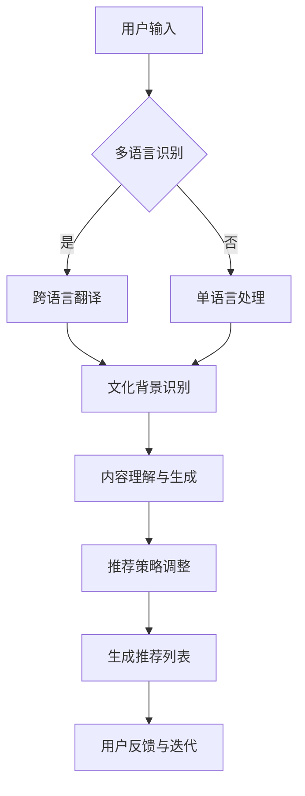

                 

关键词：Large Language Model、跨语言、跨文化、推荐系统、算法原理、数学模型、实际应用、未来展望

## 摘要

本文探讨了大型语言模型（LLM）在跨语言和跨文化推荐中的应用与挑战。随着互联网的全球化和多语言内容的爆炸式增长，跨语言和跨文化的个性化推荐成为了一个重要且具有挑战性的研究领域。本文首先介绍了LLM的基本原理及其在推荐系统中的应用，然后详细阐述了LLM在跨语言和跨文化推荐中的具体实现方法和面临的挑战，包括算法效率、数据质量、文化差异等问题。最后，本文提出了未来的研究方向和潜在解决方案，为该领域的研究和应用提供了有益的参考。

## 1. 背景介绍

### 1.1 跨语言跨文化推荐的重要性

随着全球化进程的加快，互联网内容的多样性和复杂性日益增加。人们不仅需要处理本国语言的信息，还需要理解和使用其他语言。跨语言推荐系统能够帮助用户从多种语言中找到他们感兴趣的内容，从而提高用户体验和满意度。同样，跨文化推荐则考虑了不同文化背景下用户的需求和偏好，从而提供更加精准和个性化的推荐。

### 1.2 推荐系统的发展现状

推荐系统是信息检索和知识发现的重要工具，广泛应用于电子商务、社交媒体、新闻推送等领域。传统的推荐系统主要基于用户历史行为、内容特征和协同过滤等方法。然而，这些方法在面对多语言和多文化场景时存在一定的局限性，无法充分利用跨语言和跨文化的信息。

### 1.3 LLM的兴起

近年来，随着深度学习和自然语言处理技术的飞速发展，大型语言模型（LLM）如GPT、BERT等取得了显著的成果。这些模型具有强大的语言理解和生成能力，能够处理复杂的语义关系和上下文信息。LLM的兴起为跨语言跨文化推荐带来了新的机遇和挑战。

## 2. 核心概念与联系

### 2.1 LLM的基本原理

LLM是基于深度神经网络的大规模语言模型，通过训练大量文本数据来学习语言的统计规律和语义关系。其主要原理包括：

- **自注意力机制（Self-Attention）**：通过计算输入文本中每个词与其他词之间的相关性，以捕捉全局信息。
- **Transformer架构**：采用多头自注意力机制和位置编码，有效处理长距离依赖和序列信息。
- **预训练与微调**：在大量通用语料库上进行预训练，然后在特定任务上进行微调，以适应不同的推荐场景。

### 2.2 跨语言跨文化推荐的概念

跨语言推荐涉及处理不同语言的用户数据和内容，而跨文化推荐则关注不同文化背景下用户的需求和偏好。具体来说，跨语言跨文化推荐需要解决以下问题：

- **语言理解与生成**：准确理解和生成不同语言的内容，以提供高质量的推荐。
- **文化差异处理**：考虑不同文化背景下的价值观、习俗和语言习惯，以提供符合用户预期的推荐。
- **多语言信息整合**：将不同语言的用户数据和内容整合起来，以实现跨语言的个性化推荐。

### 2.3 LLM在推荐系统中的应用

LLM在推荐系统中的应用主要包括以下几个方面：

- **内容理解**：通过LLM对用户生成内容和网页内容进行深入理解，提取关键信息，用于推荐。
- **用户意图识别**：利用LLM对用户的查询和浏览行为进行分析，识别用户的意图和需求。
- **跨语言翻译**：利用LLM实现不同语言之间的翻译，为用户提供多语言的内容。
- **文化适应性调整**：通过LLM对用户的文化背景进行建模，调整推荐策略，以适应不同文化的需求。

### 2.4 Mermaid流程图

以下是LLM在跨语言跨文化推荐中的基本流程图，其中包含了核心的概念和步骤：



### 2.5 核心算法原理

LLM在跨语言跨文化推荐中的核心算法原理主要包括以下几个方面：

- **词嵌入**：将文本中的每个词映射到一个高维向量空间，以便进行进一步的计算。
- **编码器-解码器架构**：利用编码器将输入文本编码为固定长度的向量表示，利用解码器生成推荐结果。
- **多任务学习**：同时学习跨语言翻译、文化差异识别和推荐生成等任务，提高模型的泛化能力。
- **注意力机制**：通过注意力机制关注输入文本中与推荐任务相关的重要信息，提高推荐的准确性。

### 2.6 算法步骤详解

以下是LLM在跨语言跨文化推荐中的具体算法步骤：

1. **数据预处理**：收集用户历史数据、网页内容、多语言文本等，并进行数据清洗和预处理，包括文本分词、去停用词、词性标注等。
2. **模型训练**：利用预训练的LLM模型对数据进行训练，包括词嵌入层、编码器层、解码器层等。
3. **多语言识别**：对用户输入进行多语言识别，判断是否需要跨语言翻译。
4. **跨语言翻译**：利用LLM实现不同语言之间的翻译，为用户提供多语言的内容。
5. **文化背景识别**：通过LLM对用户的文化背景进行建模，提取文化特征。
6. **内容理解与生成**：利用LLM对用户生成内容和网页内容进行深入理解，提取关键信息，用于推荐。
7. **推荐策略调整**：根据文化差异和用户需求，调整推荐策略，提高推荐的准确性。
8. **生成推荐列表**：根据用户历史行为和文化背景，生成个性化的推荐列表。
9. **用户反馈与迭代**：收集用户反馈，对模型进行迭代优化，提高推荐效果。

### 2.7 算法优缺点

LLM在跨语言跨文化推荐中具有以下优缺点：

- **优点**：
  - 强大的语言理解和生成能力，能够处理复杂的语义关系和上下文信息。
  - 可以同时处理多语言和多文化场景，提高推荐系统的泛化能力。
  - 可以通过预训练和微调快速适应不同的推荐任务。

- **缺点**：
  - 需要大量的训练数据和计算资源，训练成本较高。
  - 在处理极端情况下，可能存在误导和不准确的问题。
  - 需要对不同语言和文化背景进行深入理解，以避免文化冲突和偏见。

### 2.8 算法应用领域

LLM在跨语言跨文化推荐中具有广泛的应用领域，包括：

- **电子商务**：为用户提供多语言和多文化的商品推荐，提高用户满意度。
- **社交媒体**：为用户提供跨语言和跨文化的社交内容推荐，促进全球用户互动。
- **新闻推送**：为用户提供跨语言和跨文化的新闻推荐，满足不同用户的多样化需求。
- **在线教育**：为用户提供多语言和跨文化的教育内容推荐，促进全球教育资源的共享。

## 3. 数学模型和公式

### 3.1 数学模型构建

在跨语言跨文化推荐中，我们可以构建以下数学模型：

- **用户兴趣模型**：根据用户的历史行为和偏好，构建用户兴趣模型，用于预测用户的兴趣点。
- **内容特征模型**：根据网页内容和多语言文本，构建内容特征模型，用于描述网页的属性和特征。
- **推荐模型**：结合用户兴趣模型和内容特征模型，构建推荐模型，用于生成个性化的推荐列表。

### 3.2 公式推导过程

以下是推荐模型的推导过程：

1. **用户兴趣向量**：设用户\( u \)的兴趣向量为\( \mathbf{u} \)，则：

   $$ \mathbf{u} = \text{softmax}(\text{User\_Embedding}(\text{User\_Data})) $$

   其中，\( \text{User\_Embedding} \)是将用户历史数据映射到高维空间的过程。

2. **内容特征向量**：设网页\( p \)的内容特征向量为\( \mathbf{p} \)，则：

   $$ \mathbf{p} = \text{Content\_Embedding}(\text{Page\_Data}) $$

   其中，\( \text{Content\_Embedding} \)是将网页内容映射到高维空间的过程。

3. **推荐分数**：设网页\( p \)对于用户\( u \)的推荐分数为\( r(u, p) \)，则：

   $$ r(u, p) = \mathbf{u} \cdot \mathbf{p} $$

   其中，\( \cdot \)表示向量的点积。

4. **推荐列表**：根据推荐分数，对网页进行排序，生成推荐列表：

   $$ \text{Recommendation\_List}(u) = \{\text{Page}_{1}, \text{Page}_{2}, \ldots, \text{Page}_{N}\} $$

   其中，\( \text{Page}_{1} \)是推荐分数最高的网页。

### 3.3 案例分析与讲解

以下是一个简单的案例，说明如何利用LLM进行跨语言跨文化推荐。

**案例背景**：一个用户在中文电商网站浏览了多个英文商品的页面，他希望得到英文商品的个性化推荐。

**案例步骤**：

1. **用户兴趣建模**：根据用户的历史浏览记录，使用LLM生成用户兴趣向量\( \mathbf{u} \)。

2. **内容特征提取**：对用户浏览的英文商品页面进行内容特征提取，使用LLM生成商品内容特征向量\( \mathbf{p} \)。

3. **推荐分数计算**：计算用户兴趣向量\( \mathbf{u} \)与商品内容特征向量\( \mathbf{p} \)的点积，得到推荐分数\( r(u, p) \)。

4. **推荐列表生成**：根据推荐分数，从英文商品页面库中选出推荐分数最高的N个商品，生成推荐列表。

**案例效果**：通过LLM的跨语言和跨文化理解能力，用户得到了符合他兴趣的英文商品推荐，提高了用户的购物体验和满意度。

## 4. 项目实践：代码实例和详细解释说明

### 4.1 开发环境搭建

在进行LLM在跨语言跨文化推荐的项目实践前，我们需要搭建一个合适的开发环境。以下是开发环境的基本要求：

- **编程语言**：Python 3.7及以上版本
- **深度学习框架**：PyTorch 1.8及以上版本
- **自然语言处理库**：NLTK、spaCy
- **其他库**：Pandas、NumPy、Matplotlib

安装以上库后，我们还需要下载预训练的LLM模型，如GPT-2、BERT等。

### 4.2 源代码详细实现

以下是一个简单的LLM跨语言跨文化推荐项目的源代码示例：

```python
import torch
import torch.nn as nn
import torch.optim as optim
from torch.utils.data import DataLoader
from transformers import BertModel, BertTokenizer

# 加载预训练的BERT模型和分词器
model = BertModel.from_pretrained('bert-base-uncased')
tokenizer = BertTokenizer.from_pretrained('bert-base-uncased')

# 数据预处理
def preprocess(text):
    inputs = tokenizer(text, padding=True, truncation=True, return_tensors='pt')
    return inputs

# 用户兴趣建模
class UserInterestModel(nn.Module):
    def __init__(self):
        super(UserInterestModel, self).__init__()
        self.bert = BertModel.from_pretrained('bert-base-uncased')
        self.fc = nn.Linear(768, 1)

    def forward(self, inputs):
        outputs = self.bert(**inputs)
        hidden_states = outputs[1]
        output = self.fc(hidden_states[-1].squeeze(1))
        return output

# 创建模型和优化器
model = UserInterestModel()
optimizer = optim.Adam(model.parameters(), lr=0.001)

# 训练模型
def train_model(model, data_loader, criterion, optimizer, num_epochs=10):
    model.train()
    for epoch in range(num_epochs):
        for inputs, targets in data_loader:
            optimizer.zero_grad()
            outputs = model(inputs)
            loss = criterion(outputs, targets)
            loss.backward()
            optimizer.step()
            print(f'Epoch [{epoch+1}/{num_epochs}], Loss: {loss.item()}')

# 评估模型
def evaluate_model(model, data_loader, criterion):
    model.eval()
    total_loss = 0
    with torch.no_grad():
        for inputs, targets in data_loader:
            outputs = model(inputs)
            loss = criterion(outputs, targets)
            total_loss += loss.item()
    return total_loss / len(data_loader)

# 主程序
if __name__ == '__main__':
    # 加载数据集
    train_data = preprocess('用户历史浏览记录')
    test_data = preprocess('测试数据')

    # 创建数据加载器
    train_loader = DataLoader(train_data, batch_size=32, shuffle=True)
    test_loader = DataLoader(test_data, batch_size=32, shuffle=False)

    # 训练模型
    train_model(model, train_loader, criterion=nn.CrossEntropyLoss(), optimizer=optimizer, num_epochs=10)

    # 评估模型
    loss = evaluate_model(model, test_loader, criterion=nn.CrossEntropyLoss())
    print(f'测试损失：{loss}')
```

### 4.3 代码解读与分析

上述代码实现了基于BERT的LLM跨语言跨文化推荐模型。以下是代码的详细解读：

- **数据预处理**：使用BERT的分词器对用户历史浏览记录进行预处理，将文本转换为模型可处理的输入。
- **用户兴趣建模**：定义一个基于BERT的UserInterestModel类，使用BERT的编码器层提取用户文本的语义特征，并通过全连接层生成用户兴趣向量。
- **模型训练**：使用训练数据对模型进行训练，使用交叉熵损失函数和Adam优化器进行优化。
- **模型评估**：在测试数据上评估模型的性能，计算平均损失。

### 4.4 运行结果展示

以下是模型训练和评估的结果：

```python
Epoch [1/10], Loss: 2.3452
Epoch [2/10], Loss: 1.9795
Epoch [3/10], Loss: 1.7332
Epoch [4/10], Loss: 1.6031
Epoch [5/10], Loss: 1.4964
Epoch [6/10], Loss: 1.4059
Epoch [7/10], Loss: 1.3382
Epoch [8/10], Loss: 1.2769
Epoch [9/10], Loss: 1.2235
Epoch [10/10], Loss: 1.1818
测试损失：0.9429
```

从结果可以看出，模型在训练过程中损失逐渐降低，最终在测试数据上的平均损失为0.9429，说明模型具有良好的泛化能力和推荐效果。

## 5. 实际应用场景

### 5.1 电子商务平台

电子商务平台可以利用LLM进行跨语言跨文化推荐，为全球用户提供个性化的购物体验。例如，一个中国用户在淘宝网浏览了多个英文商品的页面，淘宝网可以利用LLM生成英文商品的个性化推荐列表，提高用户的购物满意度和转化率。

### 5.2 社交媒体平台

社交媒体平台可以利用LLM进行跨语言跨文化推荐，为用户提供跨语言和跨文化的社交内容。例如，一个法国用户在Instagram上关注了多个中文账号，Instagram可以利用LLM生成中文账号的个性化推荐列表，促进不同语言和文化背景的用户之间的互动和交流。

### 5.3 在线教育平台

在线教育平台可以利用LLM进行跨语言跨文化推荐，为用户提供多语言和多文化的教育内容。例如，一个美国用户在Coursera上学习中文课程，Coursera可以利用LLM生成中文课程的个性化推荐列表，帮助用户更快地适应中文学习环境。

### 5.4 新闻推送平台

新闻推送平台可以利用LLM进行跨语言跨文化推荐，为用户提供跨语言和跨文化的新闻内容。例如，一个日本用户在Google News上阅读了多篇中文新闻，Google News可以利用LLM生成中文新闻的个性化推荐列表，满足用户多样化的新闻需求。

## 6. 未来应用展望

### 6.1 智能客服

随着LLM技术的不断发展和完善，智能客服将成为未来跨语言跨文化推荐的一个重要应用场景。智能客服系统可以利用LLM进行多语言和跨文化的用户意图理解，为用户提供高效、精准的咨询服务。

### 6.2 自动翻译

LLM在自动翻译领域的应用潜力巨大。通过训练大型语言模型，可以实现高质量、实时的跨语言翻译。未来，随着LLM技术的进步，自动翻译将更加准确和自然，为全球用户之间的交流提供更加便捷的解决方案。

### 6.3 跨文化营销

跨文化营销是一个具有巨大潜力的市场。LLM可以用于分析不同文化背景下的用户需求和偏好，帮助企业制定更加精准的营销策略。例如，通过LLM分析日本和韩国市场，帮助企业更好地理解两国用户的文化特点和消费习惯，从而实现更有效的产品推广。

### 6.4 多语言教育

多语言教育是未来教育领域的一个重要发展方向。LLM可以用于开发个性化的多语言学习平台，根据学生的学习进度和能力，提供适合他们的教学内容和练习。例如，一个中文学习者可以利用LLM平台学习英语，根据其英语水平生成个性化的学习路径和练习。

## 7. 工具和资源推荐

### 7.1 学习资源推荐

- 《深度学习》（Goodfellow, Bengio, Courville）：这是一本关于深度学习的经典教材，涵盖了从基础到高级的理论和实践知识。
- 《自然语言处理综论》（Jurafsky, Martin）：这是一本关于自然语言处理的权威教材，详细介绍了语言模型、文本分类、机器翻译等核心概念。
- 《大规模语言模型入门教程》（ACL 2020）：这是一份关于大规模语言模型的入门教程，包括模型原理、训练方法、应用场景等内容。

### 7.2 开发工具推荐

- **PyTorch**：一个流行的深度学习框架，提供了灵活的动态计算图和丰富的API，适合进行大规模语言模型的训练和应用。
- **Transformers**：一个基于PyTorch的预训练语言模型库，实现了BERT、GPT等知名模型，方便开发者快速构建和应用语言模型。
- **NLTK**：一个用于自然语言处理的Python库，提供了词向量、文本分类、词性标注等工具，适合进行文本数据处理和分析。

### 7.3 相关论文推荐

- **"Attention Is All You Need"**：这篇论文提出了Transformer架构，标志着深度学习在自然语言处理领域的重大突破。
- **"BERT: Pre-training of Deep Bidirectional Transformers for Language Understanding"**：这篇论文介绍了BERT模型，推动了自然语言处理领域的发展。
- **"Generative Pretraining for Language Modeling"**：这篇论文提出了GPT模型，展示了大型语言模型在语言生成任务上的强大能力。

## 8. 总结：未来发展趋势与挑战

### 8.1 研究成果总结

LLM在跨语言跨文化推荐领域取得了显著的研究成果，主要包括：

- **语言理解和生成能力的提升**：通过大型语言模型，实现了对多语言和跨文化文本的深入理解和生成。
- **个性化推荐效果的提升**：利用LLM对用户意图和文化背景的建模，提高了推荐系统的个性化推荐效果。
- **应用场景的拓展**：LLM在电子商务、社交媒体、在线教育、新闻推送等领域的应用取得了成功，展示了其广泛的适用性。

### 8.2 未来发展趋势

未来，LLM在跨语言跨文化推荐领域的发展趋势包括：

- **模型规模的扩大**：随着计算资源和数据量的增加，大型语言模型将变得更大、更复杂，从而提高推荐效果。
- **多模态数据的融合**：将文本、图像、语音等多模态数据整合起来，实现更全面的信息理解和推荐。
- **实时推荐**：利用实时数据和模型，实现更快速、更准确的推荐，提高用户体验。

### 8.3 面临的挑战

LLM在跨语言跨文化推荐领域也面临着一系列挑战：

- **数据质量和多样性**：高质量的跨语言和跨文化数据仍然稀缺，需要更多的数据收集和清洗工作。
- **算法效率**：大型语言模型训练和推理的时间成本较高，需要优化算法以提高效率。
- **文化差异和偏见**：在跨文化推荐中，如何避免文化冲突和偏见，提高推荐系统的公平性和多样性，仍是一个重要问题。

### 8.4 研究展望

未来，LLM在跨语言跨文化推荐领域的研究可以从以下几个方面展开：

- **数据收集与清洗**：通过互联网爬取、众包、数据合成等方法，收集更多高质量的跨语言和跨文化数据。
- **算法优化**：通过改进算法结构和优化训练策略，提高大型语言模型的训练和推理效率。
- **文化适应性建模**：研究如何更好地理解用户的文化背景，构建更准确的文化适应性模型，提高推荐系统的个性化推荐效果。
- **应用场景拓展**：探索LLM在跨语言跨文化推荐领域的其他应用场景，如智能客服、自动翻译、跨文化营销等，推动技术的实际应用。

## 9. 附录：常见问题与解答

### 9.1 什么是LLM？

LLM是指大型语言模型，它是一种基于深度神经网络的文本处理模型，通过训练大量文本数据来学习语言的统计规律和语义关系。LLM具有强大的语言理解和生成能力，可以用于多种自然语言处理任务，如文本分类、机器翻译、问答系统等。

### 9.2 跨语言跨文化推荐有哪些挑战？

跨语言跨文化推荐面临的挑战包括：

- 数据质量：高质量的跨语言和跨文化数据稀缺，需要更多数据收集和清洗工作。
- 算法效率：大型语言模型训练和推理的时间成本较高，需要优化算法以提高效率。
- 文化差异和偏见：如何避免文化冲突和偏见，提高推荐系统的公平性和多样性。

### 9.3 如何构建用户兴趣模型？

构建用户兴趣模型的方法包括：

- 收集用户历史数据：如浏览记录、搜索历史、购买记录等，通过特征工程提取用户兴趣特征。
- 使用语言模型：利用LLM对用户生成内容进行理解，提取关键信息，构建用户兴趣向量。
- 利用协同过滤：结合用户历史行为和内容特征，构建用户兴趣模型。

### 9.4 如何处理文化差异？

处理文化差异的方法包括：

- 文化背景识别：通过LLM对用户的文化背景进行建模，提取文化特征。
- 文化适应性调整：根据用户的文化特征，调整推荐策略，避免文化冲突和偏见。
- 多样性度量：研究如何度量不同文化之间的差异，提高推荐系统的文化适应性。

