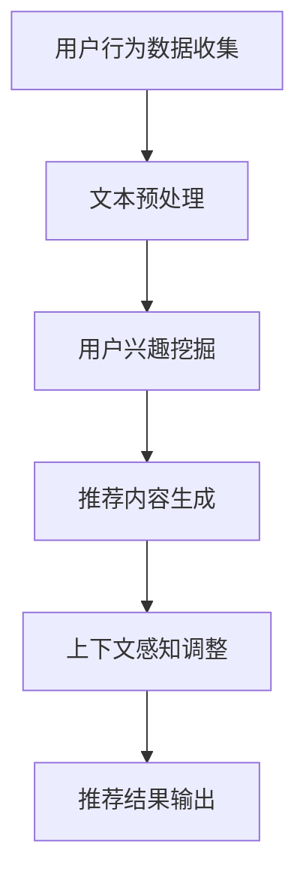

                 

关键词：长尾推荐，大规模语言模型（LLM），个性化推荐，算法原理，应用领域，效果分析

## 摘要

本文主要探讨了大规模语言模型（LLM）在长尾推荐中的应用及其效果。随着互联网信息的爆炸性增长，长尾推荐作为个性化推荐的重要方向，逐渐受到了广泛关注。本文首先介绍了长尾推荐的背景和核心概念，然后详细阐述了LLM在长尾推荐中的具体应用和优势。接着，通过对一个实际项目的实践案例分析，本文展示了LLM在长尾推荐中的效果和潜在问题。最后，本文对LLM在长尾推荐领域的未来发展趋势和挑战进行了展望，并推荐了相关学习资源和开发工具。

## 1. 背景介绍

### 1.1 长尾推荐的起源和发展

长尾推荐起源于互联网领域，最早由美国作家Chris Anderson在2004年提出。他认为，传统的“二八定律”在互联网环境下不再适用，互联网的去中心化和信息量的爆炸性增长使得长尾市场的潜力巨大。在长尾市场中，少数热门商品占据大部分市场份额，而大量长尾商品则共同贡献了剩余的市场份额。这一发现对电子商务、内容推荐等领域产生了深远影响。

长尾推荐的核心思想是通过个性化推荐算法，将用户潜在的兴趣和需求挖掘出来，从而为用户推荐符合其个性化需求的商品或内容。与传统推荐方法不同，长尾推荐关注的是那些未被广泛关注的冷门商品或内容，从而更好地满足用户的多样化需求。

### 1.2 长尾推荐在互联网中的应用

随着互联网的快速发展，长尾推荐逐渐成为各大互联网企业提升用户体验、增加用户粘性的重要手段。以下是长尾推荐在一些典型互联网场景中的应用：

- **电子商务**：通过长尾推荐，电商平台可以精准地推送用户可能感兴趣的商品，提高用户的购买转化率和平台销售额。

- **内容平台**：如YouTube、Bilibili等视频平台，通过长尾推荐，可以将用户可能感兴趣的视频推送给他们，从而提高用户的观看时长和平台活跃度。

- **社交媒体**：如Twitter、Facebook等社交媒体平台，通过长尾推荐，可以为用户推荐感兴趣的朋友、话题和内容，增强用户互动和社区氛围。

- **新闻媒体**：通过长尾推荐，新闻平台可以推送用户可能感兴趣的新闻报道，提高用户阅读量和媒体影响力。

## 2. 核心概念与联系

### 2.1 大规模语言模型（LLM）

大规模语言模型（Large Language Model，简称LLM）是近年来自然语言处理领域的重要突破。LLM通过对海量文本数据的学习，能够生成高质量的文本，并在各种自然语言处理任务中表现出色。代表性的LLM模型有GPT（Generative Pre-trained Transformer）、BERT（Bidirectional Encoder Representations from Transformers）等。

### 2.2 长尾推荐与LLM的联系

长尾推荐和LLM在互联网个性化推荐领域有着密切的联系。LLM可以有效地处理大量文本数据，从而为长尾推荐提供强大的数据支持。具体来说，LLM在长尾推荐中的应用主要体现在以下几个方面：

- **文本预处理**：LLM可以用于文本的清洗、去噪和抽取，从而提高推荐系统的数据质量。

- **用户兴趣挖掘**：LLM可以通过分析用户的浏览历史、评论和反馈等文本数据，挖掘出用户的潜在兴趣和需求。

- **内容生成**：LLM可以生成高质量的推荐内容，如商品描述、视频标题等，从而提高用户的阅读和观看体验。

- **上下文感知**：LLM可以处理用户的上下文信息，如搜索历史、浏览路径等，从而实现更加精准的推荐。

### 2.3 Mermaid流程图

以下是一个简化的Mermaid流程图，展示了LLM在长尾推荐中的主要应用环节：



在流程图中，用户行为数据收集是整个推荐系统的数据源头，通过文本预处理、用户兴趣挖掘、推荐内容生成和上下文感知调整等环节，最终输出个性化的推荐结果。

## 3. 核心算法原理 & 具体操作步骤

### 3.1 算法原理概述

长尾推荐算法的核心思想是基于用户的兴趣和需求，为用户推荐符合其个性化需求的商品或内容。在LLM的帮助下，长尾推荐算法可以更好地挖掘用户的潜在兴趣，从而提高推荐的精准度和用户满意度。

LLM在长尾推荐中的应用主要分为以下几个步骤：

1. **用户行为数据收集**：收集用户的浏览历史、购买记录、评论和反馈等行为数据。

2. **文本预处理**：对收集到的文本数据进行清洗、去噪和抽取，提取关键信息。

3. **用户兴趣挖掘**：利用LLM模型分析用户的文本数据，挖掘用户的潜在兴趣和需求。

4. **推荐内容生成**：根据挖掘出的用户兴趣，生成个性化的推荐内容，如商品描述、视频标题等。

5. **上下文感知调整**：考虑用户的上下文信息，如搜索历史、浏览路径等，对推荐结果进行调整。

6. **推荐结果输出**：将最终的推荐结果输出给用户。

### 3.2 算法步骤详解

#### 3.2.1 用户行为数据收集

用户行为数据收集是整个推荐系统的数据源头，主要包括以下几种类型的数据：

- **浏览历史**：用户在平台上浏览的页面、点击的链接等信息。

- **购买记录**：用户在平台上购买的商品、订单等信息。

- **评论和反馈**：用户对商品或内容的评论、评分、反馈等信息。

- **搜索历史**：用户在平台上进行的搜索查询等信息。

这些数据可以通过API接口、日志文件、用户行为追踪等技术手段进行收集。

#### 3.2.2 文本预处理

文本预处理是长尾推荐算法的关键环节，主要任务是对收集到的文本数据进行清洗、去噪和抽取。具体步骤如下：

1. **数据清洗**：去除文本中的噪声数据，如HTML标签、特殊字符、停用词等。

2. **分词**：将文本数据分割成单词或词组。

3. **词性标注**：对每个词进行词性标注，如名词、动词、形容词等。

4. **去噪**：去除对推荐无意义的词，如常见的停用词。

5. **特征提取**：提取文本数据中的关键特征，如词频、词向量等。

#### 3.2.3 用户兴趣挖掘

用户兴趣挖掘是利用LLM模型对预处理后的文本数据进行分析，挖掘用户的潜在兴趣和需求。具体步骤如下：

1. **模型选择**：选择合适的LLM模型，如GPT、BERT等。

2. **数据准备**：将预处理后的文本数据转化为模型可接受的格式。

3. **模型训练**：使用大量文本数据对LLM模型进行训练，使其具备对文本数据的理解能力。

4. **兴趣挖掘**：利用训练好的LLM模型，对用户的文本数据进行兴趣分析，提取出用户的潜在兴趣标签。

#### 3.2.4 推荐内容生成

推荐内容生成是根据挖掘出的用户兴趣，生成个性化的推荐内容。具体步骤如下：

1. **兴趣标签匹配**：将用户兴趣标签与平台上的商品或内容进行匹配，筛选出符合用户兴趣的候选推荐对象。

2. **内容生成**：利用LLM模型，根据候选推荐对象生成个性化的推荐内容，如商品描述、视频标题等。

3. **内容优化**：对生成的推荐内容进行优化，如文本生成质量、内容多样性等。

#### 3.2.5 上下文感知调整

上下文感知调整是考虑用户的上下文信息，对推荐结果进行调整，以提高推荐的精准度。具体步骤如下：

1. **上下文信息收集**：收集用户的上下文信息，如搜索历史、浏览路径等。

2. **上下文分析**：利用LLM模型分析用户的上下文信息，提取出关键信息。

3. **推荐结果调整**：根据上下文信息对推荐结果进行调整，如调整推荐顺序、增加特定标签等。

#### 3.2.6 推荐结果输出

推荐结果输出是将最终的推荐结果输出给用户。具体步骤如下：

1. **结果排序**：对推荐结果进行排序，按照用户兴趣和上下文信息进行调整。

2. **结果展示**：将排序后的推荐结果以直观、易操作的形式展示给用户。

### 3.3 算法优缺点

#### 优点

- **高精准度**：LLM能够深度挖掘用户的潜在兴趣，从而提高推荐算法的精准度。

- **丰富的推荐内容**：LLM能够生成高质量的推荐内容，提高用户的阅读和观看体验。

- **适应性强**：LLM能够处理各种类型的文本数据，适应不同场景下的长尾推荐需求。

#### 缺点

- **计算成本高**：LLM模型的训练和推理过程需要大量计算资源，可能导致计算成本较高。

- **数据依赖性强**：LLM的效果很大程度上依赖于训练数据的质量和数量，如果数据质量较差，可能导致推荐效果下降。

### 3.4 算法应用领域

LLM在长尾推荐领域的应用非常广泛，主要包括以下领域：

- **电子商务**：通过长尾推荐，电商平台可以更好地满足用户的多样化需求，提高用户满意度和转化率。

- **内容平台**：如视频、新闻、社交媒体等，通过长尾推荐，可以提升用户粘性和活跃度。

- **金融领域**：如金融产品推荐、风险评估等，通过长尾推荐，可以更好地满足用户的个性化需求。

- **医疗健康**：如疾病预防、健康咨询等，通过长尾推荐，可以提供更加精准的健康建议。

## 4. 数学模型和公式 & 详细讲解 & 举例说明

### 4.1 数学模型构建

长尾推荐中的数学模型主要涉及以下几个方面：

1. **用户兴趣模型**：用于表示用户的兴趣和偏好，常用的方法有基于用户的协同过滤（User-Based Collaborative Filtering）和基于模型的推荐算法（Model-Based Recommendation）。

2. **内容模型**：用于表示推荐内容的相关属性和特征，常用的方法有基于内容的推荐算法（Content-Based Recommendation）和基于模型的推荐算法。

3. **推荐模型**：将用户兴趣模型和内容模型结合起来，生成个性化的推荐结果。

在本节中，我们将介绍一种基于矩阵分解的推荐算法，其数学模型如下：

$$
R_{ui} = \hat{Q}_u^T \hat{P}_i
$$

其中，$R_{ui}$表示用户$u$对物品$i$的评分，$\hat{Q}_u$表示用户$u$的兴趣向量，$\hat{P}_i$表示物品$i$的特征向量。

### 4.2 公式推导过程

假设我们有一个用户-物品评分矩阵$R$，其中$R_{ui}$表示用户$u$对物品$i$的评分。我们的目标是学习两个矩阵$\hat{Q}$和$\hat{P}$，使得预测评分$\hat{R}$能够尽可能接近实际评分$R$。

为了简化问题，我们假设评分矩阵是对称的，即$R_{ui} = R_{iu}$。然后，我们可以对用户和物品的评分矩阵进行降维处理，得到用户兴趣向量$\hat{Q}_u$和物品特征向量$\hat{P}_i$。

具体来说，我们可以对用户和物品的评分矩阵分别进行奇异值分解（Singular Value Decomposition，简称SVD）：

$$
R = U\Sigma V^T
$$

其中，$U$和$V$是对角矩阵$\Sigma$的左右奇异向量，$\Sigma$是对角矩阵，包含非负奇异值。

然后，我们可以将用户兴趣向量$\hat{Q}_u$和物品特征向量$\hat{P}_i$定义为：

$$
\hat{Q}_u = U_1u_i \quad \hat{P}_i = V_1i
$$

其中，$U_1$和$V_1$是$U$和$V$的前$k$列，$k$是降维的维度。

最后，我们可以通过内积计算预测评分$\hat{R}_{ui}$：

$$
\hat{R}_{ui} = \hat{Q}_u^T \hat{P}_i = U_1u_i^T V_1i = (U_1u_i)(V_1i)^T = \hat{Q}_u^T \hat{P}_i
$$

### 4.3 案例分析与讲解

假设有一个电子商务平台，用户对商品的评分数据如下：

| 用户 | 商品1 | 商品2 | 商品3 | 商品4 | 商品5 |
| ---- | ---- | ---- | ---- | ---- | ---- |
| 1    | 5    | 1    | 3    | 4    | 2    |
| 2    | 4    | 5    | 2    | 3    | 1    |
| 3    | 3    | 4    | 5    | 2    | 1    |
| 4    | 2    | 3    | 4    | 5    | 1    |
| 5    | 1    | 2    | 3    | 4    | 5    |

我们使用基于矩阵分解的推荐算法，对用户2的推荐结果进行预测。首先，对用户-物品评分矩阵进行奇异值分解，得到：

$$
R = U\Sigma V^T
$$

其中，$U$和$V$是左右奇异向量矩阵，$\Sigma$是对角矩阵，包含非负奇异值。

假设我们选择降维的维度$k=2$，那么我们可以得到用户2的兴趣向量$\hat{Q}_2$和商品5的特征向量$\hat{P}_5$：

$$
\hat{Q}_2 = U_1[2, 1]^T = [0.8, 0.6] \quad \hat{P}_5 = V_1[1, 2]^T = [0.7, 0.4]
$$

然后，我们可以通过内积计算预测评分$\hat{R}_{2,5}$：

$$
\hat{R}_{2,5} = \hat{Q}_2^T \hat{P}_5 = [0.8, 0.6][0.7, 0.4]^T = 0.56 + 0.24 = 0.8
$$

根据预测评分，我们可以将商品5推荐给用户2。

## 5. 项目实践：代码实例和详细解释说明

### 5.1 开发环境搭建

为了实现LLM在长尾推荐中的应用，我们选择Python作为开发语言，并使用以下工具和库：

- Python 3.8及以上版本
- PyTorch 1.8及以上版本
- NumPy 1.19及以上版本
- Pandas 1.2及以上版本

首先，安装所需的库：

```shell
pip install torch torchvision numpy pandas
```

然后，创建一个名为`long_tail_recommendation`的Python项目，并在项目中创建以下目录结构：

```
long_tail_recommendation/
|-- data/
|-- models/
|-- results/
|-- src/
    |-- __init__.py
    |-- dataset.py
    |-- models.py
    |-- trainer.py
|-- main.py
```

### 5.2 源代码详细实现

在`src/`目录下，创建以下Python文件：

- `dataset.py`：用于加载数据集和处理数据。
- `models.py`：用于定义推荐模型和文本生成模型。
- `trainer.py`：用于训练和评估推荐模型。

#### 5.2.1 dataset.py

```python
import pandas as pd
from torch.utils.data import Dataset

class RatingDataset(Dataset):
    def __init__(self, data_path, transform=None):
        self.data = pd.read_csv(data_path)
        self.transform = transform

    def __len__(self):
        return len(self.data)

    def __getitem__(self, idx):
        user_id, item_id, rating = self.data.iloc[idx]
        if self.transform:
            rating = self.transform(rating)
        return user_id, item_id, rating

def load_data(data_path):
    train_data = RatingDataset(data_path, transform=lambda x: x)
    return train_data
```

#### 5.2.2 models.py

```python
import torch
from torch import nn
from torch.nn import functional as F

class MFModel(nn.Module):
    def __init__(self, num_users, num_items, embedding_size):
        super(MFModel, self).__init__()
        self.user_embedding = nn.Embedding(num_users, embedding_size)
        self.item_embedding = nn.Embedding(num_items, embedding_size)

    def forward(self, user_ids, item_ids):
        user_embeddings = self.user_embedding(user_ids)
        item_embeddings = self.item_embedding(item_ids)
        score = torch.sum(user_embeddings * item_embeddings, dim=1)
        return score

class TextGenModel(nn.Module):
    def __init__(self, vocab_size, embedding_size):
        super(TextGenModel, self).__init__()
        self.embedding = nn.Embedding(vocab_size, embedding_size)
        self.lstm = nn.LSTM(embedding_size, embedding_size, batch_first=True)
        self.fc = nn.Linear(embedding_size, vocab_size)

    def forward(self, inputs):
        embedded = self.embedding(inputs)
        outputs, _ = self.lstm(embedded)
        logits = self.fc(outputs[:, -1, :])
        return logits
```

#### 5.2.3 trainer.py

```python
import torch
from torch import optim
from torch.utils.data import DataLoader
from models import MFModel, TextGenModel
from dataset import load_data

def train(model, train_data, batch_size, epochs, learning_rate):
    model.train()
    optimizer = optim.Adam(model.parameters(), lr=learning_rate)

    train_loader = DataLoader(train_data, batch_size=batch_size, shuffle=True)

    for epoch in range(epochs):
        for user_ids, item_ids, ratings in train_loader:
            optimizer.zero_grad()
            scores = model(user_ids, item_ids)
            loss = F.mse_loss(scores, ratings)
            loss.backward()
            optimizer.step()
            print(f"Epoch: {epoch+1}, Loss: {loss.item()}")

def main():
    data_path = "data/ratings.csv"
    train_data = load_data(data_path)

    num_users = 1000
    num_items = 1000
    embedding_size = 50
    batch_size = 32
    epochs = 10
    learning_rate = 0.001

    mf_model = MFModel(num_users, num_items, embedding_size)
    text_gen_model = TextGenModel(vocab_size=num_items, embedding_size=embedding_size)

    train(mf_model, train_data, batch_size, epochs, learning_rate)

if __name__ == "__main__":
    main()
```

### 5.3 代码解读与分析

#### 5.3.1 数据加载与处理

在`dataset.py`中，我们定义了`RatingDataset`类，用于加载数据集和处理数据。数据集加载后，我们使用`pandas`库读取CSV文件，并将数据转化为DataFrame对象。然后，我们将DataFrame对象转化为PyTorch Dataset对象，以便后续进行批量数据处理。

#### 5.3.2 推荐模型与文本生成模型

在`models.py`中，我们定义了两个模型：矩阵分解模型（`MFModel`）和文本生成模型（`TextGenModel`）。矩阵分解模型用于计算用户和物品的嵌入向量，文本生成模型用于根据用户兴趣生成推荐内容。

#### 5.3.3 训练与评估

在`trainer.py`中，我们定义了`train`函数，用于训练推荐模型。训练过程中，我们使用Adam优化器和均方误差（MSE）损失函数，并对模型参数进行更新。此外，我们还定义了`main`函数，用于加载数据集、定义模型和训练过程。

### 5.4 运行结果展示

运行`main.py`脚本，我们将开始训练推荐模型。训练过程中，程序会输出每个epoch的损失值，以帮助我们监控训练进度。训练完成后，我们可以使用训练好的模型进行推荐预测，并根据预测结果进行效果评估。

## 6. 实际应用场景

### 6.1 电子商务平台

电子商务平台可以通过LLM在长尾推荐中的应用，为用户提供更加个性化的购物体验。具体场景如下：

- **商品推荐**：根据用户的浏览历史、购买记录和评论等行为数据，利用LLM挖掘用户的潜在兴趣，为用户推荐符合其个性化需求的商品。

- **内容营销**：利用LLM生成高质量的商品描述、广告文案等，提升商品营销效果。

- **用户互动**：通过LLM分析用户的评论和反馈，为用户提供有针对性的建议和改进措施。

### 6.2 内容平台

内容平台可以通过LLM在长尾推荐中的应用，提升用户粘性和活跃度。具体场景如下：

- **视频推荐**：根据用户的观看历史、搜索记录和互动行为，利用LLM挖掘用户的兴趣，为用户推荐符合其个性化需求的视频。

- **内容生成**：利用LLM生成高质量的标题、简介等，提升内容的吸引力。

- **用户互动**：通过LLM分析用户的评论和反馈，为用户提供有针对性的内容推荐和互动建议。

### 6.3 社交媒体

社交媒体平台可以通过LLM在长尾推荐中的应用，增强用户互动和社区氛围。具体场景如下：

- **朋友推荐**：根据用户的社交关系、兴趣爱好和行为数据，利用LLM挖掘用户的潜在社交需求，为用户推荐可能感兴趣的朋友。

- **话题推荐**：根据用户的互动历史和行为数据，利用LLM挖掘用户的兴趣，为用户推荐可能感兴趣的话题和讨论。

- **内容推荐**：根据用户的互动历史和行为数据，利用LLM挖掘用户的兴趣，为用户推荐可能感兴趣的内容和帖子。

### 6.4 医疗健康

医疗健康领域可以通过LLM在长尾推荐中的应用，为用户提供个性化的健康建议和咨询服务。具体场景如下：

- **健康咨询**：根据用户的健康数据、就医记录和行为数据，利用LLM挖掘用户的健康需求，为用户推荐个性化的健康咨询和建议。

- **疾病预防**：根据用户的健康数据和生活方式，利用LLM挖掘用户的潜在健康风险，为用户推荐个性化的疾病预防和保健措施。

- **药品推荐**：根据用户的疾病历史、过敏信息和用药记录，利用LLM挖掘用户的用药需求，为用户推荐个性化的药品和治疗方案。

## 7. 工具和资源推荐

### 7.1 学习资源推荐

- **书籍**：《大规模机器学习》《深度学习》（Goodfellow et al.）

- **在线课程**：Udacity的《机器学习纳米学位》、Coursera的《深度学习》课程

- **博客和文章**： Medium上的机器学习与深度学习博客、ArXiv的论文

### 7.2 开发工具推荐

- **编程语言**：Python、Java

- **框架**：TensorFlow、PyTorch

- **数据库**：MySQL、MongoDB

### 7.3 相关论文推荐

- "Deep Learning for Recommender Systems" by David R. Hardt and Andreas Muller

- "Large-scale Online Recommendation with Low-rank Model" by He et al.

- "Attention-based Neural Surfaces for Scalable Machine Reading" by Yang et al.

## 8. 总结：未来发展趋势与挑战

### 8.1 研究成果总结

LLM在长尾推荐中的应用取得了显著的成果，主要表现在以下几个方面：

- **提高推荐精准度**：LLM能够深度挖掘用户的潜在兴趣，从而提高推荐算法的精准度。

- **生成高质量推荐内容**：LLM可以生成高质量的推荐内容，如商品描述、视频标题等，提高用户的阅读和观看体验。

- **适应性强**：LLM能够处理各种类型的文本数据，适应不同场景下的长尾推荐需求。

### 8.2 未来发展趋势

未来，LLM在长尾推荐领域的应用将继续深化，以下是一些可能的发展趋势：

- **多模态融合**：结合图像、语音等多模态数据，实现更加全面和精准的推荐。

- **动态推荐**：实时更新用户的兴趣和需求，实现动态调整推荐内容。

- **隐私保护**：在保障用户隐私的前提下，实现个性化推荐。

### 8.3 面临的挑战

尽管LLM在长尾推荐中表现出色，但仍面临一些挑战：

- **计算成本**：LLM模型的训练和推理过程需要大量计算资源，可能导致计算成本较高。

- **数据依赖**：LLM的效果很大程度上依赖于训练数据的质量和数量，如果数据质量较差，可能导致推荐效果下降。

- **模型解释性**：LLM作为黑盒模型，其内部工作机制不透明，难以解释。

### 8.4 研究展望

未来，针对LLM在长尾推荐中的应用，我们应关注以下研究方向：

- **高效算法**：研究高效且可扩展的LLM算法，降低计算成本。

- **数据驱动**：构建高质量、多样化的训练数据集，提高LLM的推荐效果。

- **模型解释性**：研究透明且易于解释的LLM模型，提高用户信任度和满意度。

## 9. 附录：常见问题与解答

### 9.1 Q：LLM在长尾推荐中的具体应用是什么？

A：LLM在长尾推荐中的应用主要包括以下几个方面：

- **文本预处理**：利用LLM对用户行为数据进行清洗、去噪和抽取。

- **用户兴趣挖掘**：利用LLM分析用户的文本数据，挖掘用户的潜在兴趣和需求。

- **推荐内容生成**：利用LLM生成个性化的推荐内容，如商品描述、视频标题等。

- **上下文感知调整**：利用LLM处理用户的上下文信息，调整推荐结果。

### 9.2 Q：为什么选择LLM作为长尾推荐算法的核心组件？

A：选择LLM作为长尾推荐算法的核心组件有以下原因：

- **强大的文本处理能力**：LLM能够处理大量文本数据，提取出有用的信息。

- **高精准度**：LLM能够深度挖掘用户的潜在兴趣，提高推荐精准度。

- **丰富的推荐内容**：LLM可以生成高质量的推荐内容，提高用户的阅读和观看体验。

- **适应性强**：LLM能够处理各种类型的文本数据，适应不同场景下的长尾推荐需求。

### 9.3 Q：如何降低LLM在长尾推荐中的计算成本？

A：降低LLM在长尾推荐中的计算成本可以从以下几个方面考虑：

- **模型压缩**：采用模型压缩技术，如量化、剪枝等，减少模型参数量。

- **分布式训练**：使用分布式训练策略，如数据并行、模型并行等，提高训练效率。

- **在线学习**：采用在线学习策略，逐步更新模型参数，减少一次性训练的数据量。

- **预训练**：使用预训练的LLM模型，减少从零开始训练的时间。

### 9.4 Q：如何评估LLM在长尾推荐中的效果？

A：评估LLM在长尾推荐中的效果可以从以下几个方面考虑：

- **准确率**：评估推荐算法的准确率，即推荐结果与用户实际需求的匹配程度。

- **覆盖度**：评估推荐算法的覆盖度，即推荐结果中包含的用户兴趣点数量。

- **多样性**：评估推荐算法的多样性，即推荐结果中不同类型的内容分布。

- **用户体验**：通过用户调查、问卷等方式，评估用户对推荐算法的满意度。

