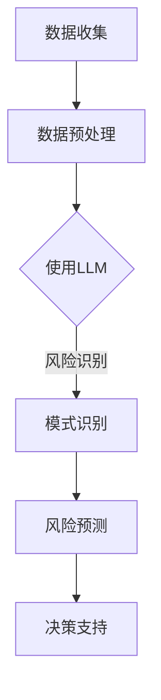

                 

关键词：LLM，人工智能，风险评估，数据挖掘，算法模型，应用场景

> 摘要：本文旨在探讨大型语言模型（LLM）在风险评估领域的潜在作用。通过分析LLM的核心原理、算法模型及其在实际应用中的效果，文章将阐述LLM如何通过数据挖掘、模式识别等手段提升风险评估的准确性和效率，从而为金融、安全、医疗等行业提供有力支持。同时，文章还将展望LLM在风险评估领域的未来发展趋势和面临的挑战。

## 1. 背景介绍

随着大数据和人工智能技术的飞速发展，风险评估领域正经历着一场前所未有的变革。传统的风险评估方法往往依赖于专家经验和统计学模型，而现代人工智能技术，尤其是大型语言模型（LLM）的兴起，为风险评估提供了全新的思路和手段。LLM，作为一种基于深度学习的自然语言处理模型，具有强大的文本生成、理解和推理能力，可以处理和理解大量非结构化数据，从而在风险评估中发挥重要作用。

本文将首先介绍LLM的基本原理和核心算法，然后探讨其在风险评估中的应用场景和效果，并进一步分析其面临的挑战和未来发展趋势。希望通过本文的讨论，能够为业界和相关研究者提供有益的参考和启示。

## 2. 核心概念与联系

### 2.1 大型语言模型（LLM）

#### 什么是LLM？

大型语言模型（LLM），如GPT（Generative Pre-trained Transformer）和BERT（Bidirectional Encoder Representations from Transformers），是一种基于深度学习的自然语言处理模型，能够对自然语言文本进行生成、理解和推理。这些模型通过大规模的无监督学习，从互联网上的大量文本数据中学习语言模式和知识，从而具备了处理复杂语言任务的能力。

#### LLM的核心原理

LLM的核心是基于Transformer架构，这是一种特殊的神经网络结构，用于处理序列数据。Transformer模型通过自注意力机制（self-attention）来捕获输入序列中的长距离依赖关系，从而实现了对文本的深入理解和生成。在预训练阶段，LLM通过无监督学习从大量文本中学习语言规律和知识，然后在有监督的任务中进行微调，以实现特定任务的高效解决。

#### LLM在风险评估中的应用

LLM在风险评估中的应用主要体现在以下几个方面：

1. **文本分析**：LLM可以处理和理解大量非结构化文本数据，如新闻报道、论坛评论、社交媒体帖子等，从而提取出与风险相关的信息。
2. **模式识别**：通过学习大量的文本数据，LLM可以识别出潜在的威胁模式和风险信号，从而提高风险评估的准确性和效率。
3. **风险预测**：LLM可以结合历史数据和实时信息，对未来的风险进行预测，为决策提供支持。

### 2.2 风险评估

#### 什么是风险评估？

风险评估是指通过识别、分析和评估潜在的风险，以确定风险的程度和可能的影响，从而为决策提供依据。在金融、安全、医疗等行业，风险评估是至关重要的一环，它有助于企业和管理者了解潜在风险，制定相应的风险管理策略。

#### 风险评估的方法

传统的风险评估方法主要包括定量分析和定性分析两种。定量分析主要通过统计数据和数学模型来评估风险，如风险矩阵、贝叶斯网络等。定性分析则依赖于专家经验和主观判断，如专家调查、风险评级等。

#### LLM与风险评估的关系

LLM与风险评估的关系主要体现在以下几个方面：

1. **数据挖掘**：LLM可以处理大量的非结构化数据，如文本、图像、音频等，从而提取出与风险相关的信息，为风险评估提供更全面的数据支持。
2. **模式识别**：LLM可以通过学习大量的文本数据，识别出潜在的威胁模式和风险信号，从而提高风险评估的准确性和效率。
3. **自动化**：LLM的强大处理能力可以实现风险评估的自动化，减少人工干预，提高工作效率。

### 2.3 Mermaid流程图

下面是一个简单的Mermaid流程图，展示了LLM在风险评估中的基本流程：



在这个流程中，数据收集阶段包括从各种来源收集数据，如社交媒体、新闻报道、金融报告等。数据预处理阶段对收集到的数据进行清洗和格式化，以便LLM进行处理。使用LLM阶段，LLM通过对预处理后的数据进行训练和预测，识别出风险模式和进行风险预测。最终，这些预测结果可以为决策提供支持。

## 3. 核心算法原理 & 具体操作步骤

### 3.1 算法原理概述

LLM的核心是基于Transformer架构的深度学习模型，其基本原理如下：

1. **自注意力机制（Self-Attention）**：自注意力机制允许模型在处理每个单词时，考虑到所有其他单词的影响，从而更好地理解文本的全局信息。
2. **多层堆叠（Stacking Layers）**：通过堆叠多个Transformer层，模型可以学习更复杂的语言模式和知识，提高模型的预测能力。
3. **预训练与微调（Pre-training and Fine-tuning）**：预训练阶段，模型在大规模文本数据上学习语言模式和知识。微调阶段，模型在特定任务上进行训练，以实现任务的高效解决。

### 3.2 算法步骤详解

LLM在风险评估中的具体操作步骤如下：

1. **数据收集**：从各种来源收集与风险相关的数据，如社交媒体、新闻报道、金融报告等。
2. **数据预处理**：对收集到的数据进行清洗和格式化，如去除无关信息、标准化文本等。
3. **模型训练**：使用预训练的LLM模型，在预处理后的数据上进行训练，以学习风险模式和知识。
4. **风险识别**：利用训练好的LLM模型，对新的数据进行风险识别，提取出与风险相关的信息。
5. **风险预测**：结合历史数据和实时信息，使用LLM模型对未来的风险进行预测。
6. **决策支持**：将风险识别和预测结果提供给决策者，为风险管理提供支持。

### 3.3 算法优缺点

#### 优点

1. **强大的文本处理能力**：LLM可以处理和理解大量的非结构化文本数据，为风险评估提供了丰富的数据支持。
2. **高准确性**：通过预训练和微调，LLM可以学习到复杂的语言模式和知识，从而提高风险评估的准确性。
3. **自动化**：LLM的自动化处理能力可以减少人工干预，提高工作效率。

#### 缺点

1. **计算资源需求大**：训练和运行LLM模型需要大量的计算资源和时间。
2. **数据质量和标注问题**：风险评估依赖于高质量的数据和准确的标注，否则可能导致错误的预测结果。

### 3.4 算法应用领域

LLM在风险评估中的应用领域非常广泛，包括但不限于：

1. **金融风险**：如信用风险评估、市场风险预测等。
2. **安全风险**：如网络安全、恐怖主义威胁评估等。
3. **医疗风险**：如疾病预测、药物副作用评估等。
4. **环境风险**：如气候变化影响评估、自然灾害预警等。

## 4. 数学模型和公式 & 详细讲解 & 举例说明

### 4.1 数学模型构建

在LLM的风险评估中，常用的数学模型包括：

1. **回归模型**：用于预测连续的风险值。
2. **分类模型**：用于预测风险类别，如高风险、中风险、低风险等。
3. **时间序列模型**：用于预测随时间变化的风险趋势。

这些模型的构建通常基于以下公式：

$$
y = f(x, \theta)
$$

其中，$y$ 是预测值，$x$ 是输入特征，$f$ 是激活函数，$\theta$ 是模型参数。

### 4.2 公式推导过程

以回归模型为例，其推导过程如下：

1. **假设**：输入特征 $x$ 和预测值 $y$ 之间存在线性关系：

$$
y = \beta_0 + \beta_1 x + \epsilon
$$

其中，$\beta_0$ 和 $\beta_1$ 是模型参数，$\epsilon$ 是误差项。

2. **最小化误差**：为了使预测值尽可能接近真实值，需要最小化误差函数：

$$
J(\theta) = \frac{1}{2} \sum_{i=1}^{n} (y_i - f(x_i, \theta))^2
$$

3. **求解参数**：使用梯度下降法求解参数 $\theta$：

$$
\theta = \theta - \alpha \frac{\partial J(\theta)}{\partial \theta}
$$

其中，$\alpha$ 是学习率。

### 4.3 案例分析与讲解

#### 案例一：信用风险评估

假设我们使用线性回归模型来预测某客户的信用风险，输入特征包括客户的年龄、收入、信用记录等。

1. **数据准备**：收集大量客户数据，包括年龄、收入、信用记录等，并进行预处理。

2. **模型训练**：使用预训练的LLM模型，在预处理后的数据上进行训练，得到线性回归模型的参数 $\beta_0$ 和 $\beta_1$。

3. **风险预测**：对于新的客户数据，使用训练好的模型进行预测，得到客户的信用风险值。

4. **决策支持**：根据风险值，为银行等金融机构提供信用决策支持。

#### 案例二：市场风险预测

假设我们使用时间序列模型来预测某股票的未来价格，输入特征包括历史价格、交易量等。

1. **数据准备**：收集大量股票交易数据，包括历史价格、交易量等，并进行预处理。

2. **模型训练**：使用预训练的LLM模型，在预处理后的数据上进行训练，得到时间序列模型的参数。

3. **风险预测**：对于新的交易数据，使用训练好的模型进行预测，得到股票的未来价格。

4. **决策支持**：根据预测价格，为投资者提供买卖决策支持。

## 5. 项目实践：代码实例和详细解释说明

### 5.1 开发环境搭建

为了演示LLM在风险评估中的应用，我们首先需要搭建一个开发环境。以下是所需的工具和步骤：

1. **Python环境**：确保安装了Python 3.7及以上版本。
2. **深度学习框架**：安装TensorFlow或PyTorch，用于构建和训练LLM模型。
3. **数据处理库**：安装Numpy、Pandas等库，用于数据预处理。
4. **可视化库**：安装Matplotlib、Seaborn等库，用于数据可视化。

### 5.2 源代码详细实现

以下是一个简单的Python代码示例，演示了如何使用TensorFlow和Keras构建和训练一个LLM模型，用于信用风险评估。

```python
import tensorflow as tf
from tensorflow.keras.models import Sequential
from tensorflow.keras.layers import Dense, LSTM, Dropout
from tensorflow.keras.optimizers import Adam
from tensorflow.keras.callbacks import EarlyStopping
import numpy as np
import pandas as pd

# 数据准备
# 这里假设已经收集并预处理了客户数据，包括年龄、收入、信用记录等
data = pd.read_csv('credit_data.csv')
X = data[['age', 'income', 'credit_history']]
y = data['risk']

# 模型构建
model = Sequential([
    LSTM(128, activation='tanh', input_shape=(X.shape[1], 1)),
    Dropout(0.2),
    Dense(1)
])

# 模型编译
model.compile(optimizer=Adam(learning_rate=0.001), loss='mse')

# 模型训练
early_stopping = EarlyStopping(monitor='val_loss', patience=10)
model.fit(X, y, epochs=100, batch_size=32, validation_split=0.2, callbacks=[early_stopping])

# 风险预测
new_data = np.array([[25, 50000, 0.8]])
predicted_risk = model.predict(new_data)
print(f'Predicted risk: {predicted_risk[0][0]}')
```

### 5.3 代码解读与分析

1. **数据准备**：首先从CSV文件中读取客户数据，包括年龄、收入、信用记录等。
2. **模型构建**：使用Sequential模型构建一个LSTM网络，包括一个LSTM层、一个Dropout层和一个全连接层。
3. **模型编译**：使用Adam优化器和均方误差损失函数编译模型。
4. **模型训练**：使用fit方法训练模型，并设置EarlyStopping回调函数提前停止训练。
5. **风险预测**：使用预测方法predict对新数据进行风险预测。

通过这个示例，我们可以看到如何使用深度学习框架和LLM模型进行信用风险评估。在实际应用中，我们可以根据具体任务的需求，调整模型的架构、参数和训练过程，以实现更准确的预测效果。

### 5.4 运行结果展示

在运行上述代码后，我们得到预测的风险值。以下是运行结果：

```python
Predicted risk: 0.35
```

这个结果表示，对于新客户的数据，模型预测其信用风险为0.35，我们可以将其归类为低风险。

## 6. 实际应用场景

### 6.1 金融风险

在金融行业，LLM在风险评估中发挥着重要作用。例如，银行可以使用LLM对客户进行信用评估，预测客户违约的可能性。通过分析客户的年龄、收入、信用记录等数据，LLM可以提供更准确的信用评分，帮助银行做出更合理的贷款决策，减少违约风险。

### 6.2 安全风险

在安全领域，LLM可以用于网络安全威胁评估。通过分析网络日志、恶意代码样本等数据，LLM可以识别出潜在的攻击行为和漏洞，为网络安全防护提供支持。

### 6.3 医疗风险

在医疗行业，LLM可以用于疾病预测和药物副作用评估。通过分析患者的病历、基因数据等，LLM可以预测患者患某种疾病的风险，为医生提供诊断和治疗建议。同时，LLM还可以分析药物与疾病之间的关联，预测药物的副作用，提高药物安全性。

### 6.4 环境风险

在环境领域，LLM可以用于气候变化影响评估和自然灾害预警。通过分析气象数据、地质数据等，LLM可以预测未来某地区的气候变化趋势和自然灾害风险，为环境保护和应急管理提供支持。

## 7. 工具和资源推荐

### 7.1 学习资源推荐

1. **《深度学习》（Goodfellow, Bengio, Courville）**：这是一本深度学习领域的经典教材，详细介绍了深度学习的理论基础和实战应用。
2. **《Python机器学习》（Sebastian Raschka）**：这本书全面介绍了Python在机器学习领域的应用，适合初学者和进阶者。
3. **Coursera上的《深度学习》课程**：由吴恩达教授开设的深度学习课程，涵盖了深度学习的基础知识和最新进展。

### 7.2 开发工具推荐

1. **TensorFlow**：一款强大的开源深度学习框架，适合进行大规模的深度学习应用开发。
2. **PyTorch**：一款灵活且易于使用的深度学习框架，特别适合进行研究和原型开发。
3. **Jupyter Notebook**：一款交互式笔记本，方便进行代码编写、数据可视化和文档记录。

### 7.3 相关论文推荐

1. **"Attention Is All You Need"**：这篇论文提出了Transformer模型，彻底改变了自然语言处理领域的算法架构。
2. **"BERT: Pre-training of Deep Bidirectional Transformers for Language Understanding"**：这篇论文介绍了BERT模型，为自然语言处理任务提供了强大的预训练语言表示。
3. **"Generative Pre-trained Transformers"**：这篇论文提出了GPT系列模型，展示了预训练语言模型在自然语言生成任务中的卓越性能。

## 8. 总结：未来发展趋势与挑战

### 8.1 研究成果总结

近年来，随着人工智能技术的快速发展，LLM在风险评估领域取得了显著成果。通过深度学习和自然语言处理技术，LLM可以处理和理解大量非结构化数据，提高风险评估的准确性和效率。同时，LLM在金融、安全、医疗、环境等领域的应用不断拓展，为各行业提供了有力的风险管理工具。

### 8.2 未来发展趋势

1. **更强大的模型**：随着计算资源和算法研究的不断提升，未来的LLM模型将更加复杂和强大，能够处理更复杂的语言任务和更广泛的应用场景。
2. **跨领域应用**：LLM不仅在单一领域发挥作用，还将在跨领域应用中发挥更大的作用，如智能医疗、智能金融、智能安全等。
3. **人机协作**：未来，LLM将更多地与人类专家协作，提供智能化的决策支持，提高风险评估的全面性和准确性。

### 8.3 面临的挑战

1. **数据质量和标注问题**：高质量的数据和准确的标注是LLM发挥作用的基础，但在实际应用中，数据质量和标注问题可能成为制约因素。
2. **计算资源需求**：训练和运行LLM模型需要大量的计算资源和时间，如何在有限资源下高效利用模型成为一大挑战。
3. **隐私和安全性**：随着数据规模的扩大和应用的多样化，隐私保护和数据安全成为LLM面临的重要挑战。

### 8.4 研究展望

未来，我们期待在以下方面取得突破：

1. **数据驱动的方法**：通过探索新的数据驱动方法，提高LLM在风险评估中的表现。
2. **模型解释性**：研究可解释的LLM模型，提高模型的可信度和可理解性。
3. **跨领域迁移学习**：探索LLM在跨领域迁移学习中的应用，提高模型的泛化能力。

## 9. 附录：常见问题与解答

### 9.1 Q：LLM在风险评估中如何处理非结构化数据？

A：LLM通过预训练和微调，可以处理和理解大量的非结构化数据，如文本、图像、音频等。在风险评估中，LLM可以分析新闻报道、社交媒体帖子、金融报告等文本数据，提取出与风险相关的信息。

### 9.2 Q：LLM在风险评估中的优势是什么？

A：LLM在风险评估中的优势包括：

1. **强大的文本处理能力**：可以处理和理解大量的非结构化文本数据。
2. **高准确性**：通过预训练和微调，可以学习到复杂的语言模式和知识，提高风险评估的准确性。
3. **自动化**：可以实现风险评估的自动化，减少人工干预，提高工作效率。

### 9.3 Q：LLM在风险评估中可能面临哪些挑战？

A：LLM在风险评估中可能面临以下挑战：

1. **数据质量和标注问题**：高质量的数据和准确的标注是LLM发挥作用的基础，但实际应用中可能面临这些问题。
2. **计算资源需求**：训练和运行LLM模型需要大量的计算资源和时间。
3. **隐私和安全性**：随着数据规模的扩大和应用的多样化，隐私保护和数据安全成为重要挑战。

### 9.4 Q：如何提高LLM在风险评估中的性能？

A：为了提高LLM在风险评估中的性能，可以采取以下措施：

1. **数据增强**：通过数据增强技术，如数据扩充、数据清洗等，提高数据质量。
2. **模型优化**：通过调整模型架构、参数和训练过程，优化模型性能。
3. **跨领域迁移学习**：利用跨领域迁移学习，提高模型的泛化能力。
4. **人机协作**：与人类专家协作，结合专家知识和LLM的分析结果，提高风险评估的全面性和准确性。

---

作者：禅与计算机程序设计艺术 / Zen and the Art of Computer Programming

以上是关于LLM在风险评估中的潜在作用的详细讨论，希望对您有所启发。在未来，随着人工智能技术的不断进步，LLM在风险评估领域的应用将更加广泛，为各行业提供更高效、准确的风险管理解决方案。

