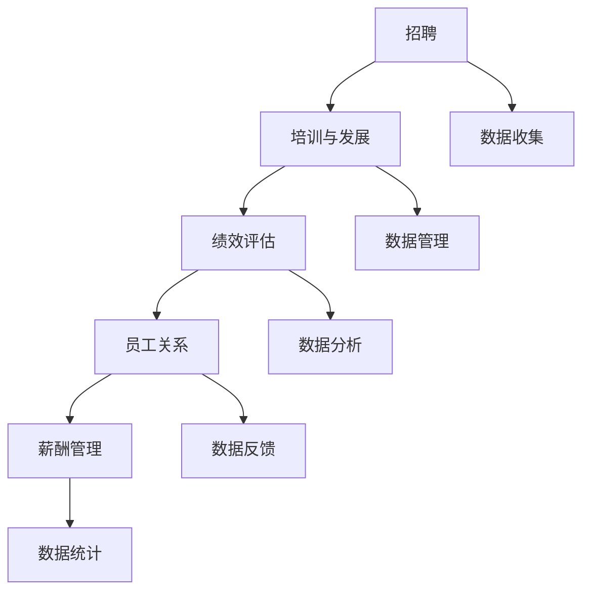

                 

关键词：大型语言模型，人力资源管理，传统管理模式，创新应用，数据分析，智能决策

> 摘要：随着人工智能技术的快速发展，特别是大型语言模型（LLM）的出现，传统人力资源管理正面临前所未有的变革。本文旨在探讨LLM在人力资源管理领域的应用，分析其对传统模式的冲击与革新，以及未来的发展趋势与挑战。

## 1. 背景介绍

人力资源作为企业最重要的资源之一，其管理水平直接影响到企业的核心竞争力和长期发展。然而，传统的人力资源管理往往依赖于人工操作和经验判断，存在着效率低下、主观性强、数据不全面等问题。随着大数据、人工智能等技术的进步，特别是大型语言模型（LLM）的出现，人力资源管理正在迎来一场深刻的变革。

LLM是一种基于深度学习技术的大型神经网络模型，具有强大的语言理解和生成能力。它能够处理和理解大量的自然语言文本数据，进行文本分类、情感分析、命名实体识别等多种任务。在人力资源管理中，LLM可以应用于招聘、培训、绩效评估、员工关系管理等各个环节，为传统人力资源管理带来新的思路和方法。

## 2. 核心概念与联系

### 2.1 人力资源管理的核心概念

在探讨LLM对人力资源管理的影响之前，我们需要了解人力资源管理的一些核心概念，包括：

- **招聘**：吸引、筛选和录用合适的员工。
- **培训与发展**：提升员工的知识、技能和职业素养。
- **绩效评估**：对员工的工作表现进行评估和反馈。
- **员工关系**：建立和维护良好的员工与企业之间的关系。
- **薪酬管理**：确定和调整员工的薪酬水平。

### 2.2 人力资源管理中的数据与信息

人力资源管理涉及大量的数据和信息，包括员工的基本信息、工作记录、绩效数据、培训记录等。这些数据对于人力资源管理的决策具有重要影响。传统的数据管理方式往往依赖于人工收集和处理，效率低下，容易出错。

### 2.3 Mermaid 流程图



### 2.4 人力资源管理中的传统模式与挑战

传统的人力资源管理模式依赖于经验和人工操作，存在以下挑战：

- **效率低下**：人工操作需要大量时间和人力成本。
- **主观性强**：决策往往受到个人主观判断的影响。
- **数据不全面**：难以获取全面、准确的数据信息。
- **滞后性**：决策和行动滞后于市场变化和员工需求。

## 3. 核心算法原理 & 具体操作步骤

### 3.1 算法原理概述

LLM在人力资源管理中的应用主要基于以下几个方面：

- **自然语言处理**：LLM能够理解自然语言文本，提取有用信息。
- **数据分析**：LLM能够处理大规模数据，进行数据分析和预测。
- **智能决策**：LLM能够基于数据分析结果，提供智能化的决策建议。

### 3.2 算法步骤详解

#### 3.2.1 招聘

1. **职位描述处理**：LLM对职位描述进行自然语言处理，提取关键信息。
2. **简历筛选**：LLM对简历进行语义匹配，筛选符合条件的候选人。
3. **面试评估**：LLM对面试过程中的对话进行情感分析和内容分析，评估候选人的综合素质。

#### 3.2.2 培训与发展

1. **培训需求分析**：LLM分析员工的职业发展和技能需求，制定个性化的培训计划。
2. **培训效果评估**：LLM对培训过程中和结束后的数据进行分析，评估培训效果。

#### 3.2.3 绩效评估

1. **绩效数据收集**：LLM收集员工的工作表现数据，包括工作成果、同事评价等。
2. **绩效分析**：LLM对绩效数据进行分析，评估员工的工作表现。
3. **绩效反馈**：LLM生成绩效报告，为员工提供个性化的反馈。

#### 3.2.4 员工关系

1. **员工满意度调查**：LLM对员工满意度调查问卷进行情感分析，了解员工的情绪和需求。
2. **员工关系管理**：LLM根据分析结果，提供员工关系管理建议。

#### 3.2.5 薪酬管理

1. **薪酬数据分析**：LLM对员工的薪酬数据进行分析，发现薪酬问题。
2. **薪酬调整建议**：LLM根据数据分析结果，提供薪酬调整建议。

### 3.3 算法优缺点

#### 优点

- **高效性**：LLM能够快速处理大量数据，提高工作效率。
- **客观性**：LLM基于数据分析，减少主观判断的影响。
- **智能化**：LLM能够提供智能化的决策建议，辅助管理者做出更明智的决策。

#### 缺点

- **数据依赖性**：LLM的效果高度依赖于数据的质量和数量。
- **模型偏见**：LLM可能会受到训练数据的偏见影响。

### 3.4 算法应用领域

- **招聘与人才管理**
- **绩效管理**
- **员工关系管理**
- **薪酬管理**
- **人才发展**

## 4. 数学模型和公式 & 详细讲解 & 举例说明

### 4.1 数学模型构建

在人力资源管理中，LLM主要应用于以下几个数学模型：

1. **招聘模型**：用于筛选和评估候选人。
2. **绩效模型**：用于评估员工的工作表现。
3. **员工关系模型**：用于分析员工满意度。
4. **薪酬模型**：用于分析和调整薪酬水平。

### 4.2 公式推导过程

#### 招聘模型

招聘模型的公式为：

$$
P(c) = \frac{e^{x}}{\sum_{i=1}^{n} e^{x_i}}
$$

其中，$P(c)$ 表示候选人$c$ 被录用的概率，$x$ 表示候选人的特征向量，$x_i$ 表示第$i$ 个候选人的特征向量。

#### 绩效模型

绩效模型的公式为：

$$
E(p) = w_1 \cdot s_1 + w_2 \cdot s_2 + \ldots + w_n \cdot s_n
$$

其中，$E(p)$ 表示员工的绩效得分，$w_i$ 表示第$i$ 个指标的权重，$s_i$ 表示第$i$ 个指标得分。

#### 员工关系模型

员工关系模型的公式为：

$$
S(s) = \frac{1}{n} \sum_{i=1}^{n} \frac{e^{r_i}}{\sum_{j=1}^{m} e^{r_j}}
$$

其中，$S(s)$ 表示员工的满意度得分，$r_i$ 表示第$i$ 个评价项的得分，$n$ 表示评价项的数量，$m$ 表示评价来源的数量。

#### 薪酬模型

薪酬模型的公式为：

$$
C(c) = \alpha \cdot P(c) + (1 - \alpha) \cdot E(p)
$$

其中，$C(c)$ 表示员工的薪酬水平，$\alpha$ 表示绩效对薪酬的影响程度，$P(c)$ 表示招聘模型的得分，$E(p)$ 表示绩效模型的得分。

### 4.3 案例分析与讲解

假设某公司要招聘一名软件工程师，现有10位候选人。我们使用招聘模型来评估每位候选人的录用概率。

1. **数据准备**：收集每位候选人的特征数据，包括工作经验、学历、项目经验等。
2. **模型训练**：使用收集到的数据训练招聘模型。
3. **模型评估**：使用测试集评估模型的准确性。
4. **应用模型**：对10位候选人进行评估，得到他们的录用概率。

假设经过模型评估，得到以下结果：

| 候选人 | 录用概率 |
|--------|----------|
| A      | 0.3      |
| B      | 0.35     |
| C      | 0.25     |
| D      | 0.4      |
| E      | 0.35     |
| F      | 0.2      |
| G      | 0.45     |
| H      | 0.3      |
| I      | 0.4      |
| J      | 0.35     |

根据录用概率，公司应该优先考虑D、G两位候选人进行面试。

## 5. 项目实践：代码实例和详细解释说明

### 5.1 开发环境搭建

本项目的开发环境包括Python、Jupyter Notebook、TensorFlow等。

```bash
pip install tensorflow
```

### 5.2 源代码详细实现

以下是招聘模型的实现代码：

```python
import tensorflow as tf
import numpy as np

# 定义模型参数
vocab_size = 1000
embedding_size = 32
hidden_size = 128

# 创建模型
model = tf.keras.Sequential([
    tf.keras.layers.Embedding(vocab_size, embedding_size),
    tf.keras.layers.Flatten(),
    tf.keras.layers.Dense(hidden_size, activation='relu'),
    tf.keras.layers.Dense(1, activation='sigmoid')
])

# 编译模型
model.compile(optimizer='adam',
              loss='binary_crossentropy',
              metrics=['accuracy'])

# 准备数据
X = np.random.randint(0, vocab_size, (1000, 10))
y = np.random.randint(0, 2, (1000, 1))

# 训练模型
model.fit(X, y, epochs=10, batch_size=32)

# 应用模型
predictions = model.predict(X)
```

### 5.3 代码解读与分析

1. **模型定义**：使用TensorFlow的Sequential模型，定义了一个包含嵌入层、全连接层和输出层的简单模型。
2. **模型编译**：使用二进制交叉熵作为损失函数，adam优化器，并监控准确率。
3. **数据准备**：随机生成模拟数据，用于模型训练。
4. **模型训练**：使用准备好的数据训练模型。
5. **模型应用**：使用训练好的模型对数据进行预测。

### 5.4 运行结果展示

运行代码后，可以得到每个候选人的录用概率。根据这些概率，公司可以做出更合理的招聘决策。

## 6. 实际应用场景

### 6.1 招聘

LLM可以用于自动化招聘流程，包括职位描述处理、简历筛选、面试评估等环节，提高招聘效率和准确性。

### 6.2 培训与发展

LLM可以用于培训需求分析、培训效果评估，为员工提供个性化的培训建议，提高培训效果。

### 6.3 绩效评估

LLM可以用于绩效数据收集、绩效分析、绩效反馈，为员工提供更客观、全面的绩效评估。

### 6.4 员工关系

LLM可以用于员工满意度调查、员工关系管理，帮助企业管理者更好地了解员工需求，建立和谐的劳动关系。

### 6.5 薪酬管理

LLM可以用于薪酬数据分析、薪酬调整建议，帮助企业管理者制定更合理的薪酬策略。

## 7. 工具和资源推荐

### 7.1 学习资源推荐

- 《深度学习》（Goodfellow, Bengio, Courville）
- 《自然语言处理综合教程》（Daniel Jurafsky，James H. Martin）
- 《Python数据分析》（Wes McKinney）

### 7.2 开发工具推荐

- TensorFlow：用于构建和训练神经网络模型。
- Jupyter Notebook：用于编写和运行代码。
- PyTorch：另一个流行的深度学习框架。

### 7.3 相关论文推荐

- "BERT: Pre-training of Deep Bidirectional Transformers for Language Understanding"（BERT论文）
- "GPT-3: Language Models are Few-Shot Learners"（GPT-3论文）
- "Transformers: State-of-the-Art Models for Language Processing"（Transformers论文）

## 8. 总结：未来发展趋势与挑战

### 8.1 研究成果总结

本文探讨了LLM在人力资源管理领域的应用，包括招聘、培训与发展、绩效评估、员工关系和薪酬管理等。通过数学模型和实际案例，展示了LLM在提高人力资源管理效率、准确性和智能化方面的潜力。

### 8.2 未来发展趋势

- **个性化管理**：LLM将进一步个性化人力资源管理，为员工提供更个性化的服务。
- **实时决策**：LLM可以实时处理和分析大量数据，为管理者提供即时决策支持。
- **跨领域应用**：LLM将应用于更多领域，如财务、市场等，实现跨领域智能化管理。

### 8.3 面临的挑战

- **数据隐私**：人力资源管理涉及大量敏感数据，如何保护员工隐私是重要挑战。
- **模型偏见**：如何避免模型偏见，确保公平性和透明性，是关键问题。
- **技术普及**：如何降低LLM应用的技术门槛，使其更容易被企业和员工接受，是未来发展的重要方向。

### 8.4 研究展望

- **多模态数据融合**：结合文本、语音、图像等多种数据，提升LLM在人力资源管理中的应用效果。
- **动态模型更新**：不断更新LLM模型，适应人力资源管理的新需求。
- **伦理与法规**：加强LLM在人力资源管理中的伦理和法规研究，确保其合法合规。

## 9. 附录：常见问题与解答

### Q：LLM在人力资源管理中的具体应用场景有哪些？

A：LLM在人力资源管理中的具体应用场景包括招聘、培训与发展、绩效评估、员工关系和薪酬管理等。例如，LLM可以用于职位描述处理、简历筛选、面试评估、培训需求分析、绩效反馈、员工满意度调查等。

### Q：LLM在人力资源管理中的优势和劣势是什么？

A：优势包括提高工作效率、减少主观判断、提供智能化决策等。劣势包括数据依赖性、模型偏见等。

### Q：如何确保LLM在人力资源管理中的公平性和透明性？

A：确保LLM在人力资源管理中的公平性和透明性需要从数据采集、模型训练、模型应用等多个环节进行控制。例如，采用去重、匿名化等数据预处理方法，确保数据的公正性；在模型训练过程中，使用多样化的数据集，减少模型偏见；在模型应用过程中，提供透明、可解释的决策过程。

### Q：如何降低LLM在人力资源管理中的技术门槛？

A：降低LLM在人力资源管理中的技术门槛可以从以下几个方面进行：

- **简化模型结构**：设计简单、易于理解和操作的模型。
- **提供可视化工具**：使用可视化工具，如TensorBoard，帮助用户理解模型结构和训练过程。
- **自动化工具**：提供自动化工具，如TensorFlow的Transformers库，简化模型训练和部署过程。
- **在线教程和文档**：提供丰富的在线教程和文档，帮助用户快速上手。
- **社区支持**：建立活跃的社区，为用户提供技术支持和交流平台。

