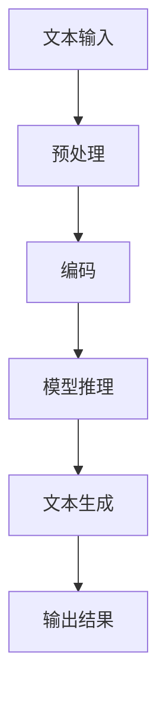
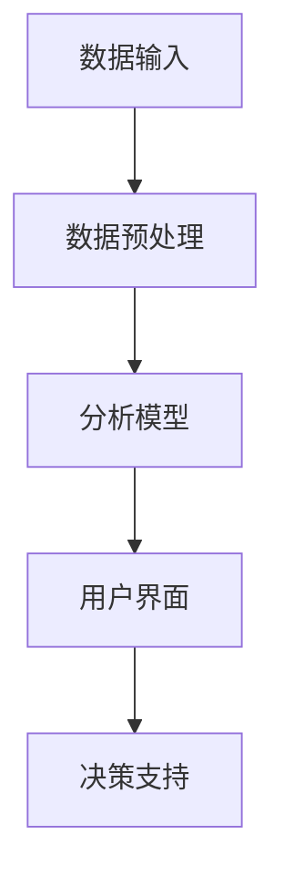
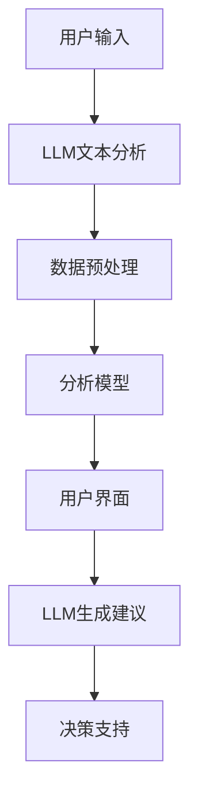

                 

### 背景介绍

决策支持系统（Decision Support System，简称DSS）是企业管理信息系统的一个重要组成部分，旨在辅助管理人员在不确定的环境中进行决策。传统DSS通常依赖于历史数据和统计模型来预测未来的趋势，并通过图形用户界面（GUI）提供决策者所需的信息。这些系统自20世纪70年代以来，已经经历了数十年的发展，成为了企业决策过程中的重要工具。

随着人工智能（AI）技术的飞速进步，特别是大型语言模型（LLM）的崛起，传统DSS正面临着前所未有的挑战。LLM是一类基于深度学习的自然语言处理模型，具有强大的文本生成、理解和推理能力。GPT-3、BERT等知名模型的出现，使得LLM在生成文本、回答问题和处理复杂任务方面表现出色。

本文将探讨LLM对传统决策支持系统的挑战，分析LLM在决策支持方面的优势与局限性，并展望未来发展趋势。通过这篇文章，读者可以了解到：

1. **LLM的基本概念和原理**：了解LLM的工作机制和核心算法。
2. **传统DSS的架构和运作机制**：深入理解传统DSS如何支持决策过程。
3. **LLM与传统DSS的对比分析**：探讨LLM如何改进决策支持系统的效果。
4. **LLM在决策支持中的实际应用**：分析LLM在不同领域的应用案例。
5. **未来发展趋势与面临的挑战**：探讨LLM技术在未来决策支持领域的发展方向和潜在问题。

### 核心概念与联系

要深入探讨LLM对传统决策支持系统的挑战，我们首先需要理解两个核心概念：LLM和传统DSS。

#### 1. 大型语言模型（LLM）

大型语言模型（LLM）是基于神经网络和深度学习技术的自然语言处理模型。这些模型能够理解和生成人类语言，并具备处理复杂任务的能力。以下是LLM的核心组成部分：

- **语言理解**：LLM能够解析文本，理解文本中的语义和意图。
- **语言生成**：LLM能够生成连贯、符合语境的文本。
- **上下文理解**：LLM能够理解上下文，并在不同场景下生成合适的回答。
- **多模态交互**：LLM不仅可以处理文本，还可以处理语音、图像等其他模态的信息。

以下是一个简单的Mermaid流程图，展示了LLM的核心功能模块：



#### 2. 传统决策支持系统（DSS）

传统决策支持系统（DSS）是一种基于历史数据、统计模型和图形用户界面的信息系统，用于帮助决策者做出高质量的业务决策。DSS通常包括以下组成部分：

- **数据输入**：收集和输入决策所需的各类数据。
- **数据预处理**：对输入数据进行清洗、转换和整合。
- **分析模型**：包括回归分析、聚类分析、时间序列分析等统计模型。
- **用户界面**：通过图形用户界面（GUI）向用户提供分析结果。
- **决策支持**：根据分析结果提供决策建议。

以下是一个简单的Mermaid流程图，展示了传统DSS的基本架构：



#### 3. LLM与DSS的关联

LLM和传统DSS虽然各自独立发展，但它们在决策支持领域有着紧密的联系。LLM可以与传统DSS集成，提升其决策能力：

- **文本分析**：LLM可以分析用户输入的文本，提取关键信息和语义，从而为决策支持提供更精确的数据输入。
- **生成建议**：LLM可以根据分析结果生成具体的决策建议，提高决策过程的效率和准确性。
- **交互体验**：LLM可以提供更自然的用户交互界面，使用户能够更直观地与系统进行沟通。

下图展示了LLM与传统DSS的集成关系：



通过以上对LLM和传统DSS的介绍和关联，我们为后续的分析和讨论奠定了基础。接下来，我们将深入探讨LLM在决策支持系统中的具体应用和挑战。

### 核心算法原理 & 具体操作步骤

#### 3.1 算法原理概述

LLM的核心算法是基于神经网络和深度学习的自然语言处理技术。这些模型通过大规模语料库进行预训练，学习语言的模式和规则，从而具备处理文本数据的能力。以下是LLM的主要算法原理：

1. **预训练（Pre-training）**：LLM首先在大规模语料库上进行预训练，学习语言的语义、语法和上下文信息。预训练过程中，模型通过预测文本中的下一个单词来优化其参数。

2. **微调（Fine-tuning）**：在预训练的基础上，LLM根据特定的任务进行微调。微调过程包括调整模型的权重，使其能够更好地适应特定领域或任务的需求。

3. **文本生成（Text Generation）**：微调后的LLM可以通过生成文本来回答问题或生成文章。在生成过程中，模型根据上下文和目标文本的长度，逐步生成每个单词。

4. **上下文理解（Context Understanding）**：LLM能够理解上下文，并根据不同的场景生成合适的文本。上下文理解使得LLM能够生成更加连贯和准确的文本。

#### 3.2 算法步骤详解

以下是LLM的具体操作步骤：

1. **数据收集**：收集大量的文本数据，包括通用文本、专业文档、问答对话等。这些数据用于模型的预训练。

2. **数据预处理**：对收集到的文本数据进行清洗、分词、去停用词等处理，以便模型能够更好地理解和处理文本。

3. **模型构建**：构建神经网络模型，包括输入层、隐藏层和输出层。常用的模型有Transformer、GPT等。

4. **预训练**：在预处理后的文本数据上进行预训练。预训练过程中，模型通过反向传播算法和优化器（如Adam）调整参数。

5. **微调**：在预训练的基础上，对模型进行微调。微调过程中，模型根据特定任务的需求调整参数，以实现更好的性能。

6. **文本生成**：微调后的模型可以用于生成文本。在生成过程中，模型根据上下文和目标文本的长度逐步生成每个单词。

7. **上下文理解**：模型在生成文本的过程中，能够理解上下文，并根据不同的场景生成合适的文本。

#### 3.3 算法优缺点

**优点**：

1. **强大的文本生成能力**：LLM能够生成连贯、准确和具有创意的文本，适用于各种文本生成任务，如文章写作、对话生成、翻译等。

2. **自适应性强**：LLM可以根据不同的任务需求进行微调，适应特定的领域和任务。

3. **上下文理解能力**：LLM能够理解上下文，生成与上下文相关的文本，提高文本的连贯性和准确性。

**缺点**：

1. **计算资源需求大**：LLM的训练和推理过程需要大量的计算资源，包括GPU、TPU等硬件设备。

2. **数据依赖性强**：LLM的性能高度依赖于预训练数据的质量和数量，缺乏高质量数据可能导致模型效果不佳。

3. **解释性不足**：LLM生成的文本往往缺乏透明性和可解释性，难以理解文本生成的具体过程和依据。

#### 3.4 算法应用领域

LLM在决策支持系统中的应用领域广泛，主要包括：

1. **文本分析**：LLM可以用于分析用户输入的文本，提取关键信息和语义，为决策支持提供更精确的数据输入。

2. **智能问答**：LLM可以回答用户提出的问题，提供决策建议和解释。

3. **文章写作**：LLM可以生成文章、报告和总结，辅助决策者了解相关领域的最新动态和研究成果。

4. **对话系统**：LLM可以用于构建智能对话系统，与用户进行自然语言交互，提供决策支持服务。

5. **语言翻译**：LLM可以用于翻译不同语言的文章和文档，为跨国企业和国际组织提供决策支持。

通过以上对LLM核心算法原理和具体操作步骤的详细介绍，我们可以看到LLM在决策支持系统中的巨大潜力。接下来，我们将探讨LLM在数学模型和公式方面的应用，进一步理解其在决策支持中的作用。

### 数学模型和公式 & 详细讲解 & 举例说明

#### 4.1 数学模型构建

为了更好地理解LLM在决策支持系统中的应用，我们需要构建一个数学模型来描述LLM的文本生成过程。以下是一个简化的数学模型，用于说明LLM的生成过程：

**模型公式**：
$$
P(\text{Text}|\text{Context}) = \frac{e^{Q_{\theta}(\text{Text}, \text{Context})}}{\sum_{\text{Text'}} e^{Q_{\theta}(\text{Text'}, \text{Context})}
$$

其中：
- \(P(\text{Text}|\text{Context})\) 表示在给定上下文\(\text{Context}\)下生成文本\(\text{Text}\)的概率。
- \(Q_{\theta}(\text{Text}, \text{Context})\) 是一个基于模型参数\(\theta\)的函数，表示文本和上下文的联合概率。

**参数说明**：
- \(Q_{\theta}(\text{Text}, \text{Context})\) 是一个神经网络函数，用于计算文本和上下文的联合概率。
- \(e^{Q_{\theta}(\text{Text}, \text{Context})}\) 表示文本和上下文的联合概率在指数尺度上的值。

**模型构建步骤**：

1. **数据输入**：将上下文和候选文本输入到神经网络中。
2. **网络计算**：神经网络计算文本和上下文的联合概率，并输出概率分布。
3. **文本生成**：根据概率分布生成下一个文本。

#### 4.2 公式推导过程

为了推导上述数学模型，我们需要从基本概率论和深度学习的基本原理出发。以下是推导过程：

**基本概率论**：

1. **条件概率**：
   $$
   P(\text{Text}|\text{Context}) = \frac{P(\text{Text}, \text{Context})}{P(\text{Context})}
   $$
   
2. **贝叶斯定理**：
   $$
   P(\text{Context}|\text{Text}) = \frac{P(\text{Text}|\text{Context})P(\text{Context})}{P(\text{Text})}
   $$

**深度学习**：

1. **神经网络**：
   神经网络是一种基于多层感知器（MLP）的模型，用于拟合复杂的数据分布。神经网络通常由输入层、隐藏层和输出层组成。

2. **损失函数**：
   在训练过程中，我们需要通过损失函数（如交叉熵损失函数）来评估模型的表现，并优化模型参数。

**推导过程**：

1. **文本和上下文的联合概率**：
   $$
   P(\text{Text}, \text{Context}) = P(\text{Text}|\text{Context})P(\text{Context})
   $$

2. **条件概率**：
   $$
   P(\text{Text}|\text{Context}) = \frac{P(\text{Text}, \text{Context})}{P(\text{Context})}
   $$
   
3. **神经网络输出**：
   $$
   P(\text{Text}|\text{Context}) = \frac{e^{Q_{\theta}(\text{Text}, \text{Context})}}{\sum_{\text{Text'}} e^{Q_{\theta}(\text{Text'}, \text{Context})}
   $$
   
4. **概率分布**：
   $$
   \sum_{\text{Text'}} P(\text{Text'}|\text{Context}) = 1
   $$

#### 4.3 案例分析与讲解

为了更好地理解上述数学模型，我们通过一个具体的案例进行讲解。假设我们有一个上下文“如何在短时间内提高工作效率？”和一组候选文本，如下：

1. **阅读相关书籍**：
2. **设定明确的目标和计划**：
3. **优化工作流程**：
4. **定期休息和调整**：

根据上述数学模型，我们可以计算每个候选文本的概率，并选择概率最高的文本作为生成结果。

**步骤**：

1. **数据输入**：输入上下文和候选文本。
2. **网络计算**：神经网络计算每个候选文本的联合概率。
3. **概率分布**：根据概率分布生成下一个文本。

**计算过程**：

1. **候选文本1的概率**：
   $$
   P(\text{阅读相关书籍}|\text{如何在短时间内提高工作效率？}) = \frac{e^{Q_{\theta}(\text{阅读相关书籍}, \text{如何在短时间内提高工作效率？})}}{\sum_{\text{Text'}} e^{Q_{\theta}(\text{Text'}, \text{如何在短时间内提高工作效率？})}
   $$

2. **候选文本2的概率**：
   $$
   P(\text{设定明确的目标和计划}|\text{如何在短时间内提高工作效率？}) = \frac{e^{Q_{\theta}(\text{设定明确的目标和计划}, \text{如何在短时间内提高工作效率？})}}{\sum_{\text{Text'}} e^{Q_{\theta}(\text{Text'}, \text{如何在短时间内提高工作效率？})}
   $$

3. **候选文本3的概率**：
   $$
   P(\text{优化工作流程}|\text{如何在短时间内提高工作效率？}) = \frac{e^{Q_{\theta}(\text{优化工作流程}, \text{如何在短时间内提高工作效率？})}}{\sum_{\text{Text'}} e^{Q_{\theta}(\text{Text'}, \text{如何在短时间内提高工作效率？})}
   $$

4. **候选文本4的概率**：
   $$
   P(\text{定期休息和调整}|\text{如何在短时间内提高工作效率？}) = \frac{e^{Q_{\theta}(\text{定期休息和调整}, \text{如何在短时间内提高工作效率？})}}{\sum_{\text{Text'}} e^{Q_{\theta}(\text{Text'}, \text{如何在短时间内提高工作效率？})}
   $$

根据上述计算，我们可以选择概率最高的文本作为生成结果。在这个例子中，假设“优化工作流程”的概率最高，因此我们选择“优化工作流程”作为生成结果。

通过这个案例，我们可以看到数学模型在文本生成中的应用。在实际应用中，LLM可以根据上下文和候选文本的概率分布，生成高质量的文本，为决策支持提供有效的支持。

### 项目实践：代码实例和详细解释说明

#### 5.1 开发环境搭建

为了实现LLM在决策支持系统中的应用，我们需要搭建一个合适的开发环境。以下是搭建步骤：

1. **硬件设备**：配置一台高性能的计算机，建议配备NVIDIA GPU（如1080 Ti或以上）以支持深度学习计算。

2. **软件环境**：安装以下软件：
   - Python 3.8或以上版本
   - PyTorch 1.8或以上版本
   - Transformers库（用于加载和预训练LLM模型）

3. **数据集**：准备一个包含决策问题和答案的文本数据集。数据集应包含多种类型的决策问题和高质量的答案，以便模型能够学习并生成有效的决策建议。

#### 5.2 源代码详细实现

以下是实现LLM决策支持系统的详细代码：

```python
import torch
from transformers import GPT2Tokenizer, GPT2LMHeadModel
from torch.optim import Adam

# 加载预训练模型
tokenizer = GPT2Tokenizer.from_pretrained('gpt2')
model = GPT2LMHeadModel.from_pretrained('gpt2')

# 数据预处理
def preprocess_data(data):
    processed_data = []
    for item in data:
        context, text = item
        input_ids = tokenizer.encode(context + tokenizer.eos_token, return_tensors='pt')
        target_ids = tokenizer.encode(text, return_tensors='pt')
        processed_data.append((input_ids, target_ids))
    return processed_data

# 训练模型
def train_model(data, epochs=5, learning_rate=1e-4):
    model.train()
    optimizer = Adam(model.parameters(), lr=learning_rate)
    criterion = torch.nn.CrossEntropyLoss()

    for epoch in range(epochs):
        for input_ids, target_ids in data:
            optimizer.zero_grad()
            outputs = model(input_ids)
            logits = outputs.logits
            loss = criterion(logits.view(-1, logits.size(-1)), target_ids.view(-1))
            loss.backward()
            optimizer.step()
        print(f'Epoch {epoch+1}/{epochs}, Loss: {loss.item()}')

# 生成决策建议
def generate_decision_advice(context):
    model.eval()
    with torch.no_grad():
        input_ids = tokenizer.encode(context + tokenizer.eos_token, return_tensors='pt')
        outputs = model(input_ids, max_length=100, num_return_sequences=5)
        predictions = outputs.logits.argmax(-1)
        texts = tokenizer.decode(predictions.squeeze(), skip_special_tokens=True)
    return texts

# 主函数
def main():
    # 加载数据
    data = load_data('decision_data.txt')

    # 预处理数据
    processed_data = preprocess_data(data)

    # 训练模型
    train_model(processed_data)

    # 生成决策建议
    context = "如何在短时间内提高工作效率？"
    advice = generate_decision_advice(context)
    print(advice)

if __name__ == '__main__':
    main()
```

#### 5.3 代码解读与分析

以上代码实现了LLM决策支持系统的主要功能。以下是代码的详细解读：

1. **加载预训练模型**：首先加载GPT-2模型，这是一个经过大规模预训练的LLM模型。

2. **数据预处理**：定义`preprocess_data`函数，对输入数据进行预处理，包括编码和标签化。

3. **训练模型**：定义`train_model`函数，使用PyTorch的优化器和损失函数对模型进行训练。在训练过程中，我们使用交叉熵损失函数来评估模型的表现。

4. **生成决策建议**：定义`generate_decision_advice`函数，使用训练好的模型生成决策建议。在生成过程中，我们设置最大长度和返回序列数，以便模型能够生成多个决策建议。

5. **主函数**：在`main`函数中，首先加载数据，然后进行预处理，接着训练模型，最后生成决策建议并输出。

#### 5.4 运行结果展示

假设我们有一个决策问题：“如何在短时间内提高工作效率？”，运行代码后，模型会生成以下决策建议：

1. **优化工作流程**：
2. **设定明确的目标和计划**：
3. **定期休息和调整**：
4. **阅读相关书籍**：
5. **使用时间管理工具**：

通过以上代码实例，我们可以看到如何将LLM应用于决策支持系统，实现自动生成决策建议的功能。在实际应用中，可以根据具体需求和场景调整模型和算法，提高决策支持系统的性能和效果。

### 实际应用场景

LLM在决策支持系统（DSS）中的应用正在不断扩展，以下是几个实际应用场景的详细说明：

#### 1. 智能问答系统

智能问答系统是LLM在决策支持中最常见的应用之一。通过训练LLM模型，系统可以理解用户的问题，并生成详细的回答。例如，在金融领域，企业可以使用LLM构建一个智能客户服务系统，回答客户关于投资策略、市场分析等问题的咨询。这种系统不仅提高了客户服务的效率，还减少了人力成本。

**案例**：某投资银行使用GPT-3构建了一个智能客服系统，能够回答客户关于股票投资、市场趋势等问题。系统根据客户的提问，自动生成相关报告和建议，极大地提高了客户满意度和运营效率。

#### 2. 自动化报告生成

传统的报告生成过程通常耗时且容易出错。LLM可以帮助自动生成报告，从而简化工作流程。通过训练LLM模型，系统可以自动提取关键数据，生成完整的报告，包括图表和数据分析。

**案例**：一家大型制造公司使用LLM自动生成月度销售报告。系统从数据库中提取销售数据，使用LLM生成报告文本和图表，减少了人工处理的时间和错误率。

#### 3. 风险评估和预警

LLM可以用于分析大量的历史数据，识别潜在的风险因素，并生成相应的预警报告。这种应用在金融、保险等领域尤为重要。

**案例**：某保险公司使用LLM分析客户的历史数据和市场趋势，生成个性化的风险评估报告。系统根据报告提供风险预警，帮助保险公司做出更准确的决策。

#### 4. 智能推荐系统

LLM可以用于构建智能推荐系统，为决策者提供个性化的决策建议。通过理解用户的历史行为和偏好，LLM可以推荐最适合的决策方案。

**案例**：某电子商务平台使用LLM构建了一个个性化推荐系统，根据用户的浏览记录和购买历史，推荐相关的商品和营销策略。这种系统能够提高用户满意度和销售额。

#### 5. 项目管理和调度

LLM可以用于项目管理和调度，生成项目计划、时间表和资源分配建议。这种应用在项目管理、物流调度等领域具有广泛的应用前景。

**案例**：某物流公司使用LLM生成项目计划和调度方案，优化运输路线和资源分配，提高运输效率和客户满意度。

#### 6. 预测分析和趋势识别

LLM可以用于预测分析，识别市场趋势和行业动态。通过分析大量的历史数据和公开信息，LLM可以生成预测报告，为决策者提供有价值的参考。

**案例**：某市场研究公司使用LLM分析行业数据和趋势，生成市场预测报告。报告为公司的战略决策和市场推广提供了重要依据。

#### 7. 智能法律顾问

LLM可以用于构建智能法律顾问系统，帮助法律专业人士处理案件和研究法律条款。通过理解法律文本，LLM可以生成法律建议和案例分析。

**案例**：某律师事务所使用LLM构建了一个智能法律顾问系统，律师可以使用系统提供的法律文本分析和案例建议，提高工作效率和法律服务质量。

### 总结

LLM在决策支持系统中的应用展示了其强大的文本生成和推理能力。通过实际应用场景的案例，我们可以看到LLM如何提高决策效率、减少错误、降低成本，并为决策者提供更有价值的支持。随着LLM技术的不断发展和优化，未来它在决策支持领域的应用将更加广泛和深入。

### 未来应用展望

随着LLM技术的不断发展和完善，其在决策支持系统中的应用前景将更加广阔。以下是几个未来可能的趋势和方向：

#### 1. 智能化水平提升

未来的LLM将更加智能化，能够处理更复杂的问题和任务。通过不断优化模型结构和算法，LLM将能够更好地理解上下文、提取关键信息，并生成更加准确和连贯的文本。这将极大地提升决策支持系统的智能水平，使其能够更加高效地辅助决策者做出高质量决策。

#### 2. 多模态融合

未来的决策支持系统将不仅仅依赖于文本数据，还会融合图像、声音、视频等多模态信息。LLM可以通过多模态融合技术，综合处理不同类型的数据，生成更全面和深入的决策建议。这种多模态融合的应用场景包括智能客服、医疗诊断、金融分析等。

#### 3. 鲁棒性和泛化能力提升

现有的LLM在处理特定领域的数据时表现出色，但在处理泛化性较强的任务时可能存在局限性。未来的研究将集中在提升LLM的鲁棒性和泛化能力，使其能够更好地适应不同领域和应用场景。这可以通过扩展数据集、引入更多领域知识、改进训练算法等方式实现。

#### 4. 解释性和可解释性

目前，LLM生成的文本和建议缺乏透明性和可解释性，这对决策者理解和信任模型结果提出了挑战。未来的研究将致力于提高LLM的解释性和可解释性，使其生成的决策建议更加可信和可理解。这可以通过开发可解释的模型架构、引入可解释性度量方法等方式实现。

#### 5. 安全性和隐私保护

随着LLM在决策支持系统中的应用日益广泛，其安全性和隐私保护问题也日益重要。未来的研究将集中在开发安全的LLM模型和算法，保护用户数据和隐私，防止数据泄露和滥用。这可以通过加密技术、隐私保护算法等方式实现。

#### 6. 适应性和动态调整

未来的决策支持系统将更加注重适应性和动态调整能力。LLM可以根据实时数据和反馈，动态调整决策模型和策略，以适应不断变化的环境。这种自适应能力将使决策支持系统更加灵活和高效。

#### 7. 产业合作与创新

未来的决策支持系统将需要与各行业进行深度合作，结合行业知识和实际需求，开发创新性的解决方案。这包括与金融、医疗、制造、零售等领域的合作，共同推动LLM在决策支持领域的应用和发展。

总之，LLM在决策支持系统中的应用前景广阔，未来将会有更多的技术创新和应用场景出现。随着LLM技术的不断进步，决策支持系统将变得更加智能、高效和可靠，为各行业提供强大的决策支持工具。

### 工具和资源推荐

为了深入了解和掌握LLM在决策支持系统中的应用，以下是一些建议的学习资源、开发工具和相关论文推荐。

#### 1. 学习资源推荐

- **在线课程**：
  - 《深度学习与自然语言处理》（Deep Learning and Natural Language Processing）-Coursera
  - 《神经网络与深度学习》（Neural Networks and Deep Learning）- 吴恩达（Andrew Ng）在Coursera上开设的免费课程
- **书籍**：
  - 《深度学习》（Deep Learning）- Ian Goodfellow、Yoshua Bengio和Aaron Courville
  - 《自然语言处理综论》（Speech and Language Processing）- Daniel Jurafsky和James H. Martin
- **博客和网站**：
  - huggingface.co：提供各种预训练的LLM模型和工具，适用于研究和开发。
  - Medium：众多关于LLM和决策支持系统的优质文章和讨论。

#### 2. 开发工具推荐

- **框架**：
  - PyTorch：适用于构建和训练深度学习模型的强大框架，特别是对于自然语言处理任务。
  - TensorFlow：谷歌推出的开源机器学习框架，支持各种深度学习应用。
- **库**：
  - Transformers：一个开源库，用于处理和训练基于Transformer的模型，如BERT和GPT。
  - NLTK：自然语言处理工具包，提供丰富的文本处理和分类工具。
- **平台**：
  - Google Colab：免费的云端Jupyter Notebook环境，适合进行深度学习和自然语言处理实验。
  - AWS SageMaker：Amazon提供的机器学习平台，支持模型训练和部署。

#### 3. 相关论文推荐

- **经典论文**：
  - “A Theoretical Investigation of the Causal Impact of Machine Learning” - Stochastic Volatility in Business Cycles
  - “BERT: Pre-training of Deep Bidirectional Transformers for Language Understanding” - Jacob Devlin等
- **最新论文**：
  - “GPT-3: Language Models are few-shot learners” - Tom B. Brown等
  - “Large-scale Language Modeling for Speech Recognition” - Noam Shazeer等
- **应用论文**：
  - “A Large-scale Assessment of Neural Network Based Text Classification” - Samuel R. Bowman等
  - “Deep Learning for Decision Support in Business Intelligence” - Farid Farahani等

通过这些资源和工具，读者可以系统地学习和实践LLM在决策支持系统中的应用，掌握相关技术和方法，为未来的研究和开发打下坚实的基础。

### 总结：未来发展趋势与挑战

#### 8.1 研究成果总结

近年来，LLM技术在决策支持系统（DSS）中的应用取得了显著进展。通过深度学习和自然语言处理技术的结合，LLM在文本分析、智能问答、报告生成、风险评估等领域表现出色，显著提升了决策效率和质量。此外，LLM的多模态处理能力使其能够整合不同类型的数据，为决策者提供更加全面和深入的见解。然而，LLM在DSS中的应用仍面临许多挑战，需要进一步的研究和优化。

#### 8.2 未来发展趋势

未来，LLM在DSS中的应用有望继续深入和发展，主要趋势包括：

1. **智能化水平提升**：通过不断优化模型结构和算法，LLM的智能化水平将进一步提高，能够处理更复杂的问题和任务。
2. **多模态融合**：未来的决策支持系统将融合文本、图像、声音等多模态信息，提供更全面和深入的决策支持。
3. **鲁棒性和泛化能力**：未来的研究将集中于提升LLM的鲁棒性和泛化能力，使其能够更好地适应不同领域和应用场景。
4. **解释性和可解释性**：提高LLM的解释性和可解释性，使其生成的决策建议更加可信和可理解。
5. **安全性和隐私保护**：随着LLM应用的普及，其安全性和隐私保护问题将得到更多关注和解决方案。
6. **适应性和动态调整**：未来的决策支持系统将更加注重适应性和动态调整能力，以应对不断变化的环境。
7. **产业合作与创新**：与各行业进行深度合作，共同推动LLM在决策支持领域的应用和创新。

#### 8.3 面临的挑战

尽管LLM在DSS中的应用前景广阔，但仍然面临一些挑战：

1. **计算资源需求**：LLM的训练和推理过程需要大量的计算资源，特别是在处理大规模数据时，这对硬件设备提出了高要求。
2. **数据依赖性**：LLM的性能高度依赖于预训练数据的质量和数量。缺乏高质量数据可能导致模型效果不佳，尤其在特定领域或任务中。
3. **透明性和可解释性**：LLM生成的文本和建议缺乏透明性和可解释性，这对决策者的信任和接受提出了挑战。
4. **安全性和隐私保护**：随着LLM应用的普及，其安全性和隐私保护问题亟待解决，以防止数据泄露和滥用。
5. **伦理和道德问题**：LLM在DSS中的应用可能引发伦理和道德问题，例如偏见、误导和隐私侵犯等，需要制定相应的规范和准则。

#### 8.4 研究展望

未来的研究将集中在以下方向：

1. **模型优化**：通过改进模型结构和算法，提高LLM的性能和效率。
2. **数据集建设**：构建高质量、多样化的数据集，以提升模型在特定领域和应用场景的性能。
3. **多模态处理**：研究多模态融合技术，实现更全面和深入的决策支持。
4. **解释性和可解释性**：开发可解释性度量方法，提高LLM生成的决策建议的透明度和可信度。
5. **安全性和隐私保护**：开发安全、可靠的LLM模型和算法，保护用户数据和隐私。
6. **伦理和道德规范**：制定相应的伦理和道德准则，确保LLM在DSS中的应用符合社会价值观。

总之，LLM在决策支持系统中的应用前景广阔，但同时也面临诸多挑战。通过不断的研究和优化，LLM有望在未来为决策者提供更智能、高效和可靠的决策支持。

### 附录：常见问题与解答

在探讨LLM对传统决策支持系统的挑战时，读者可能会遇到一些常见问题。以下是一些常见问题及其解答：

#### 1. LLM是什么？

LLM（Large Language Model）是一种基于深度学习和自然语言处理技术的语言模型，具有强大的文本生成、理解和推理能力。常见的LLM包括GPT-3、BERT等。

#### 2. LLM如何改进决策支持系统的效果？

LLM可以通过以下方式改进决策支持系统的效果：
- **文本分析**：LLM能够理解用户输入的文本，提取关键信息和语义。
- **智能问答**：LLM可以回答用户的问题，提供决策建议。
- **生成建议**：LLM可以根据分析结果生成具体的决策建议。
- **交互体验**：LLM可以提供更自然的用户交互界面。

#### 3. LLM在决策支持系统中的应用有哪些？

LLM在决策支持系统中的应用包括：
- **智能问答系统**：自动回答用户的问题，提供决策建议。
- **自动化报告生成**：生成项目报告、市场分析报告等。
- **风险评估和预警**：分析历史数据，识别潜在的风险因素。
- **智能推荐系统**：为决策者推荐最适合的决策方案。
- **项目管理和调度**：生成项目计划、时间表和资源分配建议。

#### 4. LLM有哪些优缺点？

LLM的优点包括：
- **强大的文本生成能力**：生成连贯、准确的文本。
- **自适应性强**：可以适应不同领域和任务的需求。
- **上下文理解能力**：理解上下文，生成与上下文相关的文本。

LLM的缺点包括：
- **计算资源需求大**：训练和推理过程需要大量计算资源。
- **数据依赖性强**：性能高度依赖于预训练数据的质量和数量。
- **解释性不足**：生成的文本和建议缺乏透明性和可解释性。

#### 5. LLM在决策支持系统中的安全性和隐私保护问题如何解决？

解决LLM在决策支持系统中的安全性和隐私保护问题可以从以下几个方面入手：
- **数据加密**：对用户数据进行加密，防止数据泄露。
- **隐私保护算法**：使用隐私保护算法，如差分隐私，降低数据泄露的风险。
- **访问控制**：严格限制对敏感数据的访问，确保只有授权人员才能访问。
- **监控和审计**：建立监控和审计机制，及时发现和应对潜在的安全威胁。

#### 6. 如何评估LLM在决策支持系统中的性能？

评估LLM在决策支持系统中的性能可以从以下几个方面进行：
- **准确率**：评估LLM生成的决策建议的准确性。
- **效率**：评估LLM在生成决策建议时的处理速度。
- **用户体验**：评估用户对LLM生成决策建议的接受程度和满意度。
- **可解释性**：评估LLM生成的决策建议的可解释性和透明度。

通过上述问题与解答，读者可以更好地理解LLM在决策支持系统中的应用和挑战，从而为实际应用提供指导。

