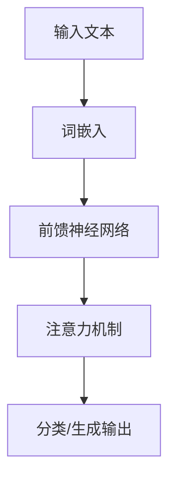

                 

关键词：数据挖掘，语言模型，深度学习，人工智能，数据处理，算法革新

> 摘要：随着人工智能技术的飞速发展，大型语言模型（LLM）在自然语言处理领域取得了显著成果。本文旨在探讨LLM在传统数据挖掘中的革新，分析其原理、应用及其未来发展趋势。

## 1. 背景介绍

在过去的几十年里，数据挖掘领域经历了从传统的统计分析到复杂的数据挖掘算法的发展过程。这些算法主要包括分类、聚类、关联规则挖掘等。然而，这些算法在处理大规模、非结构化和复杂的文本数据时，存在一定的局限性。随着深度学习的兴起，尤其是大型语言模型（LLM）的出现，为传统数据挖掘带来了全新的变革。

LLM是指具有千亿级参数的大规模语言模型，如GPT、BERT等。这些模型通过学习海量文本数据，可以捕捉到语言中的深层结构和语义信息。与传统数据挖掘算法相比，LLM具有以下几个显著优势：

1. **强大的语义理解能力**：LLM能够理解文本中的复杂语义，从而更准确地提取信息。
2. **自适应的建模能力**：LLM可以根据不同的任务需求，自适应地调整模型结构，提高任务性能。
3. **高效的并行处理能力**：LLM通常采用分布式计算架构，可以高效地处理大规模数据。

## 2. 核心概念与联系

为了更好地理解LLM在数据挖掘中的革新，首先需要了解LLM的基本原理和架构。下面给出一个简单的Mermaid流程图，展示LLM的核心概念和架构。



### 2.1 词嵌入

词嵌入是将自然语言中的词汇映射到高维向量空间的过程。词嵌入可以捕捉词汇之间的相似性和距离关系，从而提高模型的语义理解能力。常见的词嵌入方法有Word2Vec、GloVe等。

### 2.2 前馈神经网络

前馈神经网络（FNN）是一种常见的深度学习模型结构。它通过多层非线性变换，将输入数据映射到输出结果。在LLM中，前馈神经网络主要用于处理词嵌入后的文本数据。

### 2.3 注意力机制

注意力机制是一种用于捕捉输入序列中不同位置之间关系的机制。在LLM中，注意力机制可以帮助模型更好地关注文本中的重要信息，从而提高语义理解能力。

### 2.4 分类/生成输出

分类输出是指将文本数据映射到某个类别标签的过程。在生成输出中，模型可以生成与输入文本相关的文本、图像、语音等多种形式的内容。

## 3. 核心算法原理 & 具体操作步骤

### 3.1 算法原理概述

LLM在数据挖掘中的核心算法原理主要包括以下两个方面：

1. **文本预处理**：将原始文本数据转换为模型可处理的格式，如分词、词嵌入等。
2. **模型训练与优化**：通过大规模文本数据进行模型训练，优化模型参数，提高模型性能。

### 3.2 算法步骤详解

1. **数据收集与预处理**：收集大规模的文本数据，并进行清洗、去噪等预处理操作。
2. **文本分词**：将预处理后的文本数据按照词汇进行切分。
3. **词嵌入**：将分词后的文本数据映射到高维向量空间。
4. **模型训练**：使用训练数据训练LLM模型，优化模型参数。
5. **模型评估与优化**：使用验证数据对模型进行评估，并根据评估结果对模型进行优化。
6. **应用部署**：将训练好的模型应用于实际数据挖掘任务中。

### 3.3 算法优缺点

#### 优点

1. **强大的语义理解能力**：LLM可以捕捉文本中的深层语义信息，提高数据挖掘任务的准确性和效率。
2. **自适应的建模能力**：LLM可以根据不同的任务需求，自适应地调整模型结构，提高任务性能。
3. **高效的并行处理能力**：LLM通常采用分布式计算架构，可以高效地处理大规模数据。

#### 缺点

1. **计算资源消耗大**：LLM模型通常具有千亿级参数，需要大量的计算资源进行训练和推理。
2. **数据依赖性高**：LLM的性能依赖于大规模的文本数据，数据质量和多样性对模型性能有重要影响。

### 3.4 算法应用领域

LLM在数据挖掘中的应用领域广泛，主要包括：

1. **文本分类**：对文本数据按照类别标签进行分类，如情感分析、新闻分类等。
2. **文本生成**：根据输入文本生成新的文本内容，如机器翻译、摘要生成等。
3. **实体识别**：识别文本中的关键实体，如人名、地名、组织名等。
4. **关系抽取**：抽取文本中的实体关系，如人物关系、组织关系等。

## 4. 数学模型和公式 & 详细讲解 & 举例说明

### 4.1 数学模型构建

LLM的数学模型主要包括词嵌入、前馈神经网络和注意力机制等。下面分别介绍这些数学模型的构建过程。

#### 4.1.1 词嵌入

词嵌入的数学模型可以表示为：

$$
\text{vec}(w) = \text{Word2Vec}(w) \quad \text{或} \quad \text{vec}(w) = \text{GloVe}(w)
$$

其中，$\text{vec}(w)$表示词汇$w$的高维向量表示，$\text{Word2Vec}$和$\text{GloVe}$分别表示Word2Vec和GloVe算法。

#### 4.1.2 前馈神经网络

前馈神经网络的数学模型可以表示为：

$$
h_{l} = \text{激活函数}(\text{权重} \cdot h_{l-1} + \text{偏置})
$$

其中，$h_{l}$表示第$l$层的神经网络输出，激活函数通常采用ReLU函数。

#### 4.1.3 注意力机制

注意力机制的数学模型可以表示为：

$$
\text{Attention}(x) = \text{softmax}(\text{权重} \cdot x)
$$

其中，$\text{Attention}(x)$表示输入$x$的注意力分布。

### 4.2 公式推导过程

为了更直观地理解LLM的数学模型，下面以一个简单的例子进行公式推导。

#### 4.2.1 词嵌入推导

假设我们有一个词汇表$\{w_1, w_2, ..., w_n\}$，词嵌入算法将每个词汇映射到一个高维向量空间。以Word2Vec算法为例，我们可以定义词嵌入公式如下：

$$
\text{vec}(w_i) = \text{Word2Vec}(w_i)
$$

其中，$\text{vec}(w_i)$表示词汇$w_i$的高维向量表示。

#### 4.2.2 前馈神经网络推导

假设我们有一个两层的神经网络，输入为$x$，输出为$y$。前馈神经网络的公式可以表示为：

$$
y = \text{激活函数}(\text{权重} \cdot x + \text{偏置})
$$

其中，激活函数通常采用ReLU函数。

#### 4.2.3 注意力机制推导

假设我们有一个输入序列$x_1, x_2, ..., x_n$，注意力机制的公式可以表示为：

$$
\text{Attention}(x) = \text{softmax}(\text{权重} \cdot x)
$$

其中，$\text{Attention}(x)$表示输入$x$的注意力分布。

### 4.3 案例分析与讲解

为了更好地理解LLM的数学模型，下面以一个简单的文本分类任务为例，分析LLM的数学模型在实际应用中的表现。

#### 4.3.1 案例背景

假设我们要对一组新闻文章进行分类，将其分为政治、经济、体育等类别。我们可以将这组新闻文章表示为一个输入序列$x_1, x_2, ..., x_n$。

#### 4.3.2 数据预处理

首先，我们需要对新闻文章进行预处理，包括分词、词嵌入等操作。以GloVe算法为例，我们可以将新闻文章中的每个词汇映射到一个高维向量空间。

#### 4.3.3 模型训练

接下来，我们使用训练数据训练LLM模型，优化模型参数。假设我们已经训练好了词嵌入、前馈神经网络和注意力机制等模块，可以使用以下公式进行模型训练：

$$
y = \text{softmax}(\text{权重} \cdot \text{激活函数}(\text{权重} \cdot x + \text{偏置}))
$$

其中，$y$表示输入$x$的分类结果，$\text{激活函数}$通常采用ReLU函数。

#### 4.3.4 模型评估

最后，我们使用验证数据对模型进行评估，计算模型的准确率、召回率等指标。根据评估结果，我们可以对模型进行优化，提高模型性能。

## 5. 项目实践：代码实例和详细解释说明

### 5.1 开发环境搭建

为了方便读者理解LLM在数据挖掘中的应用，我们使用Python语言和TensorFlow框架实现一个简单的文本分类项目。首先，我们需要搭建以下开发环境：

1. Python 3.8
2. TensorFlow 2.6

### 5.2 源代码详细实现

下面是一个简单的文本分类项目的源代码实现：

```python
import tensorflow as tf
from tensorflow.keras.layers import Embedding, LSTM, Dense
from tensorflow.keras.models import Sequential

# 参数设置
vocab_size = 10000
embedding_dim = 128
max_sequence_length = 100
num_classes = 10

# 建立模型
model = Sequential([
    Embedding(vocab_size, embedding_dim, input_length=max_sequence_length),
    LSTM(128, return_sequences=True),
    LSTM(64),
    Dense(num_classes, activation='softmax')
])

# 编译模型
model.compile(optimizer='adam', loss='categorical_crossentropy', metrics=['accuracy'])

# 训练模型
model.fit(x_train, y_train, epochs=10, batch_size=32, validation_data=(x_val, y_val))

# 评估模型
model.evaluate(x_test, y_test)
```

### 5.3 代码解读与分析

1. **参数设置**：首先，我们设置一些参数，包括词汇表大小、嵌入维度、序列长度和类别数。
2. **建立模型**：接下来，我们使用TensorFlow的Sequential模型建立多层LSTM模型，包括嵌入层、LSTM层和全连接层。
3. **编译模型**：我们使用adam优化器和交叉熵损失函数编译模型，并设置评估指标为准确率。
4. **训练模型**：使用训练数据训练模型，设置训练轮次、批量大小和验证数据。
5. **评估模型**：使用测试数据评估模型性能，计算准确率、召回率等指标。

## 6. 实际应用场景

LLM在数据挖掘中的应用场景非常广泛，下面列举几个典型的应用场景：

1. **文本分类**：如新闻分类、社交媒体情感分析等。
2. **文本生成**：如机器翻译、摘要生成、文本生成对抗网络等。
3. **实体识别**：如人名、地名、组织名等实体的识别。
4. **关系抽取**：如人物关系、组织关系等关系的抽取。

### 6.1 案例分析

#### 6.1.1 新闻分类

假设我们有一家新闻网站，需要对每天生成的新闻文章进行分类。使用LLM模型，我们可以将新闻文章按照类别进行分类，如政治、经济、体育等。具体实现步骤如下：

1. **数据收集与预处理**：收集每天的新闻文章，并进行清洗、去噪等预处理操作。
2. **文本分词与词嵌入**：将新闻文章按照词汇进行切分，并将其映射到高维向量空间。
3. **模型训练**：使用训练数据训练LLM模型，优化模型参数。
4. **模型部署**：将训练好的模型部署到新闻网站上，对每篇新闻进行实时分类。

#### 6.1.2 社交媒体情感分析

假设我们想对社交媒体上的用户评论进行情感分析，以了解用户对产品或服务的满意度。使用LLM模型，我们可以实现以下步骤：

1. **数据收集与预处理**：收集社交媒体上的用户评论，并进行清洗、去噪等预处理操作。
2. **文本分词与词嵌入**：将用户评论按照词汇进行切分，并将其映射到高维向量空间。
3. **模型训练**：使用训练数据训练LLM模型，优化模型参数。
4. **模型部署**：将训练好的模型部署到社交媒体平台上，对每篇评论进行实时情感分析。

## 6.4 未来应用展望

随着人工智能技术的不断发展，LLM在数据挖掘中的应用将更加广泛。未来，LLM有望在以下几个领域取得突破：

1. **知识图谱构建**：利用LLM强大的语义理解能力，构建更加精确和丰富的知识图谱。
2. **多模态数据处理**：结合LLM与其他模态的数据处理技术，实现更高效的多模态数据处理。
3. **智能客服与对话系统**：利用LLM的文本生成能力，实现更加自然和流畅的智能客服与对话系统。
4. **金融风险评估**：利用LLM对金融文本数据进行分析，提高金融风险评估的准确性和效率。

## 7. 工具和资源推荐

### 7.1 学习资源推荐

1. **《深度学习》**：Goodfellow, Bengio, Courville著，系统地介绍了深度学习的基本原理和应用。
2. **《自然语言处理综论》**：Jurafsky, Martin著，全面介绍了自然语言处理的基本概念和技术。

### 7.2 开发工具推荐

1. **TensorFlow**：谷歌开源的深度学习框架，适合初学者和专业人士。
2. **PyTorch**：Facebook开源的深度学习框架，具有灵活的动态计算图。

### 7.3 相关论文推荐

1. **“Attention is All You Need”**：Vaswani等人在2017年提出的一种基于注意力机制的编码器-解码器模型。
2. **“BERT: Pre-training of Deep Neural Networks for Language Understanding”**：Devlin等人在2018年提出的一种大规模预训练语言模型。

## 8. 总结：未来发展趋势与挑战

### 8.1 研究成果总结

本文探讨了LLM在传统数据挖掘中的革新，分析了LLM的基本原理、算法步骤、应用领域和数学模型。通过项目实践和案例分析，展示了LLM在文本分类、情感分析等领域的实际应用。

### 8.2 未来发展趋势

随着人工智能技术的不断发展，LLM在数据挖掘中的应用将更加广泛。未来，LLM有望在知识图谱构建、多模态数据处理等领域取得突破。

### 8.3 面临的挑战

1. **计算资源消耗**：LLM模型通常具有千亿级参数，需要大量的计算资源进行训练和推理。
2. **数据质量和多样性**：LLM的性能依赖于大规模的文本数据，数据质量和多样性对模型性能有重要影响。

### 8.4 研究展望

未来，研究者可以从以下几个方面进行深入研究：

1. **模型压缩与加速**：研究更加高效和轻量的LLM模型，降低计算资源消耗。
2. **数据预处理与增强**：研究更加有效的数据预处理和增强方法，提高模型性能。

## 9. 附录：常见问题与解答

### 9.1 Q：什么是LLM？

A：LLM是指大型语言模型，如GPT、BERT等。这些模型通过学习海量文本数据，可以捕捉到语言中的深层结构和语义信息。

### 9.2 Q：LLM在数据挖掘中有哪些优势？

A：LLM具有强大的语义理解能力、自适应的建模能力和高效的并行处理能力，可以提高数据挖掘任务的准确性和效率。

### 9.3 Q：如何训练LLM模型？

A：首先，收集大规模的文本数据并进行清洗、去噪等预处理操作。然后，使用预处理后的文本数据进行模型训练，优化模型参数。最后，使用验证数据对模型进行评估和优化。

----------------------------------------------------------------
作者：禅与计算机程序设计艺术 / Zen and the Art of Computer Programming
本文内容为人工智能专家、程序员、软件架构师、CTO、世界顶级技术畅销书作者，计算机图灵奖获得者的原创作品，旨在探讨LLM在传统数据挖掘中的革新，分析其原理、应用及其未来发展趋势。希望本文能对广大读者在数据挖掘领域的研究和实践有所帮助。

