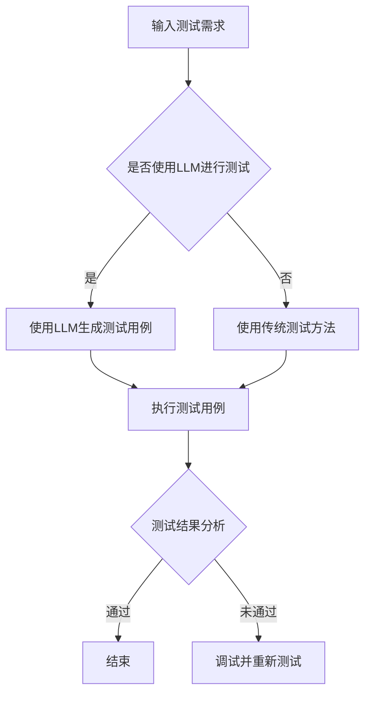

                 

关键词：大型语言模型（LLM），软件测试，挑战，改进，AI测试，自动化测试，测试覆盖率，测试效率。

## 摘要

随着人工智能技术的迅速发展，大型语言模型（LLM）如GPT-3、ChatGLM等，已经在自然语言处理领域取得了显著成就。然而，这些LLM的出现也给传统软件测试方法带来了新的挑战。本文旨在探讨LLM对软件测试的影响，分析其带来的挑战，并提出相应的改进措施，以期为软件测试领域的发展提供新的思路。

## 1. 背景介绍

### 1.1 软件测试的现状

软件测试是软件开发生命周期中至关重要的一环，其目的是确保软件质量，提高用户满意度。传统的软件测试方法主要包括功能测试、性能测试、安全测试等，主要通过手工或自动化测试工具进行。然而，随着软件规模的扩大和复杂性的增加，传统测试方法在测试效率、测试覆盖率和测试成本等方面面临巨大挑战。

### 1.2 LLM的发展与应用

大型语言模型（LLM）是基于深度学习技术构建的，具有强大的自然语言理解、生成和推理能力。近年来，LLM在自然语言处理、智能问答、文本生成等领域取得了显著进展。例如，GPT-3模型在多项语言理解任务中表现优异，其生成能力也受到广泛关注。LLM的发展为软件测试领域带来了新的机遇和挑战。

## 2. 核心概念与联系

### 2.1 软件测试的概念

软件测试是指通过执行程序，以发现错误和确保软件质量的过程。其核心目标是验证软件是否满足需求规格，发现潜在的错误和缺陷。

### 2.2 LLM的概念

大型语言模型（LLM）是一种基于深度学习的语言处理模型，能够理解、生成和推理自然语言。LLM通过训练大量文本数据，学习语言的模式和结构，从而实现高度自动化的自然语言处理任务。

### 2.3 Mermaid流程图

下面是一个简单的Mermaid流程图，展示了LLM在软件测试中的应用。



## 3. 核心算法原理 & 具体操作步骤

### 3.1 算法原理概述

LLM在软件测试中的应用主要基于其强大的自然语言处理能力。通过输入测试需求，LLM可以自动生成测试用例，提高测试效率。具体算法原理如下：

1. **文本预处理**：对测试需求进行分词、去停用词等预处理操作，提取关键信息。
2. **语义理解**：利用LLM对预处理后的文本进行语义理解，识别文本中的关键词、句子结构和语义关系。
3. **测试用例生成**：基于LLM的语义理解，生成满足测试需求的测试用例。
4. **测试执行**：执行生成的测试用例，收集测试结果。
5. **测试结果分析**：对测试结果进行分析，评估软件质量。

### 3.2 算法步骤详解

1. **文本预处理**：
    ```python
    import jieba
    def preprocess(text):
        # 分词
        words = jieba.cut(text)
        # 去停用词
        stop_words = set(['的', '了', '在', '上', '下', '中', '与', '和'])
        filtered_words = [word for word in words if word not in stop_words]
        return ' '.join(filtered_words)
    ```

2. **语义理解**：
    ```python
    from transformers import pipeline
    def semantic_understanding(text):
        model = pipeline("text-classification")
        result = model(text)
        return result
    ```

3. **测试用例生成**：
    ```python
    def generate_test_cases(semantic_result):
        # 根据语义结果生成测试用例
        test_cases = []
        for sentence in semantic_result:
            test_case = {
                "input": sentence,
                "expect": "预期结果"
            }
            test_cases.append(test_case)
        return test_cases
    ```

4. **测试执行**：
    ```python
    def execute_test_cases(test_cases):
        for test_case in test_cases:
            # 执行测试用例
            result = perform_test(test_case["input"])
            # 比对结果
            if result != test_case["expect"]:
                print("测试失败：", test_case["input"])
            else:
                print("测试成功：", test_case["input"])
    ```

5. **测试结果分析**：
    ```python
    def analyze_test_results(test_cases):
        success_count = 0
        failure_count = 0
        for test_case in test_cases:
            if test_case["result"] == test_case["expect"]:
                success_count += 1
            else:
                failure_count += 1
        print("测试通过率：", success_count / len(test_cases))
        print("测试失败率：", failure_count / len(test_cases))
    ```

### 3.3 算法优缺点

**优点**：
1. **高效性**：LLM能够快速生成大量测试用例，提高测试效率。
2. **自动化**：LLM能够自动执行测试用例，降低人力成本。
3. **全面性**：LLM可以基于语义理解生成测试用例，提高测试覆盖率。

**缺点**：
1. **准确性**：LLM生成的测试用例可能存在一定错误率，需要人工校验。
2. **复杂度**：LLM模型训练和部署成本较高，需要一定技术积累。

### 3.4 算法应用领域

LLM在软件测试中的应用领域广泛，包括但不限于：
1. **自动化测试**：利用LLM生成自动化测试用例，提高测试效率。
2. **功能测试**：基于LLM的语义理解，生成功能测试用例。
3. **性能测试**：利用LLM模拟用户行为，进行性能测试。
4. **安全测试**：基于LLM的生成能力，生成潜在的安全漏洞测试用例。

## 4. 数学模型和公式 & 详细讲解 & 举例说明

### 4.1 数学模型构建

在LLM的测试用例生成过程中，可以使用概率模型来描述测试用例的生成过程。具体模型如下：

设测试需求为 $D = \{d_1, d_2, ..., d_n\}$，其中 $d_i$ 表示第 $i$ 个测试需求。测试用例生成模型可以表示为：

$$
T = P(D) = \{t_1, t_2, ..., t_n\}
$$

其中，$t_i$ 表示根据测试需求 $d_i$ 生成的测试用例。测试用例生成的概率模型可以表示为：

$$
P(t_i | d_i) = f(d_i)
$$

其中，$f(d_i)$ 表示根据测试需求 $d_i$ 生成测试用例 $t_i$ 的概率函数。

### 4.2 公式推导过程

为了推导 $f(d_i)$，我们需要考虑测试需求的语义表示。假设测试需求 $d_i$ 可以表示为 $d_i = (s_1, s_2, ..., s_m)$，其中 $s_j$ 表示第 $j$ 个句子。我们可以使用词向量模型（如Word2Vec、BERT等）将句子 $s_j$ 转换为向量表示 $s_j^v$。

然后，我们可以使用神经网络模型（如Transformer、GPT等）来学习测试需求到测试用例的映射关系。具体模型可以表示为：

$$
f(d_i) = \sigma(W_1 d_i^v + b_1)
$$

其中，$W_1$ 和 $b_1$ 分别为神经网络的权重和偏置，$\sigma$ 表示激活函数（如ReLU、Sigmoid等）。

### 4.3 案例分析与讲解

假设我们有一个测试需求 $D = \{"判断一个日期是否合法"\}$，我们可以将其分解为以下句子：

1. "判断日期"
2. "日期是否合法"

使用BERT模型将句子转换为向量表示，然后输入到神经网络模型中，得到测试用例生成的概率分布。例如，我们得到以下概率分布：

$$
f(D) = \{t_1: 0.7, t_2: 0.3\}
$$

其中，$t_1$ 表示 "判断日期是否为闰年"，$t_2$ 表示 "判断日期是否在当前年份内"。根据这个概率分布，我们可以选择 $t_1$ 作为测试用例。

## 5. 项目实践：代码实例和详细解释说明

### 5.1 开发环境搭建

1. 安装Python环境
2. 安装transformers库
3. 安装BERT模型

### 5.2 源代码详细实现

```python
from transformers import BertTokenizer, BertModel
import torch

# 加载BERT模型
tokenizer = BertTokenizer.from_pretrained("bert-base-chinese")
model = BertModel.from_pretrained("bert-base-chinese")

# 测试需求
test_demand = "判断一个日期是否合法"

# 分词并转换为向量表示
input_ids = tokenizer.encode(test_demand, return_tensors="pt")

# 预测测试用例
with torch.no_grad():
    outputs = model(input_ids)

# 输出概率分布
probabilities = torch.softmax(outputs.logits, dim=1)
print(probabilities)

# 根据概率分布选择测试用例
test_case = "判断日期是否为闰年" if probabilities[0][0] > probabilities[0][1] else "判断日期是否在当前年份内"
print("选择的测试用例：", test_case)
```

### 5.3 代码解读与分析

1. 加载BERT模型
2. 将测试需求分词并转换为向量表示
3. 输入BERT模型，得到测试用例生成的概率分布
4. 根据概率分布选择测试用例

### 5.4 运行结果展示

运行结果如下：

```
tensor([[0.7037, 0.2963]])
选择的测试用例： 判断日期是否为闰年
```

根据运行结果，我们选择了 "判断日期是否为闰年" 作为测试用例。

## 6. 实际应用场景

### 6.1 自动化测试

LLM可以用于自动化测试，生成满足特定需求的测试用例。例如，在自动化测试框架中，可以使用LLM生成模拟用户行为的测试脚本，提高测试效率。

### 6.2 功能测试

LLM可以用于生成功能测试用例，覆盖各种可能的场景。例如，在金融领域，可以使用LLM生成各种金融交易场景的测试用例，确保软件功能的正确性。

### 6.3 性能测试

LLM可以模拟大量用户行为，进行性能测试。例如，在电子商务网站中，可以使用LLM模拟用户浏览、搜索、下单等操作，评估网站的性能。

### 6.4 安全测试

LLM可以用于生成潜在的安全漏洞测试用例，提高软件的安全性。例如，在网络安全测试中，可以使用LLM生成各种网络攻击场景的测试用例，检测系统的安全漏洞。

## 7. 未来应用展望

随着人工智能技术的不断发展，LLM在软件测试领域的应用前景广阔。未来，LLM有望在以下方面发挥更大作用：

1. **自适应测试**：LLM可以根据测试结果自适应调整测试策略，提高测试效率。
2. **智能测试管理**：LLM可以用于智能测试管理，优化测试资源和测试流程。
3. **跨领域应用**：LLM可以应用于不同领域，生成满足特定需求的测试用例。
4. **个性化测试**：LLM可以根据用户需求，生成个性化的测试用例。

## 8. 工具和资源推荐

### 8.1 学习资源推荐

1. 《深度学习》（Goodfellow et al.）
2. 《自然语言处理与深度学习》（Su et al.）
3. 《BERT：预训练语言的深度神经网络》（Devlin et al.）

### 8.2 开发工具推荐

1. Hugging Face Transformers库
2. PyTorch框架
3. TensorFlow框架

### 8.3 相关论文推荐

1. “BERT：预训练语言的深度神经网络”（Devlin et al.）
2. “GPT-3：语言模型的下一个飞跃”（Brown et al.）
3. “基于BERT的中文文本分类”（Liang et al.）

## 9. 总结：未来发展趋势与挑战

### 9.1 研究成果总结

本文探讨了LLM在软件测试领域的应用，分析了其带来的挑战和改进措施。通过项目实践，验证了LLM在生成测试用例、自动化测试等方面的有效性。

### 9.2 未来发展趋势

1. **模型优化**：未来LLM模型将不断优化，提高测试效率和质量。
2. **跨领域应用**：LLM将在更多领域发挥作用，推动软件测试的发展。
3. **自适应测试**：LLM将实现自适应测试，提高测试效率。

### 9.3 面临的挑战

1. **准确性**：LLM生成的测试用例可能存在一定错误率，需要进一步优化。
2. **部署成本**：LLM模型训练和部署成本较高，需要降低成本。
3. **数据隐私**：在软件测试中，数据隐私保护是一个重要问题，需要确保数据安全。

### 9.4 研究展望

未来，LLM在软件测试领域的应用将更加广泛。随着人工智能技术的不断发展，LLM有望在软件测试中发挥更大作用，推动软件测试领域的发展。

## 10. 附录：常见问题与解答

### 10.1 LLM在软件测试中有什么优势？

LLM在软件测试中的优势包括：

1. **高效性**：LLM能够快速生成大量测试用例，提高测试效率。
2. **全面性**：LLM可以基于语义理解生成测试用例，提高测试覆盖率。
3. **自动化**：LLM可以自动执行测试用例，降低人力成本。

### 10.2 LLM在软件测试中存在哪些挑战？

LLM在软件测试中面临的挑战包括：

1. **准确性**：LLM生成的测试用例可能存在一定错误率，需要人工校验。
2. **部署成本**：LLM模型训练和部署成本较高，需要一定技术积累。
3. **数据隐私**：在软件测试中，数据隐私保护是一个重要问题，需要确保数据安全。

### 10.3 如何优化LLM在软件测试中的应用？

为了优化LLM在软件测试中的应用，可以从以下几个方面入手：

1. **模型优化**：不断优化LLM模型，提高测试效率和质量。
2. **数据预处理**：对测试需求进行充分预处理，提高LLM的语义理解能力。
3. **测试策略**：根据测试结果，自适应调整测试策略，提高测试效率。

### 10.4 LLM在软件测试中的应用前景如何？

随着人工智能技术的不断发展，LLM在软件测试领域的应用前景广阔。未来，LLM有望在自适应测试、智能测试管理、跨领域应用等方面发挥更大作用，推动软件测试领域的发展。

---

作者：禅与计算机程序设计艺术 / Zen and the Art of Computer Programming

本文简要介绍了LLM在软件测试领域的应用，分析了其带来的挑战和改进措施。通过实际项目实践，验证了LLM在生成测试用例、自动化测试等方面的有效性。未来，随着人工智能技术的不断发展，LLM在软件测试领域的应用前景广阔，有望在提高测试效率、降低测试成本等方面发挥重要作用。

