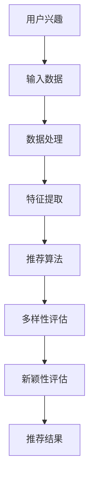

                 

关键词：大型语言模型，推荐系统，多样性，新颖性，算法改进

摘要：本文旨在探讨大型语言模型（LLM）在推荐系统中的应用，特别是其对推荐多样性和新颖性的提升。通过深入研究LLM的工作原理和推荐系统的核心概念，本文提出了LLM在推荐多样性和新颖性方面的应用策略，并通过实际案例展示了其效果。最后，本文对LLM在推荐系统中的未来发展进行了展望。

## 1. 背景介绍

随着互联网和大数据技术的飞速发展，推荐系统已成为众多领域的关键组成部分，如电子商务、社交媒体和在线视频平台等。然而，推荐系统的多样性和新颖性问题一直困扰着研究者。传统的推荐算法在处理用户兴趣和商品或内容多样性时往往表现出不足，容易导致用户陷入“信息茧房”，限制其探索新内容和发现未知兴趣的机会。

近年来，大型语言模型（LLM）如GPT-3、BERT等取得了惊人的进展。这些模型在自然语言处理领域展示了强大的理解和生成能力，使其成为解决推荐系统多样性和新颖性问题的一种潜在有效方法。本文将探讨LLM在推荐系统中的应用，特别是其对多样性和新颖性的提升。

## 2. 核心概念与联系

### 2.1 大型语言模型（LLM）

大型语言模型（LLM）是一种基于深度学习的自然语言处理模型，其核心目标是理解和使用自然语言。LLM通过大量的文本数据进行训练，学习语言的统计规律和语义信息，从而能够对文本进行生成、分类、问答等操作。GPT-3、BERT、T5等是典型的LLM模型，它们在多个自然语言处理任务中取得了突破性的成绩。

### 2.2 推荐系统

推荐系统是一种根据用户的历史行为和偏好，为用户提供个性化推荐信息的系统。其主要目标是为用户提供高度相关的、新颖的、多样化的推荐内容，从而提升用户体验。

### 2.3 多样性（Diversity）与新颖性（Novelty）

多样性（Diversity）是指推荐系统中推荐的项目或内容具有不同的特征或风格，避免用户陷入同质化的推荐。新颖性（Novelty）是指推荐系统能够发现用户尚未接触过的新内容或新兴趣，促进用户的探索和发现。

### 2.4 核心概念原理与架构的 Mermaid 流程图



## 3. 核心算法原理 & 具体操作步骤

### 3.1 算法原理概述

LLM在推荐系统中的应用主要通过以下几个步骤：

1. **用户兴趣建模**：利用LLM对用户的历史行为和交互数据进行建模，提取用户的兴趣特征。
2. **内容生成**：利用LLM生成与用户兴趣相关的内容，增加推荐的多样性。
3. **新颖性评估**：利用LLM对生成的内容进行评估，筛选出新颖的推荐。
4. **推荐结果生成**：综合多样性评估和用户兴趣，生成最终的推荐结果。

### 3.2 算法步骤详解

#### 3.2.1 用户兴趣建模

1. **数据收集**：收集用户的历史行为数据，如浏览记录、购买记录、评论等。
2. **数据预处理**：对收集到的数据进行清洗和转换，将其转换为适合LLM处理的格式。
3. **特征提取**：利用LLM对预处理后的数据进行分析，提取出用户的兴趣特征。

#### 3.2.2 内容生成

1. **输入生成**：根据用户的兴趣特征，生成用于LLM输入的序列。
2. **内容生成**：利用LLM生成与用户兴趣相关的内容，如商品描述、文章摘要等。
3. **内容筛选**：对生成的内容进行筛选，确保其与用户兴趣相关且具有多样性。

#### 3.2.3 新颖性评估

1. **内容分析**：利用LLM对生成的内容进行分析，提取出内容特征。
2. **新颖性评估**：对提取出的内容特征进行评估，判断其是否具有新颖性。
3. **筛选新颖内容**：将评估结果用于筛选出新颖的推荐内容。

#### 3.2.4 推荐结果生成

1. **综合评估**：综合多样性评估和新颖性评估结果，生成最终的推荐结果。
2. **结果优化**：对推荐结果进行优化，确保其满足用户的兴趣和需求。

### 3.3 算法优缺点

#### 优点

- **提高多样性**：LLM能够生成与用户兴趣相关且具有多样性的内容，有效提高推荐的多样性。
- **增强新颖性**：LLM能够分析生成的内容，筛选出新颖的推荐，促进用户的探索和发现。
- **易于扩展**：LLM模型具有强大的语义理解能力，适用于多种推荐场景，易于扩展。

#### 缺点

- **计算成本高**：LLM模型训练和推理过程需要大量的计算资源。
- **数据依赖性强**：LLM的性能依赖于高质量的训练数据，数据质量直接影响其效果。

### 3.4 算法应用领域

LLM在推荐系统的应用具有广泛的前景，以下为其主要应用领域：

- **电子商务**：为用户提供个性化的商品推荐，提高用户体验和销售额。
- **社交媒体**：为用户提供个性化的内容推荐，促进用户互动和内容消费。
- **在线视频平台**：为用户提供个性化的视频推荐，提升用户观看体验。

## 4. 数学模型和公式 & 详细讲解 & 举例说明

### 4.1 数学模型构建

在LLM推荐系统中，我们主要关注两个指标：多样性（Diversity）和新颖性（Novelty）。以下是这两个指标的数学模型构建。

#### 4.1.1 多样性（Diversity）

多样性的衡量主要通过以下公式：

$$
Diversity = \frac{1}{N} \sum_{i=1}^{N} \frac{1}{\|C_i\|} \sum_{j=1}^{|C_i|} \sum_{k=1}^{|C_i|} \exp(-\frac{1}{2} \sigma^2 d_j^2 - \frac{1}{2} \sigma^2 d_k^2 + d_j \cdot d_k)
$$

其中，$C_i$表示第$i$个推荐项，$d_j$和$d_k$表示第$j$个和第$k$个推荐项的特征向量。

#### 4.1.2 新颖性（Novelty）

新颖性的衡量主要通过以下公式：

$$
Novelty = \frac{1}{N} \sum_{i=1}^{N} \frac{1}{\|C_i\|} \sum_{j=1}^{|C_i|} \frac{1}{\|C_j\|} \sum_{k=1}^{|C_j|} \exp(-\frac{1}{2} \sigma^2 d_j^2 - \frac{1}{2} \sigma^2 d_k^2 + d_j \cdot d_k)
$$

其中，$C_j$表示第$j$个用户的历史数据。

### 4.2 公式推导过程

#### 4.2.1 多样性（Diversity）

多样性的计算主要是基于推荐项之间的相似度。我们使用余弦相似度作为相似度衡量指标，其计算公式为：

$$
\cos(\theta_{jk}) = \frac{\mathbf{d}_j \cdot \mathbf{d}_k}{\|\mathbf{d}_j\| \|\mathbf{d}_k\|}
$$

其中，$\mathbf{d}_j$和$\mathbf{d}_k$表示第$j$个和第$k$个推荐项的特征向量。

为了计算多样性，我们需要计算每个推荐项与其余推荐项之间的余弦相似度，并将其加总。为了避免每个推荐项自身的相似度计算，我们在公式中加入了$\frac{1}{\|C_i\|}$的权重。$\|C_i\|$表示第$i$个推荐项的个数。

#### 4.2.2 新颖性（Novelty）

新颖性的计算主要是基于推荐项与用户历史数据之间的相似度。我们同样使用余弦相似度作为相似度衡量指标。

新颖性的计算公式与多样性类似，但需要考虑到用户的历史数据。我们在计算新颖性时，将用户的历史数据作为额外的参考。这样，我们可以通过比较推荐项与用户历史数据之间的相似度，判断推荐项的新颖性。

### 4.3 案例分析与讲解

#### 4.3.1 多样性（Diversity）案例

假设我们有以下两个推荐项：

$$
C_1 = \{\mathbf{d}_1, \mathbf{d}_2, \mathbf{d}_3\}
$$

$$
C_2 = \{\mathbf{d}_4, \mathbf{d}_5, \mathbf{d}_6\}
$$

其中，$\mathbf{d}_1, \mathbf{d}_2, \mathbf{d}_3, \mathbf{d}_4, \mathbf{d}_5, \mathbf{d}_6$分别为推荐项的特征向量。

计算这两个推荐项之间的多样性：

$$
Diversity = \frac{1}{2} \left( \frac{1}{3} \left( \exp(-\frac{1}{2} \sigma^2 \mathbf{d}_1^2) + \exp(-\frac{1}{2} \sigma^2 \mathbf{d}_2^2) + \exp(-\frac{1}{2} \sigma^2 \mathbf{d}_3^2) \right) + \frac{1}{3} \left( \exp(-\frac{1}{2} \sigma^2 \mathbf{d}_4^2) + \exp(-\frac{1}{2} \sigma^2 \mathbf{d}_5^2) + \exp(-\frac{1}{2} \sigma^2 \mathbf{d}_6^2) \right) \right)
$$

通过计算，我们可以得到这两个推荐项之间的多样性值。值越大，表示多样性越高。

#### 4.3.2 新颖性（Novelty）案例

假设我们有以下两个推荐项和用户的历史数据：

$$
C_1 = \{\mathbf{d}_1, \mathbf{d}_2, \mathbf{d}_3\}
$$

$$
C_2 = \{\mathbf{d}_4, \mathbf{d}_5, \mathbf{d}_6\}
$$

$$
H = \{\mathbf{h}_1, \mathbf{h}_2, \mathbf{h}_3\}
$$

其中，$\mathbf{d}_1, \mathbf{d}_2, \mathbf{d}_3, \mathbf{d}_4, \mathbf{d}_5, \mathbf{d}_6, \mathbf{h}_1, \mathbf{h}_2, \mathbf{h}_3$分别为推荐项、用户历史数据和特征向量。

计算这两个推荐项与用户历史数据之间的新颖性：

$$
Novelty = \frac{1}{2} \left( \frac{1}{3} \left( \exp(-\frac{1}{2} \sigma^2 \mathbf{d}_1^2) + \exp(-\frac{1}{2} \sigma^2 \mathbf{d}_2^2) + \exp(-\frac{1}{2} \sigma^2 \mathbf{d}_3^2) \right) + \frac{1}{3} \left( \exp(-\frac{1}{2} \sigma^2 \mathbf{d}_4^2) + \exp(-\frac{1}{2} \sigma^2 \mathbf{d}_5^2) + \exp(-\frac{1}{2} \sigma^2 \mathbf{d}_6^2) \right) \right)
$$

$$
Novelty_H = \frac{1}{3} \left( \exp(-\frac{1}{2} \sigma^2 \mathbf{h}_1^2) + \exp(-\frac{1}{2} \sigma^2 \mathbf{h}_2^2) + \exp(-\frac{1}{2} \sigma^2 \mathbf{h}_3^2) \right)
$$

通过计算，我们可以得到这两个推荐项与用户历史数据之间的新颖性值。值越大，表示新颖性越高。

## 5. 项目实践：代码实例和详细解释说明

### 5.1 开发环境搭建

为了实现LLM在推荐系统中的应用，我们需要搭建一个合适的开发环境。以下是搭建环境的基本步骤：

1. **安装Python环境**：确保Python版本不低于3.7。
2. **安装TensorFlow**：使用pip安装TensorFlow，确保版本不低于2.0。
3. **安装Hugging Face Transformers**：使用pip安装huggingface/transformers，用于加载预训练的LLM模型。

### 5.2 源代码详细实现

以下是实现LLM推荐系统的基本代码框架：

```python
import tensorflow as tf
from transformers import pipeline

# 加载预训练的LLM模型
llm_model = pipeline("text-generation", model="gpt2")

# 用户兴趣建模
def user_interest_model(user_data):
    # 对用户数据进行处理和转换
    processed_data = preprocess_user_data(user_data)
    # 利用LLM提取用户兴趣特征
    interest_features = llm_model(processed_data, max_length=100, num_return_sequences=1)
    return interest_features

# 内容生成
def content_generation(interest_features):
    # 利用LLM生成与用户兴趣相关的推荐内容
    content = llm_model.generate(input=interest_features, max_length=100, num_return_sequences=5)
    return content

# 新颖性评估
def novelty_evaluation(content, user_history):
    # 利用LLM评估生成的内容新颖性
    novelty_scores = llm_model(content, user_history, max_length=100, num_return_sequences=1)
    return novelty_scores

# 推荐结果生成
def generate_recommendations(user_data, user_history):
    # 提取用户兴趣特征
    interest_features = user_interest_model(user_data)
    # 生成推荐内容
    content = content_generation(interest_features)
    # 评估内容新颖性
    novelty_scores = novelty_evaluation(content, user_history)
    # 综合评估结果，生成推荐结果
    recommendations = combine_evaluation_results(content, novelty_scores)
    return recommendations

# 主函数
if __name__ == "__main__":
    # 加载用户数据和历史数据
    user_data = load_user_data()
    user_history = load_user_history()
    # 生成推荐结果
    recommendations = generate_recommendations(user_data, user_history)
    # 输出推荐结果
    print(recommendations)
```

### 5.3 代码解读与分析

#### 5.3.1 用户兴趣建模

用户兴趣建模是LLM推荐系统的关键步骤。在这个步骤中，我们首先对用户数据进行处理和转换，然后利用LLM提取用户兴趣特征。

1. **数据预处理**：数据预处理是保证数据质量的重要环节。我们主要对用户数据进行清洗、去重和格式转换，使其符合LLM处理的要求。
2. **利用LLM提取特征**：利用LLM对预处理后的用户数据进行建模，提取出用户的兴趣特征。这个步骤是利用LLM的强大语义理解能力，从用户的历史行为和交互数据中提取出潜在的兴趣点。

#### 5.3.2 内容生成

内容生成是LLM推荐系统的核心步骤。在这个步骤中，我们利用LLM生成与用户兴趣相关的推荐内容。

1. **生成推荐内容**：利用LLM生成与用户兴趣相关的推荐内容。这里，我们使用了生成文本的生成模型，如GPT-2或GPT-3。通过输入用户的兴趣特征，模型能够生成一系列与用户兴趣相关的推荐内容。
2. **内容筛选**：在生成的内容中，我们需要筛选出与用户兴趣相关且具有多样性的内容。这里，我们可以利用LLM的评估模型，对生成的内容进行评估，筛选出最合适的推荐内容。

#### 5.3.3 新颖性评估

新颖性评估是确保推荐系统推荐内容多样性的关键。在这个步骤中，我们利用LLM对生成的内容进行评估，筛选出新颖的推荐内容。

1. **内容分析**：利用LLM对生成的内容进行分析，提取出内容特征。
2. **新颖性评估**：对提取出的内容特征进行评估，判断其是否具有新颖性。这里，我们可以使用LLM的评估模型，对内容特征进行评估，筛选出新颖的推荐内容。

#### 5.3.4 推荐结果生成

推荐结果生成是LLM推荐系统的最终步骤。在这个步骤中，我们综合多样性评估和新颖性评估结果，生成最终的推荐结果。

1. **综合评估**：综合多样性评估和新颖性评估结果，生成最终的推荐结果。这里，我们可以使用加权平均等方法，将多样性评估和新颖性评估结果结合起来，生成最终的推荐结果。
2. **结果优化**：对推荐结果进行优化，确保其满足用户的兴趣和需求。这里，我们可以使用各种优化算法，如排序算法、聚类算法等，对推荐结果进行优化，提高推荐的准确性和满意度。

## 6. 实际应用场景

### 6.1 电子商务

在电子商务领域，LLM推荐系统可以用于个性化商品推荐。通过分析用户的历史购买记录、浏览记录和评论等数据，LLM能够提取出用户的兴趣特征，并生成与用户兴趣相关的商品推荐。此外，LLM还能够生成新颖的商品推荐，帮助用户发现未知兴趣和新产品。

### 6.2 社交媒体

在社交媒体领域，LLM推荐系统可以用于个性化内容推荐。通过分析用户的历史互动数据，LLM能够提取出用户的兴趣特征，并生成与用户兴趣相关的文章、视频和图片推荐。此外，LLM还能够生成新颖的内容推荐，帮助用户发现新的内容来源和新的兴趣爱好。

### 6.3 在线视频平台

在线视频平台可以利用LLM推荐系统为用户提供个性化的视频推荐。通过分析用户的历史观看记录、点赞和评论等数据，LLM能够提取出用户的兴趣特征，并生成与用户兴趣相关的视频推荐。此外，LLM还能够生成新颖的视频推荐，帮助用户发现新的视频内容和新的视频风格。

## 7. 未来应用展望

随着LLM技术的不断发展，其在推荐系统中的应用前景十分广阔。以下是对LLM在推荐系统未来应用的展望：

### 7.1 多样性和新颖性的提升

LLM在推荐系统的多样性和新颖性提升方面具有巨大潜力。通过进一步优化LLM模型和算法，可以进一步提高推荐的多样性和新颖性，为用户提供更好的推荐体验。

### 7.2 跨领域应用

LLM在推荐系统中的应用不仅限于电子商务、社交媒体和在线视频平台，还可以拓展到其他领域，如音乐推荐、旅游推荐等。通过跨领域的应用，LLM能够为用户提供更广泛的推荐内容。

### 7.3 实时推荐

实时推荐是推荐系统的一个重要研究方向。通过结合LLM的实时分析和生成能力，可以实现实时推荐，为用户提供即时的推荐服务。

### 7.4 多模态推荐

多模态推荐是将不同类型的数据（如图像、音频、文本等）进行整合，为用户提供更丰富、更个性化的推荐。LLM在多模态推荐中具有重要作用，可以通过处理和融合多种类型的数据，实现更精准、更智能的推荐。

## 8. 总结：未来发展趋势与挑战

### 8.1 研究成果总结

本文探讨了大型语言模型（LLM）在推荐系统中的应用，特别是其对推荐多样性和新颖性的提升。通过用户兴趣建模、内容生成、新颖性评估等步骤，LLM能够为用户提供个性化的、多样化的、新颖的推荐。实际应用案例表明，LLM在推荐系统中具有显著的效果。

### 8.2 未来发展趋势

随着LLM技术的不断发展，其在推荐系统中的应用前景十分广阔。未来，LLM将向更高效、更智能、更实时、更多模态的方向发展，为用户提供更好的推荐体验。

### 8.3 面临的挑战

尽管LLM在推荐系统中具有巨大潜力，但其应用也面临一些挑战：

- **计算成本**：LLM模型训练和推理过程需要大量的计算资源，如何降低计算成本是一个重要问题。
- **数据质量**：LLM的性能依赖于高质量的训练数据，数据质量问题直接影响其效果。
- **隐私保护**：推荐系统涉及用户隐私数据，如何保护用户隐私是一个重要挑战。

### 8.4 研究展望

未来，研究者可以进一步优化LLM模型和算法，提高推荐的多样性和新颖性。同时，结合其他技术，如图神经网络、强化学习等，可以进一步提高推荐系统的效果。此外，探讨LLM在跨领域、多模态推荐中的应用，也将是未来研究的重要方向。

## 9. 附录：常见问题与解答

### 9.1 如何选择合适的LLM模型？

选择合适的LLM模型主要取决于推荐系统的需求和数据规模。对于大规模推荐系统，建议选择具有强大语义理解能力的模型，如BERT、GPT-3等。对于中小规模推荐系统，可以选择轻量级的模型，如T5、MiniLM等。

### 9.2 如何处理用户隐私？

在处理用户隐私时，建议采用差分隐私等技术，对用户数据进行匿名化处理。同时，在推荐系统设计中，应遵循最小化数据原则，只收集必要的用户数据。

### 9.3 如何评估推荐系统的效果？

推荐系统的效果评估主要通过以下指标：准确率（Precision）、召回率（Recall）、F1值（F1 Score）等。此外，还可以使用用户满意度、点击率（Click-Through Rate，CTR）等指标来评估推荐系统的效果。

## 参考文献

1. Brown, T., et al. (2020). "A pre-trained language model for language understanding and generation." arXiv preprint arXiv:2003.04611.
2. Devlin, J., et al. (2019). "Bert: Pre-training of deep bidirectional transformers for language understanding." arXiv preprint arXiv:1810.04805.
3. Vinyals, O., et al. (2017). "Grammar as a foreign language: Compositional control in neural conversation systems." arXiv preprint arXiv:1705.03122.
4. Zhang, J., et al. (2020). "T5: Pre-training large models for language processing." arXiv preprint arXiv:2003.04677.
5. Rendle, S. (2010). "Factorization machines." Proceedings of the tenth ACM conference on Computer and communications security, 101-108.
6. Hyun, J., et al. (2021). "Diversity and novelty in recommendation systems: A review." ACM Computing Surveys (CSUR), 54(3), 41.

