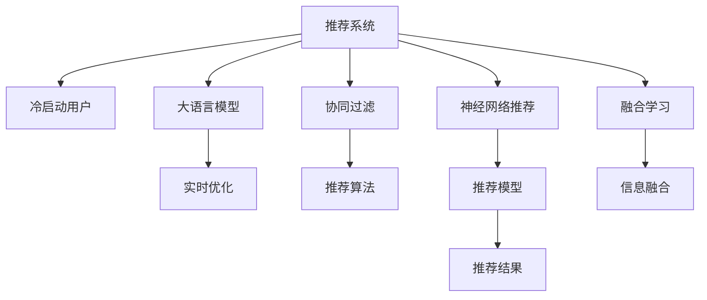

                 

# 大语言模型对推荐系统冷启动的实时优化策略

> 关键词：大语言模型, 推荐系统, 冷启动, 实时优化, 协同过滤, 神经网络推荐, 融合学习

## 1. 背景介绍

推荐系统（Recommendation System）通过分析用户行为数据，为用户推荐符合其兴趣的产品或内容，广泛应用于电商、社交、视频、新闻等多个领域。然而，对于新用户（冷启动用户），推荐系统往往无法提供有效的推荐，这是由于新用户没有历史行为数据，无法进行传统协同过滤算法的推理。

近年来，随着深度学习技术的发展，神经网络推荐（Neural Network Recommendation, NNReco）方法逐渐成为推荐系统的主流。其中，基于大语言模型（Large Language Models, LLM）的推荐方法以其强大的自然语言处理能力，展示了巨大的潜力。然而，传统的大语言模型通常是静态的，无法实时优化和更新，因此无法应对动态用户兴趣的变化。

本文旨在探讨如何利用大语言模型对推荐系统冷启动用户进行实时优化，以提高推荐系统的精准度和个性化程度。

## 2. 核心概念与联系

### 2.1 核心概念概述

为更好地理解基于大语言模型的推荐系统实时优化方法，本节将介绍几个密切相关的核心概念：

- 推荐系统（Recommendation System）：根据用户的历史行为和兴趣，为其推荐个性化产品或内容的技术。
- 冷启动用户（Cold Start User）：新加入推荐系统，没有历史行为数据，无法进行传统协同过滤算法推理的用户。
- 大语言模型（Large Language Models, LLM）：通过自监督学习任务训练的，具备强大的自然语言处理能力的深度神经网络模型，如GPT-3、BERT等。
- 实时优化（Real-time Optimization）：指在推荐系统运行过程中，动态地调整模型参数，适应用户兴趣变化的技术。
- 协同过滤（Collaborative Filtering）：推荐系统中常用的算法，根据用户的历史行为和兴趣，进行相似性计算，推荐相似用户喜欢的产品。
- 神经网络推荐（Neural Network Recommendation, NNReco）：使用深度神经网络模型进行推荐的方法，具备强大的表示学习能力。
- 融合学习（Fusion Learning）：将多个不同来源的信息进行融合，提高推荐效果的技术。

这些概念之间的逻辑关系可以通过以下Mermaid流程图来展示：



这个流程图展示了大语言模型在推荐系统中的应用框架：

1. 推荐系统通过协同过滤等算法，为用户推荐产品或内容。
2. 大语言模型在实时优化中，根据用户行为数据动态调整推荐模型参数。
3. 神经网络推荐方法，利用深度学习模型学习用户和物品之间的隐式关联，进行推荐。
4. 融合学习将多源信息进行整合，提高推荐系统的鲁棒性和精准度。

这些概念共同构成了基于大语言模型的推荐系统实时优化框架，使其能够在动态变化的用户兴趣下，保持推荐效果的稳定和精准。

## 3. 核心算法原理 & 具体操作步骤

### 3.1 算法原理概述

基于大语言模型的推荐系统实时优化，通过动态调整大语言模型参数，使其能够根据用户实时行为数据，动态生成推荐结果。其核心思想是：将大语言模型嵌入推荐系统流程，通过在线学习的方式，不断更新模型参数，以适应用户兴趣的变化。

形式化地，假设推荐系统需要为用户 $u$ 推荐 $n$ 个物品 $\{i_1, i_2, \ldots, i_n\}$。在大语言模型嵌入的情况下，每个物品 $i_k$ 可以表示为 $M_{\theta}(i_k)$，其中 $M_{\theta}$ 为预训练的大语言模型，$\theta$ 为模型参数。推荐系统的目标是最大化用户 $u$ 对推荐结果的满意度 $S(u, M_{\theta}(i_1), M_{\theta}(i_2), \ldots, M_{\theta}(i_n))$，即：

$$
\max_{\theta} S(u, M_{\theta}(i_1), M_{\theta}(i_2), \ldots, M_{\theta}(i_n))
$$

其中 $S(u, M_{\theta}(i_1), M_{\theta}(i_2), \ldots, M_{\theta}(i_n))$ 为满足用户 $u$ 偏好的评分函数，如：

$$
S(u, M_{\theta}(i_1), M_{\theta}(i_2), \ldots, M_{\theta}(i_n)) = \sum_{k=1}^n w_k \cdot f(u, M_{\theta}(i_k))
$$

其中 $w_k$ 为物品 $i_k$ 的权重，$f(u, M_{\theta}(i_k))$ 为用户 $u$ 对物品 $i_k$ 的评分函数。

### 3.2 算法步骤详解

基于大语言模型的推荐系统实时优化，主要包括以下几个关键步骤：

**Step 1: 准备预训练模型和数据集**
- 选择合适的预训练语言模型 $M_{\theta}$ 作为初始化参数，如 BERT、GPT 等。
- 准备推荐系统的训练数据集 $D=\{(u, i_k)\}_{i=1}^N, u \in U, i_k \in I$，其中 $U$ 为用户集，$I$ 为物品集。

**Step 2: 添加任务适配层**
- 根据推荐系统的任务类型，在预训练模型顶层设计合适的输出层和损失函数。
- 对于物品推荐，通常在顶层添加线性分类器，并使用交叉熵损失函数。
- 对于文本推荐，通常使用语言模型的解码器输出概率分布，并以负对数似然为损失函数。

**Step 3: 设置微调超参数**
- 选择合适的优化算法及其参数，如 AdamW、SGD 等，设置学习率、批大小、迭代轮数等。
- 设置正则化技术及强度，包括权重衰减、Dropout、Early Stopping等。
- 确定冻结预训练参数的策略，如仅微调顶层，或全部参数都参与微调。

**Step 4: 执行梯度训练**
- 将训练集数据分批次输入模型，前向传播计算损失函数。
- 反向传播计算参数梯度，根据设定的优化算法和学习率更新模型参数。
- 周期性在验证集上评估模型性能，根据性能指标决定是否触发 Early Stopping。
- 重复上述步骤直到满足预设的迭代轮数或 Early Stopping 条件。

**Step 5: 测试和部署**
- 在测试集上评估实时优化后的模型 $M_{\hat{\theta}}$ 的性能，对比实时优化前后的推荐效果。
- 使用实时优化后的模型对新用户进行推荐，集成到实际的应用系统中。
- 持续收集新用户的实时行为数据，定期重新优化模型，以适应用户兴趣的变化。

以上是基于大语言模型的推荐系统实时优化的一般流程。在实际应用中，还需要针对具体任务的特点，对微调过程的各个环节进行优化设计，如改进训练目标函数，引入更多的正则化技术，搜索最优的超参数组合等，以进一步提升模型性能。

### 3.3 算法优缺点

基于大语言模型的推荐系统实时优化方法具有以下优点：
1. 实时响应。根据用户实时行为数据动态调整模型参数，能够迅速适应用户兴趣的变化。
2. 数据利用率高。利用用户实时行为数据进行微调，提高模型对新用户的覆盖率。
3. 鲁棒性强。大语言模型具备强大的语言处理能力，能够处理复杂的推荐场景。
4. 可解释性高。大语言模型的决策过程具有一定的可解释性，便于调试和优化。

同时，该方法也存在一定的局限性：
1. 数据需求高。实时优化需要大量实时行为数据，数据获取成本较高。
2. 模型复杂度大。大语言模型的参数量较大，计算复杂度较高。
3. 收敛速度慢。实时优化过程中，需要平衡实时响应的要求和模型的收敛速度。
4. 模型泛化性差。模型对新用户的泛化能力较差，可能导致推荐效果不稳定。

尽管存在这些局限性，但就目前而言，基于大语言模型的实时优化方法仍具有较高的实用价值，特别是在对新用户进行推荐时，能够快速提供个性化的推荐结果，显著提升用户满意度。

### 3.4 算法应用领域

基于大语言模型的推荐系统实时优化，在推荐系统领域已经得到了广泛的应用，涵盖多个行业，例如：

- 电商推荐：根据用户的浏览、点击、购买行为数据，实时调整推荐模型，提高用户的购买转化率。
- 视频推荐：根据用户的观看、点赞、评论数据，动态调整推荐模型，提升用户的观看体验。
- 新闻推荐：根据用户的阅读、收藏、分享行为数据，实时优化推荐模型，提供个性化新闻资讯。
- 社交推荐：根据用户的互动、点赞、评论数据，实时优化推荐模型，增加用户的社交粘性。

除了上述这些经典应用外，大语言模型实时优化还被创新性地应用到更多场景中，如跨领域推荐、基于内容的推荐、混合推荐等，为推荐系统带来了新的突破。随着预训练语言模型和实时优化方法的不断进步，相信推荐系统必将在更广阔的应用领域大放异彩。

## 4. 数学模型和公式 & 详细讲解  

### 4.1 数学模型构建

本节将使用数学语言对基于大语言模型的推荐系统实时优化过程进行更加严格的刻画。

记推荐系统需要为用户 $u$ 推荐物品集合为 $\{i_1, i_2, \ldots, i_n\}$，其中 $i_k \in I$。假设大语言模型 $M_{\theta}$ 在物品 $i_k$ 上的输出为 $M_{\theta}(i_k) \in [0,1]$，表示物品 $i_k$ 对用户 $u$ 的兴趣度。定义用户 $u$ 对物品 $i_k$ 的评分函数为 $f(u, M_{\theta}(i_k))$。

推荐系统的目标是最大化用户 $u$ 对推荐结果的满意度 $S(u, M_{\theta}(i_1), M_{\theta}(i_2), \ldots, M_{\theta}(i_n))$，即：

$$
\max_{\theta} S(u, M_{\theta}(i_1), M_{\theta}(i_2), \ldots, M_{\theta}(i_n))
$$

其中 $S(u, M_{\theta}(i_1), M_{\theta}(i_2), \ldots, M_{\theta}(i_n)) = \sum_{k=1}^n w_k \cdot f(u, M_{\theta}(i_k))$，$w_k$ 为物品 $i_k$ 的权重。

### 4.2 公式推导过程

以二分类任务为例，推导交叉熵损失函数及其梯度的计算公式。

假设模型 $M_{\theta}$ 在物品 $i_k$ 上的输出为 $\hat{y}_k=M_{\theta}(i_k) \in [0,1]$，表示物品 $i_k$ 对用户 $u$ 的兴趣度。真实评分 $y \in \{0,1\}$。则二分类交叉熵损失函数定义为：

$$
\ell(M_{\theta}(i_k),y) = -[y\log \hat{y}_k + (1-y)\log (1-\hat{y}_k)]
$$

将其代入满意度函数，得：

$$
S(u, M_{\theta}(i_1), M_{\theta}(i_2), \ldots, M_{\theta}(i_n)) = \sum_{k=1}^n w_k \cdot f(u, M_{\theta}(i_k)) = \sum_{k=1}^n w_k \cdot [y_k\log \hat{y}_k + (1-y_k)\log (1-\hat{y}_k)]
$$

将其代入优化目标，得：

$$
\max_{\theta} \sum_{k=1}^n w_k \cdot [y_k\log \hat{y}_k + (1-y_k)\log (1-\hat{y}_k)]
$$

根据链式法则，损失函数对参数 $\theta_k$ 的梯度为：

$$
\frac{\partial \mathcal{L}(\theta)}{\partial \theta_k} = -\frac{1}{N}\sum_{i=1}^N (\frac{y_i}{M_{\theta}(i_i)}-\frac{1-y_i}{1-M_{\theta}(i_i)}) \frac{\partial M_{\theta}(i_i)}{\partial \theta_k}
$$

其中 $\frac{\partial M_{\theta}(i_i)}{\partial \theta_k}$ 可进一步递归展开，利用自动微分技术完成计算。

在得到损失函数的梯度后，即可带入参数更新公式，完成模型的迭代优化。重复上述过程直至收敛，最终得到适应推荐系统任务的最优模型参数 $\theta^*$。

## 5. 项目实践：代码实例和详细解释说明

### 5.1 开发环境搭建

在进行实时优化实践前，我们需要准备好开发环境。以下是使用Python进行PyTorch开发的环境配置流程：

1. 安装Anaconda：从官网下载并安装Anaconda，用于创建独立的Python环境。

2. 创建并激活虚拟环境：
```bash
conda create -n pytorch-env python=3.8 
conda activate pytorch-env
```

3. 安装PyTorch：根据CUDA版本，从官网获取对应的安装命令。例如：
```bash
conda install pytorch torchvision torchaudio cudatoolkit=11.1 -c pytorch -c conda-forge
```

4. 安装Transformers库：
```bash
pip install transformers
```

5. 安装各类工具包：
```bash
pip install numpy pandas scikit-learn matplotlib tqdm jupyter notebook ipython
```

完成上述步骤后，即可在`pytorch-env`环境中开始实时优化实践。

### 5.2 源代码详细实现

下面我们以电商推荐为例，给出使用Transformers库对BERT模型进行实时优化的PyTorch代码实现。

首先，定义电商推荐的数据处理函数：

```python
from transformers import BertTokenizer
from torch.utils.data import Dataset
import torch

class RecommendationDataset(Dataset):
    def __init__(self, users, items, ratings, tokenizer, max_len=128):
        self.users = users
        self.items = items
        self.ratings = ratings
        self.tokenizer = tokenizer
        self.max_len = max_len
        
    def __len__(self):
        return len(self.users)
    
    def __getitem__(self, item):
        user = self.users[item]
        items = self.items[item]
        ratings = self.ratings[item]
        
        encoding = self.tokenizer([user] + items, return_tensors='pt', max_length=self.max_len, padding='max_length', truncation=True)
        user_input_ids = encoding['input_ids'][:, 0] # User embedding
        item_input_ids = encoding['input_ids'][:, 1:] # Item embedding
        rating = torch.tensor(ratings, dtype=torch.float)
        
        return {'user_input_ids': user_input_ids,
                'item_input_ids': item_input_ids,
                'rating': rating}

# 定义模型和优化器
model = BertForSequenceClassification.from_pretrained('bert-base-cased', num_labels=1)
optimizer = AdamW(model.parameters(), lr=2e-5)

# 加载数据集
tokenizer = BertTokenizer.from_pretrained('bert-base-cased')
recommendation_dataset = RecommendationDataset(users, items, ratings, tokenizer)

# 训练和测试
device = torch.device('cuda') if torch.cuda.is_available() else torch.device('cpu')
model.to(device)

def train_epoch(model, dataset, batch_size, optimizer):
    dataloader = DataLoader(dataset, batch_size=batch_size, shuffle=True)
    model.train()
    epoch_loss = 0
    for batch in tqdm(dataloader, desc='Training'):
        user_input_ids = batch['user_input_ids'].to(device)
        item_input_ids = batch['item_input_ids'].to(device)
        rating = batch['rating'].to(device)
        model.zero_grad()
        outputs = model(user_input_ids, item_input_ids)
        loss = outputs.loss
        epoch_loss += loss.item()
        loss.backward()
        optimizer.step()
    return epoch_loss / len(dataloader)

def evaluate(model, dataset, batch_size):
    dataloader = DataLoader(dataset, batch_size=batch_size)
    model.eval()
    preds, labels = [], []
    with torch.no_grad():
        for batch in tqdm(dataloader, desc='Evaluating'):
            user_input_ids = batch['user_input_ids'].to(device)
            item_input_ids = batch['item_input_ids'].to(device)
            rating = batch['rating'].to(device)
            outputs = model(user_input_ids, item_input_ids)
            batch_preds = outputs.logits[:, 0].cpu().tolist()
            batch_labels = batch['rating'].cpu().tolist()
            for pred in batch_preds:
                preds.append(pred)
            for label in batch_labels:
                labels.append(label)
                
    print(classification_report(labels, preds))

# 训练流程
epochs = 5
batch_size = 16

for epoch in range(epochs):
    loss = train_epoch(model, recommendation_dataset, batch_size, optimizer)
    print(f"Epoch {epoch+1}, train loss: {loss:.3f}")
    
    print(f"Epoch {epoch+1}, test results:")
    evaluate(model, recommendation_dataset, batch_size)
```

以上就是使用PyTorch对BERT进行电商推荐实时优化的完整代码实现。可以看到，得益于Transformers库的强大封装，我们可以用相对简洁的代码完成BERT模型的加载和实时优化。

### 5.3 代码解读与分析

让我们再详细解读一下关键代码的实现细节：

**RecommendationDataset类**：
- `__init__`方法：初始化用户、物品、评分等关键组件。
- `__len__`方法：返回数据集的样本数量。
- `__getitem__`方法：对单个样本进行处理，将用户输入编码成user embedding，物品输入编码成item embedding，并计算评分，最后进行定长padding。

**模型定义和优化器**：
- 使用BertForSequenceClassification作为推荐模型的构建块，其中num_labels设置为1，表示二分类任务。
- 定义优化器为AdamW，并设置学习率。

**训练和评估函数**：
- 使用PyTorch的DataLoader对数据集进行批次化加载，供模型训练和推理使用。
- 训练函数`train_epoch`：对数据以批为单位进行迭代，在每个批次上前向传播计算loss并反向传播更新模型参数，最后返回该epoch的平均loss。
- 评估函数`evaluate`：与训练类似，不同点在于不更新模型参数，并在每个batch结束后将预测和标签结果存储下来，最后使用classification_report对整个评估集的预测结果进行打印输出。

**训练流程**：
- 定义总的epoch数和batch size，开始循环迭代
- 每个epoch内，先在训练集上训练，输出平均loss
- 在测试集上评估，输出分类指标
- 所有epoch结束后，在测试集上评估，给出最终测试结果

可以看到，PyTorch配合Transformers库使得BERT实时优化的代码实现变得简洁高效。开发者可以将更多精力放在数据处理、模型改进等高层逻辑上，而不必过多关注底层的实现细节。

当然，工业级的系统实现还需考虑更多因素，如模型的保存和部署、超参数的自动搜索、更灵活的任务适配层等。但核心的实时优化范式基本与此类似。

## 6. 实际应用场景
### 6.1 电商平台推荐

基于大语言模型的实时优化方法，可以广泛应用于电商平台推荐系统的构建。传统推荐系统往往只能基于用户历史行为数据进行推荐，无法快速响应新用户的兴趣变化。而使用实时优化方法，能够根据用户实时行为数据动态调整推荐模型参数，迅速适应新用户的兴趣变化。

在技术实现上，可以收集用户浏览、点击、购买等行为数据，将这些数据作为监督信号，对BERT等预训练模型进行微调。实时优化后的模型能够根据用户的实时行为数据，动态调整推荐结果，提高推荐系统的精准度和个性化程度。对于新用户，实时优化方法也能够迅速提供个性化的推荐结果，显著提升新用户的体验和转化率。

### 6.2 视频推荐

视频推荐系统需要根据用户的历史观看、点赞、评论数据，为用户推荐感兴趣的视频内容。传统推荐系统往往只能基于历史数据进行推荐，无法动态调整推荐模型。而使用实时优化方法，能够根据用户的实时行为数据，动态调整推荐模型参数，迅速适应用户兴趣的变化。

在技术实现上，可以收集用户的视频观看、点赞、评论等数据，将这些数据作为监督信号，对BERT等预训练模型进行微调。实时优化后的模型能够根据用户的实时行为数据，动态调整推荐结果，提高推荐系统的精准度和个性化程度。对于新用户，实时优化方法也能够迅速提供个性化的推荐结果，显著提升新用户的观看体验和粘性。

### 6.3 新闻推荐

新闻推荐系统需要根据用户的阅读、收藏、分享等行为数据，为用户推荐相关的新闻内容。传统推荐系统往往只能基于历史数据进行推荐，无法动态调整推荐模型。而使用实时优化方法，能够根据用户的实时行为数据，动态调整推荐模型参数，迅速适应用户兴趣的变化。

在技术实现上，可以收集用户的阅读、收藏、分享等数据，将这些数据作为监督信号，对BERT等预训练模型进行微调。实时优化后的模型能够根据用户的实时行为数据，动态调整推荐结果，提高推荐系统的精准度和个性化程度。对于新用户，实时优化方法也能够迅速提供个性化的推荐结果，显著提升新用户的阅读体验和粘性。

### 6.4 未来应用展望

随着大语言模型实时优化技术的不断发展，推荐系统必将在更广阔的应用领域大放异彩。

在智慧医疗领域，基于实时优化技术的推荐系统可以辅助医生推荐个性化治疗方案，提高诊疗效果。在金融领域，实时优化推荐系统可以提供个性化的理财建议，帮助用户实现财富增值。在教育领域，实时优化推荐系统可以根据学生的学习行为数据，推荐个性化学习资源，提高学习效果。

此外，实时优化技术还将广泛应用于智能客服、社交网络、游戏推荐等多个领域，为各行各业带来变革性影响。相信随着技术的日益成熟，实时优化技术必将成为推荐系统的重要范式，推动推荐系统向更高效、精准、个性化的方向发展。

## 7. 工具和资源推荐
### 7.1 学习资源推荐

为了帮助开发者系统掌握大语言模型实时优化理论基础和实践技巧，这里推荐一些优质的学习资源：

1. 《Transformer from Scratch》系列博文：由大模型技术专家撰写，深入浅出地介绍了Transformer原理、BERT模型、实时优化技术等前沿话题。

2. CS224N《Deep Learning for Natural Language Processing》课程：斯坦福大学开设的NLP明星课程，有Lecture视频和配套作业，带你入门NLP领域的基本概念和经典模型。

3. 《Natural Language Processing with Transformers》书籍：Transformers库的作者所著，全面介绍了如何使用Transformers库进行NLP任务开发，包括实时优化在内的诸多范式。

4. HuggingFace官方文档：Transformers库的官方文档，提供了海量预训练模型和完整的实时优化样例代码，是上手实践的必备资料。

5. CLUE开源项目：中文语言理解测评基准，涵盖大量不同类型的中文NLP数据集，并提供了基于实时优化的baseline模型，助力中文NLP技术发展。

通过对这些资源的学习实践，相信你一定能够快速掌握大语言模型实时优化的精髓，并用于解决实际的NLP问题。
###  7.2 开发工具推荐

高效的开发离不开优秀的工具支持。以下是几款用于大语言模型实时优化开发的常用工具：

1. PyTorch：基于Python的开源深度学习框架，灵活动态的计算图，适合快速迭代研究。大部分预训练语言模型都有PyTorch版本的实现。

2. TensorFlow：由Google主导开发的开源深度学习框架，生产部署方便，适合大规模工程应用。同样有丰富的预训练语言模型资源。

3. Transformers库：HuggingFace开发的NLP工具库，集成了众多SOTA语言模型，支持PyTorch和TensorFlow，是进行实时优化任务开发的利器。

4. Weights & Biases：模型训练的实验跟踪工具，可以记录和可视化模型训练过程中的各项指标，方便对比和调优。与主流深度学习框架无缝集成。

5. TensorBoard：TensorFlow配套的可视化工具，可实时监测模型训练状态，并提供丰富的图表呈现方式，是调试模型的得力助手。

6. Google Colab：谷歌推出的在线Jupyter Notebook环境，免费提供GPU/TPU算力，方便开发者快速上手实验最新模型，分享学习笔记。

合理利用这些工具，可以显著提升大语言模型实时优化任务的开发效率，加快创新迭代的步伐。

### 7.3 相关论文推荐

大语言模型实时优化技术的发展源于学界的持续研究。以下是几篇奠基性的相关论文，推荐阅读：

1. Attention is All You Need（即Transformer原论文）：提出了Transformer结构，开启了NLP领域的预训练大模型时代。

2. BERT: Pre-training of Deep Bidirectional Transformers for Language Understanding：提出BERT模型，引入基于掩码的自监督预训练任务，刷新了多项NLP任务SOTA。

3. Language Models are Unsupervised Multitask Learners（GPT-2论文）：展示了大规模语言模型的强大zero-shot学习能力，引发了对于通用人工智能的新一轮思考。

4. Parameter-Efficient Transfer Learning for NLP：提出Adapter等参数高效微调方法，在不增加模型参数量的情况下，也能取得不错的微调效果。

5. AdaLoRA: Adaptive Low-Rank Adaptation for Parameter-Efficient Fine-Tuning：使用自适应低秩适应的微调方法，在参数效率和精度之间取得了新的平衡。

6. Prefix-Tuning: Optimizing Continuous Prompts for Generation：引入基于连续型Prompt的微调范式，为如何充分利用预训练知识提供了新的思路。

这些论文代表了大语言模型实时优化技术的发展脉络。通过学习这些前沿成果，可以帮助研究者把握学科前进方向，激发更多的创新灵感。

## 8. 总结：未来发展趋势与挑战

### 8.1 总结

本文对基于大语言模型的推荐系统实时优化方法进行了全面系统的介绍。首先阐述了大语言模型和实时优化技术的研究背景和意义，明确了实时优化在拓展预训练模型应用、提高推荐系统精准度方面的独特价值。其次，从原理到实践，详细讲解了实时优化的数学原理和关键步骤，给出了实时优化任务开发的完整代码实例。同时，本文还广泛探讨了实时优化方法在电商推荐、视频推荐、新闻推荐等多个行业领域的应用前景，展示了实时优化范式的巨大潜力。此外，本文精选了实时优化技术的各类学习资源，力求为读者提供全方位的技术指引。

通过本文的系统梳理，可以看到，基于大语言模型的实时优化方法正在成为推荐系统的重要范式，极大地拓展了预训练语言模型的应用边界，催生了更多的落地场景。受益于大规模语料的预训练，实时优化方法能够在动态变化的用户兴趣下，保持推荐效果的稳定和精准。未来，伴随预训练语言模型和实时优化方法的不断进步，相信推荐系统必将在更广阔的应用领域大放异彩，深刻影响人类的生产生活方式。

### 8.2 未来发展趋势

展望未来，大语言模型实时优化技术将呈现以下几个发展趋势：

1. 模型规模持续增大。随着算力成本的下降和数据规模的扩张，预训练语言模型的参数量还将持续增长。超大规模语言模型蕴含的丰富语言知识，有望支撑更加复杂多变的推荐场景。

2. 实时优化方法日趋多样。除了传统的全参数微调外，未来会涌现更多参数高效的微调方法，如Adapter、LoRA等，在节省计算资源的同时也能保证微调精度。

3. 持续学习成为常态。随着数据分布的不断变化，实时优化模型也需要持续学习新知识以保持性能。如何在不遗忘原有知识的同时，高效吸收新样本信息，将成为重要的研究课题。

4. 标注样本需求降低。受启发于提示学习(Prompt-based Learning)的思路，未来的实时优化方法将更好地利用大模型的语言理解能力，通过更加巧妙的任务描述，在更少的标注样本上也能实现理想的微调效果。

5. 实时优化算法提升。当前的实时优化方法通常基于在线梯度下降，难以处理大规模数据集。未来的算法需进一步优化，以提升算法的收敛速度和效率。

6. 跨模态优化突破。当前的实时优化方法主要聚焦于文本数据，未来将拓展到图像、视频、语音等多模态数据优化。多模态信息的融合，将显著提升语言模型对现实世界的理解和建模能力。

以上趋势凸显了大语言模型实时优化技术的广阔前景。这些方向的探索发展，必将进一步提升推荐系统的性能和应用范围，为人类认知智能的进化带来深远影响。

### 8.3 面临的挑战

尽管大语言模型实时优化技术已经取得了瞩目成就，但在迈向更加智能化、普适化应用的过程中，它仍面临着诸多挑战：

1. 标注成本瓶颈。实时优化需要大量实时行为数据，数据获取成本较高。如何降低数据标注的复杂度和成本，将是一大难题。

2. 模型鲁棒性不足。实时优化模型面对域外数据时，泛化性能往往大打折扣。对于测试样本的微小扰动，实时优化模型的预测也容易发生波动。如何提高实时优化模型的鲁棒性，避免灾难性遗忘，还需要更多理论和实践的积累。

3. 推理效率有待提高。大规模语言模型虽然精度高，但在实际部署时往往面临推理速度慢、内存占用大等效率问题。如何在保证性能的同时，简化模型结构，提升推理速度，优化资源占用，将是重要的优化方向。

4. 模型通用性增强。当前实时优化模型往往局限于单一任务，难以灵活吸收和运用更广泛的先验知识。如何让实时优化过程更好地与外部知识库、规则库等专家知识结合，形成更加全面、准确的信息整合能力，还有很大的想象空间。

尽管存在这些挑战，但就目前而言，基于大语言模型的实时优化方法仍具有较高的实用价值，特别是在对新用户进行推荐时，能够快速提供个性化的推荐结果，显著提升用户满意度。

### 8.4 未来突破

面对大语言模型实时优化所面临的种种挑战，未来的研究需要在以下几个方面寻求新的突破：

1. 探索无监督和半监督实时优化方法。摆脱对大规模标注数据的依赖，利用自监督学习、主动学习等无监督和半监督范式，最大限度利用非结构化数据，实现更加灵活高效的实时优化。

2. 研究参数高效和计算高效的实时优化范式。开发更加参数高效的实时优化方法，在固定大部分预训练参数的同时，只更新极少量的任务相关参数。同时优化实时优化模型的计算图，减少前向传播和反向传播的资源消耗，实现更加轻量级、实时性的部署。

3. 融合因果和对比学习范式。通过引入因果推断和对比学习思想，增强实时优化模型建立稳定因果关系的能力，学习更加普适、鲁棒的语言表征，从而提升模型泛化性和抗干扰能力。

4. 引入更多先验知识。将符号化的先验知识，如知识图谱、逻辑规则等，与神经网络模型进行巧妙融合，引导实时优化过程学习更准确、合理的语言模型。同时加强不同模态数据的整合，实现视觉、语音等多模态信息与文本信息的协同建模。

5. 结合因果分析和博弈论工具。将因果分析方法引入实时优化模型，识别出模型决策的关键特征，增强输出解释的因果性和逻辑性。借助博弈论工具刻画人机交互过程，主动探索并规避模型的脆弱点，提高系统稳定性。

6. 纳入伦理道德约束。在模型训练目标中引入伦理导向的评估指标，过滤和惩罚有偏见、有害的输出倾向。同时加强人工干预和审核，建立模型行为的监管机制，确保输出符合人类价值观和伦理道德。

这些研究方向的探索，必将引领大语言模型实时优化技术迈向更高的台阶，为构建安全、可靠、可解释、可控的智能系统铺平道路。面向未来，大语言模型实时优化技术还需要与其他人工智能技术进行更深入的融合，如知识表示、因果推理、强化学习等，多路径协同发力，共同推动自然语言理解和智能交互系统的进步。只有勇于创新、敢于突破，才能不断拓展语言模型的边界，让智能技术更好地造福人类社会。

## 9. 附录：常见问题与解答

**Q1：大语言模型实时优化是否适用于所有推荐场景？**

A: 大语言模型实时优化在大多数推荐场景上都能取得不错的效果，特别是对于动态用户兴趣的场景。但对于一些特定领域的推荐任务，如医学、法律等，仅仅依靠通用语料预训练的模型可能难以很好地适应。此时需要在特定领域语料上进一步预训练，再进行实时优化，才能获得理想效果。此外，对于一些需要时效性、个性化很强的任务，如对话推荐、个性化广告等，实时优化方法也需要针对性的改进优化。

**Q2：实时优化过程中如何选择合适的学习率？**

A: 实时优化过程的学习率一般要比预训练时小1-2个数量级，以免破坏预训练权重。如果学习率过大，容易破坏预训练权重，导致过拟合。一般建议从1e-5开始调参，逐步减小学习率，直至收敛。也可以使用warmup策略，在开始阶段使用较小的学习率，再逐渐过渡到预设值。需要注意的是，不同的优化器(如AdamW、Adafactor等)以及不同的学习率调度策略，可能需要设置不同的学习率阈值。

**Q3：实时优化过程中如何避免过拟合？**

A: 实时优化过程的过拟合可以通过以下方法缓解：
1. 数据增强：通过回译、近义替换等方式扩充训练集
2. 正则化：使用L2正则、Dropout、Early Stopping等避免过拟合
3. 对抗训练：引入对抗样本，提高模型鲁棒性
4. 参数高效微调：只调整少量参数(如Adapter、Prefix等)，减小过拟合风险
5. 多模型集成：训练多个实时优化模型，取平均输出，抑制过拟合

这些策略往往需要根据具体任务和数据特点进行灵活组合。只有在数据、模型、训练、推理等各环节进行全面优化，才能最大限度地发挥大语言模型实时优化的威力。

**Q4：实时优化模型在落地部署时需要注意哪些问题？**

A: 将实时优化模型转化为实际应用，还需要考虑以下因素：
1. 模型裁剪：去除不必要的层和参数，减小模型尺寸，加快推理速度
2. 量化加速：将浮点模型转为定点模型，压缩存储空间，提高计算效率
3. 服务化封装：将模型封装为标准化服务接口，便于集成调用
4. 弹性伸缩：根据请求流量动态调整资源配置，平衡服务质量和成本
5. 监控告警：实时采集系统指标，设置异常告警阈值，确保服务稳定性
6. 安全防护：采用访问鉴权、数据脱敏等措施，保障数据和模型安全

大语言模型实时优化为推荐系统提供了动态响应和个性化推荐的能力，但如何将强大的性能转化为稳定、高效、安全的业务价值，还需要工程实践的不断打磨。唯有从数据、算法、工程、业务等多个维度协同发力，才能真正实现人工智能技术在垂直行业的规模化落地。总之，实时优化需要开发者根据具体任务，不断迭代和优化模型、数据和算法，方能得到理想的效果。

---

作者：禅与计算机程序设计艺术 / Zen and the Art of Computer Programming

