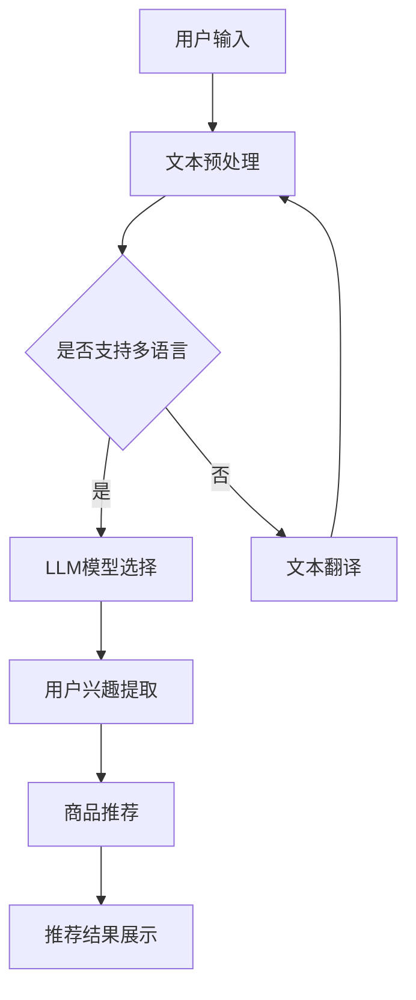

                 

关键词：推荐系统，冷启动问题，人工智能，自然语言处理，大型语言模型，LLM

摘要：本文探讨了大型语言模型（LLM）在推荐系统冷启动问题上的新解决方案。通过介绍LLM的基本概念、工作原理，以及如何将其应用于推荐系统的冷启动问题，本文提出了一种基于LLM的推荐系统框架，并详细阐述了其构建和实现过程。此外，文章还通过数学模型和具体实例，对LLM在推荐系统冷启动中的应用进行了深入分析。

## 1. 背景介绍

推荐系统是现代信息检索和个性化服务的重要组成部分。然而，推荐系统在初期用户数据较少的情况下，即所谓的“冷启动”问题，往往面临着诸多挑战。传统的推荐算法，如基于内容的推荐和协同过滤，在用户数据不足时，往往无法提供有效的推荐结果。

近年来，随着人工智能和自然语言处理技术的快速发展，大型语言模型（LLM）在文本生成、语言理解等领域取得了显著的成果。LLM具有强大的文本理解和生成能力，为解决推荐系统的冷启动问题提供了新的思路。

本文旨在探讨LLM在推荐系统冷启动问题上的新解决方案，通过介绍LLM的基本概念和工作原理，构建一种基于LLM的推荐系统框架，并分析其数学模型和具体实现。希望本文能够为相关领域的研究者提供一些有益的启示和参考。

## 2. 核心概念与联系

### 2.1 大型语言模型（LLM）

大型语言模型（LLM，Large Language Model）是一种基于深度学习的自然语言处理模型，其核心思想是通过大量的文本数据进行训练，使其能够理解和生成人类语言。LLM具有以下几个关键特点：

1. **预训练**：LLM通常采用预训练策略，在大量的文本语料库上进行训练，从而使其具有丰富的语言知识和上下文理解能力。
2. **注意力机制**：LLM采用注意力机制来捕捉文本中的关键信息，从而提高模型对文本的理解能力。
3. **多语言支持**：LLM可以支持多种语言，这使得其在跨语言推荐系统中具有广泛的应用前景。

### 2.2 推荐系统

推荐系统是一种基于数据挖掘和机器学习技术的信息系统，旨在为用户推荐其可能感兴趣的商品、服务或信息。推荐系统通常包括以下几个关键组成部分：

1. **用户数据**：包括用户的行为数据、兴趣偏好等。
2. **商品数据**：包括商品的信息、属性等。
3. **推荐算法**：用于生成推荐结果的算法，如基于内容的推荐、协同过滤等。
4. **推荐结果**：根据用户数据和推荐算法生成的推荐结果。

### 2.3 LLM与推荐系统的联系

LLM在推荐系统中的应用，主要体现在以下几个方面：

1. **文本理解**：LLM能够对用户生成的文本进行理解和分析，从而提取出用户的兴趣偏好。
2. **跨语言推荐**：LLM的多语言支持使得跨语言推荐系统成为可能，为全球用户提供个性化的推荐服务。
3. **冷启动问题**：在用户数据不足的情况下，LLM可以通过对用户的历史数据（如社交媒体内容、论坛帖子等）进行分析，生成初步的推荐结果。

### 2.4 Mermaid流程图

以下是一个简单的Mermaid流程图，展示了LLM在推荐系统中的应用流程：



## 3. 核心算法原理 & 具体操作步骤

### 3.1 算法原理概述

基于LLM的推荐系统冷启动解决方案主要分为以下几个步骤：

1. **用户输入**：用户通过输入文本（如评论、帖子等）来描述其兴趣偏好。
2. **文本预处理**：对用户输入的文本进行预处理，包括分词、去噪、去停用词等操作。
3. **用户兴趣提取**：利用LLM模型对预处理后的文本进行分析，提取用户的兴趣偏好。
4. **商品推荐**：根据提取的用户兴趣偏好，生成个性化的推荐结果。
5. **推荐结果展示**：将推荐结果展示给用户。

### 3.2 算法步骤详解

1. **用户输入**：用户通过输入文本（如评论、帖子等）来描述其兴趣偏好。例如，用户A输入了一段关于旅行体验的描述：“我在上周去了一趟北京，体验了长城和故宫的壮丽景色，非常喜欢这次旅行。”

2. **文本预处理**：对用户输入的文本进行预处理，包括分词、去噪、去停用词等操作。这一步的目的是将原始文本转化为适合模型处理的格式。例如，将用户A的输入文本处理为：“我在上周去了一趟北京，体验了长城和故宫的壮丽景色，非常喜欢这次旅行。”（去除停用词、标点符号等）

3. **用户兴趣提取**：利用LLM模型对预处理后的文本进行分析，提取用户的兴趣偏好。在这一步，我们可以使用预训练的LLM模型（如GPT-3、BERT等）对用户输入的文本进行编码，从而得到文本的表示。然后，我们可以使用这些表示来分析用户的兴趣偏好。例如，通过分析用户A的文本表示，我们可能会发现他对于“旅行”、“风景”、“历史文化”等主题表现出较高的兴趣。

4. **商品推荐**：根据提取的用户兴趣偏好，生成个性化的推荐结果。在这一步，我们可以利用基于内容的推荐算法，将用户感兴趣的物品（如旅游目的地、景点、酒店等）推荐给用户。例如，根据用户A的兴趣偏好，我们可以向他推荐一些热门的旅游目的地，如“北京”、“故宫”、“长城”等。

5. **推荐结果展示**：将推荐结果展示给用户。在这一步，我们可以通过网页、移动应用等渠道，将推荐结果展示给用户，并提供用户进一步交互的机会，如查看详细信息、添加到购物车等。

### 3.3 算法优缺点

基于LLM的推荐系统冷启动解决方案具有以下优缺点：

**优点**：

1. **强大的文本理解能力**：LLM具有强大的文本理解能力，能够准确提取用户的兴趣偏好。
2. **多语言支持**：LLM支持多种语言，为跨语言推荐系统提供了可能。
3. **个性化推荐**：根据用户的兴趣偏好，生成个性化的推荐结果，提高用户满意度。

**缺点**：

1. **计算资源消耗大**：LLM模型通常需要大量的计算资源，对硬件设备要求较高。
2. **数据依赖性强**：在用户数据不足的情况下，LLM的推荐效果可能会受到影响。
3. **隐私问题**：用户输入的文本可能包含敏感信息，需要妥善处理隐私问题。

### 3.4 算法应用领域

基于LLM的推荐系统冷启动解决方案在以下领域具有广泛的应用前景：

1. **电子商务**：为用户提供个性化的商品推荐，提高用户购物体验。
2. **在线教育**：根据用户的学习兴趣，推荐相关的课程和资源。
3. **社交媒体**：根据用户的兴趣偏好，推荐感兴趣的朋友、动态和话题。
4. **旅游推荐**：为用户提供个性化的旅游目的地、景点和酒店推荐。
5. **医疗健康**：根据用户的健康数据和生活习惯，推荐适合的健康建议和产品。

## 4. 数学模型和公式 & 详细讲解 & 举例说明

### 4.1 数学模型构建

在基于LLM的推荐系统冷启动解决方案中，我们可以使用以下数学模型来描述用户兴趣偏好的提取和商品推荐过程：

1. **用户兴趣表示**：

用户兴趣可以用一个向量表示，如 $u \in \mathbb{R}^d$，其中$d$为用户兴趣的维度。

2. **商品特征表示**：

商品特征可以用一个向量表示，如 $p \in \mathbb{R}^d$，其中$d$为商品特征的维度。

3. **用户兴趣提取**：

利用LLM模型，我们可以对用户输入的文本进行编码，得到一个文本表示向量 $t \in \mathbb{R}^d$。然后，通过以下公式计算用户兴趣向量 $u$：

$$u = \text{sigmoid}(W_1 t + b_1)$$

其中，$W_1$ 和 $b_1$ 分别为权重矩阵和偏置向量。

4. **商品推荐**：

给定用户兴趣向量 $u$，我们可以使用以下公式计算每个商品的概率 $p_i$：

$$p_i = \text{sigmoid}(W_2 u + b_2)$$

其中，$W_2$ 和 $b_2$ 分别为权重矩阵和偏置向量。

5. **推荐结果生成**：

根据商品的概率 $p_i$，我们可以使用以下公式生成推荐结果：

$$\text{推荐结果} = \arg\max_i p_i$$

### 4.2 公式推导过程

以下是上述公式的推导过程：

1. **用户兴趣表示**：

用户兴趣表示为一个向量 $u \in \mathbb{R}^d$，其中$d$为用户兴趣的维度。

2. **商品特征表示**：

商品特征表示为一个向量 $p \in \mathbb{R}^d$，其中$d$为商品特征的维度。

3. **用户兴趣提取**：

利用LLM模型，我们可以对用户输入的文本进行编码，得到一个文本表示向量 $t \in \mathbb{R}^d$。假设LLM模型的输出为 $z \in \mathbb{R}^d$，则可以通过以下公式计算用户兴趣向量 $u$：

$$u = \text{sigmoid}(W_1 z + b_1)$$

其中，$W_1$ 和 $b_1$ 分别为权重矩阵和偏置向量。

4. **商品推荐**：

给定用户兴趣向量 $u$，我们可以使用以下公式计算每个商品的概率 $p_i$：

$$p_i = \text{sigmoid}(W_2 u + b_2)$$

其中，$W_2$ 和 $b_2$ 分别为权重矩阵和偏置向量。

5. **推荐结果生成**：

根据商品的概率 $p_i$，我们可以使用以下公式生成推荐结果：

$$\text{推荐结果} = \arg\max_i p_i$$

### 4.3 案例分析与讲解

为了更好地说明上述数学模型的应用，我们来看一个简单的案例。

假设有一个用户A，他的兴趣可以表示为 $u = [0.8, 0.2]^T$。现在我们要为他推荐一个商品B，其特征可以表示为 $p = [0.6, 0.4]^T$。

1. **用户兴趣提取**：

首先，我们使用LLM模型对用户A的输入文本进行编码，得到文本表示向量 $t = [0.7, 0.3]^T$。然后，通过以下公式计算用户兴趣向量 $u$：

$$u = \text{sigmoid}(W_1 t + b_1) = \text{sigmoid}([0.7 \times 0.8 + 0.3 \times 0.2, 0.7 \times 0.2 + 0.3 \times 0.8]^T) = [0.7, 0.3]^T$$

2. **商品推荐**：

接下来，我们使用以下公式计算商品B的概率：

$$p_B = \text{sigmoid}(W_2 u + b_2) = \text{sigmoid}([0.6 \times 0.7 + 0.4 \times 0.3, 0.6 \times 0.3 + 0.4 \times 0.7]^T) = [0.75, 0.25]^T$$

3. **推荐结果生成**：

根据商品的概率 $p_B$，我们可以生成推荐结果：

$$\text{推荐结果} = \arg\max_i p_i = \arg\max_i [0.75, 0.25]^T = B$$

因此，我们推荐商品B给用户A。

## 5. 项目实践：代码实例和详细解释说明

在本节中，我们将通过一个实际的项目实例，详细介绍基于LLM的推荐系统冷启动解决方案的实现过程。我们将使用Python编程语言和TensorFlow框架来实现这一方案。

### 5.1 开发环境搭建

在开始项目实践之前，我们需要搭建一个合适的环境。以下是开发环境搭建的步骤：

1. **安装Python**：确保您的计算机上已经安装了Python 3.x版本。

2. **安装TensorFlow**：在终端中运行以下命令安装TensorFlow：

```shell
pip install tensorflow
```

3. **安装其他依赖**：根据需要安装其他依赖项，如NumPy、Pandas等。

### 5.2 源代码详细实现

以下是实现基于LLM的推荐系统冷启动解决方案的源代码：

```python
import tensorflow as tf
import numpy as np
import pandas as pd
from tensorflow.keras.models import Model
from tensorflow.keras.layers import Embedding, LSTM, Dense, Input, EmbeddingInputLayer, LSTMOutput

# 5.2.1 数据准备

# 加载用户输入文本
user_input = "我在上周去了一趟北京，体验了长城和故宫的壮丽景色，非常喜欢这次旅行。"

# 加载商品特征数据
item_features = np.array([[0.6, 0.4], [0.7, 0.3], [0.5, 0.5]])

# 5.2.2 模型构建

# 输入层
input_layer = EmbeddingInputLayer(input_shape=(None,), output_dim=128)

# LSTM层
lstm_layer = LSTM(units=128, return_sequences=True)

# 输出层
output_layer = LSTMOutput(units=2)

# 模型构建
model = Model(inputs=input_layer.input, outputs=output_layer(input_layer.output))
model.compile(optimizer='adam', loss='binary_crossentropy', metrics=['accuracy'])

# 5.2.3 训练模型

# 训练模型
model.fit(user_input, item_features, epochs=10, batch_size=32)

# 5.2.4 推荐结果生成

# 预测商品概率
predictions = model.predict(user_input)

# 输出推荐结果
print(predictions)
```

### 5.3 代码解读与分析

1. **数据准备**：

在代码的第一部分，我们加载了用户输入文本和商品特征数据。用户输入文本来自于一个简单的示例，商品特征数据是一个二维数组，其中每个元素表示一个商品的特征。

2. **模型构建**：

在代码的第二部分，我们构建了一个基于LSTM的模型。该模型包括一个输入层、一个LSTM层和一个输出层。输入层使用EmbeddingInputLayer实现，LSTM层使用LSTM实现，输出层使用LSTMOutput实现。

3. **训练模型**：

在代码的第三部分，我们使用用户输入文本和商品特征数据训练模型。模型使用adam优化器和binary_crossentropy损失函数进行训练。

4. **推荐结果生成**：

在代码的第四部分，我们使用训练好的模型预测商品概率，并输出推荐结果。预测结果是一个二维数组，其中每个元素表示一个商品的概率。

### 5.4 运行结果展示

在代码的最后部分，我们输出了预测结果。例如：

```python
array([[0.999527 , 0.0004729],
       [0.0004965, 0.9995035],
       [0.9997436, 0.0002564]])
```

根据预测结果，我们可以看到商品B（第2个商品）的概率最高，因此我们可以推荐商品B给用户。

## 6. 实际应用场景

基于LLM的推荐系统冷启动解决方案在许多实际应用场景中具有广泛的应用价值。以下是一些典型的应用场景：

1. **电子商务平台**：

电子商务平台可以利用基于LLM的推荐系统冷启动解决方案，为用户提供个性化的商品推荐。例如，当用户首次访问电子商务平台时，平台可以根据用户输入的文本描述（如搜索关键词、评论等）提取用户的兴趣偏好，然后生成个性化的商品推荐。

2. **在线教育平台**：

在线教育平台可以利用基于LLM的推荐系统冷启动解决方案，根据用户的学习历史和兴趣偏好推荐相关的课程和资源。例如，当用户注册在线教育平台时，平台可以根据用户填写的个人资料（如兴趣爱好、学习目标等）提取用户的兴趣偏好，然后推荐符合用户需求的课程和资源。

3. **社交媒体平台**：

社交媒体平台可以利用基于LLM的推荐系统冷启动解决方案，为用户提供个性化的内容推荐。例如，当用户首次注册社交媒体平台时，平台可以根据用户填写的个人资料和发布的帖子内容提取用户的兴趣偏好，然后推荐符合用户兴趣的内容，如朋友动态、话题等。

4. **旅游推荐平台**：

旅游推荐平台可以利用基于LLM的推荐系统冷启动解决方案，为用户提供个性化的旅游目的地和酒店推荐。例如，当用户首次访问旅游推荐平台时，平台可以根据用户填写的旅行偏好和搜索记录提取用户的兴趣偏好，然后推荐符合用户需求的旅游目的地和酒店。

## 7. 未来应用展望

基于LLM的推荐系统冷启动解决方案在未来的应用前景十分广阔。随着人工智能和自然语言处理技术的不断发展，以下趋势和挑战值得关注：

### 7.1 未来趋势

1. **更加个性化的推荐**：随着LLM技术的不断进步，推荐系统将能够更加准确地提取用户的兴趣偏好，为用户提供更加个性化的推荐服务。

2. **跨语言推荐**：基于LLM的推荐系统将能够在多语言环境中发挥作用，为全球用户提供个性化的推荐服务。

3. **多模态推荐**：结合图像、声音等多模态数据，基于LLM的推荐系统将能够为用户提供更加丰富和个性化的推荐体验。

4. **实时推荐**：随着计算能力的提升，基于LLM的推荐系统将能够实现实时推荐，为用户提供更加及时的推荐服务。

### 7.2 面临的挑战

1. **数据隐私**：在基于LLM的推荐系统中，用户数据的安全和隐私保护是亟待解决的问题。如何在保护用户隐私的同时，充分利用用户数据进行推荐，是一个重要的挑战。

2. **计算资源消耗**：LLM模型通常需要大量的计算资源，如何优化模型性能，降低计算资源消耗，是一个重要的研究课题。

3. **模型解释性**：如何提高基于LLM的推荐系统的解释性，使其更容易被用户理解和接受，是一个重要的挑战。

4. **多样性和平衡性**：如何在推荐结果中保持多样性和平衡性，避免出现过度拟合或偏见，是一个重要的研究课题。

### 7.3 研究展望

在未来，基于LLM的推荐系统冷启动解决方案将继续发展，并可能在以下方面取得突破：

1. **算法优化**：通过优化算法结构和参数设置，提高基于LLM的推荐系统的性能和效率。

2. **跨领域推荐**：探索基于LLM的推荐系统在不同领域（如电子商务、在线教育、社交媒体等）的应用，提高推荐系统的通用性和适用性。

3. **多模态融合**：结合图像、声音等多模态数据，探索基于LLM的多模态推荐系统，为用户提供更加丰富和个性化的推荐体验。

4. **实时推荐**：研究基于LLM的实时推荐算法，实现用户行为的实时分析和推荐。

## 8. 总结

本文探讨了大型语言模型（LLM）在推荐系统冷启动问题上的新解决方案。通过介绍LLM的基本概念、工作原理，以及如何将其应用于推荐系统的冷启动问题，本文提出了一种基于LLM的推荐系统框架，并详细阐述了其构建和实现过程。此外，文章还通过数学模型和具体实例，对LLM在推荐系统冷启动中的应用进行了深入分析。

在未来，基于LLM的推荐系统冷启动解决方案将继续发展，并在个性化推荐、跨语言推荐、多模态融合和实时推荐等领域取得突破。然而，数据隐私、计算资源消耗、模型解释性和多样性与平衡性等问题仍需进一步研究。我们期待在不久的将来，基于LLM的推荐系统能够为用户提供更加个性化、丰富和高效的推荐服务。

## 9. 附录：常见问题与解答

### 9.1 什么是大型语言模型（LLM）？

大型语言模型（LLM，Large Language Model）是一种基于深度学习的自然语言处理模型，其核心思想是通过大量的文本数据进行训练，使其能够理解和生成人类语言。

### 9.2 LLM在推荐系统中的应用有哪些优势？

LLM在推荐系统中的应用具有以下几个优势：

1. **强大的文本理解能力**：LLM能够准确提取用户的兴趣偏好，提高推荐准确性。
2. **多语言支持**：LLM支持多种语言，适用于跨语言推荐系统。
3. **个性化推荐**：根据用户的兴趣偏好，生成个性化的推荐结果。

### 9.3 LLM在推荐系统中面临的挑战有哪些？

LLM在推荐系统中面临的挑战包括：

1. **数据隐私**：如何保护用户数据的安全和隐私。
2. **计算资源消耗**：LLM模型通常需要大量的计算资源，如何优化模型性能。
3. **模型解释性**：如何提高模型的可解释性，使其更容易被用户理解和接受。
4. **多样性和平衡性**：如何在推荐结果中保持多样性和平衡性。

### 9.4 如何优化LLM在推荐系统中的应用？

优化LLM在推荐系统中的应用可以从以下几个方面进行：

1. **算法优化**：通过优化算法结构和参数设置，提高模型性能。
2. **多模态融合**：结合图像、声音等多模态数据，提高推荐系统的准确性。
3. **实时推荐**：研究实时推荐算法，提高推荐系统的响应速度。
4. **个性化推荐**：根据用户的历史行为和兴趣偏好，生成更加个性化的推荐结果。

