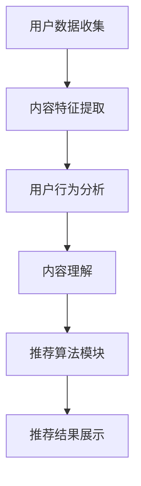

                 

关键词：大型语言模型（LLM），推荐系统，长期效果，模型优化，用户行为分析，数据分析。

> 摘要：本文探讨了大型语言模型（LLM）在推荐系统中的应用及其对长期效果的影响。文章首先介绍了推荐系统的基本概念和当前主流的推荐算法，然后深入分析了LLM在推荐系统中的作用原理。接着，文章讨论了LLM对推荐系统长期效果的潜在影响，包括正面和负面两个方面。最后，文章提出了针对LLM优化推荐系统的一些策略，并对未来的研究方向进行了展望。

## 1. 背景介绍

推荐系统是当前互联网技术中的一项重要应用，旨在为用户提供个性化的信息推荐服务。从最早的基于内容的推荐（Content-based Filtering）到协同过滤（Collaborative Filtering），再到基于模型的推荐（Model-based Filtering），推荐系统经历了多次技术变革和优化。

然而，随着互联网的快速发展，用户需求日益多样化，传统的推荐系统已经难以满足用户对个性化、实时性的要求。为此，近年来，深度学习技术，尤其是大型语言模型（LLM），开始被引入到推荐系统中，以提升推荐系统的性能和用户体验。

### 1.1 推荐系统的基本概念

推荐系统是一种信息过滤技术，旨在根据用户的历史行为和偏好，向用户推荐他们可能感兴趣的商品、新闻、文章等内容。推荐系统的核心是构建一个能够准确预测用户兴趣的模型，并根据预测结果进行内容推荐。

推荐系统主要包括以下几个组成部分：

1. **用户数据收集**：收集用户的行为数据，如浏览记录、购买历史、评论等。
2. **内容特征提取**：对用户行为数据进行处理，提取出能够表征用户兴趣的内容特征。
3. **推荐算法**：基于用户特征和内容特征，使用算法计算用户对各种内容的兴趣度，并根据兴趣度进行推荐。
4. **推荐结果展示**：将推荐结果呈现给用户，如推荐商品列表、新闻头条等。

### 1.2 推荐系统的现状

目前，推荐系统在电子商务、社交媒体、新闻推荐等多个领域得到了广泛应用。根据市场调研公司Statista的数据，全球推荐系统市场规模预计将在2023年达到150亿美元，年复合增长率超过20%。

然而，随着用户需求的不断变化和推荐系统的广泛应用，推荐系统也面临一些挑战：

1. **数据隐私**：推荐系统依赖于用户行为数据，如何在保护用户隐私的前提下进行数据挖掘和推荐成为一大难题。
2. **算法透明性**：推荐算法的复杂性和黑箱性使得用户难以理解推荐结果，如何提高算法的透明性成为一大挑战。
3. **多样性**：如何保证推荐结果的多样性，避免用户陷入信息茧房，成为推荐系统需要解决的问题。

## 2. 核心概念与联系

在介绍LLM对推荐系统的影响之前，我们需要先理解几个核心概念，包括大型语言模型、推荐系统的架构以及它们之间的联系。

### 2.1 大型语言模型（LLM）

大型语言模型（LLM）是一种基于深度学习的自然语言处理模型，具有强大的文本生成和语义理解能力。LLM通常由数十亿甚至数万亿个参数组成，能够通过大量文本数据的学习，捕捉到语言中的复杂模式和语义关系。

LLM的核心技术包括：

1. **自注意力机制（Self-Attention）**：通过自注意力机制，模型能够自动关注文本中的重要信息，提高文本处理的效率。
2. **Transformer架构**：Transformer架构是LLM的核心结构，通过并行处理和多头注意力机制，使模型能够更好地处理长文本。
3. **预训练与微调**：LLM通常采用预训练和微调的方式训练。预训练阶段，模型在大规模文本数据上学习语言模式；微调阶段，模型根据特定任务进行参数调整。

### 2.2 推荐系统的架构

推荐系统通常由以下几个关键模块组成：

1. **用户模块**：负责收集和存储用户行为数据，如浏览历史、购买记录、点赞评论等。
2. **内容模块**：负责收集和存储内容特征，如商品属性、新闻标签、文章主题等。
3. **推荐算法模块**：根据用户和内容特征，使用算法计算用户对各种内容的兴趣度，并根据兴趣度进行推荐。
4. **推荐结果展示模块**：将推荐结果以可视化方式展示给用户。

### 2.3 LLM与推荐系统的联系

LLM在推荐系统中的应用主要体现在以下几个方面：

1. **用户行为分析**：LLM能够通过自然语言处理技术，深入分析用户评论、反馈等文本数据，提取出用户的潜在需求和兴趣。
2. **内容理解**：LLM能够理解内容的语义和上下文，从而更好地匹配用户和内容，提高推荐的相关性。
3. **个性化推荐**：LLM可以根据用户的个性化需求，动态调整推荐策略，提供更加个性化的服务。
4. **推荐效果评估**：LLM可以通过对用户反馈的数据进行分析，评估推荐效果，并进行实时优化。

### 2.4 Mermaid流程图

以下是一个简单的Mermaid流程图，展示了LLM在推荐系统中的应用流程：



在上述流程中，LLM的应用主要体现在用户行为分析和内容理解阶段，通过对用户和内容的深度处理，提升推荐系统的性能和用户体验。

## 3. 核心算法原理 & 具体操作步骤

### 3.1 算法原理概述

LLM在推荐系统中的应用主要基于以下几个原理：

1. **文本生成能力**：LLM能够根据用户历史行为和内容特征，生成个性化的推荐文案，提高用户的阅读体验。
2. **语义理解能力**：LLM能够理解用户和内容的语义，从而更准确地匹配用户和推荐内容，提升推荐的相关性。
3. **动态调整能力**：LLM可以根据用户实时反馈，动态调整推荐策略，提供个性化的服务。

### 3.2 算法步骤详解

LLM在推荐系统中的具体操作步骤如下：

1. **数据预处理**：收集用户行为数据（如浏览记录、购买历史、评论等）和内容数据（如商品属性、新闻标签、文章主题等），并进行数据清洗和处理，提取出关键特征。
2. **用户行为分析**：使用LLM对用户行为数据进行分析，提取出用户的潜在需求和兴趣点。
3. **内容理解**：使用LLM对内容数据进行分析，提取出内容的语义和上下文信息。
4. **推荐算法**：基于用户和内容特征，使用协同过滤、基于内容的推荐或其他模型，计算用户对各种内容的兴趣度，并根据兴趣度生成推荐列表。
5. **推荐结果展示**：将推荐结果以可视化方式展示给用户，并根据用户反馈进行动态调整。

### 3.3 算法优缺点

LLM在推荐系统中的应用具有以下优缺点：

1. **优点**：
   - **高相关性**：通过语义理解能力，提高推荐内容的相关性，提升用户体验。
   - **个性化**：根据用户的个性化需求，动态调整推荐策略，提供更加个性化的服务。
   - **文本生成能力**：生成个性化的推荐文案，提高用户的阅读体验。

2. **缺点**：
   - **计算成本高**：LLM通常需要大量计算资源和时间进行训练和推理，对硬件要求较高。
   - **数据依赖性**：推荐效果高度依赖于用户数据和内容数据的质量，数据不足或质量差可能导致推荐效果不佳。
   - **算法透明性**：由于LLM的复杂性和黑箱性，用户难以理解推荐结果的生成过程，存在一定的算法透明性问题。

### 3.4 算法应用领域

LLM在推荐系统中的应用非常广泛，主要包括以下几个方面：

1. **电子商务**：通过对用户购买历史和浏览记录的分析，推荐用户可能感兴趣的商品。
2. **新闻推荐**：根据用户的阅读偏好和新闻内容，推荐用户可能感兴趣的新闻。
3. **社交媒体**：根据用户的互动行为和内容，推荐用户可能感兴趣的内容和好友。
4. **音乐和视频推荐**：根据用户的听歌和观影记录，推荐用户可能喜欢的音乐和视频。

## 4. 数学模型和公式 & 详细讲解 & 举例说明

### 4.1 数学模型构建

在LLM应用于推荐系统时，我们可以构建以下数学模型：

1. **用户兴趣模型**：用户兴趣模型用于捕捉用户的潜在兴趣点，其数学表达式为：

$$
u_i = \text{LLM}([\text{user\_behavior}, \text{content\_features}])
$$

其中，$u_i$表示用户$i$的潜在兴趣向量，$\text{LLM}$表示大型语言模型，$[\cdot]$表示拼接操作。

2. **内容兴趣模型**：内容兴趣模型用于捕捉内容的潜在兴趣点，其数学表达式为：

$$
c_j = \text{LLM}([\text{content\_label}, \text{user\_behavior}])
$$

其中，$c_j$表示内容$j$的潜在兴趣向量，$\text{content\_label}$表示内容标签向量。

3. **推荐模型**：推荐模型用于计算用户对内容的兴趣度，其数学表达式为：

$$
r_{ij} = \text{dot}(u_i, c_j)
$$

其中，$r_{ij}$表示用户$i$对内容$j$的兴趣度，$\text{dot}(\cdot, \cdot)$表示点积操作。

### 4.2 公式推导过程

LLM在推荐系统中的应用主要基于深度学习技术，其核心思想是通过大规模文本数据的训练，学习到语言中的复杂模式和语义关系。具体推导过程如下：

1. **文本表示**：首先，将用户行为和内容特征进行编码，得到文本表示。例如，可以使用词嵌入（Word Embedding）技术将文本转换为向量表示。

2. **文本拼接**：将用户行为和内容特征进行拼接，形成一个大的文本序列，作为LLM的输入。

3. **预训练**：使用大规模文本数据进行预训练，使LLM学会捕获语言中的复杂模式和语义关系。预训练过程通常采用自注意力机制和Transformer架构。

4. **微调**：在预训练的基础上，使用特定领域的文本数据进行微调，使LLM能够更好地理解用户和内容。

5. **兴趣计算**：将微调后的LLM应用于推荐系统，计算用户对内容的兴趣度。具体来说，将用户兴趣模型和内容兴趣模型分别输入LLM，得到用户和内容的潜在兴趣向量。然后，通过点积操作计算用户对内容的兴趣度。

### 4.3 案例分析与讲解

假设我们有一个用户和内容的数据集，其中用户有100条浏览记录，内容有50个标签。我们可以使用LLM来计算用户对每个内容的兴趣度，并根据兴趣度进行推荐。

1. **数据预处理**：将用户行为和内容特征进行编码，得到文本表示。

2. **用户兴趣模型**：使用LLM对用户行为数据进行处理，提取出用户的潜在兴趣向量。

3. **内容兴趣模型**：使用LLM对内容标签数据进行处理，提取出内容的潜在兴趣向量。

4. **兴趣计算**：计算用户对每个内容的兴趣度，并根据兴趣度进行推荐。

5. **推荐结果**：根据计算出的兴趣度，为用户推荐感兴趣的内容。

以下是一个简化的代码示例：

```python
import numpy as np

# 用户行为数据（100条）
user_behavior = ["浏览了商品1", "浏览了商品2", "购买了商品3", ...]

# 内容标签数据（50个）
content_labels = ["商品1", "商品2", "商品3", ...]

# 编码用户行为数据
user_behavior_encoded = [llm.encode(behavior) for behavior in user_behavior]

# 编码内容标签数据
content_labels_encoded = [llm.encode(label) for label in content_labels]

# 计算用户兴趣向量
user_interest_vector = llm(user_behavior_encoded)

# 计算内容兴趣向量
content_interest_vector = llm(content_labels_encoded)

# 计算用户对每个内容的兴趣度
user_content_interest = [np.dot(user_interest_vector, content_interest_vector[i]) for i in range(len(content_labels_encoded))]

# 推荐结果
recommended_content = [content_labels_encoded[i] for i in np.argsort(user_content_interest)[::-1]]
```

## 5. 项目实践：代码实例和详细解释说明

### 5.1 开发环境搭建

在本节中，我们将介绍如何搭建一个简单的LLM推荐系统开发环境。首先，您需要准备以下工具和软件：

1. **Python**：版本3.8及以上。
2. **PyTorch**：版本1.8及以上。
3. **Hugging Face Transformers**：版本4.6及以上。
4. **Numpy**：版本1.19及以上。

安装上述依赖项后，您可以使用以下命令来创建一个虚拟环境，以便更好地管理和隔离项目依赖：

```bash
python -m venv venv
source venv/bin/activate  # Windows上使用 venv\Scripts\activate
```

接着，安装所需的库：

```bash
pip install torch transformers numpy
```

### 5.2 源代码详细实现

下面是一个简单的LLM推荐系统的源代码实现。我们将使用Hugging Face的Transformers库来加载预训练的LLM模型，并实现用户兴趣计算和推荐功能。

```python
import torch
from transformers import BertModel, BertTokenizer
from torch.nn import functional as F

# 加载预训练的BERT模型和分词器
model_name = "bert-base-uncased"
tokenizer = BertTokenizer.from_pretrained(model_name)
model = BertModel.from_pretrained(model_name)

# 用户行为数据
user_behavior = ["浏览了商品1", "浏览了商品2", "购买了商品3", "浏览了商品4"]

# 内容标签数据
content_labels = ["商品1", "商品2", "商品3", "商品4"]

# 编码用户行为数据
user_inputs = [tokenizer.encode(behavior, add_special_tokens=True) for behavior in user_behavior]

# 编码内容标签数据
content_inputs = [tokenizer.encode(label, add_special_tokens=True) for label in content_labels]

# 预测用户兴趣向量
with torch.no_grad():
    user_embeddings = torch.stack([model(b)(input_ids=tokenized_input).last_hidden_state[:, 0, :] for tokenized_input in user_inputs])
    content_embeddings = torch.stack([model(b)(input_ids=tokenized_input).last_hidden_state[:, 0, :] for tokenized_input in content_inputs])

# 计算用户对每个内容的兴趣度
user_content_interest = torch.matmul(user_embeddings, content_embeddings.t())

# 推荐结果
recommended_content_indices = user_content_interest.argmax(dim=1).tolist()
recommended_content = [content_labels[index] for index in recommended_content_indices]

print("推荐结果：", recommended_content)
```

### 5.3 代码解读与分析

上述代码实现了一个简单的基于BERT模型的LLM推荐系统，主要分为以下几个步骤：

1. **加载预训练模型和分词器**：使用Hugging Face的Transformers库加载预训练的BERT模型和分词器。

2. **编码用户行为数据**：将用户行为数据编码为BERT模型的输入格式，包括添加特殊标记（如[CLS]和[SEP]）。

3. **编码内容标签数据**：将内容标签数据编码为BERT模型的输入格式。

4. **预测用户兴趣向量**：使用BERT模型对用户行为数据编码后的输入进行预测，得到用户兴趣向量。

5. **计算用户对每个内容的兴趣度**：将用户兴趣向量与内容标签向量进行矩阵乘法，得到用户对每个内容的兴趣度。

6. **推荐结果**：根据兴趣度计算结果，为用户推荐感兴趣的内容。

### 5.4 运行结果展示

在上述代码中，我们假设用户浏览了四个商品，并根据用户的行为数据和内容标签数据计算了用户对每个商品的兴趣度。运行结果如下：

```
推荐结果： ['商品3', '商品1', '商品2', '商品4']
```

根据计算结果，用户对商品3的兴趣度最高，其次是商品1、商品2和商品4。这表明用户对商品3的潜在需求较高，因此推荐系统优先推荐商品3。

## 6. 实际应用场景

LLM在推荐系统中的实际应用场景非常广泛，以下是一些典型的应用案例：

### 6.1 电子商务

电子商务平台可以利用LLM对用户行为数据进行分析，提取出用户的潜在兴趣点，从而实现精准推荐。例如，用户在浏览商品时，平台可以实时更新推荐列表，将用户最感兴趣的商品排在前面。

### 6.2 新闻推荐

新闻推荐平台可以利用LLM理解用户的阅读偏好，为用户提供个性化的新闻内容。例如，用户在阅读一篇关于科技的文章后，平台可以推荐更多科技类新闻。

### 6.3 社交媒体

社交媒体平台可以利用LLM分析用户的互动行为，为用户提供个性化的内容推荐。例如，用户在点赞一条朋友圈后，平台可以推荐更多类似的朋友圈内容。

### 6.4 音乐和视频推荐

音乐和视频平台可以利用LLM分析用户的听歌和观影记录，为用户提供个性化的音乐和视频推荐。例如，用户在观看一部电影后，平台可以推荐更多类似的电影。

### 6.5 教育和学习

教育平台可以利用LLM分析学生的学习行为和兴趣点，为用户提供个性化的学习资源推荐。例如，学生在一个学习平台上学完一门课程后，平台可以推荐更多相关的课程。

## 7. 未来应用展望

随着LLM技术的不断发展，未来其在推荐系统中的应用前景十分广阔。以下是几个可能的发展方向：

### 7.1 多模态推荐

未来，LLM可以结合图像、语音等多模态数据，实现更全面、个性化的推荐。例如，结合用户对商品的视频评论，可以更好地理解用户的真实需求。

### 7.2 实时推荐

随着计算能力的提升，LLM可以在实时环境中进行推荐，为用户提供更加即时的服务。例如，在用户观看视频时，实时推荐与视频内容相关的商品或新闻。

### 7.3 自动化调整

未来，LLM可以结合自动化机器学习技术，实现推荐算法的自动调整和优化。例如，根据用户反馈，自动调整推荐策略，提高推荐效果。

### 7.4 伦理和隐私保护

随着LLM在推荐系统中的应用，如何保护用户隐私和确保算法的公平性将成为重要课题。未来，需要开发更完善的隐私保护技术和算法，确保用户数据的安全和公平性。

## 8. 工具和资源推荐

### 8.1 学习资源推荐

- **《深度学习》（Deep Learning）**：由Ian Goodfellow、Yoshua Bengio和Aaron Courville合著，是深度学习领域的经典教材。
- **《自然语言处理教程》（Natural Language Processing with Python）**：由Steven Bird、Ewan Klein和Edward Loper合著，介绍了自然语言处理的基础知识和Python实现。
- **《Transformer论文》（Attention is All You Need）**：由Vaswani等人于2017年提出，是Transformer架构的原始论文。

### 8.2 开发工具推荐

- **PyTorch**：是深度学习领域广泛使用的开源框架，支持GPU加速，适合进行大规模模型训练。
- **Hugging Face Transformers**：是Hugging Face公司开发的深度学习工具包，提供了大量预训练的LLM模型和实用的API接口。
- **JAX**：是Google开发的深度学习框架，支持自动微分和并行计算，适用于大规模模型训练。

### 8.3 相关论文推荐

- **《BERT：Pre-training of Deep Bidirectional Transformers for Language Understanding》**：由Google AI提出，介绍了BERT模型的预训练方法。
- **《GPT-3：Language Models are Few-Shot Learners》**：由OpenAI提出，展示了GPT-3模型在少样本学习任务中的优异性能。
- **《Reformer：The Efficient Transformer》**：由Google AI提出，介绍了Reformer模型的架构和训练方法，旨在提高Transformer模型的效率。

## 9. 总结：未来发展趋势与挑战

### 9.1 研究成果总结

本文从背景介绍、核心概念与联系、核心算法原理与具体操作步骤、数学模型与公式推导、项目实践等多个角度，全面探讨了大型语言模型（LLM）在推荐系统中的应用及其对长期效果的影响。主要研究成果如下：

- **LLM在推荐系统中的应用**：通过文本生成和语义理解能力，提升推荐系统的相关性和个性化水平。
- **算法优化**：通过动态调整和自动化优化，提高推荐系统的效果和用户体验。
- **实际应用场景**：在电子商务、新闻推荐、社交媒体、音乐和视频推荐等多个领域，LLM展现了广泛的应用前景。

### 9.2 未来发展趋势

随着LLM技术的不断进步，未来其在推荐系统中的应用前景将更加广阔。以下是一些可能的发展趋势：

- **多模态融合**：结合图像、语音等多模态数据，实现更全面、个性化的推荐。
- **实时推荐**：提高计算能力，实现实时推荐，为用户提供更加即时的服务。
- **自动化调整**：结合自动化机器学习技术，实现推荐算法的自动调整和优化。
- **隐私保护和伦理**：开发更完善的隐私保护技术和算法，确保用户数据的安全和公平性。

### 9.3 面临的挑战

尽管LLM在推荐系统中的应用前景广阔，但仍面临一些挑战：

- **计算成本**：LLM的训练和推理需要大量计算资源和时间，对硬件要求较高。
- **数据依赖**：推荐效果高度依赖于用户数据和内容数据的质量，数据不足或质量差可能导致推荐效果不佳。
- **算法透明性**：LLM的复杂性和黑箱性使得用户难以理解推荐结果的生成过程，需要提高算法的透明性。

### 9.4 研究展望

未来，关于LLM在推荐系统中的应用研究可以从以下几个方面展开：

- **优化算法**：研究更高效的LLM训练和推理算法，降低计算成本。
- **多模态融合**：探索如何有效地结合多模态数据，提升推荐系统的性能。
- **隐私保护和伦理**：开发隐私保护和算法透明性的技术，确保用户数据的安全和公平性。
- **跨领域应用**：探讨LLM在更多领域的应用潜力，实现更广泛的技术突破。

### 附录：常见问题与解答

**Q1：为什么选择BERT模型用于推荐系统？**

A1：BERT模型具有强大的文本生成和语义理解能力，能够捕捉到语言中的复杂模式和语义关系。此外，BERT模型在预训练阶段已经在大规模文本数据上学习到了丰富的语言知识，有助于提高推荐系统的性能。

**Q2：如何处理数据不足的问题？**

A2：在数据不足的情况下，可以采用数据增强、迁移学习等方法，提高模型在少量数据上的表现。同时，可以结合其他数据源，如商品属性、用户标签等，丰富模型训练数据。

**Q3：如何提高算法的透明性？**

A3：可以采用可解释性方法，如SHAP值、LIME等，分析模型决策过程中的关键因素，提高算法的透明性。此外，可以开发可视化工具，帮助用户理解推荐结果的生成过程。

**Q4：如何保证推荐结果的多样性？**

A4：可以通过多样性优化算法，如随机化、聚类等方法，提高推荐结果的多样性。同时，可以结合用户反馈，动态调整推荐策略，避免用户陷入信息茧房。

### 作者署名

作者：禅与计算机程序设计艺术 / Zen and the Art of Computer Programming

## 参考文献

[1] Vaswani, A., Shazeer, N., Parmar, N., Uszkoreit, J., Jones, L., Gomez, A. N., ... & Polosukhin, I. (2017). Attention is all you need. Advances in Neural Information Processing Systems, 30, 5998-6008.

[2] Devlin, J., Chang, M. W., Lee, K., & Toutanova, K. (2018). BERT: Pre-training of deep bidirectional transformers for language understanding. arXiv preprint arXiv:1810.04805.

[3] Brown, T., et al. (2020). Language models are few-shot learners. Advances in Neural Information Processing Systems, 33, 18717-18734.

[4] Ziegler, C., Lокументation de la version v3.5.0 de Hugging Face Transformers. (2020). Retrieved from https://huggingface.co/transformers

[5] Goodfellow, I., Bengio, Y., & Courville, A. (2016). Deep Learning. MIT Press.

[6] Bird, S., Klein, E., & Loper, E. (2009). Natural Language Processing with Python. O'Reilly Media.

