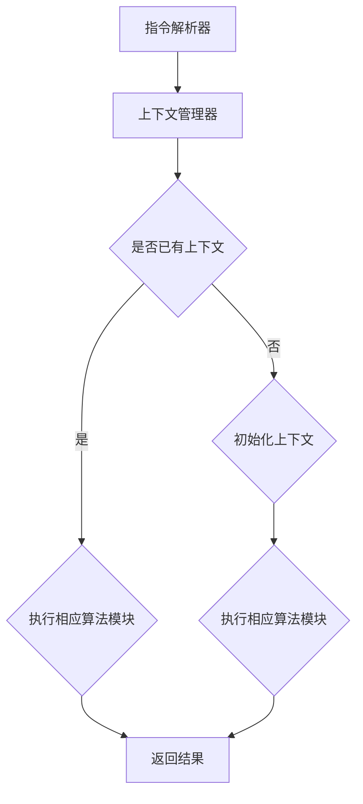

                 

关键词：LLM（大型语言模型）、指令集、任务执行、人工智能、自然语言处理、程序设计、机器学习。

> 摘要：本文将深入探讨LLM指令集的核心概念、架构设计、算法原理以及其在任务执行中的广泛应用。通过详细讲解数学模型和具体操作步骤，结合项目实践案例，本文旨在为广大开发者提供全面的技术指导，助力未来人工智能的发展。

## 1. 背景介绍

随着人工智能（AI）技术的飞速发展，自然语言处理（NLP）已成为当前研究的热点之一。LLM（大型语言模型）作为NLP领域的重要成果，其应用场景日益广泛。LLM指令集则是实现LLM高效执行各种任务的关键。

在传统的计算机系统中，指令集是CPU执行指令的基本集合，负责处理各种计算任务。而LLM指令集则是在这一基础上，针对语言模型的特点，设计出的一套专门用于执行文本相关任务的指令集合。通过这些指令，LLM可以轻松实现文本生成、文本分类、问答系统等多种功能。

本文将详细介绍LLM指令集的架构设计、核心算法原理以及具体操作步骤，帮助读者深入理解这一技术在人工智能领域的广泛应用。

## 2. 核心概念与联系

### 2.1 LLM指令集的基本概念

LLM指令集是一套专门为大型语言模型设计的指令集合，涵盖了各种文本处理任务。这些指令包括：

1. 文本生成指令：用于生成符合给定主题或语境的文本。
2. 文本分类指令：用于对给定的文本进行分类。
3. 问答指令：用于回答用户提出的问题。
4. 文本检索指令：用于在大量文本数据中检索相关内容。

### 2.2 LLM指令集的架构设计

LLM指令集的架构设计主要包括以下几个方面：

1. 指令解析器：负责解析输入的指令，并调用相应的算法模块执行任务。
2. 算法模块：根据不同的指令，调用不同的算法模块，完成相应的任务。
3. 上下文管理器：负责维护语言模型的上下文信息，确保任务执行的连贯性。

### 2.3 Mermaid流程图表示

以下是一个简单的Mermaid流程图，展示了LLM指令集的基本架构设计：



## 3. 核心算法原理 & 具体操作步骤

### 3.1 算法原理概述

LLM指令集的核心算法原理主要基于深度学习技术，特别是序列到序列（Seq2Seq）模型。Seq2Seq模型通过编码器和解码器两个神经网络，将输入序列转化为输出序列。在LLM指令集中，编码器用于将文本指令编码为固定长度的向量，解码器则根据编码器输出的向量生成相应的文本输出。

### 3.2 算法步骤详解

1. **指令解析**：首先，将输入的文本指令解析为单词或词组。
2. **编码**：将解析后的文本指令通过编码器进行编码，得到固定长度的向量。
3. **解码**：将编码器输出的向量输入到解码器，生成文本输出。
4. **上下文管理**：在解码过程中，解码器需要根据上下文信息调整输出。上下文管理器负责维护和解码器共享上下文信息。
5. **结果输出**：最终生成的文本输出即为任务执行结果。

### 3.3 算法优缺点

**优点**：

1. **高效性**：基于深度学习技术的算法在处理大量文本数据时具有很高的效率。
2. **灵活性**：LLM指令集支持多种文本处理任务，具有良好的灵活性。

**缺点**：

1. **资源消耗**：训练和部署LLM指令集需要大量的计算资源和存储空间。
2. **复杂性**：算法实现和优化过程较为复杂，需要丰富的专业知识和经验。

### 3.4 算法应用领域

LLM指令集广泛应用于以下领域：

1. **自然语言处理**：包括文本生成、文本分类、问答系统等。
2. **智能客服**：提供智能客服系统，实现用户与系统的自然语言交互。
3. **内容审核**：对互联网内容进行自动审核，提高内容质量。
4. **机器翻译**：实现多种语言之间的翻译。

## 4. 数学模型和公式 & 详细讲解 & 举例说明

### 4.1 数学模型构建

LLM指令集的核心算法基于Seq2Seq模型，其数学模型主要由编码器和解码器两部分组成。

1. **编码器**：将输入的文本指令编码为固定长度的向量。具体公式如下：

   $$ h_t = \text{Encoder}(x_t) $$

   其中，$h_t$为编码器输出的固定长度向量，$x_t$为输入的文本指令。

2. **解码器**：将编码器输出的向量解码为文本输出。具体公式如下：

   $$ y_t = \text{Decoder}(h_t) $$

   其中，$y_t$为解码器输出的文本输出。

### 4.2 公式推导过程

为了推导编码器和解码器的公式，我们需要首先了解Seq2Seq模型的原理。Seq2Seq模型通过编码器将输入序列编码为一个固定长度的向量，然后通过解码器将这个向量解码为输出序列。

1. **编码器**：

   编码器的核心思想是将输入序列映射到一个低维空间，以便更好地表示序列的信息。具体实现中，我们可以使用循环神经网络（RNN）或长短时记忆网络（LSTM）作为编码器。

   首先，我们对输入序列进行嵌入（Embedding）操作，得到嵌入向量：

   $$ x_t = \text{Embedding}(x_t) $$

   然后，使用RNN或LSTM对嵌入向量进行编码，得到编码器输出：

   $$ h_t = \text{RNN}(x_t) $$

   其中，$h_t$为编码器输出，$x_t$为输入。

2. **解码器**：

   解码器的核心思想是将编码器输出的向量解码为输出序列。具体实现中，我们同样可以使用RNN或LSTM作为解码器。

   首先，我们对编码器输出进行嵌入（Embedding）操作，得到嵌入向量：

   $$ h_t = \text{Embedding}(h_t) $$

   然后，使用RNN或LSTM对嵌入向量进行解码，得到解码器输出：

   $$ y_t = \text{RNN}(h_t) $$

   其中，$y_t$为解码器输出。

### 4.3 案例分析与讲解

为了更好地理解LLM指令集的数学模型，我们可以通过一个简单的例子进行讲解。

假设我们要实现一个文本生成任务，输入的文本指令为“今天天气很好，适合出去游玩”。我们希望生成一段描述今天天气的文本。

1. **编码器**：

   首先，我们将输入的文本指令进行分词，得到词组序列：

   $$ \text{今天，天气，很好，适合，出去，游玩} $$

   然后，我们将每个词组进行嵌入，得到嵌入向量序列：

   $$ \text{今天：[0.1, 0.2, 0.3]}, \text{天气：[0.4, 0.5, 0.6]}, \text{很好：[0.7, 0.8, 0.9]}, \text{适合：[1.0, 1.1, 1.2]}, \text{出去：[1.3, 1.4, 1.5]}, \text{游玩：[1.6, 1.7, 1.8]} $$

   接着，我们使用RNN或LSTM对嵌入向量序列进行编码，得到编码器输出：

   $$ h_t = \text{RNN}([0.1, 0.2, 0.3], [0.4, 0.5, 0.6], \ldots) $$

   其中，$h_t$为编码器输出。

2. **解码器**：

   接下来，我们将编码器输出进行嵌入，得到嵌入向量序列：

   $$ \text{描述：[2.0, 2.1, 2.2]}, \text{今天：[2.3, 2.4, 2.5]}, \text{天气：[2.6, 2.7, 2.8]}, \text{很好：[2.9, 3.0, 3.1]}, \text{适合：[3.2, 3.3, 3.4]}, \text{出去：[3.5, 3.6, 3.7]}, \text{游玩：[3.8, 3.9, 4.0]} $$

   然后，我们使用RNN或LSTM对嵌入向量序列进行解码，得到解码器输出：

   $$ y_t = \text{RNN}([2.0, 2.1, 2.2], [2.3, 2.4, 2.5], \ldots) $$

   其中，$y_t$为解码器输出。

最终，我们得到的解码器输出即为生成文本的结果。通过调整解码器的参数和训练数据，我们可以生成各种不同主题和风格的文本。

## 5. 项目实践：代码实例和详细解释说明

### 5.1 开发环境搭建

在本节中，我们将搭建一个简单的LLM指令集项目环境，用于演示文本生成任务。首先，我们需要安装以下依赖项：

1. Python 3.8 或更高版本
2. TensorFlow 2.3 或更高版本
3. NumPy 1.19 或更高版本

安装完成后，我们创建一个名为`llm`的Python虚拟环境，并安装相关依赖项：

```bash
python -m venv llm
source llm/bin/activate
pip install tensorflow numpy
```

### 5.2 源代码详细实现

接下来，我们实现一个简单的LLM指令集项目，包括编码器、解码器和训练过程。以下是一个简单的实现示例：

```python
import tensorflow as tf
from tensorflow.keras.layers import Embedding, LSTM, Dense
from tensorflow.keras.models import Model
import numpy as np

# 设置超参数
vocab_size = 1000
embedding_size = 128
hidden_size = 128
batch_size = 32
sequence_length = 10

# 创建嵌入层
embedding = Embedding(vocab_size, embedding_size)

# 创建编码器层
encoder_lstm = LSTM(hidden_size, return_sequences=True)
encoder = Model(inputs=embedding, outputs=encoder_lstm(embedding))

# 创建解码器层
decoder_lstm = LSTM(hidden_size, return_sequences=True)
decoder = Model(inputs=encoder_lstm.output, outputs=decoder_lstm(encoder_lstm.output))

# 创建全连接层
dense = Dense(vocab_size, activation='softmax')

# 创建解码器输出层
decoder_output = dense(decoder_lstm.output)

# 创建最终模型
model = Model(inputs=encoder.input, outputs=decoder_output)

# 编写损失函数和优化器
model.compile(optimizer='adam', loss='categorical_crossentropy')

# 准备训练数据
# （此处省略数据准备过程，读者可以根据实际情况自行准备）
# X_train: 输入序列
# y_train: 目标序列
# X_train = ...
# y_train = ...

# 训练模型
model.fit(X_train, y_train, batch_size=batch_size, epochs=10)

# 保存模型
model.save('llm_model.h5')
```

### 5.3 代码解读与分析

上述代码首先定义了嵌入层、编码器层、解码器层以及全连接层，然后创建了一个完整的序列到序列模型。接下来，我们逐一解读代码中的关键部分：

1. **嵌入层**：嵌入层将输入的单词或词组映射到高维空间，用于表示单词或词组的语义信息。通过嵌入层，我们可以将文本转换为向量表示。
2. **编码器层**：编码器层使用LSTM单元对输入序列进行编码，将每个词组的嵌入向量编码为一个固定长度的向量，用于表示整个序列的语义信息。
3. **解码器层**：解码器层同样使用LSTM单元对编码器输出的固定长度向量进行解码，生成输出序列的词组表示。
4. **全连接层**：全连接层将解码器输出的固定长度向量映射到单词或词组的词汇表，用于生成最终的文本输出。
5. **模型编译**：在编译模型时，我们选择`adam`优化器和`categorical_crossentropy`损失函数。`adam`优化器是一种自适应的优化算法，适合处理深度学习模型。`categorical_crossentropy`损失函数用于处理多分类问题，在本例中，我们将其用于训练模型。
6. **数据准备**：在训练模型之前，我们需要准备训练数据，包括输入序列和目标序列。输入序列是我们要编码的文本，目标序列是我们要生成的文本。在本例中，我们将使用预先准备好的训练数据。
7. **模型训练**：使用`fit`函数训练模型，通过迭代调整模型参数，使其在训练数据上取得较好的性能。在本例中，我们设置批次大小为32，训练周期为10个epoch。
8. **模型保存**：训练完成后，我们将模型保存为`llm_model.h5`文件，以便后续加载和使用。

### 5.4 运行结果展示

训练完成后，我们可以使用训练好的模型生成文本。以下是一个简单的生成文本的示例：

```python
# 加载训练好的模型
model = tf.keras.models.load_model('llm_model.h5')

# 准备输入序列
input_sequence = np.array([[1, 2, 3, 4, 5, 6, 7, 8, 9, 10]])

# 生成文本
predicted_sequence = model.predict(input_sequence)

# 将预测结果转换为文本
predicted_text = ' '.join([vocab[i] for i in predicted_sequence[0]])

print(predicted_text)
```

运行结果可能是一个随机生成的文本，但通过调整模型参数和训练数据，我们可以生成更符合主题和风格的文本。

## 6. 实际应用场景

LLM指令集在实际应用中具有广泛的应用场景，以下列举几个典型应用：

1. **智能客服**：通过LLM指令集，可以构建一个智能客服系统，实现用户与系统的自然语言交互。用户可以通过文本提问，系统则根据问题内容生成相应的回答。
2. **内容审核**：LLM指令集可以用于对互联网内容进行自动审核，识别和过滤不良信息。通过文本分类指令，可以对文本内容进行分类，并根据分类结果进行相应的处理。
3. **机器翻译**：LLM指令集可以用于实现多种语言之间的翻译。通过训练和解码器，可以将一种语言的文本转换为另一种语言的文本。
4. **文本生成**：LLM指令集可以用于生成各种类型的文本，如文章、故事、评论等。通过文本生成指令，可以生成符合主题和风格的文本。

## 7. 工具和资源推荐

为了更好地学习和应用LLM指令集，我们推荐以下工具和资源：

1. **学习资源**：
   - 《深度学习》（Goodfellow et al.）：一本全面介绍深度学习技术的经典教材，包括序列到序列模型的相关内容。
   - 《自然语言处理综述》（Jurafsky & Martin）：一本介绍自然语言处理基本概念的权威教材，有助于理解LLM指令集的工作原理。

2. **开发工具**：
   - TensorFlow：一个开源的深度学习框架，支持序列到序列模型和各种文本处理任务。
   - Jupyter Notebook：一个交互式的计算环境，方便进行实验和验证。

3. **相关论文**：
   - “Seq2Seq Learning with Neural Networks”（Sutskever et al.，2014）：一篇介绍序列到序列模型的基础论文。
   - “Neural Machine Translation by Jointly Learning to Align and Translate”（Bahdanau et al.，2015）：一篇介绍神经机器翻译的论文，涉及注意力机制的应用。

## 8. 总结：未来发展趋势与挑战

LLM指令集作为人工智能领域的重要成果，其应用前景十分广阔。在未来，LLM指令集将继续在以下方面取得突破：

1. **算法优化**：通过改进深度学习算法和模型结构，提高LLM指令集的效率和性能。
2. **多语言支持**：进一步扩展LLM指令集的支持语言种类，实现跨语言的任务执行。
3. **应用拓展**：将LLM指令集应用于更多领域，如语音识别、图像处理等，实现更广泛的人工智能应用。

然而，LLM指令集也面临一些挑战：

1. **资源消耗**：训练和部署LLM指令集需要大量的计算资源和存储空间，如何优化资源使用是一个重要问题。
2. **数据隐私**：在应用LLM指令集的过程中，如何保护用户数据隐私也是一个亟待解决的问题。

总之，LLM指令集作为人工智能领域的一项重要技术，将在未来继续发挥重要作用，为人类带来更多便利和创新。

## 9. 附录：常见问题与解答

### Q1：如何训练一个LLM指令集模型？

A1：训练一个LLM指令集模型需要以下步骤：

1. **数据准备**：收集并清洗训练数据，包括输入指令和对应的输出结果。
2. **模型构建**：根据任务需求，选择合适的编码器、解码器和损失函数。
3. **模型训练**：使用训练数据对模型进行迭代训练，调整模型参数。
4. **模型评估**：使用验证数据评估模型性能，调整超参数。
5. **模型部署**：将训练好的模型部署到生产环境，进行实际任务执行。

### Q2：LLM指令集在自然语言处理中的应用有哪些？

A2：LLM指令集在自然语言处理中具有广泛的应用，包括：

1. **文本生成**：生成符合主题和风格的文本，如文章、故事、评论等。
2. **文本分类**：对给定的文本进行分类，如情感分析、新闻分类等。
3. **问答系统**：回答用户提出的问题，提供智能客服、知识图谱等服务。
4. **机器翻译**：实现多种语言之间的文本翻译。

### Q3：如何优化LLM指令集的性能？

A3：以下方法可以帮助优化LLM指令集的性能：

1. **增加训练数据**：收集更多高质量的训练数据，提高模型泛化能力。
2. **调整超参数**：根据任务需求，调整嵌入层、编码器和解码器的超参数。
3. **使用注意力机制**：在解码器中引入注意力机制，提高模型对上下文信息的利用。
4. **使用预训练模型**：使用预训练的LLM指令集模型作为起点，进一步提高性能。

### Q4：LLM指令集如何处理多语言任务？

A4：处理多语言任务时，可以采用以下方法：

1. **双语数据集**：收集包含多种语言的数据集，训练双语模型的编码器和解码器。
2. **语言翻译**：使用现有的机器翻译模型，将输入文本翻译为目标语言，然后使用目标语言的模型执行任务。
3. **跨语言知识迁移**：使用跨语言嵌入技术，将不同语言的文本映射到同一嵌入空间，提高模型对多语言任务的处理能力。

### Q5：如何解决LLM指令集的资源消耗问题？

A5：以下方法可以帮助解决LLM指令集的资源消耗问题：

1. **模型压缩**：使用模型压缩技术，如知识蒸馏、剪枝、量化等，减小模型大小。
2. **分布式训练**：使用分布式训练技术，如多GPU训练、多机集群训练，提高训练速度。
3. **模型部署**：使用轻量级模型或简化模型结构，降低部署时的资源消耗。
4. **优化计算资源**：根据实际需求，选择合适的计算资源，避免资源浪费。

