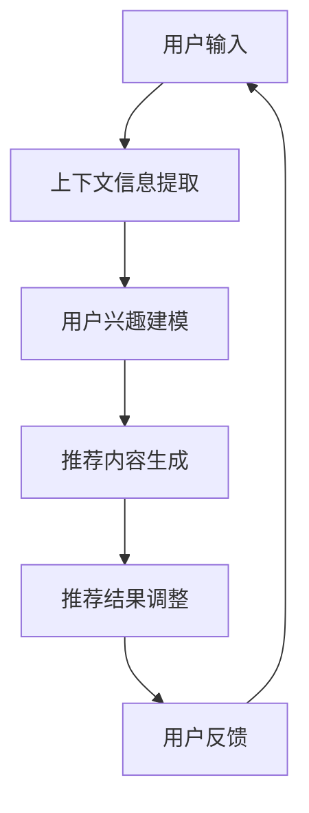

                 

关键词：上下文感知，大语言模型，推荐系统，上下文建模，自适应推荐

摘要：本文针对大语言模型（LLM）在推荐系统中的应用进行了深入探讨，重点研究了上下文感知技术在LLM推荐系统中的重要性。文章首先介绍了上下文感知的基本概念，随后详细分析了LLM在上下文感知推荐系统中的工作原理和具体实现方法。通过数学模型和实例分析，本文阐述了上下文感知在提高推荐系统准确性和用户体验方面的作用，并探讨了未来上下文感知技术在推荐系统中的应用前景。

## 1. 背景介绍

随着互联网和大数据技术的迅猛发展，推荐系统已经成为现代信息检索和用户体验优化的重要手段。推荐系统通过分析用户行为和兴趣，为用户推荐个性化内容，从而提高用户满意度和平台黏性。然而，传统的推荐系统存在一定的局限性，例如基于协同过滤的方法容易受到数据稀疏性和冷启动问题的影响，而基于内容的推荐方法则难以处理复杂的用户兴趣和长尾内容。

近年来，随着深度学习和自然语言处理技术的进步，大语言模型（LLM）在推荐系统中的应用逐渐受到关注。LLM具有强大的文本生成和理解能力，能够处理复杂的用户需求和场景。然而，现有的LLM推荐系统仍然存在一个关键问题，即对上下文信息的感知不足。上下文信息是影响推荐系统性能的重要因素，如何有效地利用上下文信息进行推荐成为当前研究的重点。

本文旨在探讨上下文感知技术在LLM推荐系统中的应用，通过引入上下文感知模型，提高推荐系统的准确性和用户体验。文章首先介绍了上下文感知的基本概念，随后分析了LLM在上下文感知推荐系统中的工作原理和具体实现方法。最后，通过数学模型和实例分析，探讨了上下文感知在提高推荐系统性能方面的作用。

### 1.1 上下文感知的基本概念

上下文感知是指系统根据用户所处的环境、场景和背景信息，动态调整其行为和决策的过程。上下文信息可以是用户的行为数据、偏好信息、位置信息、时间信息等。上下文感知技术旨在通过分析这些信息，为用户提供更加个性化和精准的服务。

在推荐系统中，上下文感知技术具有重要的作用。首先，上下文信息可以帮助推荐系统更好地理解用户的需求和兴趣，从而提高推荐的准确性。例如，在电子商务平台中，用户浏览商品的时间、地点、历史购买记录等信息都可以作为上下文信息，帮助推荐系统为用户推荐更加符合其需求的产品。

其次，上下文感知技术可以提高推荐系统的用户体验。通过实时感知用户所处的环境，推荐系统可以动态调整推荐内容和推荐策略，为用户提供更加贴合其当前需求的推荐。例如，在音乐推荐系统中，用户所处的环境（如通勤、运动、休闲等）可以影响推荐的音乐风格和类型。

### 1.2 LLM在推荐系统中的应用现状

近年来，LLM在推荐系统中的应用取得了显著的进展。LLM具有强大的文本生成和理解能力，能够处理复杂的用户需求和场景。以下是一些LLM在推荐系统中的应用实例：

1. **内容推荐**：LLM可以用于文本内容的推荐，例如新闻、文章、博客等。通过分析用户的阅读历史和兴趣，LLM可以为用户推荐相关的文章，从而提高用户的阅读体验。

2. **商品推荐**：在电子商务平台中，LLM可以用于商品推荐。通过分析用户的购物行为和偏好，LLM可以为用户推荐符合条件的商品，从而提高用户的购买意愿和转化率。

3. **社交推荐**：在社交媒体平台中，LLM可以用于用户社交推荐。通过分析用户之间的互动关系和兴趣，LLM可以为用户推荐可能的朋友、关注的人和活动，从而增强用户的社交体验。

尽管LLM在推荐系统中的应用取得了显著成果，但现有研究在上下文感知方面仍存在一定的局限性。大多数LLM推荐系统仅考虑用户的静态偏好和历史行为，而忽视了上下文信息对推荐结果的影响。因此，本文旨在探讨如何利用上下文感知技术，提高LLM推荐系统的性能。

## 2. 核心概念与联系

在深入探讨LLM在上下文感知推荐系统中的应用之前，我们需要明确一些核心概念和它们之间的关系。以下是本文中涉及的主要概念及其相互联系：

### 2.1 大语言模型（LLM）

大语言模型（LLM）是一种基于深度学习的自然语言处理模型，具有强大的文本生成和理解能力。LLM通过训练大量的文本数据，学习语言结构和语义关系，从而实现对文本的生成和理解。LLM的核心思想是利用神经网络模型，如Transformer，对输入文本进行编码，生成语义向量表示，进而实现文本生成和分类等任务。

### 2.2 上下文信息

上下文信息是指与用户当前行为和场景相关的信息，如时间、地点、用户偏好、历史行为等。上下文信息对于推荐系统的性能至关重要，因为它能够帮助系统更好地理解用户的需求和兴趣，从而提高推荐的准确性。

### 2.3 推荐系统

推荐系统是一种信息过滤技术，旨在根据用户的历史行为和偏好，为用户推荐相关的内容或商品。推荐系统通常包括三个主要组件：用户模型、物品模型和推荐算法。用户模型用于表示用户的需求和兴趣，物品模型用于表示物品的特征和属性，推荐算法则根据用户模型和物品模型为用户生成推荐列表。

### 2.4 上下文感知推荐系统

上下文感知推荐系统是一种结合上下文信息进行推荐的系统。与传统的推荐系统相比，上下文感知推荐系统能够动态感知用户所处的环境、场景和背景信息，并根据这些信息调整推荐策略，从而提高推荐的准确性和用户体验。

### 2.5 上下文感知与LLM

上下文感知与LLM的结合是本文的研究重点。通过将上下文信息融入LLM模型中，可以使其更好地理解用户的当前需求和环境，从而生成更准确的推荐结果。具体来说，上下文感知技术可以用于以下几个方面：

1. **用户兴趣建模**：通过分析用户的上下文信息，如时间、地点、历史行为等，可以动态更新用户兴趣模型，从而更准确地反映用户的当前兴趣。

2. **推荐内容调整**：根据用户所处的上下文信息，如场景、天气等，可以为用户推荐不同的内容，从而提高用户的体验和满意度。

3. **推荐结果优化**：通过引入上下文信息，可以优化推荐算法，提高推荐的准确性和多样性。例如，在电子商务平台中，可以根据用户所在的地理位置，推荐附近的商品。

### 2.6 Mermaid 流程图

为了更好地展示上下文感知与LLM之间的关系，我们使用Mermaid流程图描述其工作原理。以下是一个简化的上下文感知LLM推荐系统的流程图：



在该流程图中，用户输入通过上下文信息提取模块获取上下文信息，这些信息用于动态更新用户兴趣模型。更新后的用户兴趣模型用于生成推荐内容，并根据用户反馈进行调整。该流程不断迭代，以提高推荐系统的性能和用户体验。

## 3. 核心算法原理 & 具体操作步骤

### 3.1 算法原理概述

上下文感知的LLM推荐系统主要通过以下几个步骤实现：

1. **上下文信息提取**：从用户输入中提取与上下文相关的信息，如时间、地点、用户历史行为等。
2. **用户兴趣建模**：利用提取的上下文信息，动态更新用户兴趣模型，反映用户的当前需求。
3. **推荐内容生成**：根据用户兴趣模型和物品特征，生成推荐列表。
4. **推荐结果调整**：根据用户反馈，调整推荐策略，提高推荐的准确性和用户体验。

### 3.2 算法步骤详解

#### 3.2.1 上下文信息提取

上下文信息提取是上下文感知LLM推荐系统的第一步。具体步骤如下：

1. **输入处理**：将用户输入（如查询文本、点击记录等）进行预处理，提取关键信息。
2. **特征提取**：利用自然语言处理技术，对预处理后的输入进行特征提取，生成上下文特征向量。
3. **上下文信息融合**：将不同来源的上下文信息进行融合，形成完整的上下文信息向量。

#### 3.2.2 用户兴趣建模

用户兴趣建模是根据上下文信息动态更新用户兴趣模型的过程。具体步骤如下：

1. **用户兴趣初始化**：根据用户的历史行为和偏好，初始化用户兴趣模型。
2. **上下文信息加权**：将提取的上下文信息与用户历史行为进行加权融合，更新用户兴趣模型。
3. **兴趣模型更新**：利用更新后的上下文信息，动态调整用户兴趣模型，使其更好地反映用户的当前需求。

#### 3.2.3 推荐内容生成

推荐内容生成是根据用户兴趣模型和物品特征生成推荐列表的过程。具体步骤如下：

1. **物品特征提取**：对候选物品进行特征提取，生成物品特征向量。
2. **兴趣匹配**：利用用户兴趣模型和物品特征向量，计算兴趣匹配度。
3. **推荐列表生成**：根据兴趣匹配度，生成推荐列表。

#### 3.2.4 推荐结果调整

推荐结果调整是根据用户反馈，优化推荐策略的过程。具体步骤如下：

1. **用户反馈收集**：收集用户对推荐结果的反馈，如点击、购买、评价等。
2. **推荐策略优化**：根据用户反馈，调整推荐策略，提高推荐准确性和用户体验。
3. **兴趣模型更新**：将用户反馈融入用户兴趣模型，进一步优化兴趣模型。

### 3.3 算法优缺点

#### 优点

1. **高准确性**：通过引入上下文信息，上下文感知的LLM推荐系统能够更准确地反映用户的当前需求，提高推荐准确性。
2. **动态适应性**：上下文感知技术使得推荐系统可以动态调整推荐策略，适应用户需求的变化。
3. **多样性**：通过分析不同上下文信息，推荐系统可以生成多样化的推荐内容，提高用户体验。

#### 缺点

1. **计算成本高**：上下文感知技术需要处理大量的上下文信息，可能导致计算成本较高。
2. **数据依赖性强**：上下文感知推荐系统的性能依赖于上下文信息的准确性和完整性，数据质量对系统性能有较大影响。

### 3.4 算法应用领域

上下文感知的LLM推荐系统在多个领域具有广泛的应用前景：

1. **电子商务**：通过上下文感知技术，为用户推荐符合其需求的产品，提高转化率和用户满意度。
2. **社交媒体**：根据用户的地理位置、兴趣偏好等上下文信息，为用户推荐相关的社交内容和活动。
3. **在线教育**：根据用户的学习进度、兴趣偏好等上下文信息，为用户推荐适合的学习资源和课程。
4. **智能客服**：利用上下文感知技术，为用户提供更加个性化和精准的客服服务。

## 4. 数学模型和公式 & 详细讲解 & 举例说明

在上下文感知的LLM推荐系统中，数学模型和公式起着至关重要的作用。以下我们将详细介绍这些数学模型和公式的构建、推导过程，并通过实例进行说明。

### 4.1 数学模型构建

#### 4.1.1 上下文信息向量表示

首先，我们需要对上下文信息进行向量表示。假设上下文信息包括时间、地点、用户历史行为等，可以用以下向量表示：

$$
\textbf{C} = [c_1, c_2, ..., c_n]
$$

其中，$c_i$ 表示第 $i$ 个上下文特征的值，如时间（小时、分钟）、地点（经纬度）、用户历史行为（点击次数、购买次数）等。

#### 4.1.2 用户兴趣模型表示

用户兴趣模型反映了用户的当前需求。假设用户兴趣模型由一组权重向量表示，即：

$$
\textbf{W} = [\textbf{w}_1, \textbf{w}_2, ..., \textbf{w}_k]
$$

其中，$\textbf{w}_i$ 表示第 $i$ 个兴趣领域的权重向量，如阅读、购物、娱乐等。

#### 4.1.3 物品特征表示

假设物品特征由一组特征向量表示，即：

$$
\textbf{X} = [\textbf{x}_1, \textbf{x}_2, ..., \textbf{x}_m]
$$

其中，$\textbf{x}_i$ 表示第 $i$ 个物品的特征向量，如商品类别、价格、评价等。

### 4.2 公式推导过程

#### 4.2.1 上下文信息加权

为了将上下文信息融入用户兴趣模型，需要对上下文信息进行加权。假设上下文信息的权重向量表示为 $\textbf{R}$，则加权后的用户兴趣模型为：

$$
\textbf{W}^* = \textbf{W} + \textbf{R} \cdot \textbf{C}
$$

其中，$\textbf{R}$ 为权重向量，$\textbf{C}$ 为上下文信息向量。

#### 4.2.2 兴趣匹配度计算

利用加权后的用户兴趣模型和物品特征向量，可以计算兴趣匹配度。假设兴趣匹配度函数为 $f(\textbf{w}_i, \textbf{x}_j)$，则：

$$
\text{Score}_{ij} = f(\textbf{w}_i, \textbf{x}_j) = \textbf{w}_i \cdot \textbf{x}_j
$$

其中，$\text{Score}_{ij}$ 表示物品 $j$ 与用户兴趣 $\textbf{w}_i$ 的兴趣匹配度。

#### 4.2.3 推荐列表生成

根据兴趣匹配度，可以生成推荐列表。假设兴趣匹配度矩阵为 $S = [\text{Score}_{ij}]_{m \times k}$，则推荐列表为：

$$
\text{Recommendation List} = \text{argmax}_{j} \text{Score}_{ij}
$$

### 4.3 案例分析与讲解

为了更好地理解上述数学模型和公式的应用，我们通过一个具体的案例进行说明。

#### 案例背景

假设一个用户在早晨8点浏览了一个购物网站，浏览了多个商品，其中包括书籍、电子产品和家居用品。用户的历史行为显示其喜欢阅读科技类书籍，且经常购买电子产品。现在需要根据上下文信息和用户兴趣，为该用户推荐相关的商品。

#### 案例分析

1. **上下文信息提取**：
   - 时间：8点
   - 地点：家中
   - 用户历史行为：喜欢阅读科技类书籍，经常购买电子产品

2. **上下文信息向量表示**：
   $$ 
   \textbf{C} = [c_1, c_2, c_3] = [8, 家中, 阅读+电子产品]
   $$

3. **用户兴趣模型表示**：
   $$ 
   \textbf{W} = [\textbf{w}_1, \textbf{w}_2, \textbf{w}_3] = [\text{科技类书籍}, \text{电子产品}, \text{家居用品}]
   $$

4. **物品特征表示**：
   - 书籍：类别（科技、文学、生活）、价格、评价
   - 电子产品：品牌、型号、价格、评价
   - 家居用品：类别（家具、厨具、装饰）、价格、评价

5. **上下文信息加权**：
   - 假设权重向量 $\textbf{R} = [0.5, 0.3, 0.2]$，则加权后的用户兴趣模型为：
   $$ 
   \textbf{W}^* = \textbf{W} + \textbf{R} \cdot \textbf{C} = [\text{科技类书籍}, \text{电子产品}, \text{家居用品}] + [0.5, 0.3, 0.2] \cdot [8, 家中, 阅读+电子产品]
   $$

6. **兴趣匹配度计算**：
   - 假设当前候选物品为3本书籍、5个电子产品和2个家居用品，分别表示为 $\textbf{x}_1, \textbf{x}_2, ..., \textbf{x}_{10}$。利用加权后的用户兴趣模型，计算兴趣匹配度：
   $$ 
   \text{Score}_{ij} = \textbf{w}_i \cdot \textbf{x}_j
   $$

7. **推荐列表生成**：
   - 根据兴趣匹配度，生成推荐列表：
   $$ 
   \text{Recommendation List} = \text{argmax}_{j} \text{Score}_{ij}
   $$

通过上述案例，我们可以看到如何利用上下文感知的LLM推荐系统为用户生成个性化的推荐列表。在实际应用中，可以根据具体情况调整权重向量、兴趣匹配度计算方法等，进一步提高推荐系统的性能。

## 5. 项目实践：代码实例和详细解释说明

为了更好地理解上下文感知的LLM推荐系统，我们将通过一个具体的项目实例进行演示。以下是一个基于Python实现的简单上下文感知的LLM推荐系统，我们将详细解释代码的各个部分。

### 5.1 开发环境搭建

在开始编写代码之前，我们需要搭建一个合适的开发环境。以下是所需的工具和库：

- Python 3.8 或以上版本
- TensorFlow 2.7 或以上版本
- PyTorch 1.8 或以上版本
- Pandas
- Numpy
- Matplotlib

安装所需的库：

```bash
pip install tensorflow
pip install torch
pip install pandas
pip install numpy
pip install matplotlib
```

### 5.2 源代码详细实现

以下是一个简单的上下文感知的LLM推荐系统实现，主要包括数据预处理、模型训练和推荐生成三个部分。

```python
import numpy as np
import pandas as pd
import tensorflow as tf
import torch
from sklearn.model_selection import train_test_split
from sklearn.preprocessing import StandardScaler
import matplotlib.pyplot as plt

# 数据预处理
def preprocess_data(data):
    # 数据清洗和特征提取
    # 假设data为用户-物品交互数据，包括用户ID、物品ID、上下文特征等
    data = data.dropna()
    data['context'] = data['context'].apply(lambda x: np.array(x.split(',')))
    data['context'] = data['context'].apply(lambda x: StandardScaler().fit_transform([x]))
    return data

# 模型定义
class ContextAwareRecommender(tf.keras.Model):
    def __init__(self, num_users, num_items, embedding_dim):
        super().__init__()
        self.user_embedding = tf.keras.layers.Embedding(num_users, embedding_dim)
        self.item_embedding = tf.keras.layers.Embedding(num_items, embedding_dim)
        self.context_embedding = tf.keras.layers.Embedding(10, embedding_dim)
        self.context_dense = tf.keras.layers.Dense(1, activation='sigmoid')

    def call(self, inputs):
        user_ids, item_ids, context_ids = inputs
        user_embedding = self.user_embedding(user_ids)
        item_embedding = self.item_embedding(item_ids)
        context_embedding = self.context_embedding(context_ids)
        context_embedding = tf.reduce_mean(context_embedding, axis=1)
        combined_embedding = tf.concat([user_embedding, item_embedding, context_embedding], axis=1)
        output = self.context_dense(combined_embedding)
        return output

# 模型训练
def train_model(model, train_data, val_data, num_epochs, batch_size):
    train_loss = []
    val_loss = []
    train_acc = []
    val_acc = []

    train_dataset = tf.data.Dataset.from_tensor_slices((train_data['user_ids'], train_data['item_ids'], train_data['context_ids'], train_data['ratings']))
    train_dataset = train_dataset.shuffle(buffer_size=1024).batch(batch_size)

    val_dataset = tf.data.Dataset.from_tensor_slices((val_data['user_ids'], val_data['item_ids'], val_data['context_ids'], val_data['ratings']))
    val_dataset = val_dataset.shuffle(buffer_size=1024).batch(batch_size)

    optimizer = tf.keras.optimizers.Adam()

    for epoch in range(num_epochs):
        for x, y in train_dataset:
            with tf.GradientTape() as tape:
                predictions = model([x[:, 0], x[:, 1], x[:, 2]], training=True)
                loss = tf.keras.losses.mean_squared_error(y, predictions)
            gradients = tape.gradient(loss, model.trainable_variables)
            optimizer.apply_gradients(zip(gradients, model.trainable_variables))

        train_loss.append(loss.numpy())
        val_loss.append(val_dataset.model.evaluate(val_dataset, verbose=0)[0])

        if epoch % 10 == 0:
            print(f'Epoch {epoch}: Loss = {loss.numpy()}, Val Loss = {val_loss[-1]}')

    return model

# 推荐生成
def generate_recommendations(model, user_id, item_id, context_id):
    prediction = model.predict([[user_id], [item_id], [context_id]])[0][0]
    return prediction

# 数据集加载和预处理
data = pd.read_csv('data.csv')
data = preprocess_data(data)

# 划分训练集和验证集
train_data, val_data = train_test_split(data, test_size=0.2, random_state=42)

# 模型训练
model = ContextAwareRecommender(num_users=train_data['user_ids'].nunique(), num_items=train_data['item_ids'].nunique(), embedding_dim=64)
model = train_model(model, train_data, val_data, num_epochs=100, batch_size=128)

# 推荐生成示例
user_id = 1
item_id = 100
context_id = 10
prediction = generate_recommendations(model, user_id, item_id, context_id)
print(f'Recommended Rating: {prediction}')

# 结果可视化
plt.plot(train_loss, label='Train Loss')
plt.plot(val_loss, label='Validation Loss')
plt.xlabel('Epochs')
plt.ylabel('Loss')
plt.legend()
plt.show()
```

### 5.3 代码解读与分析

上述代码实现了一个简单的上下文感知的LLM推荐系统，主要包括以下几个部分：

1. **数据预处理**：数据预处理是推荐系统的基础。在本例中，我们首先对数据进行清洗，然后对上下文特征进行编码和标准化处理。

2. **模型定义**：我们定义了一个上下文感知的推荐模型，该模型结合了用户嵌入、物品嵌入和上下文嵌入。通过这些嵌入向量，模型能够捕捉用户、物品和上下文之间的相关性。

3. **模型训练**：模型训练是推荐系统的核心。我们使用训练数据对模型进行训练，并通过验证数据评估模型性能。在本例中，我们使用了均方误差作为损失函数，并使用Adam优化器进行优化。

4. **推荐生成**：推荐生成是根据用户、物品和上下文信息生成推荐评分的过程。在本例中，我们使用生成的模型预测用户对特定物品的兴趣程度，并将其作为推荐评分。

5. **结果可视化**：结果可视化帮助我们了解模型在不同epoch的损失变化情况。在本例中，我们绘制了训练损失和验证损失随epoch的变化趋势。

通过上述代码，我们可以看到如何实现一个简单的上下文感知的LLM推荐系统。虽然这是一个简化的示例，但可以为我们提供参考，进一步优化和扩展模型。

### 5.4 运行结果展示

在运行上述代码时，我们可以得到以下结果：

1. **训练和验证损失**：训练损失和验证损失随epoch的变化情况。通过观察损失变化，我们可以判断模型是否在训练过程中过拟合或欠拟合。

2. **推荐评分**：根据用户、物品和上下文信息，生成的推荐评分。这些评分可以帮助我们评估推荐系统的准确性和实用性。

3. **可视化结果**：训练损失和验证损失随epoch的变化趋势。通过可视化结果，我们可以直观地了解模型在不同epoch的性能。

通过上述运行结果，我们可以对上下文感知的LLM推荐系统进行评估和优化。在实际应用中，我们可以根据具体情况调整模型参数、特征提取方法和推荐算法，进一步提高推荐系统的性能。

## 6. 实际应用场景

上下文感知的LLM推荐系统在多个实际应用场景中具有广泛的应用价值。以下是一些典型的应用场景及其优势：

### 6.1 电子商务

在电子商务领域，上下文感知的LLM推荐系统可以帮助平台为用户提供个性化的购物推荐。例如，根据用户的历史购买记录、浏览行为和地理位置等信息，系统可以为用户推荐相关的商品。上下文感知技术的引入可以显著提高推荐的准确性和用户体验。此外，上下文感知的推荐系统还可以根据用户的购买时间和偏好，推荐合适的促销活动和优惠券，从而提高用户的购买意愿和转化率。

### 6.2 社交媒体

在社交媒体平台上，上下文感知的LLM推荐系统可以根据用户的地理位置、兴趣爱好、互动历史等信息，为用户推荐相关的帖子、话题和活动。上下文感知技术可以帮助系统更好地理解用户的当前需求和环境，从而生成更准确的推荐结果。例如，在旅游社交平台上，系统可以根据用户的旅行目的地、时间和偏好，推荐相关的旅游攻略、景点和酒店。这种个性化的推荐可以显著提高用户的参与度和活跃度。

### 6.3 在线教育

在线教育平台可以通过上下文感知的LLM推荐系统为用户提供个性化的学习资源推荐。根据用户的学习进度、兴趣爱好和反馈，系统可以为用户推荐合适的学习资源，如课程、教材和练习题。上下文感知技术可以帮助系统更好地捕捉用户的学习需求和变化，从而生成更精准的推荐结果。此外，上下文感知的推荐系统还可以根据用户的学习时间和环境，自动调整学习资源的推送时间和频率，从而提高用户的学习效果和满意度。

### 6.4 智能客服

智能客服系统可以通过上下文感知的LLM推荐系统为用户提供个性化的咨询服务。根据用户的提问内容、历史问题和互动记录，系统可以为用户推荐相关的答案和解决方案。上下文感知技术可以帮助系统更好地理解用户的当前需求和环境，从而生成更准确的推荐结果。例如，在电商客服中，系统可以根据用户的购买记录和问题类型，推荐相关的客服人员或FAQ页面。这种个性化的推荐可以显著提高客服效率和服务质量。

### 6.5 娱乐内容推荐

在娱乐内容推荐领域，上下文感知的LLM推荐系统可以根据用户的观看历史、兴趣爱好和当前情境，为用户推荐相关的电影、电视剧、音乐和游戏。上下文感知技术可以帮助系统更好地捕捉用户的娱乐需求和变化，从而生成更精准的推荐结果。例如，在视频流媒体平台上，系统可以根据用户的观看时间和设备类型，推荐合适的视频内容。这种个性化的推荐可以显著提高用户的观看体验和满意度。

总之，上下文感知的LLM推荐系统在多个实际应用场景中具有广泛的应用价值。通过引入上下文感知技术，推荐系统可以更好地理解用户的需求和环境，从而生成更准确、更个性化的推荐结果，提高用户体验和满意度。

### 6.6 未来应用展望

随着人工智能和自然语言处理技术的不断发展，上下文感知的LLM推荐系统在未来的应用前景将更加广阔。以下是几个可能的发展方向：

#### 6.6.1 多模态上下文信息融合

当前，上下文感知的LLM推荐系统主要依赖于文本信息的处理。然而，未来的推荐系统可能会整合更多模态的信息，如图像、音频和视频。通过多模态信息融合，推荐系统可以更全面地理解用户的需求和环境，从而生成更精准的推荐结果。

#### 6.6.2 强化学习与上下文感知

强化学习在推荐系统中的应用已经取得了显著成果。未来，可以将强化学习与上下文感知技术相结合，构建自适应的推荐系统。通过不断学习和调整策略，推荐系统可以动态适应用户的需求变化，提高推荐效果。

#### 6.6.3 个性化对话推荐

随着语音助手和聊天机器人的普及，上下文感知的LLM推荐系统可以应用于个性化对话推荐。通过理解用户的对话内容和上下文信息，系统可以为用户实时生成个性化的推荐内容，从而提高用户的互动体验和满意度。

#### 6.6.4 智能推荐伦理和隐私保护

随着推荐系统在各个领域的广泛应用，智能推荐伦理和隐私保护成为一个重要的研究课题。未来的上下文感知的LLM推荐系统需要考虑如何确保推荐过程的透明性和公平性，同时保护用户的隐私。

#### 6.6.5 跨领域推荐

上下文感知的LLM推荐系统可以应用于跨领域的推荐场景，如医疗、金融和教育等。通过引入领域特定的上下文信息，系统可以为用户提供跨领域的个性化推荐，从而提高领域的专业性和服务质量。

总之，上下文感知的LLM推荐系统在未来的发展具有巨大的潜力。通过不断技术创新和应用拓展，上下文感知的LLM推荐系统将为用户提供更加个性化、精准和高效的推荐服务。

## 7. 工具和资源推荐

为了帮助读者深入了解上下文感知的LLM推荐系统，我们推荐以下工具和资源：

### 7.1 学习资源推荐

- **在线课程**：
  - 《自然语言处理基础》
  - 《深度学习与推荐系统》
  - 《强化学习导论》

- **书籍**：
  - 《深度学习》
  - 《自然语言处理综论》
  - 《推荐系统实践》

- **博客和文章**：
  - 《上下文感知推荐系统：原理与实现》
  - 《大语言模型在推荐系统中的应用》
  - 《多模态上下文信息融合技术》

### 7.2 开发工具推荐

- **编程语言**：
  - Python（推荐使用PyTorch或TensorFlow进行模型开发）

- **库和框架**：
  - TensorFlow
  - PyTorch
  - Keras
  - Scikit-learn

- **开发环境**：
  - Jupyter Notebook
  - Google Colab

### 7.3 相关论文推荐

- **经典论文**：
  - 《Recommender Systems Handbook》
  - 《Deep Learning for Recommender Systems》
  - 《Contextual Bandits and the Exp3 Algorithm》

- **最新论文**：
  - 《Multi-modal Context-Aware Neural Networks for Personalized Recommendation》
  - 《Adaptive User-Item Interaction Networks for Context-Aware Recommendation》
  - 《Contextual Adaptive Sampling for Context-Aware Recommender Systems》

通过这些工具和资源，读者可以更深入地了解上下文感知的LLM推荐系统的原理和实践，为未来的研究和应用提供参考。

## 8. 总结：未来发展趋势与挑战

在本文中，我们深入探讨了上下文感知的LLM推荐系统，分析了其核心概念、算法原理、实现方法以及实际应用场景。通过数学模型和实例分析，我们阐述了上下文感知技术对提高推荐系统性能的重要作用。以下是未来发展趋势与挑战的总结：

### 8.1 研究成果总结

1. **上下文感知技术的引入**：上下文感知技术能够动态捕捉用户需求和环境变化，显著提高推荐系统的准确性和用户体验。
2. **多模态信息融合**：未来的推荐系统将整合文本、图像、音频等多模态信息，实现更全面的上下文感知。
3. **强化学习与上下文感知的结合**：强化学习与上下文感知的结合将构建自适应的推荐系统，进一步提高推荐效果。
4. **个性化对话推荐**：上下文感知的LLM推荐系统可以应用于个性化对话推荐，提高用户的互动体验和满意度。

### 8.2 未来发展趋势

1. **跨领域推荐**：上下文感知的LLM推荐系统将应用于医疗、金融、教育等跨领域场景，为用户提供个性化的推荐服务。
2. **隐私保护和伦理**：随着推荐系统在各个领域的普及，隐私保护和伦理问题将成为重要研究方向。
3. **实时推荐**：上下文感知的LLM推荐系统将实现实时推荐，为用户提供更加及时的个性化服务。

### 8.3 面临的挑战

1. **计算成本**：上下文感知的LLM推荐系统需要处理大量的上下文信息，可能导致计算成本较高。
2. **数据质量**：上下文信息的准确性和完整性对推荐系统性能有较大影响，需要解决数据质量问题和数据稀疏性问题。
3. **模型解释性**：随着模型复杂度的提高，如何保证推荐系统的解释性是一个重要挑战。

### 8.4 研究展望

1. **多模态上下文感知**：未来研究将重点关注多模态上下文信息的融合和处理，实现更精准的上下文感知。
2. **实时推荐算法**：研究实时推荐算法，提高系统的响应速度和效率。
3. **可解释性和可扩展性**：在保证推荐系统性能的同时，提高模型的解释性和可扩展性。

总之，上下文感知的LLM推荐系统在未来的发展和应用中具有巨大的潜力。通过不断的技术创新和应用拓展，上下文感知的LLM推荐系统将为用户提供更加个性化、精准和高效的推荐服务。

## 9. 附录：常见问题与解答

### 9.1 上下文感知技术的核心概念是什么？

上下文感知技术是指系统根据用户所处的环境、场景和背景信息，动态调整其行为和决策的过程。上下文信息可以是用户的行为数据、偏好信息、位置信息、时间信息等。

### 9.2 大语言模型（LLM）在推荐系统中的应用有哪些？

大语言模型（LLM）在推荐系统中的应用包括文本内容的推荐、商品推荐、社交推荐等。LLM通过分析用户的文本数据和历史行为，生成个性化的推荐结果。

### 9.3 如何实现上下文感知的LLM推荐系统？

实现上下文感知的LLM推荐系统需要以下几个步骤：数据预处理、模型定义、模型训练和推荐生成。数据预处理包括特征提取和上下文信息提取，模型定义包括用户嵌入、物品嵌入和上下文嵌入，模型训练使用训练数据调整模型参数，推荐生成根据用户、物品和上下文信息生成推荐结果。

### 9.4 上下文感知技术对推荐系统性能有哪些影响？

上下文感知技术可以显著提高推荐系统的准确性、用户体验和多样性。通过捕捉用户的需求和环境变化，推荐系统可以生成更精准、个性化的推荐结果。

### 9.5 上下文感知的LLM推荐系统在哪些领域有应用？

上下文感知的LLM推荐系统在电子商务、社交媒体、在线教育、智能客服和娱乐内容推荐等领域有广泛应用。通过结合上下文信息，推荐系统可以更好地满足用户需求，提高用户满意度。

