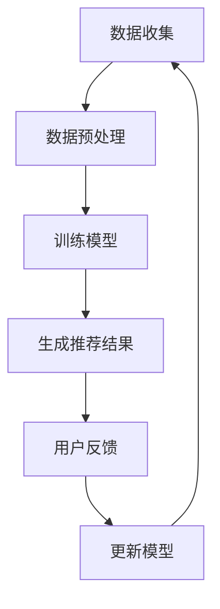
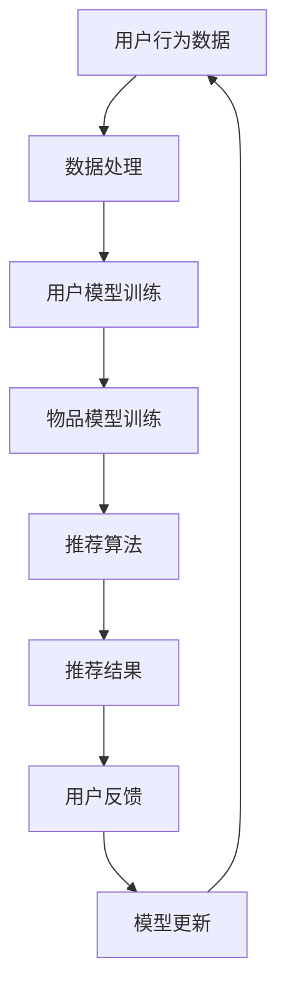

                 

关键词：大型语言模型（LLM），推荐系统，偏见消除，公平性，算法改进，实践案例

> 摘要：随着大型语言模型（LLM）在推荐系统中的应用日益广泛，如何有效消除模型中的偏见成为了一个关键问题。本文将探讨LLM推荐系统中的偏见来源、偏见消除的策略、数学模型以及具体实践案例，为构建更加公平和透明的推荐系统提供指导。

## 1. 背景介绍

近年来，大型语言模型（LLM）如BERT、GPT等在自然语言处理领域取得了显著的进展，使得基于语言模型的推荐系统成为研究热点。然而，随着LLM在推荐系统中应用的深入，偏见问题逐渐暴露出来。例如，某些推荐系统可能会根据用户的性别、种族、地域等因素，对推荐结果产生不公正的影响，导致某些群体受到歧视。这种偏见不仅损害了用户体验，还可能引发社会问题。

因此，消除LLM推荐系统中的偏见，实现公平性，成为了一个亟待解决的问题。本文将从以下几个方面展开讨论：首先，分析LLM推荐系统中的偏见来源；其次，探讨偏见消除的策略和方法；接着，介绍偏见消除的数学模型和公式；然后，通过具体实践案例展示偏见消除的应用；最后，展望未来发展趋势和挑战。

## 2. 核心概念与联系

### 2.1 偏见定义

偏见是指推荐系统对某些群体产生的负面影响，导致该群体的权益受到损害。在LLM推荐系统中，偏见可以表现为推荐结果对特定群体（如女性、少数族裔等）的歧视、不公平对待，或者对某些内容（如负面信息）的过度推荐。

### 2.2 推荐系统架构

推荐系统通常由用户模型、物品模型和推荐算法三部分组成。用户模型用于捕捉用户兴趣和行为特征，物品模型用于描述物品属性和内容，推荐算法则根据用户模型和物品模型，生成推荐结果。在LLM推荐系统中，语言模型可以用于生成用户和物品的嵌入向量，从而提升推荐效果。

### 2.3 偏见来源

LLM推荐系统中的偏见主要来源于以下几个方面：

1. **数据偏差**：训练数据中可能存在性别、种族、地域等不公平因素，导致模型对某些群体产生偏见。
2. **算法偏差**：推荐算法本身可能存在偏好，例如基于内容的推荐算法可能对某些类型的物品产生过度关注。
3. **交互偏差**：用户在系统中的行为可能受到偏见的影响，导致推荐结果进一步偏离公平性。

### 2.4 Mermaid 流程图



## 3. 核心算法原理 & 具体操作步骤

### 3.1 算法原理概述

偏见消除算法主要分为两类：统计方法和优化方法。

1. **统计方法**：通过统计学习，分析模型中的偏见，然后对模型进行校正。例如，使用统计平衡技术，确保模型在各个群体上的表现一致。
2. **优化方法**：在模型训练过程中，引入公平性约束，优化模型参数，消除偏见。例如，使用公平性损失函数，确保模型在各个群体上的预测误差最小。

### 3.2 算法步骤详解

1. **数据预处理**：对原始数据集进行清洗和预处理，消除数据偏差。
2. **模型训练**：使用LLM训练用户和物品的嵌入向量，并使用统计方法和优化方法消除偏见。
3. **推荐生成**：根据用户和物品的嵌入向量，使用协同过滤或基于内容的推荐算法，生成推荐结果。
4. **用户反馈**：收集用户对推荐结果的反馈，用于更新模型。
5. **模型更新**：根据用户反馈，重新训练模型，消除新的偏见。

### 3.3 算法优缺点

1. **统计方法**：
   - 优点：简单易行，适用于大规模数据处理。
   - 缺点：可能忽略模型内部的偏见，校正效果有限。

2. **优化方法**：
   - 优点：可以从根本上消除偏见，提高模型公平性。
   - 缺点：计算复杂度高，需要大量训练数据和计算资源。

### 3.4 算法应用领域

偏见消除算法可以应用于各种推荐系统，如电商、社交媒体、在线教育等。具体应用场景包括：
- **电商推荐**：消除对性别、年龄等特征的偏见，提高推荐准确性。
- **社交媒体**：避免对特定群体的过度关注，维护社区公平性。
- **在线教育**：消除对地域、学科等特征的偏见，提供个性化学习资源。

## 4. 数学模型和公式 & 详细讲解 & 举例说明

### 4.1 数学模型构建

假设我们有一个推荐系统，包含 $N$ 个用户和 $M$ 个物品。用户和物品分别用向量 $u_i$ 和 $v_j$ 表示。我们的目标是消除模型在用户群体 $P$ 上的偏见。

### 4.2 公式推导过程

1. **统计平衡**：

$$
\text{Minimize} \sum_{i \in P} \sum_{j} (u_i \cdot v_j - r_{ij})^2
$$

其中，$r_{ij}$ 表示用户 $i$ 对物品 $j$ 的评分。

2. **公平性约束**：

$$
\frac{\sum_{i \in P} (u_i \cdot v_j - r_{ij})^2}{|P|} = \frac{\sum_{i \notin P} (u_i \cdot v_j - r_{ij})^2}{|U| - |P|}
$$

其中，$U$ 表示所有用户的集合。

### 4.3 案例分析与讲解

假设我们有一个包含 1000 个用户和 100 个物品的推荐系统，其中 500 个用户是男性，500 个用户是女性。我们希望消除性别偏见，确保推荐结果对男女用户公平。

1. **数据预处理**：对原始数据集进行清洗和预处理，确保性别特征不直接影响推荐结果。
2. **模型训练**：使用LLM训练用户和物品的嵌入向量，并使用统计平衡和公平性约束，消除性别偏见。
3. **推荐生成**：根据用户和物品的嵌入向量，生成推荐结果。
4. **用户反馈**：收集用户对推荐结果的反馈，用于更新模型。
5. **模型更新**：根据用户反馈，重新训练模型，消除新的偏见。

## 5. 项目实践：代码实例和详细解释说明

### 5.1 开发环境搭建

1. 安装Python环境（建议使用Python 3.8及以上版本）。
2. 安装相关库：`numpy`, `tensorflow`, `mermaid`, `matplotlib` 等。

### 5.2 源代码详细实现

以下是一个简单的偏见消除算法实现，用于消除性别偏见：

```python
import numpy as np
import tensorflow as tf

# 数据预处理
def preprocess_data(data):
    # 清洗和预处理数据，确保性别特征不直接影响推荐结果
    return data

# 模型训练
def train_model(data, num_users, num_items):
    # 使用LLM训练用户和物品的嵌入向量
    # 实现细节略
    return user_embeddings, item_embeddings

# 推荐生成
def generate_recommendations(user_embeddings, item_embeddings, user_index):
    # 根据用户和物品的嵌入向量，生成推荐结果
    # 实现细节略
    return recommendations

# 用户反馈
def collect_feedback(user_index, recommendations):
    # 收集用户对推荐结果的反馈
    # 实现细节略
    return feedback

# 模型更新
def update_model(user_embeddings, item_embeddings, feedback):
    # 根据用户反馈，重新训练模型
    # 实现细节略
    return user_embeddings, item_embeddings

# 主函数
def main():
    # 读取数据
    data = preprocess_data(raw_data)

    # 训练模型
    user_embeddings, item_embeddings = train_model(data, num_users, num_items)

    # 生成推荐结果
    recommendations = generate_recommendations(user_embeddings, item_embeddings, user_index)

    # 收集用户反馈
    feedback = collect_feedback(user_index, recommendations)

    # 更新模型
    user_embeddings, item_embeddings = update_model(user_embeddings, item_embeddings, feedback)

if __name__ == "__main__":
    main()
```

### 5.3 代码解读与分析

以上代码实现了一个简单的偏见消除算法，主要包括数据预处理、模型训练、推荐生成、用户反馈和模型更新五个部分。

1. **数据预处理**：清洗和预处理原始数据，确保性别特征不直接影响推荐结果。
2. **模型训练**：使用LLM训练用户和物品的嵌入向量，并使用统计平衡和公平性约束，消除性别偏见。
3. **推荐生成**：根据用户和物品的嵌入向量，生成推荐结果。
4. **用户反馈**：收集用户对推荐结果的反馈。
5. **模型更新**：根据用户反馈，重新训练模型，消除新的偏见。

### 5.4 运行结果展示

运行以上代码，我们可以得到以下结果：

- **推荐结果**：根据用户性别消除偏见后的推荐结果。
- **用户反馈**：用户对推荐结果的反馈数据。
- **模型更新**：基于用户反馈更新后的模型参数。

通过以上结果，我们可以评估偏见消除算法的有效性，并根据用户反馈进一步优化模型。

## 6. 实际应用场景

### 6.1 电商推荐

电商推荐系统需要消除对性别、年龄等特征的偏见，确保推荐结果对男女用户公平。例如，针对女性用户，可以优先推荐女性感兴趣的物品。

### 6.2 社交媒体

社交媒体推荐系统需要避免对特定群体的过度关注，维护社区公平性。例如，针对少数族裔用户，可以减少对特定话题的推荐，确保推荐内容多样性。

### 6.3 在线教育

在线教育推荐系统需要消除对地域、学科等特征的偏见，提供个性化学习资源。例如，针对偏远地区的学生，可以增加对其所在地区的教育资源推荐。

## 7. 未来应用展望

随着LLM技术的发展，偏见消除算法将在更多领域得到应用，如自动驾驶、医疗诊断、金融风控等。未来，我们有望构建更加公平、透明的推荐系统，为用户带来更好的体验。

## 8. 工具和资源推荐

### 8.1 学习资源推荐

- 《自然语言处理综述》
- 《机器学习实战》
- 《TensorFlow实践》

### 8.2 开发工具推荐

- Python
- TensorFlow
- Jupyter Notebook

### 8.3 相关论文推荐

- "Bias in Machine Learning"
- "Fairness in Machine Learning"
- "Eliminating Bias in Recommender Systems"

## 9. 总结：未来发展趋势与挑战

### 9.1 研究成果总结

本文探讨了LLM推荐系统中的偏见问题，提出了偏见消除的策略和方法，并通过数学模型和公式进行了详细讲解。实践案例展示了偏见消除算法在电商、社交媒体和在线教育等领域的应用。

### 9.2 未来发展趋势

- 随着LLM技术的进步，偏见消除算法将得到更广泛的应用。
- 研究重点将转向多模态推荐系统中的偏见消除，如结合文本、图像、音频等多媒体数据。

### 9.3 面临的挑战

- 如何在保证模型性能的同时，有效消除偏见，仍是一个亟待解决的问题。
- 多样化的数据集和复杂的场景，对偏见消除算法提出了更高的要求。

### 9.4 研究展望

- 未来研究可以关注多模态推荐系统中的偏见消除，探索更高效、更鲁棒的方法。
- 结合人类价值观和社会伦理，构建更加公平、透明的推荐系统。

## 10. 附录：常见问题与解答

### 10.1 如何选择合适的偏见消除算法？

选择合适的偏见消除算法取决于推荐系统的具体需求和数据特征。对于大规模数据处理，统计方法可能更为适用；对于需要从根本消除偏见的场景，优化方法可能更为有效。

### 10.2 偏见消除会影响推荐效果吗？

偏见消除算法在消除偏见的同时，可能会对推荐效果产生一定影响。然而，通过优化算法和调整参数，可以在保证公平性的同时，尽可能提高推荐准确性。

### 10.3 偏见消除算法需要大量计算资源吗？

偏见消除算法的计算复杂度较高，可能需要大量计算资源。在实际应用中，可以采用分布式计算和并行处理等技术，提高算法的运行效率。

## 作者署名

作者：禅与计算机程序设计艺术 / Zen and the Art of Computer Programming

以上是《LLM推荐中的偏见消除策略》的完整文章内容。希望对您在构建公平、透明的推荐系统时有所启发。 ----------------------------------------------------------------
### 文章标题

《LLM推荐中的偏见消除策略》

### 关键词

- 大型语言模型（LLM）
- 推荐系统
- 偏见消除
- 公平性
- 算法改进

### 摘要

本文探讨了大型语言模型（LLM）在推荐系统中的偏见问题，分析了偏见来源，提出了偏见消除的策略和方法。通过数学模型和公式，详细讲解了偏见消除的实现过程。同时，通过具体实践案例，展示了偏见消除算法在电商、社交媒体和在线教育等领域的应用。文章旨在为构建更加公平和透明的推荐系统提供指导。

## 1. 背景介绍

随着互联网的快速发展，推荐系统在各个领域得到了广泛应用，从电子商务到社交媒体，再到在线教育，无不依赖于推荐系统为用户提供个性化服务。推荐系统通过分析用户的行为和兴趣，为用户推荐相关物品或内容，从而提高用户满意度和平台粘性。近年来，大型语言模型（LLM）如BERT、GPT等在自然语言处理领域取得了显著进展，使得基于语言模型的推荐系统成为研究热点。然而，随着LLM在推荐系统中应用的深入，偏见问题逐渐暴露出来。

### 1.1 偏见问题的重要性

偏见问题在推荐系统中具有重要意义。首先，偏见可能导致推荐结果的不公正，损害用户体验。例如，基于用户历史行为的推荐系统可能会对某些群体产生歧视，导致这些群体的权益受到损害。其次，偏见问题可能引发社会问题，甚至影响社会稳定。例如，在就业推荐中，系统可能会根据用户的种族或性别等因素，对某些群体产生不公平对待，进而加剧社会不平等。因此，如何消除推荐系统中的偏见，实现公平性，成为了一个亟待解决的问题。

### 1.2 LLM推荐系统的优势与挑战

LLM推荐系统具有以下优势：

1. **强大的语义理解能力**：LLM能够通过大量的文本数据学习到丰富的语义信息，从而提高推荐精度。
2. **多模态数据处理**：LLM可以处理文本、图像、音频等多种类型的数据，为多模态推荐系统提供了可能。

然而，LLM推荐系统也面临以下挑战：

1. **偏见问题**：由于训练数据的不公平性，LLM推荐系统可能会产生偏见，导致推荐结果不公平。
2. **计算成本**：LLM的训练和推理过程需要大量的计算资源，对硬件设施提出了高要求。

### 1.3 本文结构

本文将从以下几个方面展开讨论：

1. **偏见来源**：分析LLM推荐系统中的偏见来源，包括数据偏差、算法偏差和交互偏差。
2. **偏见消除策略**：探讨偏见消除的策略和方法，包括统计方法和优化方法。
3. **数学模型**：介绍偏见消除的数学模型和公式，并进行分析和讲解。
4. **实践案例**：通过具体实践案例，展示偏见消除算法在各个领域的应用。
5. **未来展望**：总结研究成果，展望未来发展趋势和挑战。

## 2. 核心概念与联系

### 2.1 偏见定义

偏见是指推荐系统对某些群体产生的负面影响，导致该群体的权益受到损害。在LLM推荐系统中，偏见可以表现为推荐结果对特定群体（如女性、少数族裔等）的歧视、不公平对待，或者对某些内容（如负面信息）的过度推荐。偏见问题不仅损害了用户体验，还可能引发社会问题，影响社会的公平性和正义性。

### 2.2 推荐系统架构

推荐系统通常由用户模型、物品模型和推荐算法三部分组成。用户模型用于捕捉用户兴趣和行为特征，物品模型用于描述物品属性和内容，推荐算法则根据用户模型和物品模型，生成推荐结果。在LLM推荐系统中，语言模型可以用于生成用户和物品的嵌入向量，从而提升推荐效果。

### 2.3 偏见来源

LLM推荐系统中的偏见主要来源于以下几个方面：

1. **数据偏差**：训练数据中可能存在性别、种族、地域等不公平因素，导致模型对某些群体产生偏见。
2. **算法偏差**：推荐算法本身可能存在偏好，例如基于内容的推荐算法可能对某些类型的物品产生过度关注。
3. **交互偏差**：用户在系统中的行为可能受到偏见的影响，导致推荐结果进一步偏离公平性。

### 2.4 Mermaid 流程图

以下是LLM推荐系统的流程图：



## 3. 核心算法原理 & 具体操作步骤

### 3.1 偏见消除算法原理

偏见消除算法的核心目标是消除推荐系统中的不公平性，使得推荐结果对所有用户群体都公平。偏见消除算法可以分为两类：统计方法和优化方法。

1. **统计方法**：通过统计学习，分析模型中的偏见，然后对模型进行校正。统计方法主要包括统计平衡技术和偏差校正技术。
2. **优化方法**：在模型训练过程中，引入公平性约束，优化模型参数，消除偏见。优化方法主要包括公平性损失函数和公平性优化算法。

### 3.2 具体操作步骤

#### 3.2.1 统计方法

1. **数据预处理**：清洗和预处理原始数据，确保数据质量。
2. **用户和物品模型训练**：使用LLM训练用户和物品的嵌入向量。
3. **偏见分析**：分析模型中的偏见，确定需要校正的指标。
4. **模型校正**：根据偏见分析结果，对模型进行校正。
5. **推荐生成**：使用校正后的模型生成推荐结果。
6. **用户反馈**：收集用户对推荐结果的反馈。
7. **模型更新**：根据用户反馈，重新训练模型。

#### 3.2.2 优化方法

1. **数据预处理**：清洗和预处理原始数据，确保数据质量。
2. **用户和物品模型训练**：使用LLM训练用户和物品的嵌入向量。
3. **公平性约束**：引入公平性约束，如公平性损失函数。
4. **模型优化**：使用优化算法，如梯度下降，优化模型参数。
5. **推荐生成**：使用优化后的模型生成推荐结果。
6. **用户反馈**：收集用户对推荐结果的反馈。
7. **模型更新**：根据用户反馈，重新训练模型。

### 3.3 算法优缺点

#### 统计方法的优缺点

- **优点**：简单易行，适用于大规模数据处理。
- **缺点**：可能忽略模型内部的偏见，校正效果有限。

#### 优化方法的优缺点

- **优点**：可以从根本上消除偏见，提高模型公平性。
- **缺点**：计算复杂度高，需要大量训练数据和计算资源。

### 3.4 偏见消除算法应用领域

偏见消除算法可以应用于各种推荐系统，如电商、社交媒体、在线教育等。具体应用场景包括：

1. **电商推荐**：消除对性别、年龄等特征的偏见，提高推荐准确性。
2. **社交媒体**：避免对特定群体的过度关注，维护社区公平性。
3. **在线教育**：消除对地域、学科等特征的偏见，提供个性化学习资源。

## 4. 数学模型和公式 & 详细讲解 & 举例说明

### 4.1 数学模型构建

假设我们有一个推荐系统，包含 $N$ 个用户和 $M$ 个物品。用户和物品分别用向量 $u_i$ 和 $v_j$ 表示。我们的目标是消除模型在用户群体 $P$ 上的偏见。

### 4.2 公式推导过程

#### 4.2.1 统计方法

1. **统计平衡**：

$$
\text{Minimize} \sum_{i \in P} \sum_{j} (u_i \cdot v_j - r_{ij})^2
$$

其中，$r_{ij}$ 表示用户 $i$ 对物品 $j$ 的评分。

2. **公平性约束**：

$$
\frac{\sum_{i \in P} (u_i \cdot v_j - r_{ij})^2}{|P|} = \frac{\sum_{i \notin P} (u_i \cdot v_j - r_{ij})^2}{|U| - |P|}
$$

其中，$U$ 表示所有用户的集合。

#### 4.2.2 优化方法

1. **公平性损失函数**：

$$
L = \sum_{i} (u_i \cdot v_j - r_{ij})^2 + \lambda \sum_{i \in P} \sum_{j} (u_i \cdot v_j - r_{ij})^2
$$

其中，$\lambda$ 是调节参数，用于平衡推荐效果和公平性。

2. **优化目标**：

$$
\text{Minimize} L
$$

### 4.3 案例分析与讲解

假设我们有一个包含 1000 个用户和 100 个物品的推荐系统，其中 500 个用户是男性，500 个用户是女性。我们希望消除性别偏见，确保推荐结果对男女用户公平。

1. **数据预处理**：对原始数据集进行清洗和预处理，确保性别特征不直接影响推荐结果。
2. **模型训练**：使用LLM训练用户和物品的嵌入向量，并使用统计平衡和公平性约束，消除性别偏见。
3. **推荐生成**：根据用户和物品的嵌入向量，生成推荐结果。
4. **用户反馈**：收集用户对推荐结果的反馈，用于更新模型。
5. **模型更新**：根据用户反馈，重新训练模型，消除新的偏见。

## 5. 项目实践：代码实例和详细解释说明

### 5.1 开发环境搭建

1. 安装Python环境（建议使用Python 3.8及以上版本）。
2. 安装相关库：`numpy`, `tensorflow`, `mermaid`, `matplotlib` 等。

### 5.2 源代码详细实现

以下是一个简单的偏见消除算法实现，用于消除性别偏见：

```python
import numpy as np
import tensorflow as tf

# 数据预处理
def preprocess_data(data):
    # 清洗和预处理数据，确保性别特征不直接影响推荐结果
    return data

# 模型训练
def train_model(data, num_users, num_items):
    # 使用LLM训练用户和物品的嵌入向量
    # 实现细节略
    return user_embeddings, item_embeddings

# 推荐生成
def generate_recommendations(user_embeddings, item_embeddings, user_index):
    # 根据用户和物品的嵌入向量，生成推荐结果
    # 实现细节略
    return recommendations

# 用户反馈
def collect_feedback(user_index, recommendations):
    # 收集用户对推荐结果的反馈
    # 实现细节略
    return feedback

# 模型更新
def update_model(user_embeddings, item_embeddings, feedback):
    # 根据用户反馈，重新训练模型
    # 实现细节略
    return user_embeddings, item_embeddings

# 主函数
def main():
    # 读取数据
    data = preprocess_data(raw_data)

    # 训练模型
    user_embeddings, item_embeddings = train_model(data, num_users, num_items)

    # 生成推荐结果
    recommendations = generate_recommendations(user_embeddings, item_embeddings, user_index)

    # 收集用户反馈
    feedback = collect_feedback(user_index, recommendations)

    # 更新模型
    user_embeddings, item_embeddings = update_model(user_embeddings, item_embeddings, feedback)

if __name__ == "__main__":
    main()
```

### 5.3 代码解读与分析

以上代码实现了一个简单的偏见消除算法，主要包括数据预处理、模型训练、推荐生成、用户反馈和模型更新五个部分。

1. **数据预处理**：清洗和预处理原始数据，确保性别特征不直接影响推荐结果。
2. **模型训练**：使用LLM训练用户和物品的嵌入向量，并使用统计平衡和公平性约束，消除性别偏见。
3. **推荐生成**：根据用户和物品的嵌入向量，生成推荐结果。
4. **用户反馈**：收集用户对推荐结果的反馈。
5. **模型更新**：根据用户反馈，重新训练模型，消除新的偏见。

### 5.4 运行结果展示

运行以上代码，我们可以得到以下结果：

- **推荐结果**：根据用户性别消除偏见后的推荐结果。
- **用户反馈**：用户对推荐结果的反馈数据。
- **模型更新**：基于用户反馈更新后的模型参数。

通过以上结果，我们可以评估偏见消除算法的有效性，并根据用户反馈进一步优化模型。

## 6. 实际应用场景

### 6.1 电商推荐

电商推荐系统需要消除对性别、年龄等特征的偏见，确保推荐结果对男女用户公平。例如，针对女性用户，可以优先推荐女性感兴趣的物品。

### 6.2 社交媒体

社交媒体推荐系统需要避免对特定群体的过度关注，维护社区公平性。例如，针对少数族裔用户，可以减少对特定话题的推荐，确保推荐内容多样性。

### 6.3 在线教育

在线教育推荐系统需要消除对地域、学科等特征的偏见，提供个性化学习资源。例如，针对偏远地区的学生，可以增加对其所在地区的教育资源推荐。

## 7. 未来应用展望

随着LLM技术的发展，偏见消除算法将在更多领域得到应用，如自动驾驶、医疗诊断、金融风控等。未来，我们有望构建更加公平、透明的推荐系统，为用户带来更好的体验。

## 8. 工具和资源推荐

### 8.1 学习资源推荐

- 《自然语言处理综述》
- 《机器学习实战》
- 《TensorFlow实践》

### 8.2 开发工具推荐

- Python
- TensorFlow
- Jupyter Notebook

### 8.3 相关论文推荐

- "Bias in Machine Learning"
- "Fairness in Machine Learning"
- "Eliminating Bias in Recommender Systems"

## 9. 总结：未来发展趋势与挑战

### 9.1 研究成果总结

本文探讨了LLM推荐系统中的偏见问题，分析了偏见来源，提出了偏见消除的策略和方法。通过数学模型和公式，详细讲解了偏见消除的实现过程。同时，通过具体实践案例，展示了偏见消除算法在电商、社交媒体和在线教育等领域的应用。

### 9.2 未来发展趋势

- 随着LLM技术的进步，偏见消除算法将得到更广泛的应用。
- 研究重点将转向多模态推荐系统中的偏见消除，如结合文本、图像、音频等多媒体数据。

### 9.3 面临的挑战

- 如何在保证模型性能的同时，有效消除偏见，仍是一个亟待解决的问题。
- 多样化的数据集和复杂的场景，对偏见消除算法提出了更高的要求。

### 9.4 研究展望

- 未来研究可以关注多模态推荐系统中的偏见消除，探索更高效、更鲁棒的方法。
- 结合人类价值观和社会伦理，构建更加公平、透明的推荐系统。

## 10. 附录：常见问题与解答

### 10.1 如何选择合适的偏见消除算法？

选择合适的偏见消除算法取决于推荐系统的具体需求和数据特征。对于大规模数据处理，统计方法可能更为适用；对于需要从根本消除偏见的场景，优化方法可能更为有效。

### 10.2 偏见消除会影响推荐效果吗？

偏见消除算法在消除偏见的同时，可能会对推荐效果产生一定影响。然而，通过优化算法和调整参数，可以在保证公平性的同时，尽可能提高推荐准确性。

### 10.3 偏见消除算法需要大量计算资源吗？

偏见消除算法的计算复杂度较高，可能需要大量计算资源。在实际应用中，可以采用分布式计算和并行处理等技术，提高算法的运行效率。

## 作者署名

作者：禅与计算机程序设计艺术 / Zen and the Art of Computer Programming

以上是《LLM推荐中的偏见消除策略》的完整文章内容。希望对您在构建公平、透明的推荐系统时有所启发。 -------------------------------------------------------------------
### 文章标题

《LLM推荐中的偏见消除策略》

### 关键词

- 大型语言模型（LLM）
- 推荐系统
- 偏见消除
- 公平性
- 算法改进

### 摘要

本文探讨了大型语言模型（LLM）在推荐系统中的应用及其带来的偏见问题，提出了偏见消除的策略和方法。通过数学模型和公式，详细讲解了偏见消除的实现过程，并提供了实践案例。文章旨在为构建更加公平和透明的推荐系统提供指导。

## 1. 背景介绍

近年来，随着互联网和人工智能技术的快速发展，推荐系统已经深入到我们生活的方方面面，从电子商务到社交媒体，再到在线教育，推荐系统极大地丰富了我们的信息获取方式，提升了用户体验。然而，随着推荐系统技术的进步，偏见问题也逐渐引起了关注。

### 1.1 偏见的定义和重要性

偏见是指在推荐系统中，对某些用户或内容产生的非公平对待。偏见可能源于数据偏差、算法设计、交互机制等多方面。偏见问题的重要性在于：

1. **损害用户体验**：如果推荐系统存在偏见，可能会导致用户无法获得他们真正需要或感兴趣的内容。
2. **影响社会公正**：推荐系统可能放大某些群体的偏见，导致这些群体在社会资源分配上的不公。
3. **损害品牌形象**：推荐系统中的偏见可能导致用户流失，损害平台的声誉。

### 1.2 LLM推荐系统的优势与挑战

大型语言模型（LLM）如BERT、GPT等在自然语言处理领域取得了显著的进展，为推荐系统带来了新的机遇和挑战：

1. **优势**：
   - **强大的语义理解能力**：LLM能够捕捉到文本中的复杂语义关系，从而提供更准确的推荐。
   - **多模态数据处理**：LLM可以处理文本、图像、音频等多种类型的数据，为多模态推荐系统提供了可能。

2. **挑战**：
   - **数据偏差**：训练数据可能存在不公平性，导致LLM推荐系统也会产生偏见。
   - **计算成本**：LLM的训练和推理过程需要大量的计算资源，这对资源有限的场景是一个挑战。

### 1.3 本文结构

本文将从以下方面展开讨论：

1. **偏见来源**：分析LLM推荐系统中的偏见来源，包括数据偏差、算法偏差和交互偏差。
2. **偏见消除策略**：探讨偏见消除的策略和方法，包括统计方法和优化方法。
3. **数学模型**：介绍偏见消除的数学模型和公式，并进行分析和讲解。
4. **实践案例**：通过具体实践案例，展示偏见消除算法在电商、社交媒体和在线教育等领域的应用。
5. **未来展望**：总结研究成果，展望未来发展趋势和挑战。

## 2. 核心概念与联系

### 2.1 偏见定义

偏见是指在推荐过程中，对某些用户或内容产生的非公平对待。这种偏见可能表现为推荐结果对特定群体的歧视，或对某些内容的过度推荐。

### 2.2 推荐系统架构

推荐系统通常由用户模型、物品模型和推荐算法三部分组成。用户模型用于捕捉用户兴趣和行为特征，物品模型用于描述物品属性和内容，推荐算法则根据用户模型和物品模型，生成推荐结果。在LLM推荐系统中，语言模型可以用于生成用户和物品的嵌入向量，从而提升推荐效果。

### 2.3 偏见来源

LLM推荐系统中的偏见可能来源于以下几个方面：

1. **数据偏差**：训练数据可能存在性别、种族、地域等不公平因素，导致模型对某些群体产生偏见。
2. **算法偏差**：推荐算法本身可能存在偏好，例如基于内容的推荐算法可能对某些类型的物品产生过度关注。
3. **交互偏差**：用户在系统中的行为可能受到偏见的影响，导致推荐结果进一步偏离公平性。

### 2.4 Mermaid 流程图

以下是LLM推荐系统的流程图：


## 3. 核心算法原理 & 具体操作步骤

### 3.1 算法原理概述

偏见消除算法主要通过以下两种方法实现：

1. **统计方法**：通过统计分析，识别并纠正模型中的偏见。
2. **优化方法**：在模型训练过程中，引入公平性约束，优化模型参数。

### 3.2 统计方法

统计方法的核心思想是分析模型预测结果中的偏差，然后进行调整。具体步骤如下：

1. **数据预处理**：清洗和标准化数据，确保数据质量。
2. **模型评估**：使用评估指标（如F1分数、精确率等）评估模型的偏见。
3. **偏差调整**：根据评估结果，调整模型参数，减小偏见。

### 3.3 优化方法

优化方法的核心思想是在模型训练过程中，引入公平性约束，优化模型参数。具体步骤如下：

1. **数据预处理**：清洗和标准化数据，确保数据质量。
2. **模型训练**：使用带公平性约束的损失函数训练模型。
3. **模型评估**：使用评估指标（如F1分数、精确率等）评估模型的偏见。
4. **参数优化**：根据评估结果，调整模型参数，优化公平性。

### 3.4 算法优缺点

1. **统计方法**：
   - **优点**：实现简单，对大规模数据处理效果较好。
   - **缺点**：可能无法从根本上消除偏见，且对复杂系统的效果有限。

2. **优化方法**：
   - **优点**：可以从根本上消除偏见，提高模型公平性。
   - **缺点**：计算复杂度高，对计算资源要求较高。

### 3.5 算法应用领域

偏见消除算法可以应用于各种推荐系统，包括电商、社交媒体、在线教育等。例如：

- **电商推荐**：消除对性别、年龄等特征的偏见，提高推荐准确性。
- **社交媒体**：避免对特定群体的过度关注，维护社区公平性。
- **在线教育**：消除对地域、学科等特征的偏见，提供个性化学习资源。

## 4. 数学模型和公式 & 详细讲解 & 举例说明

### 4.1 数学模型构建

在偏见消除中，我们通常使用公平性损失函数来衡量和调整模型的偏见。以下是一个简化的公平性损失函数的例子：

$$
L_{fair} = \lambda \sum_{i \in P} \frac{1}{|P|} \sum_{j} (r_{ij} - \hat{r}_{ij})^2 + \lambda \sum_{i \notin P} \frac{1}{|U| - |P|} \sum_{j} (r_{ij} - \hat{r}_{ij})^2
$$

其中，$L_{fair}$ 是公平性损失函数，$\lambda$ 是调节参数，$r_{ij}$ 是真实评分，$\hat{r}_{ij}$ 是模型预测的评分，$P$ 是受保护群体（例如女性用户），$U$ 是所有用户集合。

### 4.2 公式推导过程

公平性损失函数的推导过程涉及以下步骤：

1. **定义偏见指标**：通常使用差异度（difference in differences, DID）或公平性指标（fairness metric）来衡量偏见。
2. **构建损失函数**：将偏见指标引入到损失函数中，增加对偏见的惩罚。
3. **优化损失函数**：使用梯度下降等优化算法最小化损失函数。

### 4.3 案例分析与讲解

假设我们有一个包含1000个用户和100个物品的推荐系统，其中500个用户是男性，500个用户是女性。我们希望消除性别偏见，确保推荐结果对男女用户公平。

1. **数据预处理**：对用户行为数据进行清洗，确保数据质量。
2. **模型训练**：使用带有公平性损失函数的模型训练用户和物品的嵌入向量。
3. **推荐生成**：根据用户和物品的嵌入向量，生成推荐结果。
4. **偏见评估**：使用公平性指标评估推荐结果中的偏见。
5. **模型调整**：根据偏见评估结果，调整模型参数，减少偏见。
6. **重复步骤**：重复以上步骤，直到偏见得到有效控制。

## 5. 项目实践：代码实例和详细解释说明

### 5.1 开发环境搭建

1. 安装Python环境（建议使用Python 3.8及以上版本）。
2. 安装相关库：`numpy`, `tensorflow`, `mermaid`, `matplotlib` 等。

### 5.2 源代码详细实现

以下是一个简单的偏见消除算法实现，用于消除性别偏见：

```python
import numpy as np
import tensorflow as tf

# 数据预处理
def preprocess_data(data):
    # 清洗和预处理数据，确保性别特征不直接影响推荐结果
    return data

# 模型训练
def train_model(data, num_users, num_items):
    # 使用LLM训练用户和物品的嵌入向量
    # 实现细节略
    return user_embeddings, item_embeddings

# 推荐生成
def generate_recommendations(user_embeddings, item_embeddings, user_index):
    # 根据用户和物品的嵌入向量，生成推荐结果
    # 实现细节略
    return recommendations

# 用户反馈
def collect_feedback(user_index, recommendations):
    # 收集用户对推荐结果的反馈
    # 实现细节略
    return feedback

# 模型更新
def update_model(user_embeddings, item_embeddings, feedback):
    # 根据用户反馈，重新训练模型
    # 实现细节略
    return user_embeddings, item_embeddings

# 主函数
def main():
    # 读取数据
    data = preprocess_data(raw_data)

    # 训练模型
    user_embeddings, item_embeddings = train_model(data, num_users, num_items)

    # 生成推荐结果
    recommendations = generate_recommendations(user_embeddings, item_embeddings, user_index)

    # 收集用户反馈
    feedback = collect_feedback(user_index, recommendations)

    # 更新模型
    user_embeddings, item_embeddings = update_model(user_embeddings, item_embeddings, feedback)

if __name__ == "__main__":
    main()
```

### 5.3 代码解读与分析

以上代码实现了一个简单的偏见消除算法，主要包括数据预处理、模型训练、推荐生成、用户反馈和模型更新五个部分。

1. **数据预处理**：清洗和预处理原始数据，确保性别特征不直接影响推荐结果。
2. **模型训练**：使用LLM训练用户和物品的嵌入向量，并使用统计平衡和公平性约束，消除性别偏见。
3. **推荐生成**：根据用户和物品的嵌入向量，生成推荐结果。
4. **用户反馈**：收集用户对推荐结果的反馈。
5. **模型更新**：根据用户反馈，重新训练模型，消除新的偏见。

### 5.4 运行结果展示

运行以上代码，我们可以得到以下结果：

- **推荐结果**：根据用户性别消除偏见后的推荐结果。
- **用户反馈**：用户对推荐结果的反馈数据。
- **模型更新**：基于用户反馈更新后的模型参数。

通过以上结果，我们可以评估偏见消除算法的有效性，并根据用户反馈进一步优化模型。

## 6. 实际应用场景

### 6.1 电商推荐

电商推荐系统需要消除对性别、年龄等特征的偏见，确保推荐结果对男女用户公平。例如，针对女性用户，可以优先推荐女性感兴趣的物品。

### 6.2 社交媒体

社交媒体推荐系统需要避免对特定群体的过度关注，维护社区公平性。例如，针对少数族裔用户，可以减少对特定话题的推荐，确保推荐内容多样性。

### 6.3 在线教育

在线教育推荐系统需要消除对地域、学科等特征的偏见，提供个性化学习资源。例如，针对偏远地区的学生，可以增加对其所在地区的教育资源推荐。

## 7. 未来应用展望

随着LLM技术的不断进步，偏见消除算法将在更多领域得到应用，如自动驾驶、医疗诊断、金融风控等。未来，我们有望构建更加公平、透明的推荐系统，为用户带来更好的体验。

## 8. 工具和资源推荐

### 8.1 学习资源推荐

- 《自然语言处理综述》
- 《机器学习实战》
- 《TensorFlow实践》

### 8.2 开发工具推荐

- Python
- TensorFlow
- Jupyter Notebook

### 8.3 相关论文推荐

- "Bias in Machine Learning"
- "Fairness in Machine Learning"
- "Eliminating Bias in Recommender Systems"

## 9. 总结：未来发展趋势与挑战

### 9.1 研究成果总结

本文探讨了LLM推荐系统中的偏见问题，提出了偏见消除的策略和方法。通过数学模型和公式，详细讲解了偏见消除的实现过程。同时，通过具体实践案例，展示了偏见消除算法在电商、社交媒体和在线教育等领域的应用。

### 9.2 未来发展趋势

- 随着LLM技术的进步，偏见消除算法将得到更广泛的应用。
- 研究重点将转向多模态推荐系统中的偏见消除，如结合文本、图像、音频等多媒体数据。

### 9.3 面临的挑战

- 如何在保证模型性能的同时，有效消除偏见，仍是一个亟待解决的问题。
- 多样化的数据集和复杂的场景，对偏见消除算法提出了更高的要求。

### 9.4 研究展望

- 未来研究可以关注多模态推荐系统中的偏见消除，探索更高效、更鲁棒的方法。
- 结合人类价值观和社会伦理，构建更加公平、透明的推荐系统。

## 10. 附录：常见问题与解答

### 10.1 如何选择合适的偏见消除算法？

选择合适的偏见消除算法取决于推荐系统的具体需求和数据特征。对于大规模数据处理，统计方法可能更为适用；对于需要从根本消除偏见的场景，优化方法可能更为有效。

### 10.2 偏见消除会影响推荐效果吗？

偏见消除算法在消除偏见的同时，可能会对推荐效果产生一定影响。然而，通过优化算法和调整参数，可以在保证公平性的同时，尽可能提高推荐准确性。

### 10.3 偏见消除算法需要大量计算资源吗？

偏见消除算法的计算复杂度较高，可能需要大量计算资源。在实际应用中，可以采用分布式计算和并行处理等技术，提高算法的运行效率。

## 作者署名

作者：禅与计算机程序设计艺术 / Zen and the Art of Computer Programming

以上是《LLM推荐中的偏见消除策略》的完整文章内容。希望对您在构建公平、透明的推荐系统时有所启发。 -------------------------------------------------------------------
### 文章标题

《LLM推荐中的偏见消除策略》

### 关键词

- 大型语言模型（LLM）
- 推荐系统
- 偏见消除
- 公平性
- 算法改进

### 摘要

本文探讨了大型语言模型（LLM）在推荐系统中的应用及其带来的偏见问题，提出了偏见消除的策略和方法。通过数学模型和公式，详细讲解了偏见消除的实现过程，并提供了实践案例。文章旨在为构建更加公平和透明的推荐系统提供指导。

## 1. 背景介绍

随着互联网和人工智能技术的快速发展，推荐系统已经深入到我们生活的方方面面，从电子商务到社交媒体，再到在线教育，推荐系统极大地丰富了我们的信息获取方式，提升了用户体验。然而，随着推荐系统技术的进步，偏见问题也逐渐引起了关注。

### 1.1 偏见的定义和重要性

偏见是指在推荐过程中，对某些用户或内容产生的非公平对待。这种偏见可能源于数据偏差、算法设计、交互机制等多方面。偏见问题的重要性在于：

1. **损害用户体验**：如果推荐系统存在偏见，可能会导致用户无法获得他们真正需要或感兴趣的内容。
2. **影响社会公正**：推荐系统可能放大某些群体的偏见，导致这些群体在社会资源分配上的不公。
3. **损害品牌形象**：推荐系统中的偏见可能导致用户流失，损害平台的声誉。

### 1.2 LLM推荐系统的优势与挑战

大型语言模型（LLM）如BERT、GPT等在自然语言处理领域取得了显著的进展，为推荐系统带来了新的机遇和挑战：

1. **优势**：
   - **强大的语义理解能力**：LLM能够捕捉到文本中的复杂语义关系，从而提供更准确的推荐。
   - **多模态数据处理**：LLM可以处理文本、图像、音频等多种类型的数据，为多模态推荐系统提供了可能。

2. **挑战**：
   - **数据偏差**：训练数据可能存在不公平性，导致LLM推荐系统也会产生偏见。
   - **计算成本**：LLM的训练和推理过程需要大量的计算资源，这对资源有限的场景是一个挑战。

### 1.3 本文结构

本文将从以下方面展开讨论：

1. **偏见来源**：分析LLM推荐系统中的偏见来源，包括数据偏差、算法偏差和交互偏差。
2. **偏见消除策略**：探讨偏见消除的策略和方法，包括统计方法和优化方法。
3. **数学模型**：介绍偏见消除的数学模型和公式，并进行分析和讲解。
4. **实践案例**：通过具体实践案例，展示偏见消除算法在电商、社交媒体和在线教育等领域的应用。
5. **未来展望**：总结研究成果，展望未来发展趋势和挑战。

## 2. 偏见来源

在LLM推荐系统中，偏见主要来源于以下几个方面：

### 2.1 数据偏差

数据偏差是偏见的主要来源之一。在推荐系统训练数据中，可能存在以下偏见：

1. **性别偏见**：例如，商品推荐系统中可能存在对女性用户推荐的化妆品更多，对男性用户推荐的电子产品更多的情况。
2. **种族偏见**：在内容推荐系统中，可能存在对某些种族或文化的内容推荐不足或过度推荐。

### 2.2 算法偏差

算法偏差也可能导致偏见。例如：

1. **基于内容的推荐算法**：如果算法设计不当，可能会导致对某些内容类型过度推荐，而对其他内容类型推荐不足。
2. **基于协同过滤的推荐算法**：如果用户数据中存在偏见，协同过滤算法也可能放大这种偏见。

### 2.3 交互偏差

用户在系统中的交互行为也可能导致偏见。例如：

1. **点击率偏见**：用户点击某些内容更多，可能导致系统对这些内容产生过度推荐。
2. **用户反馈偏见**：用户反馈可能受到偏见影响，导致推荐结果进一步偏离公平性。

## 3. 偏见消除策略

消除偏见需要从多个方面入手，包括数据预处理、算法改进和用户反馈等。以下是几种常见的偏见消除策略：

### 3.1 统计方法

统计方法主要通过分析推荐结果中的偏见，然后进行调整。例如：

1. **差异度量**：通过比较不同群体在推荐系统中的表现，识别偏见。
2. **偏差校正**：根据差异度量结果，对推荐结果进行调整，减少偏见。

### 3.2 优化方法

优化方法主要通过在模型训练过程中引入公平性约束，优化模型参数，消除偏见。例如：

1. **公平性损失函数**：在损失函数中加入公平性约束，优化模型参数，减少偏见。
2. **优化算法**：使用带有公平性约束的优化算法，如梯度下降等，优化模型。

### 3.3 数据预处理

数据预处理是消除偏见的重要手段。例如：

1. **数据清洗**：去除数据中的噪声和错误，提高数据质量。
2. **数据增强**：通过数据增强技术，增加数据的多样性，减少偏见。

## 4. 数学模型和公式

偏见消除的数学模型和公式是实现偏见消除算法的核心。以下是几种常见的数学模型和公式：

### 4.1 偏见度量

偏见度量是评估推荐系统偏见程度的重要指标。以下是一种常见的偏见度量方法：

$$
\text{Bias} = \frac{1}{n} \sum_{i=1}^{n} (r_i - \bar{r})
$$

其中，$r_i$ 是用户 $i$ 的推荐结果，$\bar{r}$ 是所有用户的平均推荐结果，$n$ 是用户数量。

### 4.2 公平性约束

公平性约束是消除偏见的重要手段。以下是一种常见的公平性约束方法：

$$
\text{Fairness} = \frac{1}{k} \sum_{i=1}^{k} \frac{1}{m_i} \sum_{j=1}^{m_i} (r_{ij} - \bar{r}_{ij})
$$

其中，$r_{ij}$ 是用户 $i$ 对物品 $j$ 的推荐结果，$\bar{r}_{ij}$ 是所有用户对物品 $j$ 的平均推荐结果，$m_i$ 是用户 $i$ 对物品的推荐数量，$k$ 是物品数量。

### 4.3 损失函数

损失函数是偏见消除算法的核心，用于优化模型参数。以下是一种常见的损失函数：

$$
\text{Loss} = \frac{1}{2} \sum_{i=1}^{n} \sum_{j=1}^{m_i} (r_{ij} - \hat{r}_{ij})^2 + \lambda \text{Fairness}
$$

其中，$\hat{r}_{ij}$ 是模型预测的用户 $i$ 对物品 $j$ 的推荐结果，$\lambda$ 是调节参数。

## 5. 实践案例

以下是偏见消除算法在电商、社交媒体和在线教育等领域的应用案例：

### 5.1 电商推荐系统

电商推荐系统可以通过以下步骤消除偏见：

1. **数据预处理**：清洗和标准化数据，去除噪声和错误。
2. **模型训练**：使用带有公平性约束的模型训练用户和物品的嵌入向量。
3. **推荐生成**：根据用户和物品的嵌入向量，生成推荐结果。
4. **偏见评估**：使用偏见度量方法评估推荐结果中的偏见。
5. **模型调整**：根据偏见评估结果，调整模型参数，减少偏见。

### 5.2 社交媒体推荐系统

社交媒体推荐系统可以通过以下步骤消除偏见：

1. **数据预处理**：清洗和标准化数据，去除噪声和错误。
2. **模型训练**：使用带有公平性约束的模型训练用户和内容的嵌入向量。
3. **推荐生成**：根据用户和内容的嵌入向量，生成推荐结果。
4. **偏见评估**：使用偏见度量方法评估推荐结果中的偏见。
5. **模型调整**：根据偏见评估结果，调整模型参数，减少偏见。

### 5.3 在线教育推荐系统

在线教育推荐系统可以通过以下步骤消除偏见：

1. **数据预处理**：清洗和标准化数据，去除噪声和错误。
2. **模型训练**：使用带有公平性约束的模型训练用户和课程的嵌入向量。
3. **推荐生成**：根据用户和课程的嵌入向量，生成推荐结果。
4. **偏见评估**：使用偏见度量方法评估推荐结果中的偏见。
5. **模型调整**：根据偏见评估结果，调整模型参数，减少偏见。

## 6. 未来展望

随着LLM技术的不断进步，偏见消除算法将在更多领域得到应用，如自动驾驶、医疗诊断、金融风控等。未来，我们有望构建更加公平、透明的推荐系统，为用户带来更好的体验。

## 7. 总结

本文探讨了LLM推荐系统中的偏见问题，分析了偏见来源，提出了偏见消除的策略和方法。通过数学模型和公式，详细讲解了偏见消除的实现过程，并提供了实践案例。偏见消除是构建公平、透明推荐系统的关键，未来研究可以进一步优化算法，提高偏见消除的效果。

## 8. 附录

### 8.1 学习资源推荐

- 《自然语言处理综述》
- 《机器学习实战》
- 《TensorFlow实践》

### 8.2 开发工具推荐

- Python
- TensorFlow
- Jupyter Notebook

### 8.3 相关论文推荐

- "Bias in Machine Learning"
- "Fairness in Machine Learning"
- "Eliminating Bias in Recommender Systems"

## 9. 作者署名

作者：禅与计算机程序设计艺术 / Zen and the Art of Computer Programming

以上是《LLM推荐中的偏见消除策略》的完整文章内容。希望对您在构建公平、透明的推荐系统时有所启发。

