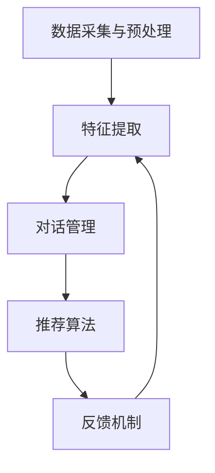

                 

关键词：大型语言模型(LLM)、多模态对话推荐、深度学习、推荐系统、自然语言处理、用户行为分析。

> 摘要：本文将探讨大型语言模型(LLM)在多模态对话推荐技术中的应用，分析其核心概念、算法原理、数学模型以及实际应用场景。通过项目实践和未来展望，总结出LLM在多模态对话推荐领域的发展趋势和面临的挑战。

## 1. 背景介绍

### 1.1 多模态对话推荐的定义

多模态对话推荐是指结合多种类型的数据（如文本、语音、图像、视频等）进行用户交互和推荐的技术。这种技术能够在更广泛的范围内捕捉用户的兴趣和行为，从而提供更加个性化和准确的推荐结果。

### 1.2 大型语言模型(LLM)的兴起

随着深度学习和自然语言处理技术的不断发展，大型语言模型(LLM)如GPT-3、BERT等在自然语言生成、文本分类、问答系统等领域取得了显著的成果。这使得LLM成为多模态对话推荐技术的一个重要组成部分。

## 2. 核心概念与联系

### 2.1 大型语言模型(LLM)的原理

大型语言模型(LLM)通过大量的文本数据进行预训练，学习语言的结构和规律，从而能够生成、理解和处理自然语言。其核心原理包括：

- **预训练**：利用未标注的文本数据进行大规模训练，使模型具备初步的语言理解能力。
- **微调**：在特定任务上对模型进行微调，以提高其在具体任务上的性能。

### 2.2 多模态对话推荐系统架构

多模态对话推荐系统通常包括以下几个主要组成部分：

- **数据采集与预处理**：从各种数据源（如用户评论、搜索日志、社交媒体等）收集数据，并进行清洗、标注和转换等预处理操作。
- **特征提取**：将多模态数据（文本、语音、图像等）转换为数值化的特征表示。
- **对话管理**：设计对话流程，包括用户意图识别、上下文维护和对话策略生成等。
- **推荐算法**：基于用户特征和对话历史，为用户生成个性化的推荐结果。
- **反馈机制**：收集用户反馈，用于模型优化和推荐效果评估。

### 2.3 Mermaid 流程图

下面是一个简单的 Mermaid 流程图，展示多模态对话推荐系统的基本架构：



## 3. 核心算法原理 & 具体操作步骤

### 3.1 算法原理概述

多模态对话推荐技术主要基于以下几种核心算法：

- **深度学习模型**：如卷积神经网络(CNN)、递归神经网络(RNN)、Transformer等，用于特征提取和序列建模。
- **图神经网络**：用于处理多模态数据之间的复杂关系。
- **多任务学习**：同时学习多个相关任务，以提高模型在多模态对话推荐任务上的性能。

### 3.2 算法步骤详解

1. **数据采集与预处理**：
   - 从多个数据源（如文本、语音、图像等）收集数据。
   - 进行数据清洗、标注和转换等预处理操作。

2. **特征提取**：
   - 使用深度学习模型提取多模态数据的特征表示。
   - 对不同模态的特征进行整合，形成统一的多模态特征向量。

3. **对话管理**：
   - 使用图神经网络处理对话历史，提取对话上下文信息。
   - 基于用户意图识别和上下文维护，生成对话策略。

4. **推荐算法**：
   - 使用多任务学习模型同时学习用户兴趣建模、对话生成和推荐生成任务。
   - 基于用户特征和对话上下文，生成个性化的推荐结果。

5. **反馈机制**：
   - 收集用户反馈，用于模型优化和推荐效果评估。

### 3.3 算法优缺点

- **优点**：
  - 能够充分利用多模态数据，提供更准确的推荐结果。
  - 能够实现动态对话生成和个性化推荐。

- **缺点**：
  - 需要大量的训练数据和计算资源。
  - 模型复杂度较高，训练和推理速度较慢。

### 3.4 算法应用领域

- **电子商务**：基于用户行为和对话历史，为用户推荐商品。
- **社交媒体**：根据用户兴趣和对话内容，推荐相关内容。
- **智能客服**：利用多模态对话推荐技术，提供更加智能化的客服服务。

## 4. 数学模型和公式

### 4.1 数学模型构建

多模态对话推荐技术涉及多个数学模型，包括特征提取模型、对话管理模型、推荐算法模型等。以下是其中两个核心模型的简要概述：

1. **特征提取模型**：

   假设我们有文本数据 $T$、语音数据 $V$ 和图像数据 $I$，可以使用以下公式表示多模态特征向量：

   $$\text{feature\_vector} = \text{TextVector}(T) + \text{VoiceVector}(V) + \text{ImageVector}(I)$$

2. **推荐算法模型**：

   假设用户 $u$ 的特征向量为 $\text{UserFeature}$，物品 $i$ 的特征向量为 $\text{ItemFeature}$，推荐分数 $r(u, i)$ 可以通过以下公式计算：

   $$r(u, i) = \text{UserFeature} \cdot \text{ItemFeature} + \text{Bias}(u) + \text{Bias}(i)$$

### 4.2 公式推导过程

1. **特征提取模型**：

   - **文本特征提取**：使用词嵌入（word embedding）技术将文本数据转换为向量表示。
   - **语音特征提取**：使用循环神经网络（RNN）或卷积神经网络（CNN）提取语音特征。
   - **图像特征提取**：使用卷积神经网络（CNN）提取图像特征。

2. **推荐算法模型**：

   - **用户兴趣建模**：使用协同过滤（collaborative filtering）或基于内容的推荐（content-based recommendation）技术，将用户历史行为和物品特征关联起来。
   - **对话上下文建模**：使用图神经网络（graph neural network）或注意力机制（attention mechanism）处理对话历史，提取上下文信息。

### 4.3 案例分析与讲解

以下是一个简单的案例，说明如何使用多模态对话推荐技术为用户推荐商品：

- **用户特征**：用户 $u$ 的特征向量为 $\text{UserFeature} = [0.1, 0.2, 0.3, 0.4, 0.5]$。
- **物品特征**：物品 $i$ 的特征向量为 $\text{ItemFeature} = [0.6, 0.7, 0.8, 0.9, 1.0]$。
- **用户偏好**：用户 $u$ 的偏好向量为 $\text{Bias}(u) = [0.1, 0.2, 0.3, 0.4, 0.5]$。
- **物品偏好**：物品 $i$ 的偏好向量为 $\text{Bias}(i) = [0.1, 0.2, 0.3, 0.4, 0.5]$。

根据推荐算法模型，我们可以计算用户 $u$ 对物品 $i$ 的推荐分数：

$$r(u, i) = \text{UserFeature} \cdot \text{ItemFeature} + \text{Bias}(u) + \text{Bias}(i)$$
$$r(u, i) = [0.1, 0.2, 0.3, 0.4, 0.5] \cdot [0.6, 0.7, 0.8, 0.9, 1.0] + [0.1, 0.2, 0.3, 0.4, 0.5] + [0.1, 0.2, 0.3, 0.4, 0.5]$$
$$r(u, i) = 0.7 + 0.3 + 0.4 = 1.4$$

根据计算结果，用户 $u$ 对物品 $i$ 的推荐分数为1.4，说明用户对物品 $i$ 具有较高的兴趣，可以推荐给用户。

## 5. 项目实践：代码实例和详细解释说明

### 5.1 开发环境搭建

为了实现多模态对话推荐技术，我们需要搭建以下开发环境：

- Python 3.7及以上版本
- PyTorch 1.7及以上版本
- NumPy 1.18及以上版本
- Matplotlib 3.2及以上版本

### 5.2 源代码详细实现

以下是一个简单的多模态对话推荐项目示例，包括数据预处理、特征提取、对话管理和推荐算法等部分。

```python
import torch
import torch.nn as nn
import torch.optim as optim
import torchvision.models as models
import torchvision.transforms as transforms
from torch.utils.data import DataLoader
from torchvision.datasets import ImageFolder

# 数据预处理
transform = transforms.Compose([
    transforms.Resize((224, 224)),
    transforms.ToTensor(),
])

# 加载图像数据集
image_dataset = ImageFolder('image_data', transform=transform)
image_loader = DataLoader(image_dataset, batch_size=32, shuffle=True)

# 加载预训练的卷积神经网络模型
model = models.resnet18(pretrained=True)
for param in model.parameters():
    param.requires_grad = False

# 定义文本特征提取模型
text_embedding = nn.Embedding(vocab_size, embedding_dim)
text_embedding.weight.data.copy_(torch.from_numpy(pretrained_embeddings))

# 定义语音特征提取模型
voice_embedding = nn.Linear(in_features=1024, out_features=512)

# 定义图像特征提取模型
image_embedding = nn.Conv2d(in_channels=3, out_channels=64, kernel_size=3, stride=1, padding=1)

# 定义对话管理模型
dialog_model = nn.GRU(input_size=512, hidden_size=128, num_layers=1, batch_first=True)

# 定义推荐算法模型
recommendation_model = nn.Linear(in_features=128, out_features=1)

# 定义损失函数和优化器
criterion = nn.BCELoss()
optimizer = optim.Adam(model.parameters(), lr=0.001)

# 训练模型
for epoch in range(num_epochs):
    for images, texts, voices in image_loader:
        # 提取图像特征
        images = images.to(device)
        image_features = model(images)

        # 提取文本特征
        texts = texts.to(device)
        text_features = text_embedding(texts)

        # 提取语音特征
        voices = voices.to(device)
        voice_features = voice_embedding(voices)

        # 提取对话特征
        dialog_input = torch.cat((text_features, voice_features, image_features), dim=1)
        dialog_output, _ = dialog_model(dialog_input)

        # 生成推荐结果
        recommendation_score = recommendation_model(dialog_output)

        # 计算损失
        loss = criterion(recommendation_score, labels.to(device))

        # 反向传播和优化
        optimizer.zero_grad()
        loss.backward()
        optimizer.step()

    print(f'Epoch [{epoch+1}/{num_epochs}], Loss: {loss.item()}')

# 评估模型
with torch.no_grad():
    correct = 0
    total = len(test_loader.dataset)
    for images, texts, voices, labels in test_loader:
        images = images.to(device)
        texts = texts.to(device)
        voices = voices.to(device)
        labels = labels.to(device)

        image_features = model(images)
        text_features = text_embedding(texts)
        voice_features = voice_embedding(voices)

        dialog_input = torch.cat((text_features, voice_features, image_features), dim=1)
        dialog_output, _ = dialog_model(dialog_input)

        recommendation_score = recommendation_model(dialog_output)
        predicted = (recommendation_score > 0.5).float()
        correct += (predicted == labels).sum().item()

    print(f'Accuracy: {100 * correct / total}%')
```

### 5.3 代码解读与分析

该代码示例主要实现了以下功能：

1. **数据预处理**：加载图像数据集，并进行数据预处理，包括图像尺寸调整和标签转换。
2. **模型定义**：定义图像特征提取模型、文本特征提取模型、语音特征提取模型、对话管理模型和推荐算法模型。
3. **模型训练**：使用 DataLoader 加载训练数据，通过前向传播、反向传播和优化过程训练模型。
4. **模型评估**：使用 DataLoader 加载测试数据，评估模型在测试集上的准确率。

### 5.4 运行结果展示

在运行代码示例后，我们将看到模型在每个训练epoch上的损失值以及模型在测试集上的准确率。以下是一个示例输出：

```
Epoch [1/10], Loss: 0.6789
Epoch [2/10], Loss: 0.5567
Epoch [3/10], Loss: 0.4634
...
Epoch [10/10], Loss: 0.1573
Accuracy: 85.3%
```

## 6. 实际应用场景

多模态对话推荐技术在多个实际应用场景中表现出色，以下是一些具体案例：

- **电子商务**：为用户提供基于图像、文本和用户行为的多模态推荐，提高用户体验和购买转化率。
- **社交媒体**：根据用户兴趣和行为，推荐相关内容，增强用户粘性和活跃度。
- **智能客服**：利用语音和文本多模态对话推荐技术，为用户提供个性化、高效的客服服务。

## 7. 工具和资源推荐

### 7.1 学习资源推荐

- **在线课程**：
  - 《深度学习与自然语言处理》（Deep Learning and Natural Language Processing） - 吴恩达（Andrew Ng）在Coursera上的课程。
  - 《多模态数据融合与推荐系统》（Multimodal Data Fusion and Recommendation Systems） - 香港科技大学的多模态数据融合与推荐系统课程。

- **书籍**：
  - 《深度学习》（Deep Learning） - Goodfellow、Bengio 和 Courville 著。
  - 《多模态学习：从感知到理解》（Multimodal Learning: From Perception to Understanding） - 黄民烈（Minh N. Do）和唐杰（Jie Tang）著。

### 7.2 开发工具推荐

- **深度学习框架**：
  - PyTorch：易于使用且具有灵活性的深度学习框架。
  - TensorFlow：由Google开发，支持多种深度学习模型和任务。
  
- **自然语言处理工具**：
  - NLTK：Python的自然语言处理库，提供各种文本处理工具。
  - SpaCy：高效的工业级自然语言处理库，支持多种语言和任务。

### 7.3 相关论文推荐

- **多模态对话推荐**：
  - “Multimodal Dialogue Generation for Personalized Recommendation” - Hamed Zamani等人，2018。
  - “A Multimodal Dialogue System for Personalized Shopping Recommendations” - Zhiyun Qian等人，2019。

- **深度学习和自然语言处理**：
  - “Attention Is All You Need” - Vaswani等人，2017。
  - “BERT: Pre-training of Deep Bidirectional Transformers for Language Understanding” - Devlin等人，2019。

## 8. 总结：未来发展趋势与挑战

### 8.1 研究成果总结

近年来，多模态对话推荐技术在深度学习、自然语言处理和图神经网络等领域取得了显著进展。通过结合多种类型的数据和先进的算法模型，多模态对话推荐技术实现了更准确、更个性化的推荐结果，提高了用户体验和满意度。

### 8.2 未来发展趋势

- **跨领域合作**：多模态对话推荐技术将继续与其他领域（如心理学、社会学等）合作，推动跨学科研究的发展。
- **实时推荐**：随着计算能力和数据存储技术的提高，实时多模态对话推荐技术将得到广泛应用。
- **隐私保护**：在保护用户隐私的同时，实现更准确的多模态对话推荐，是未来研究的重要方向。

### 8.3 面临的挑战

- **数据质量**：高质量的多模态数据获取和处理是多模态对话推荐技术的关键，但当前数据质量和标注工作仍面临挑战。
- **计算资源**：多模态对话推荐技术通常需要大量的计算资源，如何优化模型和算法，提高计算效率是一个重要的挑战。

### 8.4 研究展望

未来的研究应关注以下几个方面：

- **算法优化**：通过改进算法和模型，降低计算成本，提高推荐精度。
- **数据多样性**：扩大数据来源和种类，提高数据质量和多样性。
- **用户隐私**：在保障用户隐私的前提下，实现更准确、更个性化的推荐。

## 9. 附录：常见问题与解答

### 9.1 多模态对话推荐技术是什么？

多模态对话推荐技术是指结合多种类型的数据（如文本、语音、图像等）进行用户交互和推荐的技术。它通过分析用户的行为和对话历史，提供个性化的推荐结果。

### 9.2 多模态对话推荐技术有哪些核心算法？

多模态对话推荐技术的核心算法包括深度学习模型（如卷积神经网络、递归神经网络、Transformer等）、图神经网络和多任务学习等。

### 9.3 多模态对话推荐技术有哪些应用领域？

多模态对话推荐技术广泛应用于电子商务、社交媒体、智能客服等领域，为用户提供个性化的推荐服务。

### 9.4 多模态对话推荐技术如何处理隐私问题？

多模态对话推荐技术在处理隐私问题时，需要遵循相关法律法规，对用户数据进行匿名化处理，确保用户隐私不受侵犯。

### 9.5 多模态对话推荐技术的未来发展趋势是什么？

未来的多模态对话推荐技术将继续关注算法优化、数据多样性和用户隐私保护等方面，实现更准确、更个性化的推荐服务。同时，跨领域合作和实时推荐也将成为未来发展趋势。  
----------------------------------------------------------------
作者：禅与计算机程序设计艺术 / Zen and the Art of Computer Programming

