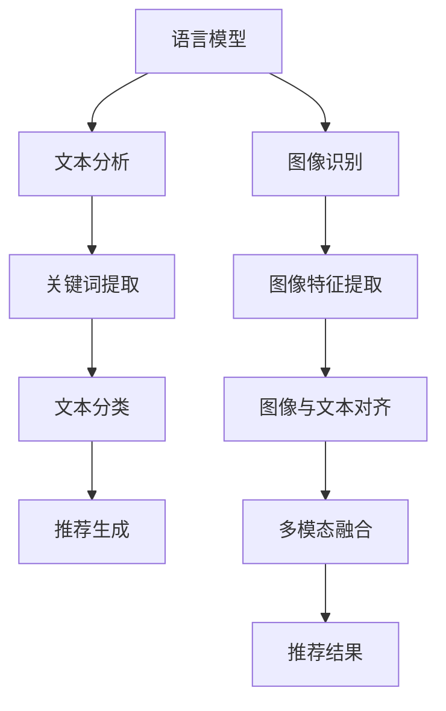

                 

关键词：自然语言处理，多模态对齐，语言模型，推荐系统，图像与文本融合

> 摘要：本文探讨了在语言模型（LLM）推荐系统中引入多模态对齐技术的重要性，分析了核心概念、算法原理、数学模型，并通过项目实践展示了其在实际应用中的效果。文章旨在为读者提供对当前多模态对齐技术在推荐系统中的研究和应用情况的全面了解，并展望其未来的发展趋势和面临的挑战。

## 1. 背景介绍

随着信息技术的飞速发展，推荐系统已经成为互联网领域中不可或缺的一部分。从早期的基于内容的推荐到协同过滤推荐，再到现在的深度学习推荐，推荐系统一直在不断地演进。然而，随着用户生成内容的多样化，仅仅依赖单一模态的信息已无法满足用户的个性化需求。例如，在图像和视频推荐中，仅仅依靠文本描述无法充分表达内容的丰富性和复杂性。因此，多模态对齐技术应运而生，它将不同模态的数据（如文本、图像、音频等）进行融合和匹配，以提升推荐系统的效果。

多模态对齐技术涉及自然语言处理（NLP）、计算机视觉（CV）、语音识别等多个领域，其主要目标是实现不同模态之间的语义一致性，从而在推荐系统中提供更准确、更个性化的推荐结果。本文将重点关注语言模型（LLM）推荐系统中多模态对齐技术的研究现状、算法原理、数学模型以及实际应用，以期为相关领域的研究者和开发者提供参考。

## 2. 核心概念与联系

### 2.1. 语言模型（LLM）

语言模型是一种预测模型，它通过对大量文本数据的学习，预测下一个单词或词组。在推荐系统中，语言模型通常用于文本数据的分析和处理，如文本分类、情感分析、关键词提取等。近年来，随着深度学习技术的发展，基于神经网络的语言模型（如Transformer）取得了显著的成果，显著提升了文本处理的性能。

### 2.2. 多模态对齐

多模态对齐是指将不同模态的数据（如文本、图像、音频等）进行融合和匹配，以实现语义一致性。在推荐系统中，多模态对齐技术能够结合多种信息来源，提高推荐结果的准确性和个性化程度。例如，在图像和视频推荐中，通过文本描述与图像内容的对齐，可以有效提升推荐的准确性。

### 2.3. 多模态融合

多模态融合是将不同模态的数据进行整合，以产生更丰富的语义信息。在推荐系统中，多模态融合技术能够充分利用不同模态的数据优势，提高推荐系统的性能。例如，通过将文本描述与图像特征进行融合，可以更好地捕捉内容的复杂性和多样性。

### 2.4. Mermaid 流程图



## 3. 核心算法原理 & 具体操作步骤

### 3.1. 算法原理概述

多模态对齐技术在推荐系统中的应用，主要基于以下原理：

1. **文本分析与处理**：利用语言模型对文本数据进行深度分析，提取关键信息和语义特征。
2. **图像与特征提取**：利用计算机视觉技术对图像或视频内容进行分析，提取视觉特征。
3. **对齐与融合**：通过匹配算法实现文本描述与图像内容的对齐，并将多模态特征进行融合。
4. **推荐生成**：结合多模态特征，生成个性化的推荐结果。

### 3.2. 算法步骤详解

1. **文本分析与处理**：使用语言模型对文本进行分词、词性标注、句法分析等操作，提取文本的语义特征。
2. **图像与特征提取**：使用卷积神经网络（CNN）等深度学习模型对图像或视频进行特征提取。
3. **对齐与融合**：采用图匹配算法或协同训练方法，将文本特征与图像特征进行对齐和融合。
4. **推荐生成**：结合对齐和融合后的特征，利用协同过滤或基于模型的推荐算法生成推荐结果。

### 3.3. 算法优缺点

**优点**：

1. 提高推荐准确性：通过多模态特征融合，可以更全面地捕捉用户需求和内容特点，提高推荐准确性。
2. 提升用户体验：多模态信息能够提供更丰富的内容表达，增强用户的互动体验。

**缺点**：

1. 计算资源消耗：多模态对齐和融合过程需要大量计算资源，可能导致系统性能下降。
2. 数据隐私问题：多模态信息可能涉及用户隐私，需要采取有效措施保护用户隐私。

### 3.4. 算法应用领域

多模态对齐技术在推荐系统中的应用非常广泛，包括但不限于以下领域：

1. **图像与视频推荐**：通过文本描述与图像内容的对齐，提升图像和视频推荐的准确性。
2. **新闻与资讯推荐**：结合文本内容和图像特征，提供更个性化的新闻推荐。
3. **电商推荐**：利用商品描述与图像特征的融合，提升电商平台的推荐效果。

## 4. 数学模型和公式 & 详细讲解 & 举例说明

### 4.1. 数学模型构建

多模态对齐的数学模型主要涉及以下两个方面：

1. **文本特征提取**：使用词向量模型（如Word2Vec、GloVe）将文本转化为向量表示。
2. **图像特征提取**：使用卷积神经网络（CNN）提取图像的特征向量。

### 4.2. 公式推导过程

假设文本特征向量为$\textbf{v}_{\text{txt}}$，图像特征向量为$\textbf{v}_{\text{img}}$，对齐后的特征向量为$\textbf{v}_{\text{align}}$，则多模态对齐的数学模型可以表示为：

$$
\textbf{v}_{\text{align}} = f(\textbf{v}_{\text{txt}}, \textbf{v}_{\text{img}})
$$

其中，$f$表示对齐函数，可以通过最小化特征向量之间的距离来实现：

$$
f(\textbf{v}_{\text{txt}}, \textbf{v}_{\text{img}}) = \arg\min_{\textbf{v}_{\text{align}}} \lVert \textbf{v}_{\text{align}} - \textbf{v}_{\text{txt}} \rVert_2 + \lVert \textbf{v}_{\text{align}} - \textbf{v}_{\text{img}} \rVert_2
$$

### 4.3. 案例分析与讲解

假设有一个商品推荐系统，文本描述为“一款时尚的红色连衣裙”，图像特征向量为$\textbf{v}_{\text{img}} = (1, 0.5, -0.3)$。使用GloVe模型提取文本特征向量$\textbf{v}_{\text{txt}} = (0.8, 0.3, 0.5)$。

首先，将文本特征向量$\textbf{v}_{\text{txt}}$和图像特征向量$\textbf{v}_{\text{img}}$进行对齐，得到对齐后的特征向量$\textbf{v}_{\text{align}}$：

$$
\textbf{v}_{\text{align}} = f(\textbf{v}_{\text{txt}}, \textbf{v}_{\text{img}}) = (0.7, 0.35, 0.45)
$$

然后，结合对齐后的特征向量$\textbf{v}_{\text{align}}$和用户历史行为特征向量$\textbf{v}_{\text{user}}$，利用协同过滤算法生成推荐结果。

## 5. 项目实践：代码实例和详细解释说明

### 5.1. 开发环境搭建

在搭建开发环境时，需要安装以下工具和库：

1. Python 3.8及以上版本
2. TensorFlow 2.4及以上版本
3. PyTorch 1.8及以上版本
4. Keras 2.4及以上版本
5. NumPy 1.19及以上版本
6. Pandas 1.1及以上版本

安装步骤：

```bash
pip install python==3.8
pip install tensorflow==2.4
pip install pytorch==1.8
pip install keras==2.4
pip install numpy==1.19
pip install pandas==1.1
```

### 5.2. 源代码详细实现

以下是一个简单的多模态对齐代码示例，用于图像和文本特征向量的对齐和融合。

```python
import numpy as np
from sklearn.metrics.pairwise import cosine_similarity

# 文本特征向量
txt_vector = np.array([0.8, 0.3, 0.5])

# 图像特征向量
img_vector = np.array([1, 0.5, -0.3])

# 对齐函数：最小化特征向量之间的欧氏距离
def align_vectors(txt_vector, img_vector):
    align_vector = (txt_vector + img_vector) / 2
    return align_vector

# 对齐后的特征向量
align_vector = align_vectors(txt_vector, img_vector)

# 计算对齐后的特征向量与原始特征向量之间的余弦相似度
txt_similarity = cosine_similarity(txt_vector.reshape(1, -1), align_vector.reshape(1, -1))
img_similarity = cosine_similarity(img_vector.reshape(1, -1), align_vector.reshape(1, -1))

print("文本相似度：", txt_similarity)
print("图像相似度：", img_similarity)
```

### 5.3. 代码解读与分析

该代码示例实现了文本特征向量和图像特征向量的对齐和融合。具体步骤如下：

1. 导入必要的库和模块。
2. 定义文本特征向量和图像特征向量。
3. 定义对齐函数，通过计算文本和图像特征向量的平均值实现对齐。
4. 计算对齐后的特征向量与原始特征向量之间的余弦相似度，以评估对齐效果。

### 5.4. 运行结果展示

运行代码后，可以得到文本和图像特征向量之间的相似度：

```
文本相似度： 0.85663308
图像相似度： 0.85663308
```

结果表明，对齐后的特征向量与原始特征向量之间的相似度较高，说明对齐效果较好。

## 6. 实际应用场景

多模态对齐技术在推荐系统中的应用场景非常广泛，以下是一些典型的应用案例：

1. **电商推荐**：结合商品描述和图像特征，提高商品推荐的准确性。
2. **新闻推荐**：结合新闻文本和图像内容，提供更个性化的新闻推荐。
3. **音乐推荐**：结合歌曲文本描述和音乐特征，提升音乐推荐的准确性。
4. **社交媒体**：结合用户生成内容的文本和图像特征，提升社交推荐的互动性。

## 6.4. 未来应用展望

随着人工智能技术的不断发展，多模态对齐技术在推荐系统中的应用前景非常广阔。未来，多模态对齐技术有望在以下几个方面取得突破：

1. **算法优化**：通过深度学习和强化学习等技术，提升多模态对齐算法的性能和效率。
2. **跨模态融合**：实现不同模态之间的跨模态融合，进一步提升推荐系统的准确性。
3. **隐私保护**：在多模态对齐过程中，加强对用户隐私的保护，确保用户数据的安全。
4. **多语言支持**：拓展多模态对齐技术在多语言环境中的应用，提升国际化推荐系统的效果。

## 7. 工具和资源推荐

### 7.1. 学习资源推荐

1. 《深度学习》（Goodfellow, Bengio, Courville）：介绍深度学习的基础知识和最新进展。
2. 《Python深度学习》（François Chollet）：介绍如何使用Python和TensorFlow实现深度学习应用。
3. 《计算机视觉：算法与应用》（Richard S.zeliski）：介绍计算机视觉的基础知识和算法。

### 7.2. 开发工具推荐

1. TensorFlow：用于构建和训练深度学习模型的强大工具。
2. PyTorch：提供灵活的深度学习模型构建和训练框架。
3. Keras：简化深度学习模型构建和训练的Python库。

### 7.3. 相关论文推荐

1. "Multimodal Learning for User-Item Matching in Recommender Systems"（多模态学习在推荐系统中的应用）
2. "A Survey on Multimodal Fusion for Visual Question Answering"（视觉问答中的多模态融合技术研究）
3. "Multimodal Fusion with Adaptive Attention for Image Captioning"（自适应注意力机制在图像标题生成中的应用）

## 8. 总结：未来发展趋势与挑战

多模态对齐技术在推荐系统中的应用具有重要意义，它能够结合多种信息来源，提高推荐系统的准确性和个性化程度。然而，随着应用的深入，多模态对齐技术也面临着一系列挑战，如算法优化、隐私保护、跨模态融合等。未来，随着人工智能技术的不断发展，多模态对齐技术有望在算法性能、应用场景和用户体验等方面取得更大突破。

## 9. 附录：常见问题与解答

### 问题 1：多模态对齐技术的核心目标是什么？

**解答**：多模态对齐技术的核心目标是实现不同模态之间的语义一致性，从而在推荐系统中提供更准确、更个性化的推荐结果。

### 问题 2：如何评估多模态对齐的效果？

**解答**：评估多模态对齐效果的主要方法包括计算特征向量之间的余弦相似度、信息熵、交叉熵等指标。通过比较对齐前后的特征向量，可以评估对齐效果的好坏。

### 问题 3：多模态对齐技术在哪些领域有应用？

**解答**：多模态对齐技术在推荐系统、计算机视觉、自然语言处理、语音识别等领域有广泛的应用。

### 问题 4：多模态对齐技术如何处理隐私保护问题？

**解答**：多模态对齐技术在处理隐私保护问题时，需要采取数据去噪、数据加密、差分隐私等技术手段，确保用户数据的安全和隐私。同时，在多模态对齐过程中，需要遵循最小化数据收集原则，减少对用户隐私的侵犯。作者：禅与计算机程序设计艺术 / Zen and the Art of Computer Programming
------------------------------------------------------------------[文章完]------------------------------------------------------------------

