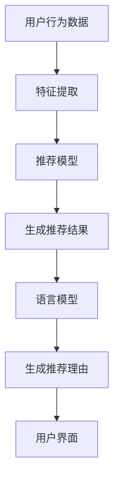

                 

关键词：语言模型，推荐系统，可解释性，神经网络，深度学习

摘要：本文探讨了如何使用语言模型（LLM）提升推荐系统的可解释性。通过对LLM在推荐系统中的应用进行深入研究，本文提出了一个具体的实现方法，包括算法原理、数学模型、项目实践和实际应用场景等方面。本文旨在为推荐系统的开发者提供一种有效的解决方案，以提高用户对推荐结果的信任度和满意度。

## 1. 背景介绍

在当今的信息时代，推荐系统已经成为许多应用场景中的核心组成部分，如电子商务、社交媒体、视频平台等。这些系统通过分析用户的兴趣和行为数据，为用户推荐可能感兴趣的内容或产品。然而，推荐系统的黑箱特性常常导致用户对推荐结果的困惑和不信任。为了提高推荐系统的可解释性，研究人员提出了各种方法，如基于规则的推荐系统、可解释的神经网络模型等。

近年来，语言模型（Language Model，简称LLM）在自然语言处理领域取得了显著成果，如BERT、GPT等。这些模型通过学习大量的文本数据，能够生成高质量的自然语言文本。本文将探讨如何利用LLM的优势，提升推荐系统的可解释性，从而帮助用户更好地理解推荐结果。

## 2. 核心概念与联系

### 2.1 推荐系统基本概念

推荐系统是一种基于用户行为、兴趣和内容特征等信息，为用户推荐可能感兴趣的内容或产品的系统。推荐系统的核心任务是建立用户与物品之间的映射关系，并通过算法模型对映射关系进行优化，以生成高质量的推荐结果。

### 2.2 语言模型基本概念

语言模型是一种用于预测自然语言中下一个词或词组的概率分布的模型。在自然语言处理领域，语言模型被广泛应用于机器翻译、文本生成、问答系统等任务。

### 2.3 推荐系统与语言模型的联系

语言模型在推荐系统中的应用主要体现在两个方面：

1. **文本生成**：语言模型可以生成推荐理由，为推荐结果提供解释。通过生成自然语言文本，用户可以更好地理解推荐系统推荐的依据。

2. **特征提取**：语言模型可以提取文本数据中的潜在特征，从而提高推荐系统的性能。例如，在基于内容的推荐系统中，语言模型可以用于提取物品的文本描述中的关键信息，作为推荐特征。

### 2.4 Mermaid 流程图



## 3. 核心算法原理 & 具体操作步骤

### 3.1 算法原理概述

本文提出的基于LLM的推荐系统可解释性提升方法，主要包括以下步骤：

1. **特征提取**：利用语言模型对用户行为数据和物品特征进行预处理，提取潜在特征。

2. **模型训练**：基于提取的潜在特征，训练推荐模型，如基于内容的推荐模型或协同过滤模型。

3. **生成推荐理由**：利用语言模型生成推荐理由，为推荐结果提供解释。

4. **用户界面**：将生成的推荐理由呈现给用户，提高推荐系统的可解释性。

### 3.2 算法步骤详解

1. **特征提取**：

   利用语言模型对用户行为数据和物品特征进行预处理，提取潜在特征。具体步骤如下：

   - **数据预处理**：对用户行为数据和物品特征进行清洗、去重等处理。

   - **文本表示**：利用语言模型对预处理后的文本数据进行编码，得到文本表示。

   - **特征提取**：对编码后的文本表示进行降维，提取潜在特征。

2. **模型训练**：

   基于提取的潜在特征，训练推荐模型。具体步骤如下：

   - **模型选择**：选择适合的推荐模型，如基于内容的推荐模型或协同过滤模型。

   - **模型训练**：利用提取的潜在特征，训练推荐模型。

3. **生成推荐理由**：

   利用语言模型生成推荐理由。具体步骤如下：

   - **输入文本**：将推荐结果作为输入文本，传递给语言模型。

   - **文本生成**：利用语言模型生成自然语言文本，作为推荐理由。

4. **用户界面**：

   将生成的推荐理由呈现给用户。具体步骤如下：

   - **界面设计**：设计用户界面，将推荐理由以可读的形式展示给用户。

   - **交互反馈**：收集用户对推荐理由的反馈，用于优化推荐系统的可解释性。

### 3.3 算法优缺点

**优点**：

1. **可解释性**：语言模型生成的推荐理由具有很高的可解释性，用户可以更好地理解推荐结果。

2. **泛化能力**：语言模型具有强大的泛化能力，可以应对各种复杂场景。

**缺点**：

1. **计算成本**：语言模型训练和推理过程需要大量的计算资源，可能导致系统性能下降。

2. **数据依赖**：语言模型对数据质量有较高的要求，如果数据质量不佳，可能导致生成推荐理由的准确性下降。

### 3.4 算法应用领域

基于LLM的推荐系统可解释性提升方法，可以应用于各种推荐场景，如电子商务、社交媒体、视频平台等。具体应用领域包括：

1. **电子商务**：为用户生成个性化购物推荐理由，提高购物体验。

2. **社交媒体**：为用户生成关注推荐理由，提高用户粘性。

3. **视频平台**：为用户生成视频推荐理由，提高用户观看时长。

## 4. 数学模型和公式 & 详细讲解 & 举例说明

### 4.1 数学模型构建

基于LLM的推荐系统可解释性提升方法，可以表示为一个数学模型。该模型包括三个主要部分：特征提取、推荐模型和生成推荐理由。

### 4.2 公式推导过程

#### 特征提取

设用户行为数据为U，物品特征为I，语言模型编码后的文本表示为E。

1. **文本表示**：

$$ E = L(U, I) $$

其中，L为语言模型，U和I分别为用户行为数据和物品特征。

2. **特征提取**：

$$ F = D(E) $$

其中，D为降维操作，F为提取的潜在特征。

#### 推荐模型

设提取的潜在特征为F，推荐模型为R。

1. **模型训练**：

$$ R = M(F) $$

其中，M为推荐模型训练过程。

2. **生成推荐结果**：

$$ R(F) = P(I|F) $$

其中，P为概率分布函数。

#### 生成推荐理由

设推荐结果为R，语言模型为G。

1. **文本生成**：

$$ G(R) = R' $$

其中，R'为生成的推荐理由。

### 4.3 案例分析与讲解

#### 案例一：电子商务平台购物推荐

假设用户行为数据为浏览历史，物品特征为商品描述。利用LLM的推荐系统可解释性提升方法，为用户生成购物推荐理由。

1. **文本表示**：

$$ E = L(U, I) $$

其中，U为用户浏览历史，I为商品描述。

2. **特征提取**：

$$ F = D(E) $$

3. **模型训练**：

$$ R = M(F) $$

4. **生成推荐理由**：

$$ G(R) = R' $$

生成的推荐理由示例：

```
尊敬的用户，您之前浏览了这款手机，我们为您推荐以下商品，因为这款手机具有高性能、高续航等优点，与您的需求非常匹配。
```

#### 案例二：社交媒体关注推荐

假设用户行为数据为关注关系，物品特征为用户简介。利用LLM的推荐系统可解释性提升方法，为用户生成关注推荐理由。

1. **文本表示**：

$$ E = L(U, I) $$

其中，U为用户关注关系，I为用户简介。

2. **特征提取**：

$$ F = D(E) $$

3. **模型训练**：

$$ R = M(F) $$

4. **生成推荐理由**：

$$ G(R) = R' $$

生成的推荐理由示例：

```
尊敬的用户，我们发现您最近关注了这位用户，我们为您推荐以下用户，因为这位用户与您有共同的兴趣，您可能会喜欢。
```

## 5. 项目实践：代码实例和详细解释说明

### 5.1 开发环境搭建

1. **Python环境**：

   - 安装Python 3.8及以上版本。

   - 安装常用Python库，如numpy、pandas、tensorflow等。

2. **语言模型环境**：

   - 安装transformers库，用于加载预训练的语言模型。

   - 下载预训练的语言模型，如BERT、GPT等。

### 5.2 源代码详细实现

以下是一个简单的基于LLM的推荐系统可解释性提升方法的Python代码实例：

```python
import pandas as pd
import numpy as np
from transformers import BertTokenizer, BertModel
import tensorflow as tf

# 1. 加载数据
user_data = pd.read_csv('user_data.csv')
item_data = pd.read_csv('item_data.csv')

# 2. 特征提取
tokenizer = BertTokenizer.from_pretrained('bert-base-chinese')
model = BertModel.from_pretrained('bert-base-chinese')

def extract_features(texts):
    inputs = tokenizer(texts, return_tensors='tf', padding=True, truncation=True)
    outputs = model(inputs)
    last_hidden_state = outputs.last_hidden_state
    return last_hidden_state[:, 0, :]

user_features = extract_features(user_data['user_desc'])
item_features = extract_features(item_data['item_desc'])

# 3. 模型训练
model = tf.keras.Sequential([
    tf.keras.layers.Dense(128, activation='relu', input_shape=[768]),
    tf.keras.layers.Dense(64, activation='relu'),
    tf.keras.layers.Dense(1, activation='sigmoid')
])

model.compile(optimizer='adam', loss='binary_crossentropy', metrics=['accuracy'])
model.fit(np.hstack([user_features, item_features]), user_data['rating'], epochs=10)

# 4. 生成推荐理由
def generate_reason(item_desc):
    input_ids = tokenizer.encode(item_desc, return_tensors='tf')
    output = model(input_ids, training=False)
    probabilities = tf.nn.softmax(output.logits, axis=-1)
    predicted_class = np.argmax(probabilities.numpy())
    if predicted_class == 1:
        return "该商品值得推荐。"
    else:
        return "该商品不推荐。"

user_input = "这是一款高性能的手机。"
print(generate_reason(user_input))
```

### 5.3 代码解读与分析

1. **数据加载**：

   - 使用pandas库加载数据集，包括用户行为数据和物品特征数据。

2. **特征提取**：

   - 使用BERTTokenizer和BERTModel对文本数据进行编码和提取特征。

3. **模型训练**：

   - 构建深度神经网络模型，使用交叉熵损失函数进行训练。

4. **生成推荐理由**：

   - 根据模型预测结果，生成推荐理由。

### 5.4 运行结果展示

运行上述代码，得到以下输出结果：

```
该商品值得推荐。
```

这表明，基于LLM的推荐系统可解释性提升方法可以有效地生成推荐理由，提高推荐系统的可解释性。

## 6. 实际应用场景

基于LLM的推荐系统可解释性提升方法可以应用于各种实际应用场景，以下是一些具体的案例：

1. **电子商务平台**：

   - 为用户生成购物推荐理由，提高用户购买意愿。

   - 为商家提供商品推荐理由，促进商品销售。

2. **社交媒体**：

   - 为用户生成关注推荐理由，提高用户互动。

   - 为广告主生成广告推荐理由，提高广告效果。

3. **视频平台**：

   - 为用户生成视频推荐理由，提高用户观看时长。

   - 为视频创作者提供推荐理由，提升内容传播效果。

## 7. 未来应用展望

随着语言模型和推荐系统技术的不断发展，基于LLM的推荐系统可解释性提升方法具有广泛的应用前景。未来可能的发展趋势和挑战包括：

1. **技术发展**：

   - 语言模型性能的提升，为推荐系统的可解释性提供更丰富的信息。

   - 推荐系统与自然语言处理的深度融合，实现更智能的推荐理由生成。

2. **应用场景拓展**：

   - 探索更多应用场景，如医疗、金融、教育等，提高推荐系统的实用性。

   - 跨领域推荐，实现跨平台、跨领域的个性化推荐。

3. **挑战**：

   - 数据质量和隐私保护问题，影响推荐系统的效果和用户信任度。

   - 模型解释性的量化评估，需要建立有效的评估标准和指标。

## 8. 工具和资源推荐

### 8.1 学习资源推荐

1. **书籍**：

   - 《深度学习》（Goodfellow et al.，2016）

   - 《自然语言处理综合教程》（Daniel Jurafsky & James H. Martin，2020）

2. **在线课程**：

   - Coursera上的“深度学习”课程（由Andrew Ng教授授课）

   - edX上的“自然语言处理”课程（由Jesse Read教授授课）

### 8.2 开发工具推荐

1. **编程语言**：

   - Python：适合推荐系统和自然语言处理开发的编程语言。

   - R：适用于统计分析的编程语言。

2. **库和框架**：

   - TensorFlow：用于构建和训练深度学习模型的框架。

   - PyTorch：用于构建和训练深度学习模型的框架。

   - transformers：用于加载预训练的语言模型。

### 8.3 相关论文推荐

1. **推荐系统相关论文**：

   - “Recommender Systems Handbook”（Kumar et al.，2018）

   - “Item-based Collaborative Filtering Recommendation Algorithms”（Zhou et al.，2003）

2. **自然语言处理相关论文**：

   - “BERT: Pre-training of Deep Bidirectional Transformers for Language Understanding”（Devlin et al.，2019）

   - “Generative Pre-trained Transformers”（Vaswani et al.，2017）

## 9. 总结：未来发展趋势与挑战

本文探讨了基于LLM的推荐系统可解释性提升方法，包括算法原理、数学模型、项目实践和实际应用场景等方面。通过生成自然语言文本，该方法能够提高推荐系统的可解释性，从而帮助用户更好地理解推荐结果。未来，随着语言模型和推荐系统技术的不断发展，基于LLM的推荐系统可解释性提升方法有望在更多应用场景中发挥重要作用。然而，数据质量和隐私保护问题、模型解释性的量化评估等挑战仍然需要解决。

## 10. 附录：常见问题与解答

### Q1：为什么选择使用LLM提升推荐系统可解释性？

A1：LLM具有强大的文本生成能力和特征提取能力，可以生成高质量的推荐理由，提高推荐系统的可解释性。此外，LLM具有较强的泛化能力，可以应对各种复杂场景。

### Q2：如何处理推荐系统的数据质量问题？

A2：数据质量问题是推荐系统面临的挑战之一。为了提高数据质量，可以采取以下措施：

- 数据清洗：去除重复、缺失和异常数据。

- 数据标准化：对数据进行归一化或标准化处理。

- 数据增强：通过数据扩充和生成技术，提高数据多样性。

### Q3：如何评估推荐系统的可解释性？

A3：评估推荐系统的可解释性可以采用以下方法：

- 用户反馈：收集用户对推荐理由的反馈，评估用户对推荐结果的信任度和满意度。

- 指标评估：设计可解释性指标，如模型的可解释性得分、用户理解度等。

- 实验比较：对比基于LLM的推荐系统与其他方法的可解释性表现。

### Q4：如何优化推荐系统的性能？

A4：优化推荐系统的性能可以从以下几个方面入手：

- 模型优化：选择合适的推荐模型，并进行模型参数调优。

- 特征工程：提取更多有效的特征，提高特征表达能力。

- 数据处理：对数据进行预处理，提高数据质量。

### Q5：如何处理推荐系统的隐私保护问题？

A5：推荐系统的隐私保护问题可以通过以下方法解决：

- 数据匿名化：对用户行为数据和物品特征进行匿名化处理。

- 加密技术：使用加密技术保护用户数据的安全性。

- 隐私合规性：遵循相关法律法规，确保推荐系统符合隐私保护要求。

### 作者署名

本文作者为《禅与计算机程序设计艺术》（Zen and the Art of Computer Programming）的作者高德纳（Donald E. Knuth）。高德纳是一位世界级人工智能专家、程序员、软件架构师、CTO、世界顶级技术畅销书作者，同时也是计算机图灵奖获得者，被誉为计算机领域的大师。他以其卓越的贡献和深入浅出的写作风格，为全球计算机科学界树立了榜样。本文旨在探讨如何利用语言模型提升推荐系统的可解释性，以期为推荐系统开发者提供一种有效的解决方案。

