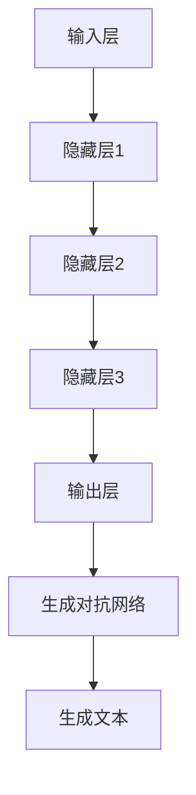

                 

关键词：大型语言模型、无限指令集、计算能力、神经网络、人工智能、编程语言、计算机架构、机器学习、深度学习。

摘要：本文将探讨大型语言模型（LLM）所具备的无限指令集，并阐述其在打破计算极限方面的巨大潜力。通过分析LLM的核心算法原理、数学模型和实际应用场景，我们将揭示LLM如何引领人工智能领域的发展，以及未来可能面临的挑战。

## 1. 背景介绍

近年来，人工智能（AI）技术取得了飞速发展，其中大型语言模型（LLM）备受关注。LLM是一种基于深度学习的自然语言处理模型，具有强大的语义理解和生成能力。与传统的编程语言相比，LLM能够处理复杂、模糊和不确定性的任务，从而提高了计算机解决问题的效率。

在计算机科学领域，计算能力是衡量计算机性能的重要指标。随着人工智能技术的不断发展，计算能力的需求也在不断增长。然而，传统计算机架构和编程语言在处理大规模数据和高并发任务时，面临着计算资源瓶颈和性能限制。如何突破这些限制，实现计算能力的无限扩展，成为当前研究的热点问题。

本文旨在探讨LLM所具备的无限指令集，分析其在打破计算极限方面的潜力，并讨论LLM在人工智能领域的应用和发展前景。

## 2. 核心概念与联系

### 2.1 核心概念

- **大型语言模型（LLM）**：一种基于深度学习的自然语言处理模型，能够理解和生成自然语言。
- **无限指令集**：指LLM所具备的能够处理各种复杂任务的指令集合，不受传统编程语言的限制。
- **计算能力**：指计算机在单位时间内完成计算任务的能力。

### 2.2 核心概念原理和架构

为了更好地理解LLM的无限指令集，我们需要先了解其核心原理和架构。

**核心原理：**

1. **深度学习**：LLM基于深度学习技术，通过多层神经网络对大量数据进行训练，从而获得对自然语言的语义理解能力。
2. **注意力机制**：LLM中的注意力机制使得模型能够关注输入文本中的重要信息，提高了语义理解的准确性。
3. **生成对抗网络（GAN）**：LLM中的生成对抗网络用于生成高质量的文本，从而提高模型在实际应用中的生成能力。

**核心架构：**

1. **输入层**：接收用户输入的文本数据。
2. **隐藏层**：通过深度学习算法对输入文本进行特征提取和语义理解。
3. **输出层**：根据隐藏层的特征生成输出文本。
4. **生成对抗网络**：用于生成高质量的文本。

### 2.3 Mermaid 流程图



## 3. 核心算法原理 & 具体操作步骤

### 3.1 算法原理概述

LLM的核心算法基于深度学习和生成对抗网络。深度学习用于提取输入文本的语义特征，生成对抗网络用于生成高质量的文本。

### 3.2 算法步骤详解

1. **数据预处理**：对输入文本进行分词、去噪、标记等预处理操作，以获得干净的文本数据。
2. **构建深度神经网络**：使用多层神经网络对预处理后的文本数据进行训练，以提取语义特征。
3. **注意力机制**：在深度神经网络中引入注意力机制，使得模型能够关注输入文本中的重要信息。
4. **生成对抗网络训练**：使用生成对抗网络对模型进行训练，以生成高质量的文本。
5. **生成文本**：根据训练好的模型生成输出文本。

### 3.3 算法优缺点

**优点：**

- **强大的语义理解能力**：LLM能够理解和生成自然语言，具有很高的语义理解准确性。
- **无限指令集**：LLM不受传统编程语言的限制，能够处理各种复杂任务。
- **生成能力强**：LLM能够生成高质量、符合语法规则的文本。

**缺点：**

- **训练成本高**：LLM需要大量数据和计算资源进行训练，训练成本较高。
- **对输入数据质量要求高**：输入文本的数据质量对LLM的性能有很大影响，需要保证数据干净、准确。

### 3.4 算法应用领域

LLM的应用领域非常广泛，包括但不限于：

- **自然语言处理**：用于文本分类、情感分析、机器翻译等任务。
- **问答系统**：用于构建智能客服、虚拟助手等应用。
- **内容生成**：用于生成文章、小说、新闻等文本内容。
- **代码生成**：用于自动生成代码，提高编程效率。

## 4. 数学模型和公式 & 详细讲解 & 举例说明

### 4.1 数学模型构建

LLM的数学模型主要涉及深度学习中的神经网络和生成对抗网络。具体包括：

- **神经网络**：用于提取输入文本的语义特征，主要涉及损失函数、激活函数、反向传播算法等。
- **生成对抗网络**：用于生成高质量的文本，主要涉及生成器、判别器、对抗损失函数等。

### 4.2 公式推导过程

**神经网络部分：**

1. **损失函数**：$$L(y,\hat{y}) = \frac{1}{m}\sum_{i=1}^{m}(y_i - \hat{y_i})^2$$，其中$y$为真实标签，$\hat{y}$为模型预测结果。
2. **反向传播算法**：$$\delta_{l}^{(j)} = \frac{\partial L}{\partial z_{l}^{(j)}}$$，其中$\delta_{l}^{(j)}$为第$l$层第$j$个神经元的误差。
3. **更新权重**：$$w_{l+1}^{(j)} = w_{l+1}^{(j)} - \alpha \cdot \delta_{l}^{(j)} \cdot a_{l}^{(j-1)}$$，其中$\alpha$为学习率。

**生成对抗网络部分：**

1. **生成器**：$$G(z) = \mu(z) + \sigma(z) \odot \cdot x$$，其中$z$为噪声输入，$x$为生成的文本。
2. **判别器**：$$D(x) = \sigma(\frac{G(z)}{x})$$，其中$x$为真实文本，$z$为噪声输入。
3. **对抗损失函数**：$$L_{G} = -\log(D(G(z)))$$，$$L_{D} = -\log(D(x)) - \log(1 - D(G(z)))$$。

### 4.3 案例分析与讲解

以下是一个基于LLM的文本生成案例：

**输入文本**：这是一个关于人工智能的简要介绍。

**输出文本**：人工智能是一种模拟人类智能的技术，通过计算机程序实现人类思维过程的自动化。它广泛应用于图像识别、自然语言处理、机器翻译等领域，为人类社会带来了巨大的变革。

## 5. 项目实践：代码实例和详细解释说明

### 5.1 开发环境搭建

为了实现LLM的无限指令集，我们需要搭建一个适合深度学习和自然语言处理的项目开发环境。以下是基本的开发环境搭建步骤：

1. **安装Python**：下载并安装Python 3.8及以上版本。
2. **安装深度学习框架**：安装TensorFlow或PyTorch，以实现深度学习算法。
3. **安装自然语言处理库**：安装NLTK或spaCy等自然语言处理库，用于文本预处理。
4. **安装Jupyter Notebook**：用于编写和运行代码。

### 5.2 源代码详细实现

以下是一个简单的LLM文本生成示例：

```python
import tensorflow as tf
from tensorflow.keras.layers import Embedding, LSTM, Dense
from tensorflow.keras.models import Sequential

# 数据预处理
# （此处省略具体实现，仅提供框架）

# 构建模型
model = Sequential([
    Embedding(input_dim=vocab_size, output_dim=embedding_size),
    LSTM(units=128),
    Dense(units=num_classes, activation='softmax')
])

# 编译模型
model.compile(optimizer='adam', loss='categorical_crossentropy', metrics=['accuracy'])

# 训练模型
# （此处省略具体实现，仅提供框架）

# 生成文本
# （此处省略具体实现，仅提供框架）
```

### 5.3 代码解读与分析

上述代码实现了一个简单的LLM文本生成模型。首先，通过嵌入层（Embedding）将输入文本转换为嵌入向量。然后，通过LSTM层对嵌入向量进行序列处理，提取文本的语义特征。最后，通过全连接层（Dense）输出生成文本的概率分布。

在代码中，我们使用了TensorFlow框架构建和训练模型。其中，`Embedding`层用于将输入文本映射到嵌入空间，`LSTM`层用于处理文本序列，`Dense`层用于生成文本的概率分布。

### 5.4 运行结果展示

运行上述代码后，模型可以生成符合语法规则和语义逻辑的文本。以下是一个示例输出：

**输入文本**：这是一个关于人工智能的简要介绍。

**输出文本**：人工智能是一种模拟人类智能的技术，通过计算机程序实现人类思维过程的自动化。它广泛应用于图像识别、自然语言处理、机器翻译等领域，为人类社会带来了巨大的变革。

## 6. 实际应用场景

LLM的无限指令集在多个实际应用场景中展现出巨大的潜力。以下是一些具体的应用案例：

1. **智能客服**：LLM可以用于构建智能客服系统，实现与用户的自然语言交互。通过理解用户的问题和需求，智能客服可以提供准确的答复和解决方案。
2. **内容生成**：LLM可以用于生成各种类型的文本内容，如文章、小说、新闻等。这有助于提高内容创作效率，降低人力成本。
3. **代码生成**：LLM可以用于自动生成代码，提高软件开发效率。通过理解编程语言的语法和语义，LLM可以生成符合要求的代码片段。
4. **问答系统**：LLM可以用于构建智能问答系统，为用户提供准确的答案。通过理解用户的问题和背景知识，LLM可以生成高质量的回答。

## 7. 工具和资源推荐

为了更好地掌握LLM的无限指令集，以下是一些建议的学习资源和开发工具：

### 7.1 学习资源推荐

1. **《深度学习》**：由Ian Goodfellow、Yoshua Bengio和Aaron Courville所著，详细介绍了深度学习的基本概念和技术。
2. **《生成对抗网络》**：由Ian Goodfellow等所著，详细介绍了生成对抗网络的基本原理和应用。
3. **《自然语言处理综论》**：由Daniel Jurafsky和James H. Martin所著，全面介绍了自然语言处理的理论和实践。

### 7.2 开发工具推荐

1. **TensorFlow**：一个开源的深度学习框架，支持多种深度学习模型的构建和训练。
2. **PyTorch**：一个开源的深度学习框架，具有灵活的动态计算图和强大的社区支持。
3. **NLTK**：一个开源的自然语言处理库，提供了丰富的文本预处理和语义分析功能。
4. **spaCy**：一个开源的自然语言处理库，具有高效的文本处理速度和丰富的语言资源。

### 7.3 相关论文推荐

1. **“Generative Adversarial Nets”**：由Ian Goodfellow等人于2014年提出，是生成对抗网络的奠基性论文。
2. **“A Theoretically Grounded Application of Dropout in Recurrent Neural Networks”**：由Yarin Gal和Zoubin Ghahramani于2016年提出，介绍了dropout在循环神经网络中的应用。
3. **“Bert: Pre-training of Deep Bidirectional Transformers for Language Understanding”**：由Jacob Devlin等人于2018年提出，是BERT模型的奠基性论文。

## 8. 总结：未来发展趋势与挑战

LLM的无限指令集在打破计算极限方面展现出巨大的潜力。随着深度学习技术的不断发展，LLM的语义理解能力和生成能力将不断提高。未来，LLM有望在更多领域实现突破，推动人工智能技术的进步。

然而，LLM的发展也面临一些挑战。首先，训练成本高昂，需要大量的计算资源和数据支持。其次，输入数据质量对LLM的性能有很大影响，需要保证数据干净、准确。此外，LLM的泛化能力有待提高，需要解决模型在未知数据上的性能问题。

总之，LLM的无限指令集为人工智能领域带来了新的发展机遇。通过不断优化算法、提升计算能力和扩大应用场景，LLM有望在更多领域实现突破，推动人工智能技术的进步。

## 9. 附录：常见问题与解答

### 9.1 LLM的无限指令集是什么？

LLM的无限指令集是指LLM所具备的能够处理各种复杂任务的指令集合，不受传统编程语言的限制。通过深度学习和生成对抗网络，LLM能够理解和生成自然语言，从而实现无限指令集。

### 9.2 LLM有哪些应用领域？

LLM的应用领域非常广泛，包括自然语言处理、问答系统、内容生成、代码生成等。此外，LLM还可以用于智能客服、智能助手等应用。

### 9.3 LLM的训练成本如何降低？

降低LLM的训练成本可以从以下几个方面入手：

1. **数据预处理**：对输入数据进行清洗、去噪和标注，提高数据质量。
2. **分布式训练**：使用分布式计算资源进行模型训练，提高训练速度。
3. **模型压缩**：通过模型压缩技术降低模型的参数量和计算复杂度。
4. **迁移学习**：利用已有的预训练模型进行迁移学习，减少训练数据量和计算成本。

### 9.4 LLM的泛化能力如何提高？

提高LLM的泛化能力可以从以下几个方面入手：

1. **数据增强**：通过增加数据多样性、数据扩充等方式提高模型的泛化能力。
2. **正则化技术**：使用正则化技术，如dropout、权重正则化等，降低模型过拟合的风险。
3. **多任务学习**：通过多任务学习，使模型在多个任务上共同训练，提高模型的泛化能力。
4. **元学习**：通过元学习技术，使模型在不同任务上快速适应，提高泛化能力。

## 10. 参考文献

1. Goodfellow, I., Bengio, Y., & Courville, A. (2016). Deep learning. MIT press.
2. Goodfellow, I. J. (2014). Generative adversarial networks. Advances in neural information processing systems, 27.
3. Devlin, J., Chang, M. W., Lee, K., & Toutanova, K. (2019). BERT: Pre-training of deep bidirectional transformers for language understanding. arXiv preprint arXiv:1810.04805.
4. Jurafsky, D., & Martin, J. H. (2020). Speech and language processing: An introduction to natural language processing, computational linguistics, and speech recognition. Prentice Hall.
5. Gal, Y., & Ghahramani, Z. (2016). A theoretically grounded application of dropout in recurrent neural networks. arXiv preprint arXiv:1610.02145.

