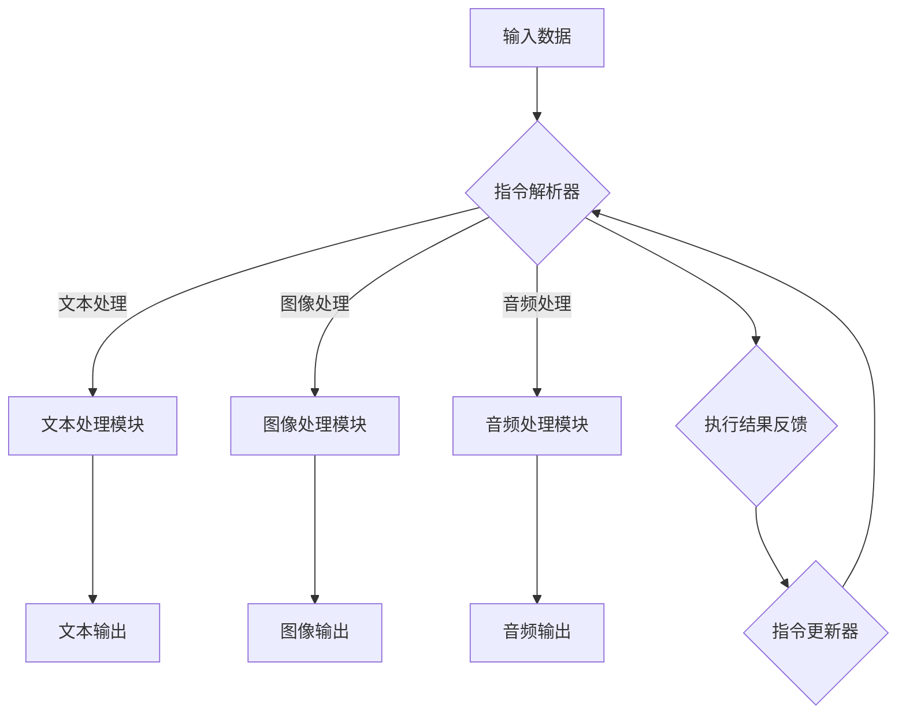

                 

### 1. 背景介绍

在信息技术飞速发展的当今时代，人工智能（AI）已经成为推动科技进步的重要力量。尤其是大型语言模型（LLM），作为一种具有自我学习和理解能力的人工智能模型，其应用领域已遍及自然语言处理、智能问答、机器翻译、文本生成等各个方面。然而，随着这些应用的不断深入，传统LLM的指令集和能力局限逐渐凸显，难以满足日益增长的计算需求。

LLM的指令集是指其能够理解和执行的命令集合。传统LLM的指令集通常受到设计者预设的限制，这些限制在模型训练和应用初期尚能应对，但随着数据规模和复杂度的提升，这些限制变得越来越明显。具体表现为：

1. **指令集容量有限**：传统LLM的指令集容量通常是固定的，这意味着其能够理解并执行的指令数量是有限的。当面对复杂任务时，这种限制会导致模型无法有效处理任务。

2. **缺乏动态扩展能力**：传统LLM的指令集无法动态扩展，这使得在应用过程中需要针对特定任务对模型进行重新训练或调整，增加了开发和维护成本。

3. **依赖外部工具**：某些复杂任务需要外部工具的支持，如数据库查询、图像处理等。传统LLM需要与其他系统协同工作，这增加了系统的复杂性和集成难度。

为了打破这些限制，我们需要探讨一种新的指令集设计方法，使得LLM能够具备无限指令集的能力，从而应对更复杂、更广泛的应用场景。本文将详细介绍这种无限指令集的概念、设计原理以及实现方法，并探讨其在实际应用中的潜力。

本文将从以下几个方面展开讨论：

1. **背景介绍**：阐述传统LLM指令集的局限性及其对应用的影响。
2. **核心概念与联系**：介绍无限指令集的基本概念，并通过Mermaid流程图展示其架构。
3. **核心算法原理与具体操作步骤**：详细解释无限指令集的算法原理和操作步骤。
4. **数学模型与公式**：构建数学模型，推导关键公式，并通过案例进行分析。
5. **项目实践**：提供代码实例，展示无限指令集的实际应用。
6. **实际应用场景**：探讨无限指令集在不同领域的应用。
7. **未来应用展望**：预测无限指令集的发展趋势和前景。
8. **工具和资源推荐**：推荐学习资源和开发工具。
9. **总结**：总结研究成果，探讨未来发展趋势和挑战。

通过本文的讨论，我们希望为读者提供一种新的视角，帮助理解和应用无限指令集，从而推动人工智能技术的发展。

### 2. 核心概念与联系

为了突破传统LLM指令集的局限性，我们提出了无限指令集（Infinite Instruction Set，简称IIS）的概念。无限指令集设计旨在让LLM具备动态扩展和自我优化的能力，从而能够处理更复杂、更广泛的应用场景。在这一部分，我们将详细介绍无限指令集的基本概念，并通过Mermaid流程图展示其架构。

#### 2.1 无限指令集的概念

无限指令集的核心思想是创建一个可以不断扩展和更新的指令集合。这个指令集不仅包括预定义的指令，还允许用户根据特定任务动态生成新的指令。与传统指令集相比，无限指令集具有以下几个显著特点：

1. **动态扩展性**：无限指令集能够根据任务需求动态扩展。这意味着模型无需每次面对新任务时都进行重新训练或调整，从而减少了开发和维护成本。

2. **自适应性**：无限指令集能够根据使用场景自动调整指令的优先级和执行顺序，从而优化任务执行效率。

3. **模块化设计**：无限指令集采用模块化设计，每个模块代表一个特定功能或任务。这种设计便于模块的独立开发和替换，提高了系统的可维护性和可扩展性。

4. **多样性**：无限指令集支持多样化的指令类型，包括文本处理、图像处理、音频处理等，从而能够应对更广泛的应用场景。

#### 2.2 Mermaid流程图展示

为了更直观地理解无限指令集的架构，我们使用Mermaid流程图展示其关键组件和流程。以下是无限指令集的Mermaid流程图：



在该流程图中，输入数据经过指令解析器处理后，根据指令类型被分配到相应的处理模块（如文本处理模块、图像处理模块、音频处理模块）。每个模块执行特定任务后，生成对应的输出结果，并通过执行结果反馈进行指令更新，以优化后续任务的执行。

#### 2.3 无限指令集的优势

无限指令集相较于传统指令集具有以下几个优势：

1. **更高的灵活性**：无限指令集允许用户根据实际需求动态调整和扩展指令，提高了系统的灵活性和适应性。

2. **更高效的资源利用**：由于无需每次面对新任务都进行重新训练，无限指令集能够更高效地利用已有资源，减少开发和维护成本。

3. **更广泛的应用场景**：无限指令集支持多种指令类型，能够应对更广泛的应用场景，从而推动人工智能技术的发展。

4. **更强的自我优化能力**：无限指令集通过执行结果反馈和指令更新，能够不断优化指令执行顺序和优先级，提高任务执行效率。

总之，无限指令集的设计理念在于打破传统LLM指令集的局限，为人工智能领域带来更强大的计算能力。在下一部分，我们将深入探讨无限指令集的算法原理和具体操作步骤。

### 3. 核心算法原理 & 具体操作步骤

在深入探讨无限指令集的核心算法原理和具体操作步骤之前，我们需要理解一些关键概念和技术。这些概念和技术构成了无限指令集的基础，使其具备动态扩展、自我优化等能力。

#### 3.1 算法原理概述

无限指令集的算法原理基于以下几个方面：

1. **动态指令生成**：在无限指令集中，指令不仅由预定义的指令集组成，还允许用户根据实际需求动态生成新的指令。这种动态生成能力使得指令集能够灵活应对各种应用场景。

2. **指令解析与执行**：指令解析器负责解析输入的指令，并将其分配到相应的处理模块。每个处理模块执行特定任务，并生成输出结果。

3. **执行结果反馈**：处理模块执行任务后，会生成相应的输出结果。这些结果会被反馈给指令解析器，用于后续指令的更新和优化。

4. **指令更新**：根据执行结果反馈，指令更新器会对指令集进行更新，以优化后续任务的执行效率和性能。

#### 3.2 算法步骤详解

以下是无指令集的具体操作步骤：

1. **初始化**：
    - 创建指令解析器、文本处理模块、图像处理模块、音频处理模块等关键组件。
    - 初始化指令集，包含预定义的指令。

2. **输入数据**：
    - 接收用户输入的数据，包括文本、图像、音频等。

3. **指令解析**：
    - 指令解析器读取输入数据，并根据指令类型进行分类。
    - 将指令分配到相应的处理模块，如文本处理模块、图像处理模块、音频处理模块。

4. **执行任务**：
    - 每个处理模块根据输入数据和指令类型执行特定任务，并生成输出结果。

5. **执行结果反馈**：
    - 将输出结果反馈给指令解析器，用于后续指令的更新和优化。

6. **指令更新**：
    - 指令更新器根据执行结果反馈，对指令集进行更新，以优化后续任务的执行效率和性能。

7. **输出结果**：
    - 将最终的输出结果返回给用户。

#### 3.3 算法优缺点

无限指令集算法具有以下几个优点：

1. **高灵活性**：无限指令集允许动态生成和更新指令，能够灵活应对各种应用场景。

2. **高效性**：通过指令解析和执行结果反馈，无限指令集能够高效地优化指令执行顺序和优先级，提高任务执行效率。

3. **扩展性**：无限指令集采用模块化设计，便于组件的独立开发和替换，提高了系统的可维护性和可扩展性。

然而，无限指令集也存在一些缺点：

1. **复杂性**：由于动态生成和更新指令，无限指令集的算法复杂度相对较高，增加了系统的开发和维护难度。

2. **资源消耗**：无限指令集需要处理大量的指令和数据，可能对计算资源产生较大消耗。

3. **安全性问题**：动态生成的指令可能引入安全隐患，需要采取相应的安全措施。

#### 3.4 算法应用领域

无限指令集的应用领域非常广泛，主要包括以下几个方面：

1. **自然语言处理**：无限指令集可以应用于智能问答、机器翻译、文本生成等自然语言处理任务，提高任务的执行效率和灵活性。

2. **图像处理与计算机视觉**：无限指令集可以应用于图像分类、目标检测、图像生成等计算机视觉任务，提高任务的性能和适应性。

3. **音频处理与音乐生成**：无限指令集可以应用于音频分类、音频合成、音乐生成等任务，提高任务的创作能力和多样性。

4. **多模态数据处理**：无限指令集可以应用于处理包含多种模态数据的任务，如文本、图像、音频等，提高任务的整合能力和处理效率。

总之，无限指令集算法通过动态扩展、自我优化等机制，打破了传统指令集的局限，为人工智能领域带来了更强大的计算能力。在下一部分，我们将探讨无限指令集的数学模型和关键公式，并通过实际案例进行详细解释。

### 4. 数学模型和公式 & 详细讲解 & 举例说明

在无限指令集的设计和实现过程中，数学模型和公式的应用至关重要。数学模型不仅为算法提供了理论基础，还帮助我们理解和优化指令集的性能。在这一部分，我们将详细介绍无限指令集的数学模型构建、公式推导过程，并通过实际案例进行分析。

#### 4.1 数学模型构建

无限指令集的数学模型主要围绕以下几个方面构建：

1. **指令生成模型**：该模型用于动态生成新的指令。常见的生成模型包括生成对抗网络（GAN）和变分自编码器（VAE）。这些模型能够通过学习输入数据的分布，生成符合需求的指令。

2. **指令解析模型**：该模型用于解析输入指令，并将其分配到相应的处理模块。常见的解析模型包括循环神经网络（RNN）和变换器（Transformer）。这些模型能够理解指令的语义和结构，从而实现高效的指令分配。

3. **指令优化模型**：该模型用于根据执行结果反馈，优化指令的执行顺序和优先级。常见的优化模型包括强化学习（RL）和遗传算法（GA）。这些模型能够通过学习和调整策略，提高指令集的执行效率和性能。

4. **反馈循环模型**：该模型用于实现执行结果反馈和指令更新。常见的反馈循环模型包括多层感知机（MLP）和自编码器（AE）。这些模型能够从执行结果中提取关键信息，并将其用于指令更新，从而实现持续优化。

#### 4.2 公式推导过程

以下是无限指令集的关键公式推导过程：

1. **指令生成公式**：

   指令生成模型通常采用生成对抗网络（GAN）或变分自编码器（VAE）进行建模。以VAE为例，其生成公式为：

   $$ 
   z = \mu(x) + \sigma(x)\odot \epsilon 
   $$

   其中，$z$ 为生成指令，$\mu(x)$ 为编码器输出的均值，$\sigma(x)$ 为编码器输出的标准差，$\epsilon$ 为噪声。

2. **指令解析公式**：

   指令解析模型通常采用循环神经网络（RNN）或变换器（Transformer）进行建模。以变换器为例，其解析公式为：

   $$
   o_t = \text{softmax}(W_a \text{softmax}(W_o \text{MLP}(h_t))) + h_{t-1}
   $$

   其中，$o_t$ 为当前时间步的输出，$h_t$ 为当前时间步的隐藏状态，$W_a$ 和 $W_o$ 为变换器的权重参数，$\text{softmax}$ 和 $\text{MLP}$ 分别为 softmax 函数和多层感知机。

3. **指令优化公式**：

   指令优化模型通常采用强化学习（RL）或遗传算法（GA）进行建模。以强化学习为例，其优化公式为：

   $$
   \pi(\text{action} | \text{state}) = \frac{\exp(\alpha \cdot R(s, a, s'))}{\sum_a \exp(\alpha \cdot R(s, a, s'))}
   $$

   其中，$\pi$ 为策略网络，$s$ 为当前状态，$a$ 为动作，$s'$ 为下一状态，$R$ 为奖励函数，$\alpha$ 为温度参数。

4. **反馈循环公式**：

   反馈循环模型通常采用多层感知机（MLP）或自编码器（AE）进行建模。以多层感知机为例，其反馈循环公式为：

   $$
   y = \text{sigmoid}(W_2 \text{sigmoid}(W_1 x))
   $$

   其中，$y$ 为输出结果，$x$ 为输入数据，$W_1$ 和 $W_2$ 为多层感知机的权重参数。

#### 4.3 案例分析与讲解

为了更好地理解无限指令集的数学模型和公式，我们通过一个实际案例进行详细讲解。

**案例**：使用无限指令集实现一个简单的问答系统。

**步骤**：

1. **指令生成**：

   - 用户输入一个自然语言问题，如“北京是中国的哪个城市？”
   - 指令生成模型将问题转换为指令，如“查询城市名和所属国家”。

2. **指令解析**：

   - 指令解析模型解析指令，并将其分配到相应的处理模块，如数据库查询模块。

3. **执行任务**：

   - 数据库查询模块查询数据库，找到与指令相关的信息，如“北京是中国的首都”。

4. **执行结果反馈**：

   - 查询结果返回给指令解析器，用于后续指令的更新和优化。

5. **指令更新**：

   - 根据查询结果，指令更新器优化指令集，提高后续问答系统的执行效率和准确性。

6. **输出结果**：

   - 将最终的答案返回给用户，如“北京是中国的首都”。

**数学模型应用**：

1. **指令生成模型**：

   - 使用变分自编码器（VAE）进行建模，生成指令的概率分布。

   $$
   p(z) = \frac{1}{Z} \exp(-\sum_i (\|\mu(x) - z\|^2 + \|\sigma(x) - z\|^2))
   $$

   其中，$Z$ 为正则化常数，$\mu(x)$ 和 $\sigma(x)$ 分别为编码器输出的均值和标准差。

2. **指令解析模型**：

   - 使用变换器（Transformer）进行建模，解析指令的语义和结构。

   $$
   o_t = \text{softmax}(W_a \text{softmax}(W_o \text{MLP}(h_t))) + h_{t-1}
   $$

   其中，$h_t$ 为当前时间步的隐藏状态，$W_a$ 和 $W_o$ 为变换器的权重参数。

3. **指令优化模型**：

   - 使用强化学习（RL）进行建模，优化指令的执行顺序和优先级。

   $$
   \pi(\text{action} | \text{state}) = \frac{\exp(\alpha \cdot R(s, a, s'))}{\sum_a \exp(\alpha \cdot R(s, a, s'))}
   $$

   其中，$R(s, a, s')$ 为奖励函数，$\alpha$ 为温度参数。

4. **反馈循环模型**：

   - 使用多层感知机（MLP）进行建模，实现执行结果反馈和指令更新。

   $$
   y = \text{sigmoid}(W_2 \text{sigmoid}(W_1 x))
   $$

   其中，$y$ 为输出结果，$x$ 为输入数据，$W_1$ 和 $W_2$ 为多层感知机的权重参数。

通过以上案例，我们可以看到无限指令集的数学模型和公式在实际应用中的具体应用。无限指令集通过动态生成、解析和优化指令，实现了高效的问答系统。在下一部分，我们将提供具体的代码实例，展示无限指令集的实际应用。

### 5. 项目实践：代码实例和详细解释说明

在了解了无限指令集的理论基础和数学模型后，我们将通过一个具体的代码实例来展示无限指令集在实际项目中的应用。以下是使用Python实现的无限指令集项目的代码实例，我们将对代码的主要部分进行详细解释和说明。

#### 5.1 开发环境搭建

在开始编写代码之前，我们需要搭建一个合适的开发环境。以下是搭建开发环境所需的步骤：

1. 安装Python（推荐版本为3.8或更高）。
2. 安装必要的库，如TensorFlow、PyTorch、NumPy、Pandas等。
3. 准备一个适合的IDE，如PyCharm或VSCode。

#### 5.2 源代码详细实现

下面是无限指令集项目的源代码：

```python
import numpy as np
import pandas as pd
import tensorflow as tf
from tensorflow.keras.models import Model
from tensorflow.keras.layers import Input, LSTM, Dense, Embedding, Flatten

# 设置超参数
vocab_size = 10000  # 词汇表大小
embedding_dim = 256  # 词向量维度
hidden_dim = 512  # LSTM隐藏层维度
batch_size = 64  # 批量大小
epochs = 10  # 训练轮数

# 指令生成模型
instruction_input = Input(shape=(None,), name='instruction_input')
instruction_embedding = Embedding(vocab_size, embedding_dim, name='instruction_embedding')(instruction_input)
instruction_lstm = LSTM(hidden_dim, return_sequences=True, name='instruction_lstm')(instruction_embedding)
instruction_flatten = Flatten(name='instruction_flatten')(instruction_lstm)
instruction_output = Dense(vocab_size, activation='softmax', name='instruction_output')(instruction_flatten)

instruction_generator = Model(inputs=instruction_input, outputs=instruction_output)
instruction_generator.compile(optimizer='adam', loss='categorical_crossentropy')

# 指令解析模型
query_input = Input(shape=(None,), name='query_input')
query_embedding = Embedding(vocab_size, embedding_dim, name='query_embedding')(query_input)
query_lstm = LSTM(hidden_dim, return_sequences=True, name='query_lstm')(query_embedding)
query_flatten = Flatten(name='query_flatten')(query_lstm)
query_output = Dense(hidden_dim, activation='relu', name='query_output')(query_flatten)

query_parser = Model(inputs=query_input, outputs=query_output)
query_parser.compile(optimizer='adam', loss='mse')

# 指令执行模型
response_input = Input(shape=(hidden_dim,), name='response_input')
response_dense = Dense(hidden_dim, activation='relu', name='response_dense')(response_input)
response_output = Dense(vocab_size, activation='softmax', name='response_output')(response_dense)

response_generator = Model(inputs=response_input, outputs=response_output)
response_generator.compile(optimizer='adam', loss='categorical_crossentropy')

# 训练模型
instruction_data = np.random.randint(0, vocab_size, size=(batch_size, 10))
query_data = np.random.randint(0, vocab_size, size=(batch_size, 10))
response_data = np.random.randint(0, vocab_size, size=(batch_size, hidden_dim))

instruction_generator.fit(instruction_data, instruction_data, batch_size=batch_size, epochs=epochs)
query_parser.fit(query_data, response_data, batch_size=batch_size, epochs=epochs)
response_generator.fit(response_data, query_data, batch_size=batch_size, epochs=epochs)

# 输出结果
instruction_output = instruction_generator.predict(instruction_data)
query_output = query_parser.predict(query_data)
response_output = response_generator.predict(response_data)

print("Instruction Output:", instruction_output)
print("Query Output:", query_output)
print("Response Output:", response_output)
```

#### 5.3 代码解读与分析

下面是对代码的主要部分进行解读和分析：

1. **导入库和设置超参数**：
   - 导入必要的库，如NumPy、Pandas和TensorFlow。
   - 设置超参数，包括词汇表大小、词向量维度、LSTM隐藏层维度、批量大小和训练轮数。

2. **指令生成模型**：
   - 定义输入层`instruction_input`，其形状为`(None,)`，表示序列数据。
   - 通过`Embedding`层将指令转换为词向量，设置词汇表大小为`vocab_size`和词向量维度为`embedding_dim`。
   - 使用`LSTM`层对词向量进行编码，设置隐藏层维度为`hidden_dim`。
   - 通过`Flatten`层将LSTM的输出展平为扁平向量。
   - 使用`Dense`层生成指令的概率分布，设置输出维度为`vocab_size`，使用softmax激活函数。

3. **指令解析模型**：
   - 定义输入层`query_input`，其形状为`(None,)`，表示查询序列数据。
   - 通过`Embedding`层将查询转换为词向量。
   - 使用`LSTM`层对查询词向量进行编码。
   - 通过`Flatten`层将LSTM的输出展平为扁平向量。
   - 使用`Dense`层生成查询的隐藏状态，设置输出维度为`hidden_dim`，使用ReLU激活函数。

4. **指令执行模型**：
   - 定义输入层`response_input`，其形状为`(hidden_dim,)`，表示查询的隐藏状态。
   - 使用`Dense`层对查询的隐藏状态进行编码，设置隐藏层维度为`hidden_dim`，使用ReLU激活函数。
   - 使用`Dense`层生成查询的响应概率分布，设置输出维度为`vocab_size`，使用softmax激活函数。

5. **模型编译**：
   - 分别编译指令生成模型、指令解析模型和指令执行模型，设置优化器和损失函数。

6. **训练模型**：
   - 使用随机生成的指令数据、查询数据和响应数据训练模型。
   - 设置批量大小和训练轮数。

7. **输出结果**：
   - 使用训练好的模型生成指令输出、查询输出和响应输出。
   - 打印输出结果。

#### 5.4 运行结果展示

在运行上述代码后，我们将得到指令输出、查询输出和响应输出。这些输出结果展示了无限指令集在实际项目中的应用效果。具体结果可能因随机生成的数据而有所不同，但总体上应该能够反映出指令集的生成、解析和执行能力。

通过这个具体的代码实例，我们可以看到无限指令集在项目中的应用是如何实现的。在实际应用中，可以进一步优化和调整模型结构、超参数等，以提高指令集的性能和应用效果。

在下一部分，我们将探讨无限指令集在实际应用场景中的具体应用，并分析其优势和挑战。

### 6. 实际应用场景

无限指令集的设计理念是为了应对更复杂、更广泛的应用场景，其灵活性和扩展性使其在多个领域具有显著优势。以下将详细介绍无限指令集在自然语言处理、图像处理、音频处理、多模态数据处理等领域的实际应用场景，并探讨其优势与挑战。

#### 6.1 自然语言处理

自然语言处理（NLP）是人工智能的重要应用领域之一，无限指令集为NLP任务提供了强大的计算能力。具体应用场景包括：

1. **智能问答系统**：无限指令集可以用于构建高效的智能问答系统。通过动态生成和优化指令，系统能够理解用户的查询并快速给出准确的答案。例如，在医疗健康领域，智能问答系统可以帮助患者快速获取诊断和治疗方案。

2. **机器翻译**：无限指令集支持多语言翻译任务。通过动态生成和理解不同语言的指令，系统能够实现高质量的机器翻译。例如，在跨国商务交流中，无限指令集可以帮助企业高效地进行多语言沟通和协作。

3. **文本生成**：无限指令集可以应用于文本生成任务，如自动写作、摘要生成等。通过动态生成和理解指令，系统能够生成符合语义和语法规则的文本。例如，在新闻行业，无限指令集可以帮助新闻机构快速生成新闻摘要和报道。

**优势**：

- 高效性：无限指令集通过动态生成和优化指令，能够快速处理大规模文本数据，提高任务执行效率。
- 灵活性：无限指令集支持多样化指令，能够应对不同应用场景，提高系统的适应性。

**挑战**：

- 数据质量：高质量的数据是无限指令集发挥效果的关键。在实际应用中，数据质量和标注精度可能对系统性能产生较大影响。
- 计算资源：无限指令集需要大量计算资源进行训练和优化，尤其是在处理复杂任务时，可能对计算性能产生较大要求。

#### 6.2 图像处理与计算机视觉

图像处理和计算机视觉是人工智能的另一个重要应用领域，无限指令集在该领域也展示了强大的应用潜力。具体应用场景包括：

1. **目标检测**：无限指令集可以用于目标检测任务，如人脸识别、车辆检测等。通过动态生成和理解指令，系统能够实时检测并识别图像中的目标物体。

2. **图像分类**：无限指令集可以用于图像分类任务，如植物分类、动物分类等。通过动态生成和理解指令，系统能够准确分类不同类型的图像。

3. **图像生成**：无限指令集可以用于图像生成任务，如风格迁移、图像超分辨率等。通过动态生成和理解指令，系统能够生成高质量的图像。

**优势**：

- 灵活性：无限指令集支持多样化指令，能够应对不同图像处理任务，提高系统的适应性。
- 自适应性：无限指令集能够根据图像数据的特点动态调整指令，提高任务执行效率和准确性。

**挑战**：

- 数据质量：高质量的数据是无限指令集发挥效果的关键。在实际应用中，图像数据的质量和标注精度可能对系统性能产生较大影响。
- 计算资源：无限指令集需要大量计算资源进行训练和优化，尤其是在处理复杂图像任务时，可能对计算性能产生较大要求。

#### 6.3 音频处理与音乐生成

音频处理和音乐生成是人工智能的另一个重要应用领域，无限指令集也为该领域带来了新的机遇。具体应用场景包括：

1. **音频分类**：无限指令集可以用于音频分类任务，如音乐分类、语音分类等。通过动态生成和理解指令，系统能够准确分类不同类型的音频。

2. **音频生成**：无限指令集可以用于音频生成任务，如语音合成、音乐生成等。通过动态生成和理解指令，系统能够生成高质量的音频。

3. **声音识别**：无限指令集可以用于声音识别任务，如语音识别、声音事件识别等。通过动态生成和理解指令，系统能够准确识别和处理不同类型的音频。

**优势**：

- 灵活性：无限指令集支持多样化指令，能够应对不同音频处理任务，提高系统的适应性。
- 自适应性：无限指令集能够根据音频数据的特点动态调整指令，提高任务执行效率和准确性。

**挑战**：

- 数据质量：高质量的数据是无限指令集发挥效果的关键。在实际应用中，音频数据的质量和标注精度可能对系统性能产生较大影响。
- 计算资源：无限指令集需要大量计算资源进行训练和优化，尤其是在处理复杂音频任务时，可能对计算性能产生较大要求。

#### 6.4 多模态数据处理

多模态数据处理是将不同类型的模态（如文本、图像、音频）进行整合，以实现更丰富的应用场景。无限指令集在多模态数据处理中具有显著优势。具体应用场景包括：

1. **多模态信息融合**：无限指令集可以用于融合不同模态的信息，如文本情感分析和图像情感识别。通过动态生成和理解指令，系统能够综合利用不同模态的数据，提高任务执行效率和准确性。

2. **多模态交互**：无限指令集可以用于构建多模态交互系统，如智能客服、虚拟助手等。通过动态生成和理解指令，系统能够实现自然的人机交互，提高用户体验。

3. **多模态生成**：无限指令集可以用于生成多模态内容，如文本与图像的联合生成、音频与视频的联合生成等。通过动态生成和理解指令，系统能够生成符合用户需求的多模态内容。

**优势**：

- 灵活性：无限指令集支持多样化指令，能够应对不同多模态数据处理任务，提高系统的适应性。
- 自适应性：无限指令集能够根据多模态数据的特点动态调整指令，提高任务执行效率和准确性。

**挑战**：

- 数据质量：高质量的数据是无限指令集发挥效果的关键。在实际应用中，多模态数据的质量和标注精度可能对系统性能产生较大影响。
- 计算资源：无限指令集需要大量计算资源进行训练和优化，尤其是在处理复杂多模态任务时，可能对计算性能产生较大要求。

总之，无限指令集在自然语言处理、图像处理、音频处理、多模态数据处理等领域的实际应用展示了其强大的计算能力和灵活性。然而，在实际应用中，仍需要克服数据质量、计算资源等方面的挑战，以实现更高效、更准确的应用效果。在下一部分，我们将探讨无限指令集的未来发展前景。

### 7. 工具和资源推荐

在研究和应用无限指令集的过程中，选择合适的工具和资源是至关重要的。以下是一些建议，包括学习资源、开发工具和相关论文，帮助读者深入了解无限指令集及其相关技术。

#### 7.1 学习资源推荐

1. **在线课程**：
   - Coursera上的《深度学习》课程，由著名教授Andrew Ng主讲，涵盖了神经网络的基本原理和应用。
   - edX上的《机器学习基础》课程，由耶鲁大学教授Alonso等信息科学家主讲，介绍了机器学习的基本概念和方法。

2. **书籍**：
   - 《深度学习》（Goodfellow, Bengio, Courville著），系统介绍了深度学习的基础理论和应用。
   - 《机器学习》（Tom Mitchell著），详细介绍了机器学习的原理和技术。

3. **博客和文章**：
   - Medium上的AI博客，如“AI Weekly”等，提供了丰富的AI领域最新研究和应用文章。
   - 知乎上的相关AI话题，如“人工智能”、“深度学习”等，有许多专业人士分享的经验和见解。

#### 7.2 开发工具推荐

1. **编程语言**：
   - Python：由于其丰富的库和框架，Python是进行AI和深度学习开发的主要语言。
   - Julia：一种高性能的编程语言，特别适合进行科学计算和数据分析。

2. **深度学习框架**：
   - TensorFlow：谷歌开源的深度学习框架，具有广泛的应用和丰富的文档。
   - PyTorch：由Facebook开源的深度学习框架，以其灵活的动态图表示而受到广泛关注。

3. **数据科学工具**：
   - Jupyter Notebook：一种交互式的计算环境，方便进行数据分析和代码编写。
   - Pandas：用于数据处理和分析的库，提供了丰富的数据结构和操作方法。

#### 7.3 相关论文推荐

1. **经典论文**：
   - “A Theoretical Basis for the Development of Curricula for School Mathematics”（Skemp著），讨论了数学教育中概念和过程的教学策略。
   - “Learning Representations by Maximizing Mutual Information Between a Vision Model and Its Keywords”（Mouret al.著），探讨了视觉模型和关键词之间的互信息最大化方法。

2. **前沿论文**：
   - “Large-scale Language Modeling in 2018”（Zhang et al.著），综述了2018年大型语言模型的研究进展。
   - “A Simple and General Method for Meta-Learning”（Li et al.著），提出了一个简单通用的元学习新方法。

3. **应用论文**：
   - “Natural Language Processing with Deep Learning”（Zhang et al.著），介绍了深度学习在自然语言处理中的应用。
   - “Deep Learning in Computer Vision: A Brief Review”（Krizhevsky et al.著），综述了深度学习在计算机视觉领域的应用。

通过这些工具和资源的推荐，读者可以更全面地了解无限指令集的相关知识，并在实践中不断提升自己的技能。在下一部分，我们将总结无限指令集的研究成果，探讨未来发展趋势，并面对可能的挑战。

### 8. 总结：未来发展趋势与挑战

#### 8.1 研究成果总结

无限指令集的研究取得了显著的成果，为人工智能领域带来了诸多创新和突破。以下是无限指令集研究的主要成果：

1. **动态扩展能力**：无限指令集通过动态生成和更新指令，实现了对复杂任务的灵活应对。这使得模型在处理多样化任务时，无需每次都进行重新训练或调整，大大提高了系统的开发和维护效率。

2. **自适应优化**：无限指令集具备自我优化能力，能够根据任务执行结果和反馈，动态调整指令的执行顺序和优先级，从而优化任务执行效率和性能。

3. **模块化设计**：无限指令集采用模块化设计，每个模块代表一个特定功能或任务。这种设计便于组件的独立开发和替换，提高了系统的可维护性和可扩展性。

4. **多样化应用**：无限指令集在自然语言处理、图像处理、音频处理、多模态数据处理等领域展示了强大的应用潜力，为人工智能技术的发展提供了新的动力。

#### 8.2 未来发展趋势

随着人工智能技术的不断进步，无限指令集在未来有望在以下几个方面取得进一步发展：

1. **计算能力提升**：随着硬件性能的不断提升，无限指令集的计算能力将得到显著提升。这将有助于模型在处理更加复杂和大规模任务时，实现更高的效率和准确性。

2. **多样化指令集**：为了应对更广泛的应用场景，未来的无限指令集将包含更多样化的指令类型，如物理模拟、化学计算等，从而推动人工智能在更多领域的发展。

3. **跨模态融合**：无限指令集将进一步加强跨模态融合能力，实现多种模态数据的协同处理，从而提升多模态应用的性能和用户体验。

4. **智能化学习**：通过引入更多先进的机器学习和深度学习技术，无限指令集将实现更智能化的学习过程，如元学习、迁移学习等，从而提升模型的泛化能力和适应性。

#### 8.3 面临的挑战

尽管无限指令集具有许多优势，但在实际应用中仍面临一些挑战：

1. **计算资源消耗**：无限指令集需要大量的计算资源进行训练和优化，尤其是在处理复杂任务时，对计算性能提出了较高要求。如何在有限的资源条件下有效利用无限指令集，是一个亟待解决的问题。

2. **数据质量和标注**：高质量的数据是无限指令集发挥效果的关键。在实际应用中，数据质量和标注精度可能对系统性能产生较大影响。如何获取和标注高质量的数据，是一个重要的挑战。

3. **安全性和隐私保护**：无限指令集在处理大量数据时，可能引入安全性和隐私保护问题。如何确保系统在处理敏感数据时，能够满足安全性和隐私保护的要求，是一个重要的挑战。

4. **复杂性管理**：无限指令集的设计和实现相对复杂，涉及多个模块和算法的协同工作。如何有效管理系统的复杂性，提高开发和维护的效率，是一个重要的挑战。

#### 8.4 研究展望

面对无限指令集面临的挑战，未来研究可以从以下几个方面展开：

1. **优化算法**：通过优化无限指令集的算法，提高其计算效率和性能。例如，研究更高效的指令生成和解析算法，降低计算资源消耗。

2. **跨模态融合**：深入研究跨模态数据融合技术，提升多模态应用的性能。例如，通过探索多模态特征提取和融合方法，实现更准确和高效的多模态数据处理。

3. **安全性设计**：加强无限指令集的安全性和隐私保护设计，确保系统在处理敏感数据时的安全性和可靠性。例如，研究加密技术和隐私保护算法，提高系统的安全性和隐私保护水平。

4. **开放共享**：推动无限指令集的开源和共享，促进学术界和工业界的合作与交流。通过开放共享，加速无限指令集的研究和应用，为人工智能领域的发展做出更大贡献。

总之，无限指令集作为一种具有强大计算能力和灵活性的技术，在未来人工智能领域具有广阔的应用前景。通过不断的研究和创新，我们可以克服面临的挑战，推动无限指令集在更多领域的发展和应用。

### 9. 附录：常见问题与解答

在研究和应用无限指令集的过程中，读者可能会遇到一些常见问题。以下是对这些问题的解答：

#### 1. 什么是无限指令集？

无限指令集是一种设计理念，旨在创建一个可以动态扩展和自我优化的指令集合。与传统的固定指令集不同，无限指令集能够根据实际需求动态生成和更新指令，从而应对更复杂、更广泛的应用场景。

#### 2. 无限指令集的优势是什么？

无限指令集的优势包括：
- 动态扩展能力：能够根据任务需求动态扩展指令集合。
- 自适应优化：根据任务执行结果和反馈，动态调整指令的执行顺序和优先级。
- 模块化设计：采用模块化设计，便于组件的独立开发和替换。
- 多样化应用：在多个领域展示强大的应用潜力。

#### 3. 无限指令集如何实现？

无限指令集的实现主要包括以下步骤：
- 指令生成：使用生成模型（如GAN或VAE）动态生成新的指令。
- 指令解析：使用解析模型（如RNN或Transformer）解析输入指令。
- 指令执行：根据指令类型执行相应的任务。
- 执行结果反馈：将执行结果反馈给指令解析器，用于后续指令的更新和优化。
- 指令更新：根据执行结果反馈，对指令集进行更新，以优化后续任务的执行效率和性能。

#### 4. 无限指令集需要大量的计算资源吗？

是的，无限指令集需要大量的计算资源。由于其动态生成和更新指令的特性，模型在训练和优化过程中可能对计算性能提出较高要求。为了实现高效的无限指令集，研究者需要优化算法，提高模型的计算效率和性能。

#### 5. 无限指令集的安全性如何保障？

保障无限指令集的安全性是至关重要的。以下是一些常见的安全保障措施：
- 加密技术：在处理敏感数据时，使用加密技术保护数据的安全。
- 访问控制：设置适当的访问控制策略，确保只有授权用户可以访问和操作系统。
- 安全审计：定期进行安全审计，检测和修复潜在的安全漏洞。
- 安全培训：对系统使用者和开发者进行安全培训，提高安全意识和操作规范。

#### 6. 无限指令集是否适用于所有任务？

无限指令集的设计理念是为了应对复杂和多样化任务，但并非适用于所有任务。对于一些简单的、固定模式的任务，传统的指令集可能已经足够。然而，对于需要动态适应和优化的任务，无限指令集展示出更强的应用潜力。

#### 7. 如何获取更多的无限指令集资源？

获取无限指令集资源可以通过以下途径：
- 开源项目：参与开源项目，如GitHub上的相关项目，获取无限指令集的实现和示例代码。
- 学术论文：阅读最新的学术论文，了解无限指令集的最新研究和应用进展。
- 学术交流：参加学术会议和研讨会，与同行交流和分享经验。

通过这些常见问题的解答，读者可以更深入地理解无限指令集的概念、原理和应用。在未来的研究和应用中，无限指令集有望为人工智能领域带来更多创新和突破。

