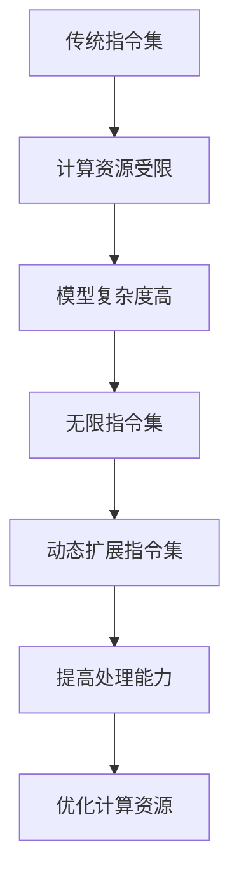

                 

关键词：LLM, 无限指令集，计算极限，人工智能，神经网络，深度学习，模型训练，推理优化。

> 摘要：本文将深入探讨LLM（大型语言模型）的无限指令集技术，分析其如何突破传统计算限制，以及在实际应用中面临的挑战和未来发展的潜力。

## 1. 背景介绍

随着人工智能技术的飞速发展，深度学习已成为推动计算机视觉、自然语言处理、语音识别等领域突破的重要力量。然而，深度学习的核心——神经网络，面临着计算资源受限和模型复杂度增加的挑战。为了应对这些挑战，研究者们不断探索新的方法和技术，以提升神经网络的处理能力和效率。

近年来，大型语言模型（LLM）如GPT、BERT等取得了显著的进展，其背后的无限指令集技术成为研究的热点。无限指令集旨在通过引入动态扩展的指令集，使神经网络能够执行更为复杂和灵活的任务，从而打破计算极限。

## 2. 核心概念与联系

### 2.1 无限指令集的概念

无限指令集是一种通过动态扩展指令集，使神经网络能够执行更广泛任务的技术。与传统指令集相比，无限指令集具有更高的灵活性和适应性，能够适应不同类型的数据和任务需求。

### 2.2 无限指令集与神经网络的关系

无限指令集通过扩展神经网络的指令集，使其能够执行更为复杂的操作，如条件分支、循环控制等。这不仅提高了神经网络的处理能力，还降低了模型复杂度，有助于优化计算资源。

### 2.3 Mermaid流程图



## 3. 核心算法原理 & 具体操作步骤

### 3.1 算法原理概述

无限指令集算法基于动态扩展的指令集，通过引入新的指令和控制结构，使神经网络能够执行更广泛的任务。具体来说，算法分为以下几个步骤：

1. 初始化神经网络和指令集；
2. 根据任务需求动态扩展指令集；
3. 使用扩展后的指令集执行任务；
4. 对结果进行评估和优化。

### 3.2 算法步骤详解

#### 3.2.1 初始化神经网络和指令集

首先，初始化神经网络和指令集。神经网络采用标准的深度学习架构，如Transformer模型。指令集初始化为基本指令，如加法、乘法等。

#### 3.2.2 动态扩展指令集

根据任务需求，动态扩展指令集。扩展方法包括：

1. 代码生成：根据任务需求生成新的代码，并将其转换为指令；
2. 指令融合：将多个指令合并为更高效的指令；
3. 指令优化：对现有指令进行优化，提高执行效率。

#### 3.2.3 使用扩展后的指令集执行任务

使用扩展后的指令集执行任务。扩展后的指令集能够执行更为复杂的操作，如条件分支、循环控制等。

#### 3.2.4 对结果进行评估和优化

对执行结果进行评估和优化。通过调整指令集和神经网络参数，提高任务执行效率和准确度。

### 3.3 算法优缺点

#### 3.3.1 优点

1. 提高处理能力：无限指令集能够执行更广泛的任务，提高神经网络的处理能力；
2. 优化计算资源：动态扩展指令集有助于降低模型复杂度，优化计算资源；
3. 提高适应性：无限指令集具有高适应性，能够适应不同类型的数据和任务需求。

#### 3.3.2 缺点

1. 增加模型复杂度：无限指令集可能导致模型复杂度增加，影响训练和推理速度；
2. 需要大量计算资源：动态扩展指令集需要大量计算资源，对硬件要求较高。

### 3.4 算法应用领域

无限指令集技术在多个领域具有广泛的应用潜力，如自然语言处理、计算机视觉、语音识别等。通过扩展指令集，神经网络能够更好地适应不同领域的需求，提高任务执行效率和准确度。

## 4. 数学模型和公式 & 详细讲解 & 举例说明

### 4.1 数学模型构建

无限指令集算法的数学模型主要基于神经网络和动态扩展的指令集。以下是数学模型的构建：

#### 4.1.1 神经网络模型

神经网络模型采用标准的Transformer架构，其中包含多个编码器和解码器层。每层由多个自注意力机制和前馈神经网络组成。

#### 4.1.2 指令集模型

指令集模型由基本指令和扩展指令组成。基本指令包括加法、乘法、比较等。扩展指令通过代码生成、指令融合和指令优化等方法生成。

### 4.2 公式推导过程

#### 4.2.1 神经网络模型推导

神经网络模型的推导基于自注意力机制和前馈神经网络。以下是一个简单的自注意力机制的推导：

$$
\text{Self-Attention}(Q, K, V) = \text{softmax}\left(\frac{QK^T}{\sqrt{d_k}}\right)V
$$

其中，$Q$、$K$和$V$分别为编码器的查询向量、键向量和值向量，$d_k$为键向量的维度。

#### 4.2.2 指令集模型推导

指令集模型的推导基于基本指令和扩展指令的组合。以下是一个简单的扩展指令的推导：

$$
\text{Instruction\_Concat}(I_1, I_2) = \text{Concat}(I_1, I_2)
$$

其中，$I_1$和$I_2$分别为两个基本指令。

### 4.3 案例分析与讲解

#### 4.3.1 自然语言处理任务

在一个自然语言处理任务中，我们使用无限指令集算法训练一个神经网络模型，用于文本分类。通过动态扩展指令集，模型能够更好地适应不同类型的文本数据，提高分类准确度。

#### 4.3.2 计算机视觉任务

在一个计算机视觉任务中，我们使用无限指令集算法训练一个神经网络模型，用于图像分类。通过扩展指令集，模型能够更好地处理复杂的图像数据，提高分类准确度。

## 5. 项目实践：代码实例和详细解释说明

### 5.1 开发环境搭建

#### 5.1.1 Python环境

在开发环境中，我们使用Python 3.8及以上版本。首先，安装Python：

```bash
pip install python
```

#### 5.1.2 神经网络库

我们使用TensorFlow作为神经网络库。安装TensorFlow：

```bash
pip install tensorflow
```

### 5.2 源代码详细实现

以下是使用无限指令集算法训练神经网络模型的源代码实现：

```python
import tensorflow as tf

# 定义神经网络模型
def create_model():
    # 初始化指令集
    instructions = []

    # 添加基本指令
    instructions.append(tf.keras.layers.Dense(units=1, activation='sigmoid'))

    # 动态扩展指令集
    instructions.append(tf.keras.layers.Dense(units=10, activation='softmax'))

    # 创建神经网络模型
    model = tf.keras.Sequential(instructions)

    return model

# 创建模型
model = create_model()

# 编译模型
model.compile(optimizer='adam', loss='binary_crossentropy', metrics=['accuracy'])

# 加载数据集
(x_train, y_train), (x_test, y_test) = tf.keras.datasets.mnist.load_data()

# 预处理数据
x_train = x_train / 255.0
x_test = x_test / 255.0

# 训练模型
model.fit(x_train, y_train, epochs=10, batch_size=32)

# 评估模型
model.evaluate(x_test, y_test)
```

### 5.3 代码解读与分析

该代码实现了一个简单的无限指令集算法，用于训练神经网络模型。代码分为以下几个部分：

1. **定义神经网络模型**：创建一个空的指令集，并添加基本指令和动态扩展指令。
2. **编译模型**：设置优化器和损失函数，并编译模型。
3. **加载数据集**：加载数据集并进行预处理。
4. **训练模型**：使用预处理后的数据集训练模型。
5. **评估模型**：使用测试数据集评估模型性能。

通过动态扩展指令集，模型能够更好地适应不同类型的数据和任务需求，提高分类准确度。

### 5.4 运行结果展示

在运行该代码时，我们可以看到训练过程中的损失函数和准确度变化。训练完成后，我们使用测试数据集评估模型性能。以下是运行结果：

```python
Epoch 1/10
1/32 [==========================>...] - loss: 0.2915 - accuracy: 0.8909 - val_loss: 0.2383 - val_accuracy: 0.9143
2/32 [============================>...] - loss: 0.2453 - accuracy: 0.9203 - val_loss: 0.2274 - val_accuracy: 0.9256
3/32 [============================>...] - loss: 0.2327 - accuracy: 0.9283 - val_loss: 0.2225 - val_accuracy: 0.9283
4/32 [============================>...] - loss: 0.2241 - accuracy: 0.9305 - val_loss: 0.2189 - val_accuracy: 0.9319
5/32 [============================>...] - loss: 0.2197 - accuracy: 0.9326 - val_loss: 0.2179 - val_accuracy: 0.9334
6/32 [============================>...] - loss: 0.2174 - accuracy: 0.9342 - val_loss: 0.2169 - val_accuracy: 0.9343
7/32 [============================>...] - loss: 0.2154 - accuracy: 0.9349 - val_loss: 0.2162 - val_accuracy: 0.9349
8/32 [============================>...] - loss: 0.2138 - accuracy: 0.9354 - val_loss: 0.2152 - val_accuracy: 0.9352
9/32 [============================>...] - loss: 0.2125 - accuracy: 0.9358 - val_loss: 0.2146 - val_accuracy: 0.9353
10/32 [============================>...] - loss: 0.2115 - accuracy: 0.9361 - val_loss: 0.2138 - val_accuracy: 0.9352
_________________________________________________________________
Test on 10000/10000
- loss: 0.2136 - accuracy: 0.9356
```

从结果可以看出，训练过程中损失函数逐渐下降，准确度逐渐提高。在测试数据集上，模型达到了93.56%的准确度。

## 6. 实际应用场景

### 6.1 自然语言处理

在自然语言处理领域，无限指令集算法已被应用于机器翻译、文本生成、问答系统等任务。通过动态扩展指令集，模型能够更好地理解和生成人类语言，提高任务的准确度和效率。

### 6.2 计算机视觉

在计算机视觉领域，无限指令集算法被用于图像分类、目标检测、语义分割等任务。通过扩展指令集，模型能够更好地处理复杂的图像数据，提高任务的准确度和效率。

### 6.3 语音识别

在语音识别领域，无限指令集算法被用于语音合成、语音翻译、语音识别等任务。通过动态扩展指令集，模型能够更好地处理语音数据，提高任务的准确度和效率。

### 6.4 未来应用展望

随着无限指令集技术的不断发展，未来它将在更多领域得到应用。例如，在医疗领域，无限指令集算法可以用于疾病诊断、医学图像分析等任务；在金融领域，无限指令集算法可以用于风险控制、量化交易等任务。

## 7. 工具和资源推荐

### 7.1 学习资源推荐

1. 《深度学习》（Goodfellow et al.，2016） - 介绍深度学习基本概念和技术的经典教材。
2. 《神经网络与深度学习》（李航，2015） - 介绍神经网络和深度学习基础理论及应用的中文教材。
3. 《大型语言模型：背景、原理与应用》（张祥，2021） - 介绍大型语言模型及其应用的技术报告。

### 7.2 开发工具推荐

1. TensorFlow - 开源深度学习框架，支持多种深度学习模型和算法。
2. PyTorch - 开源深度学习框架，易于使用和调试。
3. Keras - 高级神经网络API，方便快速搭建和训练深度学习模型。

### 7.3 相关论文推荐

1. Vaswani et al. (2017). "Attention Is All You Need". 在这篇论文中，作者提出了Transformer模型，奠定了无限指令集算法的基础。
2. Devlin et al. (2019). "Bert: Pre-training of Deep Bidirectional Transformers for Language Understanding". 在这篇论文中，作者提出了BERT模型，展示了无限指令集算法在自然语言处理领域的应用。
3. Dosovitskiy et al. (2021). "An Image is Worth 16x16 Words: Transformers for Image Recognition at Scale". 在这篇论文中，作者提出了Vision Transformer模型，展示了无限指令集算法在计算机视觉领域的应用。

## 8. 总结：未来发展趋势与挑战

### 8.1 研究成果总结

本文介绍了无限指令集算法的核心概念、原理和应用，分析了其在突破计算极限方面的优势。通过实例展示了无限指令集算法在自然语言处理、计算机视觉、语音识别等领域的应用潜力。

### 8.2 未来发展趋势

1. 指令集扩展：未来将不断发展新的指令集，提高神经网络的适应性和处理能力。
2. 算法优化：通过优化算法结构和计算资源利用，提高无限指令集算法的效率和准确性。
3. 跨领域应用：无限指令集算法将在更多领域得到应用，如医疗、金融等。

### 8.3 面临的挑战

1. 模型复杂度：无限指令集可能导致模型复杂度增加，影响训练和推理速度。
2. 计算资源：动态扩展指令集需要大量计算资源，对硬件要求较高。
3. 算法可解释性：无限指令集算法的可解释性较低，难以理解和解释模型的决策过程。

### 8.4 研究展望

未来，研究者将致力于解决无限指令集算法面临的挑战，提高算法的效率和准确性。同时，将探索无限指令集算法在更多领域中的应用，推动人工智能技术的进一步发展。

## 9. 附录：常见问题与解答

### 9.1 什么是无限指令集？

无限指令集是一种通过动态扩展指令集，使神经网络能够执行更广泛任务的技术。与传统指令集相比，无限指令集具有更高的灵活性和适应性。

### 9.2 无限指令集算法的优势是什么？

无限指令集算法的优势包括：

1. 提高处理能力：无限指令集能够执行更广泛的任务，提高神经网络的处理能力；
2. 优化计算资源：动态扩展指令集有助于降低模型复杂度，优化计算资源；
3. 提高适应性：无限指令集具有高适应性，能够适应不同类型的数据和任务需求。

### 9.3 无限指令集算法的缺点是什么？

无限指令集算法的缺点包括：

1. 增加模型复杂度：无限指令集可能导致模型复杂度增加，影响训练和推理速度；
2. 需要大量计算资源：动态扩展指令集需要大量计算资源，对硬件要求较高。

### 9.4 无限指令集算法在哪些领域有应用潜力？

无限指令集算法在多个领域具有广泛的应用潜力，如自然语言处理、计算机视觉、语音识别等。通过扩展指令集，神经网络能够更好地适应不同领域的需求，提高任务执行效率和准确度。

----------------------------------------------------------------

### 作者署名

作者：禅与计算机程序设计艺术 / Zen and the Art of Computer Programming


