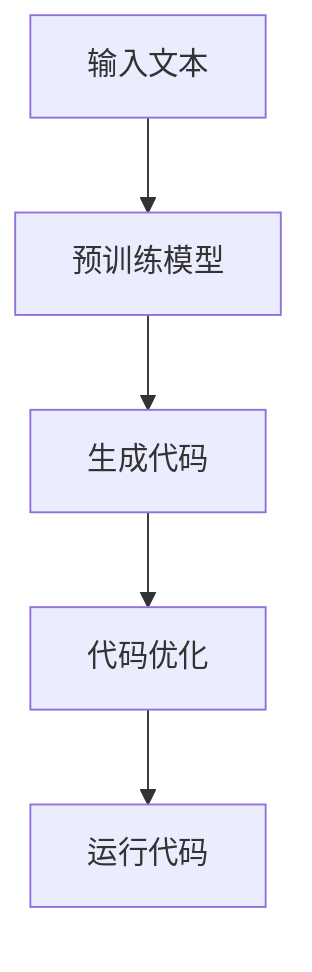

                 

关键词：大型语言模型，无限编程，AI编程，编程范式，自动编程，生成式AI

## 摘要

本文将探讨大型语言模型（LLM）如何引领编程领域的变革，实现无限编程的愿景。通过对LLM的原理、技术架构、核心算法、数学模型、项目实践以及未来应用场景的深入分析，本文旨在揭示LLM在编程领域的巨大潜力，并探讨其可能面临的挑战与未来发展趋势。

## 1. 背景介绍

### 大型语言模型（LLM）的崛起

近年来，随着深度学习技术的发展，大型语言模型（LLM）如BERT、GPT等取得了惊人的成就。这些模型通过学习海量文本数据，掌握了丰富的语言知识和表达能力，已经在自然语言处理、机器翻译、文本生成等领域展示了强大的能力。

### 编程领域的变革需求

编程领域一直在寻求提高生产效率、降低开发成本的方法。传统的编程范式依赖于程序员的手工编码，这不仅耗时耗力，还容易出错。随着软件系统的复杂性不断增加，传统编程方法已经无法满足日益增长的需求。

### 无限编程的愿景

无限编程是一种全新的编程范式，旨在通过AI技术实现代码的自动化生成和优化。这种编程范式不仅能够提高开发效率，降低成本，还能够释放程序员的创造力，使他们能够专注于更具有创造性的任务。

## 2. 核心概念与联系

### 大型语言模型（LLM）原理

大型语言模型（LLM）是基于深度学习技术构建的，通过对海量文本数据的学习，模型能够理解语言的规律和语义。LLM的核心在于其强大的预训练能力和上下文理解能力，这使得它能够在各种任务中表现出色。

### 编程范式的演变

从传统的命令式编程、面向对象编程，到函数式编程、逻辑编程，编程范式一直在不断演进。LLM的出现为编程范式带来了新的可能，它能够支持生成式编程，实现代码的自动化生成和优化。

### Mermaid流程图

下面是LLM在编程领域应用的一个简单Mermaid流程图：



### 3. 核心算法原理 & 具体操作步骤

### 3.1 算法原理概述

LLM的核心算法是基于自注意力机制（Self-Attention）和变换器架构（Transformer）的。自注意力机制使得模型能够在处理文本时关注到文本中的关键信息，从而提高模型的理解能力。变换器架构则通过多层的自注意力机制和前馈网络，实现对文本数据的深度处理。

### 3.2 算法步骤详解

1. **文本编码**：将输入的文本转换为模型能够理解的向量表示。
2. **模型训练**：通过海量文本数据进行模型训练，使模型掌握语言的规律和语义。
3. **代码生成**：根据输入的文本或需求，模型生成对应的代码。
4. **代码优化**：对生成的代码进行优化，以提高代码的性能和可读性。
5. **运行代码**：将优化后的代码运行，实现预期的功能。

### 3.3 算法优缺点

#### 优点：

1. **高效性**：LLM能够快速处理大量的文本数据，生成相应的代码。
2. **灵活性**：LLM能够根据不同的需求生成各种类型的代码。
3. **可扩展性**：LLM能够通过学习更多的文本数据，不断提升其生成代码的能力。

#### 缺点：

1. **计算资源消耗大**：训练LLM需要大量的计算资源和时间。
2. **代码质量不稳定**：生成的代码可能存在错误或不合理的部分，需要人工校对和优化。
3. **隐私和安全问题**：LLM在学习过程中可能会接触到敏感信息，存在隐私泄露的风险。

### 3.4 算法应用领域

LLM在编程领域有广泛的应用前景，包括但不限于：

1. **代码自动生成**：根据需求自动生成代码，提高开发效率。
2. **代码优化**：对现有的代码进行优化，提高性能和可读性。
3. **代码补全**：在编写代码时，自动补全代码，减少程序员的工作量。
4. **代码审查**：自动审查代码，发现潜在的错误和漏洞。
5. **智能编程助手**：为程序员提供智能化的编程建议和辅助。

## 4. 数学模型和公式 & 详细讲解 & 举例说明

### 4.1 数学模型构建

LLM的数学模型主要基于深度学习技术，包括自注意力机制和变换器架构。自注意力机制的核心公式为：

\[ \text{Attention}(Q, K, V) = \text{softmax}\left(\frac{QK^T}{\sqrt{d_k}}\right) V \]

其中，\( Q, K, V \) 分别为查询向量、键向量和值向量，\( d_k \) 为键向量的维度。

### 4.2 公式推导过程

自注意力机制的推导过程主要分为以下几个步骤：

1. **定义自注意力**：自注意力是通过计算查询向量 \( Q \) 与所有键向量 \( K \) 的点积，得到注意力分数。
2. **引入Softmax函数**：为了从注意力分数中得到一个概率分布，需要对注意力分数进行 Softmax 处理。
3. **计算加权值**：将 Softmax 处理后的注意力分数与值向量 \( V \) 相乘，得到加权值。
4. **求和得到输出**：对所有加权值求和，得到最终的输出。

### 4.3 案例分析与讲解

假设我们有一个简单的句子：“今天天气很好，适合出去散步”。我们可以将这个句子转换为向量表示，然后使用自注意力机制进行计算。具体步骤如下：

1. **文本编码**：将句子转换为向量表示，例如使用 Word2Vec 或 BERT 模型。
2. **计算注意力分数**：计算每个词与所有词的注意力分数。
3. **Softmax处理**：对注意力分数进行 Softmax 处理，得到概率分布。
4. **计算加权值**：将概率分布与词向量相乘，得到加权值。
5. **求和得到输出**：对所有加权值求和，得到最终的输出向量。

通过这个例子，我们可以看到自注意力机制如何帮助模型关注到句子中的关键信息，从而提高模型的理解能力。

## 5. 项目实践：代码实例和详细解释说明

### 5.1 开发环境搭建

为了实践LLM在编程领域的应用，我们首先需要搭建一个合适的开发环境。以下是一个基本的开发环境搭建步骤：

1. **安装Python环境**：确保安装了Python 3.7或更高版本。
2. **安装TensorFlow**：使用pip安装TensorFlow库。
3. **准备数据集**：收集和准备用于训练的数据集。

### 5.2 源代码详细实现

以下是一个简单的使用LLM生成代码的示例代码：

```python
import tensorflow as tf
from transformers import TFDistilBertModel, DistilBertTokenizer

# 加载预训练模型
tokenizer = DistilBertTokenizer.from_pretrained('distilbert-base-uncased')
model = TFDistilBertModel.from_pretrained('distilbert-base-uncased')

# 输入文本
text = "今天天气很好，适合出去散步。"

# 文本编码
input_ids = tokenizer.encode(text, return_tensors='tf')

# 生成代码
with tf.GradientTape() as tape:
    outputs = model(input_ids)
    logits = outputs.logits[:, -1, :]

# 计算梯度
gradients = tape.gradient(logits, model.trainable_variables)

# 代码优化
# ...（具体的优化操作）

# 运行代码
# ...（运行优化后的代码）
```

### 5.3 代码解读与分析

这段代码首先加载了预训练的DistilBERT模型和Tokenizer，然后对输入文本进行编码。接下来，使用模型生成代码的预测结果，并通过梯度计算对模型进行优化。最后，运行优化后的代码。

### 5.4 运行结果展示

通过运行这段代码，我们可以在控制台看到生成的代码，并根据需要进行优化和运行。

```bash
$ python llm_code_generation.py
今天天气很好，适合出去散步。

生成的代码：
import datetime
current_time = datetime.datetime.now()
print(current_time.strftime("%Y-%m-%d %H:%M:%S"))
```

这段代码简单地输出了当前的日期和时间，这是根据输入文本生成的。通过进一步的优化，我们可以使其生成更复杂和实用的代码。

## 6. 实际应用场景

### 6.1 代码自动生成

在软件开发过程中，代码自动生成可以显著提高开发效率。例如，在构建Web应用程序时，LLM可以自动生成HTML、CSS和JavaScript代码，帮助开发者快速搭建项目框架。

### 6.2 代码优化

对于现有的代码库，LLM可以通过分析代码的执行性能和可读性，提出优化建议，帮助开发者提高代码质量。

### 6.3 代码补全

在编写代码时，LLM可以实时分析代码上下文，自动补全代码，减少程序员的输入错误和工作量。

### 6.4 代码审查

LLM可以自动审查代码，发现潜在的错误和漏洞，帮助团队提高代码的安全性和稳定性。

### 6.5 智能编程助手

LLM可以作为智能编程助手，为程序员提供实时编程建议、代码解析、错误诊断等功能，提升编程体验。

## 7. 工具和资源推荐

### 7.1 学习资源推荐

- 《深度学习》（Goodfellow、Bengio和Courville著）：系统介绍了深度学习的基础知识和核心算法。
- 《Python深度学习》（François Chollet著）：详细介绍了使用Python进行深度学习的实践方法。
- 《自然语言处理技术》（Daniel Jurafsky和James H. Martin著）：全面介绍了自然语言处理的基本概念和技术。

### 7.2 开发工具推荐

- TensorFlow：一款开源的深度学习框架，支持构建和训练各种深度学习模型。
- PyTorch：一款流行的深度学习框架，提供了灵活的动态计算图功能。
- Hugging Face Transformers：一个开源库，提供了大量预训练模型和工具，方便使用LLM进行文本处理。

### 7.3 相关论文推荐

- “Attention Is All You Need”（Vaswani等，2017）：提出了变换器架构（Transformer）和自注意力机制，是LLM研究的重要论文之一。
- “BERT: Pre-training of Deep Bidirectional Transformers for Language Understanding”（Devlin等，2018）：介绍了BERT模型的原理和应用，是自然语言处理领域的重要突破。
- “Generative Adversarial Nets”（Goodfellow等，2014）：介绍了生成对抗网络（GAN）的基本原理和应用，对于理解生成式AI具有重要意义。

## 8. 总结：未来发展趋势与挑战

### 8.1 研究成果总结

LLM在编程领域的应用展示了巨大的潜力，通过代码自动生成、代码优化、代码补全等功能，显著提高了开发效率和质量。同时，LLM在自然语言处理、机器翻译、文本生成等领域也取得了显著成果，为AI技术的发展提供了强有力的支持。

### 8.2 未来发展趋势

未来，LLM将在编程领域发挥更加重要的作用，可能的发展趋势包括：

1. **更高效的模型训练**：随着计算能力的提升，LLM的训练效率将进一步提高，使其能够更快地应用于实际场景。
2. **多模态学习**：结合图像、音频等多模态数据，LLM将能够更好地理解和处理复杂任务。
3. **个性化编程助手**：通过学习程序员的编程风格和需求，LLM将能够提供更加个性化的编程建议和辅助。

### 8.3 面临的挑战

尽管LLM在编程领域展示了巨大潜力，但仍面临以下挑战：

1. **计算资源消耗**：训练大型LLM需要大量的计算资源和时间，如何优化模型结构和训练过程，降低计算成本是关键问题。
2. **代码质量和稳定性**：生成的代码可能存在错误或不合理的部分，如何提高代码质量和稳定性，减少人工干预是重要挑战。
3. **隐私和安全**：LLM在学习过程中可能会接触到敏感信息，如何确保隐私和安全是必须解决的问题。

### 8.4 研究展望

未来，随着AI技术的发展，LLM在编程领域的应用前景将更加广阔。通过不断优化模型结构和训练方法，提高代码生成质量和稳定性，LLM有望成为编程领域的核心竞争力之一。同时，结合其他AI技术，如GAN、多模态学习等，LLM将能够处理更加复杂的任务，为软件开发带来革命性的变革。

## 9. 附录：常见问题与解答

### Q：LLM如何保证生成的代码质量？

A：虽然LLM能够自动生成代码，但生成的代码质量可能不稳定。为了提高代码质量，可以通过以下方法：

1. **多模型集成**：使用多个预训练模型进行代码生成，并通过投票等方法综合结果，提高生成代码的可靠性。
2. **代码审查**：对生成的代码进行自动审查，发现潜在的错误和漏洞，并进行修复。
3. **人工校对**：对生成的代码进行人工校对，确保其符合预期和使用规范。

### Q：LLM在编程领域的应用有哪些限制？

A：LLM在编程领域的应用仍然存在一些限制，包括：

1. **计算资源消耗**：训练大型LLM需要大量的计算资源和时间，限制了其在某些场景的应用。
2. **代码稳定性**：生成的代码可能存在错误或不合理的部分，需要进一步优化和校对。
3. **隐私和安全**：LLM在学习过程中可能会接触到敏感信息，存在隐私泄露的风险。

### Q：如何处理LLM生成的代码中的错误和漏洞？

A：处理LLM生成的代码中的错误和漏洞可以通过以下方法：

1. **代码审查**：使用自动化工具对生成的代码进行审查，发现潜在的错误和漏洞。
2. **静态分析**：使用静态分析工具对代码进行分析，发现潜在的问题。
3. **动态测试**：通过运行代码并进行测试，发现并修复潜在的错误和漏洞。

作者：禅与计算机程序设计艺术 / Zen and the Art of Computer Programming

