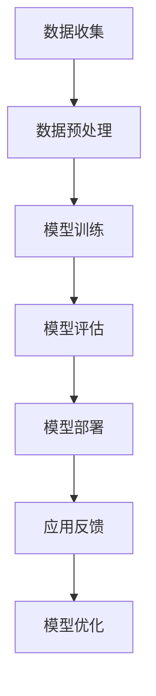

                 

关键词：自然语言处理、语言模型、大模型、生态圈、技术发展、应用场景

> 摘要：本文将探讨LLM（大型语言模型）生态圈的发展，从技术原理、数学模型、项目实践到实际应用场景，全面解析LLM生态圈的奇迹。通过深入分析，我们不仅可以看到技术领域的蓬勃发展，更能展望未来应用的无限可能。

## 1. 背景介绍

随着信息时代的到来，自然语言处理（NLP）技术逐渐成为人工智能领域的热点。而语言模型（Language Model，简称LM）作为NLP的核心技术之一，其重要性日益凸显。近年来，大型语言模型（LLM）的涌现，更是将自然语言处理推向了一个新的高峰。本文旨在探讨LLM生态圈的发展，从技术原理、数学模型、项目实践到实际应用场景，全面解析LLM生态圈的奇迹。

## 2. 核心概念与联系

### 2.1 语言模型原理

语言模型是一种概率模型，用于预测下一个单词或字符的概率。在NLP领域，语言模型主要分为统计语言模型和神经语言模型。统计语言模型基于统计方法，如N-gram模型，通过分析文本数据来建立语言模型。而神经语言模型则基于深度学习技术，如循环神经网络（RNN）和Transformer模型，通过大规模数据训练，实现对自然语言的建模。

### 2.2 大模型原理

大模型（Large Model）是指在训练过程中使用大量数据和计算资源构建的模型。大模型具有以下几个特点：

1. **大规模参数**：大模型拥有数十亿甚至千亿级别的参数，能够捕捉到语言中的复杂模式。
2. **深度网络结构**：大模型的网络结构通常较为复杂，包括多层神经网络，以增强模型的表示能力和泛化能力。
3. **大规模数据训练**：大模型在训练过程中需要使用大量的数据进行训练，以提高模型的准确性和鲁棒性。

### 2.3 Mermaid 流程图

以下是一个Mermaid流程图，展示了LLM的构建过程：



## 3. 核心算法原理 & 具体操作步骤

### 3.1 算法原理概述

LLM的核心算法是基于深度学习技术的。以下是对几种常见深度学习算法的概述：

1. **循环神经网络（RNN）**：RNN是一种能够处理序列数据的神经网络，通过隐藏状态来捕捉序列信息。
2. **长短期记忆网络（LSTM）**：LSTM是RNN的一种改进，通过引入门控机制，解决了RNN的梯度消失问题。
3. **Transformer模型**：Transformer是一种基于自注意力机制的模型，通过多头注意力机制和前馈神经网络，实现了对序列数据的建模。

### 3.2 算法步骤详解

1. **数据收集**：收集大规模的文本数据，如新闻、文章、对话等。
2. **数据预处理**：对文本数据进行清洗、分词、标记等处理，将其转化为模型可理解的格式。
3. **模型训练**：使用预处理后的数据，训练深度学习模型，如RNN、LSTM、Transformer等。
4. **模型评估**：使用验证集和测试集对模型进行评估，确保模型的准确性和泛化能力。
5. **模型部署**：将训练好的模型部署到服务器或设备上，进行实际应用。
6. **应用反馈**：收集用户反馈，用于模型优化和改进。

### 3.3 算法优缺点

1. **优点**：
   - **高准确性**：LLM能够通过大规模数据训练，实现对自然语言的精准建模。
   - **强泛化能力**：LLM具有较好的泛化能力，能够适应不同的应用场景。
   - **多语言支持**：LLM能够处理多种语言，支持跨语言的应用。

2. **缺点**：
   - **计算资源消耗大**：大模型的训练和推理过程需要大量的计算资源和存储资源。
   - **数据依赖性高**：大模型对数据的依赖性较高，数据的质量和多样性对模型性能有重要影响。

### 3.4 算法应用领域

LLM在多个领域有广泛的应用，如：

1. **自然语言处理**：文本分类、机器翻译、问答系统等。
2. **智能客服**：自动化客服、智能语音助手等。
3. **内容生成**：文章写作、小说创作、代码生成等。
4. **教育领域**：智能教育、个性化学习等。

## 4. 数学模型和公式 & 详细讲解 & 举例说明

### 4.1 数学模型构建

LLM的数学模型主要基于深度学习技术。以下是一个简化的数学模型构建过程：

1. **输入层**：将文本数据转化为向量表示。
2. **隐藏层**：通过多层神经网络进行特征提取。
3. **输出层**：根据隐藏层的输出，预测下一个单词或字符。

### 4.2 公式推导过程

假设我们有一个简单的神经网络，包含一个输入层、一个隐藏层和一个输出层。输入层有n个神经元，隐藏层有m个神经元，输出层有k个神经元。

1. **输入层到隐藏层的激活函数**：

$$
h_j^{(2)} = \sigma(z_j^{(2)}) = \frac{1}{1 + e^{-\sum_{i=1}^{n} w_{ij} x_i}}
$$

其中，$h_j^{(2)}$表示隐藏层第j个神经元的激活值，$z_j^{(2)}$表示隐藏层第j个神经元的输入值，$w_{ij}$表示输入层第i个神经元到隐藏层第j个神经元的权重，$\sigma$表示激活函数。

2. **隐藏层到输出层的激活函数**：

$$
y_k = \sum_{j=1}^{m} w_{jk} h_j^{(2)}
$$

其中，$y_k$表示输出层第k个神经元的输出值，$w_{jk}$表示隐藏层第j个神经元到输出层第k个神经元的权重。

### 4.3 案例分析与讲解

假设我们有一个文本数据集，包含1000个句子。我们使用RNN模型对数据进行训练，并使用验证集进行模型评估。以下是一个简化的模型训练和评估过程：

1. **数据预处理**：将文本数据转化为词向量表示，如Word2Vec或GloVe。
2. **模型训练**：使用训练集数据训练RNN模型，优化模型参数。
3. **模型评估**：使用验证集数据对模型进行评估，计算模型的准确率、召回率等指标。

## 5. 项目实践：代码实例和详细解释说明

### 5.1 开发环境搭建

1. **安装Python**：下载并安装Python，版本建议为3.8及以上。
2. **安装深度学习库**：使用pip安装TensorFlow或PyTorch，用于构建和训练深度学习模型。
3. **安装NLP库**：使用pip安装NLTK或spaCy，用于文本预处理。

### 5.2 源代码详细实现

以下是一个简单的RNN模型实现，用于文本分类任务。

```python
import tensorflow as tf
from tensorflow.keras.layers import Embedding, SimpleRNN, Dense
from tensorflow.keras.models import Sequential

# 数据预处理
# ...

# 构建RNN模型
model = Sequential()
model.add(Embedding(vocab_size, embedding_dim))
model.add(SimpleRNN(units))
model.add(Dense(num_classes, activation='softmax'))

# 编译模型
model.compile(optimizer='adam', loss='categorical_crossentropy', metrics=['accuracy'])

# 训练模型
model.fit(x_train, y_train, epochs=10, batch_size=32, validation_data=(x_val, y_val))

# 评估模型
model.evaluate(x_test, y_test)
```

### 5.3 代码解读与分析

上述代码实现了基于RNN的文本分类模型。首先进行数据预处理，将文本转化为词向量表示。然后构建RNN模型，包括嵌入层、RNN层和输出层。最后编译模型，使用训练集数据进行训练，并使用测试集数据进行评估。

## 6. 实际应用场景

### 6.1 自然语言处理

LLM在自然语言处理领域有广泛的应用，如文本分类、情感分析、机器翻译等。通过训练大规模语言模型，我们可以实现对自然语言的高效处理和分析。

### 6.2 智能客服

智能客服是LLM的重要应用场景之一。通过训练大型语言模型，我们可以构建智能对话系统，实现与用户的自然交互，提供24/7的客户服务。

### 6.3 内容生成

LLM在内容生成领域也有很大的潜力。通过训练大型语言模型，我们可以生成高质量的文章、小说、代码等，为创作领域带来变革。

### 6.4 未来应用展望

随着LLM技术的不断发展，未来将会出现更多基于LLM的应用场景。例如，智能教育、医疗诊断、金融预测等领域，都有望受益于LLM技术。

## 7. 工具和资源推荐

### 7.1 学习资源推荐

1. **《深度学习》**：由Goodfellow、Bengio和Courville合著，是深度学习领域的经典教材。
2. **《自然语言处理综论》**：由Jurafsky和Martin合著，是NLP领域的权威教材。
3. **《动手学深度学习》**：由阿斯顿·张等合著，通过实战案例介绍深度学习技术。

### 7.2 开发工具推荐

1. **TensorFlow**：是一个开源的深度学习框架，适用于构建和训练深度学习模型。
2. **PyTorch**：是一个开源的深度学习框架，具有灵活的动态计算图和强大的社区支持。
3. **spaCy**：是一个开源的NLP库，适用于文本预处理和实体识别等任务。

### 7.3 相关论文推荐

1. **"Attention Is All You Need"**：一篇介绍Transformer模型的经典论文，提出了自注意力机制。
2. **"BERT: Pre-training of Deep Neural Networks for Language Understanding"**：一篇介绍BERT模型的论文，提出了预训练和微调的方法。
3. **"GPT-3: Language Models are few-shot learners"**：一篇介绍GPT-3模型的论文，展示了大型语言模型在零样本学习任务中的优越性能。

## 8. 总结：未来发展趋势与挑战

### 8.1 研究成果总结

近年来，LLM技术取得了显著的进展，从模型的性能、应用场景到开发工具，都取得了重要的突破。特别是Transformer模型和GPT系列模型的涌现，使得LLM技术达到了一个新的高度。

### 8.2 未来发展趋势

1. **模型规模将继续扩大**：随着计算资源和数据资源的发展，未来LLM的规模将继续扩大，以应对更复杂的语言任务。
2. **多模态处理能力增强**：LLM将逐步具备多模态处理能力，如结合文本、图像、语音等多种数据源，实现更丰富的应用场景。
3. **零样本学习成为热点**：零样本学习是LLM技术的一个重要发展方向，通过少量样本或无监督学习，实现对新任务的快速适应。

### 8.3 面临的挑战

1. **计算资源消耗**：大模型的训练和推理需要大量的计算资源和存储资源，这对基础设施提出了更高的要求。
2. **数据质量和多样性**：大模型对数据的依赖性较高，数据的质量和多样性对模型性能有重要影响。
3. **安全性和隐私保护**：在LLM的应用过程中，如何确保数据的安全性和隐私保护，是一个亟待解决的问题。

### 8.4 研究展望

随着LLM技术的不断发展，未来将会有更多的应用场景被挖掘出来。我们期待LLM能够在更多领域发挥重要作用，为人类社会带来更多便利和创新。

## 9. 附录：常见问题与解答

### 9.1 Q：什么是LLM？

A：LLM（Large Language Model）是指大型语言模型，是一种能够处理自然语言的深度学习模型。通过大规模数据训练，LLM能够捕捉到语言中的复杂模式，实现对自然语言的高效建模。

### 9.2 Q：LLM有哪些应用场景？

A：LLM在多个领域有广泛的应用，如自然语言处理、智能客服、内容生成、教育等领域。通过训练大规模语言模型，我们可以实现对自然语言的高效处理和分析。

### 9.3 Q：如何构建一个LLM？

A：构建LLM主要包括以下几个步骤：

1. **数据收集**：收集大规模的文本数据，如新闻、文章、对话等。
2. **数据预处理**：对文本数据进行清洗、分词、标记等处理，将其转化为模型可理解的格式。
3. **模型训练**：使用预处理后的数据，训练深度学习模型，如RNN、LSTM、Transformer等。
4. **模型评估**：使用验证集和测试集对模型进行评估，确保模型的准确性和泛化能力。
5. **模型部署**：将训练好的模型部署到服务器或设备上，进行实际应用。

### 9.4 Q：LLM有哪些挑战？

A：LLM面临的挑战主要包括：

1. **计算资源消耗**：大模型的训练和推理需要大量的计算资源和存储资源，这对基础设施提出了更高的要求。
2. **数据质量和多样性**：大模型对数据的依赖性较高，数据的质量和多样性对模型性能有重要影响。
3. **安全性和隐私保护**：在LLM的应用过程中，如何确保数据的安全性和隐私保护，是一个亟待解决的问题。

## 参考文献

1. Goodfellow, I., Bengio, Y., & Courville, A. (2016). Deep Learning. MIT Press.
2. Jurafsky, D., & Martin, J. H. (2020). Speech and Language Processing. Prentice Hall.
3. Devlin, J., Chang, M. W., Lee, K., & Toutanova, K. (2018). BERT: Pre-training of Deep Neural Networks for Language Understanding. arXiv preprint arXiv:1810.04805.
4. Vaswani, A., Shazeer, N., Parmar, N., Uszkoreit, J., Jones, L., Gomez, A. N., ... & Polosukhin, I. (2017). Attention is All You Need. Advances in Neural Information Processing Systems, 30, 5998-6008.
5. Brown, T., et al. (2020). Language Models are Few-Shot Learners. arXiv preprint arXiv:2005.14165.
作者：禅与计算机程序设计艺术 / Zen and the Art of Computer Programming
----------------------------------------------------------------

