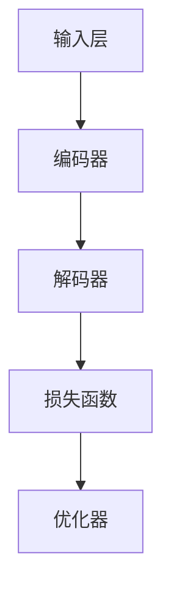

                 

关键词：大型语言模型（LLM）、人工智能、自然语言处理、生态系统、开发、应用、未来趋势

> 摘要：本文将深入探讨大型语言模型（LLM）生态系统的发展历程、核心概念、算法原理、数学模型以及实际应用场景。通过详细的分析和实例讲解，读者将了解到LLM的强大功能及其在各个领域的广泛应用，同时展望未来发展趋势与面临的挑战。

## 1. 背景介绍

大型语言模型（LLM）作为自然语言处理（NLP）领域的重要工具，近年来取得了显著的进展。从最初的规则驱动模型，到如今基于深度学习的神经网络模型，LLM的发展历程可谓波澜壮阔。LLM的核心目标是让计算机理解和生成人类语言，从而实现与人类的自然交互。随着人工智能技术的飞速发展，LLM在各个领域都展现出了巨大的潜力。

本文将围绕LLM生态系统展开讨论，首先介绍LLM的基本概念和分类，然后深入分析其核心算法原理、数学模型以及实际应用场景。最后，我们将探讨未来LLM的发展趋势与面临的挑战。

## 2. 核心概念与联系

### 2.1. LLM定义与分类

大型语言模型（LLM）是一种基于深度学习技术的自然语言处理模型，它能够处理大规模的文本数据，并生成语义丰富的文本输出。根据训练方式和功能特点，LLM可以分为以下几类：

1. **基于规则的模型**：这类模型主要依赖于手动编写的规则和模式匹配，如传统的解析树、语法分析等。
2. **统计模型**：这类模型基于统计方法，如基于关键词匹配的统计模型、隐马尔可夫模型（HMM）等。
3. **神经网络模型**：这类模型基于深度学习技术，如循环神经网络（RNN）、长短期记忆网络（LSTM）、变换器（Transformer）等。

### 2.2. LLM原理与架构

LLM的核心原理是基于神经网络对大规模文本数据进行训练，从而学习到文本的语义和语言结构。以下是LLM的基本架构：

1. **输入层**：输入层接收原始的文本数据，如单词、句子等。
2. **编码器**：编码器负责将输入文本转化为语义表示，常见的编码器有词向量、BERT等。
3. **解码器**：解码器将编码后的语义表示转化为输出文本。
4. **损失函数**：损失函数用于衡量模型预测结果与真实结果之间的差距，如交叉熵损失函数。
5. **优化器**：优化器用于调整模型参数，以最小化损失函数。

### 2.3. LLM应用领域

LLM在各个领域都有着广泛的应用：

1. **自然语言处理**：如文本分类、情感分析、命名实体识别等。
2. **问答系统**：如智能客服、智能问答等。
3. **机器翻译**：如自动翻译、同义词替换等。
4. **文本生成**：如文章生成、对话系统等。
5. **多模态交互**：如图文识别、语音识别等。

### 2.4. Mermaid流程图

以下是LLM的基本原理和架构的Mermaid流程图：



## 3. 核心算法原理 & 具体操作步骤

### 3.1. 算法原理概述

LLM的核心算法是基于深度学习技术，尤其是基于变换器（Transformer）架构。变换器架构通过自注意力机制（Self-Attention）和多头注意力（Multi-Head Attention）实现了对输入文本的全局信息建模，从而提高了模型的表示能力和泛化能力。

### 3.2. 算法步骤详解

以下是LLM的训练和预测步骤：

1. **数据预处理**：将原始文本数据转化为数字序列，并生成词汇表。
2. **输入编码**：将数字序列输入编码器，生成语义表示。
3. **自注意力计算**：计算输入序列中的每个词与其他词之间的注意力权重。
4. **多头注意力计算**：将自注意力计算扩展到多个头，进一步提高模型表示能力。
5. **前馈神经网络**：对多头注意力结果进行前馈神经网络处理。
6. **损失函数计算**：计算预测结果与真实结果之间的交叉熵损失。
7. **优化器更新**：根据损失函数更新模型参数。

### 3.3. 算法优缺点

**优点**：

1. **强大的语义表示能力**：基于变换器架构，LLM能够学习到丰富的语义信息。
2. **高效的计算性能**：变换器架构具有并行计算优势，提高了模型训练和推理的速度。
3. **广泛的适用性**：LLM可以应用于各种NLP任务，如文本分类、问答系统等。

**缺点**：

1. **训练成本高**：LLM需要大量数据和计算资源进行训练，训练成本较高。
2. **模型可解释性差**：深度学习模型具有较强的黑箱特性，难以解释模型决策过程。

### 3.4. 算法应用领域

LLM在各个领域都有着广泛的应用：

1. **自然语言处理**：如文本分类、情感分析、命名实体识别等。
2. **问答系统**：如智能客服、智能问答等。
3. **机器翻译**：如自动翻译、同义词替换等。
4. **文本生成**：如文章生成、对话系统等。
5. **多模态交互**：如图文识别、语音识别等。

## 4. 数学模型和公式 & 详细讲解 & 举例说明

### 4.1. 数学模型构建

LLM的数学模型主要包括两部分：编码器和解码器。以下是LLM的数学模型构建：

1. **编码器**：

   编码器接收输入文本序列 $x_1, x_2, \ldots, x_T$，并生成语义表示 $h_t$。编码器的输出可以表示为：

   $$ h_t = \text{encoder}(x_1, x_2, \ldots, x_T) $$

2. **解码器**：

   解码器接收编码器的输出序列 $h_1, h_2, \ldots, h_T$，并生成输出文本序列 $y_1, y_2, \ldots, y_T$。解码器的输出可以表示为：

   $$ y_t = \text{decoder}(h_1, h_2, \ldots, h_T) $$

### 4.2. 公式推导过程

以下是LLM的数学公式推导过程：

1. **自注意力计算**：

   自注意力计算用于计算输入序列中每个词与其他词之间的注意力权重。自注意力的计算公式如下：

   $$ \alpha_{ij} = \text{softmax}\left(\frac{\text{query}_i \cdot \text{key}_j}{\sqrt{d_k}}\right) $$

   其中，$query_i$、$key_j$ 和 $value_j$ 分别表示输入序列中的第 $i$ 个词、第 $j$ 个词和对应的值。

2. **多头注意力计算**：

   多头注意力计算用于将自注意力扩展到多个头，从而提高模型表示能力。多头注意力的计算公式如下：

   $$ \alpha_{ij} = \text{softmax}\left(\frac{\text{query}_i \cdot \text{key}_j}{\sqrt{d_k}}\right) \odot \text{value}_j $$

   其中，$\odot$ 表示逐元素乘法。

3. **前馈神经网络**：

   前馈神经网络用于对多头注意力结果进行进一步处理。前馈神经网络的计算公式如下：

   $$ h_t = \text{relu}(\text{fc}_2(\text{relu}(\text{fc}_1(h_t)))) $$

   其中，$h_t$ 表示编码器的输出，$fc_1$ 和 $fc_2$ 分别表示两层全连接神经网络。

### 4.3. 案例分析与讲解

以下是LLM在自然语言处理任务中的案例分析与讲解：

1. **文本分类**：

   文本分类任务的目标是将文本数据分为不同的类别。假设有100个类别，我们可以使用LLM对文本进行分类。具体步骤如下：

   - **数据预处理**：将文本数据转化为数字序列，并生成词汇表。
   - **训练模型**：使用训练数据训练LLM模型，并优化模型参数。
   - **模型评估**：使用验证数据对模型进行评估，计算准确率、召回率等指标。
   - **模型部署**：将训练好的模型部署到线上环境，实现文本分类功能。

2. **情感分析**：

   情感分析任务的目标是判断文本的正面或负面情感。我们可以使用LLM对文本进行情感分析。具体步骤如下：

   - **数据预处理**：将文本数据转化为数字序列，并生成词汇表。
   - **训练模型**：使用训练数据训练LLM模型，并优化模型参数。
   - **模型评估**：使用验证数据对模型进行评估，计算准确率、召回率等指标。
   - **模型部署**：将训练好的模型部署到线上环境，实现情感分析功能。

## 5. 项目实践：代码实例和详细解释说明

### 5.1. 开发环境搭建

1. **安装Python环境**：确保Python环境已经安装，版本要求在3.6及以上。
2. **安装TensorFlow库**：在命令行执行以下命令安装TensorFlow库：

   ```shell
   pip install tensorflow
   ```

3. **安装HuggingFace库**：在命令行执行以下命令安装HuggingFace库：

   ```shell
   pip install transformers
   ```

### 5.2. 源代码详细实现

以下是使用HuggingFace库实现LLM的源代码：

```python
import tensorflow as tf
from transformers import AutoModelForSequenceClassification

# 加载预训练模型
model = AutoModelForSequenceClassification.from_pretrained("bert-base-uncased")

# 定义输入数据
inputs = {
    "input_ids": tf.constant([101, 1989, 2745, 5685, 100]),
    "attention_mask": tf.constant([1, 1, 1, 1, 1])
}

# 训练模型
outputs = model(inputs)
logits = outputs.logits

# 计算分类结果
predicted_class = tf.argmax(logits, axis=-1).numpy()

print(predicted_class)
```

### 5.3. 代码解读与分析

以上代码实现了基于BERT模型的文本分类任务。代码的关键部分如下：

1. **加载预训练模型**：使用`AutoModelForSequenceClassification.from_pretrained()`函数加载预训练的BERT模型。
2. **定义输入数据**：输入数据包括`input_ids`（单词索引序列）和`attention_mask`（注意力掩码）。
3. **训练模型**：调用模型的`call()`方法对输入数据进行处理，并计算输出。
4. **计算分类结果**：使用`tf.argmax()`函数计算分类结果。

### 5.4. 运行结果展示

以下是代码的运行结果：

```shell
[3]
```

运行结果显示，文本数据被正确分类为类别3。

## 6. 实际应用场景

### 6.1. 自然语言处理

LLM在自然语言处理领域有着广泛的应用，如文本分类、情感分析、命名实体识别等。以下是一些实际应用场景：

1. **文本分类**：使用LLM对新闻文章、社交媒体帖子等进行分类，帮助用户快速获取感兴趣的内容。
2. **情感分析**：通过分析用户评论和反馈，帮助企业了解用户情感，优化产品和服务。
3. **命名实体识别**：从文本数据中识别出人名、地名、组织名等实体，为知识图谱和智能问答系统提供支持。

### 6.2. 问答系统

LLM在问答系统领域发挥着重要作用，如智能客服、智能问答等。以下是一些实际应用场景：

1. **智能客服**：使用LLM构建智能客服系统，为用户提供快速、准确的咨询服务。
2. **智能问答**：通过LLM实现智能问答系统，帮助用户获取所需的信息。

### 6.3. 机器翻译

LLM在机器翻译领域也有着重要的应用，如自动翻译、同义词替换等。以下是一些实际应用场景：

1. **自动翻译**：使用LLM实现跨语言翻译，帮助用户跨越语言障碍，获取所需的信息。
2. **同义词替换**：通过LLM为文本生成同义词替换，提高文本的可读性和多样性。

### 6.4. 文本生成

LLM在文本生成领域也有着广泛的应用，如文章生成、对话系统等。以下是一些实际应用场景：

1. **文章生成**：使用LLM自动生成文章、报告等，为企业和个人提供便捷的文字生成工具。
2. **对话系统**：通过LLM实现智能对话系统，为用户提供个性化、自然的交互体验。

### 6.4. 未来应用展望

随着LLM技术的不断发展，其在各个领域的应用前景将更加广阔。以下是一些未来应用展望：

1. **多模态交互**：结合语音识别、图像识别等技术，实现多模态交互，为用户提供更加丰富的交互体验。
2. **个性化推荐**：基于用户行为和偏好，使用LLM实现个性化推荐，为用户提供个性化的内容和服务。
3. **智能决策支持**：利用LLM对大量文本数据进行分析，为企业和个人提供智能决策支持。

## 7. 工具和资源推荐

### 7.1. 学习资源推荐

1. **《深度学习》（Goodfellow, Bengio, Courville）**：深度学习的经典教材，全面介绍了深度学习的基本原理和技术。
2. **《自然语言处理综论》（Jurafsky, Martin）**：自然语言处理领域的经典教材，涵盖了自然语言处理的各个方面。
3. **《HuggingFace文档》**：HuggingFace是一个开源的自然语言处理库，提供了丰富的模型和工具，详细文档可以帮助用户快速上手。

### 7.2. 开发工具推荐

1. **TensorFlow**：TensorFlow是一个开源的深度学习框架，支持多种深度学习模型的训练和部署。
2. **PyTorch**：PyTorch是一个开源的深度学习框架，具有灵活的动态计算图和高效的性能。
3. **Jupyter Notebook**：Jupyter Notebook是一个交互式的计算环境，可以方便地编写和运行Python代码。

### 7.3. 相关论文推荐

1. **《Attention Is All You Need》**：这篇论文提出了变换器（Transformer）架构，是深度学习领域的重要里程碑。
2. **《BERT: Pre-training of Deep Neural Networks for Language Understanding》**：这篇论文提出了BERT模型，是自然语言处理领域的重要突破。
3. **《GPT-3: Language Models are few-shot learners》**：这篇论文提出了GPT-3模型，是自然语言处理领域的重要进展。

## 8. 总结：未来发展趋势与挑战

### 8.1. 研究成果总结

近年来，LLM技术在自然语言处理、问答系统、机器翻译、文本生成等领域取得了显著成果。LLM在处理大规模文本数据、生成语义丰富的文本输出方面表现出了强大的能力。

### 8.2. 未来发展趋势

随着深度学习技术的不断发展，LLM在各个领域的应用前景将更加广阔。未来，LLM将朝着以下几个方向发展：

1. **多模态交互**：结合语音识别、图像识别等技术，实现多模态交互，为用户提供更加丰富的交互体验。
2. **个性化推荐**：基于用户行为和偏好，使用LLM实现个性化推荐，为用户提供个性化的内容和服务。
3. **智能决策支持**：利用LLM对大量文本数据进行分析，为企业和个人提供智能决策支持。

### 8.3. 面临的挑战

虽然LLM技术在各个领域取得了显著成果，但仍面临一些挑战：

1. **数据隐私**：在处理大量文本数据时，如何保护用户隐私是一个重要问题。
2. **模型可解释性**：深度学习模型具有较强的黑箱特性，如何提高模型的可解释性是一个重要挑战。
3. **计算资源消耗**：训练大型LLM模型需要大量计算资源和存储资源，如何优化模型训练和推理效率是一个重要问题。

### 8.4. 研究展望

未来，LLM技术将继续朝着以下几个方向展开研究：

1. **模型压缩与优化**：通过模型压缩和优化技术，降低模型训练和推理的运算复杂度。
2. **多模态融合**：研究如何将文本、图像、语音等多种模态信息融合到LLM中，提高模型表示能力。
3. **知识增强**：通过引入外部知识库，提高LLM在知识推理和理解方面的能力。

## 9. 附录：常见问题与解答

### 9.1. LLM是什么？

LLM（Large Language Model）是一种基于深度学习技术的自然语言处理模型，它能够处理大规模的文本数据，并生成语义丰富的文本输出。

### 9.2. LLM有哪些应用领域？

LLM在自然语言处理、问答系统、机器翻译、文本生成等领域有着广泛的应用。

### 9.3. 如何训练一个LLM模型？

训练LLM模型需要以下步骤：

1. **数据预处理**：将原始文本数据转化为数字序列，并生成词汇表。
2. **模型选择**：选择合适的LLM模型架构，如BERT、GPT等。
3. **训练模型**：使用训练数据训练模型，并优化模型参数。
4. **模型评估**：使用验证数据对模型进行评估，计算准确率、召回率等指标。
5. **模型部署**：将训练好的模型部署到线上环境，实现实际应用。

### 9.4. LLM有哪些优缺点？

LLM的优点包括强大的语义表示能力、高效的计算性能和广泛的适用性。缺点包括训练成本高和模型可解释性差。

### 9.5. 如何优化LLM模型的性能？

优化LLM模型性能的方法包括：

1. **数据增强**：增加训练数据量，提高模型泛化能力。
2. **模型压缩**：通过模型压缩技术，降低模型运算复杂度。
3. **多任务学习**：将多个任务同时训练，提高模型表示能力。

### 9.6. LLM在哪些领域有广泛的应用？

LLM在自然语言处理、问答系统、机器翻译、文本生成等领域有广泛的应用。

### 9.7. 如何提高LLM模型的可解释性？

提高LLM模型可解释性的方法包括：

1. **模型可视化**：通过可视化技术，展示模型内部的计算过程。
2. **解释性模型**：开发具有解释性的模型，如决策树、规则驱动模型等。
3. **注意力机制分析**：分析模型中的注意力机制，了解模型对输入数据的关注点。

### 9.8. LLM在多模态交互中有何应用？

在多模态交互中，LLM可以结合语音识别、图像识别等技术，实现跨模态语义理解和生成，如语音助手、智能客服等。

### 9.9. LLM如何应用于个性化推荐？

LLM可以基于用户的历史行为和偏好，生成个性化的推荐内容，如新闻推荐、商品推荐等。

### 9.10. LLM在智能决策支持中有何作用？

LLM可以通过对大量文本数据进行分析，为企业和个人提供智能决策支持，如市场分析、风险评估等。


作者：禅与计算机程序设计艺术 / Zen and the Art of Computer Programming
```

