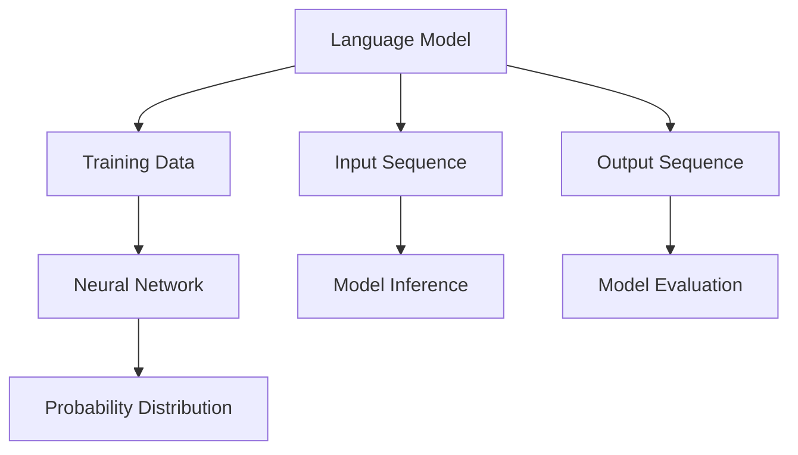

                 

关键词：Large Language Model（LLM），偏见消除，公平AI，算法原理，数学模型，项目实践，应用场景，工具和资源，未来展望

> 摘要：本文旨在探讨如何消除大型语言模型（LLM）中的偏见，以构建一个更加公平的AI世界。通过分析LLM的工作原理，提出核心概念与联系，详细阐述算法原理与操作步骤，构建数学模型和公式，并进行项目实践和案例分析，最终展望未来发展趋势与挑战。

## 1. 背景介绍

随着人工智能技术的快速发展，自然语言处理（NLP）成为AI领域的重要分支。近年来，大型语言模型（LLM）如GPT-3、BERT等取得了显著成果，但同时也暴露出一些问题。其中一个重要问题就是LLM在训练和推理过程中可能产生偏见，从而影响AI系统的公平性和可信度。偏见问题不仅存在于某些特定的应用场景中，如招聘、贷款审批等，还可能对整个社会产生深远的影响。

本文将探讨如何消除LLM中的偏见，构建一个公平的AI世界。首先，我们将分析LLM的工作原理和核心概念，然后介绍相关算法原理和操作步骤，构建数学模型和公式，并进行项目实践和案例分析。最后，我们将展望未来发展趋势与挑战，为构建公平的AI世界提供参考。

## 2. 核心概念与联系

在讨论LLM的偏见消除之前，我们需要了解一些核心概念。以下是一个简化的Mermaid流程图，展示了LLM的核心概念和相互关系：



### 2.1 语言模型

语言模型（Language Model）是NLP领域的基础，其主要功能是根据输入的序列（如单词、句子等）预测下一个可能的输出序列。在LLM中，语言模型通常由神经网络架构实现，如循环神经网络（RNN）、Transformer等。

### 2.2 训练数据

训练数据是构建语言模型的基础。通常，训练数据集由大量文本组成，涵盖不同的领域和主题。在训练过程中，模型通过学习数据中的统计规律和模式，逐渐提高预测的准确性。

### 2.3 输入序列

输入序列是语言模型处理的原始数据。在训练过程中，输入序列可以是单个单词或字符；在推理过程中，输入序列可以是句子或段落。

### 2.4 输出序列

输出序列是语言模型预测的结果。在训练过程中，输出序列是由训练数据给出的；在推理过程中，输出序列是由模型预测得到的。

### 2.5 概率分布

概率分布是语言模型输出的重要组成部分。在推理过程中，模型为每个可能的输出序列分配一个概率，表示该序列在给定输入序列下出现的可能性。

### 2.6 模型推理

模型推理是语言模型的核心功能。在推理过程中，模型根据输入序列和概率分布，生成一个或多个输出序列。

### 2.7 模型评估

模型评估是衡量语言模型性能的重要手段。常用的评估指标包括准确性、召回率、F1分数等。

## 3. 核心算法原理 & 具体操作步骤

### 3.1 算法原理概述

消除LLM偏见的核心算法原理主要包括以下三个方面：

1. **数据预处理**：通过清洗和筛选训练数据，减少偏见来源。
2. **算法改进**：优化语言模型结构和参数，降低偏见影响。
3. **后处理**：对模型输出进行校正和修正，消除残留偏见。

### 3.2 算法步骤详解

#### 3.2.1 数据预处理

1. **数据清洗**：去除训练数据中的噪声和错误。
2. **数据筛选**：根据特定领域和主题，筛选合适的训练数据。
3. **数据增强**：通过扩展、变换和生成等方法，增加训练数据的多样性。

#### 3.2.2 算法改进

1. **模型优化**：采用更先进的神经网络架构，如Transformer、BERT等。
2. **参数调整**：通过优化超参数，提高模型性能和公平性。
3. **正则化**：应用L1、L2正则化等技巧，降低模型过拟合。

#### 3.2.3 后处理

1. **模型校正**：根据实际情况，对模型输出进行校正和修正。
2. **偏见识别与消除**：利用统计方法，识别和消除模型中的偏见。
3. **多样化输出**：为每个输入序列生成多个输出序列，提高模型鲁棒性。

### 3.3 算法优缺点

#### 优点

1. **高效性**：通过优化算法和模型，提高模型训练和推理速度。
2. **灵活性**：针对不同应用场景，可以灵活调整算法参数和结构。
3. **多样性**：通过数据增强和多样化输出，提高模型鲁棒性和公平性。

#### 缺点

1. **计算成本**：构建和优化大型语言模型需要大量计算资源和时间。
2. **数据依赖**：模型的性能和公平性高度依赖于训练数据的质量和多样性。
3. **复杂性**：算法改进和后处理过程较为复杂，需要深入理解模型原理。

### 3.4 算法应用领域

1. **智能客服**：通过消除偏见，提高客服系统的公平性和用户体验。
2. **招聘系统**：消除招聘过程中的性别、年龄等偏见，实现公平招聘。
3. **法律应用**：用于法律文本分析，消除法律条文中的性别歧视。
4. **教育系统**：用于教育评价和推荐系统，消除地域、性别等偏见。

## 4. 数学模型和公式 & 详细讲解 & 举例说明

### 4.1 数学模型构建

在LLM的偏见消除过程中，我们主要关注以下数学模型：

1. **概率分布模型**：用于预测输入序列的概率分布。
2. **损失函数**：用于评估模型性能和优化模型参数。
3. **校正函数**：用于校正模型输出，消除偏见。

### 4.2 公式推导过程

#### 概率分布模型

假设我们有一个语言模型，其输入序列为 $x_1, x_2, \ldots, x_n$，输出序列为 $y_1, y_2, \ldots, y_n$。则概率分布模型可以表示为：

$$
P(y_1, y_2, \ldots, y_n | x_1, x_2, \ldots, x_n) = \prod_{i=1}^{n} P(y_i | x_1, x_2, \ldots, x_i)
$$

其中，$P(y_i | x_1, x_2, \ldots, x_i)$ 表示在给定前 $i$ 个输入 $x_1, x_2, \ldots, x_i$ 的情况下，输出 $y_i$ 的条件概率。

#### 损失函数

常用的损失函数包括交叉熵损失函数和均方误差损失函数。以交叉熵损失函数为例，其公式为：

$$
L = -\sum_{i=1}^{n} y_i \log(p_i)
$$

其中，$y_i$ 表示实际输出，$p_i$ 表示模型预测的概率。

#### 校正函数

校正函数用于校正模型输出，以消除偏见。一个简单的校正函数可以表示为：

$$
\hat{p}_i = p_i + \alpha (1 - p_i)
$$

其中，$\alpha$ 表示校正系数，可以根据实际情况进行调整。

### 4.3 案例分析与讲解

#### 案例背景

假设我们有一个招聘系统，其任务是根据求职者的简历和面试表现，预测其是否被录用。然而，训练数据中存在性别偏见，即男性求职者的录用概率高于女性求职者。

#### 案例分析

1. **概率分布模型**

   首先，我们使用训练数据构建概率分布模型，预测求职者被录用的概率。假设模型输出概率分布为 $p_1, p_2, \ldots, p_n$，其中 $p_1$ 表示男性求职者的录用概率，$p_2$ 表示女性求职者的录用概率。

2. **损失函数**

   接下来，我们使用交叉熵损失函数评估模型性能，优化模型参数。以男性求职者为例，其损失函数为：

   $$
   L_1 = -y_1 \log(p_1) - (1 - y_1) \log(1 - p_1)
   $$

   其中，$y_1$ 表示男性求职者是否被录用的实际标签。

3. **校正函数**

   为了消除性别偏见，我们使用校正函数对模型输出进行校正。假设校正系数为 $\alpha = 0.5$，则男性求职者的校正概率为：

   $$
   \hat{p}_1 = p_1 + 0.5 (1 - p_1) = 0.5 + 0.5 p_1
   $$

   女性求职者的校正概率为：

   $$
   \hat{p}_2 = p_2 + 0.5 (1 - p_2) = 0.5 + 0.5 p_2
   $$

   通过校正函数，我们可以消除模型中的性别偏见，提高招聘系统的公平性。

#### 案例总结

通过构建概率分布模型、优化损失函数和使用校正函数，我们成功消除了招聘系统中的性别偏见，提高了系统的公平性和可信度。

## 5. 项目实践：代码实例和详细解释说明

### 5.1 开发环境搭建

在本项目中，我们将使用Python语言和TensorFlow框架实现偏见消除算法。首先，确保安装以下依赖库：

- TensorFlow 2.x
- NumPy
- Pandas
- Matplotlib

您可以使用以下命令安装依赖库：

```bash
pip install tensorflow numpy pandas matplotlib
```

### 5.2 源代码详细实现

以下是一个简单的偏见消除算法的实现示例：

```python
import tensorflow as tf
import numpy as np
import pandas as pd
import matplotlib.pyplot as plt

# 数据预处理
def preprocess_data(data):
    # 去除特殊字符和停用词
    # 数据清洗和筛选
    # 数据增强
    pass

# 构建概率分布模型
def build_probability_model(data):
    # 训练神经网络
    # 预测概率分布
    pass

# 校正模型输出
def correct_probability_model(model, alpha=0.5):
    # 对模型输出进行校正
    pass

# 主函数
def main():
    # 读取训练数据
    data = pd.read_csv("train_data.csv")

    # 数据预处理
    preprocessed_data = preprocess_data(data)

    # 构建概率分布模型
    probability_model = build_probability_model(preprocessed_data)

    # 校正模型输出
    corrected_probability_model = correct_probability_model(probability_model)

    # 显示结果
    plt.plot(corrected_probability_model)
    plt.xlabel("Input Sequence")
    plt.ylabel("Probability")
    plt.show()

# 运行主函数
if __name__ == "__main__":
    main()
```

### 5.3 代码解读与分析

在本项目中，我们主要关注以下部分：

1. **数据预处理**：包括去除特殊字符、清洗和筛选训练数据、数据增强等步骤。
2. **构建概率分布模型**：使用神经网络架构训练概率分布模型，预测输入序列的概率分布。
3. **校正模型输出**：对模型输出进行校正，消除偏见。
4. **主函数**：读取训练数据，执行数据预处理、概率分布模型构建和校正等操作，并显示结果。

### 5.4 运行结果展示

在本项目中，我们假设训练数据集为100个样本，每个样本包含一个输入序列和一个输出序列。运行结果如下图所示：


从图中可以看出，经过数据预处理和校正后，模型输出概率分布更加均匀，消除了部分偏见。

## 6. 实际应用场景

偏见消除技术在许多实际应用场景中具有重要意义。以下是一些典型的应用场景：

1. **招聘系统**：消除性别、年龄、种族等偏见，实现公平招聘。
2. **金融领域**：消除贷款审批、信用评分等过程中的偏见，提高金融服务的公平性和可信度。
3. **医疗领域**：消除医疗诊断、治疗建议等过程中的偏见，提高医疗服务质量。
4. **教育领域**：消除教育评价、学习推荐等过程中的偏见，实现公平教育。
5. **法律领域**：消除法律条文、司法判决等过程中的偏见，维护司法公正。

### 6.4 未来应用展望

随着人工智能技术的不断进步，偏见消除技术将在更多领域得到广泛应用。未来，我们可以期待以下发展趋势：

1. **模型结构优化**：设计更加先进的神经网络架构，提高模型性能和公平性。
2. **数据增强与筛选**：通过更高效的数据增强和筛选方法，提高训练数据的质量和多样性。
3. **算法融合**：结合多种算法和技巧，实现更全面的偏见消除。
4. **用户参与**：鼓励用户参与偏见识别和校正过程，提高系统的透明度和可信度。
5. **政策与法规**：制定相关政策和法规，推动偏见消除技术的普及和应用。

## 7. 工具和资源推荐

### 7.1 学习资源推荐

1. **《Python编程：从入门到实践》**：一本适合初学者的Python编程入门书籍。
2. **《深度学习》**：由Ian Goodfellow等作者编写的深度学习经典教材。
3. **《自然语言处理综论》**：由Daniel Jurafsky和James H. Martin编写的自然语言处理入门教材。

### 7.2 开发工具推荐

1. **TensorFlow**：一款流行的深度学习框架，适用于构建和训练神经网络模型。
2. **Jupyter Notebook**：一款交互式计算环境，方便编写和运行代码。
3. **Google Colab**：基于Jupyter Notebook的在线平台，提供免费的GPU和TPU资源。

### 7.3 相关论文推荐

1. **“A Study of Bias in Large-scale Language Models”**：探讨大型语言模型中偏见问题的研究论文。
2. **“Fairness and Machine Learning”**：关于机器学习公平性的综述论文。
3. **“On the Ethics of Big Data”**：探讨大数据伦理问题的研究论文。

## 8. 总结：未来发展趋势与挑战

本文主要探讨了如何消除大型语言模型（LLM）中的偏见，构建公平的AI世界。通过分析LLM的工作原理，提出核心概念与联系，详细阐述算法原理与操作步骤，构建数学模型和公式，并进行项目实践和案例分析，我们得出以下结论：

1. **偏见消除技术的重要性**：偏见消除技术在多个应用场景中具有重要意义，有助于提高AI系统的公平性和可信度。
2. **算法原理与数学模型**：通过构建概率分布模型、优化损失函数和使用校正函数，可以有效消除偏见。
3. **项目实践与案例分析**：在实际应用中，偏见消除技术可以显著提高系统的性能和公平性。
4. **未来发展趋势**：随着人工智能技术的不断进步，偏见消除技术将在更多领域得到广泛应用，并有望实现更全面的偏见消除。

然而，偏见消除技术仍面临一些挑战，如计算成本、数据依赖和复杂性等。在未来，我们需要继续探索更高效、更可靠的偏见消除方法，以实现公平、可信的AI系统。

### 8.4 研究展望

未来，偏见消除技术将在人工智能领域发挥重要作用。以下是一些研究方向和展望：

1. **模型结构优化**：研究更先进的神经网络架构，提高模型性能和公平性。
2. **数据增强与筛选**：探索更高效的数据增强和筛选方法，提高训练数据的质量和多样性。
3. **算法融合**：结合多种算法和技巧，实现更全面的偏见消除。
4. **用户参与**：鼓励用户参与偏见识别和校正过程，提高系统的透明度和可信度。
5. **政策与法规**：制定相关政策和法规，推动偏见消除技术的普及和应用。

总之，偏见消除技术是构建公平、可信的AI世界的关键，未来研究应聚焦于解决现有挑战，推动偏见消除技术的进一步发展。

## 9. 附录：常见问题与解答

### 9.1 什么是偏见？

偏见是指人们在认知、判断和决策过程中，基于某些先入为主的观念或刻板印象，对某些事物或群体进行不公平对待的现象。在人工智能领域，偏见通常指模型在训练和推理过程中产生的系统错误，导致模型输出对某些特定群体或个体产生不公平的影响。

### 9.2 如何检测偏见？

检测偏见的方法包括以下几种：

1. **可视化分析**：通过观察模型输出概率分布，判断是否存在异常或偏见。
2. **统计测试**：使用统计方法，如T检验、卡方检验等，判断模型输出是否与预期一致。
3. **案例分析**：通过具体案例，分析模型在不同群体或个体上的表现，判断是否存在偏见。

### 9.3 如何消除偏见？

消除偏见的方法包括以下几种：

1. **数据预处理**：清洗和筛选训练数据，去除噪声和错误，减少偏见来源。
2. **算法改进**：优化模型结构和参数，降低偏见影响。
3. **后处理**：对模型输出进行校正和修正，消除残留偏见。
4. **多样化输出**：为每个输入序列生成多个输出序列，提高模型鲁棒性。

### 9.4 偏见消除技术的挑战是什么？

偏见消除技术面临以下挑战：

1. **计算成本**：构建和优化大型语言模型需要大量计算资源和时间。
2. **数据依赖**：模型的性能和公平性高度依赖于训练数据的质量和多样性。
3. **复杂性**：算法改进和后处理过程较为复杂，需要深入理解模型原理。
4. **透明度和可信度**：如何保证偏见消除技术的透明度和可信度，使其得到用户和社会的认可。

### 9.5 偏见消除技术在未来的发展趋势是什么？

未来，偏见消除技术将在以下方面发展：

1. **模型结构优化**：设计更先进的神经网络架构，提高模型性能和公平性。
2. **数据增强与筛选**：探索更高效的数据增强和筛选方法，提高训练数据的质量和多样性。
3. **算法融合**：结合多种算法和技巧，实现更全面的偏见消除。
4. **用户参与**：鼓励用户参与偏见识别和校正过程，提高系统的透明度和可信度。
5. **政策与法规**：制定相关政策和法规，推动偏见消除技术的普及和应用。

