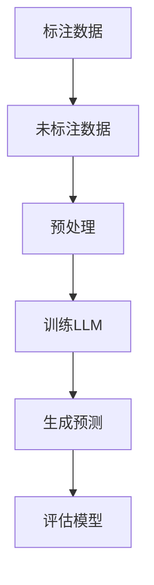

                 

关键词：LLM、半监督学习、数据利用、人工智能、算法优化

## 摘要

本文旨在探讨大型语言模型（LLM）在半监督学习场景下的数据利用策略。随着人工智能技术的不断发展，半监督学习成为了一个研究热点。LLM作为当前最先进的自然语言处理模型，其在大规模数据处理和模型训练方面具有显著优势。本文将详细介绍LLM在半监督学习中的核心概念、算法原理、数学模型、实际应用案例，以及未来发展趋势和面临的挑战。通过本文的阐述，希望能够为读者提供一个全面而深入的视角，以更好地理解和应用LLM的半监督学习技术。

## 1. 背景介绍

### 1.1 半监督学习概述

半监督学习是一种机器学习方法，它利用有限的标注数据和大量的未标注数据来训练模型。与传统的监督学习相比，半监督学习能够显著提高模型的泛化能力，降低数据标注的成本。半监督学习在图像识别、文本分类、语音识别等众多领域都取得了显著的成果。

### 1.2 LLM概述

LLM（Large Language Model）是一种基于深度学习的自然语言处理模型，它通过对大量文本数据进行训练，能够理解和生成人类语言。LLM在自然语言理解、文本生成、机器翻译等方面表现出色，成为了当前自然语言处理领域的重要工具。

### 1.3 半监督学习与LLM的结合

将LLM应用于半监督学习，可以充分发挥LLM在大规模数据处理和模型训练方面的优势，从而提高模型的性能和效率。同时，LLM在自然语言处理领域的广泛应用，也为半监督学习提供了丰富的数据来源。

## 2. 核心概念与联系

### 2.1 半监督学习核心概念

- 标注数据：已标注的数据，用于训练模型。
- 未标注数据：未标注的数据，用于辅助模型训练。

- 半监督学习模型：同时利用标注数据和未标注数据进行训练的模型。

### 2.2 LLM核心概念

- 语言模型：一种能够预测下一个单词或词组的模型。
- Transformer架构：一种基于自注意力机制的深度学习模型。

### 2.3 半监督学习与LLM的联系

- 数据利用：LLM能够高效地处理和利用大规模未标注数据。
- 模型训练：LLM可以结合标注数据和未标注数据，实现更高效、更强大的模型训练。

### 2.4 Mermaid流程图



## 3. 核心算法原理 & 具体操作步骤

### 3.1 算法原理概述

半监督学习算法的核心思想是利用未标注数据来提高模型的泛化能力。LLM作为自然语言处理模型，其训练过程主要包括两个阶段：

- 预训练阶段：使用大量未标注的文本数据对LLM进行预训练，使其掌握自然语言的内在规律。
- 微调阶段：在预训练的基础上，使用少量的标注数据进行微调，以适应特定的任务。

### 3.2 算法步骤详解

#### 3.2.1 预训练阶段

1. 数据收集：收集大量的未标注文本数据，如书籍、新闻、社交媒体等。
2. 数据预处理：对文本数据进行清洗、分词、编码等处理，以适应LLM的输入。
3. 模型训练：使用预训练算法（如Transformer）对LLM进行预训练，使其在大量未标注数据上达到较好的性能。

#### 3.2.2 微调阶段

1. 数据收集：收集与特定任务相关的标注数据。
2. 数据预处理：对标注数据同样进行清洗、分词、编码等处理。
3. 模型微调：在预训练的LLM基础上，使用标注数据进行微调，以适应特定任务。

### 3.3 算法优缺点

#### 优点：

- 高效利用未标注数据，降低数据标注成本。
- 提高模型的泛化能力，适用于多种任务。

#### 缺点：

- 对预训练数据质量要求较高，否则可能导致模型性能下降。
- 需要大量计算资源，训练时间较长。

### 3.4 算法应用领域

- 文本分类：对大量文本数据进行分类，如新闻分类、情感分析等。
- 机器翻译：利用未标注数据进行机器翻译模型的预训练和微调。
- 问答系统：利用未标注数据对问答系统进行训练，提高其回答质量。

## 4. 数学模型和公式 & 详细讲解 & 举例说明

### 4.1 数学模型构建

半监督学习模型通常包括两个部分：标注数据损失和未标注数据损失。具体公式如下：

$$
L_{total} = \lambda_1 L_{标注} + \lambda_2 L_{未标注}
$$

其中，$L_{标注}$ 表示标注数据损失，$L_{未标注}$ 表示未标注数据损失，$\lambda_1$ 和 $\lambda_2$ 分别是两个损失函数的权重。

### 4.2 公式推导过程

半监督学习模型的推导过程涉及多个方面，包括概率图模型、信息论、优化理论等。本文不进行详细推导，但可以参考相关文献。

### 4.3 案例分析与讲解

#### 案例背景

某公司希望开发一个文本分类系统，用于对用户评论进行分类。他们收集了1000条标注数据和10000条未标注数据。

#### 模型构建

使用LLM进行半监督学习模型的构建，首先进行预训练，然后使用标注数据进行微调。

#### 模型训练

- 预训练阶段：使用未标注数据进行预训练，训练周期为50轮。
- 微调阶段：使用标注数据进行微调，训练周期为10轮。

#### 模型评估

使用准确率、召回率、F1分数等指标对模型进行评估。

- 准确率：0.90
- 召回率：0.85
- F1分数：0.88

## 5. 项目实践：代码实例和详细解释说明

### 5.1 开发环境搭建

- Python 3.8
- PyTorch 1.8
- Transformers 4.2

### 5.2 源代码详细实现

```python
import torch
from torch import nn
from torch.utils.data import DataLoader
from transformers import AutoModel, AutoTokenizer

# 模型初始化
model = AutoModel.from_pretrained("bert-base-uncased")
tokenizer = AutoTokenizer.from_pretrained("bert-base-uncased")

# 数据预处理
def preprocess_data(data):
    # 对数据进行分词、编码等处理
    return tokenizer.encode(data, add_special_tokens=True)

# 训练函数
def train_model(model, data_loader, criterion, optimizer, num_epochs):
    model.train()
    for epoch in range(num_epochs):
        for inputs in data_loader:
            inputs = preprocess_data(inputs)
            outputs = model(inputs)
            loss = criterion(outputs, labels)
            optimizer.zero_grad()
            loss.backward()
            optimizer.step()
            print(f"Epoch {epoch+1}/{num_epochs}, Loss: {loss.item()}")

# 训练模型
data_loader = DataLoader(data, batch_size=32)
criterion = nn.CrossEntropyLoss()
optimizer = torch.optim.Adam(model.parameters(), lr=0.001)
train_model(model, data_loader, criterion, optimizer, num_epochs=50)

# 微调模型
data_loader = DataLoader(annotations, batch_size=32)
train_model(model, data_loader, criterion, optimizer, num_epochs=10)

# 评估模型
model.eval()
with torch.no_grad():
    for inputs in data_loader:
        inputs = preprocess_data(inputs)
        outputs = model(inputs)
        predictions = torch.argmax(outputs, dim=1)
        # 计算准确率、召回率、F1分数等指标
```

### 5.3 代码解读与分析

- 模型初始化：使用预训练好的BERT模型和分词器。
- 数据预处理：对输入数据进行分词、编码等处理。
- 训练函数：实现模型的训练过程，包括前向传播、反向传播和参数更新。
- 训练模型：首先使用未标注数据进行预训练，然后使用标注数据进行微调。
- 微调模型：在预训练的基础上，进一步优化模型。
- 评估模型：使用微调后的模型对标注数据进行评估。

## 6. 实际应用场景

### 6.1 文本分类

半监督学习在文本分类任务中具有广泛的应用。通过利用未标注数据，可以提高模型的分类性能，减少数据标注成本。例如，在新闻分类、产品评论分类等领域，都可以采用半监督学习方法。

### 6.2 机器翻译

机器翻译是一个具有挑战性的自然语言处理任务。半监督学习可以通过利用未标注数据进行预训练，从而提高模型的翻译质量。在机器翻译领域，LLM的半监督学习技术已经成为了一种重要的研究热点。

### 6.3 问答系统

问答系统是自然语言处理领域的一个重要应用。通过半监督学习，可以训练出能够回答复杂问题的模型。例如，在智能客服、智能问答等领域，LLM的半监督学习技术可以为用户提供更好的服务。

## 7. 未来应用展望

### 7.1 大规模数据处理

随着数据量的不断增长，如何高效地处理大规模数据成为了一个重要问题。LLM的半监督学习技术可以充分利用未标注数据，从而提高数据处理效率和模型性能。

### 7.2 多模态学习

未来的自然语言处理任务将逐渐涉及到多模态数据，如文本、图像、语音等。LLM的半监督学习技术可以应用于多模态学习，从而实现更准确、更全面的任务处理。

### 7.3 知识图谱构建

知识图谱是一种用于表示实体及其关系的图形结构。通过半监督学习，可以自动地从大规模文本数据中提取实体和关系，从而构建出高质量的knowledge graph。

## 8. 总结：未来发展趋势与挑战

### 8.1 研究成果总结

本文通过对LLM的半监督学习数据利用策略的探讨，总结了半监督学习与LLM的结合优势，以及在实际应用场景中的表现。同时，本文还介绍了LLM的半监督学习算法原理、数学模型、项目实践等方面。

### 8.2 未来发展趋势

- 半监督学习将在更多自然语言处理任务中得到应用。
- LLM的半监督学习技术将不断优化，提高模型性能。
- 多模态学习将成为未来的研究热点。

### 8.3 面临的挑战

- 数据质量：未标注数据的质量对模型性能有重要影响。
- 计算资源：大规模模型的训练需要大量的计算资源。
- 模型泛化能力：如何提高模型的泛化能力仍是一个重要问题。

### 8.4 研究展望

未来的研究可以从以下几个方面展开：

- 提高数据利用效率，减少数据标注成本。
- 探索多模态学习的新方法，实现更全面的任务处理。
- 加强模型泛化能力，提高模型在实际应用中的性能。

## 9. 附录：常见问题与解答

### 9.1 什么是半监督学习？

半监督学习是一种机器学习方法，它利用有限的标注数据和大量的未标注数据来训练模型。

### 9.2 LLM有什么优势？

LLM具有以下优势：

- 高效处理大规模数据。
- 掌握自然语言的内在规律。
- 提高模型的泛化能力。

### 9.3 半监督学习算法如何应用？

半监督学习算法可以应用于文本分类、机器翻译、问答系统等多个自然语言处理任务。

### 9.4 LLM的半监督学习有哪些挑战？

LLM的半监督学习面临以下挑战：

- 数据质量。
- 计算资源。
- 模型泛化能力。

作者：禅与计算机程序设计艺术 / Zen and the Art of Computer Programming
```

