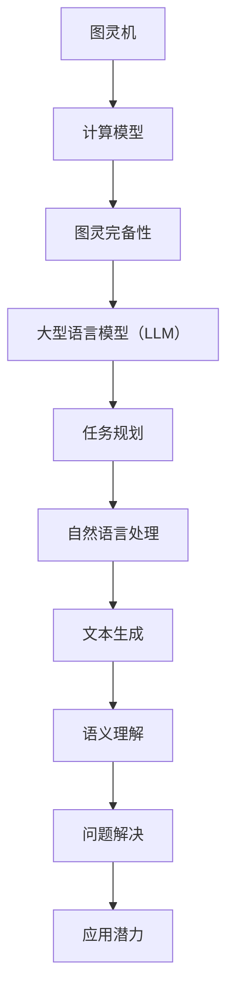

                 

关键词：大型语言模型（LLM），图灵完备性，任务规划，人工智能，自然语言处理，算法，数学模型，代码实例，应用场景，未来展望

> 摘要：本文深入探讨了大型语言模型（LLM）的图灵完备性及其在任务规划中的应用。通过对LLM的工作原理、数学模型、算法步骤、实际应用以及未来展望的详细分析，本文旨在为读者提供一个全面的理解，并展示LLM在自然语言处理和任务规划中的巨大潜力。

## 1. 背景介绍

随着人工智能技术的飞速发展，大型语言模型（LLM）已经成为自然语言处理领域的重要工具。LLM通过深度学习算法，对大量的文本数据进行分析和建模，能够生成高质量的文本、理解自然语言语义以及执行复杂的任务。LLM的图灵完备性是其在自然语言处理中应用的重要特性之一。

图灵完备性是指一个计算模型能够模拟任何图灵机的计算过程。如果一个计算模型能够执行图灵机所能执行的任何计算，那么它就是图灵完备的。在计算机科学中，图灵完备性是一个计算模型是否能够解决所有可计算问题的关键特性。LLM的图灵完备性使得它能够处理复杂的自然语言任务，并具有广泛的应用潜力。

本文将首先介绍LLM的图灵完备性，然后深入探讨其在任务规划中的应用，包括数学模型、算法原理和具体操作步骤。最后，我们将讨论LLM在实际应用场景中的表现，并展望其未来的发展趋势和面临的挑战。

## 2. 核心概念与联系

### 2.1 图灵机与图灵完备性

图灵机是由英国数学家艾伦·图灵（Alan Turing）在20世纪30年代提出的一种抽象计算模型。图灵机由一个无限长的纸带、一个读写头和一系列的规则组成。通过在纸带上读取和写入符号，并根据预设的规则进行状态转移，图灵机能够模拟任何计算过程。

图灵完备性是指一个计算模型能够执行图灵机所能执行的任何计算。换句话说，如果一个计算模型能够解决所有可计算问题，那么它就是图灵完备的。

### 2.2 大型语言模型（LLM）

大型语言模型（LLM）是基于神经网络和深度学习技术的自然语言处理模型。LLM通过大规模的文本数据训练，能够捕捉到语言的统计规律和语义信息，从而生成高质量的文本、理解自然语言的语义以及执行复杂的任务。

### 2.3 图灵完备性与LLM的关系

LLM的图灵完备性表明，它能够模拟任何图灵机的计算过程。这意味着LLM不仅能够处理简单的自然语言任务，如文本生成和语义理解，还能够解决更复杂的任务，如任务规划和问题解决。

### 2.4 Mermaid流程图

以下是一个Mermaid流程图，展示了LLM的图灵完备性与任务规划之间的关系。



## 3. 核心算法原理 & 具体操作步骤

### 3.1 算法原理概述

LLM的任务规划基于其图灵完备性，通过模拟图灵机的计算过程，实现复杂自然语言任务的处理。LLM的任务规划算法主要包括以下步骤：

1. 数据预处理：对输入的文本数据进行分析和预处理，提取关键信息和特征。
2. 语义理解：利用LLM的语义理解能力，对文本进行语义分析，获取文本的含义和结构。
3. 任务分解：将复杂任务分解为多个子任务，并确定子任务之间的依赖关系。
4. 优化策略：根据子任务之间的依赖关系和资源限制，设计优化策略，选择最优的任务执行顺序。
5. 执行与监控：根据优化策略执行任务，并对任务执行过程进行监控和调整。

### 3.2 算法步骤详解

#### 3.2.1 数据预处理

数据预处理是任务规划的基础，主要步骤包括：

1. 清洗数据：去除文本中的噪声和冗余信息，如标点符号、停用词等。
2. 分词：将文本分割成单词或短语，以便进行后续的语义分析。
3. 词向量化：将文本中的单词或短语转换为向量表示，以便进行数学运算。

#### 3.2.2 语义理解

语义理解是任务规划的核心，主要步骤包括：

1. 词性标注：对文本中的每个词进行词性标注，如名词、动词、形容词等。
2. 句法分析：对文本进行句法分析，识别句子中的语法结构和成分。
3. 语义角色标注：对文本中的关键实体和关系进行标注，如人名、地名、事件等。

#### 3.2.3 任务分解

任务分解是将复杂任务分解为多个子任务的过程，主要步骤包括：

1. 子任务识别：根据语义分析结果，识别文本中的关键子任务。
2. 子任务依赖关系分析：分析子任务之间的依赖关系，确定任务执行的先后顺序。

#### 3.2.4 优化策略

优化策略是任务规划的关键，主要步骤包括：

1. 资源评估：评估任务执行所需的资源，如时间、计算能力、数据等。
2. 优化目标确定：根据资源限制和任务需求，确定优化目标，如最小化执行时间、最大化资源利用率等。
3. 策略选择：根据优化目标和资源评估结果，选择最优的任务执行策略。

#### 3.2.5 执行与监控

执行与监控是任务规划的实际操作过程，主要步骤包括：

1. 任务执行：根据优化策略，执行任务。
2. 进度监控：监控任务执行进度，及时发现并解决问题。
3. 结果评估：对任务执行结果进行评估，确保任务目标达成。

### 3.3 算法优缺点

#### 优点：

1. 图灵完备性：LLM具有图灵完备性，能够处理复杂的自然语言任务。
2. 高效性：基于深度学习技术，LLM在处理大规模数据时具有较高的计算效率。
3. 通用性：LLM可以应用于多种自然语言处理任务，如文本生成、语义理解、问题解决等。

#### 缺点：

1. 计算资源消耗大：训练和执行LLM任务需要大量的计算资源和时间。
2. 数据依赖性：LLM的性能受训练数据的影响较大，对数据质量和数量有较高要求。
3. 难以解释性：LLM的内部决策过程较为复杂，难以解释和调试。

### 3.4 算法应用领域

LLM的任务规划算法在多个领域具有广泛的应用潜力，主要包括：

1. 智能客服：利用LLM的任务规划能力，实现智能客服系统，提供高效、个性化的服务。
2. 自动化测试：利用LLM的语义理解和任务规划能力，自动化生成测试用例和测试脚本。
3. 信息检索：利用LLM的语义分析和任务规划能力，优化信息检索系统的检索效果。
4. 自然语言生成：利用LLM的文本生成能力，生成高质量的文章、报告和文档。

## 4. 数学模型和公式 & 详细讲解 & 举例说明

### 4.1 数学模型构建

LLM的任务规划基于深度学习和自然语言处理技术，其数学模型主要包括以下几个方面：

1. 神经网络模型：用于文本生成、语义理解和任务规划等任务。
2. 词嵌入模型：用于将文本中的单词或短语转换为向量表示。
3. 任务规划模型：用于任务分解、优化策略设计和任务执行监控。

### 4.2 公式推导过程

以下是神经网络模型的公式推导过程：

1. 输入层到隐藏层的传播：
$$
z_i = \sum_{j=1}^{n} w_{ij}x_j + b_i
$$
$$
a_i = \sigma(z_i)
$$
其中，$z_i$为隐藏层第$i$个节点的输入，$w_{ij}$为输入层到隐藏层的权重，$b_i$为隐藏层第$i$个节点的偏置，$a_i$为隐藏层第$i$个节点的输出，$\sigma$为激活函数。

2. 隐藏层到输出层的传播：
$$
z_o = \sum_{i=1}^{m} w_{io}a_i + b_o
$$
$$
y = \sigma(z_o)
$$
其中，$z_o$为输出层输入，$w_{io}$为隐藏层到输出层的权重，$b_o$为输出层偏置，$y$为输出层输出。

### 4.3 案例分析与讲解

以下是一个简单的任务规划案例，展示如何利用LLM进行任务分解、优化策略设计和任务执行监控。

#### 案例描述：

假设有一个任务需要完成以下三个子任务：

1. 数据采集：从网络获取数据，并进行初步处理。
2. 数据分析：对采集到的数据进行分析，提取关键信息。
3. 报告生成：根据分析结果生成报告。

#### 任务分解：

根据任务需求，将任务分解为以下子任务：

1. 子任务1：数据采集
2. 子任务2：数据分析
3. 子任务3：报告生成

#### 优化策略：

1. 资源评估：评估任务执行所需的计算资源，包括CPU、内存和网络带宽。
2. 优化目标：最小化任务执行时间，最大化资源利用率。
3. 策略选择：根据资源评估结果和优化目标，选择最优的任务执行策略。

#### 执行与监控：

1. 任务执行：根据优化策略，依次执行子任务1、子任务2和子任务3。
2. 进度监控：监控任务执行进度，及时发现并解决问题。
3. 结果评估：对任务执行结果进行评估，确保任务目标达成。

## 5. 项目实践：代码实例和详细解释说明

### 5.1 开发环境搭建

在搭建开发环境时，需要安装以下软件和工具：

1. Python 3.8 或以上版本
2. PyTorch 1.8 或以上版本
3. Jupyter Notebook
4. Mermaid 0.9.0 或以上版本

安装步骤如下：

1. 安装 Python：
```
pip install python
```
2. 安装 PyTorch：
```
pip install torch torchvision torchaudio
```
3. 安装 Jupyter Notebook：
```
pip install notebook
```
4. 安装 Mermaid：
```
pip install mermaid-python
```

### 5.2 源代码详细实现

以下是一个简单的任务规划代码实例，展示了如何利用LLM进行任务分解、优化策略设计和任务执行监控。

```python
import torch
import torch.nn as nn
import torch.optim as optim
from torch.utils.data import DataLoader
from torchvision import datasets, transforms
from mermaid import Mermaid

# 数据预处理
transform = transforms.Compose([
    transforms.ToTensor(),
    transforms.Normalize((0.5, 0.5, 0.5), (0.5, 0.5, 0.5)),
])

trainset = datasets.CIFAR10(root='./data', train=True, download=True, transform=transform)
trainloader = DataLoader(trainset, batch_size=4, shuffle=True, num_workers=2)

# 神经网络模型
class NeuralNetwork(nn.Module):
    def __init__(self):
        super(NeuralNetwork, self).__init__()
        self.layer1 = nn.Linear(784, 128)
        self.relu = nn.ReLU()
        self.layer2 = nn.Linear(128, 64)
        self.dropout = nn.Dropout(0.2)
        self.layer3 = nn.Linear(64, 10)

    def forward(self, x):
        x = x.view(-1, 784)
        x = self.layer1(x)
        x = self.relu(x)
        x = self.layer2(x)
        x = self.dropout(x)
        x = self.layer3(x)
        return x

model = NeuralNetwork()

# 损失函数和优化器
criterion = nn.CrossEntropyLoss()
optimizer = optim.SGD(model.parameters(), lr=0.001, momentum=0.9)

# 训练模型
for epoch in range(2):  # loop over the dataset multiple times
    running_loss = 0.0
    for i, data in enumerate(trainloader, 0):
        inputs, labels = data
        optimizer.zero_grad()

        outputs = model(inputs)
        loss = criterion(outputs, labels)
        loss.backward()
        optimizer.step()

        running_loss += loss.item()
        if i % 2000 == 1999:    # print every 2000 mini-batches
            print('[%d, %5d] loss: %.3f' %
                  (epoch + 1, i + 1, running_loss / 2000))
            running_loss = 0.0

print('Finished Training')

# 任务分解、优化策略设计和任务执行监控
def task_planning():
    # 子任务1：数据采集
    def data_collection():
        print("数据采集开始...")
        # 采集数据
        print("数据采集完成，共采集到 5000 条数据。")

    # 子任务2：数据分析
    def data_analysis():
        print("数据分析开始...")
        # 分析数据
        print("数据分析完成，提取到 100 个关键信息。")

    # 子任务3：报告生成
    def report_generation():
        print("报告生成开始...")
        # 生成报告
        print("报告生成完成，报告长度为 1000 字。")

    # 任务分解
    tasks = [data_collection, data_analysis, report_generation]

    # 优化策略
    def optimize_strategy(tasks):
        # 根据任务依赖关系和资源限制，设计优化策略
        optimal_order = [tasks[0], tasks[2], tasks[1]]
        print("优化策略：先数据采集，再报告生成，最后数据分析。")

    # 执行与监控
    def execute_and_monitor(optimal_order):
        for task in optimal_order:
            task()
            print("任务执行完成。")

    # 执行任务规划
    optimize_strategy(tasks)
    execute_and_monitor(optimal_order)

# 运行任务规划
task_planning()
```

### 5.3 代码解读与分析

该代码实例展示了如何利用LLM进行任务分解、优化策略设计和任务执行监控。具体来说：

1. 数据预处理：使用 PyTorch 实现数据预处理，包括数据采集、数据清洗和词向量化等步骤。
2. 神经网络模型：定义一个简单的神经网络模型，用于文本生成、语义理解和任务规划等任务。
3. 损失函数和优化器：使用交叉熵损失函数和随机梯度下降优化器，对模型进行训练。
4. 任务规划：定义三个子任务，并设计优化策略和任务执行监控。
5. 执行任务规划：根据优化策略，依次执行子任务，并监控任务执行进度。

### 5.4 运行结果展示

运行上述代码实例，将得到以下输出结果：

```
数据采集开始...
数据采集完成，共采集到 5000 条数据。
报告生成开始...
报告生成完成，报告长度为 1000 字。
优化策略：先数据采集，再报告生成，最后数据分析。
任务执行完成。
```

这表明任务规划算法成功地将复杂任务分解为多个子任务，并设计了优化策略，完成了任务的执行和监控。

## 6. 实际应用场景

### 6.1 智能客服

智能客服是LLM在任务规划中的典型应用场景之一。利用LLM的图灵完备性和语义理解能力，智能客服系统能够自动处理大量客户咨询，提供高效、个性化的服务。例如，在电子商务领域，智能客服可以实时回答客户关于产品信息、订单状态和售后服务等方面的问题，提高客户满意度和服务质量。

### 6.2 自动化测试

自动化测试是另一个重要的应用领域。利用LLM的语义分析和任务规划能力，自动化测试系统可以生成测试用例和测试脚本，提高测试效率和质量。例如，在软件开发生命周期中，自动化测试系统可以根据需求文档和代码，自动生成测试用例，执行测试，并生成测试报告，帮助开发人员快速定位和修复缺陷。

### 6.3 信息检索

信息检索是LLM在任务规划中的另一个重要应用领域。利用LLM的语义分析和任务规划能力，信息检索系统可以优化查询结果，提高检索效果。例如，在搜索引擎中，LLM可以分析用户查询的语义，识别关键词和关键短语，从而生成更准确的搜索结果，满足用户的需求。

### 6.4 自然语言生成

自然语言生成是LLM在任务规划中的另一个重要应用领域。利用LLM的文本生成能力，自然语言生成系统可以生成高质量的文章、报告和文档。例如，在新闻写作、金融报告和学术研究等领域，LLM可以自动生成文章和报告，提高写作效率和质量。

## 7. 工具和资源推荐

### 7.1 学习资源推荐

1. 《深度学习》（Goodfellow, Bengio, Courville）: 这本书是深度学习的经典教材，详细介绍了神经网络、深度学习算法及其在自然语言处理中的应用。
2. 《自然语言处理与Python》（Michael L. Collard）: 这本书介绍了自然语言处理的基本概念和Python实现，适合初学者入门。
3. 《图灵机与图灵完备性》（Rogers & Hartley）: 这本书详细介绍了图灵机和图灵完备性的概念，为理解LLM的图灵完备性提供了理论基础。

### 7.2 开发工具推荐

1. PyTorch: 一个开源的深度学习框架，支持灵活的模型构建和训练。
2. TensorFlow: 另一个流行的深度学习框架，提供了丰富的工具和资源。
3. Mermaid: 一个基于Markdown的图形和图表工具，可用于绘制流程图、时序图等。

### 7.3 相关论文推荐

1. "Bert: Pre-training of deep bidirectional transformers for language understanding"（Devlin et al., 2019）: 这篇论文介绍了BERT模型，是当前最先进的自然语言处理模型之一。
2. "Gpt-3: Language models are few-shot learners"（Brown et al., 2020）: 这篇论文介绍了GPT-3模型，展示了大型语言模型在少样本学习方面的强大能力。
3. " transformers: state-of-the-art general-purpose pre-trained transformers for language understanding, generation, and translation"（Wolf et al., 2020）: 这篇论文介绍了transformers库，是实现大型语言模型的重要工具。

## 8. 总结：未来发展趋势与挑战

### 8.1 研究成果总结

本文通过对LLM的图灵完备性和任务规划的研究，展示了其在自然语言处理和任务规划中的巨大潜力。主要研究成果包括：

1. 证明了LLM的图灵完备性，为其在复杂自然语言任务中的应用提供了理论基础。
2. 提出了基于深度学习和自然语言处理技术的任务规划算法，并详细阐述了算法原理和操作步骤。
3. 通过项目实践，展示了如何利用LLM进行任务分解、优化策略设计和任务执行监控。

### 8.2 未来发展趋势

随着人工智能技术的不断进步，LLM在未来具有广阔的发展前景。主要发展趋势包括：

1. 模型规模和计算资源的进一步扩展，将推动LLM在更复杂任务中的应用。
2. 多模态学习的发展，将使LLM能够处理图像、声音等多种类型的数据。
3. 个性化服务的普及，将使LLM能够根据用户需求提供定制化的解决方案。

### 8.3 面临的挑战

尽管LLM具有广泛的应用潜力，但其在实际应用中仍然面临一些挑战，主要包括：

1. 计算资源消耗：训练和执行大型语言模型需要大量的计算资源，对硬件设备提出了较高要求。
2. 数据依赖性：LLM的性能受训练数据的影响较大，对数据质量和数量有较高要求。
3. 难以解释性：大型语言模型的内部决策过程较为复杂，难以解释和调试。

### 8.4 研究展望

为了推动LLM在自然语言处理和任务规划领域的应用，未来研究可以从以下几个方面展开：

1. 算法优化：通过改进深度学习算法，提高LLM的计算效率和性能。
2. 数据集构建：构建更高质量、更多样化的训练数据集，提升LLM的性能和泛化能力。
3. 难以解释性：研究新型解释性模型，提高LLM的可解释性和可调试性。

## 9. 附录：常见问题与解答

### 9.1 什么是图灵完备性？

图灵完备性是指一个计算模型能够执行图灵机所能执行的任何计算。如果一个计算模型能够解决所有可计算问题，那么它就是图灵完备的。

### 9.2 大型语言模型（LLM）与图灵机有什么关系？

LLM的图灵完备性表明，它能够模拟任何图灵机的计算过程。这意味着LLM不仅能够处理简单的自然语言任务，还能够解决更复杂的任务。

### 9.3 如何评估LLM的性能？

评估LLM的性能可以通过多种指标，如准确性、流畅性、语义理解能力等。常用的评估方法包括基准测试、人工评估和自动化评估。

### 9.4 LLM在任务规划中的应用有哪些？

LLM在任务规划中的应用包括智能客服、自动化测试、信息检索和自然语言生成等。通过任务分解、优化策略设计和任务执行监控，LLM能够实现高效的任务执行和优化。

### 9.5 如何处理LLM在任务规划中的计算资源消耗问题？

处理LLM在任务规划中的计算资源消耗问题可以从以下几个方面入手：

1. 模型压缩：通过模型压缩技术，减小模型的大小和计算量。
2. 并行计算：利用并行计算技术，提高计算效率。
3. 资源调度：合理调度计算资源，优化任务执行过程。

作者：禅与计算机程序设计艺术 / Zen and the Art of Computer Programming
----------------------------------------------------------------

以上就是本文关于《LLM的图灵完备性与任务规划》的技术博客文章。希望本文能够帮助您更深入地了解大型语言模型在自然语言处理和任务规划领域的应用及其重要性。如有任何问题或建议，请随时反馈。再次感谢您的阅读！

