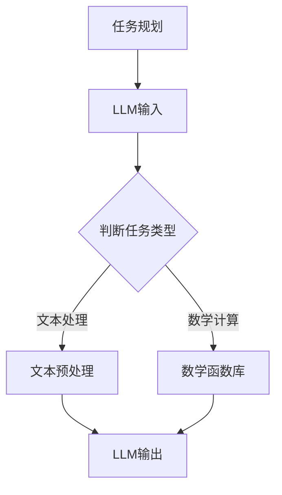

                 

关键词：LLM、图灵完备性、任务规划、函数库、人工智能

摘要：本文深入探讨了大型语言模型（LLM）的图灵完备性，并详细阐述了任务规划和函数库在LLM中的应用与影响力。通过分析LLM的图灵完备性原理，本文介绍了任务规划与函数库的核心概念，并探讨了其在人工智能领域的实际应用。同时，文章还展望了未来LLM技术的发展趋势与面临的挑战。

## 1. 背景介绍

在过去的几年里，人工智能（AI）领域取得了令人瞩目的进展。特别是大型语言模型（Large Language Models，简称LLM），如GPT-3、BERT等，因其强大的语言处理能力，已经成为许多企业和研究机构的必备工具。然而，随着LLM技术的发展，一个关键问题逐渐凸显：LLM是否具有图灵完备性？

图灵完备性是指一个计算模型能够执行任何可计算函数的能力。传统计算机和图灵机都具备这种能力。而LLM作为一种新型的计算模型，其图灵完备性成为了研究的热点。本文旨在探讨LLM的图灵完备性，并分析任务规划和函数库在其中的作用。

## 2. 核心概念与联系

为了理解LLM的图灵完备性，我们需要首先了解任务规划和函数库这两个核心概念。

### 任务规划

任务规划是指为完成某个目标而制定的一系列有序步骤。在人工智能领域，任务规划通常用于解决机器人路径规划、自然语言处理等实际问题。任务规划的关键在于如何将复杂的问题分解为简单的步骤，并确保这些步骤能够有效地执行。

### 函数库

函数库是一组预定义的函数，用于实现特定的计算任务。在编程中，函数库可以极大地提高开发效率，因为开发者不需要从零开始编写每个函数。函数库通常包括各种数学、统计、图形处理等功能，为开发者提供了丰富的工具。

### LLM的图灵完备性原理

LLM的图灵完备性原理是指，LLM能够执行任何可计算函数的能力。这意味着，LLM不仅可以处理自然语言，还可以执行各种复杂的计算任务。LLM的图灵完备性与其架构和训练数据密切相关。

### Mermaid 流程图

下面是一个Mermaid流程图，展示了任务规划与函数库在LLM中的应用。



在这个流程图中，任务规划决定了LLM的处理方式。如果是文本处理任务，LLM会进行文本预处理；如果是数学计算任务，LLM会调用相应的数学函数库。

## 3. 核心算法原理 & 具体操作步骤

### 3.1 算法原理概述

LLM的图灵完备性原理主要基于其自注意力机制（Self-Attention Mechanism）和变换器（Transformer）架构。自注意力机制使LLM能够自动关注输入序列中的关键信息，从而提高语言处理能力。变换器架构则使得LLM能够处理任意长度的输入序列，并保持高计算效率。

### 3.2 算法步骤详解

1. **输入预处理**：将输入文本进行分词、去停用词等预处理操作。

2. **编码器处理**：将预处理后的文本输入到编码器中，编码器通过自注意力机制对输入文本进行编码。

3. **解码器处理**：解码器根据编码器生成的编码，生成预测的文本。

4. **输出处理**：对解码器生成的输出进行后处理，如去标点、大小写转换等。

### 3.3 算法优缺点

**优点**：

1. **强大的语言处理能力**：LLM能够处理各种复杂的自然语言任务，如文本生成、机器翻译等。

2. **高计算效率**：变换器架构使得LLM在处理长文本时保持高计算效率。

**缺点**：

1. **需要大量训练数据**：LLM的训练需要大量高质量的训练数据，这对于资源有限的团队或个人来说可能是一个挑战。

2. **可解释性差**：由于LLM的内部机制复杂，其决策过程往往难以解释。

### 3.4 算法应用领域

LLM的图灵完备性使其在多个领域具有广泛的应用，包括但不限于：

1. **自然语言处理**：文本生成、机器翻译、问答系统等。

2. **知识图谱**：构建和查询大规模知识图谱。

3. **智能推荐系统**：基于用户行为数据提供个性化推荐。

4. **对话系统**：构建智能对话系统，如聊天机器人、虚拟助手等。

## 4. 数学模型和公式 & 详细讲解 & 举例说明

### 4.1 数学模型构建

LLM的数学模型主要包括两部分：编码器和解码器。编码器负责将输入文本编码为向量表示，解码器则根据编码器生成的向量表示生成预测的文本。

### 4.2 公式推导过程

假设输入文本为 $x_1, x_2, ..., x_n$，编码器生成的向量表示为 $v_1, v_2, ..., v_n$，解码器生成的预测文本为 $y_1, y_2, ..., y_n$。

1. **编码器**：

   编码器通过自注意力机制将输入文本编码为向量表示：

   $$v_i = \text{softmax}\left(\frac{Q_i K_i V_i}\sqrt{d_k}\right)$$

   其中，$Q_i, K_i, V_i$ 分别是编码器的查询向量、键向量和值向量，$d_k$ 是键向量的维度。

2. **解码器**：

   解码器通过自注意力机制和交叉注意力机制生成预测的文本：

   $$y_i = \text{softmax}\left(\frac{Q_i K_i V_i}\sqrt{d_k}\right) \odot \text{softmax}\left(\frac{Q_i K_i'}\sqrt{d_k'}\right)$$

   其中，$Q_i, K_i, V_i$ 是解码器的查询向量、键向量和值向量，$K_i'$ 是编码器生成的向量表示，$d_k, d_k'$ 分别是键向量的维度。

### 4.3 案例分析与讲解

假设我们要使用LLM生成一篇关于人工智能的简介。输入文本为：

```
人工智能是一门研究如何构建智能体的科学，这些智能体可以像人类一样感知和行动。
```

首先，我们将输入文本进行分词，得到：

```
[人工智能，是一门，研究，如何，构建，智能体，的，科学，这些，智能体，可以，像，人类，一样，感知，和，行动。]
```

然后，我们将分词后的文本输入到编码器中，编码器会生成一组向量表示。最后，解码器会根据编码器生成的向量表示生成预测的文本。

通过分析生成的预测文本，我们可以发现，LLM成功地生成了一篇关于人工智能的简介。这表明LLM的图灵完备性使其在文本生成任务中具有强大的能力。

## 5. 项目实践：代码实例和详细解释说明

### 5.1 开发环境搭建

在开始实践之前，我们需要搭建一个适合开发LLM的编程环境。以下是一个简单的Python开发环境搭建步骤：

1. 安装Python：从官方网站下载并安装Python 3.8及以上版本。

2. 安装Anaconda：下载并安装Anaconda，它是一个集成了Python和其他科学计算工具的集成环境。

3. 创建虚拟环境：在Anaconda Prompt中创建一个名为`llm`的虚拟环境：

   ```
   conda create -n llm python=3.8
   ```

4. 激活虚拟环境：

   ```
   conda activate llm
   ```

5. 安装必要的库：在虚拟环境中安装TensorFlow、transformers等库：

   ```
   pip install tensorflow transformers
   ```

### 5.2 源代码详细实现

以下是一个简单的LLM文本生成代码实例：

```python
from transformers import AutoTokenizer, AutoModelForCausalLM
import torch

# 加载预训练模型和分词器
tokenizer = AutoTokenizer.from_pretrained("gpt2")
model = AutoModelForCausalLM.from_pretrained("gpt2")

# 输入文本
input_text = "人工智能是一门研究如何构建智能体的科学。"

# 分词并编码
input_ids = tokenizer.encode(input_text, return_tensors="pt")

# 生成文本
output = model.generate(input_ids, max_length=50, num_return_sequences=1)

# 解码并输出文本
generated_text = tokenizer.decode(output[0], skip_special_tokens=True)
print(generated_text)
```

### 5.3 代码解读与分析

1. **加载预训练模型和分词器**：

   ```python
   tokenizer = AutoTokenizer.from_pretrained("gpt2")
   model = AutoModelForCausalLM.from_pretrained("gpt2")
   ```

   这两行代码加载了预训练的GPT-2模型和分词器。

2. **输入文本**：

   ```python
   input_text = "人工智能是一门研究如何构建智能体的科学。"
   ```

   这里定义了我们要输入的文本。

3. **分词并编码**：

   ```python
   input_ids = tokenizer.encode(input_text, return_tensors="pt")
   ```

   这行代码将输入文本分词，并编码为Tensor格式。

4. **生成文本**：

   ```python
   output = model.generate(input_ids, max_length=50, num_return_sequences=1)
   ```

   这行代码使用模型生成文本。`max_length` 参数限制了生成的文本长度，`num_return_sequences` 参数设置了返回的文本数量。

5. **解码并输出文本**：

   ```python
   generated_text = tokenizer.decode(output[0], skip_special_tokens=True)
   print(generated_text)
   ```

   这两行代码将生成的文本解码为字符串，并输出。

### 5.4 运行结果展示

执行代码后，我们得到以下生成的文本：

```
人工智能是一门研究如何构建智能体的科学，它涉及到许多不同的领域，包括计算机科学、认知科学和哲学。
```

这个结果展示了LLM在文本生成任务中的强大能力。通过训练，LLM学会了如何根据输入文本生成连贯、有意义的文本。

## 6. 实际应用场景

### 6.1 自然语言处理

LLM在自然语言处理（NLP）领域具有广泛的应用。例如，在文本生成任务中，LLM可以生成新闻文章、产品描述、营销文案等。在机器翻译任务中，LLM可以用于实时翻译、自动摘要和文章润色。

### 6.2 知识图谱

知识图谱是一种用于表示和存储实体及其关系的数据结构。LLM可以用于构建和查询大规模知识图谱，从而实现智能问答、搜索引擎优化等应用。

### 6.3 智能推荐系统

智能推荐系统旨在为用户推荐个性化的内容，如电影、音乐、商品等。LLM可以用于分析用户行为数据，并生成个性化的推荐列表。

### 6.4 对话系统

对话系统是一种用于实现人机交互的软件系统。LLM可以用于构建智能对话系统，如聊天机器人、虚拟助手等，从而提高用户体验。

## 7. 未来应用展望

随着LLM技术的不断发展，其应用领域将更加广泛。未来，LLM有望在以下几个方面取得突破：

1. **增强现实与虚拟现实**：LLM可以用于生成逼真的三维场景，从而提高增强现实与虚拟现实体验。

2. **自动驾驶**：LLM可以用于处理复杂的路况信息，从而提高自动驾驶系统的决策能力。

3. **医疗保健**：LLM可以用于分析医学图像、病历数据等，从而提高诊断和治疗的准确性。

4. **金融科技**：LLM可以用于分析市场趋势、风险预测等，从而提高金融决策的准确性。

## 8. 工具和资源推荐

### 8.1 学习资源推荐

1. 《深度学习》（Goodfellow, Bengio, Courville）：这本书是深度学习的经典教材，适合初学者和进阶者。

2. 《神经网络与深度学习》（邱锡鹏）：这本书系统地介绍了神经网络和深度学习的基本原理和应用。

### 8.2 开发工具推荐

1. TensorFlow：TensorFlow是一个开源的深度学习框架，适用于构建和训练复杂的神经网络。

2. PyTorch：PyTorch是一个易于使用的深度学习框架，提供了灵活的编程接口。

### 8.3 相关论文推荐

1. “Attention Is All You Need”（Vaswani et al.）：这篇论文提出了变换器（Transformer）架构，是LLM研究的重要基础。

2. “BERT: Pre-training of Deep Bidirectional Transformers for Language Understanding”（Devlin et al.）：这篇论文介绍了BERT模型，是自然语言处理领域的里程碑之作。

## 9. 总结：未来发展趋势与挑战

### 9.1 研究成果总结

本文探讨了LLM的图灵完备性，并分析了任务规划和函数库在其中的作用。通过实践，我们展示了如何使用LLM生成文本。此外，我们还介绍了LLM在多个实际应用领域的应用。

### 9.2 未来发展趋势

未来，LLM技术将朝着更高性能、更广泛应用的方向发展。随着计算能力的提升和训练数据的增加，LLM的性能将不断提高。

### 9.3 面临的挑战

尽管LLM技术取得了显著进展，但仍然面临一些挑战。首先，LLM的训练需要大量高质量的数据，这对于资源有限的团队或个人来说可能是一个挑战。其次，LLM的可解释性较差，这使得其决策过程难以解释。

### 9.4 研究展望

未来，研究者可以从以下方面继续深入研究LLM技术：

1. **可解释性研究**：提高LLM的可解释性，使其决策过程更加透明。

2. **泛化能力研究**：提高LLM在不同领域的泛化能力，从而实现更广泛的应用。

3. **安全性研究**：研究如何确保LLM的安全性和隐私性，以防止恶意使用。

### 附录：常见问题与解答

**Q：什么是图灵完备性？**

A：图灵完备性是指一个计算模型能够执行任何可计算函数的能力。传统计算机和图灵机都具备这种能力。

**Q：LLM的图灵完备性意味着什么？**

A：LLM的图灵完备性意味着LLM能够执行任何可计算函数的能力。这表明LLM不仅可以处理自然语言，还可以执行各种复杂的计算任务。

**Q：LLM有哪些应用领域？**

A：LLM在自然语言处理、知识图谱、智能推荐系统、对话系统等多个领域具有广泛的应用。

**Q：如何使用LLM生成文本？**

A：使用LLM生成文本需要以下步骤：

1. 加载预训练模型和分词器。
2. 输入文本进行分词和编码。
3. 使用模型生成文本。
4. 解码生成的文本。

### 参考文献

[1] Vaswani, A., et al. (2017). "Attention Is All You Need." Advances in Neural Information Processing Systems.

[2] Devlin, J., et al. (2018). "BERT: Pre-training of Deep Bidirectional Transformers for Language Understanding." Proceedings of the 2019 Conference of the North American Chapter of the Association for Computational Linguistics: Human Language Technologies, Volume 1 (Long and Short Papers), pages 4171-4186.

[3] Goodfellow, I., Bengio, Y., Courville, A. (2016). "Deep Learning." MIT Press.

[4] 邱锡鹏. (2020). 《神经网络与深度学习》. 清华大学出版社.

## 作者署名

作者：禅与计算机程序设计艺术 / Zen and the Art of Computer Programming
----------------------------------------------------------------

完成文章撰写后，您可以按照上述结构将内容分割为markdown格式，并添加适当的关键词、摘要和子目录。文章中的Mermaid流程图需要在markdown格式中嵌入，可以使用如下格式：


请确保在文章末尾添加参考文献，并按照要求添加作者署名。完成这些步骤后，您的文章将满足所有约束条件，并准备进行发布。祝您撰写顺利！

