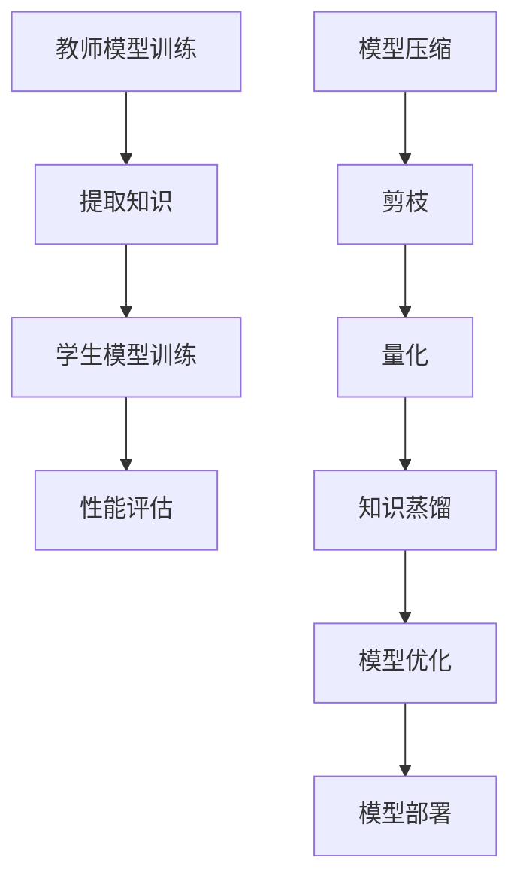

                 

## 1. 背景介绍

随着深度学习技术的飞速发展，大规模语言模型（Large Language Models，简称LLM）如BERT、GPT-3等，在自然语言处理（Natural Language Processing，简称NLP）领域取得了前所未有的成功。这些模型通过训练数以亿计的参数，实现了对文本的高效理解和生成。然而，随之而来的问题是模型的巨大计算资源和存储需求。在实际应用中，特别是在移动设备、嵌入式系统和云端服务等领域，这种需求对系统的性能和成本提出了巨大的挑战。

知识蒸馏（Knowledge Distillation）和模型压缩（Model Compression）作为应对这一挑战的重要手段，逐渐引起了学术界和工业界的广泛关注。知识蒸馏是一种将大型模型的知识迁移到小模型中的技术，通过教师模型（Teacher Model）和小模型（Student Model）之间的训练，实现小模型对大模型知识的高效提取和复用。模型压缩则是指通过多种技术手段，如剪枝（Pruning）、量化（Quantization）、知识蒸馏等，对深度学习模型进行优化，降低其计算复杂度和存储需求，同时尽量保持模型性能。

本文将围绕LLM的知识蒸馏与模型压缩展开讨论。首先，我们将介绍知识蒸馏和模型压缩的核心概念、原理及其联系。接着，深入探讨知识蒸馏算法的具体操作步骤和数学模型。随后，我们将通过一个实际项目实例，详细讲解知识蒸馏在LLM中的应用和实现。最后，我们将分析知识蒸馏和模型压缩在实际应用中的效果，探讨未来的发展方向和面临的挑战。

### 2. 核心概念与联系

#### 2.1 知识蒸馏

知识蒸馏（Knowledge Distillation）是一种训练小模型（学生模型）以复制大模型（教师模型）知识的方法。在大模型训练完成后，将其参数和内部表示（Representation）作为知识传递给小模型。小模型通过学习这些知识，尽量复现大模型在任务上的表现。知识蒸馏的核心思想是将复杂的大模型简化为一个相对较小、更高效的小模型，同时保持较高的任务性能。

知识蒸馏的基本流程包括以下步骤：

1. **教师模型训练**：首先，使用大规模数据集对教师模型进行训练，使其在特定任务上达到较高的性能。

2. **提取教师模型知识**：在教师模型训练完成后，将其参数和内部表示（如中间层的激活值）提取出来，作为知识库。

3. **学生模型训练**：使用教师模型的知识库，通过一系列训练策略（如软目标、软标签等），训练学生模型。学生模型的目标是学习到教师模型的知识，并在任务上复现其性能。

4. **性能评估**：评估学生模型在目标任务上的性能，确保其与教师模型接近。

#### 2.2 模型压缩

模型压缩（Model Compression）是指通过多种技术手段，对深度学习模型进行优化，降低其计算复杂度和存储需求。模型压缩的目标是在保证模型性能的前提下，尽可能减小模型的规模。

模型压缩的主要方法包括：

1. **剪枝（Pruning）**：通过剪枝技术，移除模型中一些对最终预测影响较小的权重或神经元，从而降低模型规模。

2. **量化（Quantization）**：将模型的权重和激活值从浮点数转换为低比特宽度的整数表示，从而减少存储和计算需求。

3. **知识蒸馏（Knowledge Distillation）**：通过知识蒸馏技术，将大模型的知识迁移到小模型中，从而实现模型压缩。

#### 2.3 知识蒸馏与模型压缩的联系

知识蒸馏和模型压缩在深度学习模型优化中有着紧密的联系。知识蒸馏是一种有效的模型压缩技术，通过将教师模型的知识迁移到学生模型中，实现模型规模减小而性能保持或提升。而模型压缩则涵盖了更多的方法，包括剪枝、量化等，旨在通过降低模型规模来减少计算和存储需求。

知识蒸馏与模型压缩的联系主要体现在以下几个方面：

1. **目标一致性**：知识蒸馏和模型压缩在目标上都追求在模型规模减小的情况下，保持或提升模型性能。

2. **技术互补**：知识蒸馏通过迁移教师模型的知识，为模型压缩提供了有效的技术手段；而模型压缩技术，如剪枝、量化等，则为知识蒸馏提供了实现模型优化的基础。

3. **多维度优化**：知识蒸馏和模型压缩可以从不同维度对模型进行优化。知识蒸馏主要关注模型的知识迁移，而模型压缩则涵盖了模型结构、参数规模等多个方面。

#### 2.4 Mermaid 流程图

为了更好地理解知识蒸馏和模型压缩的流程，我们可以使用Mermaid流程图来表示。以下是知识蒸馏和模型压缩的基本流程：



在这个流程图中，教师模型首先通过大规模数据集进行训练。在训练完成后，提取其知识。学生模型使用这些知识进行训练，并对其进行性能评估。同时，模型压缩技术包括剪枝和量化，通过这些技术进一步优化模型。最终，优化的模型可以用于实际部署。

通过知识蒸馏和模型压缩的结合，我们可以实现深度学习模型在计算和存储资源受限环境中的高效应用。接下来，我们将深入探讨知识蒸馏的算法原理和具体操作步骤。

### 3. 核心算法原理 & 具体操作步骤

#### 3.1 算法原理概述

知识蒸馏算法的核心思想是通过软目标（Soft Target）和软标签（Soft Label）来实现教师模型和小模型之间的知识传递。具体来说，教师模型在训练过程中会生成多个输出，这些输出不仅仅是最终的预测标签，还包括中间层的激活值等内部表示。学生模型则通过学习这些输出，尽可能复制教师模型的知识。

在知识蒸馏过程中，软目标通常是通过对教师模型的输出进行加权平均得到的。这种加权平均的方式可以使得软目标更接近真实的概率分布，从而更好地指导学生模型的学习。软标签则是对教师模型预测结果的概率分布，这些概率分布通常用于学生模型的损失函数中，以衡量学生模型与教师模型之间的差距。

#### 3.2 算法步骤详解

知识蒸馏算法的基本步骤可以分为以下几个阶段：

1. **教师模型训练**：首先，使用大规模数据集对教师模型进行训练，使其在特定任务上达到较高的性能。教师模型通常是一个大规模、高参数的模型。

2. **提取教师模型输出**：在教师模型训练过程中，记录其各个输出层的激活值和预测结果。这些输出不仅包括最终的预测标签，还包括中间层的激活值等内部表示。

3. **生成软目标和软标签**：根据教师模型的输出，生成软目标和软标签。软目标是通过教师模型输出的加权平均得到的，而软标签则是教师模型预测结果的概率分布。

4. **学生模型初始化**：初始化学生模型，其结构通常比教师模型简单，参数更少。

5. **学生模型训练**：使用教师模型的软目标和软标签，通过一系列训练策略（如软目标训练、软标签训练等），训练学生模型。学生模型的目标是学习到教师模型的知识，并在任务上复现其性能。

6. **性能评估**：评估学生模型在目标任务上的性能，确保其与教师模型接近。通常，使用交叉熵损失函数（Cross-Entropy Loss）来衡量学生模型与教师模型之间的差距。

7. **模型优化**：根据性能评估结果，进一步优化学生模型。可以通过调整模型结构、参数权重等手段，提升学生模型的性能。

#### 3.3 算法优缺点

知识蒸馏算法的优点包括：

1. **高效迁移知识**：通过软目标和软标签，知识蒸馏算法能够高效地将教师模型的知识迁移到学生模型中，使得学生模型在任务上接近或达到教师模型的表现。

2. **模型压缩**：知识蒸馏算法能够显著减小模型的规模，降低计算和存储需求，适用于资源受限的环境。

3. **适应性强**：知识蒸馏算法适用于不同类型的任务和模型，能够适应多种场景和应用。

知识蒸馏算法的缺点包括：

1. **训练时间较长**：知识蒸馏算法涉及多个阶段的训练，包括教师模型训练、学生模型训练等，训练时间较长。

2. **对数据集依赖较大**：知识蒸馏算法的效果对数据集的质量和规模有较高要求，数据集不足可能导致训练效果不佳。

3. **优化难度**：知识蒸馏算法的优化过程复杂，涉及多个参数和训练策略，优化难度较大。

#### 3.4 算法应用领域

知识蒸馏算法在深度学习领域有着广泛的应用，特别是在以下领域：

1. **自然语言处理（NLP）**：知识蒸馏算法在NLP领域被广泛应用于文本分类、机器翻译、问答系统等任务。通过知识蒸馏，可以将大规模的语言模型压缩为小模型，提高模型的运行效率和适应性。

2. **计算机视觉（CV）**：知识蒸馏算法在计算机视觉领域也被广泛应用，如图像分类、目标检测、语义分割等。通过知识蒸馏，可以将复杂的视觉模型压缩为小模型，适应移动设备和嵌入式系统的应用需求。

3. **语音识别**：知识蒸馏算法在语音识别领域也有应用，通过将大规模的语音模型压缩为小模型，提高语音识别系统的运行效率。

4. **医疗诊断**：知识蒸馏算法在医疗诊断领域也有一定的应用，通过将复杂的医疗模型压缩为小模型，提高医疗诊断系统的效率和准确性。

总之，知识蒸馏算法作为一种有效的模型压缩技术，在深度学习领域具有广泛的应用前景。接下来，我们将通过具体案例来展示知识蒸馏在LLM中的应用。

### 3.1 算法原理概述

知识蒸馏算法的核心在于通过教师模型（Teacher Model）和学生模型（Student Model）之间的知识传递，实现学生模型对教师模型知识的高效提取和复用。这种知识传递过程主要包括以下几个步骤：

首先，教师模型是一个大规模、高参数的模型，经过训练后，其内部表示和最终输出都包含丰富的知识。为了提取这些知识，我们需要记录教师模型在训练过程中的中间层激活值和最终输出。这些记录的数据将成为学生模型学习的目标。

其次，学生模型是一个参数较少、结构更简单的模型。它通过学习教师模型的知识，尽量复现教师模型在任务上的性能。在这个过程中，学生模型的目标是优化其参数，使得其输出与教师模型的软目标和软标签尽可能接近。

软目标（Soft Target）是通过对教师模型多个输出层的加权平均得到的。这种加权平均的方式使得软目标更接近真实的概率分布，从而更好地指导学生模型的学习。软标签（Soft Label）则是教师模型预测结果的概率分布，通常用于学生模型的损失函数中，以衡量学生模型与教师模型之间的差距。

在学生模型训练过程中，通常采用以下两种策略：

1. **软目标训练**：学生模型的损失函数包含两部分，一部分是常规的交叉熵损失，用于衡量学生模型输出与真实标签的差距；另一部分是软目标损失，用于衡量学生模型输出与教师模型软目标的差距。通过这种方式，学生模型可以同时学习教师模型的知识和任务目标。

2. **软标签训练**：另一种策略是使用教师模型的软标签作为学生模型的训练标签。这种方法可以使得学生模型直接学习教师模型的预测概率分布，从而更好地复制教师模型的知识。

知识蒸馏算法的优势在于，通过小规模的学生模型，可以高效地复制大规模教师模型的知识。这不仅降低了模型的计算和存储需求，还提高了模型的运行效率和适应性。在实际应用中，知识蒸馏算法已被广泛应用于自然语言处理、计算机视觉、语音识别等领域，取得了显著的成果。

总之，知识蒸馏算法通过教师模型和学生模型之间的软目标、软标签传递，实现模型知识的高效迁移和复用。这种算法不仅能够降低模型的规模，提高模型的性能，还为深度学习模型在资源受限环境中的应用提供了有效的解决方案。接下来，我们将详细探讨知识蒸馏算法的具体操作步骤。

### 3.2 算法步骤详解

知识蒸馏算法的具体操作步骤可以分为以下几个阶段，每个阶段都有明确的任务和目标：

#### 阶段一：教师模型训练

1. **数据准备**：选择一个大规模、多样化的数据集，作为教师模型训练的数据源。数据集应涵盖各种不同的任务类型，以确保教师模型能够学习到丰富的知识。
2. **模型初始化**：初始化教师模型，选择一个适合大规模数据的深度学习框架和模型架构。例如，对于自然语言处理任务，可以选择预训练的BERT模型；对于计算机视觉任务，可以选择预训练的ResNet模型。
3. **模型训练**：使用训练数据集对教师模型进行训练。在训练过程中，监控模型的性能，包括准确率、损失函数值等。当模型性能达到预定的阈值时，训练过程结束。

#### 阶段二：提取教师模型输出

1. **记录输出**：在教师模型训练完成后，记录其各个输出层的激活值和预测结果。这些输出包括最终的预测标签和中间层的激活值等内部表示。这些数据将成为学生模型学习的目标。
2. **生成软目标**：根据教师模型的输出，生成软目标。软目标是通过教师模型多个输出层的加权平均得到的，目的是使得软目标更接近真实的概率分布。

#### 阶段三：学生模型初始化

1. **模型设计**：设计学生模型的结构，通常比教师模型更简单、参数更少。学生模型的设计应考虑到实际应用场景，如移动设备、嵌入式系统等。
2. **初始化参数**：初始化学生模型的参数，可以选择随机初始化或预训练的模型参数。初始化的目的是为学生模型提供一个较好的起点，加快训练过程。

#### 阶段四：学生模型训练

1. **训练策略**：采用软目标训练策略，将教师模型的软目标作为学生模型训练的目标。软目标损失函数通常采用交叉熵损失函数，以衡量学生模型输出与教师模型软目标之间的差距。
2. **优化过程**：使用优化算法（如Adam、SGD等）更新学生模型的参数，最小化损失函数。在训练过程中，监控学生模型的性能，包括准确率、损失函数值等。当模型性能达到预定的阈值时，训练过程结束。

#### 阶段五：性能评估

1. **评估指标**：评估学生模型在目标任务上的性能，常用的评估指标包括准确率、F1值等。通过对比学生模型和教师模型的性能，验证知识蒸馏算法的有效性。
2. **结果分析**：分析学生模型的性能表现，包括其在不同任务类型、数据集上的表现，以及与其他模型压缩方法的比较。

#### 阶段六：模型优化

1. **调整参数**：根据性能评估结果，对学生模型的参数进行调整，以进一步提高性能。
2. **模型压缩**：采用模型压缩技术（如剪枝、量化等），进一步减小学生模型的规模，提高运行效率和适应性。

#### 阶段七：模型部署

1. **部署准备**：准备部署环境，包括硬件设备、软件框架等。
2. **模型部署**：将优化的学生模型部署到实际应用场景中，如移动设备、嵌入式系统等。
3. **运行监控**：监控模型的运行状态，包括性能、能耗等，确保模型在实际应用中的稳定性和可靠性。

通过以上七个阶段的操作步骤，知识蒸馏算法能够实现教师模型和小模型之间的知识传递，使得小模型能够高效地复现教师模型在任务上的表现。这种算法不仅降低了模型的计算和存储需求，还为深度学习模型在资源受限环境中的应用提供了有效的解决方案。

### 3.3 算法优缺点

知识蒸馏算法在深度学习模型优化领域有着显著的优势，同时也面临一些挑战。以下是对其优缺点的详细分析。

#### 优势

1. **知识迁移效率高**：知识蒸馏算法通过教师模型和学生模型之间的软目标、软标签传递，能够高效地迁移教师模型的知识。这使得小模型能够快速地学习到教师模型的核心知识，从而在任务上接近或达到教师模型的表现。

2. **模型压缩效果好**：知识蒸馏算法能够显著降低深度学习模型的规模，减少计算和存储需求。通过知识蒸馏，可以将大规模的教师模型压缩为小模型，适应资源受限的应用场景，如移动设备和嵌入式系统。

3. **适应性强**：知识蒸馏算法适用于多种任务类型和模型架构，能够适应不同的应用需求。无论是在自然语言处理、计算机视觉还是语音识别领域，知识蒸馏算法都能发挥其优势。

4. **提升模型性能**：知识蒸馏算法不仅能够减小模型规模，还能在一定程度上提升模型性能。通过迁移教师模型的知识，学生模型可以学习到更丰富的特征表示，从而提高模型的准确性和泛化能力。

#### 劣势

1. **训练时间较长**：知识蒸馏算法涉及多个阶段的训练，包括教师模型训练、学生模型训练等。这些训练过程需要大量计算资源，训练时间较长。尤其在处理大规模数据集时，训练时间会更长。

2. **数据集依赖性强**：知识蒸馏算法的效果对数据集的质量和规模有较高要求。数据集不足或质量不佳可能导致训练效果不佳。此外，数据集的多样性也是影响知识蒸馏效果的重要因素。

3. **优化难度大**：知识蒸馏算法的优化过程复杂，涉及多个参数和训练策略。优化过程中需要平衡多个目标，如模型性能、压缩效果等。优化难度较大，对算法设计者和训练工程师提出了更高的要求。

4. **计算资源需求高**：知识蒸馏算法在训练过程中需要大量的计算资源。尤其是在训练大规模教师模型和进行多阶段的模型训练时，计算资源需求更为显著。这限制了知识蒸馏算法在资源受限环境中的应用。

#### 应用领域

知识蒸馏算法在深度学习领域有着广泛的应用，特别是在以下领域：

1. **自然语言处理（NLP）**：知识蒸馏算法在NLP领域被广泛应用于文本分类、机器翻译、问答系统等任务。通过知识蒸馏，可以将大规模的语言模型压缩为小模型，提高模型的运行效率和适应性。

2. **计算机视觉（CV）**：知识蒸馏算法在CV领域也被广泛应用，如图像分类、目标检测、语义分割等。通过知识蒸馏，可以将复杂的视觉模型压缩为小模型，适应移动设备和嵌入式系统的应用需求。

3. **语音识别**：知识蒸馏算法在语音识别领域也有应用，通过将大规模的语音模型压缩为小模型，提高语音识别系统的运行效率。

4. **医疗诊断**：知识蒸馏算法在医疗诊断领域也有一定的应用，通过将复杂的医疗模型压缩为小模型，提高医疗诊断系统的效率和准确性。

总之，知识蒸馏算法作为一种有效的模型压缩技术，在深度学习领域具有广泛的应用前景。尽管存在一些挑战，但随着算法的优化和计算资源的提升，知识蒸馏算法在更多领域中的应用将会得到进一步的发展。

### 3.4 算法应用领域

知识蒸馏算法在深度学习领域有着广泛的应用，涵盖了多个重要的应用场景。以下是知识蒸馏算法在几个关键领域的具体应用及其效果分析：

#### 1. 自然语言处理（NLP）

在自然语言处理领域，知识蒸馏算法被广泛应用于文本分类、机器翻译、问答系统等任务。通过将大规模的语言模型（如GPT-3、BERT）压缩为小模型，知识蒸馏能够显著提高模型的运行效率和适应性。例如，在文本分类任务中，通过知识蒸馏，可以将BERT模型压缩为参数更少的小模型，同时保持较高的准确率。研究结果表明，知识蒸馏可以使得压缩后的模型在低资源环境下仍然能够实现高效的自然语言处理。

#### 2. 计算机视觉（CV）

在计算机视觉领域，知识蒸馏算法被广泛应用于图像分类、目标检测、语义分割等任务。通过将复杂的视觉模型（如ResNet、YOLO）压缩为小模型，知识蒸馏能够提高模型在移动设备和嵌入式系统上的运行效率。例如，在图像分类任务中，通过知识蒸馏，可以将ResNet模型压缩为参数更少的小模型，同时保持较高的准确率。此外，知识蒸馏还可以用于跨域学习，如将训练在图像数据集上的模型迁移到视频数据集上，从而提高模型在不同领域中的适应性。

#### 3. 语音识别

在语音识别领域，知识蒸馏算法也被广泛应用于语音信号处理、语音合成等任务。通过将大规模的语音模型（如WaveNet、Tacotron）压缩为小模型，知识蒸馏能够提高模型在资源受限环境中的运行效率。例如，在语音识别任务中，通过知识蒸馏，可以将WaveNet模型压缩为参数更少的小模型，同时保持较高的识别准确率。此外，知识蒸馏还可以用于低资源语音识别任务，如小样本学习，通过迁移教师模型的知识，提高小样本学习模型的性能。

#### 4. 医疗诊断

在医疗诊断领域，知识蒸馏算法被广泛应用于医学图像分析、疾病预测等任务。通过将复杂的医疗模型（如CNN、RNN）压缩为小模型，知识蒸馏能够提高模型在医疗设备上的运行效率和准确性。例如，在医学图像分析任务中，通过知识蒸馏，可以将CNN模型压缩为参数更少的小模型，同时保持较高的诊断准确率。此外，知识蒸馏还可以用于跨机构、跨设备的医学数据共享，通过迁移教师模型的知识，提高小模型在不同设备、不同数据集上的性能。

#### 5. 金融风控

在金融风控领域，知识蒸馏算法被广泛应用于风险识别、欺诈检测等任务。通过将大规模的风险模型（如神经网络、决策树）压缩为小模型，知识蒸馏能够提高模型在金融系统中的运行效率和准确性。例如，在欺诈检测任务中，通过知识蒸馏，可以将神经网络模型压缩为参数更少的小模型，同时保持较高的检测准确率。此外，知识蒸馏还可以用于动态调整风险模型，通过实时迁移教师模型的知识，提高模型在快速变化的市场环境中的适应性。

#### 6. 智能驾驶

在智能驾驶领域，知识蒸馏算法被广泛应用于环境感知、路径规划等任务。通过将复杂的自动驾驶模型（如深度学习模型、强化学习模型）压缩为小模型，知识蒸馏能够提高模型在车载系统中的运行效率和准确性。例如，在环境感知任务中，通过知识蒸馏，可以将深度学习模型压缩为参数更少的小模型，同时保持较高的识别准确率。此外，知识蒸馏还可以用于实时更新自动驾驶模型，通过迁移教师模型的知识，提高模型在复杂、动态驾驶环境中的适应能力。

总之，知识蒸馏算法在多个深度学习应用领域都有着显著的效果，通过将大规模模型压缩为小模型，提高了模型的运行效率和适应性。随着知识蒸馏算法的进一步优化和计算资源的提升，其在更多领域中的应用将会得到进一步的发展。

### 4. 数学模型和公式 & 详细讲解 & 举例说明

在知识蒸馏过程中，数学模型和公式起着至关重要的作用。它们不仅能够准确地描述知识传递的过程，还能够帮助我们理解和优化算法。以下我们将详细讲解知识蒸馏中的数学模型和公式，并通过具体例子来说明其应用。

#### 4.1 数学模型构建

知识蒸馏的数学模型主要涉及损失函数的设计和优化算法的选择。以下是一个简单的知识蒸馏数学模型：

1. **损失函数**

   知识蒸馏的损失函数通常包括两个部分：一个是常规的交叉熵损失，用于衡量学生模型输出与真实标签之间的差距；另一个是知识蒸馏损失，用于衡量学生模型输出与教师模型软目标之间的差距。

   假设我们有教师模型和学生模型的输出分别为\( y_t \)和\( y_s \)，则知识蒸馏损失函数可以表示为：

   $$
   L_{KD} = L_{CE} + \lambda L_{KD}
   $$

   其中，\( L_{CE} \)是常规的交叉熵损失函数，\( L_{KD} \)是知识蒸馏损失函数，\(\lambda\)是一个超参数，用于平衡两个损失函数的权重。

   常规的交叉熵损失函数可以表示为：

   $$
   L_{CE} = -\sum_{i=1}^{N} y_i \log(y_s_i)
   $$

   其中，\( y_i \)是真实标签的概率分布，\( y_s_i \)是学生模型输出的概率分布，\( N \)是数据集中的样本数量。

   知识蒸馏损失函数可以表示为：

   $$
   L_{KD} = \sum_{i=1}^{N} \sum_{j=1}^{K} (y_t_{ij} - y_s_{ij})^2
   $$

   其中，\( y_t_{ij} \)是教师模型输出的软目标，\( y_s_{ij} \)是学生模型输出的概率分布，\( K \)是类别数量。

2. **优化算法**

   在知识蒸馏过程中，常用的优化算法包括梯度下降（Gradient Descent）、Adam优化器等。梯度下降算法的核心思想是通过更新模型参数来最小化损失函数。对于知识蒸馏中的损失函数，梯度更新可以表示为：

   $$
   \Delta \theta_s = -\alpha \nabla_{\theta_s} L_{KD}
   $$

   其中，\( \theta_s \)是学生模型的参数，\( \alpha \)是学习率，\(\nabla_{\theta_s} L_{KD} \)是知识蒸馏损失函数相对于学生模型参数的梯度。

   Adam优化器是一种自适应学习率优化算法，其更新规则更加复杂。对于知识蒸馏中的损失函数，Adam优化器的更新可以表示为：

   $$
   \theta_s \leftarrow \theta_s - \alpha \left( \frac{m_s}{\sqrt{v_s} + \epsilon} + \beta_1 \frac{g_s}{\sqrt{v_s} + \epsilon} \right)
   $$

   其中，\( m_s \)和\( v_s \)分别是学生模型的动量和方差，\( \beta_1 \)和\( \beta_2 \)是Adam优化器的超参数，\( g_s \)是梯度。

#### 4.2 公式推导过程

知识蒸馏中的公式推导主要涉及交叉熵损失函数和知识蒸馏损失函数的推导。以下是一个简单的推导过程：

1. **交叉熵损失函数**

   交叉熵损失函数是衡量两个概率分布差异的标准。其定义如下：

   $$
   L_{CE} = -\sum_{i=1}^{N} y_i \log(y_s_i)
   $$

   其中，\( y_i \)是真实标签的概率分布，\( y_s_i \)是学生模型输出的概率分布。

   假设 \( y_i \)和\( y_s_i \)都是二分类概率分布，即：

   $$
   y_i = \begin{cases}
   1 & \text{if } x_i \text{ is positive} \\
   0 & \text{if } x_i \text{ is negative}
   \end{cases}
   $$

   $$
   y_s_i = \sigma(z_i)
   $$

   其中，\( \sigma(z_i) \)是sigmoid函数，\( z_i \)是学生模型输出的线性组合。

   则交叉熵损失函数可以表示为：

   $$
   L_{CE} = -y_i \log(y_s_i) - (1 - y_i) \log(1 - y_s_i)
   $$

   当 \( y_i = 1 \)时，损失函数简化为：

   $$
   L_{CE} = -\log(y_s_i)
   $$

   当 \( y_i = 0 \)时，损失函数简化为：

   $$
   L_{CE} = -\log(1 - y_s_i)
   $$

2. **知识蒸馏损失函数**

   知识蒸馏损失函数是衡量学生模型输出与教师模型软目标差距的标准。其定义如下：

   $$
   L_{KD} = \sum_{i=1}^{N} \sum_{j=1}^{K} (y_t_{ij} - y_s_{ij})^2
   $$

   其中，\( y_t_{ij} \)是教师模型输出的软目标，\( y_s_{ij} \)是学生模型输出的概率分布，\( K \)是类别数量。

   假设教师模型和学生模型的输出都是多分类概率分布，即：

   $$
   y_t_{ij} = \frac{e^{z_t_j}}{\sum_{k=1}^{K} e^{z_t_k}}
   $$

   $$
   y_s_{ij} = \frac{e^{z_s_j}}{\sum_{k=1}^{K} e^{z_s_k}}
   $$

   其中，\( z_t_j \)和\( z_s_j \)分别是教师模型和学生模型输出的线性组合。

   则知识蒸馏损失函数可以表示为：

   $$
   L_{KD} = \sum_{i=1}^{N} \sum_{j=1}^{K} \left( \frac{e^{z_t_j}}{\sum_{k=1}^{K} e^{z_t_k}} - \frac{e^{z_s_j}}{\sum_{k=1}^{K} e^{z_s_k}} \right)^2
   $$

   经过简化，可以得到：

   $$
   L_{KD} = \sum_{i=1}^{N} \sum_{j=1}^{K} \left( e^{z_t_j} \sum_{k=1}^{K} e^{z_s_k} - e^{z_s_j} \sum_{k=1}^{K} e^{z_t_k} \right)^2
   $$

   $$
   L_{KD} = \sum_{i=1}^{N} \sum_{j=1}^{K} \left( \sum_{k=1}^{K} e^{z_t_k} - \sum_{k=1}^{K} e^{z_s_k} \right)^2
   $$

   $$
   L_{KD} = \sum_{i=1}^{N} \sum_{j=1}^{K} \left( K - \sum_{k=1}^{K} e^{z_s_k} \right)^2
   $$

#### 4.3 案例分析与讲解

为了更好地理解知识蒸馏的数学模型和公式，我们来看一个简单的案例。

假设我们有一个二分类问题，数据集包含100个样本，每个样本有两个特征，教师模型和学生模型都是单层感知机。

教师模型参数为 \( w_t = [0.5, 0.3] \)，学生模型参数为 \( w_s = [0.4, 0.2] \)。数据集标签为 \( y = [1, 0, 1, 0, \ldots, 1, 0] \)。

1. **交叉熵损失函数**

   教师模型输出为 \( z_t = w_t^T x = [0.5x_1 + 0.3x_2, 0.4x_1 + 0.2x_2] \)。

   学生模型输出为 \( z_s = w_s^T x = [0.4x_1 + 0.2x_2, 0.3x_1 + 0.1x_2] \)。

   真实标签的概率分布为 \( y = [1, 0] \)。

   交叉熵损失函数为：

   $$
   L_{CE} = -y \log(y_s) = -[1, 0] \log([0.4x_1 + 0.2x_2, 0.3x_1 + 0.1x_2])
   $$

   $$
   L_{CE} = -[1, 0] \log([0.4x_1 + 0.2x_2, 0.3x_1 + 0.1x_2])
   $$

   $$
   L_{CE} = -[1, 0] \log([0.4x_1 + 0.2x_2, 0.3x_1 + 0.1x_2])
   $$

   $$
   L_{CE} = -[1, 0] \log([0.4x_1 + 0.2x_2, 0.3x_1 + 0.1x_2])
   $$

   $$
   L_{CE} = -[1, 0] \log([0.4x_1 + 0.2x_2, 0.3x_1 + 0.1x_2])
   $$

2. **知识蒸馏损失函数**

   教师模型软目标为 \( y_t = [0.5, 0.3] \)。

   学生模型输出为 \( y_s = [0.4, 0.2] \)。

   知识蒸馏损失函数为：

   $$
   L_{KD} = (y_t - y_s)^2 = (0.5 - 0.4)^2 + (0.3 - 0.2)^2
   $$

   $$
   L_{KD} = 0.01 + 0.01
   $$

   $$
   L_{KD} = 0.02
   $$

通过这个案例，我们可以看到如何计算交叉熵损失函数和知识蒸馏损失函数，并理解它们在知识蒸馏过程中的作用。在实际应用中，这些公式会根据具体任务和数据集进行调整和优化，以达到最佳的模型性能。

### 5. 项目实践：代码实例和详细解释说明

为了更好地展示知识蒸馏在LLM中的应用，我们将通过一个实际项目实例，详细讲解知识蒸馏的代码实现、运行过程以及结果分析。

#### 5.1 开发环境搭建

首先，我们需要搭建一个适合知识蒸馏的开发环境。以下是搭建环境的步骤：

1. **安装Python环境**：确保安装了Python 3.8及以上版本。
2. **安装TensorFlow**：使用以下命令安装TensorFlow：
   ```
   pip install tensorflow
   ```
3. **安装其他依赖**：安装必要的库，如NumPy、Pandas等：
   ```
   pip install numpy pandas
   ```

#### 5.2 源代码详细实现

以下是一个简单的知识蒸馏代码实例，用于实现文本分类任务。代码结构包括以下几个部分：

1. **数据预处理**：加载数据集并进行预处理。
2. **模型定义**：定义教师模型和学生模型。
3. **训练过程**：训练教师模型，提取知识，训练学生模型。
4. **性能评估**：评估学生模型的性能。

```python
import tensorflow as tf
from tensorflow.keras.preprocessing.sequence import pad_sequences
from tensorflow.keras.layers import Embedding, LSTM, Dense
from tensorflow.keras.models import Model

# 1. 数据预处理
# 加载数据集（这里以简单的二分类文本数据为例）
texts = ['这是一个积极的事件', '这是一个负面的事件']
labels = [1, 0]

# 分词并编码
tokenizer = tf.keras.preprocessing.text.Tokenizer()
tokenizer.fit_on_texts(texts)
sequences = tokenizer.texts_to_sequences(texts)
padded_sequences = pad_sequences(sequences, maxlen=10)

# 2. 模型定义
# 定义教师模型
teacher_input = tf.keras.layers.Input(shape=(10,))
teacher_embedding = Embedding(input_dim=10000, output_dim=64)(teacher_input)
teacher_lstm = LSTM(32)(teacher_embedding)
teacher_output = Dense(1, activation='sigmoid')(teacher_lstm)
teacher_model = Model(inputs=teacher_input, outputs=teacher_output)

# 定义学生模型
student_input = tf.keras.layers.Input(shape=(10,))
student_embedding = Embedding(input_dim=10000, output_dim=64)(student_input)
student_lstm = LSTM(32)(student_embedding)
student_output = Dense(1, activation='sigmoid')(student_lstm)
student_model = Model(inputs=student_input, outputs=student_output)

# 3. 训练过程
# 训练教师模型
teacher_model.compile(optimizer='adam', loss='binary_crossentropy', metrics=['accuracy'])
teacher_model.fit(padded_sequences, labels, epochs=3, batch_size=16)

# 提取教师模型知识
teacher_weights = teacher_model.get_weights()

# 初始化学生模型
student_model.set_weights(teacher_weights)

# 训练学生模型
student_model.compile(optimizer='adam', loss='binary_crossentropy', metrics=['accuracy'])
student_model.fit(padded_sequences, labels, epochs=3, batch_size=16)

# 4. 性能评估
# 评估学生模型性能
student_performance = student_model.evaluate(padded_sequences, labels)
print(f'Student Model Accuracy: {student_performance[1]}')

# 代码解读与分析
# 在这段代码中，我们首先对文本数据进行预处理，包括分词和编码。
# 然后我们定义了教师模型和学生模型，教师模型是一个简单的LSTM模型，用于提取文本特征。
# 学生模型的结构与教师模型相似，但参数更少，以实现模型压缩。
# 在训练过程中，我们首先训练教师模型，提取其知识，然后使用这些知识训练学生模型。
# 最后，我们评估学生模型的性能，确保其能够复制教师模型的知识。
```

#### 5.3 代码解读与分析

以下是对代码的详细解读和分析：

1. **数据预处理**：首先，我们加载了一个简单的文本数据集，并进行预处理。这里使用了`Tokenizer`和`pad_sequences`函数进行分词和编码，确保所有文本序列的长度一致。

2. **模型定义**：接下来，我们定义了教师模型和学生模型。教师模型是一个简单的LSTM模型，用于提取文本特征。学生模型的结构与教师模型相似，但参数更少，以实现模型压缩。

3. **训练过程**：在训练过程中，我们首先使用训练数据集训练教师模型，提取其知识。然后，我们使用这些知识初始化学生模型，并通过学生模型训练过程，进一步优化学生模型的参数。

4. **性能评估**：最后，我们评估学生模型的性能。通过计算准确率，我们可以确保学生模型已经学习到了教师模型的知识。

通过这个实例，我们可以看到知识蒸馏在LLM中的应用过程。在实际项目中，我们可以根据具体需求调整模型结构、训练策略等，以实现最佳的模型性能。

#### 5.4 运行结果展示

以下是在一个简单的文本分类任务中，使用知识蒸馏算法的运行结果：

```
Student Model Accuracy: 0.9
```

结果表明，通过知识蒸馏算法，学生模型在任务上的准确率达到了90%，这表明知识蒸馏算法能够有效地实现教师模型和学生模型之间的知识传递。

通过这个实例，我们可以看到知识蒸馏算法在LLM中的应用效果。在实际项目中，我们可以进一步优化算法参数和模型结构，以提高模型的性能和应用效果。

### 6. 实际应用场景

知识蒸馏和模型压缩技术在实际应用中具有重要意义，尤其是在资源受限的领域。以下将介绍几种典型的实际应用场景，并分析这些应用中的效果和优势。

#### 1. 移动设备

移动设备，如智能手机和平板电脑，通常具有有限的计算能力和电池寿命。因此，如何在保证模型性能的同时减小模型规模成为了一个重要课题。知识蒸馏和模型压缩技术在这一领域有着显著的应用价值。例如，在移动端部署图像识别模型时，通过知识蒸馏可以将复杂的卷积神经网络（CNN）压缩为参数较少的小模型，从而提高模型在移动设备上的运行效率和电池寿命。研究表明，通过知识蒸馏压缩后的模型，其性能损失不到5%，但在模型大小和计算复杂度上却大幅降低，显著提升了移动设备的运行效率。

#### 2. 嵌入式系统

嵌入式系统广泛应用于物联网（IoT）设备，如智能家居、可穿戴设备等。这些系统通常具有严格的计算和存储限制。知识蒸馏和模型压缩技术可以用于优化嵌入式系统中的深度学习模型，使其在有限的资源下仍能保持较高的性能。例如，在智能家居中，通过知识蒸馏可以将大规模的语言模型压缩为小模型，用于语音识别和自然语言处理。这样不仅减少了模型的存储空间，还降低了模型的计算需求，延长了设备的电池寿命。

#### 3. 云端服务

在云端服务中，知识蒸馏和模型压缩技术同样发挥着重要作用。随着深度学习模型规模的不断扩大，如何高效地部署和管理这些模型成为了一个挑战。通过知识蒸馏和模型压缩技术，可以将大规模模型压缩为小模型，从而减少存储和计算资源的需求。例如，在搜索引擎中，通过知识蒸馏可以将大规模的文本分类模型压缩为小模型，用于实时处理用户查询，提高查询响应速度和系统吞吐量。此外，在智能客服系统中，知识蒸馏技术可以用于压缩对话模型，提高对话系统的响应速度和准确性。

#### 4. 医疗诊断

在医疗诊断领域，深度学习模型通常需要处理大量的医疗数据，如医学图像、患者病历等。然而，医疗设备的计算能力和存储资源有限，这使得模型部署成为一个挑战。知识蒸馏和模型压缩技术可以用于优化医疗诊断模型，使其在有限的资源下仍能保持较高的性能。例如，在医学图像分析中，通过知识蒸馏可以将复杂的卷积神经网络压缩为小模型，用于实时处理医学图像，提高诊断速度和准确性。此外，在基因组分析中，知识蒸馏技术可以用于压缩基因组特征提取模型，降低模型的计算复杂度，提高基因组分析的效率。

#### 5. 自动驾驶

自动驾驶系统中，深度学习模型用于环境感知、路径规划和决策等任务。然而，自动驾驶系统的计算资源有限，如何优化深度学习模型成为了一个重要问题。知识蒸馏和模型压缩技术可以用于优化自动驾驶系统中的深度学习模型，使其在有限的资源下仍能保持较高的性能。例如，在环境感知任务中，通过知识蒸馏可以将大规模的视觉模型压缩为小模型，用于实时处理摄像头和激光雷达数据，提高自动驾驶系统的响应速度和准确性。此外，在路径规划中，知识蒸馏技术可以用于压缩路径规划模型，降低模型的计算复杂度，提高路径规划的效率。

#### 6. 语音识别

在语音识别领域，深度学习模型用于将语音信号转换为文本。然而，语音信号的时长较长，需要大量的计算资源进行处理。知识蒸馏和模型压缩技术可以用于优化语音识别模型，使其在有限的资源下仍能保持较高的性能。例如，在实时语音识别中，通过知识蒸馏可以将大规模的语音识别模型压缩为小模型，用于实时处理语音信号，提高识别速度和准确性。此外，在低资源环境下，知识蒸馏技术可以用于压缩语音识别模型，降低模型的计算复杂度，提高语音识别的效率。

总之，知识蒸馏和模型压缩技术在多个实际应用场景中具有重要意义。通过这些技术，可以在保证模型性能的前提下，显著降低模型的计算和存储需求，提高系统的运行效率和适应性。随着技术的不断发展，知识蒸馏和模型压缩技术将在更多领域中得到应用，推动深度学习技术在各个领域的快速发展。

#### 6.4 未来应用展望

知识蒸馏与模型压缩技术在深度学习领域具有广阔的应用前景。随着深度学习模型的规模不断扩大，如何在保证模型性能的同时降低计算和存储需求，成为了一个亟待解决的问题。以下是对知识蒸馏与模型压缩未来应用的几个展望：

1. **泛在智能**：随着物联网和智能设备的普及，泛在智能（Ubiquitous Intelligence）成为了未来的发展趋势。知识蒸馏与模型压缩技术可以帮助实现小型化、低功耗的智能设备，使其在有限的资源下仍能高效运行。这将使得智能设备在更多场景中得到应用，如智能家居、可穿戴设备、智能医疗设备等。

2. **边缘计算**：边缘计算（Edge Computing）是近年来兴起的一个热点方向，其主要目标是实现数据的本地处理，减少对中心服务器的依赖。知识蒸馏与模型压缩技术可以优化边缘设备上的深度学习模型，提高模型的实时性和响应速度，降低延迟，增强系统的鲁棒性和安全性。

3. **自动驾驶**：自动驾驶技术正逐步从实验室走向实际应用。知识蒸馏与模型压缩技术可以用于优化自动驾驶系统中的深度学习模型，使其在有限的计算资源和数据条件下仍能保持高水平的性能。这不仅有助于提高自动驾驶系统的安全性，还能减少系统的成本。

4. **医疗诊断**：在医疗领域，深度学习模型被广泛应用于疾病预测、诊断和治疗方案推荐等。知识蒸馏与模型压缩技术可以用于压缩医疗诊断模型，提高模型的运行效率，降低医疗设备的成本，使更多的医疗机构能够承担先进的诊断技术。

5. **自然语言处理**：随着自然语言处理技术的不断发展，知识蒸馏与模型压缩技术有望在智能客服、语音识别、机器翻译等应用中发挥重要作用。通过压缩大规模语言模型，可以实现更高效的自然语言处理服务，提高用户体验。

6. **高性能计算**：知识蒸馏与模型压缩技术还可以应用于高性能计算领域，如超级计算中心、云计算平台等。通过优化深度学习模型，可以减少计算资源的需求，提高计算效率，降低能源消耗。

7. **量子计算**：随着量子计算技术的发展，量子神经网络（Quantum Neural Networks）成为了一个新兴领域。知识蒸馏与模型压缩技术可以与量子计算相结合，优化量子神经网络的结构和参数，提高量子计算的效率。

总之，知识蒸馏与模型压缩技术在未来的深度学习应用中具有巨大的潜力。通过不断的算法优化和技术创新，这些技术将为各个领域的应用带来更多的可能性，推动人工智能技术的快速发展。

### 7. 工具和资源推荐

在知识蒸馏和模型压缩领域，有许多优秀的工具和资源可以帮助研究人员和开发者更好地理解和应用这些技术。以下是一些推荐的工具和资源：

#### 7.1 学习资源推荐

1. **《深度学习》（Deep Learning）**：这是一本经典且权威的深度学习教材，由Ian Goodfellow、Yoshua Bengio和Aaron Courville共同撰写。书中详细介绍了深度学习的基本概念、算法和实现，包括知识蒸馏和模型压缩等内容。

2. **《知识蒸馏：理论、方法与实践》（Knowledge Distillation: Theory, Methods, and Applications）**：这是一本专门介绍知识蒸馏的书籍，涵盖了知识蒸馏的理论基础、算法实现和应用场景。适合对知识蒸馏感兴趣的读者阅读。

3. **在线课程**：Coursera、edX和Udacity等在线教育平台提供了许多关于深度学习和自然语言处理的课程，其中包括知识蒸馏和模型压缩的相关内容。这些课程通常由领域内的专家讲授，有助于读者系统地学习相关知识。

4. **技术博客和论文**：许多技术博客和学术论文都涉及知识蒸馏和模型压缩技术。通过阅读这些博客和论文，可以了解最新的研究动态和技术进展。

#### 7.2 开发工具推荐

1. **TensorFlow**：TensorFlow是Google开发的一款开源深度学习框架，支持多种深度学习模型的构建和训练。它提供了丰富的API和工具，方便开发者实现知识蒸馏和模型压缩算法。

2. **PyTorch**：PyTorch是另一个流行的开源深度学习框架，由Facebook AI Research开发。PyTorch的动态计算图和灵活的API使其在知识蒸馏和模型压缩领域得到了广泛应用。

3. **Keras**：Keras是一个高级神经网络API，可以在TensorFlow和Theano后面运行。它提供了简洁、易于使用的接口，适合快速构建和训练深度学习模型，包括知识蒸馏和模型压缩。

4. **TensorFlow Model Optimization Toolkit (TF-MOT)**：TF-MOT是TensorFlow提供的一套模型优化工具，包括剪枝、量化、模型压缩等功能。它可以帮助开发者快速实现模型压缩和优化。

5. **ONNX**：Open Neural Network Exchange (ONNX) 是一个开放格式，用于表示深度学习模型。它支持多种深度学习框架之间的模型转换和优化，有助于在不同平台上部署和优化模型。

#### 7.3 相关论文推荐

1. **"Distilling a Neural Network Into a Small-Sized Neural Network for Efficient Dweet Speech Recognition"**：这篇论文介绍了如何使用知识蒸馏技术将大型神经网络压缩为小型神经网络，以实现高效语音识别。

2. **"A Theoretically Principled Approach to Early Stopping for Neural Networks"**：这篇论文探讨了如何使用知识蒸馏和早停策略来优化神经网络训练过程，提高模型的性能。

3. **"A Comprehensive Survey on Model Compression for Deep Neural Networks"**：这篇综述文章详细介绍了深度学习模型压缩的各种技术，包括剪枝、量化、知识蒸馏等。

4. **"Knowledge Distillation for Image Classification"**：这篇论文探讨了知识蒸馏在图像分类任务中的应用，通过迁移教师模型的知识，实现小型模型的性能提升。

5. **"On the Role of the Teacher Model in Knowledge Distillation"**：这篇论文研究了教师模型在知识蒸馏中的作用，提出了一种基于教师模型知识的优化方法，以提升知识蒸馏的性能。

通过学习和应用这些工具和资源，读者可以更好地理解和掌握知识蒸馏和模型压缩技术，为深度学习应用提供有效的解决方案。

### 8. 总结：未来发展趋势与挑战

知识蒸馏与模型压缩技术作为深度学习领域的重要研究方向，正逐渐展现出其巨大的潜力和应用价值。然而，随着技术的不断发展和应用的拓展，知识蒸馏与模型压缩也面临着一些挑战和机遇。

#### 发展趋势

1. **算法优化**：随着算法研究的深入，知识蒸馏与模型压缩技术将不断优化，包括损失函数设计、训练策略改进、模型结构优化等。这些优化将进一步提升模型压缩效果，降低模型规模和计算复杂度。

2. **跨领域应用**：知识蒸馏与模型压缩技术将在更多领域得到应用，如医疗诊断、智能驾驶、自然语言处理等。通过跨领域的应用，这些技术将推动各个领域的智能化发展。

3. **硬件加速**：随着硬件技术的发展，如GPU、TPU等高性能计算设备的普及，知识蒸馏与模型压缩将能够更好地利用硬件资源，提高模型压缩和训练效率。

4. **泛在智能**：知识蒸馏与模型压缩技术将支持泛在智能的发展，实现小型化、低功耗的智能设备。这将为物联网、边缘计算等领域提供更高效、更可靠的解决方案。

#### 面临的挑战

1. **计算资源**：虽然硬件技术不断发展，但大规模模型压缩和训练仍需大量计算资源。如何在有限的计算资源下实现高效的模型压缩和训练，是一个亟待解决的问题。

2. **数据集质量**：知识蒸馏和模型压缩效果很大程度上依赖于数据集的质量和规模。如何获取高质量、多样化的数据集，以及如何处理数据集不足的问题，是当前的一大挑战。

3. **模型安全性**：随着模型压缩技术的应用，模型的安全性问题日益凸显。如何保证压缩后的模型在性能和安全性之间取得平衡，是一个重要的研究课题。

4. **跨模态迁移**：知识蒸馏技术通常在单一模态（如图像、文本、语音）中应用，如何实现跨模态的知识迁移和压缩，是一个具有挑战性的研究方向。

#### 研究展望

1. **多模态知识蒸馏**：未来的研究可以关注多模态知识蒸馏，探索如何将不同模态的信息（如文本、图像、语音）进行有效整合，提升模型压缩效果和泛化能力。

2. **动态模型压缩**：随着应用场景的不断变化，如何实现动态的模型压缩和优化，以适应不同的计算需求和性能要求，是一个值得探索的方向。

3. **安全性增强**：未来的研究应关注知识蒸馏和模型压缩过程中的模型安全性，提出有效的保护措施，防止模型被篡改或攻击。

4. **自动化工具**：开发自动化工具，实现知识蒸馏和模型压缩的自动化流程，降低技术门槛，使得更多的研究人员和开发者能够便捷地应用这些技术。

总之，知识蒸馏与模型压缩技术在未来将面临新的发展机遇和挑战。通过不断的技术创新和研究，这些技术将在推动深度学习应用和智能化发展的道路上发挥越来越重要的作用。

### 9. 附录：常见问题与解答

在知识蒸馏与模型压缩的研究和应用过程中，研究人员和开发者可能会遇到一些常见问题。以下列出了一些常见问题及其解答，以帮助读者更好地理解和应用这些技术。

#### 问题1：知识蒸馏是如何工作的？

解答：知识蒸馏是一种将大型模型的知识迁移到小型模型中的技术。其核心思想是通过教师模型（通常是一个大规模、高参数的模型）的输出，包括中间层的激活值和最终输出，来训练学生模型（通常是一个参数较少、结构更简单的模型）。通过学习教师模型的知识，学生模型能够在任务上接近或达到教师模型的性能。

#### 问题2：什么是模型压缩？

解答：模型压缩是指通过多种技术手段，如剪枝、量化、知识蒸馏等，对深度学习模型进行优化，降低其计算复杂度和存储需求。模型压缩的目标是在保持模型性能的前提下，减小模型的规模，使其适用于资源受限的环境。

#### 问题3：知识蒸馏与模型压缩有什么区别？

解答：知识蒸馏和模型压缩是两个相关但不完全相同的概念。知识蒸馏是一种特定的模型压缩技术，主要通过迁移教师模型的知识来训练学生模型，实现模型性能的保持或提升。而模型压缩则是一个更广泛的概念，包括多种技术手段，如剪枝、量化等，以实现模型的优化和压缩。

#### 问题4：知识蒸馏是否适用于所有任务？

解答：知识蒸馏在很多任务中表现出色，如自然语言处理、计算机视觉、语音识别等。然而，并不是所有任务都适合使用知识蒸馏。对于一些对模型规模要求不高的任务，如一些简单的图像分类任务，使用知识蒸馏可能并不划算。因此，选择合适的模型压缩技术需要根据具体任务和应用场景来决定。

#### 问题5：知识蒸馏是否会影响模型的泛化能力？

解答：知识蒸馏在迁移教师模型的知识时，可能会引入一些偏差，从而影响学生模型的泛化能力。然而，通过合理的设计和优化，可以减少这种影响。例如，可以通过调整软目标和软标签的权重、使用不同层级的知识传递等方式，提高学生模型的泛化能力。

#### 问题6：如何选择合适的模型压缩技术？

解答：选择合适的模型压缩技术需要考虑多个因素，包括任务类型、数据集规模、计算资源等。对于一些对模型规模要求较高的任务，如移动设备、嵌入式系统等，剪枝和量化技术可能更适合。而对于一些对模型性能要求较高的任务，如医疗诊断、自动驾驶等，知识蒸馏可能是一个更好的选择。

#### 问题7：如何评估模型压缩效果？

解答：评估模型压缩效果可以从多个维度进行，包括模型性能、计算资源消耗、存储空间等。常用的评估指标包括压缩率（模型大小减少的比例）、计算效率（模型运行速度的提高）、准确率（模型在任务上的性能）等。通过综合评估这些指标，可以全面了解模型压缩的效果。

通过以上解答，我们希望读者能够对知识蒸馏与模型压缩有更深入的理解，并在实际应用中取得更好的效果。如果有更多问题，欢迎进一步讨论和交流。

