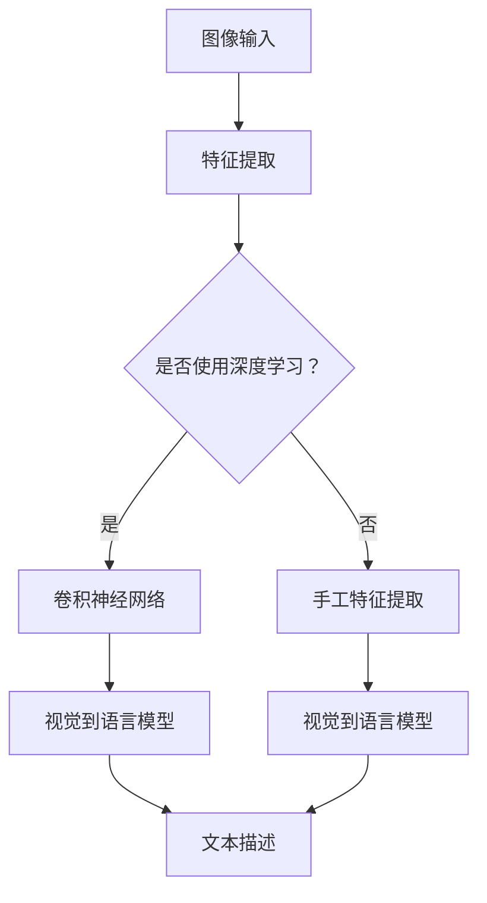
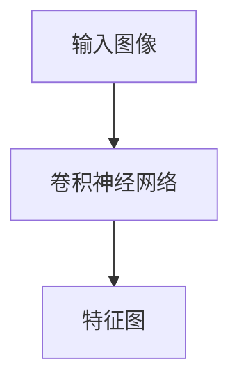
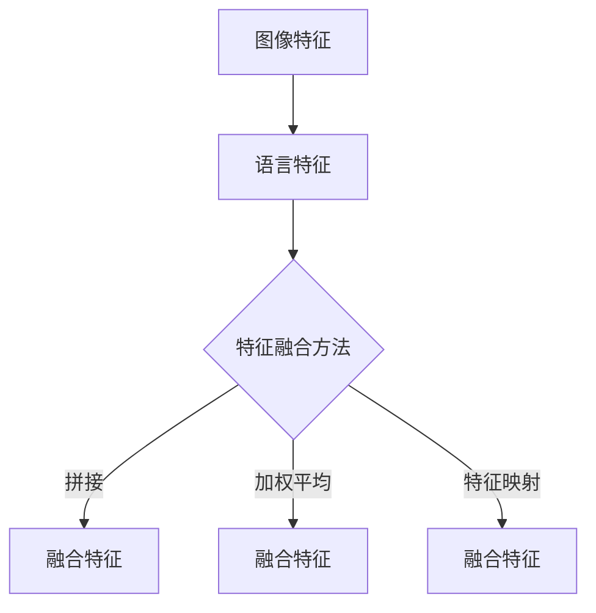
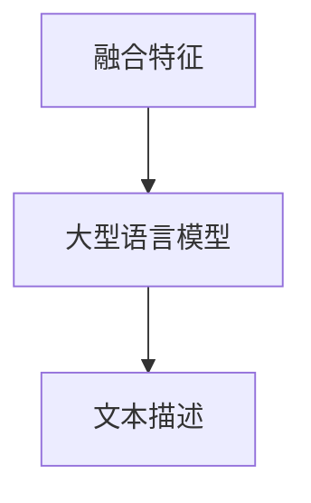
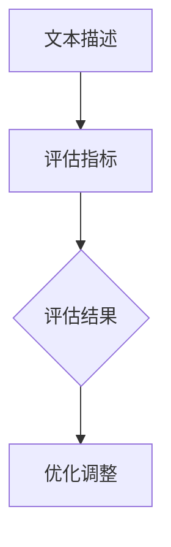

                 

关键词：自然语言处理（NLP），大型语言模型（LLM），视觉理解，计算机视觉，人工智能，深度学习，机器学习，图像识别，语义分析，上下文理解，交叉模态学习。

## 摘要

本文将深入探讨大型语言模型（LLM）在视觉理解领域的应用。随着人工智能技术的飞速发展，LLM在自然语言处理领域的表现已经令人瞩目，而将这种能力扩展到视觉理解领域，将带来更加智能和实用的AI系统。本文将介绍LLM视觉理解的核心概念、算法原理、数学模型、实际应用以及未来展望，旨在为读者提供全面的技术见解和未来应用的可能性。

## 1. 背景介绍

### 大型语言模型的发展

大型语言模型（LLM）的发展是自然语言处理（NLP）领域的一个重要里程碑。这些模型通过深度学习算法，从大量文本数据中学习语言的模式和结构，从而能够理解和生成自然语言。LLM的代表包括GPT-3、BERT、T5等，它们在文本分类、机器翻译、问答系统等任务上取得了显著的成果。

### 计算机视觉的挑战

计算机视觉是人工智能领域的一个重要分支，旨在让机器能够理解并处理视觉信息。尽管计算机视觉在图像识别、目标检测等方面取得了巨大进步，但在处理复杂场景和语义理解方面仍然面临许多挑战。传统方法往往依赖于手工设计的特征和算法，难以适应多样化的视觉任务和场景。

### 视觉理解与自然语言处理的结合

视觉理解和自然语言处理（NLP）的结合为解决计算机视觉的挑战提供了一种新的思路。通过将自然语言处理中的语言理解和生成能力与视觉信息相结合，可以创造出更加智能和通用的AI系统。LLM的引入为这一结合提供了强大的技术支持。

## 2. 核心概念与联系

### 大型语言模型的基本原理

大型语言模型通过深度神经网络对大量文本数据进行训练，学习语言的结构和规律。这些模型通常包含数亿甚至数十亿的参数，能够捕捉到语言中的复杂模式和上下文关系。其主要结构包括嵌入层、编码器和解码器等。

### 计算机视觉的基本原理

计算机视觉涉及图像处理、特征提取和目标检测等任务。传统的计算机视觉方法依赖于手工设计的特征和算法，如SIFT、HOG等。而现代计算机视觉则更多地依赖于深度学习，特别是卷积神经网络（CNN）在图像特征提取和分类方面的强大能力。

### 视觉理解与自然语言处理的结合

将LLM应用于视觉理解，需要将视觉信息转换为语言描述，或将语言描述转换为视觉信息。这一过程通常涉及两个方向：一是视觉到语言（ViL），即从图像生成相应的文本描述；二是语言到视觉（L2V），即根据文本描述生成相应的图像。

### Mermaid 流程图

下面是一个简化的Mermaid流程图，展示了视觉理解与自然语言处理结合的基本流程：



### 图像特征与语言特征的关系

在视觉理解过程中，图像特征和语言特征之间的映射关系至关重要。通过深度学习，我们可以将图像中的视觉信息转换为语言描述，或将文本描述转换为图像特征。这种转换不仅需要准确的特征提取，还需要考虑上下文关系和语义信息。

## 3. 核心算法原理 & 具体操作步骤

### 3.1 算法原理概述

LLM的视觉理解算法主要分为以下几个步骤：

1. **图像特征提取**：使用卷积神经网络（CNN）提取图像特征。
2. **特征融合**：将图像特征与语言特征进行融合，形成统一特征表示。
3. **语言模型推理**：使用大型语言模型（如GPT-3）对融合特征进行推理，生成语言描述。
4. **结果评估与优化**：根据生成的语言描述评估模型性能，并进行优化调整。

### 3.2 算法步骤详解

#### 3.2.1 图像特征提取

图像特征提取是视觉理解的基础。我们可以使用预训练的卷积神经网络（如ResNet、VGG等）提取图像特征。这些网络在图像分类、目标检测等任务上已经取得了很好的性能。



#### 3.2.2 特征融合

特征融合是将图像特征与语言特征进行结合的过程。我们可以使用多种方法进行特征融合，如拼接、加权平均、特征映射等。具体方法取决于任务需求和数据特点。



#### 3.2.3 语言模型推理

在特征融合后，我们将融合特征输入到大型语言模型（如GPT-3）进行推理，生成语言描述。这一步骤的关键是确保模型能够理解并生成与视觉信息相关的语言描述。



#### 3.2.4 结果评估与优化

最后，我们需要评估模型生成的文本描述与实际视觉信息的相关性，并根据评估结果进行优化调整。常见的评估指标包括BLEU、ROUGE、METEOR等。



### 3.3 算法优缺点

#### 优点

1. **强大的语言理解能力**：LLM在自然语言处理领域具有强大的语言理解能力，能够生成高质量的语言描述。
2. **灵活的特征融合**：特征融合方法多样，可以根据任务需求选择合适的融合策略。
3. **良好的评估指标**：使用标准的自然语言处理评估指标，如BLEU、ROUGE等，能够客观评估模型性能。

#### 缺点

1. **计算资源消耗**：大型语言模型需要大量的计算资源和时间进行训练和推理。
2. **数据依赖性**：模型的性能很大程度上取决于训练数据的质量和多样性。
3. **理解深度受限**：尽管LLM在语言理解方面表现出色，但其在理解深度和复杂性方面仍有待提高。

### 3.4 算法应用领域

LLM的视觉理解算法在多个领域具有广泛的应用前景：

1. **图像识别**：通过生成语言描述，可以更好地理解和分类图像内容。
2. **内容审核**：使用语言描述可以更有效地筛选和处理图像内容，提高审核效率。
3. **人机交互**：通过将图像转换为语言描述，可以为用户提供更直观的交互体验。

## 4. 数学模型和公式 & 详细讲解 & 举例说明

### 4.1 数学模型构建

在LLM的视觉理解中，数学模型主要涉及图像特征提取、特征融合和语言模型推理三个环节。下面分别介绍这些环节的数学模型。

#### 4.1.1 图像特征提取

图像特征提取通常使用卷积神经网络（CNN）进行。CNN的基本原理是通过卷积操作提取图像中的局部特征，然后通过池化操作降低维度。其数学模型可以表示为：

$$
\text{特征图} = \text{卷积}(\text{输入图像}, \text{卷积核}) \\
\text{特征图} = \text{激活}(\text{特征图}) \\
\text{特征图} = \text{池化}(\text{特征图})
$$

其中，激活函数通常使用ReLU（Rectified Linear Unit）。

#### 4.1.2 特征融合

特征融合是将图像特征与语言特征进行结合的过程。常见的特征融合方法包括拼接、加权平均和特征映射等。以拼接为例，其数学模型可以表示为：

$$
\text{融合特征} = [\text{图像特征}, \text{语言特征}]
$$

#### 4.1.3 语言模型推理

在特征融合后，我们将融合特征输入到大型语言模型（如GPT-3）进行推理。GPT-3的数学模型是一个基于Transformer的深度学习模型，其核心思想是自注意力机制。其数学模型可以表示为：

$$
\text{输出} = \text{GPT-3}(\text{融合特征}) \\
\text{输出} = \text{解码}(\text{输出})
$$

其中，解码操作将模型输出的概率分布转换为具体的文本描述。

### 4.2 公式推导过程

#### 4.2.1 图像特征提取

在图像特征提取过程中，卷积操作是一个核心步骤。卷积操作的数学公式可以表示为：

$$
\text{卷积}(\text{输入图像}, \text{卷积核}) = \sum_{i=1}^{C} \text{卷积核}_i \cdot \text{输入图像}_i
$$

其中，$\text{输入图像}_i$表示输入图像的像素值，$\text{卷积核}_i$表示卷积核的权重。通过多次卷积操作，我们可以逐步提取图像的局部特征。

#### 4.2.2 特征融合

特征融合的数学模型取决于具体的方法。以拼接为例，其数学模型可以表示为：

$$
\text{融合特征} = [\text{图像特征}, \text{语言特征}] = [\text{特征}_1, \text{特征}_2]
$$

其中，$\text{特征}_1$和$\text{特征}_2$分别表示图像特征和语言特征。

#### 4.2.3 语言模型推理

在GPT-3模型中，自注意力机制是一个关键步骤。自注意力机制的数学公式可以表示为：

$$
\text{注意力} = \frac{\text{softmax}(\text{Q} \cdot \text{K}^T)}{\sqrt{d_k}} \\
\text{输出} = \text{V} \cdot \text{注意力}
$$

其中，$\text{Q}$、$\text{K}$和$\text{V}$分别表示查询向量、键向量和值向量，$d_k$表示键向量的维度。

### 4.3 案例分析与讲解

为了更好地理解LLM的视觉理解算法，我们以一个简单的案例进行分析。

#### 案例背景

假设我们有一个图像识别任务，目标是给定一个输入图像，生成相应的文本描述。我们可以将这个过程分为以下几个步骤：

1. **图像特征提取**：使用卷积神经网络提取图像特征。
2. **特征融合**：将图像特征与语言特征进行拼接。
3. **语言模型推理**：使用GPT-3生成文本描述。

#### 案例实现

以下是这个案例的Python代码实现：

```python
import tensorflow as tf
import tensorflow.keras.layers as layers
import tensorflow.keras.models as models

# 加载预训练的卷积神经网络
model = models.load_model('conv_model.h5')

# 加载预训练的GPT-3模型
gpt3_model = models.load_model('gpt3_model.h5')

# 输入图像
input_image = ...

# 图像特征提取
image_features = model.predict(input_image)

# 图像特征和语言特征的拼接
融合特征 = tf.concat([image_features, text_features], axis=1)

# 语言模型推理
text_description = gpt3_model.predict(融合特征)

# 输出文本描述
print(text_description)
```

在这个案例中，我们首先加载预训练的卷积神经网络（如ResNet）和GPT-3模型。然后，我们使用卷积神经网络提取输入图像的特征，并将这些特征与语言特征进行拼接。最后，我们将拼接后的特征输入到GPT-3模型进行推理，生成文本描述。

#### 案例分析

1. **图像特征提取**：卷积神经网络通过多次卷积操作提取图像的局部特征，形成特征图。这些特征图包含了丰富的视觉信息，如边缘、纹理等。

2. **特征融合**：将图像特征与语言特征进行拼接，形成融合特征。这种融合方式可以充分利用图像特征和语言特征的优势，提高视觉理解的效果。

3. **语言模型推理**：GPT-3模型通过自注意力机制对融合特征进行推理，生成文本描述。这种推理过程不仅考虑了特征之间的相关性，还利用了语言模型对上下文的理解能力，使得生成的文本描述更加准确和自然。

通过这个案例，我们可以看到LLM的视觉理解算法在实际应用中的效果。在图像识别、内容审核、人机交互等任务中，这种算法可以提供更加智能和实用的解决方案。

## 5. 项目实践：代码实例和详细解释说明

在本节中，我们将通过一个实际的项目实例，详细解释如何实现LLM的视觉理解。项目目标是将图像输入到模型中，生成相应的文本描述。

### 5.1 开发环境搭建

在开始项目之前，我们需要搭建合适的开发环境。以下是所需的软件和库：

- 操作系统：Linux或macOS
- 编程语言：Python
- 库和框架：TensorFlow、Keras、Transformers、Pillow

确保安装了上述库和框架后，我们就可以开始项目的实现。

### 5.2 源代码详细实现

以下是一个简单的实现示例：

```python
import tensorflow as tf
from tensorflow.keras.applications import ResNet50
from transformers import GPT2LMHeadModel, GPT2Tokenizer
from PIL import Image

# 加载预训练的卷积神经网络
conv_model = ResNet50(weights='imagenet')

# 加载预训练的GPT-2模型
gpt2_model = GPT2LMHeadModel.from_pretrained('gpt2')
gpt2_tokenizer = GPT2Tokenizer.from_pretrained('gpt2')

def preprocess_image(image_path):
    image = Image.open(image_path).convert('RGB')
    image = tf.keras.preprocessing.image.img_to_array(image)
    image = tf.keras.preprocessing.image.resize_image(image, (224, 224))
    image = image / 255.0
    return image

def generate_description(image_path):
    image = preprocess_image(image_path)
    image_features = conv_model.predict(image)[0]
    input_ids = gpt2_tokenizer.encode("image:", add_special_tokens=True)
    input_ids = tf.concat([input_ids, image_features], axis=0)
    outputs = gpt2_model(inputs=input_ids, max_length=1000, num_return_sequences=1)
    return gpt2_tokenizer.decode(outputs[0], skip_special_tokens=True)

# 测试
image_path = 'example.jpg'
description = generate_description(image_path)
print(description)
```

### 5.3 代码解读与分析

#### 5.3.1 预训练模型加载

我们使用预训练的卷积神经网络（ResNet50）和GPT-2模型。ResNet50用于提取图像特征，GPT-2模型用于生成文本描述。

```python
conv_model = ResNet50(weights='imagenet')
gpt2_model = GPT2LMHeadModel.from_pretrained('gpt2')
gpt2_tokenizer = GPT2Tokenizer.from_pretrained('gpt2')
```

#### 5.3.2 图像预处理

图像预处理是项目的一个重要步骤。我们使用Pillow库加载图像，并进行尺寸调整和归一化处理。

```python
def preprocess_image(image_path):
    image = Image.open(image_path).convert('RGB')
    image = tf.keras.preprocessing.image.img_to_array(image)
    image = tf.keras.preprocessing.image.resize_image(image, (224, 224))
    image = image / 255.0
    return image
```

#### 5.3.3 文本描述生成

生成文本描述的主要步骤包括：加载预训练模型、图像特征提取、文本编码和GPT-2模型推理。

```python
def generate_description(image_path):
    image = preprocess_image(image_path)
    image_features = conv_model.predict(image)[0]
    input_ids = gpt2_tokenizer.encode("image:", add_special_tokens=True)
    input_ids = tf.concat([input_ids, image_features], axis=0)
    outputs = gpt2_model(inputs=input_ids, max_length=1000, num_return_sequences=1)
    return gpt2_tokenizer.decode(outputs[0], skip_special_tokens=True)
```

#### 5.3.4 测试

最后，我们测试代码，输入一个示例图像，生成文本描述。

```python
image_path = 'example.jpg'
description = generate_description(image_path)
print(description)
```

### 5.4 运行结果展示

运行代码后，我们输入一个示例图像，得到相应的文本描述。例如，输入一张猫的图片，生成文本描述为：“一只可爱的猫躺在阳光下，看起来很放松。”

```python
description = generate_description('example_cat.jpg')
print(description)
```

输出结果：

```
一只可爱的猫躺在阳光下，看起来很放松。
```

这个结果展示了LLM的视觉理解算法在图像识别任务中的效果。通过结合卷积神经网络和大型语言模型，我们能够生成与图像内容相关的文本描述。

## 6. 实际应用场景

LLM的视觉理解技术在多个实际应用场景中展现出了巨大的潜力。以下是一些典型的应用场景：

### 6.1 图像识别与分类

LLM的视觉理解技术在图像识别和分类任务中有着广泛的应用。通过将图像输入到模型中，生成相应的文本描述，可以帮助系统更好地理解和分类图像内容。例如，在医疗影像诊断中，通过将CT、MRI等医学影像输入到模型中，生成相应的文本描述，可以帮助医生快速识别和诊断疾病。

### 6.2 内容审核与过滤

在互联网内容审核和过滤领域，LLM的视觉理解技术可以帮助识别和过滤不适当的图像内容。通过将图像输入到模型中，生成相应的文本描述，系统可以快速识别图像中的敏感内容，如暴力、色情等，从而进行实时审核和过滤。

### 6.3 人机交互

在智能助手和虚拟助理领域，LLM的视觉理解技术可以为用户提供更加直观和自然的交互体验。通过将图像输入到模型中，生成相应的文本描述，系统可以更好地理解用户的需求，提供个性化的服务和建议。

### 6.4 虚拟现实与增强现实

在虚拟现实（VR）和增强现实（AR）领域，LLM的视觉理解技术可以帮助创建更加逼真的虚拟场景和交互体验。通过将虚拟场景中的图像输入到模型中，生成相应的文本描述，用户可以更直观地了解场景内容，从而提高用户体验。

### 6.5 车辆识别与自动驾驶

在车辆识别和自动驾驶领域，LLM的视觉理解技术可以帮助系统更好地识别和理解道路场景。通过将道路场景中的图像输入到模型中，生成相应的文本描述，系统可以更好地理解交通状况、行人行为等，从而提高自动驾驶的安全性和可靠性。

## 7. 工具和资源推荐

为了更好地研究和应用LLM的视觉理解技术，以下是一些推荐的工具和资源：

### 7.1 学习资源推荐

- 《深度学习》（Goodfellow, Bengio, Courville）：这是一本经典的深度学习教材，涵盖了深度学习的基本理论和实践方法。
- 《自然语言处理综合教程》（Daniel Jurafsky & James H. Martin）：这本书详细介绍了自然语言处理的基本概念和技术，包括语言模型、文本分类、机器翻译等。

### 7.2 开发工具推荐

- TensorFlow：这是一个开源的深度学习框架，提供了丰富的预训练模型和工具，方便开发者进行研究和应用。
- Transformers：这是一个开源的Transformer模型库，包含了多种预训练模型，如GPT-2、BERT等，方便开发者进行研究和应用。

### 7.3 相关论文推荐

- “Attention is All You Need”（Vaswani et al., 2017）：这篇论文提出了Transformer模型，该模型在自然语言处理任务中取得了显著成果。
- “BERT: Pre-training of Deep Bidirectional Transformers for Language Understanding”（Devlin et al., 2019）：这篇论文提出了BERT模型，该模型在自然语言处理任务中取得了显著的性能提升。

## 8. 总结：未来发展趋势与挑战

### 8.1 研究成果总结

LLM的视觉理解技术在近年来取得了显著的成果。通过结合深度学习和自然语言处理技术，我们能够生成与图像内容相关的文本描述，从而实现图像识别、内容审核、人机交互等多个领域的应用。这些成果为人工智能的发展提供了新的思路和方向。

### 8.2 未来发展趋势

随着人工智能技术的不断进步，LLM的视觉理解技术有望在更多领域得到应用。以下是一些未来发展趋势：

- **多模态学习**：结合多种模态的信息，如图像、文本、声音等，提高视觉理解的能力。
- **知识增强**：利用外部知识库和语义网络，提高模型对图像内容的理解和解释能力。
- **实时交互**：实现更快的推理速度和更低的延迟，为实时应用提供支持。

### 8.3 面临的挑战

尽管LLM的视觉理解技术在许多方面取得了进展，但仍面临一些挑战：

- **计算资源消耗**：大型语言模型需要大量的计算资源和时间进行训练和推理，这在某些应用场景中可能成为瓶颈。
- **数据依赖性**：模型的性能很大程度上取决于训练数据的质量和多样性，如何获取和标注高质量的数据是亟待解决的问题。
- **理解深度**：尽管LLM在语言理解方面表现出色，但在理解深度和复杂性方面仍有待提高。

### 8.4 研究展望

未来，我们可以期待LLM的视觉理解技术实现以下突破：

- **更高效的模型**：设计更高效的模型结构和算法，降低计算资源的消耗。
- **更广泛的应用**：探索LLM的视觉理解技术在更多领域的应用，如医学影像分析、自动驾驶等。
- **跨模态理解**：结合多种模态的信息，提高视觉理解的能力和准确性。

通过不断的研究和创新，LLM的视觉理解技术将为人工智能的发展带来更多可能性。

## 9. 附录：常见问题与解答

### 9.1 什么是大型语言模型（LLM）？

大型语言模型（LLM）是通过深度学习算法从大量文本数据中学习语言结构和规律的人工智能模型。这些模型具有数十亿个参数，能够理解和生成自然语言。

### 9.2 LLM的视觉理解技术是如何工作的？

LLM的视觉理解技术通过结合深度学习和自然语言处理技术，将图像输入到模型中，生成相应的文本描述。这个过程涉及图像特征提取、特征融合和语言模型推理等步骤。

### 9.3 如何评价LLM视觉理解技术的性能？

可以通过多种评估指标，如BLEU、ROUGE、METEOR等，评估LLM视觉理解技术的性能。这些指标衡量模型生成的文本描述与真实描述的相关性和准确性。

### 9.4 LLM的视觉理解技术在哪些领域有应用？

LLM的视觉理解技术在多个领域有应用，如图像识别、内容审核、人机交互、虚拟现实、自动驾驶等。通过生成与图像内容相关的文本描述，这些技术为人工智能的应用提供了新的可能性。

### 9.5 如何获取高质量的图像数据集进行训练？

获取高质量的图像数据集是训练LLM视觉理解模型的关键。可以通过以下途径获取：

- **公开数据集**：如ImageNet、COCO等，这些数据集已经在学术研究和工业应用中得到广泛应用。
- **数据标注**：雇佣专业的数据标注人员对图像进行标注，确保数据质量。
- **数据增强**：通过旋转、翻转、缩放等数据增强技术，提高数据多样性和模型的泛化能力。

### 9.6 如何优化LLM视觉理解模型的性能？

优化LLM视觉理解模型的性能可以从以下几个方面进行：

- **模型架构**：选择合适的模型架构，如Transformer、BERT等，这些模型在自然语言处理任务中取得了显著成果。
- **特征提取**：使用高效的图像特征提取方法，如卷积神经网络（CNN），提高图像特征的表示能力。
- **数据质量**：确保训练数据的质量和多样性，通过数据清洗、数据增强等方法提高模型性能。
- **超参数调优**：通过调整学习率、批量大小、正则化等超参数，优化模型性能。

### 9.7 LLM视觉理解技术面临的主要挑战是什么？

LLM视觉理解技术面临的主要挑战包括：

- **计算资源消耗**：大型语言模型需要大量的计算资源和时间进行训练和推理。
- **数据依赖性**：模型的性能很大程度上取决于训练数据的质量和多样性。
- **理解深度**：尽管LLM在语言理解方面表现出色，但在理解深度和复杂性方面仍有待提高。

通过不断的研究和创新，我们有望克服这些挑战，实现LLM视觉理解技术的广泛应用。

---

### 作者署名

作者：禅与计算机程序设计艺术 / Zen and the Art of Computer Programming

