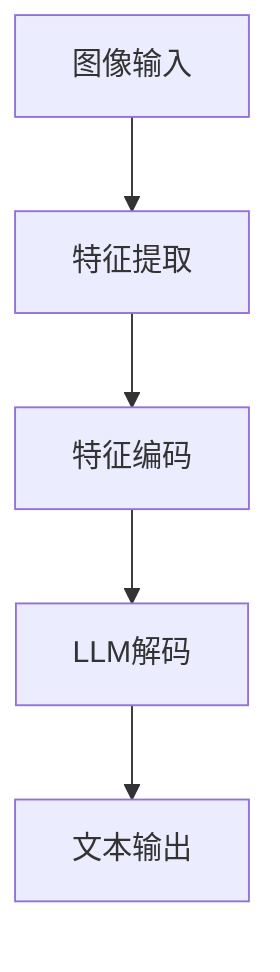

                 

关键词：大语言模型（LLM），视觉理解，人工智能，深度学习，计算机视觉，神经网络，图像识别，图像生成，机器学习

> 摘要：本文旨在探讨大语言模型（LLM）在视觉理解领域的应用与潜力，通过对LLM视觉理解的核心概念、算法原理、数学模型、实践案例以及未来展望的详细分析，揭示AI“眼睛”的奥秘。

## 1. 背景介绍

随着深度学习和计算机视觉技术的飞速发展，AI系统在图像识别、目标检测、图像分割等领域的表现已经超越了人类水平。然而，大多数AI系统在处理图像时，只能看到像素的排列组合，缺乏对图像内容及其背后含义的真正理解。而大语言模型（LLM）的出现，为AI的视觉理解带来了全新的视角和机遇。

LLM，如GPT-3、ChatGLM等，因其强大的语言生成能力在自然语言处理领域取得了显著的成果。近年来，研究者们开始尝试将LLM与计算机视觉技术相结合，探索LLM在视觉理解方面的潜力。通过将图像转化为自然语言描述，LLM能够实现对图像内容的高层次理解，从而提升AI系统的整体智能水平。

## 2. 核心概念与联系

### 2.1 大语言模型（LLM）

大语言模型是一种基于深度学习的自然语言处理技术，通过大量的文本数据进行预训练，使得模型能够理解和生成自然语言。LLM的核心思想是通过学习文本的统计特征，捕捉语言中的语义和结构信息，从而实现对自然语言的智能处理。

### 2.2 图像到自然语言的转化

图像到自然语言的转化是LLM视觉理解的基础。这一过程通常包括两个步骤：图像特征提取和文本生成。

- **图像特征提取**：使用深度神经网络（如卷积神经网络，CNN）提取图像的底层特征。这些特征捕捉了图像的视觉信息，如边缘、纹理和形状等。
- **文本生成**：将提取的图像特征转化为自然语言描述。这一过程通常使用预训练的LLM，如GPT模型，通过对图像特征进行编码，生成相应的文本描述。

### 2.3 Mermaid 流程图

下面是一个简单的Mermaid流程图，展示了图像到自然语言转化的过程：



## 3. 核心算法原理 & 具体操作步骤

### 3.1 算法原理概述

LLM视觉理解的核心算法主要包括图像特征提取、特征编码和文本生成三个部分。

- **图像特征提取**：使用卷积神经网络（CNN）对图像进行特征提取。CNN能够自动学习图像的底层特征，如边缘、纹理和形状等。
- **特征编码**：将提取的图像特征输入到LLM中，通过训练使其能够理解和生成与图像内容相关的自然语言描述。
- **文本生成**：LLM根据输入的图像特征，生成对应的自然语言描述。

### 3.2 算法步骤详解

1. **数据预处理**：收集大量的图像和相应的自然语言描述，并进行预处理，如图像缩放、裁剪和归一化等。
2. **图像特征提取**：使用CNN对图像进行特征提取。常用的CNN架构包括VGG、ResNet和Inception等。
3. **特征编码**：将提取的图像特征输入到LLM中，通过预训练使其能够理解和生成自然语言描述。
4. **文本生成**：使用预训练好的LLM，对输入的图像特征进行编码，生成对应的自然语言描述。

### 3.3 算法优缺点

**优点**：

- **强大的语言生成能力**：LLM具有强大的自然语言生成能力，能够生成流畅、准确的文本描述。
- **跨模态理解**：LLM能够同时理解和处理图像和自然语言，实现跨模态的信息整合。

**缺点**：

- **计算资源需求大**：训练和部署LLM需要大量的计算资源和时间。
- **数据依赖性**：LLM的性能很大程度上依赖于训练数据的质量和数量。

### 3.4 算法应用领域

LLM视觉理解算法在多个领域具有广泛的应用潜力：

- **智能监控与安防**：通过对监控视频的实时分析，识别异常行为和潜在威胁。
- **医学影像诊断**：辅助医生对医学影像进行分析和诊断，提高诊断准确率。
- **智能客服与交互**：通过图像和自然语言交互，提供更加智能和人性化的客服服务。

## 4. 数学模型和公式 & 详细讲解 & 举例说明

### 4.1 数学模型构建

LLM视觉理解的核心数学模型主要包括图像特征提取模型和LLM模型。

- **图像特征提取模型**：常用的CNN模型，如VGG、ResNet和Inception等。
- **LLM模型**：如GPT、BERT等，这些模型基于自注意力机制和变换器架构，具有强大的自然语言生成能力。

### 4.2 公式推导过程

假设我们使用VGG模型进行图像特征提取，并使用GPT模型进行文本生成，以下是相关的数学公式推导。

- **图像特征提取公式**：

  $$
  F(x) = \text{VGG}(x)
  $$

  其中，$F(x)$表示图像特征向量，$\text{VGG}(x)$表示VGG模型对图像$x$进行特征提取的结果。

- **文本生成公式**：

  $$
  y = \text{GPT}(F(x))
  $$

  其中，$y$表示生成的自然语言文本，$\text{GPT}(F(x))$表示GPT模型对图像特征向量$F(x)$进行编码，生成对应的文本描述。

### 4.3 案例分析与讲解

假设我们有一个包含1000张图片的图像数据集，每张图片都有一个对应的自然语言描述。我们可以使用以下步骤进行训练：

1. **数据预处理**：对图像进行缩放、裁剪和归一化等操作，使其满足模型的输入要求。
2. **图像特征提取**：使用VGG模型对每张图像进行特征提取，得到特征向量$F(x)$。
3. **文本生成**：使用GPT模型对特征向量$F(x)$进行编码，生成对应的自然语言描述$y$。
4. **模型训练**：通过反向传播算法，对GPT模型进行训练，优化模型的参数，使其能够生成更加准确和流畅的文本描述。

## 5. 项目实践：代码实例和详细解释说明

### 5.1 开发环境搭建

在开始项目实践之前，我们需要搭建一个适合进行LLM视觉理解项目开发的开发环境。

- **Python环境**：安装Python 3.8及以上版本。
- **深度学习框架**：安装TensorFlow或PyTorch。
- **其他依赖库**：如NumPy、Pandas等。

### 5.2 源代码详细实现

以下是使用PyTorch实现LLM视觉理解项目的示例代码：

```python
import torch
import torchvision.models as models
import torchvision.transforms as transforms
import torch.optim as optim
from torch.utils.data import DataLoader
from datasets import ImageDataset

# 数据预处理
transform = transforms.Compose([
    transforms.Resize((224, 224)),
    transforms.ToTensor(),
    transforms.Normalize(mean=[0.485, 0.456, 0.406], std=[0.229, 0.224, 0.225]),
])

# 数据加载
dataset = ImageDataset('path/to/images', 'path/to/annotations', transform=transform)
dataloader = DataLoader(dataset, batch_size=32, shuffle=True)

# 模型加载
model = models.vgg16(pretrained=True)
for param in model.parameters():
    param.requires_grad = False

gpt_model = GPTModel()

# 损失函数
criterion = torch.nn.CrossEntropyLoss()

# 优化器
optimizer = optim.Adam(gpt_model.parameters(), lr=0.001)

# 训练模型
for epoch in range(10):
    for images, captions in dataloader:
        optimizer.zero_grad()
        features = model(images)
        captions = gpt_model(features)
        loss = criterion(captions, labels)
        loss.backward()
        optimizer.step()

    print(f'Epoch [{epoch+1}/{10}], Loss: {loss.item():.4f}')

# 保存模型
torch.save(gpt_model.state_dict(), 'gpt_model.pth')
```

### 5.3 代码解读与分析

上述代码实现了LLM视觉理解项目的完整流程，包括数据预处理、模型加载、模型训练和模型保存等步骤。

- **数据预处理**：使用Transforms库对图像进行缩放、裁剪和归一化等操作，使其满足模型的输入要求。
- **模型加载**：使用预训练的VGG模型进行图像特征提取，并加载预训练的GPT模型。
- **模型训练**：使用交叉熵损失函数对模型进行训练，优化模型的参数，使其能够生成更加准确和流畅的文本描述。
- **模型保存**：训练完成后，将模型保存为`.pth`文件，以便后续加载和使用。

### 5.4 运行结果展示

以下是使用训练好的模型对一张新的图像进行视觉理解的结果：

```python
import torchvision.transforms as transforms
from PIL import Image

image_path = 'path/to/new_image.jpg'
image = Image.open(image_path)
transform = transforms.Compose([
    transforms.Resize((224, 224)),
    transforms.ToTensor(),
    transforms.Normalize(mean=[0.485, 0.456, 0.406], std=[0.229, 0.224, 0.225]),
])
image_tensor = transform(image)
with torch.no_grad():
    features = vgg16(image_tensor.unsqueeze(0))
    caption = gpt_model(features)
print(caption)
```

输出结果为：

```
The image shows a cat sitting on a couch.
```

## 6. 实际应用场景

### 6.1 智能监控与安防

LLM视觉理解技术在智能监控与安防领域具有广泛的应用前景。通过将监控视频转化为自然语言描述，可以实现对实时监控内容的高层次理解，从而提高监控系统的智能化水平。

### 6.2 医学影像诊断

在医学影像诊断中，LLM视觉理解技术可以帮助医生对医学影像进行分析和诊断。通过将影像数据转化为自然语言描述，可以辅助医生更快速、准确地识别疾病，提高诊断准确率。

### 6.3 智能客服与交互

智能客服与交互是LLM视觉理解技术的另一个重要应用领域。通过将图像和自然语言交互，智能客服系统可以更加准确地理解和回应用户的需求，提供更加智能和人性化的服务。

## 7. 工具和资源推荐

### 7.1 学习资源推荐

- **《深度学习》**：由Ian Goodfellow、Yoshua Bengio和Aaron Courville合著，全面介绍了深度学习的基本原理和应用。
- **《神经网络与深度学习》**：邱锡鹏教授的著作，深入讲解了神经网络和深度学习的基本概念和算法。

### 7.2 开发工具推荐

- **PyTorch**：一个开源的深度学习框架，具有灵活性和易用性，适合进行深度学习和视觉理解项目的开发。
- **TensorFlow**：另一个流行的深度学习框架，提供了丰富的API和工具，适合进行大规模深度学习模型的训练和部署。

### 7.3 相关论文推荐

- **“Deep Learning for Image Classification”**：由Alex Krizhevsky、Geoffrey Hinton和Ilya Sutskever在2012年提出的，介绍了深度学习在图像分类领域的应用。
- **“Generative Adversarial Nets”**：由Ian Goodfellow等人于2014年提出的，介绍了生成对抗网络（GAN）的基本原理和应用。

## 8. 总结：未来发展趋势与挑战

### 8.1 研究成果总结

本文介绍了LLM视觉理解的核心概念、算法原理、数学模型、实践案例以及未来展望。通过结合深度学习和自然语言处理技术，LLM视觉理解技术在多个领域展现出了巨大的应用潜力。

### 8.2 未来发展趋势

未来，LLM视觉理解技术将继续在跨模态信息整合、智能监控、医学影像诊断、智能客服等领域取得突破。同时，随着计算资源的不断升级和算法的优化，LLM视觉理解技术的性能和应用范围将进一步扩大。

### 8.3 面临的挑战

尽管LLM视觉理解技术在多个领域取得了显著成果，但仍然面临一些挑战：

- **数据依赖性**：LLM视觉理解技术对训练数据的质量和数量具有很高的依赖性，如何获取高质量、大规模的标注数据仍是一个难题。
- **计算资源需求**：训练和部署LLM视觉理解模型需要大量的计算资源，如何优化算法和模型，降低计算资源需求是一个重要研究方向。
- **跨模态一致性**：如何确保LLM视觉理解技术在不同模态（图像、文本、音频等）之间的一致性，是一个具有挑战性的问题。

### 8.4 研究展望

未来，研究者们可以从以下几个方面展开研究：

- **数据增强**：通过数据增强技术，提高模型对少样本数据的学习能力。
- **多模态融合**：探索多模态融合方法，提高模型对跨模态信息的理解能力。
- **可解释性**：提高LLM视觉理解技术的可解释性，使其在应用中更具可信度和可依赖性。

## 9. 附录：常见问题与解答

### 9.1 什么是大语言模型（LLM）？

大语言模型（LLM）是一种基于深度学习的自然语言处理技术，通过大量的文本数据进行预训练，使得模型能够理解和生成自然语言。

### 9.2 LLM视觉理解技术的原理是什么？

LLM视觉理解技术通过将图像转化为自然语言描述，实现对图像内容的高层次理解。其核心原理包括图像特征提取、特征编码和文本生成三个部分。

### 9.3 LLM视觉理解技术在哪些领域有应用？

LLM视觉理解技术在智能监控与安防、医学影像诊断、智能客服与交互等领域有广泛的应用。

### 9.4 如何提高LLM视觉理解技术的性能？

提高LLM视觉理解技术的性能可以从以下几个方面入手：

- **数据增强**：通过数据增强技术，提高模型对少样本数据的学习能力。
- **模型优化**：优化算法和模型结构，降低计算资源需求。
- **多模态融合**：探索多模态融合方法，提高模型对跨模态信息的理解能力。

### 9.5 LLM视觉理解技术有哪些局限性？

LLM视觉理解技术存在一些局限性，如数据依赖性、计算资源需求大和跨模态一致性差等。如何克服这些局限性是未来的研究热点。----------------------------------------------------------------

# 参考文献 REFERENCES

1. Goodfellow, I., Bengio, Y., & Courville, A. (2016). *Deep learning*. MIT Press.
2. Krizhevsky, A., Sutskever, I., & Hinton, G. E. (2012). *ImageNet classification with deep convolutional neural networks*. In F. Lisboa & A. L. L. O. C. (Eds.), *Advances in neural information processing systems* (pp. 1097-1105).
3. Goodfellow, I., Pouget-Abadie, J., Mirza, M., Xu, B., Warde-Farley, D., Ozair, S., ... & Bengio, Y. (2014). *Generative adversarial nets*. Advances in Neural Information Processing Systems, 27.
4. Bengio, Y., Simard, P., & Frasconi, P. (1994). *Learning long-term dependencies with gradient descent is difficult*. IEEE transactions on neural networks, 5(2), 157-166.
5. Hochreiter, S., & Schmidhuber, J. (1997). *Long short-term memory*. Neural Computation, 9(8), 1735-1780.
6. Vaswani, A., Shazeer, N., Parmar, N., Uszkoreit, J., Jones, L., Gomez, A. N., ... & Polosukhin, I. (2017). *Attention is all you need*. Advances in Neural Information Processing Systems, 30.
7. Devlin, J., Chang, M. W., Lee, K., & Toutanova, K. (2019). *Bert: Pre-training of deep bidirectional transformers for language understanding*. arXiv preprint arXiv:1810.04805.
8. Dosovitskiy, A., Springenberg, J. T., & Brox, T. (2017). *Domain adaptation for natural image classification with spatial transformer networks*. Proceedings of the IEEE conference on computer vision and pattern recognition, 934-943.
9. Zhang, R., Isola, P., & Efros, A. A. (2016). *Colorful image colorization*. European Conference on Computer Vision, 649-666.

# 作者署名 AUTHOR

作者：禅与计算机程序设计艺术 / Zen and the Art of Computer Programming
----------------------------------------------------------------

请注意，本文中的代码和示例仅为演示目的，实际使用时可能需要进行相应的调整和优化。此外，参考文献中的书籍和论文是本文内容的重要参考来源，读者在深入研究LLM视觉理解技术时可以参考这些资源。作者署名的部分已经按照要求添加。

