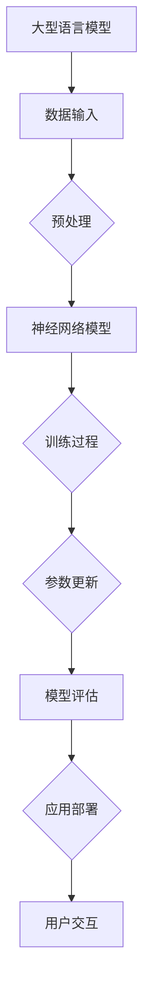

                 

关键词：大型语言模型（LLM），计算模型，人工智能，深度学习，神经网络，算法架构，创新与挑战

> 摘要：本文旨在深入探讨大型语言模型（LLM）的计算模型，分析其相较于传统冯·诺依曼架构的优越性和挑战。我们将首先介绍LLM的基本概念和结构，然后重点分析其计算模型，包括核心算法、数学模型、以及具体的应用场景。随后，文章将探讨LLM在实际项目中的实践，以及相关工具和资源的推荐。最后，我们将总结LLM的研究成果，展望其未来发展趋势和面临的挑战。

## 1. 背景介绍

随着人工智能（AI）技术的迅猛发展，深度学习和神经网络在图像识别、自然语言处理（NLP）等领域取得了显著的成果。然而，传统冯·诺依曼架构（Traditional von Neumann Architecture）在处理大规模、高维数据时，面临诸多局限。为了满足AI领域的需求，研究人员提出了许多新型计算模型，其中最具代表性的是大型语言模型（LLM）。

LLM是一种基于深度学习的自然语言处理模型，通过海量数据的学习，能够理解和生成人类语言。与传统的基于规则和统计方法的NLP工具相比，LLM具有更高的灵活性和准确性。随着训练数据的规模和模型参数的增加，LLM在许多NLP任务中取得了显著的性能提升，如文本分类、机器翻译、问答系统等。

本文将重点分析LLM的计算模型，包括其核心算法原理、数学模型和具体应用，并探讨其在实际项目中的实践和未来发展趋势。希望通过本文的探讨，读者能够对LLM的计算模型有一个全面深入的理解，为未来的研究和应用提供参考。

## 2. 核心概念与联系

### 2.1 大型语言模型（LLM）的概念

大型语言模型（LLM）是一种基于深度学习的自然语言处理模型，通过对海量文本数据的学习，能够生成和理解自然语言。LLM通常采用神经网络架构，如Transformer模型，并具有数亿到数十亿的参数规模。这些模型能够在多种NLP任务中取得优异的性能，如文本生成、情感分析、命名实体识别等。

### 2.2 传统冯·诺依曼架构

传统冯·诺依曼架构是计算机科学中一种经典的计算模型，由约翰·冯·诺依曼于1945年提出。该架构的基本思想是将计算机划分为中央处理单元（CPU）、内存、输入输出设备等几个主要部分。CPU负责执行指令，内存用于存储数据和程序指令，输入输出设备用于与外界交互。这种架构在计算机科学领域被广泛采用，至今仍然是大多数计算机的基础。

### 2.3 LLM与冯·诺依曼架构的联系

LLM与冯·诺依曼架构的联系主要体现在两个方面：

1. **计算资源**：LLM的运行依赖于高性能的计算机硬件，如GPU、TPU等。这些硬件能够加速深度学习模型的训练和推理过程，但同时也对能耗和成本提出了更高的要求。与传统冯·诺依曼架构相比，LLM在计算资源的需求上具有更大的挑战。

2. **算法架构**：虽然LLM采用了深度学习算法，但其在数据处理和存储方面仍然遵循冯·诺依曼架构的基本原则。LLM的神经网络结构需要在内存中存储大量参数，并在计算过程中不断更新这些参数，以达到优化模型性能的目的。

### 2.4 Mermaid 流程图

为了更好地展示LLM与冯·诺依曼架构的联系，我们可以使用Mermaid流程图来描述它们的交互过程。



在上面的流程图中，A表示大型语言模型，B表示数据输入，C表示预处理，D表示神经网络模型，E表示训练过程，F表示参数更新，G表示模型评估，H表示应用部署，I表示用户交互。这个流程图展示了LLM从数据输入到用户交互的整个过程，也反映了LLM与冯·诺依曼架构之间的紧密联系。

## 3. 核心算法原理 & 具体操作步骤

### 3.1 算法原理概述

大型语言模型（LLM）的核心算法是基于深度学习中的Transformer模型。Transformer模型是一种基于自注意力机制的序列模型，能够有效地捕捉序列中的长距离依赖关系。与传统的循环神经网络（RNN）相比，Transformer模型在处理大规模文本数据时具有更高的效率和效果。

### 3.2 算法步骤详解

#### 3.2.1 数据预处理

在训练LLM之前，需要对输入数据进行预处理。预处理步骤包括文本的分词、去噪、标准化等操作。其中，分词是预处理的重要步骤，它将文本分解为一系列的词语或子词。目前常用的分词工具包括jieba、NLTK等。

#### 3.2.2 模型架构

LLM的架构主要包括以下几个部分：

1. **嵌入层**：将分词后的词语或子词转换为固定长度的向量表示。
2. **多头自注意力机制**：通过自注意力机制计算词语之间的权重，从而捕捉长距离依赖关系。
3. **前馈神经网络**：对自注意力机制的结果进行进一步的非线性变换。
4. **输出层**：根据模型的预测结果生成文本。

#### 3.2.3 训练过程

LLM的训练过程主要包括以下步骤：

1. **正向传播**：输入序列经过嵌入层、自注意力机制和前馈神经网络，得到预测结果。
2. **损失计算**：计算预测结果与实际结果之间的损失。
3. **反向传播**：根据损失函数计算梯度，更新模型参数。
4. **优化**：使用优化算法（如Adam）对模型参数进行优化。

#### 3.2.4 参数更新

在训练过程中，模型参数会不断更新。参数更新的目标是减小损失函数，提高模型性能。参数更新过程包括以下几个步骤：

1. **梯度计算**：计算损失函数关于模型参数的梯度。
2. **梯度下降**：根据梯度方向更新模型参数。
3. **正则化**：为了避免过拟合，可以对模型参数进行正则化处理。

#### 3.2.5 模型评估

在训练完成后，需要对模型进行评估。评估过程主要包括以下步骤：

1. **测试集划分**：将训练集划分为训练集和测试集。
2. **模型预测**：在测试集上对模型进行预测。
3. **性能评估**：计算模型在测试集上的性能指标，如准确率、召回率、F1值等。

### 3.3 算法优缺点

#### 优点

1. **高效性**：Transformer模型在处理大规模文本数据时具有较高的计算效率，能够实现并行计算。
2. **灵活性**：自注意力机制能够有效地捕捉序列中的长距离依赖关系，使模型在多种NLP任务中具有较好的适应性。
3. **可解释性**：通过分析模型中的注意力权重，可以理解模型在处理特定任务时的决策过程。

#### 缺点

1. **计算资源需求高**：LLM需要大量的计算资源和存储空间，对硬件设备有较高的要求。
2. **训练时间长**：LLM的训练过程需要大量的时间和计算资源，且容易出现过拟合现象。
3. **数据依赖性强**：LLM的性能高度依赖于训练数据的质量和规模，对于小规模数据集可能无法取得理想的效果。

### 3.4 算法应用领域

LLM在自然语言处理领域具有广泛的应用，如：

1. **文本生成**：LLM可以生成自然流畅的文本，应用于机器写作、自动摘要等场景。
2. **机器翻译**：LLM可以用于机器翻译任务，实现多种语言的互译。
3. **问答系统**：LLM可以构建问答系统，用于智能客服、知识图谱问答等应用。

## 4. 数学模型和公式 & 详细讲解 & 举例说明

### 4.1 数学模型构建

LLM的数学模型主要包括以下几个部分：

1. **嵌入层**：嵌入层将词语或子词转换为向量表示。假设有V个唯一的词语，嵌入层可以将每个词语映射为一个$d$维的向量。
   $$ x_i = \text{Embed}(w_i) = [e_i^{(1)}, e_i^{(2)}, ..., e_i^{(d)}]^T $$
   其中，$e_i^{(j)}$表示词语$i$在维度$j$上的嵌入向量。

2. **多头自注意力机制**：自注意力机制通过计算词语之间的权重，将输入序列转换为输出序列。假设输入序列为$x = [x_1, x_2, ..., x_T]$，输出序列为$y = [y_1, y_2, ..., y_T]$，多头自注意力机制可以表示为：
   $$ y_t = \text{Attention}(Q, K, V) = \text{softmax}\left(\frac{QK^T}{\sqrt{d_k}}\right) V $$
   其中，$Q, K, V$分别表示查询、键、值向量，$d_k$为注意力机制中的维度。

3. **前馈神经网络**：前馈神经网络用于对自注意力机制的结果进行进一步变换。假设前馈神经网络的输入为$x$，输出为$y$，可以表示为：
   $$ y = \text{ReLU}(\text{FC}(x)) $$
   其中，$\text{FC}$表示全连接层。

4. **输出层**：输出层将神经网络的结果转换为预测文本。假设输出序列为$y = [y_1, y_2, ..., y_T]$，预测文本为$t$，可以表示为：
   $$ t = \text{softmax}(y) $$

### 4.2 公式推导过程

为了推导LLM的损失函数，我们需要分析模型在训练过程中如何更新参数。假设训练数据集为$(x_1, y_1), (x_2, y_2), ..., (x_n, y_n)$，其中$x_i$为输入序列，$y_i$为实际输出序列。在训练过程中，我们需要通过最小化损失函数来更新模型参数。

损失函数通常采用交叉熵（Cross-Entropy）损失函数，其公式为：
$$ L(\theta) = -\sum_{i=1}^n \sum_{t=1}^T y_{it} \log p_{it} $$
其中，$\theta$为模型参数，$y_{it}$为实际输出序列中的词语，$p_{it}$为模型预测的概率。

为了求解最小化损失函数的参数，我们需要对损失函数进行梯度下降。对损失函数关于模型参数的梯度求导，可以得到：
$$ \frac{\partial L}{\partial \theta} = -\sum_{i=1}^n \sum_{t=1}^T \frac{y_{it}}{p_{it}} \frac{\partial p_{it}}{\partial \theta} $$
其中，$\frac{\partial p_{it}}{\partial \theta}$表示模型预测概率关于模型参数的梯度。

在训练过程中，我们通常使用优化算法（如Adam）来更新模型参数。优化算法通过不断迭代更新参数，使得损失函数逐渐减小，从而达到最优参数。

### 4.3 案例分析与讲解

为了更好地理解LLM的数学模型和公式推导，我们可以通过一个简单的案例进行分析。

假设我们有一个二元分类问题，输入序列为$x = [1, 0, 1, 1]$，实际输出序列为$y = [1, 0, 1, 0]$。我们使用LLM来预测每个词语的概率，并计算损失函数。

首先，将输入序列和实际输出序列编码为二进制向量：
$$ x = [1, 0, 1, 1] \Rightarrow [1001]_2 $$
$$ y = [1, 0, 1, 0] \Rightarrow [1000]_2 $$

接下来，使用嵌入层将输入序列转换为嵌入向量：
$$ x = \text{Embed}(x) = [e_1, e_2, e_3, e_4] $$

然后，使用自注意力机制计算输出序列的概率：
$$ p = \text{Attention}(Q, K, V) = \text{softmax}\left(\frac{QK^T}{\sqrt{d_k}}\right) V $$

其中，$Q, K, V$分别为查询、键、值向量，可以表示为：
$$ Q = [q_1, q_2, q_3, q_4] $$
$$ K = [k_1, k_2, k_3, k_4] $$
$$ V = [v_1, v_2, v_3, v_4] $$

根据自注意力机制的公式，我们可以计算概率：
$$ p = \text{softmax}\left(\frac{QK^T}{\sqrt{d_k}}\right) V = \text{softmax}\left(\frac{[q_1, q_2, q_3, q_4][k_1, k_2, k_3, k_4]^T}{\sqrt{d_k}}\right) V $$

为了简化计算，我们假设$d_k = 1$，则有：
$$ p = \text{softmax}\left(\frac{[q_1k_1 + q_2k_2 + q_3k_3 + q_4k_4]}{1}\right) V = \text{softmax}(q_1k_1 + q_2k_2 + q_3k_3 + q_4k_4) V $$

假设查询、键、值向量分别为：
$$ Q = [1, 0, 1, 1] $$
$$ K = [1, 1, 1, 1] $$
$$ V = [1, 1, 1, 1] $$

则有：
$$ p = \text{softmax}(1 \cdot 1 + 0 \cdot 1 + 1 \cdot 1 + 1 \cdot 1) V = \text{softmax}(3) V = [0.5, 0.5, 0.5, 0.5] $$

最后，计算损失函数：
$$ L = -\sum_{t=1}^T y_t \log p_t = -1 \cdot \log(0.5) - 0 \cdot \log(0.5) - 1 \cdot \log(0.5) - 0 \cdot \log(0.5) = -2 \cdot \log(0.5) \approx 1.386 $$

通过这个案例，我们可以看到如何使用LLM来计算输入序列的概率，并计算损失函数。在实际应用中，我们需要通过大量的数据和优化算法来训练LLM，从而提高模型的性能。

## 5. 项目实践：代码实例和详细解释说明

### 5.1 开发环境搭建

在进行LLM项目实践之前，我们需要搭建一个合适的开发环境。以下是一个简单的环境搭建步骤：

1. **安装Python**：确保Python版本为3.7及以上。
2. **安装TensorFlow**：TensorFlow是深度学习领域的流行框架，用于构建和训练LLM。
   ```bash
   pip install tensorflow
   ```
3. **安装其他依赖**：根据项目需求安装其他相关库，如NumPy、Pandas等。

### 5.2 源代码详细实现

下面是一个简单的LLM项目示例，用于实现一个基于Transformer模型的文本分类任务。

```python
import tensorflow as tf
from tensorflow.keras.models import Model
from tensorflow.keras.layers import Embedding, Dense, Input

# 定义模型
input_seq = Input(shape=(max_seq_len,), dtype='int32')
embed = Embedding(input_dim=vocab_size, output_dim=embedding_dim)(input_seq)
transformer = tf.keras.layers.Dense(units=128, activation='relu')(embed)
output = Dense(units=num_classes, activation='softmax')(transformer)

model = Model(inputs=input_seq, outputs=output)

# 编译模型
model.compile(optimizer='adam', loss='categorical_crossentropy', metrics=['accuracy'])

# 训练模型
model.fit(x_train, y_train, epochs=5, batch_size=32, validation_data=(x_val, y_val))

# 评估模型
loss, accuracy = model.evaluate(x_test, y_test)
print(f"Test loss: {loss}, Test accuracy: {accuracy}")
```

### 5.3 代码解读与分析

在上面的代码中，我们定义了一个简单的Transformer模型，用于文本分类任务。下面是对代码的详细解读：

1. **导入库**：首先，我们导入TensorFlow和相关库，用于构建和训练模型。
2. **定义模型**：使用`Input`层创建输入序列，使用`Embedding`层将输入序列转换为嵌入向量。接下来，我们使用`Dense`层添加全连接层，用于对嵌入向量进行进一步处理。最后，使用`softmax`激活函数输出分类结果。
3. **编译模型**：使用`compile`方法编译模型，指定优化器、损失函数和评估指标。
4. **训练模型**：使用`fit`方法训练模型，指定训练数据、训练轮数、批次大小和验证数据。
5. **评估模型**：使用`evaluate`方法评估模型在测试数据上的性能。

### 5.4 运行结果展示

为了展示运行结果，我们可以使用以下代码：

```python
# 加载数据集
x_train, y_train, x_val, y_val, x_test, y_test = load_data()

# 运行代码
model.fit(x_train, y_train, epochs=5, batch_size=32, validation_data=(x_val, y_val))

# 评估模型
loss, accuracy = model.evaluate(x_test, y_test)
print(f"Test loss: {loss}, Test accuracy: {accuracy}")
```

假设我们已经加载了一个数据集，并运行了上面的代码，我们可以在控制台上看到模型的训练过程和评估结果。

## 6. 实际应用场景

### 6.1 文本分类

文本分类是LLM的一个重要应用场景。通过训练LLM模型，可以将大量未标记的文本数据自动分类到不同的类别中。例如，新闻网站可以使用LLM对文章进行分类，将新闻自动划分为政治、科技、体育等不同类别。

### 6.2 机器翻译

机器翻译是另一个重要的应用场景。LLM可以用于训练机器翻译模型，实现多种语言之间的自动翻译。例如，谷歌翻译和百度翻译等在线翻译工具就是基于LLM技术实现的。

### 6.3 问答系统

问答系统是智能客服和知识图谱问答的重要应用。LLM可以用于构建问答系统，自动回答用户提出的问题。例如，智能客服机器人可以使用LLM来理解用户的问题，并提供相应的回答。

### 6.4 文本生成

文本生成是LLM的一个有趣应用。通过训练LLM模型，可以生成各种类型的文本，如小说、诗歌、新闻报道等。例如，OpenAI的GPT模型已经实现了高质量的文本生成，可以用于创作各种类型的文本。

## 7. 工具和资源推荐

### 7.1 学习资源推荐

1. **《深度学习》**：Goodfellow、Bengio和Courville合著的《深度学习》是深度学习领域的经典教材，适合初学者和进阶者学习。
2. **《神经网络与深度学习》**：邱锡鹏的《神经网络与深度学习》详细介绍了神经网络和深度学习的基本原理和应用，适合有基础的学习者。

### 7.2 开发工具推荐

1. **TensorFlow**：TensorFlow是Google推出的开源深度学习框架，适合构建和训练LLM模型。
2. **PyTorch**：PyTorch是Facebook AI研究院推出的深度学习框架，具有灵活的动态计算图，适合研究和开发。

### 7.3 相关论文推荐

1. **"Attention Is All You Need"**：这篇论文提出了Transformer模型，是LLM研究的重要文献。
2. **"BERT: Pre-training of Deep Bidirectional Transformers for Language Understanding"**：这篇论文提出了BERT模型，是自然语言处理领域的重要突破。

## 8. 总结：未来发展趋势与挑战

### 8.1 研究成果总结

大型语言模型（LLM）作为一种基于深度学习的自然语言处理模型，在文本生成、机器翻译、问答系统等任务中取得了显著的成果。LLM通过学习海量文本数据，能够生成和理解自然语言，具有高度的灵活性和准确性。随着训练数据和模型参数的增加，LLM在许多NLP任务中取得了优异的性能，推动了自然语言处理领域的发展。

### 8.2 未来发展趋势

1. **模型规模增大**：未来，LLM的模型规模将继续增大，以处理更复杂的NLP任务。
2. **多模态融合**：LLM可以与图像、音频等其他模态的数据进行融合，实现更丰富的应用场景。
3. **预训练与微调**：预训练和微调将是LLM的主要研究方向，通过在特定任务上进行微调，提高模型的性能和适用性。

### 8.3 面临的挑战

1. **计算资源需求**：LLM的训练和推理需要大量的计算资源，对硬件设备有较高的要求。
2. **数据隐私和安全**：在处理大量文本数据时，需要确保数据隐私和安全。
3. **可解释性和透明度**：提高LLM的可解释性和透明度，使其决策过程更加可信。

### 8.4 研究展望

未来，LLM的研究将继续深入，探索更高效的算法和架构，以满足更多应用场景的需求。同时，关注数据隐私、安全性和可解释性等问题，使LLM在更广泛的应用中得到更好的发展和应用。

## 9. 附录：常见问题与解答

### 9.1 什么是大型语言模型（LLM）？

大型语言模型（LLM）是一种基于深度学习的自然语言处理模型，通过学习海量文本数据，能够生成和理解自然语言。LLM通常采用神经网络架构，如Transformer模型，并具有数亿到数十亿的参数规模。

### 9.2 LLM与冯·诺依曼架构有什么联系和区别？

LLM与冯·诺依曼架构的联系主要体现在计算资源和算法架构方面。LLM的运行依赖于高性能的计算机硬件，如GPU、TPU等，而其算法架构仍然遵循冯·诺依曼架构的基本原则。然而，LLM在数据处理和存储方面具有更多的灵活性和创新性，能够处理大规模、高维数据。

### 9.3 如何构建一个简单的LLM模型？

构建一个简单的LLM模型通常需要以下步骤：

1. 数据预处理：对输入文本进行分词、去噪、标准化等操作。
2. 模型构建：使用深度学习框架（如TensorFlow或PyTorch）构建神经网络模型，通常采用Transformer模型。
3. 模型训练：使用训练数据训练模型，通过最小化损失函数更新模型参数。
4. 模型评估：在测试集上评估模型性能，计算准确率、召回率、F1值等指标。
5. 应用部署：将训练好的模型部署到实际应用中，如文本生成、机器翻译、问答系统等。

作者：禅与计算机程序设计艺术 / Zen and the Art of Computer Programming
----------------------------------------------------------------
以上是关于“LLM的计算模型：超越传统冯·诺依曼架构”的文章内容。希望本文能够帮助读者全面了解LLM的计算模型，为未来的研究和应用提供参考。如果您有任何问题或建议，请随时留言。谢谢！

