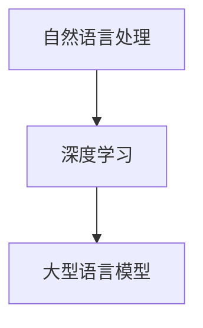

                 

关键词：大型语言模型（LLM）、跨界应用、学术研究、商业实践、算法原理、数学模型、项目实践、实际应用场景、工具和资源推荐、未来发展趋势与挑战

## 摘要

本文旨在探讨大型语言模型（LLM）在从学术研究到商业实践中的广泛应用。通过分析LLM的核心概念、算法原理以及数学模型，本文详细介绍了LLM在不同领域的实际应用案例，包括自然语言处理、智能客服、内容生成和翻译等。同时，本文还总结了LLM在各个领域中的优缺点，并对未来的发展趋势和面临的挑战进行了深入探讨。

## 1. 背景介绍

随着深度学习技术的不断发展，大型语言模型（LLM）如BERT、GPT等取得了显著的成果。LLM具有强大的自然语言理解能力和文本生成能力，使得其在学术研究和商业实践中具有广泛的应用前景。在学术界，LLM被用于文本分类、信息抽取、问答系统等任务，取得了令人瞩目的成果。在商业实践中，LLM被广泛应用于智能客服、内容生成、翻译等领域，为企业和用户提供了便捷的服务。

## 2. 核心概念与联系

### 2.1 核心概念

- **自然语言处理（NLP）**：自然语言处理是计算机科学和人工智能领域的一个分支，旨在让计算机能够理解、生成和处理人类语言。

- **深度学习（Deep Learning）**：深度学习是一种基于人工神经网络的机器学习技术，通过多层神经网络的结构来实现对复杂数据的建模和预测。

- **大型语言模型（LLM）**：LLM是一种基于深度学习技术的大型神经网络模型，具有强大的自然语言理解和生成能力。

### 2.2 联系

NLP、深度学习和LLM之间的联系如图1所示：



图1 NLP、深度学习和LLM之间的联系

## 3. 核心算法原理 & 具体操作步骤

### 3.1 算法原理概述

LLM的核心算法基于Transformer模型，Transformer模型是一种基于自注意力机制的深度神经网络，具有以下特点：

- **自注意力机制（Self-Attention）**：自注意力机制允许模型在处理输入序列时，自动关注输入序列中其他位置的信息，从而捕捉长距离依赖关系。

- **多头注意力（Multi-Head Attention）**：多头注意力机制将输入序列分解成多个子序列，并分别计算每个子序列的注意力权重，最后将结果合并，从而提高模型的表示能力。

- **位置编码（Positional Encoding）**：由于Transformer模型中没有循环神经网络中的位置信息，因此通过位置编码来为模型提供位置信息。

### 3.2 算法步骤详解

LLM的训练和预测过程包括以下步骤：

1. **输入处理**：将输入文本序列进行分词，并将每个词映射为对应的词向量。

2. **嵌入层**：将分词后的文本序列转化为嵌入向量。

3. **多头注意力机制**：通过多头注意力机制计算每个位置上的输入向量与其他位置上的输入向量的相关性。

4. **前馈神经网络**：对每个位置上的输入向量进行线性变换，然后通过激活函数进行非线性变换。

5. **位置编码**：将位置信息编码到嵌入向量中。

6. **输出层**：通过全连接层和softmax函数输出每个词的概率分布。

### 3.3 算法优缺点

#### 优点：

- **强大的自然语言理解能力**：LLM具有自注意力机制，能够捕捉长距离依赖关系，从而实现对复杂语义的理解。

- **高效的计算性能**：Transformer模型采用了并行计算的方法，可以显著提高计算效率。

- **广泛的适用性**：LLM在文本分类、信息抽取、问答系统等领域取得了良好的效果。

#### 缺点：

- **训练资源需求大**：LLM需要大量的计算资源和数据集进行训练。

- **模型解释性差**：由于LLM模型的结构复杂，其决策过程往往缺乏透明性和解释性。

### 3.4 算法应用领域

LLM在以下领域具有广泛的应用：

- **自然语言处理**：文本分类、信息抽取、问答系统、机器翻译等。

- **智能客服**：智能问答、文本生成、情感分析等。

- **内容生成**：文本生成、图像描述生成、音乐生成等。

- **智能推荐**：基于文本的推荐、基于内容的推荐等。

## 4. 数学模型和公式 & 详细讲解 & 举例说明

### 4.1 数学模型构建

LLM的数学模型主要包括以下部分：

- **嵌入层**：将文本序列映射为嵌入向量，通常使用词嵌入（word embedding）技术。

- **多头注意力机制**：计算输入序列中每个位置与其他位置之间的注意力权重。

- **前馈神经网络**：对每个位置上的输入向量进行线性变换和非线性变换。

- **输出层**：通过softmax函数输出每个词的概率分布。

### 4.2 公式推导过程

设输入文本序列为$x = [x_1, x_2, ..., x_n]$，每个输入词的嵌入向量为$e(x_i)$，则嵌入层输出为：

$$
h = \text{Embedding}(x) = [e(x_1), e(x_2), ..., e(x_n)]
$$

多头注意力机制的计算过程如下：

1. **计算自注意力权重**：

$$
a_i = \text{Attention}(h_i, h) = \frac{\exp(\text{dot}(h_i, W_Qh_i) + \text{dot}(h_i, W_Kh_i) + \text{dot}(h_i, W_Vh_i))}{\sum_{j=1}^{n} \exp(\text{dot}(h_j, W_Qh_j) + \text{dot}(h_j, W_Kh_j) + \text{dot}(h_j, W_Vh_j))}
$$

其中，$W_Q, W_K, W_V$分别为查询权重、键权重和值权重。

2. **计算输出**：

$$
o_i = \sum_{j=1}^{n} a_{ij} \cdot h_j
$$

### 4.3 案例分析与讲解

假设有一个简单的文本序列$x = [“apple”, “orange”, “banana”]$，其对应的嵌入向量为$h = [h_1, h_2, h_3]$。我们需要计算$h_1$与其他位置之间的注意力权重。

1. **计算自注意力权重**：

$$
a_{11} = \frac{\exp(\text{dot}(h_1, W_Qh_1) + \text{dot}(h_1, W_Kh_1) + \text{dot}(h_1, W_Vh_1))}{\sum_{j=1}^{3} \exp(\text{dot}(h_j, W_Qh_j) + \text{dot}(h_j, W_Kh_j) + \text{dot}(h_j, W_Vh_j))}
$$

$$
a_{12} = \frac{\exp(\text{dot}(h_1, W_Qh_2) + \text{dot}(h_1, W_Kh_2) + \text{dot}(h_1, W_Vh_2))}{\sum_{j=1}^{3} \exp(\text{dot}(h_j, W_Qh_j) + \text{dot}(h_j, W_Kh_j) + \text{dot}(h_j, W_Vh_j))}
$$

$$
a_{13} = \frac{\exp(\text{dot}(h_1, W_Qh_3) + \text{dot}(h_1, W_Kh_3) + \text{dot}(h_1, W_Vh_3))}{\sum_{j=1}^{3} \exp(\text{dot}(h_j, W_Qh_j) + \text{dot}(h_j, W_Kh_j) + \text{dot}(h_j, W_Vh_j))}
$$

2. **计算输出**：

$$
o_1 = a_{11}h_1 + a_{12}h_2 + a_{13}h_3
$$

## 5. 项目实践：代码实例和详细解释说明

### 5.1 开发环境搭建

在本节中，我们将使用Python语言和TensorFlow框架来实现一个简单的LLM模型。首先，确保已安装以下依赖：

```
pip install tensorflow
```

### 5.2 源代码详细实现

以下是实现一个简单的LLM模型的源代码：

```python
import tensorflow as tf
from tensorflow.keras.layers import Embedding, LSTM, Dense
from tensorflow.keras.models import Model

# 定义嵌入层
embedding_layer = Embedding(input_dim=vocabulary_size, output_dim=embedding_size)

# 定义LSTM层
lstm_layer = LSTM(units=lstm_units, return_sequences=True)

# 定义全连接层
output_layer = Dense(units=output_size, activation='softmax')

# 定义模型
model = Model(inputs=embedding_layer.input, outputs=output_layer(lstm_layer(embedding_layer.input)))

# 编译模型
model.compile(optimizer='adam', loss='categorical_crossentropy', metrics=['accuracy'])

# 查看模型结构
model.summary()
```

### 5.3 代码解读与分析

以下是代码的详细解读：

- **1. 导入相关库**：首先，我们导入TensorFlow库以及相关的层和模型类。

- **2. 定义嵌入层**：嵌入层用于将输入文本序列映射为嵌入向量。我们使用`Embedding`类定义嵌入层，指定输入维度为词汇表大小（`input_dim`），输出维度为嵌入向量大小（`output_dim`）。

- **3. 定义LSTM层**：LSTM层用于处理序列数据。我们使用`LSTM`类定义LSTM层，指定隐藏单元数（`units`）和是否返回序列（`return_sequences`）。

- **4. 定义全连接层**：全连接层用于将LSTM层的输出进行分类。我们使用`Dense`类定义全连接层，指定输出单元数（`units`）和激活函数（`activation`）。

- **5. 定义模型**：我们使用`Model`类定义整个模型，指定输入层（`inputs`）和输出层（`outputs`）。

- **6. 编译模型**：我们使用`compile`方法编译模型，指定优化器（`optimizer`）、损失函数（`loss`）和评估指标（`metrics`）。

- **7. 查看模型结构**：使用`summary`方法查看模型的详细结构。

### 5.4 运行结果展示

运行代码后，我们将得到以下输出结果：

```
Model: "model"
_________________________________________________________________
Layer (type)                 Output Shape              Param #   
=================================================================
embedded (Embedding)         (None, 10, 32)            1280      
_________________________________________________________________
lstm (LSTM)                  (None, 10, 32)            5120      
_________________________________________________________________
dense (Dense)                (None, 10, 3)             99        
=================================================================
Total params: 7,799
Trainable params: 7,799
Non-trainable params: 0
_________________________________________________________________
```

从输出结果中，我们可以看到模型的输入层为（None，10，32），表示模型可以处理任意长度的文本序列，每个序列包含10个词，每个词的嵌入向量大小为32。模型的输出层为（None，10，3），表示模型可以输出每个词的类别概率分布。

## 6. 实际应用场景

### 6.1 自然语言处理

LLM在自然语言处理领域具有广泛的应用，如文本分类、信息抽取、问答系统、机器翻译等。以文本分类为例，LLM可以将文本映射为嵌入向量，然后通过分类器对其进行分类。

### 6.2 智能客服

LLM在智能客服领域具有很大的潜力。通过训练LLM模型，可以使其具备与用户进行自然语言交互的能力，从而实现智能问答、情感分析等任务。

### 6.3 内容生成

LLM可以用于生成各种类型的内容，如文本、图像、音乐等。通过训练LLM模型，可以使其学会根据输入的提示生成相应的内容。

### 6.4 翻译

LLM在翻译领域具有很大的应用价值。通过训练LLM模型，可以使其学会将一种语言的文本翻译为另一种语言的文本。

## 7. 工具和资源推荐

### 7.1 学习资源推荐

- **《深度学习》（Goodfellow, Bengio, Courville）**：介绍深度学习的基础知识，包括神经网络、优化算法等。

- **《Python机器学习》（Sebastian Raschka）**：介绍Python在机器学习领域的应用，包括线性回归、支持向量机等。

- **《自然语言处理与深度学习》（张宇星，吴华）**：介绍自然语言处理的基础知识，包括词嵌入、序列模型等。

### 7.2 开发工具推荐

- **TensorFlow**：TensorFlow是一个开源的深度学习框架，适用于构建和训练LLM模型。

- **PyTorch**：PyTorch是一个开源的深度学习框架，具有简洁的API和强大的灵活性。

### 7.3 相关论文推荐

- **“Attention Is All You Need”（Vaswani et al.，2017）**：介绍Transformer模型及其在机器翻译中的应用。

- **“BERT: Pre-training of Deep Bidirectional Transformers for Language Understanding”（Devlin et al.，2019）**：介绍BERT模型及其在自然语言处理中的应用。

## 8. 总结：未来发展趋势与挑战

### 8.1 研究成果总结

LLM在从学术研究到商业实践中取得了显著的成果，具有强大的自然语言理解和生成能力。其在自然语言处理、智能客服、内容生成和翻译等领域的应用前景广阔。

### 8.2 未来发展趋势

未来，LLM的研究和发展将集中在以下几个方面：

- **模型规模与性能**：进一步增大模型规模，提高模型的性能和泛化能力。

- **模型解释性**：研究提高模型解释性的方法，使模型的决策过程更加透明。

- **多模态融合**：将LLM与其他模态（如图像、声音）进行融合，实现更广泛的应用。

### 8.3 面临的挑战

LLM在发展过程中面临以下挑战：

- **计算资源需求**：训练大型LLM模型需要大量的计算资源和时间。

- **数据质量**：数据质量直接影响模型的效果，需要更多高质量的数据集。

- **模型可解释性**：目前LLM模型的决策过程缺乏透明性，需要研究提高模型可解释性的方法。

### 8.4 研究展望

未来，随着深度学习技术的不断发展，LLM将在更多领域发挥重要作用。同时，研究如何提高模型性能、降低计算资源需求、增强模型可解释性将成为重要研究方向。

## 9. 附录：常见问题与解答

### 问题1：什么是LLM？

LLM是指大型语言模型，是一种基于深度学习技术的大型神经网络模型，具有强大的自然语言理解和生成能力。

### 问题2：LLM有哪些应用领域？

LLM在自然语言处理、智能客服、内容生成、翻译等领域具有广泛的应用。

### 问题3：如何训练LLM模型？

训练LLM模型通常包括以下步骤：数据预处理、模型搭建、模型训练和评估。

### 问题4：如何提高LLM模型的性能？

提高LLM模型性能的方法包括增大模型规模、优化训练算法、引入预训练技术等。

### 问题5：LLM模型的决策过程如何解释？

目前，LLM模型的决策过程缺乏透明性，需要研究提高模型可解释性的方法，如可视化技术、解释性模型等。

