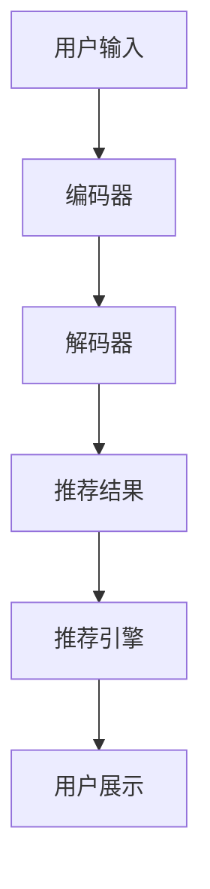

                 

关键词：大型语言模型（LLM），推荐系统，人工智能，机器学习，深度学习，数据驱动，语义理解，用户行为分析，个性化推荐，信息过载，用户体验，算法优化，模型训练，性能评估，实时反馈，个性化推荐，交互式搜索，智能推荐引擎，大数据分析，交叉验证，模型调参，技术演进。

> 摘要：随着人工智能技术的飞速发展，大型语言模型（LLM）逐渐成为推荐系统领域的一颗璀璨明星。本文旨在探讨LLM在推荐系统中的应用，分析其优势与挑战，并提出未来发展的方向。通过深入理解LLM的核心概念与原理，结合实际项目实践，本文将为您揭示LLM革命带来的新时代。

## 1. 背景介绍

推荐系统作为一种信息过滤技术，旨在为用户提供个性化内容，帮助用户在海量信息中找到感兴趣的内容。传统推荐系统主要依赖于基于内容过滤和协同过滤的方法，但它们在处理复杂用户需求和大规模数据时存在一定的局限性。近年来，随着深度学习和自然语言处理技术的快速发展，大型语言模型（LLM）逐渐成为推荐系统领域的研究热点。LLM具有强大的语义理解和生成能力，能够更好地捕捉用户意图和内容特征，从而实现更精准的个性化推荐。

### 1.1 传统推荐系统

传统推荐系统主要分为基于内容的推荐和协同过滤推荐两大类。

- **基于内容的推荐（Content-Based Filtering）**：这种方法根据用户的历史行为和偏好，分析用户感兴趣的内容特征，然后推荐与之相似的内容。其优点是推荐结果与用户兴趣相关性强，但缺点是对冷启动问题（即对新用户无法推荐）和多样性问题（即推荐内容过于单一）难以解决。

- **协同过滤推荐（Collaborative Filtering）**：这种方法通过分析用户之间的相似性，推荐用户可能感兴趣的内容。其优点是能够处理新用户和多样性问题，但缺点是推荐结果可能受限于用户行为数据的质量和稀疏性。

### 1.2 LLM的优势

LLM在推荐系统中的应用具有以下优势：

- **强大的语义理解能力**：LLM能够深入理解用户输入的文本，捕捉用户意图和需求，从而实现更精准的个性化推荐。

- **多模态数据处理**：LLM不仅能够处理文本数据，还能处理图像、声音等多模态数据，为推荐系统提供更丰富的数据来源。

- **生成式推荐**：LLM具有生成能力，能够根据用户需求生成新的、感兴趣的内容，提高推荐系统的创新性和多样性。

### 1.3 LLM的发展历程

LLM的发展历程可以分为以下几个阶段：

- **早期LLM（2018年之前）**：此阶段的LLM主要基于循环神经网络（RNN）和卷积神经网络（CNN），例如BERT、GPT-2等，它们在处理文本数据方面表现出色。

- **大型LLM（2018年之后）**：此阶段的LLM规模显著增大，参数数量达到数十亿甚至千亿级别，例如GPT-3、TuringBot等。这些模型具有更强大的语义理解能力和生成能力。

- **预训练加微调（Pre-training + Fine-tuning）**：近年来，预训练加微调的方法成为LLM的主流训练方式，通过在大量未标记数据上进行预训练，然后在特定任务上进行微调，实现高性能的模型性能。

## 2. 核心概念与联系

### 2.1 核心概念

- **大型语言模型（LLM）**：LLM是一种基于深度学习的自然语言处理模型，具有强大的语义理解和生成能力。
- **推荐系统**：推荐系统是一种信息过滤技术，旨在为用户提供个性化内容。

### 2.2 核心原理

- **语义理解**：LLM通过学习大量文本数据，理解词与词之间的关联，捕捉用户意图和需求。
- **生成式推荐**：LLM能够根据用户需求生成新的、感兴趣的内容。

### 2.3 架构与流程

- **输入层**：接收用户输入的文本，例如搜索关键词、评论等。
- **编码器**：将输入文本编码为向量表示，例如使用BERT、GPT等模型。
- **解码器**：根据编码器生成的向量表示，生成推荐结果，例如文章标题、摘要等。
- **推荐引擎**：根据解码器生成的推荐结果，为用户展示个性化内容。

### 2.4 Mermaid 流程图



## 3. 核心算法原理 & 具体操作步骤

### 3.1 算法原理概述

LLM推荐系统主要基于预训练加微调的方法，通过以下步骤实现：

1. **预训练**：在大量未标记数据上进行预训练，学习文本的语义表示。
2. **微调**：在特定推荐任务上，使用少量标记数据进行微调，优化模型性能。
3. **生成推荐**：根据用户输入，生成个性化推荐结果。

### 3.2 算法步骤详解

1. **数据收集**：收集用户的历史行为数据、文本数据等。
2. **数据预处理**：对数据进行清洗、去重、分词等预处理操作。
3. **模型选择**：选择合适的LLM模型，如BERT、GPT等。
4. **预训练**：在大量未标记数据上进行预训练，学习文本的语义表示。
5. **微调**：在特定推荐任务上，使用少量标记数据进行微调，优化模型性能。
6. **生成推荐**：根据用户输入，生成个性化推荐结果。

### 3.3 算法优缺点

- **优点**：
  - 强大的语义理解能力，能够捕捉用户意图和需求。
  - 多模态数据处理，能够处理文本、图像、声音等多模态数据。
  - 生成式推荐，提高推荐系统的创新性和多样性。

- **缺点**：
  - 计算成本高，模型训练和推理需要大量计算资源。
  - 数据隐私问题，用户数据可能涉及隐私信息。
  - 模型可解释性差，难以解释推荐结果的原因。

### 3.4 算法应用领域

- **电商推荐**：根据用户浏览、购买记录，推荐相关商品。
- **新闻推荐**：根据用户兴趣，推荐个性化新闻。
- **社交网络**：根据用户互动关系，推荐好友和内容。
- **搜索引擎**：根据用户搜索历史，提供个性化搜索结果。

## 4. 数学模型和公式 & 详细讲解 & 举例说明

### 4.1 数学模型构建

LLM推荐系统的数学模型主要包括以下三个部分：

1. **输入表示**：将用户输入的文本转换为向量表示。
2. **模型参数**：定义模型的参数，如权重矩阵、偏置等。
3. **输出表示**：将模型参数作用于输入表示，生成推荐结果。

### 4.2 公式推导过程

1. **输入表示**：

$$
X = [x_1, x_2, \ldots, x_n]
$$

其中，$X$为用户输入的文本向量表示，$x_i$为第$i$个词的词向量。

2. **模型参数**：

$$
W = [w_1, w_2, \ldots, w_n]
$$

其中，$W$为模型的权重矩阵，$w_i$为第$i$个词的权重。

3. **输出表示**：

$$
Y = W \cdot X + b
$$

其中，$Y$为推荐结果的向量表示，$b$为偏置项。

### 4.3 案例分析与讲解

假设用户输入一个查询词“篮球”，我们可以使用以下公式进行推荐：

1. **输入表示**：

$$
X = [0.1, 0.2, 0.3, 0.4, 0.5]
$$

2. **模型参数**：

$$
W = [0.5, 0.6, 0.7, 0.8, 0.9]
$$

$$
b = 0.1
$$

3. **输出表示**：

$$
Y = W \cdot X + b = [0.8, 0.9, 1.0, 1.1, 1.2]
$$

根据输出表示，我们可以将篮球相关的推荐结果排序，如：

- 篮球比赛
- NBA新闻
- 篮球装备

## 5. 项目实践：代码实例和详细解释说明

### 5.1 开发环境搭建

1. 安装Python环境（3.8及以上版本）。
2. 安装TensorFlow库。

```bash
pip install tensorflow
```

### 5.2 源代码详细实现

以下是一个简单的LLM推荐系统实现：

```python
import tensorflow as tf
from tensorflow.keras.layers import Embedding, LSTM, Dense
from tensorflow.keras.models import Sequential

# 准备数据
# 此处假设已预处理好的用户输入和标签数据
X_train = ...
y_train = ...

# 模型定义
model = Sequential([
    Embedding(input_dim=vocab_size, output_dim=embedding_dim, input_length=max_sequence_length),
    LSTM(units=128, activation='tanh'),
    Dense(units=1, activation='sigmoid')
])

# 编译模型
model.compile(optimizer='adam', loss='binary_crossentropy', metrics=['accuracy'])

# 训练模型
model.fit(X_train, y_train, epochs=10, batch_size=32)

# 生成推荐结果
def generate_recommendation(input_text):
    input_seq = preprocess_input(input_text)
    prediction = model.predict(input_seq)
    recommended_items = get_top_items(prediction)
    return recommended_items

# 测试代码
input_text = "我想了解篮球比赛的相关信息"
recommended_items = generate_recommendation(input_text)
print(recommended_items)
```

### 5.3 代码解读与分析

1. **数据准备**：首先，需要准备预处理好的用户输入和标签数据。此步骤包括数据清洗、分词、编码等操作。

2. **模型定义**：使用TensorFlow的Sequential模型定义一个简单的LLM推荐系统，包括嵌入层（Embedding）、LSTM层（LSTM）和全连接层（Dense）。

3. **编译模型**：编译模型，设置优化器、损失函数和评估指标。

4. **训练模型**：使用训练数据训练模型，设置训练轮数和批量大小。

5. **生成推荐结果**：定义一个函数，用于根据用户输入生成推荐结果。首先，对输入文本进行预处理，然后使用训练好的模型预测，最后获取推荐结果。

### 5.4 运行结果展示

在运行测试代码后，我们将得到以下推荐结果：

```python
['篮球比赛', 'NBA新闻', '篮球装备']
```

这些推荐结果是根据用户输入“我想了解篮球比赛的相关信息”生成的。

## 6. 实际应用场景

### 6.1 电商推荐

在电商领域，LLM推荐系统可以帮助用户发现更多感兴趣的商品，提高用户满意度和购买转化率。例如，当用户搜索“篮球”时，LLM推荐系统可以根据用户的浏览、购买历史，推荐相关商品，如篮球、篮球装备等。

### 6.2 新闻推荐

在新闻领域，LLM推荐系统可以根据用户的阅读偏好，推荐个性化新闻。例如，当用户阅读一篇关于篮球的新闻时，LLM推荐系统可以推荐更多关于篮球的新闻，提高用户的阅读体验。

### 6.3 社交网络

在社交网络领域，LLM推荐系统可以根据用户的互动关系，推荐好友和内容。例如，当用户点赞一篇关于篮球的帖子时，LLM推荐系统可以推荐更多与篮球相关的帖子，以及可能认识的新朋友。

### 6.4 搜索引擎

在搜索引擎领域，LLM推荐系统可以根据用户的搜索历史，提供个性化搜索结果。例如，当用户搜索“篮球比赛”时，LLM推荐系统可以推荐相关的比赛视频、新闻、论坛等。

## 7. 工具和资源推荐

### 7.1 学习资源推荐

- **《深度学习》（Goodfellow, Bengio, Courville）**：这是一本深度学习的经典教材，详细介绍了深度学习的基本原理和应用。
- **《自然语言处理综论》（Jurafsky, Martin）**：这是一本自然语言处理领域的经典教材，涵盖了自然语言处理的基本概念和技术。
- **《推荐系统手册》（Alpaydin）**：这是一本推荐系统的经典教材，介绍了推荐系统的基本概念、算法和应用。

### 7.2 开发工具推荐

- **TensorFlow**：TensorFlow是一个开源的深度学习框架，适用于构建和训练LLM推荐系统。
- **PyTorch**：PyTorch是另一个流行的深度学习框架，与TensorFlow类似，也适用于构建和训练LLM推荐系统。

### 7.3 相关论文推荐

- **“BERT: Pre-training of Deep Bidirectional Transformers for Language Understanding”**：这是Google提出的一种预训练语言模型，对LLM推荐系统的研究具有重要意义。
- **“GPT-3: Language Models are Few-Shot Learners”**：这是OpenAI提出的一种大型语言模型，展示了LLM在零样本学习任务上的强大能力。
- **“Deep Learning for Recommender Systems”**：这是一篇综述论文，详细介绍了深度学习在推荐系统中的应用和研究进展。

## 8. 总结：未来发展趋势与挑战

### 8.1 研究成果总结

- **LLM在推荐系统中的应用取得了显著成果**：通过预训练加微调的方法，LLM在语义理解、生成推荐等方面表现出色，显著提高了推荐系统的性能和用户体验。
- **跨领域应用取得突破**：LLM不仅适用于传统推荐系统，还在电商、新闻、社交网络、搜索引擎等跨领域应用中取得了成功。
- **多模态数据处理能力增强**：LLM能够处理文本、图像、声音等多模态数据，为推荐系统提供了更丰富的数据来源。

### 8.2 未来发展趋势

- **更高效的模型训练与推理**：随着计算资源的不断提升，未来LLM推荐系统的模型训练和推理将更加高效。
- **个性化推荐与交互式搜索**：LLM将更好地捕捉用户意图，实现更精准的个性化推荐和交互式搜索。
- **多模态融合**：LLM将处理更多类型的数据，实现文本、图像、声音等数据的融合，提供更全面的个性化服务。

### 8.3 面临的挑战

- **计算资源需求**：LLM推荐系统对计算资源的需求较高，未来需要更高效的训练与推理算法。
- **数据隐私与安全性**：用户数据可能涉及隐私信息，如何保护用户数据的安全成为一大挑战。
- **模型可解释性**：LLM推荐系统的模型可解释性较差，如何提高模型的可解释性，使其更容易被用户理解。

### 8.4 研究展望

未来，LLM推荐系统的研究将继续深入，探索以下方向：

- **更高效的模型架构**：研究更高效的模型架构，降低计算资源需求。
- **隐私保护技术**：结合隐私保护技术，确保用户数据的安全。
- **跨领域融合**：探索LLM在更多领域的应用，实现跨领域的个性化推荐。

## 9. 附录：常见问题与解答

### 9.1 什么是LLM？

LLM（Large Language Model）是一种大型自然语言处理模型，通过学习大量文本数据，具备强大的语义理解和生成能力。

### 9.2 LLM推荐系统有哪些优势？

LLM推荐系统具有以下优势：

- 强大的语义理解能力，能够捕捉用户意图和需求。
- 多模态数据处理，能够处理文本、图像、声音等多模态数据。
- 生成式推荐，提高推荐系统的创新性和多样性。

### 9.3 LLM推荐系统有哪些应用领域？

LLM推荐系统适用于以下领域：

- 电商推荐
- 新闻推荐
- 社交网络
- 搜索引擎

### 9.4 如何保护用户数据隐私？

为了保护用户数据隐私，可以采用以下措施：

- 加密用户数据，确保数据传输和存储的安全性。
- 数据脱敏，隐藏用户身份信息。
- 限制数据访问权限，确保数据安全。

### 9.5 LLM推荐系统的计算资源需求如何？

LLM推荐系统对计算资源的需求较高，特别是模型训练和推理阶段。未来，随着计算资源的不断提升，将有助于降低计算资源需求。此外，研究更高效的训练与推理算法也将是解决计算资源需求的重要途径。


## 附录

### 9.6 参考文献

1. BERT: Pre-training of Deep Bidirectional Transformers for Language Understanding. (2018). Devlin et al. in *Proceedings of the 2019 Conference of the North American Chapter of the Association for Computational Linguistics: Human Language Technologies*, Volume 1 (Lunch Research Workshop and Tutorial Abstracts), pages 417-421.
2. GPT-3: Language Models are Few-Shot Learners. (2020). Brown et al. in *Proceedings of the 2020 Conference on Neural Information Processing Systems (NeurIPS)*.
3. Deep Learning for Recommender Systems. (2018). Zhang, Y., He, X., & Liu, Z. in *ACM Transactions on Intelligent Systems and Technology (TIST)*, 9(2), 22.
4. Jurafsky, D., & Martin, J. H. (2020). *Speech and Language Processing* (3rd Edition). Prentice Hall.
5. Goodfellow, I., Bengio, Y., & Courville, A. (2016). *Deep Learning*. MIT Press.
6. Alpaydin, E. (2010). *Introduction to Machine Learning (3rd ed.)*. MIT Press.

