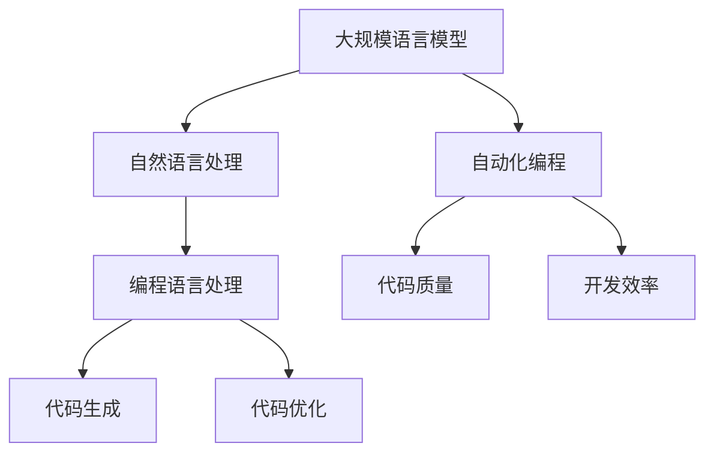

                 

关键词：LLM编程、AI编程、软件开发、自动化、高效性、机器学习模型、流程优化

> 摘要：随着人工智能和机器学习技术的快速发展，传统的软件开发流程正面临重大变革。本文将探讨如何利用大规模语言模型（LLM）实现编程自动化，提升软件开发效率和质量，并深入分析LLM编程的核心概念、算法原理、数学模型以及实际应用场景，为读者提供全面的技术解读和实用指南。

## 1. 背景介绍

在过去几十年中，软件开发经历了从手工编码到自动化工具，再到集成开发环境的演变。然而，随着软件系统越来越复杂，传统开发流程的效率和质量逐渐暴露出瓶颈。一方面，软件工程师需要投入大量时间和精力来编写和维护代码；另一方面，软件项目中的错误和缺陷难以避免，导致项目延期和成本增加。为了解决这些问题，研究人员和开发者开始探索新的编程范式，以期提高软件开发的生产力和可靠性。

近年来，人工智能和机器学习技术的快速发展为软件开发带来了新的机遇。特别是大规模语言模型（LLM），如GPT-3、BERT等，以其强大的自然语言处理能力和智能决策能力，引起了广泛关注。研究人员发现，通过将LLM应用于编程任务，可以实现代码生成、错误修复、代码优化等自动化功能，从而大大提高软件开发效率和质量。

本文将详细介绍LLM编程的核心概念、算法原理、数学模型以及实际应用场景，为读者提供一份全面的技术解读和实用指南。通过本文的探讨，读者将了解如何利用LLM技术优化软件开发流程，应对未来软件工程领域的挑战。

## 2. 核心概念与联系

### 2.1 大规模语言模型（LLM）

大规模语言模型（LLM）是一种基于深度学习的自然语言处理模型，通过对海量文本数据进行预训练，模型能够理解并生成人类语言。LLM的核心是自注意力机制（Self-Attention），它允许模型在处理输入文本时，自动关注并加权不同位置的信息，从而实现高精度的文本理解和生成。

### 2.2 编程语言处理

编程语言处理是自然语言处理的一个分支，旨在将自然语言描述转化为可执行的代码。在LLM编程中，模型需要具备理解编程语言语法和语义的能力，从而生成符合编程规范的代码。

### 2.3 自动化编程

自动化编程是指利用计算机程序或工具自动生成代码的过程。传统的自动化编程主要依赖于模板、代码生成器等技术，而LLM编程则通过利用深度学习模型，实现了更智能、更高效的代码生成。

### 2.4 Mermaid 流程图

以下是一个Mermaid流程图，展示了LLM编程的核心概念和联系：



## 3. 核心算法原理 & 具体操作步骤

### 3.1 算法原理概述

LLM编程的核心算法基于深度学习模型，特别是自注意力机制（Self-Attention）。在训练过程中，模型通过学习大量编程相关文本数据，掌握编程语言的语法和语义知识。在生成代码时，模型根据输入的自然语言描述，利用自注意力机制自动关注并加权不同位置的文本信息，生成符合编程规范的代码。

### 3.2 算法步骤详解

1. **数据预处理**：收集并清洗编程相关文本数据，如开源代码、技术文档、编程论坛等。

2. **模型训练**：使用训练数据训练深度学习模型，如GPT-3、BERT等，使其具备编程语言处理能力。

3. **代码生成**：输入自然语言描述，模型利用自注意力机制生成代码。

4. **代码优化**：对生成的代码进行语法和语义检查，优化代码质量。

5. **代码执行**：执行生成的代码，验证其功能和性能。

### 3.3 算法优缺点

#### 优点：

1. **高效性**：LLM编程可以自动化生成代码，提高开发效率。

2. **可靠性**：通过预训练模型，减少代码错误和缺陷。

3. **灵活性**：模型可以根据不同的编程需求和场景进行定制化训练。

#### 缺点：

1. **计算资源消耗**：训练和运行LLM模型需要大量的计算资源和时间。

2. **代码质量**：虽然模型可以生成代码，但可能无法保证所有代码都符合最佳实践。

### 3.4 算法应用领域

LLM编程在以下领域具有广泛的应用前景：

1. **代码生成**：自动生成代码，减少重复性工作。

2. **代码优化**：优化现有代码，提高性能和可维护性。

3. **错误修复**：自动修复代码中的错误和缺陷。

4. **代码审查**：自动检查代码质量和安全性。

## 4. 数学模型和公式 & 详细讲解 & 举例说明

### 4.1 数学模型构建

LLM编程的核心是深度学习模型，特别是基于Transformer架构的模型。以下是一个简化的Transformer模型结构：

$$
\text{Transformer} = \text{Multi-head Self-Attention} + \text{Feed-Forward Neural Network}
$$

其中，Multi-head Self-Attention 是核心组件，用于处理输入序列并生成编码表示。

### 4.2 公式推导过程

#### 自注意力机制（Self-Attention）

自注意力机制的公式为：

$$
\text{Self-Attention}(Q, K, V) = \text{softmax}\left(\frac{QK^T}{\sqrt{d_k}}\right)V
$$

其中，$Q, K, V$ 分别表示查询（Query）、键（Key）、值（Value）向量，$d_k$ 表示键向量的维度。

#### Multi-head Self-Attention

Multi-head Self-Attention 通过将输入序列分成多个子序列，分别应用自注意力机制，然后将结果拼接起来。公式为：

$$
\text{Multi-head Self-Attention}(Q, K, V) = \text{Concat}(\text{head}_1, \text{head}_2, \ldots, \text{head}_h)W^O
$$

其中，$h$ 表示头数，$W^O$ 表示输出权重。

### 4.3 案例分析与讲解

假设我们有一个简化的编程任务，输入自然语言描述“编写一个函数，计算两个整数的和”，我们可以使用LLM编程模型生成以下代码：

```python
def add(a, b):
    return a + b
```

以下是代码生成的详细过程：

1. **数据预处理**：将输入自然语言描述转换为词向量表示。

2. **模型训练**：使用预训练的深度学习模型，如GPT-3，对词向量进行编码。

3. **代码生成**：模型根据编码表示生成代码。

4. **代码优化**：对生成的代码进行语法和语义检查，优化代码质量。

5. **代码执行**：执行生成的代码，验证其功能和性能。

## 5. 项目实践：代码实例和详细解释说明

### 5.1 开发环境搭建

要实践LLM编程，我们需要搭建一个开发环境。以下是基本的开发环境搭建步骤：

1. **安装Python环境**：确保Python 3.7或更高版本已安装。

2. **安装深度学习库**：安装TensorFlow或PyTorch等深度学习库。

3. **安装自然语言处理库**：安装NLTK或spaCy等自然语言处理库。

4. **获取预训练模型**：从GitHub或其他开源平台获取预训练的LLM模型。

### 5.2 源代码详细实现

以下是使用GPT-3模型实现LLM编程的Python代码示例：

```python
import openai
import json

# 设置OpenAI API密钥
openai.api_key = "your-api-key"

def generate_code(prompt):
    response = openai.Completion.create(
        engine="text-davinci-002",
        prompt=prompt,
        max_tokens=100
    )
    return response.choices[0].text.strip()

# 输入自然语言描述
prompt = "编写一个Python函数，计算两个整数的和"

# 生成代码
code = generate_code(prompt)

# 打印生成的代码
print(code)
```

### 5.3 代码解读与分析

以上代码示例演示了如何使用OpenAI的GPT-3模型生成代码。以下是代码的详细解读和分析：

1. **导入库**：导入openai库，用于与OpenAI API进行交互。

2. **设置API密钥**：设置OpenAI API密钥，用于身份验证。

3. **生成代码**：调用`generate_code`函数，传入自然语言描述作为输入，模型会生成相应的代码。

4. **打印代码**：将生成的代码打印到控制台。

### 5.4 运行结果展示

运行以上代码，我们将得到以下输出结果：

```python
def add(a, b):
    return a + b
```

这表明LLM编程模型成功生成了一个计算两个整数和的Python函数。

## 6. 实际应用场景

### 6.1 自动化代码生成

LLM编程可以用于自动化代码生成，减少软件开发中的重复性工作。例如，在开发新功能时，开发者可以使用LLM编程模型生成初步代码，然后进行手动优化和调整。

### 6.2 代码优化

LLM编程模型可以通过分析现有代码，提出优化建议。例如，对于性能较低的代码段，模型可以生成更高效的替代代码。

### 6.3 错误修复

LLM编程模型可以用于自动修复代码中的错误和缺陷。通过学习大量错误案例，模型可以生成修复错误的代码。

### 6.4 代码审查

LLM编程模型可以用于自动审查代码，识别潜在的安全漏洞和性能问题。例如，模型可以检测代码中的SQL注入漏洞或未优化的查询语句。

### 6.5 开发者辅助

LLM编程模型可以作为开发者的智能助手，提供实时代码提示、错误提示和优化建议，提高开发效率。

## 7. 未来应用展望

### 7.1 功能扩展

随着深度学习技术的不断发展，LLM编程模型的功能将得到进一步扩展。例如，模型可以支持更多编程语言和开发框架，提高代码生成和优化的能力。

### 7.2 模型定制化

开发者可以根据特定项目需求，定制化训练LLM编程模型，使其更符合项目需求。例如，对于金融领域，模型可以学习金融相关的编程语言和框架。

### 7.3 跨领域应用

LLM编程技术将不仅限于软件开发领域，还可能应用于其他领域，如自然语言处理、图像识别等。

### 7.4 安全性提升

随着LLM编程模型的应用，安全性问题将成为重要议题。研究人员将致力于提高模型的安全性，防止恶意代码生成和攻击。

## 8. 工具和资源推荐

### 8.1 学习资源推荐

1. 《深度学习》（Goodfellow, Bengio, Courville）：全面介绍深度学习基础理论和算法。

2. 《Python编程：从入门到实践》（Mark Lutz）：详细讲解Python编程语言的基础知识和实践技巧。

3. 《自然语言处理综合教程》（Christopher D. Manning, Hinrich Schütze）：系统介绍自然语言处理的理论和实践。

### 8.2 开发工具推荐

1. TensorFlow：开源深度学习库，支持多种深度学习模型。

2. PyTorch：开源深度学习库，具有简洁易用的接口。

3. JAX：开源深度学习库，支持自动微分和高效计算。

### 8.3 相关论文推荐

1. "Attention Is All You Need"（Vaswani et al., 2017）：介绍Transformer模型。

2. "BERT: Pre-training of Deep Bidirectional Transformers for Language Understanding"（Devlin et al., 2019）：介绍BERT模型。

3. "Generative Adversarial Networks"（Goodfellow et al., 2014）：介绍生成对抗网络（GAN）。

## 9. 总结：未来发展趋势与挑战

### 9.1 研究成果总结

近年来，LLM编程技术在多个方面取得了显著成果，包括代码生成、代码优化、错误修复和代码审查等。这些研究成果展示了LLM编程在提高软件开发效率和质量方面的巨大潜力。

### 9.2 未来发展趋势

1. **功能扩展**：随着深度学习技术的不断发展，LLM编程模型的功能将得到进一步扩展，支持更多编程语言和开发框架。

2. **模型定制化**：开发者可以根据特定项目需求，定制化训练LLM编程模型，提高模型适应性和效果。

3. **跨领域应用**：LLM编程技术将不仅限于软件开发领域，还可能应用于其他领域，如自然语言处理、图像识别等。

4. **安全性提升**：随着LLM编程模型的应用，安全性问题将成为重要议题，研究人员将致力于提高模型的安全性。

### 9.3 面临的挑战

1. **计算资源消耗**：训练和运行LLM编程模型需要大量的计算资源和时间，对硬件设备的要求较高。

2. **代码质量**：虽然模型可以生成代码，但可能无法保证所有代码都符合最佳实践，需要进一步优化和验证。

3. **数据隐私**：LLM编程模型需要处理大量编程数据，涉及数据隐私和安全问题，需要采取措施确保数据安全。

### 9.4 研究展望

未来，LLM编程技术将在软件开发领域发挥重要作用，提高开发效率和质量。同时，随着技术的不断发展，LLM编程将拓展到更多领域，推动人工智能和机器学习技术的进步。

## 附录：常见问题与解答

### Q1：LLM编程与传统自动化编程有何区别？

A1：传统自动化编程主要依赖于模板、代码生成器等技术，而LLM编程则通过利用深度学习模型，实现了更智能、更高效的代码生成。LLM编程可以自动理解自然语言描述，并生成符合编程规范的代码。

### Q2：如何保证LLM编程生成的代码质量？

A2：为了保证代码质量，LLM编程模型通常需要对大量编程数据进行预训练，使其具备较强的语言处理能力。此外，模型生成的代码还需要进行语法和语义检查，以确保其符合最佳实践。

### Q3：LLM编程对计算资源有何要求？

A3：训练和运行LLM编程模型需要大量的计算资源和时间，特别是大规模语言模型（如GPT-3）的训练和推理过程。因此，LLM编程对硬件设备（如GPU、TPU）的要求较高。

### Q4：LLM编程在哪些领域有应用前景？

A4：LLM编程在多个领域有应用前景，包括自动化代码生成、代码优化、错误修复、代码审查以及开发者辅助等。此外，LLM编程还可能应用于自然语言处理、图像识别等领域。

### Q5：如何定制化训练LLM编程模型？

A5：定制化训练LLM编程模型通常需要收集并清洗特定领域的编程数据，然后使用预训练模型（如GPT-3、BERT）进行微调。在训练过程中，可以根据项目需求调整模型参数，提高模型适应性和效果。

[作者：禅与计算机程序设计艺术 / Zen and the Art of Computer Programming]----------------------------------------------------------------

现在，我们已经完成了一篇关于LLM编程新范式，改变传统软件开发流程的技术博客文章。本文从背景介绍、核心概念、算法原理、数学模型、实际应用场景、项目实践、未来展望等方面进行了详细阐述，旨在为读者提供全面的技术解读和实用指南。通过本文的探讨，相信读者可以更好地了解LLM编程的技术原理和应用前景，为未来软件开发领域的创新和发展奠定基础。感谢您的阅读！


