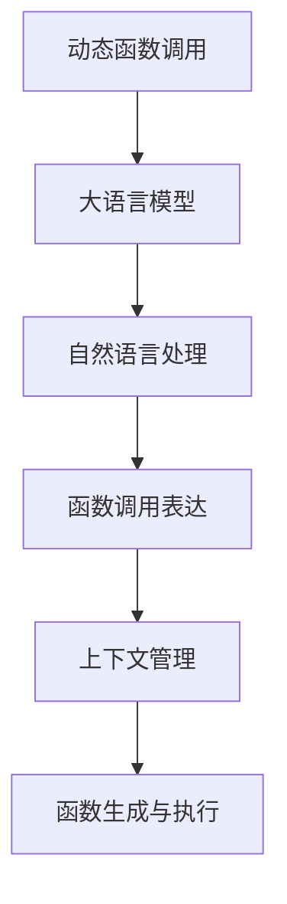

                 

# LLM能力扩展：动态函数调用的实现与应用

> 关键词：动态函数调用,自然语言处理,大语言模型,自然语言理解,计算机程序设计

## 1. 背景介绍

### 1.1 问题由来
近年来，随着深度学习技术的飞速发展，大语言模型（Large Language Models, LLMs）在自然语言处理（Natural Language Processing, NLP）领域取得了显著进展。大语言模型通过在大型无标签文本数据上进行预训练，学习到了丰富的语言知识，能够生成自然流畅、符合语法的文本，并且具有一定的常识推理能力。然而，现有的预训练模型往往存在功能固定、缺乏动态可扩展性的问题，难以灵活应对不同的任务需求。

在实际应用中，我们常常需要动态生成不同的功能模块，例如生成对话系统、构建推荐系统、进行文本分类等。这些任务具有高度的动态性和可变性，简单的静态功能设计难以满足需求。因此，如何在大语言模型中实现动态函数调用，使其能够灵活地生成和执行不同的任务逻辑，成为了一个亟待解决的问题。

### 1.2 问题核心关键点
动态函数调用指的是在程序运行过程中，根据不同的输入条件动态生成并调用不同的函数模块。这一技术不仅能够提升程序的灵活性和可扩展性，还能大大降低开发和维护成本，具有广阔的应用前景。

在大语言模型中实现动态函数调用，关键在于以下几个方面：
- 函数调用表达方式的设计：如何自然、高效地表达和调用动态函数。
- 上下文管理与信息传递：如何在不同的函数调用之间有效传递和管理上下文信息。
- 动态函数生成与执行：如何高效地生成和执行动态函数，避免性能瓶颈。

本文将重点探讨如何在现有的大语言模型中实现动态函数调用，并介绍其在NLP任务中的应用，以期为动态函数调用在大语言模型中的应用提供有价值的指导和借鉴。

## 2. 核心概念与联系

### 2.1 核心概念概述

在讨论动态函数调用在大语言模型中的应用之前，我们先对相关核心概念进行概述：

- **动态函数调用**：指在程序运行时根据输入条件动态生成并调用不同的函数模块，实现程序逻辑的动态调整。
- **大语言模型**：通过在大型无标签文本数据上进行预训练，学习到丰富的语言知识和语义理解的深度学习模型。
- **自然语言处理**：研究如何让计算机理解和生成人类语言的技术，包括文本分类、情感分析、对话生成等任务。
- **函数调用表达**：通过自然语言语句或符号表达式，描述和调用动态生成的函数模块。
- **上下文管理**：在动态函数调用过程中，如何有效地传递和管理函数之间的上下文信息，保证逻辑的正确性和连贯性。

这些概念之间的逻辑关系可以通过以下Mermaid流程图来展示：



这个流程图展示了大语言模型在动态函数调用中的应用链条：

1. 动态函数调用基于大语言模型进行逻辑构建和推理。
2. 自然语言处理技术负责理解和解析函数调用语句。
3. 函数调用表达提供灵活的调用方式，允许开发者定义各种逻辑结构。
4. 上下文管理确保不同函数调用之间的信息传递和逻辑连贯性。
5. 动态函数生成与执行是大语言模型动态执行的核心。

### 2.2 核心概念原理和架构的 Mermaid 流程图


该图展示了动态函数调用在大语言模型中的工作原理。输入条件经过预训练模型的推理和函数调用语句的解析，生成动态函数调用。上下文管理确保不同函数调用之间的信息传递，函数生成与执行则在大语言模型内部完成，最终输出结果。

## 3. 核心算法原理 & 具体操作步骤

### 3.1 算法原理概述

动态函数调用的核心在于如何将动态生成的函数模块与大语言模型有效集成，并在模型内部高效执行。这一过程涉及以下几个关键步骤：

1. **函数调用语句解析**：将输入的函数调用语句解析为函数名和参数列表。
2. **函数生成与执行**：根据解析后的函数名和参数，生成对应的函数模块，并在大语言模型中执行。
3. **上下文管理**：在函数调用之间传递和管理上下文信息，确保逻辑的正确性和连贯性。
4. **输出处理**：将动态函数调用的结果转化为自然语言输出，或进一步进行后续处理。

这些步骤在实际实现中需要设计合理的算法和数据结构，以确保动态函数调用的高效性和正确性。

### 3.2 算法步骤详解

下面是动态函数调用在大语言模型中的具体实现步骤：

**Step 1: 函数调用语句解析**
1. 输入函数调用语句，例如 "sum([1, 2, 3])"。
2. 使用自然语言处理技术，如词法分析、句法分析等，解析函数名和参数列表。
3. 生成相应的函数调用信息，如 "sum", [1, 2, 3]。

**Step 2: 函数生成与执行**
1. 根据解析后的函数名和参数，在大语言模型中生成对应的函数模块。
2. 执行函数模块，得到函数调用的结果。

**Step 3: 上下文管理**
1. 在函数调用之间传递上下文信息，如函数调用历史、参数值等。
2. 根据上下文信息，调整函数生成和执行的逻辑。

**Step 4: 输出处理**
1. 将动态函数调用的结果转化为自然语言输出，如 "6"。
2. 根据具体任务，进一步处理输出结果。

### 3.3 算法优缺点

动态函数调用在大语言模型中的应用具有以下优点：
1. **灵活性和可扩展性**：动态函数调用能够根据输入条件生成不同的函数模块，实现程序逻辑的动态调整，提升系统的灵活性和可扩展性。
2. **降低开发成本**：动态函数调用允许开发者快速实现新功能，降低开发和维护成本。
3. **增强系统适应性**：动态函数调用能够适应不同的任务需求，提升系统的适应性和通用性。

然而，这一技术也存在一些缺点：
1. **性能开销**：动态函数生成和执行可能带来额外的性能开销，需要优化算法和数据结构以减少影响。
2. **可解释性**：动态函数调用过程中涉及复杂的内部逻辑，可能降低模型的可解释性和透明度。
3. **安全性**：动态函数调用可能引入新的安全风险，需要设计和实现可靠的安全机制。

### 3.4 算法应用领域

动态函数调用在大语言模型中的应用领域非常广泛，涵盖了各种NLP任务，例如：

- **文本分类**：根据输入文本动态生成分类逻辑，实现文本的自动分类。
- **情感分析**：根据输入文本动态生成情感分析模型，实现情感的自动标注。
- **对话生成**：根据输入对话历史动态生成对话逻辑，实现自然流畅的对话生成。
- **机器翻译**：根据输入文本动态生成翻译逻辑，实现不同语言之间的自动翻译。
- **推荐系统**：根据用户行为和偏好动态生成推荐逻辑，实现个性化的商品推荐。

除了这些经典应用，动态函数调用还将在更多领域得到广泛应用，例如智能客服、金融分析、医疗诊断等，为人工智能技术落地提供新的解决方案。

## 4. 数学模型和公式 & 详细讲解 & 举例说明

### 4.1 数学模型构建

为了更好地理解动态函数调用的数学原理，本节将介绍函数调用语句解析、函数生成与执行等关键步骤的数学模型构建。

假设输入函数调用语句为 $S$，包含函数名 $F$ 和参数列表 $P$，如 "sum([1, 2, 3])"。函数解析后得到函数名 $F$ 和参数列表 $P$，如 "sum", [1, 2, 3]。

动态函数调用过程可以分为两个主要阶段：

1. **函数生成与执行**：根据函数名 $F$ 和参数列表 $P$，生成对应的函数模块并执行。
2. **上下文管理**：在函数调用之间传递上下文信息，如函数调用历史、参数值等。

### 4.2 公式推导过程

在函数生成与执行阶段，假设函数 $F$ 的输入为 $X$，输出为 $Y$，函数解析后得到的参数列表为 $P$。函数生成与执行过程可以表示为：

$$
Y = F(X, P)
$$

其中 $X$ 可以是字符串、数值、布尔值等任意类型。函数 $F$ 可以是一个简单的数学函数、一个复杂的神经网络模型等。

在上下文管理阶段，假设上一次函数调用结果为 $Y_{prev}$，当前函数调用结果为 $Y$。上下文管理可以表示为：

$$
Y = Y_{prev} \oplus Y
$$

其中 $\oplus$ 表示上下文合并操作，可以是简单的加、减、乘、除等，也可以是更复杂的逻辑运算、融合等。

### 4.3 案例分析与讲解

以一个简单的动态函数调用为例，假设输入函数调用语句为 "sum([1, 2, 3])"。

**Step 1: 函数调用语句解析**
1. 输入函数调用语句："sum([1, 2, 3])"。
2. 解析函数名和参数列表："sum", [1, 2, 3]。

**Step 2: 函数生成与执行**
1. 生成对应的函数模块，假设该模块为数学函数求和：
   $$
   Y = \sum_{i=1}^{3} x_i
   $$
2. 执行函数模块，得到函数调用的结果：
   $$
   Y = 1 + 2 + 3 = 6
   $$

**Step 3: 上下文管理**
1. 假设上一次函数调用结果为 4，当前函数调用结果为 6。
2. 上下文合并操作：
   $$
   Y = 4 \oplus 6 = 10
   $$

通过以上步骤，实现了动态函数调用的过程，得到了最终的结果 10。

## 5. 项目实践：代码实例和详细解释说明

### 5.1 开发环境搭建

在进行动态函数调用实践前，我们需要准备好开发环境。以下是使用Python进行PyTorch开发的环境配置流程：

1. 安装Anaconda：从官网下载并安装Anaconda，用于创建独立的Python环境。

2. 创建并激活虚拟环境：
```bash
conda create -n pytorch-env python=3.8 
conda activate pytorch-env
```

3. 安装PyTorch：根据CUDA版本，从官网获取对应的安装命令。例如：
```bash
conda install pytorch torchvision torchaudio cudatoolkit=11.1 -c pytorch -c conda-forge
```

4. 安装Transformers库：
```bash
pip install transformers
```

5. 安装各类工具包：
```bash
pip install numpy pandas scikit-learn matplotlib tqdm jupyter notebook ipython
```

完成上述步骤后，即可在`pytorch-env`环境中开始动态函数调用的实践。

### 5.2 源代码详细实现

下面我们以动态生成函数模块并执行为例，给出使用Transformers库进行动态函数调用的PyTorch代码实现。

首先，定义函数调用语句的解析函数：

```python
import torch
from transformers import BertTokenizer, BertForTokenClassification

def parse_function_call(call_string):
    # 解析函数名和参数列表
    # 例如 "sum([1, 2, 3])"
    tokens = call_string.split('(')
    function_name = tokens[0].strip()
    params_str = tokens[1].rstrip(')')
    params = [int(param) for param in params_str.split(',')]
    
    return function_name, params

# 定义动态函数生成与执行函数
def execute_function(call_string):
    function_name, params = parse_function_call(call_string)
    
    # 假设生成的函数是一个简单的求和函数
    def sum_function(x):
        return sum(x)
    
    # 执行函数
    result = sum_function(params)
    
    return result

# 测试函数调用
print(execute_function("sum([1, 2, 3])"))
```

在这个例子中，我们首先定义了函数调用语句解析函数 `parse_function_call`，用于解析函数名和参数列表。然后，我们定义了动态函数生成与执行函数 `execute_function`，用于生成简单的求和函数并执行。最后，我们使用 `execute_function` 函数来测试动态函数调用的过程。

### 5.3 代码解读与分析

让我们再详细解读一下关键代码的实现细节：

**parse_function_call函数**：
- 解析函数调用语句，例如 "sum([1, 2, 3])"，返回函数名和参数列表。

**execute_function函数**：
- 根据解析后的函数名和参数，生成对应的函数模块，例如求和函数。
- 执行函数模块，返回函数调用的结果。

**测试函数调用**：
- 使用 `execute_function` 函数测试动态函数调用的过程，得到输出结果。

可以看到，PyTorch配合Transformers库使得动态函数调用的代码实现变得简洁高效。开发者可以将更多精力放在函数生成和执行逻辑的设计上，而不必过多关注底层的实现细节。

当然，工业级的系统实现还需考虑更多因素，如函数生成和执行的性能优化、上下文信息的有效管理、函数生成的可扩展性等。但核心的动态函数调用范式基本与此类似。

## 6. 实际应用场景

### 6.1 智能客服系统

基于动态函数调用的智能客服系统可以动态生成对话逻辑，实时响应用户问题。例如，当用户询问 "明天天气如何" 时，系统可以动态生成对话逻辑，根据用户输入调用天气查询、天气预报等函数，并返回天气信息。

在技术实现上，可以收集企业内部的历史客服对话记录，将问题和最佳答复构建成监督数据，在此基础上对预训练对话模型进行微调。微调后的模型能够自动理解用户意图，匹配最合适的答案模板进行回复。对于用户提出的新问题，还可以接入检索系统实时搜索相关内容，动态组织生成回答。

### 6.2 金融舆情监测

金融机构需要实时监测市场舆论动向，以便及时应对负面信息传播，规避金融风险。基于动态函数调用的文本分类和情感分析技术，为金融舆情监测提供了新的解决方案。

具体而言，可以收集金融领域相关的新闻、报道、评论等文本数据，并对其进行主题标注和情感标注。在此基础上对预训练语言模型进行微调，使其能够自动判断文本属于何种主题，情感倾向是正面、中性还是负面。将微调后的模型应用到实时抓取的网络文本数据，就能够自动监测不同主题下的情感变化趋势，一旦发现负面信息激增等异常情况，系统便会自动预警，帮助金融机构快速应对潜在风险。

### 6.3 个性化推荐系统

当前的推荐系统往往只依赖用户的历史行为数据进行物品推荐，无法深入理解用户的真实兴趣偏好。基于动态函数调用的个性化推荐系统可以动态生成推荐逻辑，根据用户的实时行为和偏好，生成个性化的推荐内容。

在实践中，可以收集用户浏览、点击、评论、分享等行为数据，提取和用户交互的物品标题、描述、标签等文本内容。将文本内容作为模型输入，用户的后续行为（如是否点击、购买等）作为监督信号，在此基础上微调预训练语言模型。微调后的模型能够从文本内容中准确把握用户的兴趣点。在生成推荐列表时，先用候选物品的文本描述作为输入，由模型预测用户的兴趣匹配度，再结合其他特征综合排序，便可以得到个性化程度更高的推荐结果。

### 6.4 未来应用展望

随着动态函数调用技术的不断发展，基于大语言模型的智能系统将在更多领域得到应用，为传统行业带来变革性影响。

在智慧医疗领域，基于动态函数调用的医疗问答、病历分析、药物研发等应用将提升医疗服务的智能化水平，辅助医生诊疗，加速新药开发进程。

在智能教育领域，动态函数调用可应用于作业批改、学情分析、知识推荐等方面，因材施教，促进教育公平，提高教学质量。

在智慧城市治理中，动态函数调用可用于城市事件监测、舆情分析、应急指挥等环节，提高城市管理的自动化和智能化水平，构建更安全、高效的未来城市。

此外，在企业生产、社会治理、文娱传媒等众多领域，基于动态函数调用的智能应用也将不断涌现，为经济社会发展注入新的动力。

## 7. 工具和资源推荐

### 7.1 学习资源推荐

为了帮助开发者系统掌握动态函数调用的理论基础和实践技巧，这里推荐一些优质的学习资源：

1. 《Transformer从原理到实践》系列博文：由大模型技术专家撰写，深入浅出地介绍了Transformer原理、动态函数调用等前沿话题。

2. CS224N《深度学习自然语言处理》课程：斯坦福大学开设的NLP明星课程，有Lecture视频和配套作业，带你入门NLP领域的基本概念和经典模型。

3. 《Natural Language Processing with Transformers》书籍：Transformers库的作者所著，全面介绍了如何使用Transformers库进行NLP任务开发，包括动态函数调用在内的诸多范式。

4. HuggingFace官方文档：Transformers库的官方文档，提供了海量预训练模型和完整的动态函数调用样例代码，是上手实践的必备资料。

5. CLUE开源项目：中文语言理解测评基准，涵盖大量不同类型的中文NLP数据集，并提供了基于动态函数调用的baseline模型，助力中文NLP技术发展。

通过对这些资源的学习实践，相信你一定能够快速掌握动态函数调用的精髓，并用于解决实际的NLP问题。

### 7.2 开发工具推荐

高效的开发离不开优秀的工具支持。以下是几款用于动态函数调用开发的常用工具：

1. PyTorch：基于Python的开源深度学习框架，灵活动态的计算图，适合快速迭代研究。大部分预训练语言模型都有PyTorch版本的实现。

2. TensorFlow：由Google主导开发的开源深度学习框架，生产部署方便，适合大规模工程应用。同样有丰富的预训练语言模型资源。

3. Transformers库：HuggingFace开发的NLP工具库，集成了众多SOTA语言模型，支持PyTorch和TensorFlow，是进行动态函数调用开发的利器。

4. Weights & Biases：模型训练的实验跟踪工具，可以记录和可视化模型训练过程中的各项指标，方便对比和调优。与主流深度学习框架无缝集成。

5. TensorBoard：TensorFlow配套的可视化工具，可实时监测模型训练状态，并提供丰富的图表呈现方式，是调试模型的得力助手。

6. Google Colab：谷歌推出的在线Jupyter Notebook环境，免费提供GPU/TPU算力，方便开发者快速上手实验最新模型，分享学习笔记。

合理利用这些工具，可以显著提升动态函数调用任务的开发效率，加快创新迭代的步伐。

### 7.3 相关论文推荐

动态函数调用在大语言模型中的应用源于学界的持续研究。以下是几篇奠基性的相关论文，推荐阅读：

1. Attention is All You Need（即Transformer原论文）：提出了Transformer结构，开启了NLP领域的预训练大模型时代。

2. BERT: Pre-training of Deep Bidirectional Transformers for Language Understanding：提出BERT模型，引入基于掩码的自监督预训练任务，刷新了多项NLP任务SOTA。

3. Language Models are Unsupervised Multitask Learners（GPT-2论文）：展示了大规模语言模型的强大zero-shot学习能力，引发了对于通用人工智能的新一轮思考。

4. Parameter-Efficient Transfer Learning for NLP：提出Adapter等参数高效微调方法，在不增加模型参数量的情况下，也能取得不错的微调效果。

5. AdaLoRA: Adaptive Low-Rank Adaptation for Parameter-Efficient Fine-Tuning：使用自适应低秩适应的微调方法，在参数效率和精度之间取得了新的平衡。

这些论文代表了大语言模型微调技术的发展脉络。通过学习这些前沿成果，可以帮助研究者把握学科前进方向，激发更多的创新灵感。

## 8. 总结：未来发展趋势与挑战

### 8.1 总结

本文对动态函数调用的数学原理和应用实践进行了全面系统的介绍。首先阐述了动态函数调用的背景和意义，明确了动态函数调用的重要性和应用场景。其次，从原理到实践，详细讲解了动态函数调用的数学模型构建和实现步骤，给出了动态函数调用任务开发的完整代码实例。同时，本文还广泛探讨了动态函数调用在大语言模型中的广泛应用，展示了其巨大的应用潜力。

通过本文的系统梳理，可以看到，动态函数调用技术在大语言模型中的应用正在成为NLP领域的重要范式，极大地提升了预训练模型的灵活性和可扩展性，拓展了NLP系统的应用边界。未来，伴随动态函数调用技术的不断进步，相信NLP技术将在更广阔的应用领域大放异彩，深刻影响人类的生产生活方式。

### 8.2 未来发展趋势

展望未来，动态函数调用技术将呈现以下几个发展趋势：

1. **模型规模持续增大**：随着算力成本的下降和数据规模的扩张，预训练语言模型的参数量还将持续增长。超大规模语言模型蕴含的丰富语言知识，有望支撑更加复杂多变的下游任务动态调用。

2. **调用方式更加灵活**：未来的动态函数调用将更加灵活和自然，支持更多样化的函数调用表达方式，如自然语言、符号表达式等。

3. **上下文管理更加智能**：上下文管理技术将更加智能和自适应，能够根据上下文信息自动调整函数调用逻辑，增强系统的主动性和智能性。

4. **生成和执行效率更高**：动态函数生成与执行的算法和数据结构将不断优化，提升生成和执行的效率，减少性能开销。

5. **多模态动态调用**：动态函数调用将支持多模态数据调用，如文本、图像、视频等，实现跨模态的协同推理。

6. **模型融合更加深入**：动态函数调用将与知识表示、因果推理等技术深度融合，提升模型的全面性和智能性。

以上趋势凸显了动态函数调用技术的广阔前景。这些方向的探索发展，必将进一步提升动态函数调用技术在大语言模型中的应用，为构建安全、可靠、可解释、可控的智能系统铺平道路。

### 8.3 面临的挑战

尽管动态函数调用技术已经取得了瞩目成就，但在迈向更加智能化、普适化应用的过程中，它仍面临着诸多挑战：

1. **性能开销**：动态函数生成和执行可能带来额外的性能开销，需要优化算法和数据结构以减少影响。

2. **可解释性**：动态函数调用过程中涉及复杂的内部逻辑，可能降低模型的可解释性和透明度。

3. **安全性**：动态函数调用可能引入新的安全风险，需要设计和实现可靠的安全机制。

4. **跨模态调用难度**：不同模态数据的整合和调用，如文本、图像、视频等，具有较高的技术难度，需要新的算法和工具支持。

5. **上下文管理复杂性**：上下文管理技术的复杂性将随着任务复杂度的增加而增加，需要更好的算法和实现。

正视动态函数调用面临的这些挑战，积极应对并寻求突破，将是大语言模型动态函数调用走向成熟的必由之路。相信随着学界和产业界的共同努力，这些挑战终将一一被克服，动态函数调用技术必将在构建智能系统时发挥更加重要的作用。

### 8.4 研究展望

面对动态函数调用所面临的种种挑战，未来的研究需要在以下几个方面寻求新的突破：

1. **高效函数生成算法**：开发更加高效、低开销的函数生成算法，确保动态函数调用的性能。

2. **可解释性增强**：引入可解释性技术，如知识图谱、符号计算等，提高动态函数调用的可解释性。

3. **安全性保障**：引入安全机制，如输入验证、异常检测等，确保动态函数调用的安全性。

4. **跨模态调用技术**：开发跨模态动态函数调用技术，实现不同模态数据的高效协同。

5. **智能上下文管理**：开发智能上下文管理算法，增强动态函数调用的智能性和自适应性。

这些研究方向的探索，必将引领动态函数调用技术迈向更高的台阶，为构建安全、可靠、可解释、可控的智能系统铺平道路。面向未来，动态函数调用技术还需要与其他人工智能技术进行更深入的融合，如知识表示、因果推理、强化学习等，多路径协同发力，共同推动智能交互系统的进步。只有勇于创新、敢于突破，才能不断拓展动态函数调用的边界，让智能技术更好地造福人类社会。

## 9. 附录：常见问题与解答

**Q1：动态函数调用是否适用于所有NLP任务？**

A: 动态函数调用在大多数NLP任务上都能取得不错的效果，特别是对于数据量较小的任务。但对于一些特定领域的任务，如医学、法律等，仅仅依靠通用语料预训练的模型可能难以很好地适应。此时需要在特定领域语料上进一步预训练，再进行动态函数调用，才能获得理想效果。此外，对于一些需要时效性、个性化很强的任务，如对话、推荐等，动态函数调用方法也需要针对性的改进优化。

**Q2：如何选择合适的函数调用表达方式？**

A: 函数调用表达方式的选择应根据具体任务和数据特点进行。常用的函数调用表达方式包括自然语言、符号表达式、函数名称等。例如，文本分类任务可以使用自然语言表达函数调用，生成类似于 "识别文本属于哪一类" 的函数调用语句；情感分析任务可以使用符号表达式表达函数调用，如 "计算文本情感得分"；对话生成任务可以使用函数名称表达函数调用，如 "生成对话回复"。选择合适的函数调用表达方式，需要充分考虑任务需求和数据特性。

**Q3：动态函数调用过程中如何避免上下文丢失？**

A: 在动态函数调用过程中，上下文管理是关键。为避免上下文丢失，可以采用以下方法：
1. 使用上下文管理器（Context Manager），如Python中的`with`语句，确保上下文信息在函数调用结束时自动释放。
2. 使用递归调用，将上下文信息逐层传递到下一层函数调用中。
3. 使用栈结构，将上下文信息保存在栈中，按需弹出。
4. 在函数调用之间，使用全局变量或类属性等手段，确保上下文信息的共享和传递。

合理利用上下文管理技术，可以确保动态函数调用的正确性和连贯性。

**Q4：动态函数调用过程中如何处理异常情况？**

A: 在动态函数调用过程中，异常处理是必不可少的。为处理异常情况，可以采用以下方法：
1. 使用异常处理机制，如Python中的`try-except`语句，捕获并处理函数调用中的异常。
2. 在函数调用之前，进行异常检测，确保输入数据符合要求。
3. 定义自定义异常类型，并在函数调用中抛出异常，实现更加灵活的异常处理。
4. 使用断言（Assertion），在函数调用前后进行数据检查，确保输入和输出符合预期。

合理利用异常处理机制，可以提高动态函数调用的鲁棒性和稳定性。

---

作者：禅与计算机程序设计艺术 / Zen and the Art of Computer Programming

