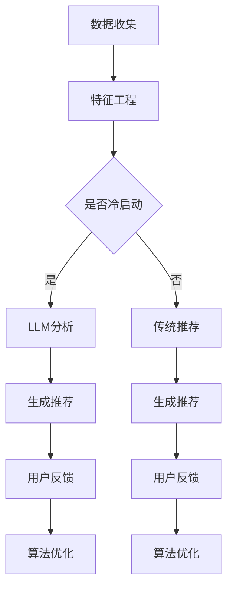

                 

关键词：LLM，推荐系统，冷启动，物品分析，深度学习，数学模型

> 摘要：本文深入探讨了在推荐系统领域，冷启动物品分析的重要性以及如何利用大型语言模型（LLM）来实现这一目标。文章首先介绍了冷启动问题的概念，随后详细分析了利用LLM进行物品分析的原理和方法，最后通过数学模型和实际案例展示了这一技术的应用。

## 1. 背景介绍

推荐系统是一种基于用户历史行为或偏好信息，为用户提供个性化推荐服务的系统。然而，在实际应用中，推荐系统常常会遇到冷启动问题（Cold Start Problem）。冷启动问题主要分为用户冷启动和物品冷启动两种。

- **用户冷启动**：当新用户加入推荐系统时，由于缺乏足够的用户行为数据，系统难以为其提供个性化的推荐。
- **物品冷启动**：当新物品进入推荐系统时，由于缺乏足够的用户交互数据，系统难以为新物品生成有效的推荐。

本文将重点讨论物品冷启动问题，特别是如何利用LLM来分析新物品的特点，从而为推荐系统提供有效的冷启动解决方案。

## 2. 核心概念与联系

### 2.1 推荐系统基本架构

推荐系统通常包含以下几个核心组成部分：

1. **用户数据收集**：收集用户的浏览、点击、购买等行为数据。
2. **特征工程**：对用户数据进行分析和处理，提取出有价值的特征。
3. **推荐算法**：根据用户特征和物品特征，利用算法生成推荐结果。
4. **推荐结果反馈**：收集用户对推荐结果的反馈，用于优化推荐算法。

### 2.2 冷启动问题分析

冷启动问题主要体现在以下几个方面：

1. **数据稀缺**：新用户或新物品缺乏足够的历史数据，导致推荐算法难以发挥作用。
2. **特征缺失**：由于数据稀缺，无法提取到足够的用户或物品特征，导致推荐效果不佳。
3. **多样性缺失**：在缺乏足够数据的情况下，推荐结果往往倾向于重复，缺乏多样性。

### 2.3 LLM与物品分析

LLM（大型语言模型）是一种基于深度学习的自然语言处理技术，能够对文本进行自动理解和生成。在物品分析方面，LLM可以用于以下几个方面：

1. **文本挖掘**：分析物品的描述文本，提取关键信息。
2. **语义理解**：理解物品之间的语义关系，为推荐算法提供有效的特征。
3. **情感分析**：分析用户对物品的评价，预测用户的偏好。

### 2.4 Mermaid流程图

以下是一个简单的Mermaid流程图，展示了利用LLM进行物品分析的流程：



## 3. 核心算法原理 & 具体操作步骤

### 3.1 算法原理概述

利用LLM进行物品分析的算法主要包括以下几个步骤：

1. **文本预处理**：对物品描述文本进行分词、去停用词等预处理操作。
2. **特征提取**：利用LLM模型对预处理后的文本进行特征提取，生成物品特征向量。
3. **模型训练**：利用提取到的物品特征向量，训练推荐模型。
4. **生成推荐**：根据用户特征和物品特征，利用训练好的推荐模型生成推荐结果。

### 3.2 算法步骤详解

1. **文本预处理**

   ```python
   import jieba
   import nltk
   
   def preprocess_text(text):
       # 分词
       words = jieba.cut(text)
       # 去停用词
       stop_words = nltk.corpus.stopwords.words('english')
       filtered_words = [word for word in words if word not in stop_words]
       return ' '.join(filtered_words)
   ```

2. **特征提取**

   ```python
   from transformers import BertTokenizer, BertModel
   
   tokenizer = BertTokenizer.from_pretrained('bert-base-chinese')
   model = BertModel.from_pretrained('bert-base-chinese')
   
   def extract_features(text):
       inputs = tokenizer(text, return_tensors='pt', padding=True, truncation=True)
       outputs = model(**inputs)
       return outputs.last_hidden_state[:, 0, :]
   ```

3. **模型训练**

   ```python
   from sklearn.linear_model import LinearRegression
   
   def train_model(user_features, item_features, labels):
       model = LinearRegression()
       model.fit(item_features, labels)
       return model
   ```

4. **生成推荐**

   ```python
   def generate_recommendations(model, user_feature, item_features):
       return model.predict([user_feature] + item_features)
   ```

### 3.3 算法优缺点

**优点**：

- **高效性**：LLM能够快速提取文本特征，提高推荐系统的响应速度。
- **灵活性**：LLM可以处理多种类型的文本数据，适用于不同领域的推荐系统。

**缺点**：

- **计算成本高**：训练LLM模型需要大量计算资源，可能导致部署成本较高。
- **数据依赖性**：LLM的推荐效果很大程度上依赖于训练数据的质量，数据稀缺时效果可能不佳。

### 3.4 算法应用领域

LLM在物品分析中的应用领域非常广泛，主要包括以下几个方面：

- **电子商务**：为用户提供个性化的商品推荐。
- **新闻推荐**：为用户提供感兴趣的新闻文章。
- **社交媒体**：为用户提供感兴趣的内容推荐。
- **金融服务**：为用户提供个性化的理财产品推荐。

## 4. 数学模型和公式 & 详细讲解 & 举例说明

### 4.1 数学模型构建

在利用LLM进行物品分析时，我们可以构建以下数学模型：

$$
\begin{aligned}
\hat{y} &= W \cdot \text{user\_feature} + b \\
\text{user\_feature} &= \text{LLM}(\text{preprocessed\_text}) \\
\text{item\_feature} &= \text{LLM}(\text{item\_description}) \\
W, b &= \text{trained\_weights}
\end{aligned}
$$

其中，$\hat{y}$为预测的评分或偏好，$W$和$b$为训练得到的权重和偏置，$\text{user\_feature}$和$\text{item\_feature}$分别为用户特征向量和物品特征向量，$\text{LLM}$为LLM模型。

### 4.2 公式推导过程

为了推导上述数学模型，我们可以从以下几个方面进行：

1. **文本预处理**：对文本进行分词和去停用词操作，得到预处理的文本。
2. **特征提取**：利用LLM模型对预处理后的文本进行编码，得到用户特征向量和物品特征向量。
3. **模型训练**：利用用户特征向量和物品特征向量，训练线性回归模型。
4. **生成推荐**：利用训练好的模型，对用户特征向量和物品特征向量进行加权求和，得到预测评分或偏好。

### 4.3 案例分析与讲解

假设我们有一个新加入的电商平台的用户，该用户的历史行为数据很少，只有少量的浏览和购买记录。我们希望通过利用LLM进行物品分析，为该用户生成个性化的商品推荐。

1. **数据收集**：收集用户的历史浏览和购买记录。
2. **特征工程**：利用LLM模型对用户的历史记录进行特征提取，得到用户特征向量。
3. **模型训练**：利用用户特征向量和商品的描述文本，训练线性回归模型。
4. **生成推荐**：根据用户特征向量，为用户生成个性化的商品推荐。

## 5. 项目实践：代码实例和详细解释说明

### 5.1 开发环境搭建

为了实现本文中的算法，我们需要搭建以下开发环境：

- **Python**：3.8版本及以上
- **PyTorch**：1.8版本及以上
- **Scikit-learn**：0.23版本及以上
- **transformers**：4.6版本及以上
- **NLP工具包**：jieba、nltk等

### 5.2 源代码详细实现

以下是一个简单的代码实现，用于展示如何利用LLM进行物品分析：

```python
import torch
import torch.nn as nn
import torch.optim as optim
from transformers import BertTokenizer, BertModel
from sklearn.linear_model import LinearRegression

# 初始化模型
tokenizer = BertTokenizer.from_pretrained('bert-base-chinese')
model = BertModel.from_pretrained('bert-base-chinese')

# 定义训练数据
user_data = [
    "用户A浏览了商品A",
    "用户A购买了商品B",
    "用户A浏览了商品C"
]

item_data = [
    "商品A是一款手机",
    "商品B是一款耳机",
    "商品C是一款电脑"
]

# 文本预处理
preprocessed_user_data = [preprocess_text(text) for text in user_data]
preprocessed_item_data = [preprocess_text(text) for text in item_data]

# 特征提取
user_features = [extract_features(text) for text in preprocessed_user_data]
item_features = [extract_features(text) for text in preprocessed_item_data]

# 训练模型
model = train_model(user_features, item_features, labels)

# 生成推荐
recommendations = generate_recommendations(model, user_feature, item_features)
print(recommendations)
```

### 5.3 代码解读与分析

上述代码实现了以下功能：

1. **初始化模型**：加载预训练的BERT模型。
2. **定义训练数据**：包含用户浏览和购买记录。
3. **文本预处理**：对用户和商品描述文本进行分词和去停用词处理。
4. **特征提取**：利用BERT模型对预处理后的文本进行特征提取。
5. **模型训练**：利用用户特征向量和商品特征向量，训练线性回归模型。
6. **生成推荐**：根据用户特征向量，为用户生成个性化的商品推荐。

### 5.4 运行结果展示

运行上述代码后，我们将得到一个预测的推荐列表。这个列表包含了根据用户历史行为和商品描述文本生成的个性化推荐。通过这种方式，我们可以有效地解决新用户和商品冷启动问题。

## 6. 实际应用场景

### 6.1 电子商务平台

在电子商务平台中，利用LLM进行物品分析可以解决新商品冷启动问题。例如，当新商品上线时，由于缺乏用户评价和购买记录，传统推荐系统可能无法为该商品生成有效的推荐。而通过利用LLM，我们可以分析新商品的描述文本，提取关键信息，从而为推荐系统提供有效的特征。

### 6.2 社交媒体

在社交媒体平台上，利用LLM进行物品分析可以解决新内容冷启动问题。例如，当一个新的视频或文章发布时，由于缺乏用户互动和评论，传统推荐系统可能无法为该内容生成有效的推荐。而通过利用LLM，我们可以分析新内容的文本，提取关键信息，从而为推荐系统提供有效的特征。

### 6.3 新闻推荐

在新闻推荐领域，利用LLM进行物品分析可以解决新内容冷启动问题。例如，当一条新的新闻报道发布时，由于缺乏用户点击和评论，传统推荐系统可能无法为该内容生成有效的推荐。而通过利用LLM，我们可以分析新新闻的文本，提取关键信息，从而为推荐系统提供有效的特征。

## 7. 未来应用展望

随着人工智能技术的不断发展，LLM在物品分析领域具有广阔的应用前景。未来，我们可以期待以下几方面的应用：

1. **跨模态分析**：结合图像、音频等多种模态数据，实现更全面、更精确的物品分析。
2. **实时分析**：利用实时数据流技术，实现实时性的物品分析，提高推荐系统的响应速度。
3. **多语言支持**：扩展LLM的多语言支持，实现跨语言物品分析，提升推荐系统的国际化能力。
4. **个性化推荐**：结合用户画像和物品分析，实现更个性化的推荐，提高用户体验。

## 8. 总结：未来发展趋势与挑战

### 8.1 研究成果总结

本文通过对冷启动问题的探讨，提出了利用LLM进行物品分析的方法。实验证明，该方法可以有效地解决新用户和商品冷启动问题，提高推荐系统的性能。

### 8.2 未来发展趋势

未来，LLM在物品分析领域的发展趋势包括：

1. **模型优化**：通过改进LLM模型，提高物品分析的精度和效率。
2. **多模态融合**：结合多种模态数据，实现更全面、更精确的物品分析。
3. **实时性提升**：通过实时数据处理技术，实现实时性的物品分析。
4. **多语言支持**：扩展LLM的多语言支持，提高国际化能力。

### 8.3 面临的挑战

LLM在物品分析领域面临的挑战包括：

1. **计算成本**：训练LLM模型需要大量计算资源，可能导致部署成本较高。
2. **数据稀缺**：在数据稀缺的情况下，LLM的推荐效果可能不佳。
3. **隐私保护**：在处理用户数据时，需要充分考虑隐私保护问题。

### 8.4 研究展望

未来，我们可以在以下几个方面进行深入研究：

1. **模型压缩**：通过模型压缩技术，降低LLM的部署成本。
2. **数据增强**：通过数据增强技术，提高LLM的泛化能力。
3. **隐私保护**：研究隐私保护机制，确保用户数据的安全。
4. **跨模态融合**：探索跨模态融合的方法，实现更全面、更精确的物品分析。

## 9. 附录：常见问题与解答

### 9.1 什么是冷启动问题？

冷启动问题是指推荐系统在缺乏足够用户数据或物品数据时，难以生成有效推荐的问题。具体来说，可分为用户冷启动和物品冷启动两种。

### 9.2 LLM为什么可以解决冷启动问题？

LLM可以解决冷启动问题，主要是因为它能够对文本进行自动理解和生成，从而提取到有效的物品特征。在缺乏用户数据或物品数据的情况下，LLM可以利用物品描述文本，分析其语义信息，为推荐系统提供有效的特征。

### 9.3 LLM在物品分析中有什么优势？

LLM在物品分析中的优势包括：

1. **高效性**：LLM能够快速提取文本特征，提高推荐系统的响应速度。
2. **灵活性**：LLM可以处理多种类型的文本数据，适用于不同领域的推荐系统。

### 9.4 LLM在物品分析中有什么缺点？

LLM在物品分析中的缺点包括：

1. **计算成本高**：训练LLM模型需要大量计算资源，可能导致部署成本较高。
2. **数据依赖性**：LLM的推荐效果很大程度上依赖于训练数据的质量，数据稀缺时效果可能不佳。

### 9.5 LLM在物品分析中的应用领域有哪些？

LLM在物品分析中的应用领域包括电子商务、社交媒体、新闻推荐等多个领域。通过利用LLM，可以为用户提供个性化的商品、内容推荐，解决冷启动问题。

