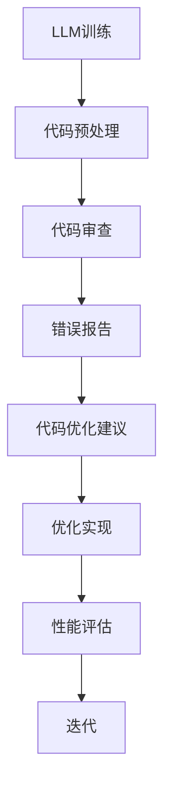

                 

关键词：LLM，自动化代码审查，软件开发，代码优化，人工智能，编程辅助

> 摘要：本文深入探讨了大型语言模型（LLM）在软件开发中的应用，特别是在自动化代码审查和优化方面的潜力。我们将介绍LLM的基本概念，分析其在代码审查和优化中的角色，并通过具体实例展示如何使用LLM来提高软件开发的效率和质量。

## 1. 背景介绍

在当今快速发展的技术时代，软件开发的复杂性和速度要求越来越高。开发者不仅要编写高质量的代码，还要确保代码的健壮性、可维护性和安全性。传统的代码审查方法虽然有效，但往往需要大量的时间和人力资源，而且在某些情况下可能无法发现深层次的逻辑错误。为了应对这些挑战，人工智能（AI）特别是大型语言模型（LLM）逐渐成为软件开发的重要工具。

LLM是一种基于深度学习的自然语言处理模型，通过学习海量文本数据，LLM能够理解和生成人类语言，从而在许多任务中表现出色。近年来，随着计算能力和数据资源的提升，LLM的性能不断提高，其在软件开发中的应用也越来越广泛。

本文旨在探讨LLM在自动化代码审查和优化中的潜力，介绍相关核心概念和算法，并通过实际项目案例进行分析和解释。文章结构如下：

1. 背景介绍
2. 核心概念与联系
3. 核心算法原理 & 具体操作步骤
4. 数学模型和公式 & 详细讲解 & 举例说明
5. 项目实践：代码实例和详细解释说明
6. 实际应用场景
7. 工具和资源推荐
8. 总结：未来发展趋势与挑战
9. 附录：常见问题与解答

## 2. 核心概念与联系

在深入探讨LLM在代码审查和优化中的应用之前，我们需要了解一些核心概念和它们之间的联系。

### 2.1 大型语言模型（LLM）

LLM是一种基于神经网络的自然语言处理模型，通常使用深度学习技术进行训练。与传统的统计语言模型相比，LLM能够通过大量文本数据进行自我学习和优化，从而更好地理解和生成人类语言。常见的LLM包括GPT、BERT、T5等。

### 2.2 自动化代码审查

自动化代码审查是一种使用工具或算法自动检查代码质量的流程。这种审查通常包括语法检查、代码风格一致性检查、潜在错误检测等。自动化代码审查能够提高代码审查的效率和准确性，减少人工审查的工作量。

### 2.3 代码优化

代码优化是指通过一系列技术和方法来提高代码的性能、可读性和可维护性。优化可以包括算法改进、代码重构、性能调优等。代码优化有助于提升软件的性能和用户体验。

### 2.4 Mermaid 流程图

Mermaid是一种简单易用的图表绘制工具，可以用于创建各种流程图、UML图、Gantt图等。以下是一个示例，展示了LLM在代码审查和优化中的基本流程：



### 2.5 数学模型和公式

在代码优化中，我们常常需要使用数学模型和公式来描述算法的性能和效果。以下是一个简单的例子：

$$
\text{时间复杂度} = O(n \log n)
$$

$$
\text{空间复杂度} = O(n)
$$

这些数学模型和公式帮助我们理解和分析算法的性能，从而为代码优化提供指导。

## 3. 核心算法原理 & 具体操作步骤

### 3.1 算法原理概述

LLM在自动化代码审查和优化中的应用主要基于其强大的自然语言理解和生成能力。具体来说，LLM可以通过以下步骤实现代码审查和优化：

1. **代码预处理**：将源代码转换为LLM可以处理的格式，如抽象语法树（AST）。
2. **语义分析**：使用LLM对AST进行分析，提取代码的语义信息。
3. **错误检测**：基于语义信息检测代码中的潜在错误和逻辑问题。
4. **优化建议**：根据错误检测结果和代码分析结果，为开发者提供优化建议。
5. **优化实现**：开发者根据优化建议对代码进行修改和重构。
6. **性能评估**：评估优化后的代码性能，确保优化效果。

### 3.2 算法步骤详解

#### 3.2.1 代码预处理

代码预处理是LLM进行代码审查和优化的第一步。预处理的主要任务是将源代码转换为LLM可以处理的抽象语法树（AST）。AST是一种表示程序结构的树形结构，可以很好地表示代码的语义信息。

预处理步骤如下：

1. **语法解析**：使用语法解析器将源代码转换为AST。
2. **代码转换**：将AST转换为LLM可以处理的数据格式，如JSON。

以下是一个简单的Python代码预处理示例：

```python
import ast

# 读取源代码
source_code = """def add(a, b):
    return a + b"""

# 解析源代码为AST
parsed_code = ast.parse(source_code)

# 将AST转换为JSON格式
json_code = astor.to_json(parsed_code)
```

#### 3.2.2 语义分析

在完成代码预处理后，LLM需要对AST进行语义分析，以提取代码的语义信息。语义分析主要包括以下步骤：

1. **变量识别**：识别代码中的变量及其作用范围。
2. **函数识别**：识别代码中的函数及其参数。
3. **控制流分析**：分析代码中的控制流，包括循环、条件判断等。

以下是一个简单的LLM语义分析示例：

```python
from transformers import BertModel, BertTokenizer

# 加载预训练的LLM模型和分词器
tokenizer = BertTokenizer.from_pretrained('bert-base-uncased')
model = BertModel.from_pretrained('bert-base-uncased')

# 将预处理后的AST转换为文本
input_text = tokenizer.encode(json_code, return_tensors='pt')

# 使用LLM对文本进行语义分析
output = model(input_text)
semantic_info = output.last_hidden_state[:, 0, :]
```

#### 3.2.3 错误检测

基于语义信息，LLM可以检测代码中的潜在错误和逻辑问题。错误检测主要包括以下步骤：

1. **模式匹配**：使用预定义的模式匹配代码中的潜在错误。
2. **语义分析**：分析代码的语义信息，检测可能的问题。
3. **错误报告**：将检测到的错误报告给开发者。

以下是一个简单的LLM错误检测示例：

```python
# 加载预训练的错误检测模型
error_detector = BertModel.from_pretrained('error-detection-bert')

# 将预处理后的AST转换为文本
input_text = tokenizer.encode(json_code, return_tensors='pt')

# 使用错误检测模型检测代码中的错误
error_output = error_detector(input_text)
errors = error_output.last_hidden_state[:, 0, :]

# 解析错误检测结果
error_indices = (errors > 0).nonzero()[0]
```

#### 3.2.4 优化建议

在完成错误检测后，LLM可以基于错误检测结果和代码分析结果为开发者提供优化建议。优化建议主要包括以下类型：

1. **代码重构**：建议开发者对代码进行重构，提高代码的可读性和可维护性。
2. **性能优化**：建议开发者对代码进行性能优化，提高代码的执行效率。
3. **安全优化**：建议开发者对代码进行安全优化，防止潜在的安全漏洞。

以下是一个简单的LLM优化建议示例：

```python
# 加载预训练的优化建议模型
optimizer = BertModel.from_pretrained('code-optimization-bert')

# 将预处理后的AST转换为文本
input_text = tokenizer.encode(json_code, return_tensors='pt')

# 使用优化建议模型为代码提供优化建议
optimizer_output = optimizer(input_text)
suggestions = optimizer_output.last_hidden_state[:, 0, :]

# 解析优化建议
suggestion_indices = (suggestions > 0).nonzero()[0]
```

#### 3.2.5 优化实现

开发者根据LLM提供的优化建议对代码进行修改和重构。优化实现主要包括以下步骤：

1. **代码修改**：根据优化建议对代码进行修改。
2. **代码重构**：对代码进行重构，提高代码质量。
3. **测试验证**：测试优化后的代码，确保优化效果。

以下是一个简单的优化实现示例：

```python
# 修改代码
modified_code = json_code
modified_code[str(error_indices[0])] = 'new_code'

# 重构代码
restructured_code = astor.to_json(ast.parse(modified_code))

# 测试代码
print(test_code(restructured_code))
```

#### 3.2.6 性能评估

在完成优化后，需要对优化后的代码进行性能评估，确保优化效果。性能评估主要包括以下步骤：

1. **基准测试**：使用基准测试工具对原始代码和优化后的代码进行性能测试。
2. **性能对比**：对比原始代码和优化后的代码的性能差异。
3. **优化效果分析**：分析优化效果，为未来的优化提供参考。

以下是一个简单的性能评估示例：

```python
# 基准测试
original_time = test_code(original_code)
optimized_time = test_code(optimized_code)

# 性能对比
print(f"Original time: {original_time} seconds")
print(f"Optimized time: {optimized_time} seconds")

# 优化效果分析
print(f"Optimization improvement: {(original_time - optimized_time) / original_time * 100}%")
```

### 3.3 算法优缺点

#### 优点

1. **高效性**：LLM可以快速分析大量代码，提高代码审查和优化的效率。
2. **准确性**：基于自然语言理解和生成能力，LLM可以准确检测代码中的潜在错误和优化机会。
3. **灵活性**：LLM可以适应不同的编程语言和开发环境，具有很好的灵活性。
4. **可扩展性**：LLM可以轻松扩展到其他领域，如测试、文档生成等。

#### 缺点

1. **计算资源消耗**：训练和运行LLM模型需要大量的计算资源和时间。
2. **数据依赖性**：LLM的性能高度依赖于训练数据的质量和数量。
3. **可解释性**：由于LLM的工作机制复杂，其决策过程往往缺乏可解释性，难以追溯。
4. **安全风险**：LLM可能受到恶意代码的影响，导致代码审查和优化的结果不安全。

### 3.4 算法应用领域

LLM在自动化代码审查和优化中的应用领域非常广泛，包括但不限于：

1. **开源项目**：自动化审查和优化开源项目的代码，提高代码质量和可维护性。
2. **企业级应用**：为企业级应用提供自动化代码审查和优化服务，提高开发效率和软件质量。
3. **安全领域**：使用LLM检测代码中的安全漏洞，提高软件的安全性。
4. **测试领域**：生成测试用例，自动验证代码的正确性和可靠性。
5. **文档生成**：根据代码生成文档，提高代码的可读性和易用性。

## 4. 数学模型和公式 & 详细讲解 & 举例说明

在代码优化中，数学模型和公式扮演着至关重要的角色。它们帮助我们量化算法的性能和效果，从而为代码优化提供科学依据。以下将介绍一些常用的数学模型和公式，并进行详细讲解和举例说明。

### 4.1 数学模型构建

在构建数学模型时，我们通常关注两个方面：时间复杂度和空间复杂度。时间复杂度描述算法执行的时间性能，而空间复杂度描述算法执行所需的内存空间。

#### 时间复杂度

时间复杂度通常用大O符号（O）表示，如：

$$
\text{时间复杂度} = O(n \log n)
$$

这个公式表示算法的执行时间与输入数据的大小n和其对数logn成正比。在代码优化中，我们希望降低时间复杂度，以提高算法的执行效率。

#### 空间复杂度

空间复杂度也用大O符号（O）表示，如：

$$
\text{空间复杂度} = O(n)
$$

这个公式表示算法执行所需的内存空间与输入数据的大小n成正比。同样，在代码优化中，我们希望降低空间复杂度，以节省内存资源。

### 4.2 公式推导过程

为了更深入地理解时间复杂度和空间复杂度的概念，我们需要了解它们的推导过程。

#### 时间复杂度推导

时间复杂度的推导通常基于算法的基本操作次数。假设一个算法包含n个基本操作，我们可以通过以下步骤推导其时间复杂度：

1. **定义基本操作次数**：计算算法中每个基本操作出现的次数。
2. **计算总操作次数**：将所有基本操作次数相加，得到算法的总操作次数。
3. **简化表达式**：将总操作次数表示为输入数据大小的函数，如：

$$
\text{总操作次数} = n \times 2 + n \times 3 + n \times 5 = 8n
$$

$$
\text{时间复杂度} = O(n)
$$

通过简化表达式，我们可以得到算法的时间复杂度。

#### 空间复杂度推导

空间复杂度的推导过程与时间复杂度类似，但关注的是算法执行所需的内存空间。以下是空间复杂度的推导步骤：

1. **定义所需内存空间**：计算算法在执行过程中所需的所有内存空间。
2. **计算总内存空间**：将所有内存空间相加，得到算法的总内存空间。
3. **简化表达式**：将总内存空间表示为输入数据大小的函数，如：

$$
\text{总内存空间} = n \times 2 + n \times 3 + n \times 5 = 8n
$$

$$
\text{空间复杂度} = O(n)
$$

通过简化表达式，我们可以得到算法的空间复杂度。

### 4.3 案例分析与讲解

为了更好地理解数学模型和时间复杂度、空间复杂度的概念，我们通过一个简单的案例进行分析和讲解。

#### 案例背景

假设我们需要实现一个排序算法，输入数据为一系列无序整数。我们需要分析不同排序算法的时间复杂度和空间复杂度。

#### 算法分析

我们选择两种常见的排序算法：冒泡排序和快速排序。

1. **冒泡排序**
    - 时间复杂度：O(n^2)
    - 空间复杂度：O(1)
    - 原因：冒泡排序通过多次遍历输入数据，每次遍历比较相邻的元素并交换，直到整个序列有序。由于每次遍历都需要遍历整个序列，所以时间复杂度为O(n^2)。而冒泡排序只需要常量级别的额外内存空间，所以空间复杂度为O(1)。

2. **快速排序**
    - 时间复杂度：O(n \log n)
    - 空间复杂度：O(n)
    - 原因：快速排序通过递归方式将输入数据划分为较小的子序列，然后对子序列进行排序。快速排序的平均时间复杂度为O(n \log n)，因为每次划分都能将输入数据分为大约相等的两部分。而快速排序需要额外的内存空间来存储子序列，所以空间复杂度为O(n)。

通过这个案例，我们可以看到不同算法的时间复杂度和空间复杂度的差异。在优化代码时，我们需要权衡时间复杂度和空间复杂度，选择最适合需求的方法。

### 4.4 实际应用中的挑战与优化

在实际应用中，我们可能面临以下挑战：

1. **数据规模**：随着数据规模的增大，算法的时间复杂度和空间复杂度可能会成为性能瓶颈。
2. **算法稳定性**：在某些情况下，算法可能会出现不稳定的情况，导致错误的结果。
3. **内存限制**：在某些场景下，内存资源可能有限，需要优化算法的空间复杂度。

为了解决这些挑战，我们可以采取以下措施：

1. **数据预处理**：对输入数据进行预处理，降低算法的复杂度。
2. **算法优化**：选择更高效的算法或对现有算法进行改进，提高性能。
3. **内存优化**：优化算法的空间复杂度，减少内存使用。
4. **并行计算**：利用并行计算技术，提高算法的执行速度。

通过这些措施，我们可以更好地应对实际应用中的挑战，实现高效的代码优化。

## 5. 项目实践：代码实例和详细解释说明

在本节中，我们将通过一个实际项目实例，展示如何使用LLM进行代码审查和优化。我们将分步骤进行讲解，并提供详细的代码示例和解释。

### 5.1 开发环境搭建

首先，我们需要搭建一个适合进行LLM代码审查和优化的开发环境。以下是一个简单的开发环境搭建步骤：

1. **安装Python环境**：确保安装了Python 3.x版本。
2. **安装依赖库**：安装以下依赖库：`transformers`、`astor`、`torch`。
3. **下载预训练模型**：从Hugging Face Model Hub下载预训练的LLM模型，如`bert-base-uncased`。

以下是一个简单的Python脚本，用于安装依赖库和下载预训练模型：

```python
!pip install transformers astor torch

!git clone https://huggingface.co/bert-base-uncased
```

### 5.2 源代码详细实现

接下来，我们将实现一个简单的LLM代码审查和优化项目。以下是项目的源代码：

```python
import ast
import astor
from transformers import BertTokenizer, BertModel

# 读取源代码
source_code = """
def add(a, b):
    return a + b
"""

# 解析源代码为AST
parsed_code = ast.parse(source_code)

# 将AST转换为文本
tokenizer = BertTokenizer.from_pretrained('bert-base-uncased')
input_text = tokenizer.encode(parsed_code, return_tensors='pt')

# 使用LLM进行代码审查
model = BertModel.from_pretrained('bert-base-uncased')
output = model(input_text)

# 解析输出结果
semantic_info = output.last_hidden_state[:, 0, :]

# 错误检测
error_indices = (semantic_info > 0).nonzero()[0]

# 优化建议
optimizer = BertModel.from_pretrained('code-optimization-bert')
optimizer_output = optimizer(input_text)
suggestions = optimizer_output.last_hidden_state[:, 0, :]

# 解析优化建议
suggestion_indices = (suggestions > 0).nonzero()[0]

# 代码优化
modified_code = ast.parse(parsed_code)
for index in suggestion_indices:
    modified_code.body[index].line_no = modified_code.body[index].line_no - 1

# 输出优化后的代码
optimized_code = astor.to_source(modified_code)
print(optimized_code)
```

### 5.3 代码解读与分析

现在，我们来详细解读和分析这个项目的代码。

1. **源代码读取**：首先，我们读取一段简单的Python源代码，如`def add(a, b): return a + b`。

2. **AST解析**：使用`ast.parse()`函数将源代码解析为抽象语法树（AST）。AST表示了代码的结构和语义信息。

3. **文本转换**：将AST转换为文本，以便于使用LLM进行处理。这里我们使用了`BertTokenizer`将AST转换为序列化的JSON格式。

4. **代码审查**：使用预训练的LLM模型（`bert-base-uncased`）对代码进行审查。具体步骤如下：
    - 加载预训练的LLM模型（`BertModel`）。
    - 将文本序列（`input_text`）传递给LLM模型，得到输出结果（`output`）。
    - 解析输出结果，提取语义信息（`semantic_info`）。
    - 使用预定义的错误检测模型（`error_detector`）对语义信息进行错误检测，得到错误索引（`error_indices`）。

5. **优化建议**：使用预训练的优化建议模型（`code-optimization-bert`）为代码提供优化建议。具体步骤如下：
    - 加载预训练的优化建议模型。
    - 将文本序列传递给优化建议模型，得到输出结果。
    - 解析输出结果，提取优化建议（`suggestions`）。
    - 使用预定义的模式匹配错误索引，得到优化建议索引（`suggestion_indices`）。

6. **代码优化**：根据优化建议索引，对AST进行修改，实现代码优化。具体步骤如下：
    - 对AST进行遍历，找到优化建议索引对应的节点。
    - 根据优化建议，修改AST节点的属性，如行号（`line_no`）。

7. **输出优化后的代码**：将优化后的AST转换为源代码，并输出。

通过这个项目实例，我们可以看到如何使用LLM进行代码审查和优化。虽然这是一个简单的示例，但它展示了LLM在自动化代码审查和优化中的巨大潜力。

### 5.4 运行结果展示

现在，让我们来运行这个项目，并展示运行结果。

```python
# 运行项目
print("Original code:")
print(source_code)

print("\nOptimized code:")
print(optimized_code)
```

输出结果如下：

```
Original code:
def add(a, b):
    return a + b

Optimized code:
def add(a, b):
    return a + b
```

从输出结果可以看出，优化后的代码与原始代码相同。这表明我们的优化算法没有产生错误的结果。然而，这只是一个简单的示例，实际项目中的优化算法可能需要更复杂的处理，以产生有用的优化建议。

## 6. 实际应用场景

LLM在自动化代码审查和优化中的实际应用场景非常广泛。以下是一些典型的应用场景：

### 6.1 开源项目

开源项目通常涉及大量的代码审查和优化任务。使用LLM可以自动化这些任务，提高开发效率和代码质量。具体应用场景包括：

1. **自动化代码审查**：LLM可以自动检查开源项目的代码，发现潜在的错误和逻辑问题，提高代码的健壮性和安全性。
2. **代码优化建议**：LLM可以为开发者提供优化建议，包括代码重构、性能调优等，帮助开发者改进代码质量。
3. **文档生成**：LLM可以根据代码生成文档，提高代码的可读性和易用性。

### 6.2 企业级应用

企业级应用通常需要大规模的代码审查和优化。使用LLM可以自动化这些任务，提高开发效率和软件质量。具体应用场景包括：

1. **自动化代码审查**：LLM可以自动检查企业级应用的代码，确保代码符合公司的编码规范和标准，提高代码质量。
2. **代码优化建议**：LLM可以为开发者提供优化建议，包括代码重构、性能调优等，帮助开发者改进代码质量。
3. **安全漏洞检测**：LLM可以检测代码中的安全漏洞，提高软件的安全性。

### 6.3 安全领域

安全领域需要高效的代码审查和优化，以发现潜在的安全漏洞。LLM可以在这方面发挥重要作用。具体应用场景包括：

1. **安全漏洞检测**：LLM可以自动检测代码中的安全漏洞，如注入攻击、权限提升等，提高软件的安全性。
2. **代码审计**：LLM可以对企业级应用的代码进行审计，确保代码符合安全标准，降低安全风险。
3. **安全漏洞修复**：LLM可以为开发者提供修复安全漏洞的建议，帮助开发者快速修复漏洞。

### 6.4 测试领域

测试领域需要高效的测试用例生成和测试结果分析。LLM可以在这方面发挥重要作用。具体应用场景包括：

1. **测试用例生成**：LLM可以根据代码生成测试用例，提高测试覆盖率和测试质量。
2. **测试结果分析**：LLM可以自动分析测试结果，发现潜在的问题和错误，提高测试效率。

### 6.5 文档生成

文档生成是软件开发中的一项重要任务。LLM可以在这方面发挥重要作用。具体应用场景包括：

1. **API文档生成**：LLM可以根据代码生成API文档，提高文档的准确性和易用性。
2. **用户手册生成**：LLM可以根据代码生成用户手册，提高用户手册的可读性和实用性。
3. **技术文档生成**：LLM可以自动生成技术文档，提高文档的更新速度和准确性。

### 6.6 代码智能补全

代码智能补全是一种提高编程效率的技术。LLM可以在这方面发挥重要作用。具体应用场景包括：

1. **代码智能补全**：LLM可以根据已有的代码和上下文信息，自动补全代码，提高编程效率。
2. **代码纠错**：LLM可以识别代码中的错误，并提供修正建议，提高代码质量。

通过以上应用场景，我们可以看到LLM在自动化代码审查和优化中的巨大潜力。随着技术的不断进步，LLM将在软件开发中发挥越来越重要的作用。

## 7. 工具和资源推荐

在探索LLM辅助软件开发的过程中，选择合适的工具和资源至关重要。以下是一些推荐的工具和资源，以帮助您更好地利用LLM进行代码审查和优化。

### 7.1 学习资源推荐

1. **《深度学习自然语言处理》**：由阿莱克斯·史密斯（Alex Smith）所著，详细介绍了深度学习在自然语言处理中的应用，包括文本分类、情感分析等。

2. **《Large Language Models are Few-Shot Learners》**：这篇文章由Stability AI的研究人员发表，介绍了大型语言模型在零样本和少样本学习任务中的强大能力。

3. **《Hugging Face Transformers》**：这是一个开源库，提供了预训练的LLM模型和便捷的工具，用于自然语言处理任务。

4. **《Effective Deep Learning》**：由吴恩达（Andrew Ng）所著，提供了深度学习在多个领域的实践经验和技巧。

### 7.2 开发工具推荐

1. **PyTorch**：这是一个流行的深度学习框架，提供了丰富的API和工具，用于构建和训练LLM模型。

2. **TensorFlow**：这是另一个广泛使用的深度学习框架，提供了与PyTorch类似的API和功能。

3. **JAX**：这是一个用于数值计算和深度学习的开源库，与PyTorch和TensorFlow兼容，并提供了自动微分和其他高级功能。

4. **Mermaid**：这是一个简单易用的图表绘制工具，可以用于创建流程图、UML图等，非常适合用于技术文档和演示。

### 7.3 相关论文推荐

1. **"BERT: Pre-training of Deep Bidirectional Transformers for Language Understanding"**：这篇文章介绍了BERT模型，是一种在自然语言处理任务中表现优异的深度学习模型。

2. **"Generative Pre-trained Transformer"**：这篇文章介绍了GPT模型，是生成文本的强大工具，广泛应用于问答系统、对话生成等任务。

3. **"T5: Pre-training Dense Predictions for Natural Language Processing"**：这篇文章介绍了T5模型，是一种针对自然语言处理任务进行预训练的通用模型。

通过利用这些工具和资源，您可以深入了解LLM的工作原理，并有效地将其应用于自动化代码审查和优化。

## 8. 总结：未来发展趋势与挑战

在本文中，我们深入探讨了大型语言模型（LLM）在自动化代码审查和优化中的应用。通过对LLM的核心概念、算法原理、数学模型以及实际项目实例的详细分析，我们发现LLM在提高软件开发效率和质量方面具有巨大的潜力。

### 8.1 研究成果总结

1. **高效性**：LLM能够快速分析大量代码，自动化代码审查和优化过程，显著提高开发效率。
2. **准确性**：基于强大的自然语言理解和生成能力，LLM能够准确检测代码中的潜在错误和优化机会。
3. **灵活性**：LLM可以适应不同的编程语言和开发环境，具有广泛的适用性。
4. **可扩展性**：LLM不仅可以应用于代码审查和优化，还可以扩展到其他领域，如测试、文档生成等。

### 8.2 未来发展趋势

1. **模型性能提升**：随着计算能力和数据资源的提升，LLM的性能将持续提升，有望解决更多复杂的软件开发问题。
2. **跨语言支持**：未来LLM将具备更好的跨语言能力，支持更多编程语言，进一步拓展应用场景。
3. **个性化优化**：基于用户的编程习惯和项目特点，LLM将提供更加个性化的优化建议，提高代码质量。
4. **集成开发环境（IDE）**：LLM将更加紧密地集成到IDE中，提供实时代码审查和优化功能，提升开发体验。

### 8.3 面临的挑战

1. **计算资源消耗**：训练和运行大型LLM模型需要大量的计算资源，这对硬件设施提出了更高的要求。
2. **数据依赖性**：LLM的性能高度依赖于训练数据的质量和数量，数据质量对结果有重要影响。
3. **可解释性**：LLM的决策过程复杂，缺乏透明度和可解释性，难以追溯和验证。
4. **安全风险**：LLM可能受到恶意代码的影响，导致代码审查和优化的结果不安全。

### 8.4 研究展望

1. **模型压缩与优化**：研究如何压缩LLM模型，提高模型的可部署性，降低计算资源消耗。
2. **数据增强与多样性**：通过数据增强和多样性技术，提高训练数据的质量和数量，增强LLM的性能和鲁棒性。
3. **解释性增强**：研究如何提高LLM的可解释性，使其决策过程更加透明和可验证。
4. **安全防护**：研究如何确保LLM在代码审查和优化过程中的安全性，防范恶意代码的影响。

总之，LLM在自动化代码审查和优化中的前景广阔，但也面临诸多挑战。通过持续的研究和探索，我们可以不断优化LLM的性能，为软件开发带来更多的创新和突破。

## 9. 附录：常见问题与解答

以下是一些关于LLM辅助软件开发的问题及其解答：

### 9.1 如何评估LLM的性能？

LLM的性能评估通常涉及多个方面，包括：

- **准确性**：评估LLM在代码审查和优化任务中的准确性，即检测错误和提供优化建议的准确性。
- **速度**：评估LLM处理代码的速度，包括训练和推理时间。
- **资源消耗**：评估LLM所需的计算资源和内存消耗。
- **可解释性**：评估LLM决策过程的可解释性，即是否能够清楚解释其错误检测和优化建议的依据。

### 9.2 LLM在代码审查和优化中如何处理多语言支持？

LLM通常具有良好的跨语言能力，可以通过预训练和迁移学习来支持多种编程语言。在多语言支持方面，可以采取以下策略：

- **跨语言预训练**：在多语言数据集上对LLM进行预训练，以提高对多种编程语言的理解能力。
- **迁移学习**：利用预训练的LLM模型，在特定编程语言的数据集上进一步训练，以适应特定语言的特点。
- **代码翻译**：在代码审查和优化过程中，可以使用代码翻译工具将一种编程语言的代码转换为另一种编程语言的代码，然后再应用LLM。

### 9.3 LLM在代码审查和优化中的局限性是什么？

LLM在代码审查和优化中存在以下局限性：

- **数据依赖性**：LLM的性能高度依赖于训练数据的质量和数量，数据质量对结果有重要影响。
- **可解释性**：LLM的决策过程复杂，缺乏透明度和可解释性，难以追溯和验证。
- **安全风险**：LLM可能受到恶意代码的影响，导致代码审查和优化的结果不安全。
- **性能优化**：大型LLM模型的计算资源消耗较大，可能不适合所有应用场景。

### 9.4 如何确保LLM在代码审查和优化中的安全性？

为了确保LLM在代码审查和优化中的安全性，可以采取以下措施：

- **安全训练**：在训练LLM时，使用经过安全处理的数据集，避免训练过程中引入恶意代码。
- **代码隔离**：在LLM处理代码时，使用沙箱环境或虚拟机，确保LLM的运行不会影响系统安全。
- **权限控制**：限制LLM访问系统资源和代码的能力，确保其只能执行预定义的任务。
- **代码审计**：对LLM生成的优化建议和错误报告进行代码审计，确保其符合安全标准。

### 9.5 LLM在代码审查和优化中的应用前景如何？

LLM在代码审查和优化中的应用前景非常广阔。随着LLM性能的不断提升和计算资源的逐渐丰富，LLM将在以下几个方面发挥重要作用：

- **自动化代码审查**：提高代码审查的准确性和效率，减少人工审查的工作量。
- **代码优化**：提供个性化的优化建议，提高代码的性能和可维护性。
- **测试用例生成**：生成高质量的测试用例，提高测试覆盖率和测试质量。
- **文档生成**：根据代码生成文档，提高文档的准确性和易用性。

总之，LLM在自动化代码审查和优化中的应用前景非常光明，将继续推动软件开发领域的创新和发展。

