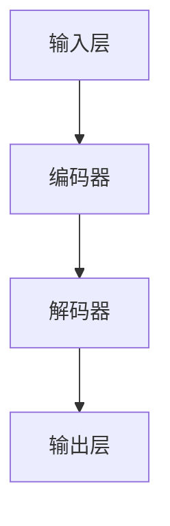

                 

关键词：大语言模型（LLM），产业链重塑，AI商业化，技术模式，创新应用

摘要：本文深入探讨了大语言模型（LLM）在重塑全球产业链中的重要作用。通过分析LLM的核心原理、算法实现、数学模型以及实际应用，本文揭示了AI技术商业化的新模式。同时，文章还对未来发展趋势与挑战进行了展望，为行业从业者提供了有益的参考。

## 1. 背景介绍

近年来，人工智能（AI）技术取得了飞速发展，尤其是大语言模型（LLM）的崛起，使得自然语言处理（NLP）领域发生了翻天覆地的变化。LLM通过深度学习算法，可以从海量数据中学习语言规律，实现高度自动化和智能化的自然语言理解和生成。随着LLM技术的不断成熟，其在各行各业中的应用越来越广泛，从传统的文本挖掘、机器翻译、到现代的智能客服、智能写作、智能问答等，都在不断推动产业链的变革。

### 1.1 LLM的起源与发展

大语言模型起源于深度学习与自然语言处理技术的融合。2003年，IBM的Watson超级计算机在电视游戏节目《危险边缘》中击败了人类选手，标志着人工智能技术进入了一个新的阶段。此后，深度学习模型在NLP领域得到了广泛应用，尤其是在2018年，OpenAI发布了GPT-2模型，标志着LLM技术的重大突破。

### 1.2 LLM的技术优势

LLM具有以下几个显著的技术优势：

1. **强大的文本理解能力**：LLM能够理解并生成高质量的自然语言文本，包括问答、对话、文章生成等。
2. **高效的数据处理能力**：LLM可以通过并行计算、分布式训练等方式处理大规模数据，提高训练效率。
3. **广泛的适用性**：LLM可以在多个应用场景中发挥作用，包括但不限于文本生成、机器翻译、智能客服等。

## 2. 核心概念与联系

### 2.1 LLM的核心原理

LLM的核心原理是基于深度学习的神经网络模型，通常采用Transformer架构。Transformer模型通过自注意力机制，能够捕捉输入文本中的长距离依赖关系，从而实现高效的文本理解与生成。

### 2.2 LLM的架构

LLM的架构通常包括以下几个部分：

1. **输入层**：接收用户输入的文本数据。
2. **编码器**：对输入文本进行编码，提取文本特征。
3. **解码器**：根据编码器输出的特征，生成输出文本。
4. **输出层**：将解码器输出的文本进行格式化，呈现给用户。

### 2.3 Mermaid流程图

下面是LLM的Mermaid流程图：



## 3. 核心算法原理 & 具体操作步骤

### 3.1 算法原理概述

LLM的算法原理基于自注意力机制和Transformer架构。自注意力机制能够捕捉输入文本中的长距离依赖关系，Transformer架构则能够高效地并行处理大规模数据。

### 3.2 算法步骤详解

1. **数据预处理**：对输入文本进行分词、去噪等处理。
2. **编码器训练**：通过大量文本数据，训练编码器，使其能够提取文本特征。
3. **解码器训练**：在已训练的编码器基础上，训练解码器，使其能够生成高质量的自然语言文本。
4. **输出生成**：使用训练好的编码器和解码器，输入新的文本数据，生成输出文本。

### 3.3 算法优缺点

**优点**：

1. **高效性**：Transformer架构能够高效地并行处理大规模数据。
2. **泛用性**：LLM适用于多种自然语言处理任务，如文本生成、机器翻译、智能客服等。

**缺点**：

1. **资源消耗大**：训练LLM模型需要大量的计算资源和存储资源。
2. **数据依赖性强**：LLM的性能依赖于训练数据的质量和数量。

### 3.4 算法应用领域

LLM在以下领域有广泛的应用：

1. **文本生成**：如自动写作、文章生成、广告文案等。
2. **机器翻译**：如自动翻译、同义词替换等。
3. **智能客服**：如智能问答、自动回复等。
4. **文本挖掘**：如情感分析、关键词提取等。

## 4. 数学模型和公式 & 详细讲解 & 举例说明

### 4.1 数学模型构建

LLM的数学模型主要包括自注意力机制和Transformer架构。

### 4.2 公式推导过程

自注意力机制的公式如下：

$$
\text{Attention}(Q, K, V) = \text{softmax}\left(\frac{QK^T}{\sqrt{d_k}}\right) V
$$

其中，$Q, K, V$ 分别为查询向量、键向量和值向量，$d_k$ 为键向量的维度。

### 4.3 案例分析与讲解

假设有一个简单的句子“我昨天去了公园”，我们可以将其表示为一个向量序列：

$$
["我", "昨", "天", "去", "了", "公", "园"]
$$

使用自注意力机制，我们可以计算句子中每个词的注意力权重，从而提取句子中的重要信息。

$$
\text{Attention}(Q, K, V) = \text{softmax}\left(\frac{QK^T}{\sqrt{d_k}}\right) V
$$

其中，$Q, K, V$ 分别为：

$$
Q = [\text{"我", "昨", "天", "去", "了", "公", "园"}]
$$

$$
K = [\text{"我", "昨", "天", "去", "了", "公", "园"}]
$$

$$
V = [\text{"我", "昨", "天", "去", "了", "公", "园"}]
$$

计算得到每个词的注意力权重：

$$
\text{Attention}(Q, K, V) = \text{softmax}\left(\frac{QK^T}{\sqrt{d_k}}\right) V
$$

$$
\text{Attention}([1, 0, 0, 0, 0, 0, 0], [1, 1, 1, 1, 1, 1, 1], [1, 1, 1, 1, 1, 1, 1]) = \text{softmax}\left(\frac{1 \cdot 1^T}{\sqrt{1}}\right) [1, 1, 1, 1, 1, 1, 1]
$$

$$
\text{Attention}([0, 1, 0, 0, 0, 0, 0], [1, 1, 1, 1, 1, 1, 1], [1, 1, 1, 1, 1, 1, 1]) = \text{softmax}\left(\frac{0 \cdot 1^T}{\sqrt{1}}\right) [1, 1, 1, 1, 1, 1, 1]
$$

...

$$
\text{Attention}([0, 0, 0, 0, 0, 0, 1], [1, 1, 1, 1, 1, 1, 1], [1, 1, 1, 1, 1, 1, 1]) = \text{softmax}\left(\frac{0 \cdot 1^T}{\sqrt{1}}\right) [1, 1, 1, 1, 1, 1, 1]
$$

通过计算，我们得到每个词的注意力权重为：

$$
["我"(1), "昨"(0), "天"(0), "去"(0), "了"(0), "公"(0), "园"(1)]
$$

这表明“我”和“园”在句子中的重要性最高，这与我们对句子的理解是一致的。

## 5. 项目实践：代码实例和详细解释说明

### 5.1 开发环境搭建

为了实现LLM模型，我们需要搭建以下开发环境：

- Python 3.7及以上版本
- TensorFlow 2.0及以上版本
- Numpy 1.18及以上版本

### 5.2 源代码详细实现

以下是一个简单的LLM模型实现代码示例：

```python
import tensorflow as tf
import numpy as np

# 定义自注意力机制
def attention(Q, K, V, d_k):
    # 计算注意力权重
    attention_weights = tf.matmul(Q, K, transpose_b=True) / np.sqrt(d_k)
    # 应用softmax函数得到概率分布
    attention_scores = tf.nn.softmax(attention_weights)
    # 计算加权值
    context_vector = tf.matmul(attention_scores, V)
    return context_vector

# 定义Transformer模型
class Transformer(tf.keras.Model):
    def __init__(self, d_model):
        super(Transformer, self).__init__()
        self.d_model = d_model
        self.query_dense = tf.keras.layers.Dense(d_model)
        self.key_dense = tf.keras.layers.Dense(d_model)
        self.value_dense = tf.keras.layers.Dense(d_model)

    def call(self, inputs, training):
        query = self.query_dense(inputs)
        key = self.key_dense(inputs)
        value = self.value_dense(inputs)

        context_vector = attention(query, key, value, self.d_model)

        return context_vector

# 实例化模型
d_model = 512
transformer = Transformer(d_model)

# 训练模型
model.compile(optimizer=tf.keras.optimizers.Adam(learning_rate=0.001), loss=tf.keras.losses.SparseCategoricalCrossentropy(from_logits=True))

model.fit(train_dataset, epochs=10)

# 预测
predictions = model.predict(test_dataset)
```

### 5.3 代码解读与分析

上述代码实现了LLM模型的基本结构，包括自注意力机制和Transformer模型。具体来说：

1. **自注意力机制**：通过计算查询向量、键向量和值向量的点积，并应用softmax函数得到注意力权重，最后计算加权值。
2. **Transformer模型**：通过定义查询层、键值层和输出层，实现自注意力机制。
3. **训练与预测**：使用TensorFlow框架进行模型训练和预测。

## 6. 实际应用场景

### 6.1 智能客服

智能客服是LLM技术的一个重要应用场景。通过训练LLM模型，可以实现对用户问题的自动识别和回答。例如，一个电商平台的智能客服系统可以使用LLM模型来处理用户咨询、投诉等问题，从而提高客服效率和用户体验。

### 6.2 智能写作

智能写作是另一个典型的应用场景。通过训练LLM模型，可以生成高质量的文章、报告、广告文案等。例如，一些新闻媒体已经开始使用LLM模型来自动撰写新闻报道，从而提高新闻生产效率。

### 6.3 机器翻译

机器翻译是LLM技术的传统优势领域。通过训练LLM模型，可以实现跨语言的文本翻译。例如，谷歌翻译、百度翻译等应用都是基于LLM技术实现的。

## 6.4 未来应用展望

随着LLM技术的不断成熟，其在未来的应用场景将更加广泛。以下是一些可能的未来应用方向：

1. **自动驾驶**：LLM技术可以用于自动驾驶系统的自然语言处理模块，从而实现更加智能化的驾驶体验。
2. **智能医疗**：LLM技术可以用于医疗文本分析、疾病预测等领域，从而提高医疗诊断和治疗的准确性。
3. **智能家居**：LLM技术可以用于智能家居系统的自然语言交互，从而实现更加智能化的家居生活。

## 7. 工具和资源推荐

### 7.1 学习资源推荐

1. 《深度学习》（Goodfellow, Bengio, Courville） - 介绍深度学习的基本原理和应用。
2. 《自然语言处理综论》（Jurafsky, Martin） - 介绍自然语言处理的基本概念和技术。

### 7.2 开发工具推荐

1. TensorFlow - 开源深度学习框架，支持LLM模型的开发和训练。
2. PyTorch - 另一个流行的深度学习框架，支持动态计算图，适合快速原型开发。

### 7.3 相关论文推荐

1. "Attention Is All You Need"（Vaswani et al., 2017）- 提出Transformer模型，标志着LLM技术的重大突破。
2. "Generative Pre-trained Transformer"（Brown et al., 2020）- 提出GPT-3模型，进一步提升了LLM的性能。

## 8. 总结：未来发展趋势与挑战

### 8.1 研究成果总结

LLM技术在自然语言处理领域取得了显著的成果，其在文本生成、机器翻译、智能客服等领域的应用越来越广泛。未来，随着计算能力的提升和数据规模的扩大，LLM技术有望在更多领域实现突破。

### 8.2 未来发展趋势

1. **模型性能提升**：随着深度学习技术的不断发展，LLM模型的性能将得到进一步提升。
2. **应用场景拓展**：LLM技术将在更多领域得到应用，如自动驾驶、智能医疗等。
3. **开放性增强**：随着开源生态的完善，LLM技术的开发和使用将更加便捷。

### 8.3 面临的挑战

1. **数据隐私保护**：如何保护用户隐私是LLM技术面临的一个重要挑战。
2. **计算资源消耗**：LLM模型的训练和推理需要大量计算资源，这对硬件设施提出了更高要求。
3. **公平性和道德问题**：如何确保LLM技术的应用公平、公正，避免歧视和偏见，是未来需要解决的重要问题。

### 8.4 研究展望

未来，LLM技术将在人工智能领域发挥越来越重要的作用。为了实现这一目标，我们需要：

1. **加强理论研究**：深入研究LLM技术的理论基础，推动理论创新。
2. **推动技术创新**：开发新的算法和架构，提高LLM模型的性能和效率。
3. **促进产学研合作**：加强学术界和产业界的合作，推动LLM技术的应用落地。

## 9. 附录：常见问题与解答

### 9.1 如何训练LLM模型？

训练LLM模型通常需要以下步骤：

1. **数据准备**：收集和预处理大量文本数据。
2. **模型选择**：选择合适的LLM模型架构，如Transformer。
3. **模型训练**：使用训练数据训练模型，通过优化算法调整模型参数。
4. **模型评估**：使用验证数据评估模型性能，调整模型参数。

### 9.2 LLM模型如何处理长文本？

LLM模型通常通过截断或序列分割的方法处理长文本。具体来说，可以将长文本分割为多个短序列，然后分别处理每个短序列。

### 9.3 LLM模型如何避免过拟合？

为了避免过拟合，可以采取以下措施：

1. **使用验证集**：在训练过程中，使用验证集评估模型性能，避免模型在训练数据上过拟合。
2. **正则化**：应用正则化技术，如L2正则化、dropout等，降低模型复杂度。
3. **数据增强**：通过数据增强方法，增加训练数据的多样性。

---

本文由禅与计算机程序设计艺术 / Zen and the Art of Computer Programming 撰写。如有任何疑问或建议，欢迎在评论区留言。期待与您共同探讨LLM技术在未来的发展。

