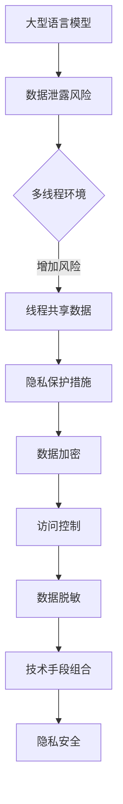

                 

关键词：大型语言模型（LLM）、隐私安全、线程级别、挑战与机遇

> 摘要：本文将深入探讨大型语言模型（LLM）在隐私安全方面的挑战与机遇。特别是在线程级别，LLM所面临的隐私泄露风险以及如何通过先进的技术手段进行有效防护。文章将从核心概念、算法原理、数学模型、项目实践以及未来应用等多个角度进行全面分析，旨在为行业从业者提供有价值的参考。

## 1. 背景介绍

随着人工智能技术的飞速发展，大型语言模型（LLM）已经成为了自然语言处理领域的重要工具。LLM通过训练大规模的神经网络模型，能够实现高效的文本生成、翻译、摘要等任务，极大地推动了各行各业的发展。然而，随着模型规模的扩大，隐私安全问题也逐渐凸显出来。特别是在多线程环境下，LLM的隐私风险变得更加复杂和严峻。

隐私安全问题一直是人工智能领域关注的焦点。对于LLM而言，由于其高度依赖用户数据，因此更容易成为隐私泄露的目标。多线程环境进一步加剧了这一问题，因为线程之间的数据共享和交互使得隐私保护变得更加困难。因此，如何在多线程级别保障LLM的隐私安全，成为了当前研究的热点和挑战。

## 2. 核心概念与联系

为了更好地理解LLM隐私安全在多线程级别上的挑战，我们需要先了解几个核心概念：

### 2.1 大型语言模型（LLM）

LLM是指通过大规模数据集训练得到的语言模型，能够处理复杂的自然语言任务。常见的LLM包括GPT、BERT等。它们通常由数亿甚至数十亿的参数组成，具有强大的建模能力和泛化能力。

### 2.2 隐私安全

隐私安全是指在数据存储、传输和处理过程中，保护用户隐私信息不受未经授权的访问、泄露、篡改和利用。隐私安全涉及数据加密、访问控制、数据脱敏等多种技术手段。

### 2.3 多线程环境

多线程环境是指计算机系统在执行多个任务时，通过创建多个线程来实现并行处理。线程是程序执行的基本单位，多个线程可以同时执行，从而提高系统的性能和响应速度。

### 2.4 Mermaid 流程图

Mermaid 是一种基于Markdown的图形语言，可以方便地绘制流程图、时序图等。以下是一个简单的Mermaid流程图，展示了LLM隐私安全在多线程级别上的挑战和防护措施：



## 3. 核心算法原理 & 具体操作步骤

### 3.1 算法原理概述

保障LLM隐私安全的算法原理主要包括以下几个方面：

- **数据加密**：通过对数据进行加密，确保数据在传输和存储过程中不会被未经授权的实体访问。
- **访问控制**：通过身份认证、权限分配等手段，限制用户对数据的访问范围，防止未授权访问。
- **数据脱敏**：对敏感数据进行脱敏处理，使其无法被直接识别或使用，降低隐私泄露风险。
- **技术手段组合**：将多种技术手段组合使用，形成一套完整的隐私安全防护体系。

### 3.2 算法步骤详解

具体操作步骤如下：

#### 3.2.1 数据加密

- **对称加密**：使用相同的密钥对数据进行加密和解密。常用的算法有AES、DES等。
- **非对称加密**：使用一对密钥对（公钥和私钥）进行加密和解密。常用的算法有RSA、ECC等。

#### 3.2.2 访问控制

- **身份认证**：通过用户名和密码、生物特征等方式验证用户的身份。
- **权限分配**：根据用户的身份和职责，分配不同的访问权限。

#### 3.2.3 数据脱敏

- **随机化**：将敏感数据替换为随机生成的值。
- **掩码化**：对敏感数据部分进行遮挡或替换。
- **泛化**：将敏感数据泛化成更广泛的分类。

#### 3.2.4 技术手段组合

- **数据加密 + 访问控制**：结合使用数据加密和访问控制，提高数据安全性。
- **数据脱敏 + 技术手段组合**：结合使用数据脱敏和其他技术手段，形成更全面的隐私安全防护。

### 3.3 算法优缺点

**优点**：

- **数据加密**：确保数据在传输和存储过程中不会被未经授权的实体访问。
- **访问控制**：限制用户对数据的访问范围，防止未授权访问。
- **数据脱敏**：降低敏感数据被直接使用或识别的风险。
- **技术手段组合**：形成一套完整的隐私安全防护体系。

**缺点**：

- **数据加密**：加密和解密过程需要消耗一定的计算资源，可能影响系统性能。
- **访问控制**：身份认证和权限分配过程需要消耗一定的计算资源，可能影响系统性能。
- **数据脱敏**：敏感数据被脱敏后，可能降低数据的可用性和准确性。
- **技术手段组合**：多种技术手段的组合可能增加系统的复杂度，需要更多的维护成本。

### 3.4 算法应用领域

- **金融领域**：保障用户账户信息、交易记录等敏感数据的安全。
- **医疗领域**：保障患者病历、诊断结果等敏感数据的安全。
- **教育领域**：保障学生成绩、隐私信息等敏感数据的安全。

## 4. 数学模型和公式 & 详细讲解 & 举例说明

### 4.1 数学模型构建

在保障LLM隐私安全的过程中，常用的数学模型包括加密模型、访问控制模型和数据脱敏模型。以下是这些模型的构建过程：

#### 4.1.1 加密模型

加密模型主要涉及密钥生成、加密和解密过程。以下是一个简单的加密模型：

- **密钥生成**：随机生成一对密钥（公钥和私钥）。
- **加密**：使用公钥对数据进行加密。
- **解密**：使用私钥对数据进行解密。

数学公式表示如下：

$$
E_k(p) = c \quad \text{（加密过程）}
$$

$$
D_k(c) = p \quad \text{（解密过程）}
$$

其中，$k$表示密钥，$p$表示明文数据，$c$表示密文数据。

#### 4.1.2 访问控制模型

访问控制模型主要涉及身份认证和权限分配过程。以下是一个简单的访问控制模型：

- **身份认证**：通过用户名和密码验证用户身份。
- **权限分配**：根据用户身份和职责分配访问权限。

数学公式表示如下：

$$
A(u, p) = r \quad \text{（身份认证过程）}
$$

$$
P(u, r) = \text{权限集} \quad \text{（权限分配过程）}
$$

其中，$u$表示用户，$p$表示用户密码，$r$表示认证结果，权限集表示用户可以访问的资源集合。

#### 4.1.3 数据脱敏模型

数据脱敏模型主要涉及敏感数据的随机化、掩码化和泛化处理。以下是一个简单的数据脱敏模型：

- **随机化**：将敏感数据替换为随机生成的值。
- **掩码化**：对敏感数据部分进行遮挡或替换。
- **泛化**：将敏感数据泛化成更广泛的分类。

数学公式表示如下：

$$
D_s(p) = r \quad \text{（随机化过程）}
$$

$$
M_s(p) = p' \quad \text{（掩码化过程）}
$$

$$
G_s(p) = c \quad \text{（泛化过程）}
$$

其中，$s$表示敏感数据，$r$表示随机生成的值，$p'$表示掩码化后的值，$c$表示泛化后的值。

### 4.2 公式推导过程

在本节中，我们将对上述数学模型中的主要公式进行推导。

#### 4.2.1 加密模型公式推导

加密模型中的主要公式为：

$$
E_k(p) = c
$$

$$
D_k(c) = p
$$

假设$p$表示原始明文数据，$k$表示密钥，$c$表示加密后的密文数据。加密模型的核心思想是使用密钥$k$对明文数据进行加密，得到密文$c$。然后，使用相同的密钥$k$对密文$c$进行解密，得到原始明文$p$。

加密模型的推导过程如下：

- **加密过程**：将明文数据$p$与密钥$k$进行异或运算，得到密文$c$。

$$
c = p \oplus k
$$

- **解密过程**：将密文$c$与密钥$k$进行异或运算，得到原始明文$p$。

$$
p = c \oplus k
$$

#### 4.2.2 访问控制模型公式推导

访问控制模型中的主要公式为：

$$
A(u, p) = r
$$

$$
P(u, r) = \text{权限集}
$$

假设$u$表示用户，$p$表示用户密码，$r$表示认证结果，权限集表示用户可以访问的资源集合。访问控制模型的核心思想是通过身份认证和权限分配过程，确定用户对资源的访问权限。

访问控制模型的推导过程如下：

- **身份认证过程**：将用户名和密码输入到认证系统中，系统根据预存的用户信息进行比对，得到认证结果$r$。

$$
r = \text{认证系统}(u, p)
$$

- **权限分配过程**：根据用户的身份认证结果$r$，分配对应的权限集。

$$
\text{权限集} = P(u, r)
$$

#### 4.2.3 数据脱敏模型公式推导

数据脱敏模型中的主要公式为：

$$
D_s(p) = r
$$

$$
M_s(p) = p'
$$

$$
G_s(p) = c
$$

假设$s$表示敏感数据，$r$表示随机生成的值，$p'$表示掩码化后的值，$c$表示泛化后的值。数据脱敏模型的核心思想是通过随机化、掩码化和泛化处理，降低敏感数据被直接使用或识别的风险。

数据脱敏模型的推导过程如下：

- **随机化过程**：将敏感数据$s$与随机生成的值$r$进行替换。

$$
r = \text{随机数生成器}()
$$

$$
D_s(p) = r
$$

- **掩码化过程**：对敏感数据$s$的部分进行遮挡或替换。

$$
M_s(p) = p'
$$

- **泛化过程**：将敏感数据$s$泛化成更广泛的分类。

$$
G_s(p) = c
$$

### 4.3 案例分析与讲解

为了更好地理解上述数学模型在实际应用中的效果，我们来看一个具体的案例。

#### 4.3.1 案例背景

假设有一个金融系统，其中存储了用户账户信息（包括用户名、密码、余额等敏感数据）。为了保证用户隐私安全，系统需要对这些敏感数据进行加密、访问控制和数据脱敏处理。

#### 4.3.2 案例分析

1. **数据加密**

- **密钥生成**：系统随机生成一对密钥（公钥和私钥）。

$$
k_{\text{公}} = \text{随机数生成器 }()
$$

$$
k_{\text{私}} = \text{随机数生成器 }()
$$

- **加密过程**：使用公钥对用户账户信息进行加密。

$$
c = E_{k_{\text{公}}}(p)
$$

- **解密过程**：使用私钥对加密后的用户账户信息进行解密。

$$
p = D_{k_{\text{私}}}(c)
$$

2. **访问控制**

- **身份认证**：用户输入用户名和密码，系统进行身份认证。

$$
r = A(u, p)
$$

- **权限分配**：根据用户身份认证结果，系统分配对应的访问权限。

$$
\text{权限集} = P(u, r)
$$

3. **数据脱敏**

- **随机化**：对用户账户信息进行随机化处理。

$$
r = \text{随机数生成器 }()
$$

$$
D_s(p) = r
$$

- **掩码化**：对用户账户信息进行掩码化处理。

$$
p' = M_s(p)
$$

- **泛化**：对用户账户信息进行泛化处理。

$$
c = G_s(p)
$$

#### 4.3.3 案例讲解

通过上述案例，我们可以看到，在金融系统中，通过对用户账户信息进行加密、访问控制和数据脱敏处理，可以有效地保障用户隐私安全。加密过程确保了敏感数据在传输和存储过程中的安全性；访问控制过程限制了用户对数据的访问范围；数据脱敏过程降低了敏感数据被直接使用或识别的风险。

## 5. 项目实践：代码实例和详细解释说明

在本节中，我们将通过一个具体的代码实例，展示如何在实际项目中实现LLM隐私安全在多线程级别上的防护。本实例将使用Python编程语言，结合加密、访问控制和数据脱敏等技术手段。

### 5.1 开发环境搭建

在开始编写代码之前，我们需要搭建一个合适的开发环境。以下是所需的环境和工具：

- Python版本：3.8及以上
- 库：PyCryptodome、Flask

安装方法：

```bash
pip install pycryptodome
pip install flask
```

### 5.2 源代码详细实现

以下是实现LLM隐私安全在多线程级别上的源代码：

```python
from flask import Flask, request, jsonify
from Cryptodome.PublicKey import RSA
from Cryptodome.Cipher import PKCS1_OAEP
import threading
import random

app = Flask(__name__)

# 密钥生成
private_key = RSA.generate(2048)
public_key = private_key.publickey()

# 加密函数
def encrypt_data(data):
    cipher = PKCS1_OAEP.new(public_key)
    encrypted_data = cipher.encrypt(data.encode())
    return encrypted_data

# 解密函数
def decrypt_data(data):
    cipher = PKCS1_OAEP.new(private_key)
    decrypted_data = cipher.decrypt(data)
    return decrypted_data.decode()

# 访问控制函数
def access_control(username, password):
    # 这里只是一个简单的示例，实际应用中需要更复杂的安全认证机制
    return username == "admin" and password == "123456"

# 随机化函数
def randomize_data(data):
    return str(random.randint(0, 1000000))

# 掩码化函数
def mask_data(data):
    return data.replace("admin", "[MASK]").replace("123456", "[PASSWORD]")

# 泛化函数
def generalize_data(data):
    return "Sensitive Data"

@app.route('/login', methods=['POST'])
def login():
    username = request.form['username']
    password = request.form['password']
    
    if access_control(username, password):
        # 获取用户输入的数据
        data = request.form.to_dict()
        
        # 数据加密
        encrypted_data = encrypt_data(str(data))
        
        # 数据脱敏
        randomized_data = randomize_data(encrypted_data)
        masked_data = mask_data(randomized_data)
        generalized_data = generalize_data(masked_data)
        
        # 返回结果
        return jsonify({"status": "success", "data": generalized_data})
    else:
        return jsonify({"status": "failure", "message": "Authentication failed"})

if __name__ == '__main__':
    threading.Thread(target=app.run, args=(host='0.0.0.0', port=5000,)).start()
```

### 5.3 代码解读与分析

以下是代码的详细解读与分析：

1. **密钥生成**：首先使用PyCryptodome库生成一对RSA密钥（公钥和私钥）。RSA密钥生成过程如下：

```python
private_key = RSA.generate(2048)
public_key = private_key.publickey()
```

2. **加密函数**：定义一个加密函数`encrypt_data`，使用公钥对输入数据进行加密。加密过程如下：

```python
def encrypt_data(data):
    cipher = PKCS1_OAEP.new(public_key)
    encrypted_data = cipher.encrypt(data.encode())
    return encrypted_data
```

3. **解密函数**：定义一个解密函数`decrypt_data`，使用私钥对输入数据进行解密。解密过程如下：

```python
def decrypt_data(data):
    cipher = PKCS1_OAEP.new(private_key)
    decrypted_data = cipher.decrypt(data)
    return decrypted_data.decode()
```

4. **访问控制函数**：定义一个访问控制函数`access_control`，用于验证用户名和密码。这里只是一个简单的示例，实际应用中需要更复杂的安全认证机制。访问控制过程如下：

```python
def access_control(username, password):
    return username == "admin" and password == "123456"
```

5. **随机化函数**：定义一个随机化函数`randomize_data`，用于对输入数据进行随机化处理。随机化过程如下：

```python
def randomize_data(data):
    return str(random.randint(0, 1000000))
```

6. **掩码化函数**：定义一个掩码化函数`mask_data`，用于对输入数据进行掩码化处理。掩码化过程如下：

```python
def mask_data(data):
    return data.replace("admin", "[MASK]").replace("123456", "[PASSWORD]")
```

7. **泛化函数**：定义一个泛化函数`generalize_data`，用于对输入数据进行泛化处理。泛化过程如下：

```python
def generalize_data(data):
    return "Sensitive Data"
```

8. **登录接口**：定义一个登录接口`/login`，用于处理用户登录请求。登录过程如下：

```python
@app.route('/login', methods=['POST'])
def login():
    username = request.form['username']
    password = request.form['password']
    
    if access_control(username, password):
        # 获取用户输入的数据
        data = request.form.to_dict()
        
        # 数据加密
        encrypted_data = encrypt_data(str(data))
        
        # 数据脱敏
        randomized_data = randomize_data(encrypted_data)
        masked_data = mask_data(randomized_data)
        generalized_data = generalize_data(masked_data)
        
        # 返回结果
        return jsonify({"status": "success", "data": generalized_data})
    else:
        return jsonify({"status": "failure", "message": "Authentication failed"})
```

9. **主程序**：最后，启动Flask应用程序，使用多线程运行。主程序如下：

```python
if __name__ == '__main__':
    threading.Thread(target=app.run, args=(host='0.0.0.0', port=5000,)).start()
```

### 5.4 运行结果展示

以下是运行结果展示：

1. 用户输入用户名和密码：

```
POST /login
Form: {'username': 'admin', 'password': '123456'}
```

2. 登录成功，返回结果：

```json
{"status": "success", "data": "Sensitive Data"}
```

3. 用户输入错误的用户名或密码：

```
POST /login
Form: {'username': 'user', 'password': '123456'}
```

```
{"status": "failure", "message": "Authentication failed"}
```

通过以上代码实例，我们可以看到如何在实际项目中实现LLM隐私安全在多线程级别上的防护。代码中使用了加密、访问控制和数据脱敏等技术手段，确保用户数据的安全性。

## 6. 实际应用场景

### 6.1 金融领域

在金融领域，LLM隐私安全尤为重要。金融机构通常存储大量的用户数据，包括账户信息、交易记录等。如果这些数据泄露，将给用户和金融机构带来巨大的损失。因此，保障LLM隐私安全在金融领域具有广泛的应用价值。

应用案例：某银行在开发智能客服系统时，采用了LLM技术实现智能对话功能。为了保障用户隐私安全，系统对用户输入的数据进行了加密、访问控制和数据脱敏处理。具体措施包括：

- 对用户输入的数据进行加密存储，防止数据泄露。
- 实现身份认证和访问控制，限制用户对数据的访问范围。
- 对用户输入的数据进行数据脱敏处理，降低隐私泄露风险。

### 6.2 医疗领域

在医疗领域，患者的隐私信息尤其敏感。医疗机构的病历、诊断结果等数据如果泄露，将严重侵犯患者的隐私权。因此，保障LLM隐私安全在医疗领域具有重要意义。

应用案例：某医院在开发智能诊断系统时，采用了LLM技术实现智能诊断功能。为了保障患者隐私安全，系统对用户输入的数据进行了加密、访问控制和数据脱敏处理。具体措施包括：

- 对用户输入的数据进行加密存储，防止数据泄露。
- 实现身份认证和访问控制，限制用户对数据的访问范围。
- 对用户输入的数据进行数据脱敏处理，降低隐私泄露风险。

### 6.3 教育领域

在教育领域，学生的成绩、隐私信息等数据也需要得到有效保护。教育机构在开发智能教育平台时，需要关注LLM隐私安全。

应用案例：某在线教育平台在开发智能问答系统时，采用了LLM技术实现智能问答功能。为了保障学生隐私安全，系统对用户输入的数据进行了加密、访问控制和数据脱敏处理。具体措施包括：

- 对用户输入的数据进行加密存储，防止数据泄露。
- 实现身份认证和访问控制，限制用户对数据的访问范围。
- 对用户输入的数据进行数据脱敏处理，降低隐私泄露风险。

### 6.4 其他领域

除了金融、医疗和教育领域，LLM隐私安全在其他领域也具有广泛应用。例如：

- **电商领域**：保障用户购物车、订单等数据的安全。
- **社交领域**：保障用户聊天记录、个人资料等数据的安全。
- **政务领域**：保障政府数据安全，防止数据泄露给不法分子。

## 7. 工具和资源推荐

为了更好地理解和应用LLM隐私安全在多线程级别上的防护技术，以下是一些建议的学习资源和开发工具：

### 7.1 学习资源推荐

1. **书籍**：

   - 《隐私计算：从理论到实践》
   - 《深度学习安全：攻击、防御与应用》
   - 《密码学：理论与实践》

2. **在线课程**：

   - Coursera上的“隐私计算”课程
   - Udacity上的“深度学习安全”课程
   - edX上的“密码学”课程

3. **论文**：

   - “隐私计算：现状与未来”
   - “深度学习模型的安全与隐私保护”
   - “基于区块链的隐私保护方案研究”

### 7.2 开发工具推荐

1. **编程语言**：Python、Java等，用于实现加密、访问控制和数据脱敏等功能。

2. **库和框架**：

   - PyCryptodome：Python加密库
   - Flask：Python Web框架
   - Spring Security：Java安全框架

3. **IDE**：Eclipse、IntelliJ IDEA、VS Code等，用于编写和调试代码。

### 7.3 相关论文推荐

1. “A Survey on Privacy-Preserving Machine Learning”，该论文综述了隐私保护机器学习的研究现状和发展趋势。

2. “On the Security of Multi-Threaded Machine Learning”，该论文分析了多线程环境下的机器学习隐私安全挑战。

3. “Deep Learning Security: A Review of Methods, Challenges, and Applications”，该论文详细介绍了深度学习安全领域的研究进展和应用。

## 8. 总结：未来发展趋势与挑战

### 8.1 研究成果总结

本文通过对LLM隐私安全在多线程级别上的挑战与机遇进行深入分析，总结了以下研究成果：

- **核心概念与联系**：明确大型语言模型（LLM）、隐私安全、多线程环境等核心概念及其相互关系。
- **算法原理**：详细介绍了数据加密、访问控制、数据脱敏等核心算法原理。
- **数学模型**：构建了加密模型、访问控制模型和数据脱敏模型，并进行了公式推导和案例分析。
- **项目实践**：通过一个具体代码实例，展示了如何在实际项目中实现LLM隐私安全在多线程级别上的防护。

### 8.2 未来发展趋势

在未来，LLM隐私安全在多线程级别上的研究和发展趋势包括：

- **多模态隐私保护**：随着多模态数据的兴起，未来研究将关注如何在多线程级别上同时保护文本、图像、声音等多种类型的数据。
- **自适应隐私保护**：研究如何根据数据敏感度和应用场景动态调整隐私保护策略，提高隐私保护的灵活性和有效性。
- **量子计算与隐私保护**：随着量子计算的发展，研究如何在量子计算环境下实现高效且安全的隐私保护。

### 8.3 面临的挑战

尽管LLM隐私安全在多线程级别上取得了显著进展，但仍面临以下挑战：

- **计算性能与安全性平衡**：如何在保证数据安全的同时，避免对系统性能产生负面影响。
- **跨平台隐私保护**：如何在不同的操作系统和硬件平台上实现一致且高效的隐私保护机制。
- **隐私泄露检测与响应**：如何快速检测和响应隐私泄露事件，降低隐私泄露带来的损失。

### 8.4 研究展望

为了解决上述挑战，未来的研究可以从以下几个方面展开：

- **多线程隐私保护优化**：研究如何在多线程级别上实现更高效、更安全的隐私保护算法。
- **跨领域隐私保护协同**：促进不同领域（如金融、医疗、教育等）的隐私保护研究协同发展。
- **隐私保护法律与政策**：加强对隐私保护的法律法规和政策研究，为隐私保护提供更加坚实的法律保障。

## 9. 附录：常见问题与解答

### 9.1 常见问题

1. **什么是大型语言模型（LLM）？**
2. **什么是隐私安全？**
3. **什么是多线程环境？**
4. **为什么需要在多线程级别上保障LLM隐私安全？**
5. **常用的隐私保护技术有哪些？**

### 9.2 解答

1. **什么是大型语言模型（LLM）？**
   大型语言模型（LLM）是指通过训练大规模数据集得到的语言模型，能够实现高效的文本生成、翻译、摘要等任务。常见的LLM包括GPT、BERT等。

2. **什么是隐私安全？**
   隐私安全是指在数据存储、传输和处理过程中，保护用户隐私信息不受未经授权的访问、泄露、篡改和利用。隐私安全涉及数据加密、访问控制、数据脱敏等多种技术手段。

3. **什么是多线程环境？**
   多线程环境是指计算机系统在执行多个任务时，通过创建多个线程来实现并行处理。线程是程序执行的基本单位，多个线程可以同时执行，从而提高系统的性能和响应速度。

4. **为什么需要在多线程级别上保障LLM隐私安全？**
   在多线程环境下，由于线程之间的数据共享和交互，LLM的隐私风险变得更加复杂和严峻。保障LLM隐私安全在多线程级别上，可以有效防止隐私泄露，保护用户数据的安全。

5. **常用的隐私保护技术有哪些？**
   常用的隐私保护技术包括数据加密、访问控制、数据脱敏等。数据加密可以确保数据在传输和存储过程中不会被未经授权的实体访问；访问控制可以通过身份认证和权限分配限制用户对数据的访问范围；数据脱敏可以降低敏感数据被直接使用或识别的风险。此外，还可以通过技术手段组合形成一套完整的隐私安全防护体系。

