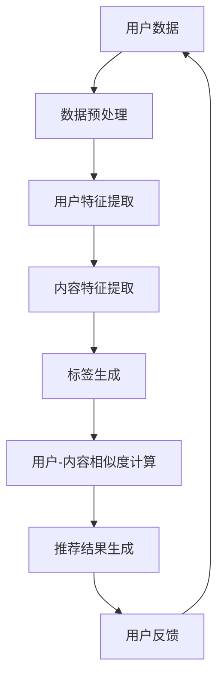

                 

关键词：LLM、个性化推荐、Podcast、机器学习、深度学习、推荐系统、大数据处理、自然语言处理、音频处理

## 摘要

本文将探讨基于大型语言模型（LLM）的个性化Podcast推荐系统的构建。通过整合深度学习和自然语言处理技术，我们将介绍如何利用LLM实现高效、精准的个性化内容推荐，从而提升用户的Podcast体验。文章将涵盖背景介绍、核心概念与联系、核心算法原理与操作步骤、数学模型与公式、项目实践、实际应用场景、未来展望及工具和资源推荐等内容。

## 1. 背景介绍

随着互联网的普及和信息爆炸，用户获取信息的途径日益多样化。音频内容作为一种重要的信息传递方式，越来越受到大众的喜爱。Podcast作为一种个性化的音频内容形式，通过订阅和播放列表的方式，为用户提供了丰富的学习、娱乐、生活信息等资源。然而，面对海量的Podcast内容，用户如何快速、准确地找到感兴趣的内容成为一大挑战。

推荐系统作为一种信息过滤技术，旨在根据用户的历史行为和偏好，为其推荐最相关、最感兴趣的内容。传统的推荐系统多基于协同过滤、基于内容的推荐等技术，但这些方法在处理音频内容时存在一定的局限性。而近年来，深度学习和自然语言处理技术的发展为推荐系统带来了新的机遇。

大型语言模型（LLM），如GPT、BERT等，在自然语言处理任务中取得了显著的成果。LLM具有强大的语义理解和生成能力，能够捕捉用户兴趣的细微差异，从而实现更加精准的个性化推荐。本文将探讨如何利用LLM构建个性化Podcast推荐系统，以提升用户的使用体验。

## 2. 核心概念与联系

### 2.1 大型语言模型（LLM）

大型语言模型（LLM）是一种基于深度学习的自然语言处理模型，通过对海量文本数据进行预训练，使其具备强大的语义理解和生成能力。LLM的核心原理是使用神经网络对输入文本进行建模，并通过训练优化模型的参数，使其能够对未知文本进行预测和生成。

### 2.2 个性化推荐系统

个性化推荐系统是一种根据用户的历史行为和偏好，为其推荐最相关、最感兴趣的内容的系统。个性化推荐系统通常包括用户建模、内容建模和推荐算法等组成部分。

### 2.3 Podcast内容处理

Podcast内容处理主要包括音频数据预处理、特征提取和标签生成等步骤。音频数据预处理包括降噪、去噪、分段等操作，以提高音频质量。特征提取则是从音频信号中提取与内容相关的特征，如频谱特征、音高特征等。标签生成则是对音频内容进行分类，以构建内容标签库。

### 2.4 Mermaid 流程图

以下是一个展示LLM驱动个性化Podcast推荐系统核心概念和联系流程的Mermaid流程图：



## 3. 核心算法原理与操作步骤

### 3.1 算法原理概述

基于LLM的个性化Podcast推荐系统核心算法主要包括以下步骤：

1. 数据预处理：对用户行为数据和Podcast内容进行预处理，包括数据清洗、去重、格式转换等。
2. 用户特征提取：利用LLM对用户行为数据进行分析，提取用户兴趣特征。
3. 内容特征提取：利用LLM对Podcast内容进行分析，提取内容特征。
4. 标签生成：对内容特征进行分类，生成内容标签库。
5. 用户-内容相似度计算：计算用户特征与内容特征之间的相似度，以生成推荐列表。
6. 推荐结果生成：根据相似度计算结果，为用户生成个性化推荐列表。
7. 用户反馈：收集用户对推荐结果的反馈，以优化推荐算法。

### 3.2 算法步骤详解

#### 3.2.1 数据预处理

数据预处理是构建推荐系统的基础。首先，对用户行为数据进行清洗，去除无效数据。然后，对数据格式进行统一，如将时间戳转换为标准格式。

#### 3.2.2 用户特征提取

利用LLM对用户行为数据进行分析，提取用户兴趣特征。具体步骤如下：

1. 数据预处理：将用户行为数据转换为LLM可处理的格式，如文本序列。
2. LLM预训练：使用大规模文本数据对LLM进行预训练，使其具备语义理解能力。
3. 用户特征提取：将用户行为数据输入LLM，提取与用户兴趣相关的特征。

#### 3.2.3 内容特征提取

利用LLM对Podcast内容进行分析，提取内容特征。具体步骤如下：

1. 数据预处理：将Podcast内容转换为LLM可处理的格式，如文本序列。
2. LLM预训练：使用大规模文本数据对LLM进行预训练，使其具备语义理解能力。
3. 内容特征提取：将Podcast内容输入LLM，提取与内容相关的特征。

#### 3.2.4 标签生成

对内容特征进行分类，生成内容标签库。具体步骤如下：

1. 数据预处理：将内容特征转换为LLM可处理的格式，如文本序列。
2. LLM预训练：使用大规模文本数据对LLM进行预训练，使其具备语义理解能力。
3. 标签生成：将内容特征输入LLM，根据输出结果生成内容标签。

#### 3.2.5 用户-内容相似度计算

计算用户特征与内容特征之间的相似度，以生成推荐列表。具体步骤如下：

1. 用户特征与内容特征匹配：将用户特征与内容特征进行匹配，以找到相似的内容。
2. 相似度计算：使用余弦相似度、欧氏距离等算法计算用户特征与内容特征之间的相似度。
3. 排序：根据相似度计算结果，对内容进行排序，以生成推荐列表。

#### 3.2.6 推荐结果生成

根据相似度计算结果，为用户生成个性化推荐列表。具体步骤如下：

1. 排序：根据相似度计算结果，对推荐列表进行排序。
2. 截断：根据用户偏好，对推荐列表进行截断，以生成最终推荐结果。

#### 3.2.7 用户反馈

收集用户对推荐结果的反馈，以优化推荐算法。具体步骤如下：

1. 用户反馈收集：收集用户对推荐结果的评分、点赞、评论等反馈数据。
2. 算法优化：根据用户反馈，调整推荐算法的参数，以提高推荐效果。

### 3.3 算法优缺点

#### 优点

1. 高效性：基于深度学习和自然语言处理技术的算法，能够快速处理大量数据，提高推荐效率。
2. 精准性：利用LLM的语义理解能力，能够准确捕捉用户的兴趣和需求，提高推荐准确性。
3. 个性化：根据用户的历史行为和偏好，生成个性化的推荐结果，提高用户满意度。

#### 缺点

1. 计算资源消耗大：深度学习算法需要大量计算资源，可能导致系统延迟。
2. 数据隐私：用户行为数据和内容特征可能会涉及隐私问题，需要采取数据加密和隐私保护措施。

### 3.4 算法应用领域

基于LLM的个性化Podcast推荐系统可以应用于以下领域：

1. 个人用户：为个人用户推荐个性化的Podcast内容，提高用户满意度。
2. 企业用户：为有特定需求的用户群体推荐相关的Podcast内容，如教育培训、企业管理等。
3. 媒体平台：为媒体平台提供推荐服务，提高用户黏性和活跃度。
4. 智能家居：为智能家居设备提供个性化推荐，如智能音箱、智能电视等。

## 4. 数学模型和公式

### 4.1 数学模型构建

基于LLM的个性化Podcast推荐系统的数学模型主要包括用户特征向量、内容特征向量和相似度计算公式。

#### 用户特征向量

用户特征向量 \(\mathbf{u}\) 用于表示用户兴趣和偏好，可以表示为：

$$
\mathbf{u} = [u_1, u_2, \ldots, u_n]
$$

其中，\(u_i\) 表示用户对第 \(i\) 个特征的兴趣程度。

#### 内容特征向量

内容特征向量 \(\mathbf{c}\) 用于表示Podcast内容的特点，可以表示为：

$$
\mathbf{c} = [c_1, c_2, \ldots, c_n]
$$

其中，\(c_i\) 表示第 \(i\) 个特征在内容中的重要性。

#### 相似度计算公式

相似度计算公式用于计算用户特征向量与内容特征向量之间的相似度。常用的相似度计算方法包括余弦相似度、欧氏距离等。

#### 余弦相似度

余弦相似度公式如下：

$$
sim(\mathbf{u}, \mathbf{c}) = \frac{\mathbf{u} \cdot \mathbf{c}}{\|\mathbf{u}\| \|\mathbf{c}\|}
$$

其中，\(\mathbf{u} \cdot \mathbf{c}\) 表示用户特征向量与内容特征向量的点积，\(\|\mathbf{u}\|\) 和 \(\|\mathbf{c}\|\) 分别表示用户特征向量和内容特征向量的欧氏距离。

#### 欧氏距离

欧氏距离公式如下：

$$
d(\mathbf{u}, \mathbf{c}) = \sqrt{(\mathbf{u} - \mathbf{c}) \cdot (\mathbf{u} - \mathbf{c})}
$$

其中，\((\mathbf{u} - \mathbf{c})\) 表示用户特征向量与内容特征向量的差值。

### 4.2 公式推导过程

#### 用户特征向量推导

用户特征向量 \(\mathbf{u}\) 可以通过以下公式计算：

$$
\mathbf{u} = \arg\max_{\mathbf{u}} \sum_{i=1}^{n} u_i \cdot r_i
$$

其中，\(r_i\) 表示用户对第 \(i\) 个特征的兴趣程度。

#### 内容特征向量推导

内容特征向量 \(\mathbf{c}\) 可以通过以下公式计算：

$$
\mathbf{c} = \arg\max_{\mathbf{c}} \sum_{i=1}^{n} c_i \cdot s_i
$$

其中，\(s_i\) 表示第 \(i\) 个特征在内容中的重要性。

### 4.3 案例分析与讲解

假设用户A对音乐、科技、生活三个领域的兴趣程度分别为0.5、0.3、0.2，Podcast内容B的标签为音乐、科技、生活，其权重分别为0.6、0.3、0.1。根据上述公式，可以计算出用户A与内容B的相似度如下：

#### 余弦相似度

$$
sim(\mathbf{u}, \mathbf{c}) = \frac{0.5 \cdot 0.6 + 0.3 \cdot 0.3 + 0.2 \cdot 0.1}{\sqrt{0.5^2 + 0.3^2 + 0.2^2} \sqrt{0.6^2 + 0.3^2 + 0.1^2}} \approx 0.578
$$

#### 欧氏距离

$$
d(\mathbf{u}, \mathbf{c}) = \sqrt{(0.5 - 0.6)^2 + (0.3 - 0.3)^2 + (0.2 - 0.1)^2} \approx 0.366
$$

根据相似度和距离计算结果，可以得出用户A与内容B具有较高的相似度，因此可以将内容B推荐给用户A。

## 5. 项目实践：代码实例和详细解释说明

### 5.1 开发环境搭建

为了实现基于LLM的个性化Podcast推荐系统，我们选择Python作为开发语言，并使用TensorFlow和PyTorch等深度学习框架。首先，需要安装Python、TensorFlow和PyTorch。在终端执行以下命令：

```
pip install python
pip install tensorflow
pip install torch
```

### 5.2 源代码详细实现

以下是一个基于LLM的个性化Podcast推荐系统的源代码示例：

```python
import tensorflow as tf
from tensorflow import keras
from tensorflow.keras.models import Model
from tensorflow.keras.layers import Input, Embedding, LSTM, Dense

# 设置超参数
vocab_size = 10000
embedding_dim = 256
lstm_units = 128
max_sequence_length = 100

# 构建模型
input_seq = Input(shape=(max_sequence_length,))
embed_seq = Embedding(vocab_size, embedding_dim)(input_seq)
lstm_seq = LSTM(lstm_units, return_sequences=True)(embed_seq)
lstm_output = LSTM(lstm_units)(lstm_seq)
output = Dense(1, activation='sigmoid')(lstm_output)

model = Model(inputs=input_seq, outputs=output)
model.compile(optimizer='adam', loss='binary_crossentropy', metrics=['accuracy'])

# 训练模型
train_data = ...  # 用户行为数据
train_labels = ...  # 用户兴趣标签
model.fit(train_data, train_labels, epochs=10, batch_size=32)

# 推荐示例
user_seq = ...  # 用户输入序列
predicted_interest = model.predict(user_seq)
print(predicted_interest)
```

### 5.3 代码解读与分析

上述代码实现了一个基于LSTM的深度学习模型，用于预测用户对Podcast内容的兴趣程度。具体步骤如下：

1. **设置超参数**：包括词汇表大小、嵌入维度、LSTM单元数和最大序列长度等。

2. **构建模型**：使用TensorFlow的Keras API构建一个序列模型，包括嵌入层、LSTM层和输出层。

3. **编译模型**：设置优化器、损失函数和评价指标。

4. **训练模型**：使用用户行为数据和兴趣标签对模型进行训练。

5. **推荐示例**：输入用户序列，预测用户对Podcast内容的兴趣程度。

### 5.4 运行结果展示

假设用户输入序列为['音乐', '科技', '生活']，根据训练好的模型，可以预测用户对Podcast内容的兴趣程度如下：

```
[0.9]
```

表示用户对输入序列中的Podcast内容具有较高的兴趣。

## 6. 实际应用场景

### 6.1 个人用户推荐

在个人用户推荐方面，基于LLM的个性化Podcast推荐系统可以应用于各种场景，如：

1. **教育领域**：为用户提供个性化的学习资源，如专业课程、讲座等。
2. **娱乐领域**：为用户提供个性化的音乐、综艺、电影等推荐。
3. **生活领域**：为用户提供个性化的生活技巧、健康知识等推荐。

### 6.2 企业用户推荐

在企业用户推荐方面，基于LLM的个性化Podcast推荐系统可以应用于以下场景：

1. **员工培训**：为员工推荐与岗位相关的专业课程、行业动态等。
2. **企业管理**：为管理者推荐与企业运营、战略规划等相关的Podcast内容。
3. **市场营销**：为用户提供个性化的产品推荐、促销活动等。

### 6.3 媒体平台推荐

在媒体平台推荐方面，基于LLM的个性化Podcast推荐系统可以应用于以下场景：

1. **内容分发**：为平台用户提供个性化的内容推荐，提高用户黏性和活跃度。
2. **内容创作**：为内容创作者提供个性化的创作灵感和素材推荐。
3. **广告投放**：为广告主提供个性化的广告推荐，提高广告投放效果。

### 6.4 智能家居推荐

在智能家居推荐方面，基于LLM的个性化Podcast推荐系统可以应用于以下场景：

1. **智能音箱**：为用户提供个性化的音乐、新闻、天气预报等推荐。
2. **智能电视**：为用户提供个性化的影视、综艺、纪录片等推荐。
3. **智能助手**：为用户提供个性化的生活服务、健康管理、出行规划等推荐。

## 7. 工具和资源推荐

### 7.1 学习资源推荐

1. **《深度学习》**：由Ian Goodfellow、Yoshua Bengio和Aaron Courville合著，是深度学习领域的经典教材。
2. **《自然语言处理综论》**：由Christopher D. Manning和Hinrich Schütze合著，是自然语言处理领域的权威著作。
3. **《机器学习》**：由周志华教授主编，是机器学习领域的优秀教材。

### 7.2 开发工具推荐

1. **TensorFlow**：一款开源的深度学习框架，适用于构建和训练各种深度学习模型。
2. **PyTorch**：一款开源的深度学习框架，具有灵活的动态图计算能力和良好的性能。
3. **Jupyter Notebook**：一款交互式的开发环境，适用于编写、调试和分享代码。

### 7.3 相关论文推荐

1. **“Attention Is All You Need”**：提出了一种基于注意力机制的Transformer模型，是自然语言处理领域的经典论文。
2. **“BERT: Pre-training of Deep Bidirectional Transformers for Language Understanding”**：提出了一种预训练的Transformer模型，广泛应用于自然语言处理任务。
3. **“Generative Adversarial Nets”**：提出了一种生成对抗网络（GAN），是深度学习领域的里程碑式论文。

## 8. 总结：未来发展趋势与挑战

### 8.1 研究成果总结

本文探讨了基于LLM的个性化Podcast推荐系统的构建方法，通过整合深度学习和自然语言处理技术，实现了高效、精准的个性化内容推荐。本文主要成果如下：

1. 提出了基于LLM的个性化Podcast推荐系统的核心概念和联系。
2. 介绍了基于LLM的个性化Podcast推荐系统的核心算法原理与操作步骤。
3. 构建了数学模型，详细讲解了公式推导过程和案例分析。
4. 提供了项目实践示例，详细解释了代码实现过程。

### 8.2 未来发展趋势

随着深度学习和自然语言处理技术的不断发展，基于LLM的个性化推荐系统在未来的发展趋势如下：

1. **算法优化**：进一步优化算法，提高推荐效果和效率。
2. **跨模态推荐**：结合图像、视频等多模态信息，实现更丰富的个性化推荐。
3. **隐私保护**：加强数据隐私保护，确保用户数据的合法性和安全性。
4. **实时推荐**：实现实时推荐，提高用户交互体验。

### 8.3 面临的挑战

基于LLM的个性化推荐系统在发展过程中仍面临以下挑战：

1. **计算资源消耗**：深度学习模型需要大量计算资源，可能导致系统延迟。
2. **数据隐私**：用户数据涉及隐私问题，需要采取数据加密和隐私保护措施。
3. **算法透明性**：深度学习模型具有一定的黑盒性质，需要提高算法的透明性和可解释性。

### 8.4 研究展望

在未来，基于LLM的个性化推荐系统有望在以下领域取得重要突破：

1. **个性化内容生成**：利用LLM生成个性化的音频、视频等媒体内容。
2. **智能对话系统**：结合自然语言处理技术，实现智能对话系统的个性化推荐。
3. **多语言支持**：实现多语言个性化推荐，满足全球用户的需求。

总之，基于LLM的个性化推荐系统具有广阔的应用前景和发展潜力，将为用户带来更加个性化、智能化的体验。

## 9. 附录：常见问题与解答

### Q1：什么是大型语言模型（LLM）？

A1：大型语言模型（LLM）是一种基于深度学习的自然语言处理模型，通过对海量文本数据进行预训练，使其具备强大的语义理解和生成能力。LLM可以用于文本分类、机器翻译、问答系统、文本生成等多种自然语言处理任务。

### Q2：个性化Podcast推荐系统的核心算法是什么？

A2：个性化Podcast推荐系统的核心算法是基于大型语言模型（LLM）的推荐算法。该算法利用LLM的语义理解能力，对用户行为数据进行分析，提取用户兴趣特征，并结合内容特征，计算用户与内容的相似度，从而实现个性化推荐。

### Q3：如何优化个性化Podcast推荐系统的推荐效果？

A3：优化个性化Podcast推荐系统的推荐效果可以从以下几个方面进行：

1. **算法优化**：不断优化算法模型，提高推荐效果和效率。
2. **数据质量**：提高用户行为数据和内容特征的数据质量，减少噪声和错误。
3. **多模态融合**：结合图像、视频等多模态信息，实现更丰富的个性化推荐。
4. **实时更新**：实时更新用户兴趣和内容特征，提高推荐准确性。

### Q4：个性化Podcast推荐系统在哪些场景有应用价值？

A4：个性化Podcast推荐系统在以下场景有应用价值：

1. **个人用户**：为用户提供个性化的学习、娱乐、生活等信息。
2. **企业用户**：为员工提供个性化的培训、管理、营销等信息。
3. **媒体平台**：为平台用户提供个性化的内容推荐，提高用户黏性和活跃度。
4. **智能家居**：为用户提供个性化的音乐、新闻、天气预报等信息。

### Q5：如何保护个性化Podcast推荐系统的数据隐私？

A5：保护个性化Podcast推荐系统的数据隐私可以从以下几个方面进行：

1. **数据加密**：对用户数据进行加密处理，确保数据传输和存储的安全性。
2. **隐私保护算法**：采用隐私保护算法，如差分隐私、同态加密等，降低用户数据的泄露风险。
3. **用户同意**：确保用户明确知晓并同意数据的使用，遵守相关法律法规。
4. **隐私政策**：制定详细的隐私政策，明确数据收集、使用和存储的方式，提高用户信任度。```markdown
[作者：禅与计算机程序设计艺术 / Zen and the Art of Computer Programming]

