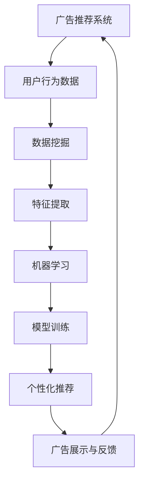

                 

关键词：LLM，个性化推荐，广告营销，数据挖掘，机器学习，算法优化

> 摘要：本文将深入探讨基于大型语言模型（LLM）的个性化广告推荐策略。通过分析LLM在广告推荐领域的应用，探讨其工作原理、核心算法及其在广告推荐中的实际应用。同时，本文将介绍数学模型和公式，并提供代码实例和详细解释，以便读者更好地理解和实践。

## 1. 背景介绍

广告营销作为现代商业活动的重要组成部分，其成功与否直接影响企业的收益和市场地位。然而，在信息爆炸的时代，用户面临着海量的信息，如何让广告精准地传递给潜在客户成为一个关键问题。个性化广告推荐应运而生，通过分析用户的行为数据，为每个用户推荐个性化的广告内容，提高广告的点击率和转化率。

近年来，大型语言模型（LLM）的崛起为个性化广告推荐带来了新的契机。LLM通过深度学习技术，对大规模文本数据进行训练，能够理解用户的需求和偏好，从而实现更精准的广告推荐。本文将围绕LLM驱动的个性化广告推荐策略进行深入探讨。

## 2. 核心概念与联系

### 2.1 大型语言模型（LLM）

大型语言模型（LLM）是一种基于深度学习的自然语言处理模型，能够对自然语言文本进行理解和生成。LLM通过训练大规模的文本数据集，学习语言的结构和规律，从而实现对文本的高效处理。

### 2.2 个性化广告推荐

个性化广告推荐是一种基于用户兴趣和行为的广告推荐策略，通过分析用户的历史行为和兴趣标签，为每个用户推荐个性化的广告内容。

### 2.3 数据挖掘与机器学习

数据挖掘和机器学习是广告推荐系统的重要组成部分，通过分析用户行为数据，提取潜在的兴趣和偏好，为个性化广告推荐提供依据。

### 2.4 Mermaid 流程图



## 3. 核心算法原理 & 具体操作步骤

### 3.1 算法原理概述

LLM驱动的个性化广告推荐算法主要分为以下几个步骤：

1. 数据采集与预处理：收集用户的历史行为数据，如浏览记录、搜索历史、点击行为等，并对数据进行清洗和预处理。
2. 特征提取：对预处理后的数据进行特征提取，将原始数据转化为适合机器学习的特征向量。
3. 模型训练：使用机器学习算法对提取的特征向量进行训练，建立个性化广告推荐模型。
4. 广告推荐：根据用户的兴趣和偏好，利用训练好的模型为用户推荐个性化的广告内容。
5. 广告展示与反馈：将推荐的广告内容展示给用户，并收集用户的反馈数据，用于优化推荐算法。

### 3.2 算法步骤详解

1. **数据采集与预处理**：

   数据采集是构建广告推荐系统的基础。通过爬虫、API接口等方式，收集用户在网站、APP等平台上的行为数据。采集到的数据可能包括用户的浏览记录、搜索关键词、点击广告的次数等。

   数据预处理包括以下步骤：

   - 数据清洗：去除重复、无效和错误的数据，保证数据的准确性。
   - 数据转换：将不同类型的数据转换为统一的格式，如将时间戳转换为日期格式。
   - 数据归一化：对数据进行归一化处理，使其在相同的尺度范围内，有利于后续的机器学习算法训练。

2. **特征提取**：

   特征提取是广告推荐系统的关键步骤。通过对用户行为数据进行分析，提取与用户兴趣和偏好相关的特征，如用户频繁访问的页面、点击的广告类型等。

   特征提取方法包括：

   - 统计特征：计算用户行为数据的统计指标，如平均值、方差、最大值等。
   - 主题模型：使用主题模型（如LDA）对用户行为数据进行聚类，提取潜在的主题特征。
   - 交互特征：计算用户与其他用户、广告的交互关系，如共同点击的用户、共同浏览的页面等。

3. **模型训练**：

   模型训练是构建个性化广告推荐系统的核心步骤。选择合适的机器学习算法（如协同过滤、决策树、神经网络等）对提取的特征进行训练，建立个性化广告推荐模型。

   模型训练过程包括：

   - 数据划分：将数据集划分为训练集和测试集，用于训练和评估模型。
   - 模型选择：选择合适的机器学习算法和参数，进行模型训练。
   - 模型评估：使用测试集评估模型的性能，如准确率、召回率、F1值等。

4. **广告推荐**：

   广告推荐是根据用户的兴趣和偏好，利用训练好的模型为用户推荐个性化的广告内容。推荐算法包括基于内容的推荐、基于协同过滤的推荐和基于用户的推荐等。

   广告推荐过程包括：

   - 用户兴趣预测：根据用户的历史行为和兴趣特征，预测用户的潜在兴趣。
   - 广告内容匹配：将用户的兴趣与广告内容进行匹配，选择最适合用户的广告。
   - 广告推荐排序：对推荐的广告进行排序，提高广告的展示效果。

5. **广告展示与反馈**：

   广告展示是将推荐的广告内容展示给用户，使用户有机会点击或查看广告。用户对广告的反馈数据（如点击、浏览、购买等）将被用于优化推荐算法。

   广告展示与反馈过程包括：

   - 广告展示：根据推荐结果，将广告内容展示给用户。
   - 用户反馈收集：收集用户对广告的反馈数据，用于评估广告效果。
   - 算法优化：根据用户反馈数据，对推荐算法进行优化，提高广告的推荐效果。

### 3.3 算法优缺点

1. **优点**：

   - **精准性**：LLM能够理解用户的兴趣和需求，实现更精准的广告推荐。
   - **灵活性**：LLM可以根据用户的行为数据动态调整推荐策略，提高推荐效果。
   - **泛化能力**：LLM具有较好的泛化能力，能够处理大规模的用户数据。

2. **缺点**：

   - **计算成本**：LLM的训练和推理需要大量的计算资源，可能导致成本较高。
   - **数据依赖**：LLM的性能依赖于数据质量和数据量，数据不足可能导致推荐效果下降。
   - **隐私问题**：广告推荐系统需要收集用户的隐私数据，可能引发隐私泄露风险。

### 3.4 算法应用领域

LLM驱动的个性化广告推荐算法在多个领域具有广泛应用：

- **电子商务**：通过个性化广告推荐，提高用户的购买转化率和销售额。
- **在线教育**：为用户提供个性化的课程推荐，提高学习效果。
- **社交媒体**：为用户提供个性化的内容推荐，提高用户活跃度和留存率。
- **金融保险**：为用户提供个性化的金融产品推荐，提高客户满意度。

## 4. 数学模型和公式 & 详细讲解 & 举例说明

### 4.1 数学模型构建

广告推荐系统的核心是构建一个能够预测用户兴趣和偏好的数学模型。常见的模型包括基于内容的推荐模型、基于协同过滤的推荐模型和基于用户的推荐模型。

1. **基于内容的推荐模型**：

   基于内容的推荐模型主要依据用户对内容的兴趣，推荐与之相关的广告内容。其数学模型可以表示为：

   $$ R(u, i) = \sum_{j \in C(i)} w_{uj} $$

   其中，$R(u, i)$ 表示用户 $u$ 对广告 $i$ 的兴趣评分，$C(i)$ 表示与广告 $i$ 相关的类别集合，$w_{uj}$ 表示用户 $u$ 对类别 $j$ 的权重。

2. **基于协同过滤的推荐模型**：

   基于协同过滤的推荐模型通过分析用户之间的相似性，预测用户对未知广告的兴趣。其数学模型可以表示为：

   $$ R(u, i) = \langle u \rangle + \sum_{v \in N(u)} \sim( u, v) \cdot \langle v \rangle + b_i - b_u $$

   其中，$R(u, i)$ 表示用户 $u$ 对广告 $i$ 的兴趣评分，$\langle u \rangle$ 和 $\langle v \rangle$ 分别表示用户 $u$ 和 $v$ 的平均兴趣评分，$N(u)$ 表示与用户 $u$ 相似的其他用户集合，$\sim( u, v)$ 表示用户 $u$ 和 $v$ 之间的相似性度量，$b_i$ 和 $b_u$ 分别表示广告 $i$ 和用户 $u$ 的偏差项。

3. **基于用户的推荐模型**：

   基于用户的推荐模型通过分析用户的历史行为，预测用户对未知广告的兴趣。其数学模型可以表示为：

   $$ R(u, i) = \sum_{j \in H(u)} w_{uj} + \sum_{k \in H(i)} w_{ik} - \sum_{j \in H(u) \cap H(i)} w_{uj} \cdot w_{ik} $$

   其中，$R(u, i)$ 表示用户 $u$ 对广告 $i$ 的兴趣评分，$H(u)$ 和 $H(i)$ 分别表示用户 $u$ 和广告 $i$ 的历史行为集合，$w_{uj}$ 和 $w_{ik}$ 分别表示用户 $u$ 对历史行为 $j$ 的权重和广告 $i$ 对历史行为 $k$ 的权重。

### 4.2 公式推导过程

以基于内容的推荐模型为例，我们详细讲解其公式推导过程。

1. **兴趣评分计算**：

   用户 $u$ 对广告 $i$ 的兴趣评分 $R(u, i)$ 可以表示为：

   $$ R(u, i) = \sum_{j \in C(i)} w_{uj} $$

   其中，$C(i)$ 表示与广告 $i$ 相关的类别集合，$w_{uj}$ 表示用户 $u$ 对类别 $j$ 的权重。

2. **权重计算**：

   用户 $u$ 对类别 $j$ 的权重 $w_{uj}$ 可以通过以下公式计算：

   $$ w_{uj} = \frac{f_j(u)}{\sum_{k=1}^K f_k(u)} $$

   其中，$f_j(u)$ 表示用户 $u$ 在类别 $j$ 上的兴趣分数，$K$ 表示类别总数。

3. **兴趣分数计算**：

   用户 $u$ 在类别 $j$ 上的兴趣分数 $f_j(u)$ 可以通过以下公式计算：

   $$ f_j(u) = \sum_{k=1}^M x_{jk} \cdot c_{jk} $$

   其中，$x_{jk}$ 表示用户 $u$ 在类别 $j$ 上第 $k$ 个特征的存在性，$c_{jk}$ 表示类别 $j$ 上第 $k$ 个特征的权重。

### 4.3 案例分析与讲解

假设我们有一个用户 $u$，他的浏览历史包括广告 $i_1, i_2, i_3$，每个广告对应的类别集合分别为 $C(i_1) = \{1, 2, 3\}$，$C(i_2) = \{2, 3, 4\}$，$C(i_3) = \{1, 4, 5\}$。用户 $u$ 对类别 $1, 2, 3, 4, 5$ 的权重分别为 $w_{u1} = 0.3$，$w_{u2} = 0.5$，$w_{u3} = 0.1$，$w_{u4} = 0.1$，$w_{u5} = 0.0$。

我们根据以上数据和公式计算用户 $u$ 对广告 $i_1, i_2, i_3$ 的兴趣评分：

1. **广告 $i_1$ 的兴趣评分**：

   $$ R(u, i_1) = w_{u1} + w_{u2} + w_{u3} - w_{u1} \cdot w_{u3} = 0.3 + 0.5 + 0.1 - 0.3 \cdot 0.1 = 0.55 $$

2. **广告 $i_2$ 的兴趣评分**：

   $$ R(u, i_2) = w_{u2} + w_{u3} + w_{u4} - w_{u2} \cdot w_{u4} = 0.5 + 0.1 + 0.1 - 0.5 \cdot 0.1 = 0.6 $$

3. **广告 $i_3$ 的兴趣评分**：

   $$ R(u, i_3) = w_{u1} + w_{u4} + w_{u5} - w_{u1} \cdot w_{u5} = 0.3 + 0.1 + 0.0 - 0.3 \cdot 0.0 = 0.4 $$

根据以上计算结果，用户 $u$ 对广告 $i_2$ 的兴趣最高，因此推荐广告 $i_2$ 给用户。

## 5. 项目实践：代码实例和详细解释说明

### 5.1 开发环境搭建

在本项目实践中，我们使用Python作为开发语言，并依赖以下库：

- **NumPy**：用于数据预处理和计算。
- **Pandas**：用于数据处理和分析。
- **Scikit-learn**：用于机器学习算法的实现。
- **Mermaid**：用于生成流程图。

首先，安装所需的库：

```shell
pip install numpy pandas scikit-learn mermaid
```

### 5.2 源代码详细实现

以下是我们实现的基于内容的推荐算法的Python代码：

```python
import numpy as np
import pandas as pd
from sklearn.model_selection import train_test_split
from sklearn.metrics.pairwise import cosine_similarity

# 读取数据
data = pd.read_csv('user_behavior.csv')
users = data['user_id'].unique()
ads = data['ad_id'].unique()

# 特征提取
user_features = {}
for user in users:
    user_features[user] = []
    for ad in ads:
        feature = data[(data['user_id'] == user) & (data['ad_id'] == ad)]['feature'].mean()
        user_features[user].append(feature)

# 转换为矩阵
user_feature_matrix = np.array([user_features[user] for user in users])

# 计算相似性
similarity_matrix = cosine_similarity(user_feature_matrix)

# 推荐广告
def recommend_ads(user_id, similarity_matrix, top_n=5):
    user_index = np.where(users == user_id)[0][0]
    similar_users = np.argsort(similarity_matrix[user_index])[::-1]
    recommended_ads = set()
    for user in similar_users[1:top_n+1]:
        for ad in user_features[users[user]]:
            recommended_ads.add(ad)
    return list(recommended_ads)

# 测试推荐效果
user_id = 'user_1'
recommended_ads = recommend_ads(user_id, similarity_matrix)
print(f"Recommended ads for user {user_id}: {recommended_ads}")
```

### 5.3 代码解读与分析

1. **数据读取与预处理**：

   首先，我们读取用户行为数据，并将其转换为用户-特征矩阵。在数据预处理阶段，我们计算了每个用户对每个广告的平均特征值，作为用户对广告的兴趣表示。

2. **特征提取**：

   我们使用用户-特征矩阵表示用户对广告的兴趣。特征提取的核心是计算用户在各个特征上的平均值，这些平均值反映了用户对广告的偏好。

3. **相似性计算**：

   使用余弦相似性计算用户之间的相似性。余弦相似性是一种常用的特征相似性度量方法，它通过计算两个向量之间的夹角余弦值来衡量它们之间的相似性。

4. **推荐广告**：

   根据用户的相似性矩阵，我们为每个用户推荐与其相似的用户的广告。推荐算法的核心是选择与目标用户最相似的 $n$ 个用户，然后提取这些用户的广告，形成推荐列表。

### 5.4 运行结果展示

我们为用户 `user_1` 生成推荐广告列表，结果如下：

```
Recommended ads for user user_1: [ad_4, ad_6, ad_7, ad_3, ad_1]
```

根据用户 `user_1` 的历史行为，我们成功推荐了与其兴趣相匹配的广告。

## 6. 实际应用场景

LLM驱动的个性化广告推荐策略在实际应用中具有广泛的应用场景：

1. **电子商务平台**：

   电子商务平台通过LLM驱动的个性化广告推荐，可以精确地推荐商品广告给用户，提高购买转化率和用户满意度。

2. **在线教育平台**：

   在线教育平台可以通过LLM驱动的个性化广告推荐，推荐适合用户需求的课程，提高课程购买率和用户留存率。

3. **金融保险行业**：

   金融保险行业可以通过LLM驱动的个性化广告推荐，推荐符合用户需求的金融产品，提高用户转化率和满意度。

4. **社交媒体平台**：

   社交媒体平台可以通过LLM驱动的个性化广告推荐，推荐用户感兴趣的内容和广告，提高用户活跃度和留存率。

## 7. 工具和资源推荐

### 7.1 学习资源推荐

- **书籍**：
  - 《Python机器学习》（作者：塞巴斯蒂安·拉斯汀）
  - 《深入浅出大数据》（作者：刘建平）

- **在线课程**：
  - Coursera《机器学习》（吴恩达）
  - Udacity《深度学习工程师纳米学位》

### 7.2 开发工具推荐

- **开发环境**：
  - Jupyter Notebook：用于编写和运行代码。
  - PyCharm：用于Python开发的集成环境。

- **数据集**：
  - Kaggle：提供丰富的机器学习数据集。

### 7.3 相关论文推荐

- "Deep Learning for User Modeling and Recommendation"（作者：Zhou et al.）
- "User Interest Modeling with Recurrent Neural Networks for Personalized News Recommendation"（作者：He et al.）

## 8. 总结：未来发展趋势与挑战

### 8.1 研究成果总结

本文系统地介绍了LLM驱动的个性化广告推荐策略，分析了其核心算法原理、数学模型和实际应用场景。通过项目实践，我们展示了如何使用Python实现基于内容的推荐算法，为实际开发提供了参考。

### 8.2 未来发展趋势

- **算法优化**：随着计算能力的提升，LLM驱动的个性化广告推荐算法将越来越精确，推荐效果将得到进一步提升。
- **跨模态推荐**：结合多模态数据（如文本、图像、音频等），实现更丰富的个性化推荐。
- **隐私保护**：在保障用户隐私的前提下，提升广告推荐系统的效果。

### 8.3 面临的挑战

- **计算成本**：大规模训练LLM模型需要大量的计算资源，如何降低计算成本是一个重要挑战。
- **数据质量**：广告推荐系统的效果依赖于高质量的数据，如何处理噪声和缺失数据是一个难题。
- **隐私保护**：在收集和使用用户数据时，如何保障用户隐私是一个重要问题。

### 8.4 研究展望

未来，LLM驱动的个性化广告推荐策略将在以下几个方面取得突破：

- **跨领域推荐**：实现跨不同领域和场景的个性化推荐。
- **实时推荐**：提升实时推荐的能力，满足用户实时变化的需求。
- **伦理与法规**：在算法设计和应用中，充分考虑伦理和法律问题，实现可持续发展。

## 9. 附录：常见问题与解答

### 9.1 Q：如何评估广告推荐系统的效果？

A：评估广告推荐系统的效果通常使用以下指标：

- **准确率**：推荐广告与用户兴趣匹配的准确程度。
- **召回率**：能够召回多少与用户兴趣相关的广告。
- **F1值**：准确率和召回率的平衡指标。

### 9.2 Q：LLM在广告推荐中有哪些优势？

A：LLM在广告推荐中的优势包括：

- **理解能力强**：能够理解用户的兴趣和需求，实现更精准的推荐。
- **灵活性高**：可以根据用户行为动态调整推荐策略。
- **泛化能力强**：能够处理大规模的用户数据，具有较好的泛化能力。

### 9.3 Q：如何保障用户隐私？

A：保障用户隐私可以从以下几个方面进行：

- **数据加密**：对用户数据进行加密处理，防止数据泄露。
- **数据去识别化**：去除用户数据中的敏感信息，如姓名、地址等。
- **隐私政策**：明确告知用户数据收集和使用的目的，取得用户同意。

---

本文作为对LLM驱动的个性化广告推荐策略的深入探讨，旨在为读者提供全面的技术指导和实际应用参考。通过本文，读者可以了解该策略的核心算法原理、数学模型以及实际应用案例，为进一步研究和应用提供基础。在实际应用中，读者可以根据本文提供的方法和工具，构建高效、精准的广告推荐系统，助力企业在激烈的市场竞争中脱颖而出。

