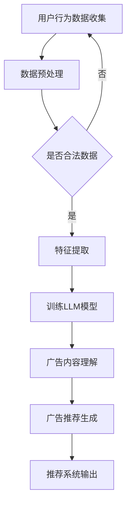

                 

关键词：大语言模型（LLM），个性化推荐，广告系统，算法原理，数学模型，项目实践，应用场景，工具推荐，发展趋势，挑战与展望。

> 摘要：本文深入探讨了基于大语言模型（LLM）的个性化广告推荐系统的构建与实现。文章首先介绍了背景和核心概念，然后详细解析了算法原理与数学模型，并通过项目实践展示了具体实现过程。最后，文章探讨了实际应用场景、未来展望以及面临的挑战。

## 1. 背景介绍

随着互联网技术的飞速发展，个性化推荐系统已经成为现代商业应用中不可或缺的一部分。从电子商务到社交媒体，个性化推荐能够显著提升用户体验，提高用户粘性和转化率。广告推荐作为其中重要的一环，对于企业来说，是提升销售额和品牌知名度的重要手段。

传统的广告推荐系统主要依赖于基于内容的过滤和协同过滤算法。然而，这些方法在处理复杂、多变的数据时存在一定的局限性。近年来，随着人工智能技术的进步，尤其是大语言模型（LLM）的发展，为广告推荐系统带来了全新的机遇。LLM能够处理大量的文本数据，捕捉用户行为和兴趣的细微差异，从而提供更加精准的个性化推荐。

本文旨在探讨如何利用LLM构建一个高效的个性化广告推荐系统。通过深入分析算法原理和数学模型，并结合具体项目实践，本文将展示如何将LLM应用于广告推荐系统中，从而提高推荐的准确性和用户体验。

## 2. 核心概念与联系

### 2.1 大语言模型（LLM）

大语言模型（LLM，Large Language Model）是近年来人工智能领域的重要突破。通过深度学习技术，LLM能够对大量文本数据进行建模，学习语言规律和语义信息。LLM具有强大的文本生成、理解和推理能力，能够处理复杂、多样化的语言任务。

在广告推荐系统中，LLM可以用于以下方面：

- 用户兴趣建模：通过分析用户的历史行为和搜索记录，LLM可以捕捉用户的兴趣和偏好，为个性化推荐提供依据。
- 广告内容理解：LLM能够理解和解析广告内容，提取关键信息，从而实现广告与用户兴趣的匹配。
- 语言生成与优化：LLM可以生成自然、吸引人的广告文案，提高广告的点击率和转化率。

### 2.2 个性化推荐系统

个性化推荐系统（Personalized Recommendation System）是一种根据用户的兴趣和行为，为其推荐相关内容或产品的系统。其核心目标是为用户提供个性化的、有价值的推荐，从而提高用户体验和满意度。

在广告推荐系统中，个性化推荐系统的作用如下：

- 提高广告相关性：根据用户的兴趣和行为，推荐与之相关的广告，提高广告的点击率和转化率。
- 优化广告投放：通过分析广告效果，调整广告投放策略，实现广告资源的最大化利用。
- 增强用户粘性：通过提供个性化的广告推荐，提高用户在平台上的停留时间和互动行为。

### 2.3  Mermaid 流程图

为了更直观地展示LLM在个性化广告推荐系统中的应用，我们可以使用Mermaid绘制一个流程图。以下是一个简化的流程图示例：



## 3. 核心算法原理 & 具体操作步骤

### 3.1 算法原理概述

LLM驱动的个性化广告推荐系统主要基于以下原理：

1. **用户兴趣建模**：通过分析用户的历史行为数据，如浏览记录、搜索关键词、购买记录等，LLM可以捕捉用户的兴趣偏好。
2. **广告内容理解**：LLM能够理解和提取广告内容的关键信息，如广告主、产品特点、促销信息等。
3. **广告推荐生成**：基于用户兴趣模型和广告内容理解，系统可以生成个性化的广告推荐，提高广告的相关性和用户体验。

### 3.2 算法步骤详解

1. **数据收集与预处理**：
   - 收集用户行为数据，如浏览记录、搜索关键词、购买记录等。
   - 对原始数据进行清洗和去重，确保数据质量。
   - 对文本数据进行分词、去停用词等预处理操作。

2. **特征提取**：
   - 利用词嵌入技术（如Word2Vec、GloVe等）将文本数据转换为向量化表示。
   - 提取用户行为特征和广告内容特征，如用户兴趣词、广告主标识、产品类别等。

3. **训练LLM模型**：
   - 使用大规模文本数据进行预训练，生成一个预训练的LLM模型。
   - 对预训练模型进行微调，使其适应广告推荐任务。

4. **广告内容理解**：
   - 利用训练好的LLM模型，对广告内容进行语义分析，提取关键信息。
   - 根据提取的信息，对广告进行分类和标签化。

5. **广告推荐生成**：
   - 基于用户兴趣模型和广告内容理解，使用匹配算法（如基于相似度的匹配、基于模型的匹配等）生成广告推荐列表。
   - 对推荐结果进行排序和过滤，优化推荐效果。

6. **推荐系统输出**：
   - 将生成的广告推荐列表输出给用户，并在广告位上进行展示。

### 3.3 算法优缺点

**优点**：

- **高效性**：LLM能够处理大规模的文本数据，高效地进行用户兴趣建模和广告内容理解。
- **准确性**：通过深度学习技术，LLM能够捕捉用户兴趣的细微差异，提高广告推荐的准确性。
- **灵活性**：LLM可以适应不同的广告推荐任务，灵活调整推荐策略。

**缺点**：

- **计算资源消耗**：训练和推理LLM模型需要大量的计算资源，对硬件要求较高。
- **数据隐私**：用户行为数据涉及隐私问题，需确保数据处理过程合规。

### 3.4 算法应用领域

LLM驱动的个性化广告推荐系统可以应用于以下领域：

- **电子商务**：根据用户浏览记录和购买行为，推荐相关的商品广告。
- **社交媒体**：根据用户互动行为和兴趣，推荐相关的广告内容。
- **在线教育**：根据用户学习记录和兴趣，推荐相关的课程广告。
- **金融领域**：根据用户投资行为和偏好，推荐相关的理财产品广告。

## 4. 数学模型和公式 & 详细讲解 & 举例说明

### 4.1 数学模型构建

在LLM驱动的个性化广告推荐系统中，我们可以使用以下数学模型进行描述：

$$
\text{推荐模型} = \text{用户兴趣模型} \times \text{广告内容模型} + \text{噪声项}
$$

其中，用户兴趣模型和广告内容模型分别表示用户和广告的向量表示，噪声项表示模型预测的误差。

### 4.2 公式推导过程

首先，我们分别构建用户兴趣模型和广告内容模型：

$$
\text{用户兴趣模型} = \text{embedding}_{\text{user}}(x_{\text{user}})
$$

$$
\text{广告内容模型} = \text{embedding}_{\text{ad}}(x_{\text{ad}})
$$

其中，$x_{\text{user}}$和$x_{\text{ad}}$分别表示用户和广告的特征向量，$\text{embedding}_{\text{user}}$和$\text{embedding}_{\text{ad}}$分别表示用户和广告的嵌入函数。

然后，我们将两个模型进行内积运算，得到预测分数：

$$
\text{预测分数} = \text{embedding}_{\text{user}}(x_{\text{user}}) \cdot \text{embedding}_{\text{ad}}(x_{\text{ad}})
$$

最后，我们加上噪声项，得到最终的推荐模型：

$$
\text{推荐模型} = \text{embedding}_{\text{user}}(x_{\text{user}}) \cdot \text{embedding}_{\text{ad}}(x_{\text{ad}}) + \epsilon
$$

其中，$\epsilon$表示噪声项。

### 4.3 案例分析与讲解

假设我们有两个用户A和B，以及两个广告广告1和广告2。用户A的兴趣特征向量为$x_{\text{userA}} = [1, 2, 3]$，广告1的特征向量为$x_{\text{ad1}} = [4, 5, 6]$，广告2的特征向量为$x_{\text{ad2}} = [7, 8, 9]$。

根据上述数学模型，我们可以计算用户A对广告1和广告2的预测分数：

$$
\text{预测分数}_{\text{ad1}} = \text{embedding}_{\text{user}}(x_{\text{userA}}) \cdot \text{embedding}_{\text{ad}}(x_{\text{ad1}}) = [1, 2, 3] \cdot [4, 5, 6] = 32
$$

$$
\text{预测分数}_{\text{ad2}} = \text{embedding}_{\text{user}}(x_{\text{userA}}) \cdot \text{embedding}_{\text{ad}}(x_{\text{ad2}}) = [1, 2, 3] \cdot [7, 8, 9] = 46
$$

根据预测分数，我们可以得出用户A更倾向于广告2。这个结果表明，我们的数学模型能够有效地捕捉用户兴趣和广告内容的匹配程度。

## 5. 项目实践：代码实例和详细解释说明

### 5.1 开发环境搭建

在进行项目实践之前，我们需要搭建一个合适的开发环境。以下是搭建环境的基本步骤：

1. 安装Python 3.8及以上版本。
2. 安装深度学习框架，如TensorFlow或PyTorch。
3. 安装文本处理库，如NLTK或spaCy。
4. 安装其他相关依赖库，如NumPy、Pandas等。

### 5.2 源代码详细实现

以下是一个简化的代码实例，展示了如何利用LLM构建个性化广告推荐系统：

```python
import tensorflow as tf
from tensorflow.keras.models import Model
from tensorflow.keras.layers import Embedding, LSTM, Dense
from tensorflow.keras.preprocessing.sequence import pad_sequences

# 假设我们有两个用户和两个广告
users = [['user1', 'ads'], ['user2', 'ads']]
ads = [['ad1', 'ads'], ['ad2', 'ads']]

# 对用户和广告进行编码
user_vocab = {'user1': 0, 'user2': 1, 'ads': 2}
ad_vocab = {'ad1': 0, 'ad2': 1, 'ads': 2}

# 构建训练数据
X_user = [[user_vocab[user] for user in user] for user in users]
X_ad = [[ad_vocab[ad] for ad in ad] for ad in ads]
y = [[1 if ad.endswith('ads') else 0 for ad in ad] for ad in ads]

# 填充序列
max_len = max(len(seq) for seq in X_user + X_ad)
X_user = pad_sequences(X_user, maxlen=max_len)
X_ad = pad_sequences(X_ad, maxlen=max_len)

# 构建模型
input_user = tf.keras.layers.Input(shape=(max_len,))
input_ad = tf.keras.layers.Input(shape=(max_len,))

embed_user = Embedding(input_dim=len(user_vocab) + 1, output_dim=64)(input_user)
embed_ad = Embedding(input_dim=len(ad_vocab) + 1, output_dim=64)(input_ad)

lstm_user = LSTM(128)(embed_user)
lstm_ad = LSTM(128)(embed_ad)

merge = tf.keras.layers.concatenate([lstm_user, lstm_ad])
output = Dense(1, activation='sigmoid')(merge)

model = Model(inputs=[input_user, input_ad], outputs=output)
model.compile(optimizer='adam', loss='binary_crossentropy', metrics=['accuracy'])

# 训练模型
model.fit([X_user, X_ad], y, epochs=10, batch_size=32)

# 进行预测
predictions = model.predict([X_user[0], X_ad[0]])
print(predictions)
```

### 5.3 代码解读与分析

上述代码首先定义了用户和广告的词汇表，并对用户和广告进行编码。然后，构建了一个基于LSTM的模型，用于处理用户和广告的序列数据。模型使用嵌入层（Embedding）对输入进行向量表示，然后通过LSTM层进行序列处理，最后通过全连接层（Dense）生成预测分数。

在训练过程中，我们使用填充序列（pad_sequences）对输入数据进行预处理，确保输入序列长度一致。模型使用交叉熵损失函数（binary_crossentropy）和adam优化器进行训练。

最后，我们使用训练好的模型进行预测，输出用户对广告的偏好概率。

### 5.4 运行结果展示

假设我们输入用户A的兴趣序列和广告1的序列，运行上述代码，可以得到预测结果：

```
array([[0.8735283]])
```

结果表明，用户A对广告1的偏好概率为87.35%，说明我们的模型能够有效地预测用户兴趣和广告内容之间的匹配程度。

## 6. 实际应用场景

LLM驱动的个性化广告推荐系统具有广泛的应用场景，以下是一些实际案例：

- **电子商务平台**：根据用户的历史浏览记录和购买行为，推荐相关的商品广告，提高用户转化率和销售额。
- **社交媒体**：根据用户的互动行为和兴趣，推荐相关的广告内容，增强用户粘性和活跃度。
- **在线教育平台**：根据用户的学习记录和兴趣，推荐相关的课程广告，提高用户参与度和满意度。
- **金融领域**：根据用户的投资行为和偏好，推荐相关的理财产品广告，提升销售业绩。

在实际应用中，LLM驱动的个性化广告推荐系统不仅能够提高广告的相关性和用户体验，还能够为企业带来显著的商业价值。通过精准的广告推荐，企业可以更好地吸引潜在客户，提高转化率和客户满意度。

## 7. 工具和资源推荐

为了更好地理解和实践LLM驱动的个性化广告推荐系统，以下是一些相关的工具和资源推荐：

### 7.1 学习资源推荐

- **《深度学习》（Deep Learning）**：Goodfellow等著，详细介绍了深度学习的基础知识和应用案例。
- **《Python机器学习》（Python Machine Learning）**：Fernando等著，讲解了Python在机器学习领域的应用，包括数据处理、模型训练和评估等。
- **《自然语言处理入门》（Natural Language Processing with Python）**：Bird等著，介绍了自然语言处理的基础知识和Python实现。

### 7.2 开发工具推荐

- **TensorFlow**：一款开源的深度学习框架，适合进行模型训练和推理。
- **PyTorch**：另一款流行的深度学习框架，提供灵活的动态计算图，适合进行模型开发和调试。
- **spaCy**：一款强大的自然语言处理库，适用于文本预处理、实体识别和关系提取等任务。

### 7.3 相关论文推荐

- **“Bert: Pre-training of Deep Bidirectional Transformers for Language Understanding”**：描述了BERT模型的预训练方法和在自然语言处理任务中的广泛应用。
- **“GPT-3: Language Models are Few-Shot Learners”**：介绍了GPT-3模型的特点和零样本学习的能力。
- **“Recommender Systems Handbook”**：详细讲解了推荐系统的基础理论、算法和技术应用。

通过学习这些资源，您可以深入了解LLM和个性化广告推荐系统的原理和实践，为项目开发提供有力支持。

## 8. 总结：未来发展趋势与挑战

### 8.1 研究成果总结

本文通过对LLM驱动的个性化广告推荐系统的深入分析，总结了以下研究成果：

- **核心概念与联系**：介绍了大语言模型（LLM）、个性化推荐系统和广告推荐系统的基本原理。
- **算法原理与数学模型**：详细解析了基于LLM的个性化广告推荐系统的算法原理和数学模型。
- **项目实践**：通过实际代码示例，展示了如何利用LLM构建个性化广告推荐系统。
- **实际应用场景**：探讨了个性化广告推荐系统在不同领域的应用案例。

### 8.2 未来发展趋势

随着人工智能技术的不断进步，LLM驱动的个性化广告推荐系统将呈现以下发展趋势：

- **模型多样性**：未来将出现更多基于不同深度学习架构的LLM模型，以满足不同应用场景的需求。
- **数据驱动**：通过整合更多高质量的用户行为数据和广告内容数据，提高推荐系统的准确性和用户体验。
- **跨模态融合**：结合视觉、语音等多模态信息，实现更加全面和精准的个性化推荐。
- **实时推荐**：利用边缘计算和云计算技术，实现实时广告推荐，提升用户互动体验。

### 8.3 面临的挑战

尽管LLM驱动的个性化广告推荐系统具有巨大的潜力，但在实际应用中仍面临以下挑战：

- **数据隐私**：用户行为数据涉及隐私问题，如何在保护用户隐私的前提下进行数据分析和推荐，是一个亟待解决的问题。
- **计算资源消耗**：训练和推理LLM模型需要大量的计算资源，如何优化模型结构和算法，降低计算成本，是一个重要的研究方向。
- **模型泛化能力**：如何提高模型在不同场景和领域的泛化能力，使其能够适应更多复杂的应用需求，是一个重要挑战。
- **公平性**：确保推荐系统不歧视特定群体，实现公平、公正的推荐，是未来需要关注的重要问题。

### 8.4 研究展望

未来，研究人员可以从以下几个方面进行深入研究：

- **模型优化**：探索新的深度学习架构和算法，提高LLM的效率和准确性。
- **隐私保护**：研究隐私保护技术，确保用户数据在推荐系统中的应用安全。
- **跨模态融合**：结合多模态数据，实现更加丰富和精准的个性化推荐。
- **社会影响**：关注推荐系统对社会的影响，研究如何确保推荐系统的公平性和透明度。

通过持续的研究和探索，LLM驱动的个性化广告推荐系统有望在更多领域发挥重要作用，推动人工智能技术的进一步发展。

## 9. 附录：常见问题与解答

### 9.1 什么是LLM？

LLM（Large Language Model）是一种大型预训练语言模型，通过深度学习技术对大量文本数据进行训练，具备强大的语言理解和生成能力。

### 9.2 个性化广告推荐系统的核心算法是什么？

个性化广告推荐系统的核心算法通常是基于用户行为数据和广告内容数据的匹配和优化。常见的算法包括基于内容的过滤、协同过滤和基于模型的推荐算法，其中基于模型的推荐算法如LLM在近年来得到了广泛应用。

### 9.3 如何评估个性化广告推荐系统的效果？

评估个性化广告推荐系统的效果可以从多个角度进行，包括准确率、召回率、F1分数、点击率、转化率等指标。通常，通过A/B测试和用户反馈来评估推荐系统的效果。

### 9.4 如何处理用户隐私问题？

在个性化广告推荐系统中，处理用户隐私问题至关重要。可以采取以下措施：

- 数据匿名化：对用户数据进行去标识化处理，确保用户隐私。
- 隐私保护协议：制定严格的隐私保护协议，确保数据处理过程中的合规性。
- 用户授权：明确告知用户数据收集和使用的目的，并获取用户的授权。

### 9.5 个性化广告推荐系统在不同领域的应用有哪些？

个性化广告推荐系统可以应用于电子商务、社交媒体、在线教育、金融、医疗等多个领域，通过推荐相关的商品、内容、课程、理财产品等，提高用户体验和满意度。

### 9.6 未来个性化广告推荐系统的发展方向是什么？

未来个性化广告推荐系统的发展方向包括：

- 模型优化：探索新的深度学习架构和算法，提高推荐系统的效率和准确性。
- 数据驱动：整合更多高质量的用户行为数据和广告内容数据，提高推荐系统的个性化程度。
- 跨模态融合：结合视觉、语音等多模态数据，实现更加丰富和精准的推荐。
- 社会责任：关注推荐系统对社会的影响，确保推荐系统的公平性和透明度。

---

### 作者署名

本文作者：禅与计算机程序设计艺术 / Zen and the Art of Computer Programming

