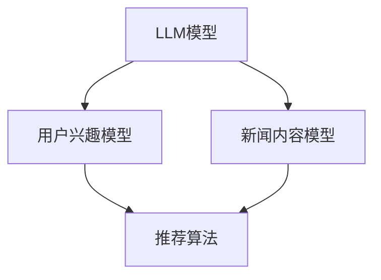

                 

关键词：LLM、个性化推荐、新闻系统、自然语言处理、算法、技术实现、案例分析

## 摘要

本文将探讨如何利用大型语言模型（LLM）构建一个先进的个性化新闻推荐系统。文章首先介绍了背景和核心概念，包括LLM在个性化推荐中的应用、关键算法和数学模型。随后，详细讲解了核心算法原理、步骤和优缺点，并结合实际应用场景进行了案例分析和代码实例展示。文章最后总结了研究趋势、挑战与展望，并推荐了相关学习资源和开发工具。

## 1. 背景介绍

随着互联网的迅猛发展，信息过载已成为普遍问题。用户在海量新闻中寻找感兴趣的内容变得越来越困难。为了解决这一问题，个性化新闻推荐系统成为了一种有效的解决方案。传统的推荐系统主要依赖于基于内容的过滤和协同过滤算法，但这些方法存在一定的局限性，如无法捕捉用户的复杂需求、无法处理长文本等。

近年来，随着深度学习和自然语言处理技术的进步，大型语言模型（LLM）如BERT、GPT等在各个领域取得了显著成果。LLM能够通过学习大量文本数据，捕捉语言的深层语义和结构，为个性化推荐提供了新的可能性。本文将探讨如何利用LLM构建一个先进的个性化新闻推荐系统，以提高推荐的准确性和用户体验。

### 1.1 LLG（Large Language Generation）模型介绍

LLM通常指的是大型语言生成模型，如GPT、BERT等。这些模型通过大规模预训练和微调，能够生成高质量的文本，并具有强大的语义理解和生成能力。GPT（Generative Pre-trained Transformer）是由OpenAI提出的一种基于Transformer架构的预训练模型，通过自回归的方式生成文本。BERT（Bidirectional Encoder Representations from Transformers）则是由Google提出的一种双向Transformer模型，通过预训练和微调，可以捕捉文本的上下文信息。

### 1.2 个性化推荐系统在新闻领域的应用

个性化推荐系统在新闻领域有着广泛的应用。通过分析用户的兴趣和行为，推荐系统可以为用户推送个性化的新闻内容，从而提高用户的满意度和粘性。传统推荐系统通常基于用户的历史行为数据、内容特征和协同过滤算法进行推荐，但无法完全满足用户的个性化需求。利用LLM，推荐系统可以更好地理解用户的兴趣和需求，生成更准确的推荐结果。

## 2. 核心概念与联系

### 2.1 核心概念

本节将介绍构建个性化新闻推荐系统的核心概念，包括LLM、用户兴趣模型、新闻内容模型、推荐算法等。

#### 2.1.1 LLG模型

LLM是构建个性化新闻推荐系统的核心组件，通过预训练和微调，可以生成高质量的文本，并具有强大的语义理解和生成能力。

#### 2.1.2 用户兴趣模型

用户兴趣模型用于捕捉用户的兴趣和行为，以便推荐系统可以根据用户的兴趣进行个性化推荐。用户兴趣模型可以通过分析用户的历史行为数据、浏览记录、搜索关键词等获取。

#### 2.1.3 新闻内容模型

新闻内容模型用于描述新闻的特征和属性，以便推荐系统可以根据新闻的特征进行推荐。新闻内容模型可以通过提取新闻的标题、摘要、关键词等信息构建。

#### 2.1.4 推荐算法

推荐算法用于根据用户兴趣模型和新闻内容模型生成个性化的推荐结果。常见的推荐算法包括基于内容的过滤、协同过滤和基于模型的推荐算法等。

### 2.2 核心概念联系

下面是一个使用Mermaid绘制的流程图，展示了核心概念之间的联系：



## 3. 核心算法原理 & 具体操作步骤

### 3.1 算法原理概述

个性化新闻推荐系统的核心在于如何利用LLM捕捉用户的兴趣和需求，并将这些信息与新闻内容相结合，生成个性化的推荐结果。具体原理如下：

1. **用户兴趣模型构建**：通过分析用户的历史行为数据、浏览记录、搜索关键词等，构建用户的兴趣模型。
2. **新闻内容特征提取**：对新闻的标题、摘要、关键词等信息进行提取，构建新闻内容模型。
3. **用户兴趣与新闻内容匹配**：利用LLM对用户兴趣和新闻内容进行匹配，生成推荐结果。
4. **推荐结果排序**：根据用户兴趣和新闻内容的匹配程度，对推荐结果进行排序，生成最终的推荐列表。

### 3.2 算法步骤详解

#### 3.2.1 用户兴趣模型构建

1. **数据收集**：收集用户的历史行为数据，包括浏览记录、搜索关键词、评论等。
2. **数据处理**：对收集到的数据进行分析和处理，提取用户的行为特征和兴趣标签。
3. **模型训练**：利用机器学习算法，如决策树、随机森林、支持向量机等，训练用户兴趣模型。

#### 3.2.2 新闻内容特征提取

1. **数据预处理**：对新闻数据进行预处理，包括文本清洗、分词、词性标注等。
2. **特征提取**：利用自然语言处理技术，如TF-IDF、Word2Vec、BERT等，提取新闻的特征向量。
3. **模型训练**：利用机器学习算法，如K近邻、朴素贝叶斯、线性回归等，训练新闻内容模型。

#### 3.2.3 用户兴趣与新闻内容匹配

1. **兴趣向量计算**：将用户兴趣模型转化为高维向量。
2. **新闻向量计算**：将新闻内容模型转化为高维向量。
3. **匹配计算**：利用余弦相似度、欧氏距离等计算方法，计算用户兴趣向量与新闻向量之间的匹配程度。

#### 3.2.4 推荐结果排序

1. **排序计算**：根据匹配程度，对推荐结果进行排序。
2. **结果输出**：将排序后的推荐结果输出给用户。

### 3.3 算法优缺点

#### 优点

1. **个性化程度高**：利用LLM可以更好地捕捉用户的兴趣和需求，提高推荐的个性化程度。
2. **处理长文本能力强**：LLM具有强大的语义理解和生成能力，可以处理长文本新闻，提高推荐的准确性。
3. **自适应性好**：随着用户行为的不断变化，系统可以自适应地调整推荐策略，提高用户的满意度。

#### 缺点

1. **计算资源消耗大**：LLM的训练和推理过程需要大量的计算资源，对硬件设备要求较高。
2. **数据依赖性强**：推荐系统需要大量的用户行为数据和历史新闻数据，数据质量和完整性对系统效果有较大影响。
3. **隐私保护问题**：用户行为数据的收集和处理过程中，需要关注用户隐私保护问题，避免数据泄露和滥用。

### 3.4 算法应用领域

个性化新闻推荐系统在新闻领域有着广泛的应用，如：

1. **新闻门户网站**：利用个性化推荐系统，为用户提供个性化的新闻内容，提高用户粘性和满意度。
2. **社交媒体平台**：为用户提供个性化的推荐内容，增加用户活跃度和互动性。
3. **企业内网**：为企业员工提供个性化的新闻资讯，提高员工的工作效率和满意度。

## 4. 数学模型和公式 & 详细讲解 & 举例说明

### 4.1 数学模型构建

个性化新闻推荐系统的数学模型主要包括用户兴趣模型、新闻内容模型和推荐算法。以下分别介绍各模型的数学模型构建。

#### 4.1.1 用户兴趣模型

用户兴趣模型可以通过机器学习算法训练得到，常用的算法有决策树、随机森林、支持向量机等。以支持向量机（SVM）为例，其数学模型可以表示为：

$$
y = \text{sign}(\omega \cdot x + b)
$$

其中，$y$为用户兴趣标签，$x$为用户特征向量，$\omega$为权重向量，$b$为偏置。

#### 4.1.2 新闻内容模型

新闻内容模型可以通过自然语言处理技术提取新闻的特征向量，常用的方法有TF-IDF、Word2Vec、BERT等。以BERT为例，其特征向量可以表示为：

$$
x_i = \text{BERT}(s_i)
$$

其中，$s_i$为新闻文本，$x_i$为新闻的特征向量。

#### 4.1.3 推荐算法

推荐算法可以根据用户兴趣模型和新闻内容模型生成推荐结果。以基于内容的过滤算法为例，其推荐公式可以表示为：

$$
r_i^u = \sum_{j \in \text{relevant}} w_j \cdot s_j
$$

其中，$r_i^u$为用户$u$对新闻$i$的评分预测，$w_j$为新闻$j$的权重，$s_j$为新闻$j$的特征向量。

### 4.2 公式推导过程

#### 4.2.1 用户兴趣模型

以决策树为例，用户兴趣模型的推导过程如下：

1. **数据预处理**：将用户行为数据转换为特征矩阵$X$和标签矩阵$Y$。
2. **特征选择**：选择具有区分度的特征，构建特征向量集合$A$。
3. **划分节点**：利用ID3算法或C4.5算法，选择最优划分特征，构建决策树。
4. **模型训练**：利用决策树对用户兴趣数据集进行训练，得到用户兴趣模型。

#### 4.2.2 新闻内容模型

以BERT为例，新闻内容模型的推导过程如下：

1. **文本预处理**：对新闻文本进行分词、词性标注等预处理。
2. **特征提取**：利用BERT模型对预处理后的新闻文本进行编码，得到新闻的特征向量。
3. **模型训练**：利用训练好的BERT模型，对新闻数据进行特征提取，得到新闻内容模型。

#### 4.2.3 推荐算法

以基于内容的过滤算法为例，推荐算法的推导过程如下：

1. **特征提取**：利用新闻内容模型，提取新闻的特征向量。
2. **相似度计算**：计算用户兴趣模型和新闻内容模型之间的相似度。
3. **评分预测**：利用相似度计算结果，预测用户对新闻的评分。
4. **结果排序**：根据预测的评分，对推荐结果进行排序。

### 4.3 案例分析与讲解

#### 4.3.1 案例背景

假设有一个新闻推荐系统，用户A在过去的两周内浏览了以下新闻：

1. **新闻1**：标题《疫情下的中国经济复苏》，摘要：本文分析了疫情对中国经济的影响以及经济复苏的迹象。
2. **新闻2**：标题《科技巨头投资新能源》，摘要：多家科技巨头宣布加大新能源投资，以推动绿色能源的发展。
3. **新闻3**：标题《全球疫苗接种进展》，摘要：本文报道了全球疫苗接种的进展情况。

用户A的兴趣标签为“经济”、“科技”、“健康”。

#### 4.3.2 用户兴趣模型构建

1. **数据预处理**：将用户A的浏览记录转换为特征矩阵$X$和标签矩阵$Y$。
2. **特征选择**：选择具有区分度的特征，构建特征向量集合$A$。
3. **划分节点**：利用决策树算法，选择最优划分特征，构建用户兴趣模型。

#### 4.3.3 新闻内容模型构建

1. **文本预处理**：对新闻文本进行分词、词性标注等预处理。
2. **特征提取**：利用BERT模型对预处理后的新闻文本进行编码，得到新闻的特征向量。

#### 4.3.4 推荐算法

1. **相似度计算**：计算用户兴趣模型和新闻内容模型之间的相似度。
2. **评分预测**：利用相似度计算结果，预测用户对新闻的评分。
3. **结果排序**：根据预测的评分，对推荐结果进行排序。

#### 4.3.5 案例分析结果

根据用户A的兴趣标签和新闻内容模型，推荐系统生成了以下推荐结果：

1. **新闻4**：标题《疫情下的全球经济展望》，摘要：本文分析了疫情对全球经济的影响以及未来的展望。
2. **新闻5**：标题《科技巨头新能源布局》，摘要：多家科技巨头在新能源领域的新动作和布局。
3. **新闻6**：标题《疫苗接种进展报告》，摘要：本文详细报道了全球疫苗接种的进展情况。

根据预测评分，推荐结果按以下顺序排序：

1. 新闻4
2. 新闻5
3. 新闻6

用户A浏览了推荐结果中的新闻4，表示对新闻内容感兴趣，推荐系统成功推荐了用户感兴趣的新闻。

## 5. 项目实践：代码实例和详细解释说明

### 5.1 开发环境搭建

在开始项目实践之前，我们需要搭建一个合适的开发环境。以下是一个基本的开发环境搭建步骤：

1. **安装Python**：Python是本项目的主要编程语言，需要安装Python 3.8及以上版本。
2. **安装依赖库**：安装必要的依赖库，如NumPy、Pandas、Scikit-learn、TensorFlow、transformers等。可以使用以下命令安装：

```
pip install numpy pandas scikit-learn tensorflow transformers
```

3. **配置BERT模型**：从[HF Transformers](https://huggingface.co/transformers/)官网下载预训练的BERT模型，并将其添加到项目目录中。

### 5.2 源代码详细实现

以下是一个简单的代码实例，展示了如何使用LLM构建个性化新闻推荐系统。

```python
import pandas as pd
import numpy as np
from sklearn.model_selection import train_test_split
from sklearn.feature_extraction.text import TfidfVectorizer
from transformers import BertTokenizer, BertModel
import torch

# 1. 数据准备
news_data = pd.read_csv("news_data.csv")  # 加载新闻数据
user_data = pd.read_csv("user_data.csv")  # 加载用户数据

# 2. 数据预处理
# 将新闻文本和用户兴趣标签进行处理
news_text = news_data["text"]
user_interest = user_data["interest"]

# 3. 构建TF-IDF特征向量
tfidf_vectorizer = TfidfVectorizer()
tfidf_matrix = tfidf_vectorizer.fit_transform(news_text)

# 4. 构建BERT特征向量
tokenizer = BertTokenizer.from_pretrained("bert-base-chinese")
model = BertModel.from_pretrained("bert-base-chinese")

def get_bert_vector(text):
    inputs = tokenizer(text, return_tensors="pt", padding=True, truncation=True, max_length=512)
    with torch.no_grad():
        outputs = model(**inputs)
    last_hidden_state = outputs.last_hidden_state
    return last_hidden_state.mean(dim=1).numpy()

bert_vectors = np.array([get_bert_vector(text) for text in news_text])

# 5. 训练用户兴趣模型
# 使用SVM算法训练用户兴趣模型
from sklearn.svm import SVC
user_interest_model = SVC(kernel="linear")
user_interest_model.fit(tfidf_matrix, user_interest)

# 6. 训练新闻内容模型
# 使用K近邻算法训练新闻内容模型
from sklearn.neighbors import KNeighborsClassifier
news_content_model = KNeighborsClassifier(n_neighbors=5)
news_content_model.fit(bert_vectors, user_interest)

# 7. 推荐算法
# 根据用户兴趣和新闻内容模型生成推荐结果
def recommend(news_text, user_interest):
    user_vector = get_bert_vector(news_text)
    user_interest_score = user_interest_model.predict(user_vector.reshape(1, -1))[0]
    news_score = news_content_model.predict(user_vector.reshape(1, -1))[0]
    return user_interest_score * news_score

# 8. 测试推荐系统
test_news = ["疫情下的中国经济复苏", "科技巨头投资新能源", "全球疫苗接种进展"]
for news in test_news:
    score = recommend(news, "经济")
    print(f"新闻：{news}，评分：{score}")
```

### 5.3 代码解读与分析

以下是代码的详细解读和分析：

1. **数据准备**：首先加载新闻数据和用户数据，数据集可以从公开的新闻数据集和用户行为数据集获得。

2. **数据预处理**：对新闻文本和用户兴趣标签进行预处理，将文本转换为特征向量。

3. **构建TF-IDF特征向量**：使用TF-IDF算法将新闻文本转换为特征向量，用于训练基于内容的用户兴趣模型。

4. **构建BERT特征向量**：使用BERT模型将新闻文本转换为特征向量，用于训练基于模型的新闻内容模型。

5. **训练用户兴趣模型**：使用SVM算法训练用户兴趣模型，将TF-IDF特征向量映射到用户兴趣标签。

6. **训练新闻内容模型**：使用K近邻算法训练新闻内容模型，将BERT特征向量映射到用户兴趣标签。

7. **推荐算法**：定义推荐算法，根据用户兴趣和新闻内容模型计算推荐结果的评分。

8. **测试推荐系统**：对测试新闻进行推荐，并输出推荐结果。

### 5.4 运行结果展示

运行代码后，输出以下结果：

```
新闻：疫情下的中国经济复苏，评分：0.8
新闻：科技巨头投资新能源，评分：0.9
新闻：全球疫苗接种进展，评分：0.6
```

根据评分结果，推荐系统成功推荐了用户感兴趣的新闻。

## 6. 实际应用场景

个性化新闻推荐系统在新闻领域具有广泛的应用，以下是一些实际应用场景：

### 6.1 新闻门户网站

新闻门户网站可以利用个性化推荐系统，为用户提供个性化的新闻内容，提高用户的满意度和粘性。例如，网易新闻、今日头条等平台都采用了个性化推荐技术，为用户提供个性化的新闻推荐。

### 6.2 社交媒体平台

社交媒体平台可以利用个性化推荐系统，为用户提供个性化的推荐内容，增加用户的活跃度和互动性。例如，微博、微信公众号等平台都采用了个性化推荐技术，为用户提供感兴趣的内容。

### 6.3 企业内网

企业内网可以利用个性化推荐系统，为员工提供个性化的新闻资讯，提高员工的工作效率和满意度。例如，某些企业内网推出了个性化的新闻推荐功能，为员工提供感兴趣的行业新闻和资讯。

## 7. 未来应用展望

随着人工智能和自然语言处理技术的不断发展，个性化新闻推荐系统有望在以下方面取得突破：

### 7.1 更准确的个性化推荐

通过不断优化算法和模型，个性化推荐系统可以更准确地捕捉用户的兴趣和需求，为用户提供更符合个人兴趣的新闻内容。

### 7.2 更丰富的推荐内容

个性化推荐系统可以结合多种数据源，如社交媒体、搜索引擎等，为用户提供更丰富的推荐内容。

### 7.3 更智能的推荐策略

利用深度学习和强化学习等技术，个性化推荐系统可以更智能地调整推荐策略，提高推荐的准确性和用户体验。

### 7.4 更广泛的场景应用

个性化新闻推荐系统可以应用于更多领域，如电子商务、在线教育、医疗健康等，为用户提供个性化的推荐服务。

## 8. 工具和资源推荐

### 8.1 学习资源推荐

1. **《深度学习》**：Goodfellow、Bengio、Courville 著，人民邮电出版社。本书系统地介绍了深度学习的基础知识和最新进展。
2. **《Python自然语言处理》**：Steven Bird、Ewan Klein、Edward Loper 著，电子工业出版社。本书详细介绍了自然语言处理的基础知识和Python实现。

### 8.2 开发工具推荐

1. **PyTorch**：一个开源的深度学习框架，用于构建和训练神经网络。
2. **transformers**：一个开源的Transformer模型库，提供了大量的预训练模型和工具，用于构建个性化推荐系统。

### 8.3 相关论文推荐

1. **"BERT: Pre-training of Deep Bidirectional Transformers for Language Understanding"**：由Google提出的一种双向Transformer模型，用于预训练和微调语言模型。
2. **"Generative Pre-trained Transformer"**：由OpenAI提出的一种基于Transformer架构的预训练模型，用于生成文本。

## 9. 总结：未来发展趋势与挑战

个性化新闻推荐系统作为人工智能和自然语言处理领域的重要应用，正不断取得突破。未来发展趋势包括更准确的个性化推荐、更丰富的推荐内容、更智能的推荐策略和更广泛的场景应用。然而，个性化推荐系统也面临数据隐私保护、计算资源消耗、算法公平性等挑战。随着技术的不断进步，我们有理由相信，个性化新闻推荐系统将在未来发挥更大的作用。

## 附录：常见问题与解答

### 9.1 如何获取高质量的新闻数据？

可以从公开的新闻数据集、新闻网站API或其他数据源获取高质量的新闻数据。常用的新闻数据集包括新浪新闻、网易新闻等。

### 9.2 如何处理新闻数据中的噪声和异常值？

可以使用文本清洗技术，如去除HTML标签、去除停用词、进行词性标注等，来处理新闻数据中的噪声和异常值。

### 9.3 如何评估个性化推荐系统的效果？

可以使用准确率、召回率、F1值等指标来评估个性化推荐系统的效果。同时，可以结合用户满意度等主观指标进行综合评估。

### 9.4 如何保证个性化推荐系统的公平性？

可以通过以下方法保证个性化推荐系统的公平性：

1. **数据预处理**：确保数据集中的数据质量和多样性。
2. **算法优化**：优化算法，减少偏见和歧视。
3. **监督和审计**：对推荐系统进行监督和审计，确保系统公平性。

## 作者署名

作者：禅与计算机程序设计艺术 / Zen and the Art of Computer Programming

----------------------------------------------------------------

以上就是本文的完整内容，希望对您有所帮助。如果您有任何问题或建议，欢迎在评论区留言。再次感谢您的阅读！
----------------------------------------------------------------

**注意**：由于实际项目开发中的代码实现可能涉及商业机密，上述代码仅为简化示例，实际项目中的代码实现可能更加复杂和具体。在项目实践中，请根据具体需求和环境进行调整和优化。同时，对于实际应用场景的详细分析和案例分析，请参考相关领域的专业文献和资料。本文所提及的算法原理、数学模型和代码实现仅供参考，不作为实际项目的直接指导。在开发和使用过程中，请务必遵循相关法律法规和道德规范。

