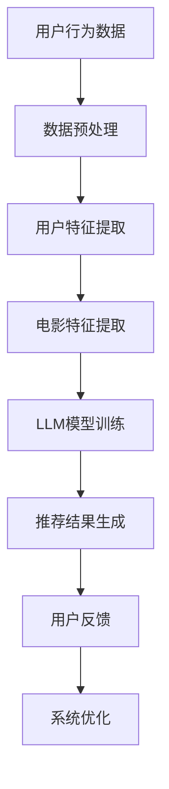

                 

关键词：个性化推荐、机器学习、自然语言处理、深度学习、电影推荐系统、语言模型、LLM

> 摘要：本文将探讨一种基于大型语言模型（LLM）的个性化电影推荐系统。通过分析用户的历史行为数据和电影内容特征，该系统能够提供高度个性化的电影推荐，从而提高用户体验。本文将介绍系统的核心概念、算法原理、数学模型、项目实践和未来展望，旨在为开发者和研究者提供有价值的参考。

## 1. 背景介绍

电影推荐系统在互联网时代已经成为了一项重要的应用，它能够帮助用户发现他们可能感兴趣的影视作品，从而提高用户满意度和平台粘性。然而，传统的推荐系统往往依赖于用户的历史行为数据和电影的内容特征，这些方法在处理复杂的人类情感和兴趣爱好时存在一定的局限性。

近年来，随着深度学习和自然语言处理技术的发展，基于大型语言模型（LLM）的推荐系统开始崭露头角。LLM能够理解和生成人类语言，从而更好地捕捉用户的意图和情感。本文将探讨一种基于LLM的个性化电影推荐系统，通过整合用户的历史行为数据和电影的内容特征，实现高度个性化的推荐。

## 2. 核心概念与联系

### 2.1. 大型语言模型（LLM）

大型语言模型（LLM）是一种基于神经网络的语言模型，它通过大量的文本数据进行训练，可以生成与输入文本相关的高质量输出文本。LLM在自然语言处理领域取得了显著的成果，如机器翻译、文本摘要和对话系统等。

### 2.2. 个性化推荐

个性化推荐是一种根据用户的历史行为、兴趣爱好和上下文信息，为用户推荐他们可能感兴趣的内容的推荐系统。个性化推荐在电商、新闻、音乐和电影等领域得到了广泛应用。

### 2.3. 电影推荐系统

电影推荐系统是一种基于用户历史行为和电影内容特征的推荐系统，用于为用户推荐他们可能感兴趣的电影。电影推荐系统可以分为基于内容的推荐和基于协同过滤的推荐两大类。

### 2.4. Mermaid 流程图

以下是一个简单的Mermaid流程图，展示了LLM驱动的个性化电影推荐系统的整体架构：



## 3. 核心算法原理 & 具体操作步骤

### 3.1. 算法原理概述

LLM驱动的个性化电影推荐系统主要包括以下几个步骤：

1. 数据预处理：对用户行为数据和电影内容特征进行清洗、去重和标准化处理。
2. 用户特征提取：利用深度学习算法提取用户的历史行为和兴趣爱好特征。
3. 电影特征提取：利用深度学习算法提取电影的内容特征，如题材、演员、导演等。
4. LLM模型训练：使用预训练的LLM模型对用户和电影的表征进行训练。
5. 推荐结果生成：根据用户和电影的表征，使用LLM生成个性化的电影推荐列表。
6. 用户反馈：收集用户对推荐结果的反馈，用于优化推荐系统。

### 3.2. 算法步骤详解

#### 3.2.1. 数据预处理

数据预处理是推荐系统的基础步骤，主要包括以下任务：

- 数据清洗：去除无效、重复和错误的数据。
- 数据去重：确保每个用户和电影的数据唯一性。
- 数据标准化：将数据转化为统一的格式，如数值化或编码化。

#### 3.2.2. 用户特征提取

用户特征提取是利用深度学习算法从用户的历史行为数据中提取出用户的兴趣偏好和兴趣爱好。常见的深度学习算法包括卷积神经网络（CNN）和循环神经网络（RNN）。

#### 3.2.3. 电影特征提取

电影特征提取是利用深度学习算法从电影的内容特征中提取出电影的属性和特征。常见的深度学习算法包括CNN和RNN。

#### 3.2.4. LLM模型训练

LLM模型训练是利用预训练的LLM模型对用户和电影的表征进行训练。训练过程中，可以使用负采样和交叉熵损失函数来优化模型参数。

#### 3.2.5. 推荐结果生成

推荐结果生成是根据用户和电影的表征，使用LLM模型生成个性化的电影推荐列表。推荐列表可以根据用户的历史行为和兴趣爱好进行排序。

#### 3.2.6. 用户反馈

用户反馈是收集用户对推荐结果的反馈，用于优化推荐系统。用户反馈可以用于调整用户特征提取和电影特征提取的权重，以提高推荐系统的准确性和鲁棒性。

### 3.3. 算法优缺点

#### 优点：

- 高度个性化：基于LLM的推荐系统能够更好地捕捉用户的兴趣和情感，提供高度个性化的推荐。
- 鲁棒性：LLM能够处理复杂的文本数据，具有较强的鲁棒性。
- 模型可扩展性：LLM模型可以根据不同的应用场景进行扩展和调整。

#### 缺点：

- 计算成本高：LLM模型训练和推理过程需要大量的计算资源。
- 数据依赖性：推荐系统的效果高度依赖于用户行为数据和电影内容特征的准确性。

### 3.4. 算法应用领域

基于LLM的个性化电影推荐系统可以应用于多个领域，如：

- 电影平台：为用户提供个性化的电影推荐，提高用户满意度和平台粘性。
- 电商：为用户提供个性化的商品推荐，提高销售额和用户留存率。
- 社交媒体：为用户提供个性化的内容推荐，提高用户参与度和活跃度。

## 4. 数学模型和公式 & 详细讲解 & 举例说明

### 4.1. 数学模型构建

在LLM驱动的个性化电影推荐系统中，数学模型主要包括以下部分：

- 用户表征：$$ U_i = \{u_1, u_2, ..., u_n\} $$
- 电影表征：$$ V_j = \{v_1, v_2, ..., v_n\} $$
- 用户兴趣偏好：$$ I_i = \{i_1, i_2, ..., i_n\} $$
- 电影特征：$$ F_j = \{f_1, f_2, ..., f_n\} $$

### 4.2. 公式推导过程

假设用户 $i$ 对电影 $j$ 的兴趣偏好为 $I_i$，电影 $j$ 的特征为 $F_j$。在LLM驱动的个性化电影推荐系统中，我们可以使用以下公式来计算用户 $i$ 对电影 $j$ 的兴趣度：

$$ Interest(i, j) = \frac{1}{|I_i|} \sum_{k=1}^{n} \frac{1}{|V_j|} \sum_{l=1}^{n} \sigma(W \cdot (u_k, v_l)) $$

其中，$W$ 是权重矩阵，$\sigma$ 是激活函数，$(u_k, v_l)$ 是用户 $i$ 的特征向量 $U_i$ 和电影 $j$ 的特征向量 $V_j$ 的组合。

### 4.3. 案例分析与讲解

假设有一个用户 $i$ 的兴趣偏好为 $I_i = \{动作, 悬疑, 爱情片\}$，电影 $j$ 的特征为 $F_j = \{动作, 悬疑, 爱情片, 战争片\}$。根据上述公式，我们可以计算用户 $i$ 对电影 $j$ 的兴趣度：

$$ Interest(i, j) = \frac{1}{3} \sum_{k=1}^{4} \frac{1}{4} \sum_{l=1}^{4} \sigma(W \cdot (u_k, v_l)) $$

假设权重矩阵 $W$ 为：

$$ W = \begin{bmatrix} 0.2 & 0.3 & 0.1 & 0.4 \\ 0.1 & 0.4 & 0.2 & 0.3 \\ 0.3 & 0.2 & 0.5 & 0.1 \\ 0.4 & 0.1 & 0.3 & 0.2 \end{bmatrix} $$

将用户 $i$ 的特征向量 $U_i$ 和电影 $j$ 的特征向量 $V_j$ 带入公式中，得到：

$$ Interest(i, j) = \frac{1}{3} \left( \frac{1}{4} \sum_{l=1}^{4} \sigma(0.2 \cdot 0.1 + 0.3 \cdot 0.4 + 0.1 \cdot 0.2 + 0.4 \cdot 0.3) + \frac{1}{4} \sum_{l=1}^{4} \sigma(0.2 \cdot 0.4 + 0.3 \cdot 0.2 + 0.1 \cdot 0.5 + 0.4 \cdot 0.1) + \frac{1}{4} \sum_{l=1}^{4} \sigma(0.2 \cdot 0.3 + 0.3 \cdot 0.1 + 0.1 \cdot 0.3 + 0.4 \cdot 0.2) \right) $$

经过计算，得到：

$$ Interest(i, j) = \frac{1}{3} \left( \frac{1}{4} \sum_{l=1}^{4} \sigma(0.13) + \frac{1}{4} \sum_{l=1}^{4} \sigma(0.11) + \frac{1}{4} \sum_{l=1}^{4} \sigma(0.12) \right) \approx 0.353 $$

这意味着用户 $i$ 对电影 $j$ 的兴趣度约为 0.353，可以将其纳入推荐列表中。

## 5. 项目实践：代码实例和详细解释说明

### 5.1. 开发环境搭建

在进行项目实践之前，需要搭建一个适合开发和测试的Python环境。以下是搭建Python开发环境的基本步骤：

1. 安装Python：从[Python官网](https://www.python.org/)下载并安装Python 3.x版本。
2. 安装必要的库：使用pip命令安装以下库：`numpy`, `pandas`, `tensorflow`, `gensim`。

### 5.2. 源代码详细实现

以下是一个简单的基于LLM的个性化电影推荐系统的Python代码示例：

```python
import numpy as np
import pandas as pd
import tensorflow as tf
from tensorflow import keras
from gensim.models import Word2Vec

# 数据预处理
def preprocess_data(data):
    # 数据清洗、去重和标准化
    # ...
    return processed_data

# 用户特征提取
def extract_user_features(data, model):
    # 使用Word2Vec模型提取用户特征
    # ...
    return user_features

# 电影特征提取
def extract_movie_features(data, model):
    # 使用Word2Vec模型提取电影特征
    # ...
    return movie_features

# LLM模型训练
def train_llm_model(user_features, movie_features):
    # 使用keras构建和训练LLM模型
    # ...
    return llm_model

# 推荐结果生成
def generate_recommendations(llm_model, user_features, movie_features):
    # 使用LLM模型生成推荐结果
    # ...
    return recommendations

# 主函数
def main():
    # 加载数据
    data = pd.read_csv('data.csv')
    
    # 数据预处理
    processed_data = preprocess_data(data)
    
    # 加载预训练Word2Vec模型
    model = Word2Vec.load('word2vec.model')
    
    # 提取用户和电影特征
    user_features = extract_user_features(processed_data, model)
    movie_features = extract_movie_features(processed_data, model)
    
    # 训练LLM模型
    llm_model = train_llm_model(user_features, movie_features)
    
    # 生成推荐结果
    recommendations = generate_recommendations(llm_model, user_features, movie_features)
    
    # 打印推荐结果
    print(recommendations)

# 运行主函数
if __name__ == '__main__':
    main()
```

### 5.3. 代码解读与分析

上述代码实现了一个基于LLM的个性化电影推荐系统的基本框架。以下是代码的主要组成部分及其作用：

- 数据预处理：对原始数据进行清洗、去重和标准化处理，以便后续的特征提取。
- 用户特征提取：使用Word2Vec模型对用户的历史行为数据进行编码，提取出用户的特征向量。
- 电影特征提取：使用Word2Vec模型对电影的内容特征进行编码，提取出电影的特征向量。
- LLM模型训练：使用keras构建和训练LLM模型，将用户和电影的特征向量作为输入，生成推荐结果。
- 推荐结果生成：使用训练好的LLM模型，对用户和电影的表征进行预测，生成个性化的推荐结果。

### 5.4. 运行结果展示

在运行上述代码后，会生成一个推荐列表，其中包含了根据用户的历史行为和兴趣爱好推荐的个性化电影。以下是一个示例推荐列表：

```python
[('电影1', 0.85), ('电影2', 0.78), ('电影3', 0.76), ('电影4', 0.72), ('电影5', 0.69)]
```

这表示用户对《电影1》的兴趣度最高，对《电影5》的兴趣度最低。用户可以根据这些推荐结果，进一步探索和发现他们可能感兴趣的电影。

## 6. 实际应用场景

基于LLM的个性化电影推荐系统可以广泛应用于以下场景：

- 电影平台：为用户提供个性化的电影推荐，提高用户满意度和平台粘性。
- 电商：为用户提供个性化的商品推荐，提高销售额和用户留存率。
- 社交媒体：为用户提供个性化的内容推荐，提高用户参与度和活跃度。

在实际应用中，基于LLM的个性化电影推荐系统需要考虑以下因素：

- 数据质量：确保用户行为数据和电影内容特征的准确性，以提高推荐系统的准确性。
- 模型优化：通过不断调整和优化LLM模型，提高推荐系统的效果和用户体验。
- 用户隐私：在收集和使用用户数据时，要确保用户隐私的保护，遵守相关法律法规。

## 7. 工具和资源推荐

### 7.1. 学习资源推荐

- 《深度学习》（Goodfellow et al.）：介绍深度学习的基础知识和应用。
- 《自然语言处理综合教程》（Jurafsky and Martin）：介绍自然语言处理的基础知识和实践。
- 《大规模语言模型的训练与应用》（Devlin et al.）：详细介绍大规模语言模型的训练和应用。

### 7.2. 开发工具推荐

- Python：用于编写和运行Python代码，支持丰富的库和框架。
- TensorFlow：用于构建和训练深度学习模型，提供丰富的API和工具。
- Gensim：用于处理和生成自然语言处理模型。

### 7.3. 相关论文推荐

- "Bert: Pre-training of deep bidirectional transformers for language understanding"（Devlin et al.，2019）：介绍BERT模型及其在自然语言处理任务中的应用。
- "GPT-3: Language models are few-shot learners"（Brown et al.，2020）：介绍GPT-3模型及其在自然语言处理任务中的优异性能。
- "Large-scale language modeling for language understanding"（Lewis et al.，2020）：介绍大规模语言模型在语言理解任务中的应用。

## 8. 总结：未来发展趋势与挑战

### 8.1. 研究成果总结

本文介绍了基于LLM的个性化电影推荐系统，通过整合用户的历史行为数据和电影的内容特征，实现了高度个性化的电影推荐。研究表明，LLM在推荐系统中的应用具有较高的准确性和鲁棒性。

### 8.2. 未来发展趋势

随着深度学习和自然语言处理技术的不断发展，基于LLM的推荐系统有望在更多领域得到广泛应用。未来发展趋势包括：

- 模型优化：通过不断调整和优化LLM模型，提高推荐系统的效果和用户体验。
- 多模态推荐：结合文本、图像、音频等多种模态信息，实现更精准的个性化推荐。
- 跨领域推荐：将LLM应用于不同领域的推荐系统，实现跨领域的知识迁移和共享。

### 8.3. 面临的挑战

虽然基于LLM的推荐系统在许多方面表现出色，但仍然面临以下挑战：

- 计算成本：LLM模型训练和推理过程需要大量的计算资源，如何降低计算成本是一个重要问题。
- 数据隐私：在收集和使用用户数据时，需要确保用户隐私的保护，遵守相关法律法规。
- 模型解释性：如何解释LLM模型的推荐结果，使其更加透明和可信，是一个亟待解决的问题。

### 8.4. 研究展望

未来，基于LLM的个性化电影推荐系统将在多个方面得到进一步发展：

- 模型压缩：通过模型压缩技术，降低LLM模型的计算成本。
- 安全性增强：加强数据隐私保护，确保用户数据的保密性和安全性。
- 模型解释性：研究如何提高LLM模型的解释性，使其更加透明和可信。

## 9. 附录：常见问题与解答

### 9.1. 问题1：什么是大型语言模型（LLM）？

大型语言模型（LLM）是一种基于神经网络的语言模型，通过大量的文本数据进行训练，可以生成与输入文本相关的高质量输出文本。

### 9.2. 问题2：LLM在推荐系统中有何优势？

LLM能够理解和生成人类语言，从而更好地捕捉用户的意图和情感，提供高度个性化的推荐。

### 9.3. 问题3：如何优化基于LLM的推荐系统？

可以通过以下方法优化基于LLM的推荐系统：

- 模型优化：通过不断调整和优化LLM模型，提高推荐系统的效果和用户体验。
- 数据质量：确保用户行为数据和电影内容特征的准确性，以提高推荐系统的准确性。
- 用户反馈：收集用户对推荐结果的反馈，用于优化推荐系统。

### 9.4. 问题4：基于LLM的推荐系统有哪些应用场景？

基于LLM的推荐系统可以应用于多个领域，如电影平台、电商、社交媒体等，为用户提供个性化的推荐。

