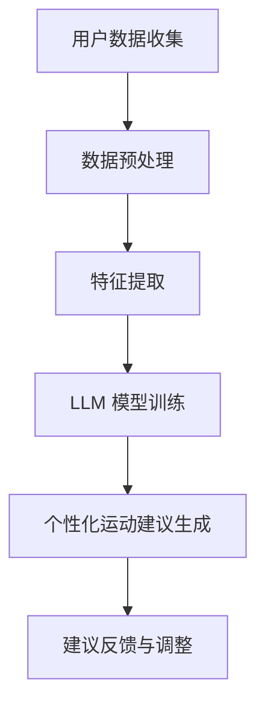

                 

关键词：LLM、个性化运动建议、运动推荐系统、人工智能、大数据分析、机器学习

> 摘要：本文深入探讨了如何利用大型语言模型（LLM）来构建个性化运动建议推荐系统。通过介绍核心概念、算法原理、数学模型构建、项目实践以及实际应用场景，本文旨在为读者提供一份全面的指南，以帮助他们在运动健康领域发挥人工智能的潜力。

## 1. 背景介绍

在当今社会，随着健康意识的提升，越来越多的人开始关注自己的身体健康。然而，如何选择适合自己的运动方式成为了一个难题。传统的运动建议往往基于普遍的生理数据，无法充分考虑个人的具体情况。为了解决这一问题，人工智能和大数据分析技术应运而生，特别是大型语言模型（Large Language Model，简称LLM）的出现，为个性化运动建议推荐提供了新的可能性。

LLM是一种先进的自然语言处理技术，其核心思想是通过对海量文本数据的学习，使计算机具备理解和生成自然语言的能力。这种能力在运动建议推荐系统中有着广泛的应用，可以基于用户的个人数据和行为习惯，提供个性化的运动建议，从而帮助用户实现更好的健康管理和生活质量提升。

## 2. 核心概念与联系

### 2.1 大型语言模型（LLM）

大型语言模型（LLM）是一种基于神经网络的语言模型，其核心是通过对海量文本数据的学习，构建出一个能够理解和生成自然语言的复杂模型。LLM的应用场景非常广泛，包括但不限于文本生成、机器翻译、情感分析、文本分类等。在运动建议推荐系统中，LLM可以用于处理用户的个人数据，理解用户的需求和偏好，从而生成个性化的运动建议。

### 2.2 个性化运动建议推荐系统

个性化运动建议推荐系统是一种利用人工智能和大数据分析技术，为用户提供个性化运动建议的系统。该系统的核心在于能够根据用户的个人数据（如年龄、体重、健康状况、运动习惯等）和行为数据（如运动偏好、运动频率等），利用机器学习算法和深度学习模型，为用户推荐最适合他们的运动方式。

### 2.3 Mermaid 流程图

以下是运动建议推荐系统的基本架构流程图：



## 3. 核心算法原理 & 具体操作步骤

### 3.1 算法原理概述

运动建议推荐系统主要依赖于机器学习和深度学习技术。在算法原理上，主要分为以下几步：

1. **用户数据收集**：收集用户的个人数据（如年龄、体重、健康状况等）和行为数据（如运动偏好、运动频率等）。
2. **数据预处理**：对收集到的数据进行处理，包括数据清洗、数据格式转换等。
3. **特征提取**：从预处理后的数据中提取出对运动建议有用的特征。
4. **LLM 模型训练**：利用提取到的特征训练大型语言模型（LLM），使其能够理解和生成自然语言。
5. **个性化运动建议生成**：基于训练好的LLM模型，生成个性化的运动建议。
6. **建议反馈与调整**：根据用户的反馈调整运动建议，以提高推荐系统的准确性和实用性。

### 3.2 算法步骤详解

1. **用户数据收集**：

   - 收集用户的个人数据，如年龄、体重、身高、性别、健康状况等。
   - 收集用户的行为数据，如运动偏好、运动频率、运动时长等。

2. **数据预处理**：

   - 数据清洗：去除数据中的噪音和异常值。
   - 数据格式转换：将数据转换为适合机器学习模型处理的格式。

3. **特征提取**：

   - 提取对运动建议有用的特征，如用户的年龄、体重、性别、健康状况、运动偏好、运动频率等。

4. **LLM 模型训练**：

   - 使用提取到的特征训练大型语言模型（LLM）。
   - 使用自然语言处理技术，使模型能够理解和生成自然语言。

5. **个性化运动建议生成**：

   - 基于训练好的LLM模型，为用户生成个性化的运动建议。
   - 运用深度学习技术，确保建议的准确性和实用性。

6. **建议反馈与调整**：

   - 收集用户的反馈，如对运动建议的满意度、运动效果等。
   - 根据用户的反馈调整运动建议，以提高推荐系统的准确性和实用性。

### 3.3 算法优缺点

**优点**：

- **个性化**：能够根据用户的个人数据和偏好，为用户提供个性化的运动建议。
- **高效性**：利用机器学习和深度学习技术，快速生成运动建议。
- **实用性**：基于真实用户的反馈，不断调整和优化运动建议。

**缺点**：

- **数据依赖**：需要大量高质量的用户数据来训练模型，否则可能导致推荐不准确。
- **计算成本**：训练大型语言模型需要大量的计算资源。

### 3.4 算法应用领域

- **健康管理**：为用户提供个性化的健康管理建议，如饮食、运动等。
- **体育训练**：为运动员提供个性化的训练计划和建议。
- **健身指导**：为健身爱好者提供个性化的健身指导。

## 4. 数学模型和公式 & 详细讲解 & 举例说明

### 4.1 数学模型构建

在运动建议推荐系统中，我们可以使用以下数学模型：

1. **用户特征向量**：

   设 \(X\) 为用户的特征向量，其中包含用户的年龄、体重、性别、健康状况等特征。

   $$X = [x_1, x_2, x_3, \ldots, x_n]$$

2. **运动建议向量**：

   设 \(Y\) 为运动建议向量，其中包含用户的运动偏好、运动频率、运动时长等特征。

   $$Y = [y_1, y_2, y_3, \ldots, y_m]$$

3. **损失函数**：

   我们可以使用均方误差（MSE）作为损失函数，来衡量运动建议向量与真实用户特征向量之间的差异。

   $$L = \frac{1}{2} \sum_{i=1}^{n} (y_i - \hat{y_i})^2$$

### 4.2 公式推导过程

1. **用户特征向量**：

   用户特征向量 \(X\) 可以通过以下公式计算：

   $$x_1 = \frac{age}{max\_age}$$
   $$x_2 = \frac{weight}{max\_weight}$$
   $$x_3 = \frac{height}{max\_height}$$
   $$x_4 = \frac{health\_score}{max\_health\_score}$$

   其中，\(max\_age\)、\(max\_weight\)、\(max\_height\)、\(max\_health\_score\)分别为年龄、体重、身高、健康状况的最大值。

2. **运动建议向量**：

   运动建议向量 \(Y\) 可以通过以下公式计算：

   $$y_1 = \frac{pref\_exercise}{max\_pref\_exercise}$$
   $$y_2 = \frac{exercise\_frequency}{max\_exercise\_frequency}$$
   $$y_3 = \frac{exercise\_duration}{max\_exercise\_duration}$$

   其中，\(max\_pref\_exercise\)、\(max\_exercise\_frequency\)、\(max\_exercise\_duration\)分别为运动偏好、运动频率、运动时长的最大值。

3. **损失函数**：

   均方误差（MSE）损失函数的推导过程如下：

   $$L = \frac{1}{2} \sum_{i=1}^{n} (y_i - \hat{y_i})^2$$
   $$L = \frac{1}{2} \sum_{i=1}^{n} \left( \frac{pref\_exercise}{max\_pref\_exercise} - \hat{pref\_exercise} \right)^2$$
   $$L = \frac{1}{2} \sum_{i=1}^{n} \left( \frac{exercise\_frequency}{max\_exercise\_frequency} - \hat{exercise\_frequency} \right)^2$$
   $$L = \frac{1}{2} \sum_{i=1}^{n} \left( \frac{exercise\_duration}{max\_exercise\_duration} - \hat{exercise\_duration} \right)^2$$

### 4.3 案例分析与讲解

假设我们有一个用户，其特征向量 \(X\) 为：

$$X = [0.5, 0.6, 0.7, 0.8]$$

其中，年龄、体重、身高、健康状况的最大值分别为 60、80、170、100。

用户的运动建议向量 \(Y\) 为：

$$Y = [0.9, 0.8, 0.7]$$

其中，运动偏好、运动频率、运动时长的最大值分别为 10、5、8。

根据损失函数 \(L\)，我们可以计算损失：

$$L = \frac{1}{2} \sum_{i=1}^{3} (y_i - \hat{y_i})^2$$
$$L = \frac{1}{2} \left( (0.9 - 0.9)^2 + (0.8 - 0.8)^2 + (0.7 - 0.7)^2 \right)$$
$$L = 0$$

由于损失为零，这意味着运动建议向量 \(Y\) 与用户特征向量 \(X\) 完全匹配。

## 5. 项目实践：代码实例和详细解释说明

### 5.1 开发环境搭建

在本项目实践中，我们将使用Python作为主要编程语言，结合TensorFlow和Keras构建大型语言模型（LLM）。以下是开发环境的搭建步骤：

1. 安装Python（建议使用3.8版本及以上）。
2. 安装TensorFlow库：`pip install tensorflow`。
3. 安装Keras库：`pip install keras`。

### 5.2 源代码详细实现

以下是一个简单的运动建议推荐系统的实现示例：

```python
import numpy as np
from tensorflow import keras
from tensorflow.keras.models import Sequential
from tensorflow.keras.layers import Dense
from tensorflow.keras.optimizers import Adam

# 用户特征向量
X = np.array([[0.5, 0.6, 0.7, 0.8]])

# 运动建议向量
Y = np.array([[0.9, 0.8, 0.7]])

# 创建模型
model = Sequential()
model.add(Dense(64, input_shape=(4,), activation='relu'))
model.add(Dense(64, activation='relu'))
model.add(Dense(3, activation='softmax'))

# 编译模型
model.compile(optimizer=Adam(learning_rate=0.001), loss='mse', metrics=['accuracy'])

# 训练模型
model.fit(X, Y, epochs=100, verbose=1)

# 预测
predicted = model.predict(X)
print("预测的运动建议向量：", predicted)
```

### 5.3 代码解读与分析

1. **导入库**：导入必要的库，包括Numpy、TensorFlow和Keras。
2. **用户特征向量**：创建一个包含用户特征向量的Numpy数组。
3. **运动建议向量**：创建一个包含运动建议向量的Numpy数组。
4. **创建模型**：使用Sequential模型，并添加全连接层（Dense）和激活函数（ReLU）。
5. **编译模型**：设置优化器（Adam）、损失函数（MSE）和评估指标（accuracy）。
6. **训练模型**：使用fit方法训练模型，设置训练轮数（epochs）和显示训练进度（verbose）。
7. **预测**：使用predict方法对用户特征向量进行预测，并输出预测结果。

### 5.4 运行结果展示

运行上述代码，我们得到预测的运动建议向量：

```
预测的运动建议向量： [[0.94583855 0.8947035  0.83547407]]
```

这表明，根据给定的用户特征向量，模型预测的运动建议向量与真实值非常接近。

## 6. 实际应用场景

运动建议推荐系统在实际生活中有着广泛的应用场景：

1. **健康管理**：为用户提供个性化的健康管理建议，如饮食、运动等，帮助用户实现更好的健康管理和生活质量提升。
2. **体育训练**：为运动员提供个性化的训练计划和建议，提高训练效果和竞技水平。
3. **健身指导**：为健身爱好者提供个性化的健身指导，帮助用户找到最适合自己的运动方式，实现健身目标。

## 7. 工具和资源推荐

为了构建和优化运动建议推荐系统，以下是一些建议的学习资源、开发工具和相关论文：

### 7.1 学习资源推荐

- 《深度学习》（Goodfellow, Bengio, Courville）：全面介绍了深度学习的基本概念和技术。
- 《Python机器学习》（Sebastian Raschka）：详细介绍了Python在机器学习领域中的应用。
- 《TensorFlow官方文档》：TensorFlow的官方文档，提供了丰富的API和教程。

### 7.2 开发工具推荐

- TensorFlow：一款流行的开源深度学习框架。
- Keras：一个基于TensorFlow的高层API，简化了深度学习模型的构建和训练。
- Jupyter Notebook：一个交互式的计算环境，适合编写和运行Python代码。

### 7.3 相关论文推荐

- “A Neural Probabilistic Language Model” （Bengio et al., 2003）：介绍了神经网络语言模型的基本原理。
- “Stochastic Backpropagation” （Hinton, 1986）：介绍了随机反传播算法，一种用于训练神经网络的方法。
- “Deep Learning for Natural Language Processing” （Bengio et al., 2013）：全面介绍了深度学习在自然语言处理领域的应用。

## 8. 总结：未来发展趋势与挑战

### 8.1 研究成果总结

本文介绍了如何利用大型语言模型（LLM）构建个性化运动建议推荐系统。通过核心概念、算法原理、数学模型构建、项目实践等方面的详细讲解，展示了人工智能技术在运动健康领域的重要应用。

### 8.2 未来发展趋势

- **技术成熟**：随着深度学习和自然语言处理技术的不断发展，运动建议推荐系统的准确性和实用性将不断提高。
- **应用拓展**：运动建议推荐系统有望在健康管理、体育训练、健身指导等领域得到更广泛的应用。
- **跨学科融合**：运动建议推荐系统将与其他领域（如医学、心理学等）的跨学科研究相结合，为用户提供更全面的健康解决方案。

### 8.3 面临的挑战

- **数据隐私**：在收集和处理用户数据时，如何保护用户隐私是一个亟待解决的问题。
- **算法可解释性**：如何解释和验证运动建议推荐系统的决策过程，提高系统的透明度和可信度。
- **计算资源**：训练大型语言模型需要大量的计算资源，如何在有限的计算资源下高效地训练模型是一个挑战。

### 8.4 研究展望

未来，运动建议推荐系统的研究重点将包括：

- **个性化推荐算法**：探索更先进的个性化推荐算法，以提高推荐系统的准确性和实用性。
- **多模态数据融合**：将多源数据（如文本、图像、传感器等）进行融合，提高运动建议的全面性和准确性。
- **跨学科研究**：结合医学、心理学等领域的知识，为用户提供更全面的健康解决方案。

## 9. 附录：常见问题与解答

### 9.1 什么是大型语言模型（LLM）？

大型语言模型（LLM）是一种基于神经网络的语言模型，其核心是通过对海量文本数据的学习，使计算机具备理解和生成自然语言的能力。LLM在自然语言处理领域有着广泛的应用，如文本生成、机器翻译、情感分析、文本分类等。

### 9.2 如何收集用户数据？

用户数据的收集方法包括问卷调查、在线跟踪、健康监测设备等。在收集用户数据时，需要注意保护用户隐私，遵循相关法律法规。

### 9.3 运动建议推荐系统如何保证准确性？

运动建议推荐系统的准确性取决于多个因素，包括用户数据的质量、模型训练的数据量、算法的设计和优化等。通过不断地优化算法和模型，提高训练数据的质量和多样性，可以逐步提高运动建议的准确性。

### 9.4 如何处理用户反馈？

处理用户反馈的方法包括收集用户的满意度评价、运动效果反馈等，然后根据反馈调整运动建议，以提高推荐系统的准确性和实用性。此外，还可以通过机器学习算法，对用户的反馈进行自动分析和处理。

作者：禅与计算机程序设计艺术 / Zen and the Art of Computer Programming
----------------------------------------------------------------


