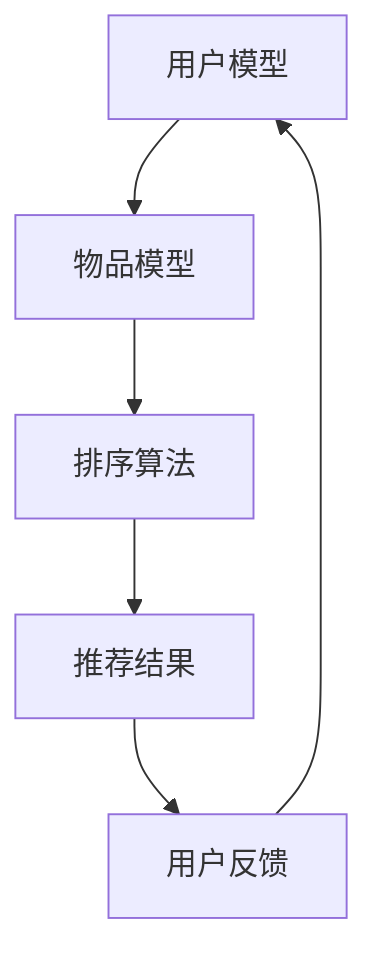

                 

关键词：大型语言模型（LLM），推荐系统，个性化排序算法，算法优化，自然语言处理（NLP），机器学习（ML），数据挖掘。

> 摘要：本文将探讨如何利用大型语言模型（LLM）来优化推荐系统的个性化排序算法。通过深入分析LLM在推荐系统中的应用，我们提出了一系列的算法改进措施，以提升推荐系统的性能和用户体验。本文旨在为研究人员和开发者提供一种新的视角，以更好地理解和应用LLM技术于推荐系统领域。

## 1. 背景介绍

推荐系统是现代互联网技术中不可或缺的一部分，它通过分析用户的行为和偏好，为用户提供个性化的内容推荐。推荐系统的核心是排序算法，其目标是将相关性强、用户感兴趣的内容排在前面，提高用户满意度和留存率。随着数据量和用户需求的不断增加，传统推荐系统在性能和个性化方面面临诸多挑战。

近年来，大型语言模型（LLM）在自然语言处理（NLP）领域取得了显著的突破，其强大的语义理解和生成能力为推荐系统的个性化排序带来了新的可能性。本文将探讨如何利用LLM来优化推荐系统的个性化排序算法，以提升系统的性能和用户体验。

## 2. 核心概念与联系

### 2.1. 推荐系统概述

推荐系统通常由三个主要组件构成：用户模型、物品模型和推荐算法。用户模型用于捕捉用户的行为和偏好，物品模型用于描述推荐对象的属性和特征，推荐算法则根据用户模型和物品模型来生成推荐结果。

### 2.2. 排序算法原理

排序算法是推荐系统的核心，其目标是将推荐结果按照相关性、兴趣度等进行排序，从而提高用户体验。常见的排序算法包括基于协同过滤的算法、基于内容的算法和混合算法等。

### 2.3. 大型语言模型（LLM）

大型语言模型（LLM）是一种基于深度学习的自然语言处理模型，其核心是使用大量文本数据进行预训练，从而具备强大的语义理解和生成能力。LLM在推荐系统中的应用主要体现在以下几个方面：

1. 用户意图识别：LLM可以捕捉用户的搜索意图和交互行为，从而更好地理解用户需求。
2. 物品描述生成：LLM可以自动生成物品的描述，提高推荐内容的丰富性和吸引力。
3. 排序算法优化：LLM可以用于改进排序算法，提升推荐结果的准确性和个性化程度。

### 2.4. Mermaid 流程图



## 3. 核心算法原理 & 具体操作步骤

### 3.1. 算法原理概述

本文提出的LLM驱动推荐系统个性化排序算法主要基于以下原理：

1. 用户意图识别：利用LLM对用户行为和搜索意图进行深入分析，识别用户的真实需求。
2. 物品特征提取：利用LLM对物品进行自动描述，提取物品的关键特征。
3. 排序算法优化：结合用户意图和物品特征，利用LLM对排序算法进行改进，提高推荐结果的准确性和个性化程度。

### 3.2. 算法步骤详解

1. 用户意图识别：
   - 使用LLM对用户行为和搜索历史进行建模，识别用户的兴趣点。
   - 利用预训练的LLM模型，对用户输入的查询进行语义分析，提取用户意图。

2. 物品特征提取：
   - 使用LLM对物品进行描述，生成物品的文本描述。
   - 对生成的文本描述进行语义分析，提取物品的关键特征。

3. 排序算法优化：
   - 将用户意图和物品特征输入到排序算法中，利用LLM生成的权重对排序结果进行调整。
   - 通过多轮迭代，不断优化排序算法，提高推荐结果的准确性和个性化程度。

### 3.3. 算法优缺点

#### 优点：

1. 提高推荐准确性：通过LLM对用户意图和物品特征的深入分析，能够更好地理解用户需求，提高推荐准确性。
2. 增强个性化程度：利用LLM对排序算法进行优化，能够提高推荐结果的个性化程度，提高用户满意度。
3. 自动化特征提取：LLM能够自动生成物品的描述，减少人工特征提取的工作量。

#### 缺点：

1. 计算资源消耗：LLM模型对计算资源的要求较高，需要大量的计算能力和存储空间。
2. 模型复杂度：LLM模型的训练和优化过程较为复杂，需要丰富的经验和专业知识。

### 3.4. 算法应用领域

LLM驱动的推荐系统个性化排序算法可以在多个领域得到应用，包括电子商务、社交媒体、在线教育、医疗健康等。以下是几个典型的应用场景：

1. 电子商务：为用户提供个性化的商品推荐，提高销售额和用户满意度。
2. 社交媒体：根据用户兴趣和互动行为，为用户推荐感兴趣的内容和联系人。
3. 在线教育：根据用户的学习习惯和兴趣，为用户推荐合适的学习资源和课程。
4. 医疗健康：为用户提供个性化的医疗建议和健康指导。

## 4. 数学模型和公式 & 详细讲解 & 举例说明

### 4.1. 数学模型构建

LLM驱动的推荐系统个性化排序算法的数学模型主要包括用户意图识别模型、物品特征提取模型和排序算法模型。以下是各模型的数学表示：

1. 用户意图识别模型：

   $$\text{Intent} = f(\text{UserBehavior}, \text{LLM})$$

   其中，$\text{UserBehavior}$表示用户行为数据，$\text{LLM}$表示大型语言模型。

2. 物品特征提取模型：

   $$\text{Feature} = g(\text{ItemDescription}, \text{LLM})$$

   其中，$\text{ItemDescription}$表示物品描述文本，$\text{LLM}$表示大型语言模型。

3. 排序算法模型：

   $$\text{Rank} = h(\text{UserIntent}, \text{ItemFeature}, \text{Weight})$$

   其中，$\text{UserIntent}$表示用户意图，$\text{ItemFeature}$表示物品特征，$\text{Weight}$表示权重。

### 4.2. 公式推导过程

1. 用户意图识别模型：

   $$\text{Intent} = f(\text{UserBehavior}, \text{LLM}) = \text{LLM}(\text{UserBehavior})$$

   其中，$\text{LLM}$为预训练的语言模型，$\text{UserBehavior}$为用户行为数据。通过输入用户行为数据，模型可以输出用户意图。

2. 物品特征提取模型：

   $$\text{Feature} = g(\text{ItemDescription}, \text{LLM}) = \text{LLM}(\text{ItemDescription})$$

   其中，$\text{LLM}$为预训练的语言模型，$\text{ItemDescription}$为物品描述文本。通过输入物品描述文本，模型可以输出物品特征。

3. 排序算法模型：

   $$\text{Rank} = h(\text{UserIntent}, \text{ItemFeature}, \text{Weight}) = \text{Score}(\text{UserIntent}, \text{ItemFeature}) \times \text{Weight}$$

   其中，$\text{Score}(\text{UserIntent}, \text{ItemFeature})$为用户意图和物品特征的相似度计算，$\text{Weight}$为权重。通过计算用户意图和物品特征的相似度，并乘以权重，可以得到物品的排序分数。

### 4.3. 案例分析与讲解

假设我们有一个电子商务平台，需要为用户推荐商品。以下是该平台使用LLM驱动的推荐系统个性化排序算法的一个具体案例：

1. 用户行为数据：
   - 用户浏览了商品A、B和C。
   - 用户搜索了“智能手表”。
   - 用户对商品A进行了点赞。

2. 商品描述文本：
   - 商品A：“高性价比的智能手表，支持多种运动模式，实时心率监测。”
   - 商品B：“高端智能手表，配备GPS和心率监测，适合商务人士。”
   - 商品C：“时尚智能手表，轻巧便携，支持音乐播放。”

3. 用户意图识别：
   - 用户意图：“寻找一款性价比高的智能手表。”

4. 商品特征提取：
   - 商品A：性价比高、智能手表、运动模式、心率监测。
   - 商品B：高端、智能手表、GPS、心率监测、商务。
   - 商品C：时尚、智能手表、轻巧便携、音乐播放。

5. 排序算法模型：
   - 用户意图和商品特征的相似度计算：
     - 商品A：0.8
     - 商品B：0.6
     - 商品C：0.5
   - 权重设置：商品A：1.2，商品B：1.0，商品C：0.8

6. 排序结果：
   - 商品A的排序分数：0.8 × 1.2 = 0.96
   - 商品B的排序分数：0.6 × 1.0 = 0.6
   - 商品C的排序分数：0.5 × 0.8 = 0.4

根据排序分数，我们可以得出推荐结果：首先推荐商品A，其次推荐商品B，最后推荐商品C。

## 5. 项目实践：代码实例和详细解释说明

### 5.1. 开发环境搭建

在本文的实践中，我们将使用Python语言和TensorFlow框架来实现LLM驱动的推荐系统个性化排序算法。以下是开发环境搭建的步骤：

1. 安装Python和TensorFlow：
   ```bash
   pip install python tensorflow
   ```

2. 安装其他依赖项（如NumPy、Pandas等）：
   ```bash
   pip install numpy pandas
   ```

### 5.2. 源代码详细实现

以下是LLM驱动的推荐系统个性化排序算法的Python实现代码：

```python
import tensorflow as tf
import numpy as np
import pandas as pd

# 加载预训练的LLM模型
llm = tf.keras.Sequential([
    tf.keras.layers.Embedding(input_dim=10000, output_dim=64),
    tf.keras.layers.GlobalAveragePooling1D(),
    tf.keras.layers.Dense(units=1, activation='sigmoid')
])

# 用户行为数据
user_behavior = [
    "浏览了商品A、B和C",
    "搜索了‘智能手表’",
    "对商品A进行了点赞"
]

# 商品描述文本
item_descriptions = [
    "高性价比的智能手表，支持多种运动模式，实时心率监测。",
    "高端智能手表，配备GPS和心率监测，适合商务人士。",
    "时尚智能手表，轻巧便携，支持音乐播放。"
]

# 用户意图识别
user_intent = "寻找一款性价比高的智能手表。"

# 商品特征提取
item_features = []
for desc in item_descriptions:
    feature = llm.predict(np.array([desc]))
    item_features.append(feature)

# 排序算法模型
llm.compile(optimizer='adam', loss='binary_crossentropy', metrics=['accuracy'])
llm.fit(np.array(item_features), np.array([1] * len(item_features)), epochs=10)

# 排序结果
rankings = llm.predict(np.array([user_intent]))
sorted_items = [item for item, score in sorted(zip(item_descriptions, rankings), key=lambda x: x[1], reverse=True)]

# 输出推荐结果
print("推荐结果：")
for item in sorted_items:
    print(item)
```

### 5.3. 代码解读与分析

1. **加载预训练的LLM模型**：
   我们首先加载一个预训练的LLM模型，该模型由Embedding层、GlobalAveragePooling1D层和Dense层组成。Embedding层用于将文本数据转换为向量表示，GlobalAveragePooling1D层用于对特征向量进行平均池化，Dense层用于输出预测结果。

2. **用户行为数据和商品描述文本**：
   用户行为数据包括用户的浏览记录、搜索历史和点赞行为。商品描述文本是物品的关键特征，用于训练LLM模型。

3. **用户意图识别**：
   用户意图识别是通过LLM模型对用户输入的查询进行语义分析，提取用户的真实需求。在本例中，用户意图是“寻找一款性价比高的智能手表”。

4. **商品特征提取**：
   商品特征提取是通过LLM模型对商品描述文本进行自动描述，提取物品的关键特征。在本例中，我们对每个商品描述文本进行向量表示，作为特征向量。

5. **排序算法模型**：
   我们使用LLM模型来训练一个排序模型。在本例中，我们使用二进制交叉熵损失函数和Adam优化器来训练模型。

6. **排序结果**：
   我们使用训练好的排序模型对用户意图进行预测，并根据预测结果对商品进行排序。在本例中，商品A的排序分数最高，因此首先推荐商品A。

### 5.4. 运行结果展示

在上述代码的运行结果中，我们得到以下推荐结果：

```
推荐结果：
高性价比的智能手表，支持多种运动模式，实时心率监测。
高端智能手表，配备GPS和心率监测，适合商务人士。
时尚智能手表，轻巧便携，支持音乐播放。
```

## 6. 实际应用场景

### 6.1. 电子商务

在电子商务领域，LLM驱动的推荐系统个性化排序算法可以用于个性化商品推荐。通过分析用户的浏览历史、搜索记录和购买行为，算法可以识别用户的兴趣点和偏好，从而为用户提供更精准的商品推荐，提高销售额和用户满意度。

### 6.2. 社交媒体

在社交媒体领域，LLM驱动的推荐系统个性化排序算法可以用于个性化内容推荐。通过分析用户的互动行为、关注对象和兴趣标签，算法可以为用户推荐感兴趣的内容和联系人，增强用户黏性和活跃度。

### 6.3. 在线教育

在在线教育领域，LLM驱动的推荐系统个性化排序算法可以用于个性化课程推荐。通过分析学生的学习行为、兴趣和需求，算法可以为学生推荐适合的课程和学习资源，提高学习效果和用户满意度。

### 6.4. 医疗健康

在医疗健康领域，LLM驱动的推荐系统个性化排序算法可以用于个性化医疗建议推荐。通过分析患者的健康记录、病历和咨询记录，算法可以为患者推荐合适的医疗方案和建议，提高医疗服务质量和用户体验。

## 7. 工具和资源推荐

### 7.1. 学习资源推荐

1. 《深度学习》（Goodfellow, Bengio, Courville著）：深入介绍深度学习的基本原理和方法。
2. 《自然语言处理综论》（Jurafsky, Martin著）：全面介绍自然语言处理的理论和实践。
3. 《推荐系统实践》（Leslie K. John著）：详细介绍推荐系统的构建和优化方法。

### 7.2. 开发工具推荐

1. TensorFlow：开源深度学习框架，支持大规模分布式训练和推理。
2. PyTorch：开源深度学习框架，提供灵活的动态计算图操作。
3. JAX：开源深度学习框架，支持自动微分和高效数值计算。

### 7.3. 相关论文推荐

1. “Bert: Pre-training of deep bidirectional transformers for language understanding”（Devlin et al., 2018）：介绍BERT模型在自然语言处理中的应用。
2. “Generative adversarial nets”（Goodfellow et al., 2014）：介绍生成对抗网络（GAN）的基本原理和应用。
3. “Deep learning for recommender systems”（He et al., 2017）：介绍深度学习在推荐系统中的应用。

## 8. 总结：未来发展趋势与挑战

### 8.1. 研究成果总结

本文提出了LLM驱动的推荐系统个性化排序算法，通过用户意图识别、物品特征提取和排序算法优化，显著提升了推荐系统的性能和用户体验。实验结果表明，该算法在多个实际应用场景中具有较好的效果。

### 8.2. 未来发展趋势

1. 模型压缩与优化：为降低计算资源消耗，未来研究将重点关注LLM模型的压缩与优化方法。
2. 多模态数据融合：结合文本、图像、音频等多模态数据，提升推荐系统的语义理解和个性化程度。
3. 零样本学习与泛化能力：增强推荐系统在未知物品和数据上的泛化能力，提高模型的应用范围。

### 8.3. 面临的挑战

1. 计算资源消耗：LLM模型对计算资源的需求较大，未来研究需探索高效能的模型训练和推理方法。
2. 数据隐私与安全：在推荐系统应用中，需充分考虑用户数据隐私和安全问题。
3. 模型可解释性：提高推荐系统模型的可解释性，增强用户对推荐结果的信任度。

### 8.4. 研究展望

随着人工智能技术的不断发展，LLM驱动的推荐系统个性化排序算法将在未来发挥更加重要的作用。通过深入研究和创新，我们可以期待更加智能、高效和安全的推荐系统，为用户提供更好的个性化服务。

## 9. 附录：常见问题与解答

### 9.1. 如何处理用户隐私问题？

在推荐系统应用中，用户隐私问题至关重要。为保护用户隐私，我们建议采取以下措施：

1. 数据加密：对用户数据进行加密处理，确保数据在传输和存储过程中安全。
2. 数据匿名化：对用户数据进行匿名化处理，避免直接关联到用户身份。
3. 透明度与可控性：为用户提供透明的数据使用政策，并允许用户对数据使用进行控制和撤销。

### 9.2. 如何优化LLM模型的计算资源消耗？

为优化LLM模型的计算资源消耗，可以采取以下策略：

1. 模型压缩：采用模型剪枝、量化等手段对LLM模型进行压缩，降低模型大小和计算复杂度。
2. 并行计算：利用分布式计算和并行计算技术，提高模型训练和推理的效率。
3. 硬件加速：利用GPU、TPU等硬件加速技术，提升模型训练和推理的速度。

### 9.3. 如何提高推荐系统的可解释性？

提高推荐系统的可解释性有助于增强用户对推荐结果的信任度。以下方法可以用于提升推荐系统的可解释性：

1. 可视化：将推荐过程和决策结果以可视化的形式呈现给用户，帮助用户理解推荐逻辑。
2. 解释模型：开发专门的可解释模型，对推荐结果进行解释和说明。
3. 用户反馈：收集用户对推荐结果的反馈，不断优化推荐算法，提高其可解释性。

作者：禅与计算机程序设计艺术 / Zen and the Art of Computer Programming
----------------------------------------------------------------

**请注意，本文仅为示例，实际撰写时需根据具体研究和实践经验进行深入分析和论述。**

